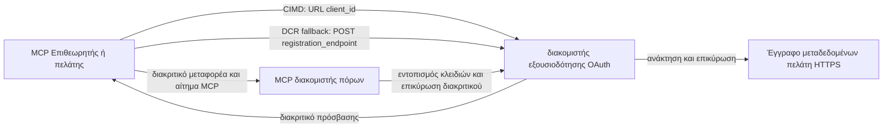

# Παράδειγμα Εξουσιοδότησης CIMD και DCR

Αυτό το παράδειγμα TypeScript συγκρίνει δύο τρόπους με τους οποίους ένας πελάτης OAuth μπορεί να λάβει ταυτότητα
πριν την πρόσβαση σε έναν προστατευμένο διακομιστή MCP:

- **Client ID Metadata Documents (CIMD)** χρησιμοποιούν ένα σταθερό URL HTTPS ως
  `client_id`. Αυτή είναι η προτιμώμενη μέθοδος για πελάτες και διακομιστές εξουσιοδότησης
  που δεν έχουν προϋπάρχουσα σχέση.
- **Dynamic Client Registration (DCR)** ζητά από τον διακομιστή εξουσιοδότησης να δημιουργήσει
  ένα αδιαφανές αναγνωριστικό πελάτη κατά το χρόνο εκτέλεσης. Το MCP `2026-07-28` διατηρεί το DCR
  μόνο για λόγους συμβατότητας προς τα πίσω.

Το παράδειγμα χρησιμοποιεί το σταθερό MCP TypeScript SDK v2 και το άκαμπτο
μοντέλο αιτήσεων MCP `2026-07-28`. Λειτουργεί με έναν εξωτερικό διακομιστή εξουσιοδότησης OAuth 2.1/OpenID
Connect όπως το Auth0. Ο διακομιστής MCP είναι ένας διακομιστής πόρων:
επικυρώνει τα access tokens αλλά δεν αυθεντικοποιεί χρήστες ή δεν εκδίδει
tokens.

## Εκπαιδευτικοί Στόχοι

Ολοκληρώνοντας αυτό το παράδειγμα, θα μπορείτε να:

- Εξηγήσετε γιατί το CIMD προτιμάται έναντι του DCR για νέους πελάτες MCP.
- Δημοσιεύσετε ένα έγκυρο έγγραφο CIMD για έναν δημόσιο native πελάτη.
- Ρυθμίσετε έναν διακομιστή πόρων MCP για ανακάλυψη OAuth και επικύρωση JWT.
- Δοκιμάσετε CIMD και DCR με τον ίδιο διακομιστή MCP και διακομιστή εξουσιοδότησης.
- Εφαρμόσετε ένα OAuth scope μέσα σε ένα εργαλείο MCP.
- Αναγνωρίσετε ποιες αρμοδιότητες ανήκουν στον πελάτη, στον διακομιστή πόρων,
  και στον διακομιστή εξουσιοδότησης.

## Αρχιτεκτονική



Ο διακομιστής εξουσιοδότησης επιλέγει και επικυρώνει τον μηχανισμό εγγραφής.
Ο διακομιστής MCP βλέπει μόνο το επαληθευμένο claim `client_id` που προκύπτει. Ένα URL HTTPS
με διαδρομή ταυτοποιεί το CIMD. Ένα αδιαφανές ID δεν αρκεί για να αποδείξει το DCR επειδή ένας
προεγγεγραμμένος πελάτης μπορεί επίσης να χρησιμοποιεί αδιαφανές ID· η προαιρετική
ρύθμιση `DCR_CLIENT_ID_PREFIX` παρέχει μια επίδειξη υπόδειξης ειδική για τον πάροχο.

## Προτεραιότητα Εγγραφής

Οι πελάτες MCP που υποστηρίζουν κάθε μηχανισμό πρέπει να χρησιμοποιούν αυτή τη σειρά:

1. Χρησιμοποιήστε προεγγεγραμμένες πληροφορίες πελάτη όταν είναι ήδη διαθέσιμες.
2. Χρησιμοποιήστε CIMD όταν ο διακομιστής εξουσιοδότησης δηλώνει
   `client_id_metadata_document_supported: true`.
3. Χρησιμοποιήστε το DCR μόνο ως εναλλακτική όταν ο διακομιστής δηλώνει ένα
   `registration_endpoint`.
4. Ζητήστε από τον χρήστη προεγγεγραμμένες πληροφορίες πελάτη όταν καμία από τις παραπάνω
   δεν είναι διαθέσιμη.

## Διάταξη Έργου

```text
src/
  config.ts          Environment validation
  dcr.ts             DCR compatibility request
  mcp.ts             MCP tools and scope checks
  oauth.ts           Authorization metadata and JWT verification
  register-dcr.ts    DCR command-line helper
  registration.ts    CIMD document and mechanism classification
  server.ts          Express, OAuth discovery, and MCP endpoint
test/
  dcr.test.ts
  oauth.test.ts
  registration.test.ts
  server.test.ts
```

## Προαπαιτούμενα

- Node.js 20.6 ή νεότερο. Τα σκριπτ χρησιμοποιούν `--env-file` και `--import`.
- Έναν διακομιστή εξουσιοδότησης OAuth 2.1/OpenID Connect που υποστηρίζει:
  - flow κωδικού εξουσιοδότησης με S256 PKCE.
  - OAuth Protected Resource Metadata και Resource Indicators.
  - JWT access tokens και ένα JWKS endpoint.
  - CIMD, καθώς και DCR αν θέλετε να συγκρίνετε την παλαιά εναλλακτική.
- MCP Inspector ή έναν άλλο πελάτη MCP `2026-07-28`.
- Ένα δημόσιο URL HTTPS για το έγγραφο CIMD. Μια σήραγγα ανάπτυξης είναι κατάλληλη
  για το εργαστήριο· χρησιμοποιήστε ένα σταθερό domain σε παραγωγή.

## Εγκατάσταση και Δοκιμή

```bash
npm install
npm run build
npm test
```

Οι δώδεκα δοκιμές χρησιμοποιούν τοπικά κλειδιά και ψεύτικα HTTP endpoints. Δεν απαιτούν
λογαριασμό διακομιστή εξουσιοδότησης. Επαληθεύουν:

- Το σχήμα εγγράφου CIMD και τους περιορισμούς URL.
- Ειλικρινή ταξινόμηση των URL και αδιαφανών client IDs.
- Χειρισμό αιτήσεων και αποκρίσεων DCR.
- Απόρριψη μη ασφαλών DCR endpoints που δεν είναι loopback.

- Επικύρωση υπογραφής JWT, εκδότη, κοινού, λήξης, αναγνωριστικού πελάτη και πεδίου εφαρμογής.
- Μια κλήση MCP `2026-07-28` εντός της διαδικασίας προς `registration-info`.

## Διαμόρφωση του Διακομιστή Εξουσιοδότησης

Τα ακριβή ονόματα ελέγχου διαφέρουν ανά πάροχο. Διαμορφώστε αυτές τις δυνατότητες:

1. Δημιουργήστε έναν API ή διακομιστή πόρων του οποίου το αναγνωριστικό ταιριάζει ακριβώς με το MCP
   URL σας, συμπεριλαμβανομένου του `/mcp`, για παράδειγμα `http://127.0.0.1:3001/mcp`.
2. Χρησιμοποιήστε tokens πρόσβασης RS256 και συμπεριλάβετε ένα claim `client_id` ή `azp`.
3. Προσθέστε την άδεια ή το πεδίο εφαρμογής `tool:greet`.
4. Ενεργοποιήστε τη ροή κώδικα εξουσιοδότησης με S256 PKCE για δημόσιους εγγενείς πελάτες.
5. Ενεργοποιήστε τα Έγγραφα Μεταδεδομένων Αναγνωριστικού Πελάτη.
6. Μόνο για σύγκριση, ενεργοποιήστε την Δυναμική Εγγραφή Πελάτη.
7. Βεβαιωθείτε ότι τα μεταδεδομένα του διακομιστή εξουσιοδότησης ανακοινώνουν:
   - `issuer`
   - `authorization_endpoint`
   - `token_endpoint`
   - `jwks_uri`
   - `client_id_metadata_document_supported: true`
   - `registration_endpoint` όταν είναι ενεργοποιημένη η DCR

### Παράδειγμα Auth0

Για το Auth0, ενεργοποιήστε την Εγγραφή Εγγράφων Μεταδεδομένων Αναγνωριστικού Πελάτη, τη Δυναμική
Εγγραφή Εφαρμογής OIDC, και τη συμβατότητα με το Παράμετρο Πόρου. Δημιουργήστε έναν API
του οποίου το αναγνωριστικό είναι το ακριβές URL MCP και προσθέστε την άδεια `tool:greet`.
Επιτρέψτε στον δοκιμαστικό χρήστη και σε πελάτες τρίτων να ζητούν αυτήν την άδεια.

Οι πίνακες ελέγχου παρόχων και η διαθεσιμότητα λειτουργιών αλλάζουν με την πάροδο του χρόνου. Ελέγξτε την
τεκμηρίωση παρόχου πριν χρησιμοποιήσετε αυτές τις ρυθμίσεις εκτός αυτού του εργαστηρίου.

## Διαμόρφωση του Δείγματος

Δημιουργήστε `.env` από το παράδειγμα:

```powershell
Copy-Item .env.example .env
```

Σε κελύφη συμβατά με bash:

```bash
cp .env.example .env
```

Ορίστε αυτές τις τιμές:

```dotenv
MCP_SERVER_URL=http://127.0.0.1:3001/mcp
AUTHORIZATION_SERVER_ISSUER=https://your-tenant.example.com/
AUTHORIZATION_SERVER_METADATA_URL=https://your-tenant.example.com/.well-known/openid-configuration
CLIENT_METADATA_URL=https://your-public-host.example.com/client-metadata.json
OAUTH_REDIRECT_URIS=http://127.0.0.1:6274/oauth/callback
DCR_CLIENT_ID_PREFIX=tpc_
```

Σημαντικές λεπτομέρειες:

- Το `AUTHORIZATION_SERVER_ISSUER` πρέπει να ταιριάζει ακριβώς με το `issuer` στα ανακαλυφθέντα
  μεταδεδομένα διακομιστή εξουσιοδότησης, συμπεριλαμβανομένης οποιασδήποτε τελικής κάθετης.
- Το `MCP_SERVER_URL` πρέπει να ταιριάζει με το κοινό του token πρόσβασης.
- Το `CLIENT_METADATA_URL` πρέπει να χρησιμοποιεί HTTPS, να περιέχει μη ριζική διαδρομή, και να είναι
  το δημόσιο URL που εξυπηρετεί τη διαδρομή μεταδεδομένων. Οι συμβολοσειρές ερωτήματος και τα θραύσματα
  απορρίπτονται ώστε η διαδρομή και το `client_id` να παραμένουν ταυτόσημα.
- Το `OAUTH_REDIRECT_URIS` είναι μια λίστα επιτρεπόμενων διευθύνσεων διαχωρισμένων με κόμμα. Το προεπιλεγμένο είναι η αναδρομική κλήση MCP Inspector.

- Το `DCR_CLIENT_ID_PREFIX` είναι προαιρετικό και εξαρτάται από τον πάροχο. Αφήστε το κενό όταν
  ο πάροχός σας δεν έχει αξιόπιστο πρόθεμα DCR.

## Δημοσίευση του Εγγράφου CIMD

Ξεκινήστε ένα τούνελ που προωθεί την δημόσια προέλευσή του HTTPS στο `127.0.0.1:3001`.
Ορίστε το `CLIENT_METADATA_URL` σε αυτήν την προέλευση συν `/client-metadata.json`, και τρέξτε:

```bash
npm run build
npm start
```

Επαληθεύστε και τα δύο έγγραφα ανακάλυψης:

```bash
curl http://127.0.0.1:3001/health
curl http://127.0.0.1:3001/client-metadata.json
curl http://127.0.0.1:3001/.well-known/oauth-protected-resource/mcp
```

Το `client_id` που επιστρέφεται από το δημόσιο HTTPS URL μεταδεδομένων πρέπει να είναι byte-for-byte
ταυτόσημο με αυτό το URL. Ο διακομιστής εξουσιοδότησης πρέπει να επικυρώνει το έγγραφο και
το URI ανακατεύθυνσης πριν εκδώσει ένα token.

> [!NOTE]
> Το δείγμα φιλοξενεί το έγγραφο πελάτη και τον διακομιστή πόρου MCP σε μία διαδικασία
> για να διατηρήσει μικρό το εργαστήριο. Σε παραγωγή, ο πελάτης MCP κατέχει και φιλοξενεί το CIMD
> έγγραφό του ανεξάρτητα από τον διακομιστή πόρου.

## Σύγκριση CIMD και DCR

Ξεκινήστε τον MCP Inspector:

```bash
npx @modelcontextprotocol/inspector
```

Χρησιμοποιήστε Streamable HTTP και συνδεθείτε στο `http://127.0.0.1:3001/mcp`.


### CIMD (Προτιμώμενο)


1. Εισάγετε το δημόσιο `CLIENT_METADATA_URL` ως το OAuth Client ID.
2. Ζητήστε το `tool:greet` μαζί με οποιαδήποτε πεδία ταυτότητας απαιτούνται από τον πάροχό σας.
3. Ολοκληρώστε την είσοδο και τη συγκατάθεση.
4. Καλέστε το `registration-info`. Αναφέρει `mechanism: "cimd"`.
5. Καλέστε το `greet` για να επαληθεύσετε την επιβολή του πεδίου.

### DCR (Αντιστροφή Συμβατότητας)

1. Καθαρίστε την αποθηκευμένη κατάσταση OAuth του Inspector.
2. Αφήστε κενό το OAuth Client ID ώστε ο Inspector να χρησιμοποιήσει το διαφημισμένο
   `registration_endpoint`.
3. Ολοκληρώστε την είσοδο και τη συγκατάθεση.
4. Καλέστε το `registration-info`.
5. Εάν το `DCR_CLIENT_ID_PREFIX` ταιριάζει με τα δημιουργημένα από τον πάροχο IDs, το εργαλείο
   αναφέρει `mechanism: "dcr"`· κατά τα άλλα αναφέρει σωστά
   `opaque-client-id`.

Μπορείτε επίσης να δείξετε άμεσα το αίτημα καταχώρισης:

```bash
npm run build
npm run register:dcr
```

Ο βοηθός εμφανίζει το επιστρεφόμενο client ID αλλά ποτέ δεν εμφανίζει κανένα client secret.
Θεωρήστε ως ευαίσθητο οποιοδήποτε επιστρεφόμενο μυστικό και αποθηκεύστε το σε κατάλληλο χώρο μυστικών.

## Εργαλεία

| Εργαλείο | Απαιτούμενο πεδίο | Σκοπός |
| --- | --- | --- |
| `registration-info` | Επαληθευμένος πελάτης | Αναφορά τύπου client ID |
| `greet` | `tool:greet` | Επίδειξη εξουσιοδότησης ανά εργαλείο |

## Σημειώσεις Ασφαλείας

- Επικυρώστε τις υπογραφές JWT μέσω του JWKS endpoint του διακομιστή εξουσιοδότησης.
- Απαιτήστε ακριβή αντιστοιχία εκδότη και κοινού.
- Απαιτήστε ισχύ και χαρακτηριστικά client ID.
- Μη δέχεστε ποτέ token που εκδόθηκε για διαφορετικό πόρο.
- Μη διαβιβάζετε ποτέ το MCP token σε downstream API.
- Κρατήστε τα διαπιστευτήρια DCR δεμένα με τον εκδότη που τα δημιούργησε.
- Επικυρώστε τα CIMD redirect URIs με ακριβή αντιστοιχία.
- Εφαρμόστε ελέγχους SSRF όταν ο διακομιστής εξουσιοδότησης αναζητά CIMD URLs.
- Χρησιμοποιήστε HTTPS για τα σημεία εξουσιοδότησης και Metadata εκτός περιβάλλοντος loopback
  κατά την ανάπτυξη.
- Μην υποθέτετε DCR από opaque client ID εκτός αν ο πάροχος τεκμηριώνει μια
  αξιόπιστη σύμβαση αναγνωριστικού.

## Αναφορές

- [MCP authorization specification](https://modelcontextprotocol.io/specification/2026-07-28/basic/authorization)
- [MCP client registration](https://modelcontextprotocol.io/specification/2026-07-28/basic/authorization/client-registration)
- [MCP security best practices](https://modelcontextprotocol.io/specification/2026-07-28/basic/security_best_practices)
- [MCP TypeScript SDK v2 authorization guide](https://ts.sdk.modelcontextprotocol.io/v2/serving/authorization)
- [OAuth Dynamic Client Registration (RFC 7591)](https://datatracker.ietf.org/doc/html/rfc7591)
- [OAuth Client ID Metadata Document draft](https://datatracker.ietf.org/doc/html/draft-ietf-oauth-client-id-metadata-document-00)

## Αναγνώριση

Η προσέγγιση παράλληλης διδασκαλίας εμπνεύστηκε από
[Sambego/auth0-xmcp-cimd](https://github.com/Sambego/auth0-xmcp-cimd). Αυτό
το παράδειγμα είναι μια πρωτότυπη, ουδέτερη υλοποίηση παρόχου κατασκευασμένη με το επίσημο
MCP TypeScript SDK v2 για αυτή την ύλη.

---

<!-- CO-OP TRANSLATOR DISCLAIMER START -->
**Αποποίηση ευθυνών**:
Αυτό το έγγραφο έχει μεταφραστεί χρησιμοποιώντας την υπηρεσία μετάφρασης με τεχνητή νοημοσύνη [Co-op Translator](https://github.com/Azure/co-op-translator). Ενώ επιδιώκουμε την ακρίβεια, παρακαλούμε να έχετε υπόψη ότι οι αυτοματοποιημένες μεταφράσεις ενδέχεται να περιέχουν λάθη ή ανακρίβειες. Το πρωτότυπο έγγραφο στη μητρική του γλώσσα πρέπει να θεωρείται η αυθεντική πηγή. Για κρίσιμες πληροφορίες, συνιστάται επαγγελματική ανθρώπινη μετάφραση. Δεν φέρουμε ευθύνη για τυχόν παρεξηγήσεις ή λανθασμένες ερμηνείες που προκύπτουν από τη χρήση αυτής της μετάφρασης.
<!-- CO-OP TRANSLATOR DISCLAIMER END -->