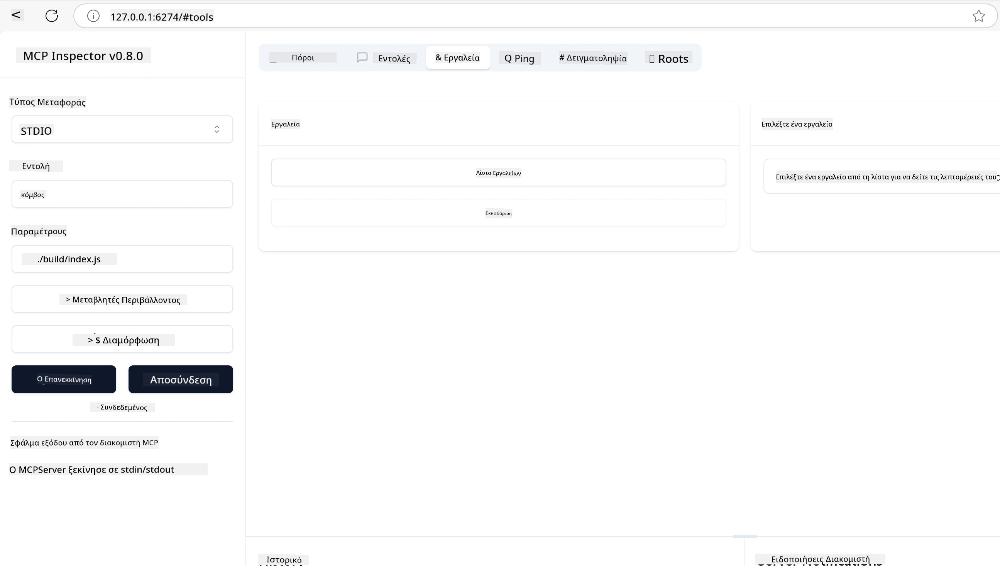
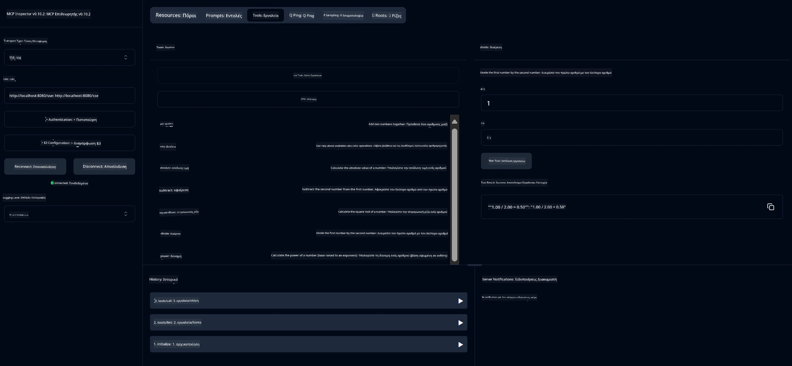
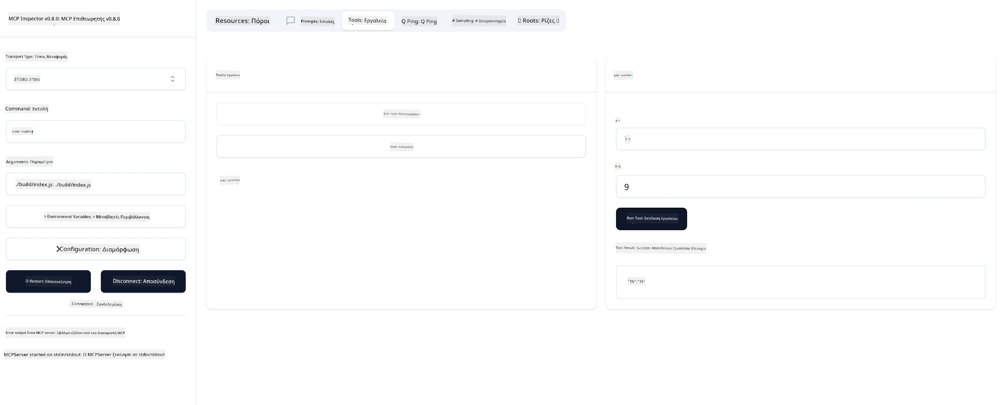

# Ξεκινώντας με το MCP

> [!NOTE]
> Το παράδειγμα Java HTTP σε αυτό το μάθημα χρησιμοποιεί τη παλαιά μεταφορά HTTP+SSE και
> στοχεύει σε SDK συμβατό με MCP `2025-11-25`. Για νέους απομακρυσμένους διακομιστές, χρησιμοποιήστε
> τη μεταφορά Streamable HTTP `2026-07-28` και επαληθεύστε την υποστήριξη στο SDK σας.

Καλώς ήρθατε στα πρώτα σας βήματα με το Πρωτόκολλο Πλαισίου Μοντέλου (Model Context Protocol - MCP)! Είτε είστε νέοι στο MCP είτε θέλετε να εμβαθύνετε την κατανόησή σας, αυτός ο οδηγός θα σας καθοδηγήσει στη βασική διαδικασία ρύθμισης και ανάπτυξης. Θα ανακαλύψετε πώς το MCP επιτρέπει τη ομαλή ενσωμάτωση ανάμεσα σε μοντέλα AI και εφαρμογές, και θα μάθετε πώς να προετοιμάσετε γρήγορα το περιβάλλον σας για την κατασκευή και δοκιμή λύσεων βασισμένων σε MCP.

> TLDR; Αν δημιουργείτε εφαρμογές AI, γνωρίζετε ότι μπορείτε να προσθέσετε εργαλεία και άλλους πόρους στο LLM (μεγάλο γλωσσικό μοντέλο), ώστε να γίνει πιο γνώστης. Ωστόσο, αν τοποθετήσετε αυτά τα εργαλεία και πόρους σε έναν διακομιστή, οι δυνατότητες της εφαρμογής και του διακομιστή μπορούν να χρησιμοποιηθούν από οποιονδήποτε πελάτη με/χωρίς LLM.

## Επισκόπηση

Αυτό το μάθημα παρέχει πρακτική καθοδήγηση για τη ρύθμιση περιβαλλόντων MCP και την κατασκευή των πρώτων εφαρμογών MCP. Θα μάθετε πώς να ρυθμίζετε τα απαραίτητα εργαλεία και πλαίσια, να δημιουργείτε βασικούς διακομιστές MCP, να φτιάχνετε εφαρμογές ξενιστές και να δοκιμάζετε τις υλοποιήσεις σας.

Το Πρωτόκολλο Πλαισίου Μοντέλου (Model Context Protocol - MCP) είναι ένα ανοικτό πρωτόκολλο που τυποποιεί τον τρόπο με τον οποίο οι εφαρμογές παρέχουν πλαίσιο στα LLMs. Σκεφτείτε το MCP σαν μια θύρα USB-C για εφαρμογές AI – παρέχει έναν τυποποιημένο τρόπο για να συνδέετε μοντέλα AI με διάφορες πηγές δεδομένων και εργαλεία.

## Στόχοι Μάθησης

Μέχρι το τέλος αυτού του μαθήματος, θα μπορείτε να:

- Ρυθμίσετε περιβάλλοντα ανάπτυξης για MCP σε C#, Java, Python, TypeScript, και Rust
- Κατασκευάσετε και αναπτύξετε βασικούς διακομιστές MCP με προσαρμοσμένα χαρακτηριστικά (πόροι, προτροπές, και εργαλεία)
- Δημιουργήσετε εφαρμογές ξενιστές που συνδέονται με διακομιστές MCP
- Δοκιμάσετε και αποσφαλματώσετε υλοποιήσεις MCP

## Ρύθμιση του Περιβάλλοντος MCP

Πριν ξεκινήσετε να εργάζεστε με το MCP, είναι σημαντικό να προετοιμάσετε το περιβάλλον ανάπτυξης και να κατανοήσετε τη βασική ροή εργασίας. Αυτή η ενότητα θα σας οδηγήσει στα αρχικά βήματα ρύθμισης για να εξασφαλίσετε μια ομαλή εκκίνηση με το MCP.

### Προαπαιτούμενα

Πριν βουτήξετε στην ανάπτυξη MCP, βεβαιωθείτε ότι διαθέτετε:

- **Περιβάλλον Ανάπτυξης**: Για τη γλώσσα που έχετε επιλέξει (C#, Java, Python, TypeScript, ή Rust)
- **IDE/Επεξεργαστής**: Visual Studio, Visual Studio Code, IntelliJ, Eclipse, PyCharm, ή οποιοδήποτε σύγχρονο επεξεργαστή κώδικα
- **Διαχειριστές Πακέτων**: NuGet, Maven/Gradle, pip, npm/yarn, ή Cargo
- **Κλειδιά API**: Για οποιεσδήποτε υπηρεσίες AI σχεδιάζετε να χρησιμοποιήσετε στις εφαρμογές ξενιστή σας

## Βασική Δομή Διακομιστή MCP

Ένας διακομιστής MCP συνήθως περιλαμβάνει:

- **Διαμόρφωση Διακομιστή**: Ρύθμιση θύρας, πιστοποίησης, και άλλων ρυθμίσεων
- **Πόρους**: Δεδομένα και πλαίσιο διαθέσιμα στα LLMs
- **Εργαλεία**: Λειτουργικότητα που μπορούν να επικαλεστούν τα μοντέλα
- **Προτροπές**: Πρότυπα για δημιουργία ή δομή κειμένου

Να ένα απλοποιημένο παράδειγμα σε TypeScript:

```typescript
import { McpServer, ResourceTemplate } from "@modelcontextprotocol/sdk/server/mcp.js";
import { StdioServerTransport } from "@modelcontextprotocol/sdk/server/stdio.js";
import { z } from "zod";

// Δημιουργήστε έναν MCP διακομιστή
const server = new McpServer({
  name: "Demo",
  version: "1.0.0"
});

// Προσθέστε ένα εργαλείο πρόσθεσης
server.tool("add",
  { a: z.number(), b: z.number() },
  async ({ a, b }) => ({
    content: [{ type: "text", text: String(a + b) }]
  })
);

// Προσθέστε μια δυναμική πηγή χαιρετισμών
server.resource(
  "file",
  // Η παράμετρος 'list' ελέγχει πώς η πηγή απαριθμεί τα διαθέσιμα αρχεία. Η ρύθμισή της σε undefined απενεργοποιεί την απαρίθμηση για αυτήν την πηγή.
  new ResourceTemplate("file://{path}", { list: undefined }),
  async (uri, { path }) => ({
    contents: [{
      uri: uri.href,
      text: `File, ${path}!`
    }]
  })
);

// Προσθέστε μια πηγή αρχείων που διαβάζει το περιεχόμενο του αρχείου
server.resource(
  "file",
  new ResourceTemplate("file://{path}", { list: undefined }),
  async (uri, { path }) => {
    let text;
    try {
      text = await fs.readFile(path, "utf8");
    } catch (err) {
      text = `Error reading file: ${err.message}`;
    }
    return {
      contents: [{
        uri: uri.href,
        text
      }]
    };
  }
);

server.prompt(
  "review-code",
  { code: z.string() },
  ({ code }) => ({
    messages: [{
      role: "user",
      content: {
        type: "text",
        text: `Please review this code:\n\n${code}`
      }
    }]
  })
);

// Ξεκινήστε τη λήψη μηνυμάτων από stdin και την αποστολή μηνυμάτων σε stdout
const transport = new StdioServerTransport();
await server.connect(transport);
```

Στον προηγούμενο κώδικα:

- Εισάγουμε τις απαραίτητες κλάσεις από το MCP TypeScript SDK.
- Δημιουργούμε και διαμορφώνουμε μια νέα παρουσία διακομιστή MCP.
- Καταχωρούμε ένα προσαρμοσμένο εργαλείο (`calculator`) με μια λειτουργία χειριστή.
- Ξεκινάμε το διακομιστή για να ακούει αιτήματα MCP.

## Δοκιμές και Αποσφαλμάτωση

Πριν αρχίσετε να δοκιμάζετε τον διακομιστή MCP, είναι σημαντικό να κατανοήσετε τα διαθέσιμα εργαλεία και τις βέλτιστες πρακτικές για την αποσφαλμάτωση. Οι αποτελεσματικές δοκιμές εξασφαλίζουν ότι ο διακομιστής συμπεριφέρεται όπως αναμένεται και σας βοηθούν να εντοπίσετε και να επιλύσετε τα προβλήματα γρήγορα. Η παρακάτω ενότητα περιγράφει τις προτεινόμενες προσεγγίσεις για την επικύρωση της υλοποίησής σας MCP.

Το MCP παρέχει εργαλεία για να σας βοηθήσει να δοκιμάσετε και να αποσφαλματώσετε τους διακομιστές σας:

- **Εργαλείο Inspector**, αυτή η γραφική διεπαφή σας επιτρέπει να συνδεθείτε με τον διακομιστή σας και να δοκιμάσετε τα εργαλεία, τις προτροπές και τους πόρους σας.
- **curl**, μπορείτε επίσης να συνδεθείτε με τον διακομιστή σας χρησιμοποιώντας ένα εργαλείο γραμμής εντολών όπως το curl ή άλλους πελάτες που μπορούν να δημιουργήσουν και να εκτελέσουν εντολές HTTP.

### Χρήση του MCP Inspector

Το [MCP Inspector](https://github.com/modelcontextprotocol/inspector) είναι ένα οπτικό εργαλείο δοκιμών που σας βοηθά να:

1. **Ανακαλύψετε Δυνατότητες Διακομιστή**: Αυτόματος εντοπισμός διαθέσιμων πόρων, εργαλείων, και προτροπών
2. **Δοκιμάσετε Εκτέλεση Εργαλείου**: Δοκιμάστε διαφορετικές παραμέτρους και δείτε απαντήσεις σε πραγματικό χρόνο
3. **Προβολή Μεταδεδομένων Διακομιστή**: Εξέταση πληροφοριών διακομιστή, σχημάτων, και διαμορφώσεων

```bash
# ex TypeScript, εγκατάσταση και εκτέλεση MCP Inspector
npx @modelcontextprotocol/inspector node build/index.js
```

Όταν εκτελείτε τις παραπάνω εντολές, ο MCP Inspector θα εκκινήσει μια τοπική διεπαφή ιστού στο πρόγραμμα περιήγησής σας. Μπορείτε να περιμένετε να δείτε έναν πίνακα ελέγχου που εμφανίζει τους εγγεγραμμένους διακομιστές MCP, τα διαθέσιμα εργαλεία, πόρους και προτροπές τους. Η διεπαφή σας επιτρέπει να δοκιμάζετε διαδραστικά την εκτέλεση εργαλείων, να εξετάζετε μεταδεδομένα διακομιστών και να βλέπετε απαντήσεις σε πραγματικό χρόνο, καθιστώντας ευκολότερη την επικύρωση και την αποσφαλμάτωση των υλοποιήσεων MCP.

Εδώ είναι ένα στιγμιότυπο οθόνης του πως μπορεί να φαίνεται:



## Συνήθη Προβλήματα Ρύθμισης και Λύσεις

| Πρόβλημα | Πιθανή Λύση |
|-------|-------------------|
| Απόρριψη σύνδεσης | Ελέγξτε αν ο διακομιστής τρέχει και η θύρα είναι σωστή |
| Σφάλματα εκτέλεσης εργαλείου | Επανεξετάστε την επαλήθευση παραμέτρων και τον χειρισμό σφαλμάτων |
| Αποτυχίες πιστοποίησης | Επαληθεύστε τα κλειδιά API και τα δικαιώματα |
| Σφάλματα επαλήθευσης σχημάτων | Βεβαιωθείτε ότι οι παράμετροι ταιριάζουν με το ορισμένο σχήμα |
| Ο διακομιστής δεν εκκινεί | Ελέγξτε για συγκρούσεις θυρών ή λείποντα εξαρτήματα |
| Σφάλματα CORS | Διαμορφώστε σωστά τις κεφαλίδες CORS για αιτήματα από διαφορετική προέλευση |
| Προβλήματα πιστοποίησης | Επαληθεύστε την εγκυρότητα του token και τα δικαιώματα |

## Τοπική Ανάπτυξη

Για τοπική ανάπτυξη και δοκιμή, μπορείτε να τρέξετε διακομιστές MCP απευθείας στον υπολογιστή σας:

1. **Ξεκινήστε τη διαδικασία διακομιστή**: Τρέξτε την εφαρμογή διακομιστή MCP
2. **Διαμορφώστε δίκτυο**: Βεβαιωθείτε ότι ο διακομιστής είναι προσβάσιμος στη σωστή θύρα
3. **Συνδέστε πελάτες**: Χρησιμοποιήστε τοπικές διευθύνσεις σύνδεσης όπως `http://localhost:3000`

```bash
# Παράδειγμα: Εκτέλεση ενός TypeScript MCP διακομιστή τοπικά
npm run start
# Ο διακομιστής εκτελείται στο http://localhost:3000
```

## Δημιουργία του πρώτου διακομιστή MCP

Έχουμε καλύψει [Βασικές έννοιες](../../01-CoreConcepts/README.md) σε προηγούμενο μάθημα, τώρα είναι η ώρα να βάλουμε αυτή τη γνώση σε πρακτική εφαρμογή.

### Τι μπορεί να κάνει ένας διακομιστής

Πριν αρχίσουμε να γράφουμε κώδικα, ας θυμηθούμε τι μπορεί να κάνει ένας διακομιστής:

Ένας διακομιστής MCP μπορεί, για παράδειγμα:

- Να έχει πρόσβαση σε τοπικά αρχεία και βάσεις δεδομένων
- Να συνδέεται με απομακρυσμένα API
- Να εκτελεί υπολογισμούς
- Να ενσωματώνεται με άλλα εργαλεία και υπηρεσίες
- Να παρέχει διεπαφή χρήστη για αλληλεπίδραση

Τέλεια, τώρα που γνωρίζουμε τι μπορούμε να κάνουμε με αυτόν, ας ξεκινήσουμε την κωδικοποίηση.

## Άσκηση: Δημιουργία διακομιστή

Για να δημιουργήσετε έναν διακομιστή, πρέπει να ακολουθήσετε αυτά τα βήματα:

- Εγκαταστήστε το MCP SDK.
- Δημιουργήστε ένα έργο και ρυθμίστε τη δομή του έργου.
- Γράψτε τον κώδικα του διακομιστή.
- Δοκιμάστε τον διακομιστή.

### -1- Δημιουργία έργου

#### TypeScript

```sh
# Δημιουργήστε τον κατάλογο έργου και αρχικοποιήστε το έργο npm
mkdir calculator-server
cd calculator-server
npm init -y
```

#### Python

```sh
# Δημιουργήστε τον φάκελο έργου
mkdir calculator-server
cd calculator-server
# Ανοίξτε το φάκελο στο Visual Studio Code - Παράλειψη αν χρησιμοποιείτε διαφορετικό IDE
code .
```

#### .NET

```sh
dotnet new console -n McpCalculatorServer
cd McpCalculatorServer
```

#### Java

Για Java, δημιουργήστε ένα έργο Spring Boot:

```bash
curl https://start.spring.io/starter.zip \
  -d dependencies=web \
  -d javaVersion=21 \
  -d type=maven-project \
  -d groupId=com.example \
  -d artifactId=calculator-server \
  -d name=McpServer \
  -d packageName=com.microsoft.mcp.sample.server \
  -o calculator-server.zip
```

Εξάγετε το αρχείο zip:

```bash
unzip calculator-server.zip -d calculator-server
cd calculator-server
# προαιρετικά αφαιρέστε το μη χρησιμοποιημένο τεστ
rm -rf src/test/java
```

Προσθέστε την ακόλουθη ολοκληρωμένη διαμόρφωση στο αρχείο *pom.xml* σας:

```xml
<?xml version="1.0" encoding="UTF-8"?>
<project xmlns="http://maven.apache.org/POM/4.0.0"
    xmlns:xsi="http://www.w3.org/2001/XMLSchema-instance"
    xsi:schemaLocation="http://maven.apache.org/POM/4.0.0 http://maven.apache.org/xsd/maven-4.0.0.xsd">
    <modelVersion>4.0.0</modelVersion>
    
    <!-- Spring Boot parent for dependency management -->
    <parent>
        <groupId>org.springframework.boot</groupId>
        <artifactId>spring-boot-starter-parent</artifactId>
        <version>3.5.0</version>
        <relativePath />
    </parent>

    <!-- Project coordinates -->
    <groupId>com.example</groupId>
    <artifactId>calculator-server</artifactId>
    <version>0.0.1-SNAPSHOT</version>
    <name>Calculator Server</name>
    <description>Basic calculator MCP service for beginners</description>

    <!-- Properties -->
    <properties>
        <java.version>21</java.version>
        <maven.compiler.source>21</maven.compiler.source>
        <maven.compiler.target>21</maven.compiler.target>
    </properties>

    <!-- Spring AI BOM for version management -->
    <dependencyManagement>
        <dependencies>
            <dependency>
                <groupId>org.springframework.ai</groupId>
                <artifactId>spring-ai-bom</artifactId>
                <version>1.0.0-SNAPSHOT</version>
                <type>pom</type>
                <scope>import</scope>
            </dependency>
        </dependencies>
    </dependencyManagement>

    <!-- Dependencies -->
    <dependencies>
        <dependency>
            <groupId>org.springframework.ai</groupId>
            <artifactId>spring-ai-starter-mcp-server-webflux</artifactId>
        </dependency>
        <dependency>
            <groupId>org.springframework.boot</groupId>
            <artifactId>spring-boot-starter-actuator</artifactId>
        </dependency>
        <dependency>
         <groupId>org.springframework.boot</groupId>
         <artifactId>spring-boot-starter-test</artifactId>
         <scope>test</scope>
      </dependency>
    </dependencies>

    <!-- Build configuration -->
    <build>
        <plugins>
            <plugin>
                <groupId>org.springframework.boot</groupId>
                <artifactId>spring-boot-maven-plugin</artifactId>
            </plugin>
            <plugin>
                <groupId>org.apache.maven.plugins</groupId>
                <artifactId>maven-compiler-plugin</artifactId>
                <configuration>
                    <release>21</release>
                </configuration>
            </plugin>
        </plugins>
    </build>

    <!-- Repositories for Spring AI snapshots -->
    <repositories>
        <repository>
            <id>spring-milestones</id>
            <name>Spring Milestones</name>
            <url>https://repo.spring.io/milestone</url>
            <snapshots>
                <enabled>false</enabled>
            </snapshots>
        </repository>
        <repository>
            <id>spring-snapshots</id>
            <name>Spring Snapshots</name>
            <url>https://repo.spring.io/snapshot</url>
            <releases>
                <enabled>false</enabled>
            </releases>
        </repository>
    </repositories>
</project>
```

#### Rust

```sh
mkdir calculator-server
cd calculator-server
cargo init
```

### -2- Προσθήκη εξαρτήσεων

Τώρα που έχετε δημιουργήσει το έργο, ας προσθέσουμε τις εξαρτήσεις:

#### TypeScript

```sh
# Εάν δεν είναι ήδη εγκατεστημένο, εγκαταστήστε το TypeScript παγκοσμίως
npm install typescript -g

# Εγκαταστήστε το MCP SDK και το Zod για επικύρωση σχήματος
npm install @modelcontextprotocol/sdk zod
npm install -D @types/node typescript
```

#### Python

```sh
# Δημιουργήστε ένα εικονικό περιβάλλον και εγκαταστήστε τις εξαρτήσεις
python -m venv venv
venv\Scripts\activate
pip install "mcp[cli]"
```

#### Java

```bash
cd calculator-server
./mvnw clean install -DskipTests
```

#### Rust

```sh
cargo add rmcp --features server,transport-io
cargo add serde
cargo add tokio --features rt-multi-thread
```

### -3- Δημιουργία αρχείων έργου

#### TypeScript

Ανοίξτε το αρχείο *package.json* και αντικαταστήστε το περιεχόμενο με το ακόλουθο ώστε να εξασφαλίσετε ότι μπορείτε να χτίσετε και να τρέξετε τον διακομιστή:

```json
{
  "name": "calculator-server",
  "version": "1.0.0",
  "main": "index.js",
  "type": "module",
  "scripts": {
    "build": "tsc",
    "start": "npm run build && node ./build/index.js",
  },
  "keywords": [],
  "author": "",
  "license": "ISC",
  "description": "A simple calculator server using Model Context Protocol",
  "dependencies": {
    "@modelcontextprotocol/sdk": "^1.16.0",
    "zod": "^3.25.76"
  },
  "devDependencies": {
    "@types/node": "^24.0.14",
    "typescript": "^5.8.3"
  }
}
```

Δημιουργήστε ένα *tsconfig.json* με το ακόλουθο περιεχόμενο:

```json
{
  "compilerOptions": {
    "target": "ES2022",
    "module": "Node16",
    "moduleResolution": "Node16",
    "outDir": "./build",
    "rootDir": "./src",
    "strict": true,
    "esModuleInterop": true,
    "skipLibCheck": true,
    "forceConsistentCasingInFileNames": true
  },
  "include": ["src/**/*"],
  "exclude": ["node_modules"]
}
```

Δημιουργήστε έναν κατάλογο για τον πηγαίο κώδικα:

```sh
mkdir src
touch src/index.ts
```

#### Python

Δημιουργήστε ένα αρχείο *server.py*

```sh
touch server.py
```

#### .NET

Εγκαταστήστε τα απαραίτητα πακέτα NuGet:

```sh
dotnet add package ModelContextProtocol --prerelease
dotnet add package Microsoft.Extensions.Hosting
```

#### Java

Για έργα Java Spring Boot, η δομή του έργου δημιουργείται αυτόματα.

#### Rust

Για το Rust, το αρχείο *src/main.rs* δημιουργείται αυτόματα όταν τρέχετε `cargo init`. Ανοίξτε το αρχείο και διαγράψτε τον προεπιλεγμένο κώδικα.

### -4- Δημιουργία κώδικα διακομιστή

#### TypeScript

Δημιουργήστε ένα αρχείο *index.ts* και προσθέστε τον ακόλουθο κώδικα:

```typescript
import { McpServer, ResourceTemplate } from "@modelcontextprotocol/sdk/server/mcp.js";
import { StdioServerTransport } from "@modelcontextprotocol/sdk/server/stdio.js";
import { z } from "zod";
 
// Δημιουργήστε έναν διακομιστή MCP
const server = new McpServer({
  name: "Calculator MCP Server",
  version: "1.0.0"
});
```

Τώρα έχετε έναν διακομιστή, αλλά δεν κάνει πολλά, ας το διορθώσουμε.

#### Python

```python
# server.py
from mcp.server.fastmcp import FastMCP

# Δημιουργήστε έναν διακομιστή MCP
mcp = FastMCP("Demo")
```

#### .NET

```csharp
using Microsoft.Extensions.DependencyInjection;
using Microsoft.Extensions.Hosting;
using Microsoft.Extensions.Logging;
using ModelContextProtocol.Server;
using System.ComponentModel;

var builder = Host.CreateApplicationBuilder(args);
builder.Logging.AddConsole(consoleLogOptions =>
{
    // Configure all logs to go to stderr
    consoleLogOptions.LogToStandardErrorThreshold = LogLevel.Trace;
});

builder.Services
    .AddMcpServer()
    .WithStdioServerTransport()
    .WithToolsFromAssembly();
await builder.Build().RunAsync();

// add features
```

#### Java

Για Java, δημιουργήστε τα βασικά στοιχεία διακομιστή. Πρώτα, τροποποιήστε την κύρια κλάση εφαρμογής:

*src/main/java/com/microsoft/mcp/sample/server/McpServerApplication.java*:

```java
package com.microsoft.mcp.sample.server;

import org.springframework.ai.tool.ToolCallbackProvider;
import org.springframework.ai.tool.method.MethodToolCallbackProvider;
import org.springframework.boot.SpringApplication;
import org.springframework.boot.autoconfigure.SpringBootApplication;
import org.springframework.context.annotation.Bean;
import com.microsoft.mcp.sample.server.service.CalculatorService;

@SpringBootApplication
public class McpServerApplication {

    public static void main(String[] args) {
        SpringApplication.run(McpServerApplication.class, args);
    }
    
    @Bean
    public ToolCallbackProvider calculatorTools(CalculatorService calculator) {
        return MethodToolCallbackProvider.builder().toolObjects(calculator).build();
    }
}
```

Δημιουργήστε την υπηρεσία αριθμητικού υπολογισμού *src/main/java/com/microsoft/mcp/sample/server/service/CalculatorService.java*:

```java
package com.microsoft.mcp.sample.server.service;

import org.springframework.ai.tool.annotation.Tool;
import org.springframework.stereotype.Service;

/**
 * Service for basic calculator operations.
 * This service provides simple calculator functionality through MCP.
 */
@Service
public class CalculatorService {

    /**
     * Add two numbers
     * @param a The first number
     * @param b The second number
     * @return The sum of the two numbers
     */
    @Tool(description = "Add two numbers together")
    public String add(double a, double b) {
        double result = a + b;
        return formatResult(a, "+", b, result);
    }

    /**
     * Subtract one number from another
     * @param a The number to subtract from
     * @param b The number to subtract
     * @return The result of the subtraction
     */
    @Tool(description = "Subtract the second number from the first number")
    public String subtract(double a, double b) {
        double result = a - b;
        return formatResult(a, "-", b, result);
    }

    /**
     * Multiply two numbers
     * @param a The first number
     * @param b The second number
     * @return The product of the two numbers
     */
    @Tool(description = "Multiply two numbers together")
    public String multiply(double a, double b) {
        double result = a * b;
        return formatResult(a, "*", b, result);
    }

    /**
     * Divide one number by another
     * @param a The numerator
     * @param b The denominator
     * @return The result of the division
     */
    @Tool(description = "Divide the first number by the second number")
    public String divide(double a, double b) {
        if (b == 0) {
            return "Error: Cannot divide by zero";
        }
        double result = a / b;
        return formatResult(a, "/", b, result);
    }

    /**
     * Calculate the power of a number
     * @param base The base number
     * @param exponent The exponent
     * @return The result of raising the base to the exponent
     */
    @Tool(description = "Calculate the power of a number (base raised to an exponent)")
    public String power(double base, double exponent) {
        double result = Math.pow(base, exponent);
        return formatResult(base, "^", exponent, result);
    }

    /**
     * Calculate the square root of a number
     * @param number The number to find the square root of
     * @return The square root of the number
     */
    @Tool(description = "Calculate the square root of a number")
    public String squareRoot(double number) {
        if (number < 0) {
            return "Error: Cannot calculate square root of a negative number";
        }
        double result = Math.sqrt(number);
        return String.format("√%.2f = %.2f", number, result);
    }

    /**
     * Calculate the modulus (remainder) of division
     * @param a The dividend
     * @param b The divisor
     * @return The remainder of the division
     */
    @Tool(description = "Calculate the remainder when one number is divided by another")
    public String modulus(double a, double b) {
        if (b == 0) {
            return "Error: Cannot divide by zero";
        }
        double result = a % b;
        return formatResult(a, "%", b, result);
    }

    /**
     * Calculate the absolute value of a number
     * @param number The number to find the absolute value of
     * @return The absolute value of the number
     */
    @Tool(description = "Calculate the absolute value of a number")
    public String absolute(double number) {
        double result = Math.abs(number);
        return String.format("|%.2f| = %.2f", number, result);
    }

    /**
     * Get help about available calculator operations
     * @return Information about available operations
     */
    @Tool(description = "Get help about available calculator operations")
    public String help() {
        return "Basic Calculator MCP Service\n\n" +
               "Available operations:\n" +
               "1. add(a, b) - Adds two numbers\n" +
               "2. subtract(a, b) - Subtracts the second number from the first\n" +
               "3. multiply(a, b) - Multiplies two numbers\n" +
               "4. divide(a, b) - Divides the first number by the second\n" +
               "5. power(base, exponent) - Raises a number to a power\n" +
               "6. squareRoot(number) - Calculates the square root\n" + 
               "7. modulus(a, b) - Calculates the remainder of division\n" +
               "8. absolute(number) - Calculates the absolute value\n\n" +
               "Example usage: add(5, 3) will return 5 + 3 = 8";
    }

    /**
     * Format the result of a calculation
     */
    private String formatResult(double a, String operator, double b, double result) {
        return String.format("%.2f %s %.2f = %.2f", a, operator, b, result);
    }
}
```

**Προαιρετικά στοιχεία για μια υπηρεσία έτοιμη για παραγωγή:**

Δημιουργήστε μια διαμόρφωση έναρξης *src/main/java/com/microsoft/mcp/sample/server/config/StartupConfig.java*:

```java
package com.microsoft.mcp.sample.server.config;

import org.springframework.boot.CommandLineRunner;
import org.springframework.context.annotation.Bean;
import org.springframework.context.annotation.Configuration;

@Configuration
public class StartupConfig {
    
    @Bean
    public CommandLineRunner startupInfo() {
        return args -> {
            System.out.println("\n" + "=".repeat(60));
            System.out.println("Calculator MCP Server is starting...");
            System.out.println("SSE endpoint: http://localhost:8080/sse");
            System.out.println("Health check: http://localhost:8080/actuator/health");
            System.out.println("=".repeat(60) + "\n");
        };
    }
}
```

Δημιουργήστε ένα χειριστή υγείας *src/main/java/com/microsoft/mcp/sample/server/controller/HealthController.java*:

```java
package com.microsoft.mcp.sample.server.controller;

import org.springframework.http.ResponseEntity;
import org.springframework.web.bind.annotation.GetMapping;
import org.springframework.web.bind.annotation.RestController;
import java.time.LocalDateTime;
import java.util.HashMap;
import java.util.Map;

@RestController
public class HealthController {
    
    @GetMapping("/health")
    public ResponseEntity<Map<String, Object>> healthCheck() {
        Map<String, Object> response = new HashMap<>();
        response.put("status", "UP");
        response.put("timestamp", LocalDateTime.now().toString());
        response.put("service", "Calculator MCP Server");
        return ResponseEntity.ok(response);
    }
}
```

Δημιουργήστε έναν διαχειριστή εξαιρέσεων *src/main/java/com/microsoft/mcp/sample/server/exception/GlobalExceptionHandler.java*:

```java
package com.microsoft.mcp.sample.server.exception;

import org.springframework.http.HttpStatus;
import org.springframework.http.ResponseEntity;
import org.springframework.web.bind.annotation.ExceptionHandler;
import org.springframework.web.bind.annotation.RestControllerAdvice;

@RestControllerAdvice
public class GlobalExceptionHandler {

    @ExceptionHandler(IllegalArgumentException.class)
    public ResponseEntity<ErrorResponse> handleIllegalArgumentException(IllegalArgumentException ex) {
        ErrorResponse error = new ErrorResponse(
            "Invalid_Input", 
            "Invalid input parameter: " + ex.getMessage());
        return new ResponseEntity<>(error, HttpStatus.BAD_REQUEST);
    }

    public static class ErrorResponse {
        private String code;
        private String message;

        public ErrorResponse(String code, String message) {
            this.code = code;
            this.message = message;
        }

        // Μέθοδοι ανάκτησης δεδομένων
        public String getCode() { return code; }
        public String getMessage() { return message; }
    }
}
```

Δημιουργήστε ένα προσαρμοσμένο banner *src/main/resources/banner.txt*:

```text
_____      _            _       _             
 / ____|    | |          | |     | |            
| |     __ _| | ___ _   _| | __ _| |_ ___  _ __ 
| |    / _` | |/ __| | | | |/ _` | __/ _ \| '__|
| |___| (_| | | (__| |_| | | (_| | || (_) | |   
 \_____\__,_|_|\___|\__,_|_|\__,_|\__\___/|_|   
                                                
Calculator MCP Server v1.0
Spring Boot MCP Application
```

</details>

#### Rust

Προσθέστε τον ακόλουθο κώδικα στην κορυφή του αρχείου *src/main.rs*. Αυτό εισάγει τις απαραίτητες βιβλιοθήκες και modules για τον διακομιστή MCP.

```rust
use rmcp::{
    handler::server::{router::tool::ToolRouter, tool::Parameters},
    model::{ServerCapabilities, ServerInfo},
    schemars, tool, tool_handler, tool_router,
    transport::stdio,
    ServerHandler, ServiceExt,
};
use std::error::Error;
```

Ο διακομιστής αριθμητικού υπολογισμού θα είναι απλός και μπορεί να προσθέτει δύο αριθμούς. Ας δημιουργήσουμε μια δομή για να αναπαραστήσουμε το αίτημα υπολογισμού.

```rust
#[derive(Debug, serde::Deserialize, schemars::JsonSchema)]
pub struct CalculatorRequest {
    pub a: f64,
    pub b: f64,
}
```

Στη συνέχεια, δημιουργήστε μια δομή για να αναπαραστήσετε τον διακομιστή αριθμητικού υπολογισμού. Αυτή η δομή θα κρατάει το εργαλείο δρομολόγησης, που χρησιμοποιείται για την καταχώρηση εργαλείων.

```rust
#[derive(Debug, Clone)]
pub struct Calculator {
    tool_router: ToolRouter<Self>,
}
```

Τώρα μπορούμε να υλοποιήσουμε τη δομή `Calculator` για να δημιουργήσουμε μια νέα παρουσία διακομιστή και να υλοποιήσουμε τον χειριστή διακομιστή για να παρέχει πληροφορίες διακομιστή.

```rust
#[tool_router]
impl Calculator {
    pub fn new() -> Self {
        Self {
            tool_router: Self::tool_router(),
        }
    }
}

#[tool_handler]
impl ServerHandler for Calculator {
    fn get_info(&self) -> ServerInfo {
        ServerInfo {
            instructions: Some("A simple calculator tool".into()),
            capabilities: ServerCapabilities::builder().enable_tools().build(),
            ..Default::default()
        }
    }
}
```

Τέλος, πρέπει να υλοποιήσουμε τη βασική συνάρτηση για την εκκίνηση του διακομιστή. Αυτή η συνάρτηση θα δημιουργήσει μια παρουσία της δομής `Calculator` και θα την εξυπηρετήσει μέσω των standard input/output.

```rust
#[tokio::main]
async fn main() -> Result<(), Box<dyn Error>> {
    let service = Calculator::new().serve(stdio()).await?;
    service.waiting().await?;
    Ok(())
}
```

Ο διακομιστής είναι τώρα ρυθμισμένος να παρέχει βασικές πληροφορίες για τον εαυτό του. Έπειτα, θα προσθέσουμε ένα εργαλείο για την εκτέλεση πρόσθεσης.

### -5- Προσθήκη εργαλείου και πόρου

Προσθέστε ένα εργαλείο και έναν πόρο προσθέτοντας τον ακόλουθο κώδικα:

#### TypeScript

```typescript
server.tool(
  "add",
  { a: z.number(), b: z.number() },
  async ({ a, b }) => ({
    content: [{ type: "text", text: String(a + b) }]
  })
);

server.resource(
  "greeting",
  new ResourceTemplate("greeting://{name}", { list: undefined }),
  async (uri, { name }) => ({
    contents: [{
      uri: uri.href,
      text: `Hello, ${name}!`
    }]
  })
);
```

Το εργαλείο σας παίρνει παραμέτρους `a` και `b` και εκτελεί μια λειτουργία που παράγει μια απάντηση της μορφής:

```typescript
{
  contents: [{
    type: "text", content: "some content"
  }]
}
```

Ο πόρος σας προσπελαύνεται μέσω της συμβολοσειράς "greeting" και λαμβάνει μια παράμετρο `name` και παράγει παρόμοια απάντηση με το εργαλείο:

```typescript
{
  uri: "<href>",
  text: "a text"
}
```

#### Python

```python
# Προσθέστε ένα εργαλείο πρόσθεσης
@mcp.tool()
def add(a: int, b: int) -> int:
    """Add two numbers"""
    return a + b


# Προσθέστε μια δυναμική πηγή χαιρετισμού
@mcp.resource("greeting://{name}")
def get_greeting(name: str) -> str:
    """Get a personalized greeting"""
    return f"Hello, {name}!"
```

Στον προηγούμενο κώδικα έχουμε:

- Ορίσει ένα εργαλείο `add` που παίρνει παραμέτρους `a` και `b`, και οι δύο ακέραιοι.
- Δημιουργήσει έναν πόρο με την ονομασία `greeting` που παίρνει την παράμετρο `name`.

#### .NET

Προσθέστε αυτό στο αρχείο Program.cs σας:

```csharp
[McpServerToolType]
public static class CalculatorTool
{
    [McpServerTool, Description("Adds two numbers")]
    public static string Add(int a, int b) => $"Sum {a + b}";
}
```

#### Java

Τα εργαλεία έχουν ήδη δημιουργηθεί στο προηγούμενο βήμα.

#### Rust

Προσθέστε ένα νέο εργαλείο μέσα στο μπλοκ `impl Calculator`:

```rust
#[tool(description = "Adds a and b")]
async fn add(
    &self,
    Parameters(CalculatorRequest { a, b }): Parameters<CalculatorRequest>,
) -> String {
    (a + b).to_string()
}
```

### -6- Τελικός κώδικας

Ας προσθέσουμε τον τελευταίο κώδικα που χρειαζόμαστε ώστε ο διακομιστής να μπορεί να ξεκινήσει:

#### TypeScript

```typescript
// Ξεκινήστε να λαμβάνετε μηνύματα από το stdin και να στέλνετε μηνύματα στο stdout
const transport = new StdioServerTransport();
await server.connect(transport);
```

Εδώ είναι ο πλήρης κώδικας:

```typescript
// index.ts
import { McpServer, ResourceTemplate } from "@modelcontextprotocol/sdk/server/mcp.js";
import { StdioServerTransport } from "@modelcontextprotocol/sdk/server/stdio.js";
import { z } from "zod";

// Δημιουργία ενός διακομιστή MCP
const server = new McpServer({
  name: "Calculator MCP Server",
  version: "1.0.0"
});

// Προσθήκη ενός εργαλείου πρόσθεσης
server.tool(
  "add",
  { a: z.number(), b: z.number() },
  async ({ a, b }) => ({
    content: [{ type: "text", text: String(a + b) }]
  })
);

// Προσθήκη δυναμικού πόρου χαιρετισμού
server.resource(
  "greeting",
  new ResourceTemplate("greeting://{name}", { list: undefined }),
  async (uri, { name }) => ({
    contents: [{
      uri: uri.href,
      text: `Hello, ${name}!`
    }]
  })
);

// Ξεκινήστε τη λήψη μηνυμάτων στο stdin και την αποστολή μηνυμάτων στο stdout
const transport = new StdioServerTransport();
server.connect(transport);
```

#### Python

```python
# server.py
from mcp.server.fastmcp import FastMCP

# Δημιουργία διακομιστή MCP
mcp = FastMCP("Demo")


# Προσθήκη εργαλείου πρόσθεσης
@mcp.tool()
def add(a: int, b: int) -> int:
    """Add two numbers"""
    return a + b


# Προσθήκη δυναμικού πόρου χαιρετισμού
@mcp.resource("greeting://{name}")
def get_greeting(name: str) -> str:
    """Get a personalized greeting"""
    return f"Hello, {name}!"

# Κύριο μπλοκ εκτέλεσης - απαιτείται για τη λειτουργία του διακομιστή
if __name__ == "__main__":
    mcp.run()
```

#### .NET

Δημιουργήστε ένα αρχείο Program.cs με το ακόλουθο περιεχόμενο:

```csharp
using Microsoft.Extensions.DependencyInjection;
using Microsoft.Extensions.Hosting;
using Microsoft.Extensions.Logging;
using ModelContextProtocol.Server;
using System.ComponentModel;

var builder = Host.CreateApplicationBuilder(args);
builder.Logging.AddConsole(consoleLogOptions =>
{
    // Configure all logs to go to stderr
    consoleLogOptions.LogToStandardErrorThreshold = LogLevel.Trace;
});

builder.Services
    .AddMcpServer()
    .WithStdioServerTransport()
    .WithToolsFromAssembly();
await builder.Build().RunAsync();

[McpServerToolType]
public static class CalculatorTool
{
    [McpServerTool, Description("Adds two numbers")]
    public static string Add(int a, int b) => $"Sum {a + b}";
}
```

#### Java

Η πλήρης κλάση κύριας εφαρμογής θα πρέπει να μοιάζει ως εξής:

```java
// McpServerApplication.java
package com.microsoft.mcp.sample.server;

import org.springframework.ai.tool.ToolCallbackProvider;
import org.springframework.ai.tool.method.MethodToolCallbackProvider;
import org.springframework.boot.SpringApplication;
import org.springframework.boot.autoconfigure.SpringBootApplication;
import org.springframework.context.annotation.Bean;
import com.microsoft.mcp.sample.server.service.CalculatorService;

@SpringBootApplication
public class McpServerApplication {

    public static void main(String[] args) {
        SpringApplication.run(McpServerApplication.class, args);
    }
    
    @Bean
    public ToolCallbackProvider calculatorTools(CalculatorService calculator) {
        return MethodToolCallbackProvider.builder().toolObjects(calculator).build();
    }
}
```

#### Rust

Ο τελικός κώδικας για τον διακομιστή Rust θα πρέπει να μοιάζει ως εξής:

```rust
use rmcp::{
    ServerHandler, ServiceExt,
    handler::server::{router::tool::ToolRouter, tool::Parameters},
    model::{ServerCapabilities, ServerInfo},
    schemars, tool, tool_handler, tool_router,
    transport::stdio,
};
use std::error::Error;

#[derive(Debug, serde::Deserialize, schemars::JsonSchema)]
pub struct CalculatorRequest {
    pub a: f64,
    pub b: f64,
}

#[derive(Debug, Clone)]
pub struct Calculator {
    tool_router: ToolRouter<Self>,
}

#[tool_router]
impl Calculator {
    pub fn new() -> Self {
        Self {
            tool_router: Self::tool_router(),
        }
    }
    
    #[tool(description = "Adds a and b")]
    async fn add(
        &self,
        Parameters(CalculatorRequest { a, b }): Parameters<CalculatorRequest>,
    ) -> String {
        (a + b).to_string()
    }
}

#[tool_handler]
impl ServerHandler for Calculator {
    fn get_info(&self) -> ServerInfo {
        ServerInfo {
            instructions: Some("A simple calculator tool".into()),
            capabilities: ServerCapabilities::builder().enable_tools().build(),
            ..Default::default()
        }
    }
}

#[tokio::main]
async fn main() -> Result<(), Box<dyn Error>> {
    let service = Calculator::new().serve(stdio()).await?;
    service.waiting().await?;
    Ok(())
}
```

### -7- Δοκιμή του διακομιστή

Ξεκινήστε τον διακομιστή με την ακόλουθη εντολή:

#### TypeScript

```sh
npm run build
```

#### Python

```sh
mcp run server.py
```

> Για να χρησιμοποιήσετε το MCP Inspector, χρησιμοποιήστε `mcp dev server.py` που αυτόματα ξεκινά τον Inspector και παρέχει το απαιτούμενο token συνεδρίας proxy. Αν χρησιμοποιείτε `mcp run server.py`, θα χρειαστεί να ξεκινήσετε χειροκίνητα τον Inspector και να ρυθμίσετε τη σύνδεση.

#### .NET

Βεβαιωθείτε ότι βρίσκεστε στον κατάλογο του έργου σας:

```sh
cd McpCalculatorServer
dotnet run
```

#### Java

```bash
./mvnw clean install -DskipTests
java -jar target/calculator-server-0.0.1-SNAPSHOT.jar
```

#### Rust

Τρέξτε τις παρακάτω εντολές για μορφοποίηση και εκτέλεση του διακομιστή:

```sh
cargo fmt
cargo run
```

### -8- Εκτέλεση με τον inspector

Ο inspector είναι ένα εξαιρετικό εργαλείο που μπορεί να ξεκινήσει τον διακομιστή σας και σας επιτρέπει να αλληλεπιδράσετε με αυτόν για να δοκιμάσετε τη λειτουργία του. Ας τον ξεκινήσουμε:

> [!NOTE]
> μπορεί να φαίνεται διαφορετικά στο πεδίο "command" καθώς περιέχει την εντολή για το τρέξιμο διακομιστή με το συγκεκριμένο runtime/

#### TypeScript

```sh
npx @modelcontextprotocol/inspector node build/index.js
```

ή προσθέστε το στο *package.json* σας ως εξής: `"inspector": "npx @modelcontextprotocol/inspector node build/index.js"` και έπειτα τρέξτε `npm run inspector`

#### Python

Το Python περικλείει ένα εργαλείο Node.js που ονομάζεται inspector. Είναι δυνατό να το καλέσετε ως εξής:

```sh
mcp dev server.py
```


Ωστόσο, δεν υλοποιεί όλες τις μεθόδους που είναι διαθέσιμες στο εργαλείο, οπότε συνιστάται να εκτελέσετε το εργαλείο Node.js απευθείας όπως παρακάτω:

```sh
npx @modelcontextprotocol/inspector mcp run server.py
```

Εάν χρησιμοποιείτε ένα εργαλείο ή IDE που σας επιτρέπει να ρυθμίσετε εντολές και παραμέτρους για την εκτέλεση σεναρίων, 
βεβαιωθείτε ότι έχετε ορίσει το `python` στο πεδίο `Command` και το `server.py` ως `Arguments`. Αυτό διασφαλίζει ότι το σενάριο θα εκτελεστεί σωστά.

#### .NET

Βεβαιωθείτε ότι βρίσκεστε στον φάκελο του έργου σας:

```sh
cd McpCalculatorServer
npx @modelcontextprotocol/inspector dotnet run
```

#### Java

Βεβαιωθείτε ότι ο διακομιστής της αριθμομηχανής σας λειτουργεί
Στη συνέχεια, εκτελέστε τον επιθεωρητή:

```cmd
npx @modelcontextprotocol/inspector
```

Στη διεπαφή ιστού του επιθεωρητή:

1. Επιλέξτε "SSE" ως τύπο μεταφοράς
2. Ορίστε το URL σε: `http://localhost:8080/sse`
3. Πατήστε "Connect"



**Τώρα είστε συνδεδεμένοι με τον διακομιστή**
**Η ενότητα δοκιμής του διακομιστή Java έχει ολοκληρωθεί**

Η επόμενη ενότητα αφορά την αλληλεπίδραση με τον διακομιστή.

Θα πρέπει να δείτε την παρακάτω διεπαφή χρήστη:


1. Συνδεθείτε με τον διακομιστή επιλέγοντας το κουμπί Connect
  Μόλις συνδεθείτε με τον διακομιστή, θα πρέπει να δείτε τα εξής:

  

1. Επιλέξτε "Tools" και "listTools", θα δείτε να εμφανίζεται η επιλογή "Add", επιλέξτε "Add" και συμπληρώστε τις τιμές των παραμέτρων.

  Θα δείτε την ακόλουθη απάντηση, δηλαδή ένα αποτέλεσμα από το εργαλείο "add":

  

Συγχαρητήρια, καταφέρατε να δημιουργήσετε και να εκτελέσετε τον πρώτο σας διακομιστή!

#### Rust

Για να εκτελέσετε τον διακομιστή Rust με το MCP Inspector CLI, χρησιμοποιήστε την ακόλουθη εντολή:

```sh
npx @modelcontextprotocol/inspector cargo run --cli --method tools/call --tool-name add --tool-arg a=1 b=2
```

### Επίσημα SDK

Το MCP παρέχει επίσημα SDK για πολλές γλώσσες:

- [C# SDK](https://github.com/modelcontextprotocol/csharp-sdk) - Διατηρείται σε συνεργασία με τη Microsoft
- [Java SDK](https://github.com/modelcontextprotocol/java-sdk) - Διατηρείται σε συνεργασία με το Spring AI
- [TypeScript SDK](https://github.com/modelcontextprotocol/typescript-sdk) - Η επίσημη υλοποίηση TypeScript
- [Python SDK](https://github.com/modelcontextprotocol/python-sdk) - Η επίσημη υλοποίηση Python
- [Kotlin SDK](https://github.com/modelcontextprotocol/kotlin-sdk) - Η επίσημη υλοποίηση Kotlin
- [Swift SDK](https://github.com/modelcontextprotocol/swift-sdk) - Διατηρείται σε συνεργασία με τη Loopwork AI
- [Rust SDK](https://github.com/modelcontextprotocol/rust-sdk) - Η επίσημη υλοποίηση Rust

## Βασικά συμπεράσματα

- Η δημιουργία ενός περιβάλλοντος ανάπτυξης MCP είναι απλή με γλωσσικά ειδικά SDK
- Η δημιουργία MCP διακομιστών περιλαμβάνει τη δημιουργία και καταγραφή εργαλείων με σαφή σχήματα
- Οι δοκιμές και η αποσφαλμάτωση είναι απαραίτητες για αξιόπιστες υλοποιήσεις MCP

## Παραδείγματα

- [Java Calculator](../samples/java/calculator/README.md)
- [.NET Calculator](../../../../03-GettingStarted/samples/csharp)
- [JavaScript Calculator](../samples/javascript/README.md)
- [TypeScript Calculator](../samples/typescript/README.md)
- [Python Calculator](../../../../03-GettingStarted/samples/python)
- [Rust Calculator](../../../../03-GettingStarted/samples/rust)

## Ασκήσεις

Δημιουργήστε έναν απλό διακομιστή MCP με ένα εργαλείο της επιλογής σας:

1. Υλοποιήστε το εργαλείο στη γλώσσα προτίμησής σας (.NET, Java, Python, TypeScript, ή Rust).
2. Ορίστε παραμέτρους εισόδου και τιμές επιστροφής.
3. Εκτελέστε το εργαλείο επιθεώρησης για να βεβαιωθείτε ότι ο διακομιστής λειτουργεί όπως προορίζεται.
4. Δοκιμάστε την υλοποίηση με διάφορες εισόδους.

## Λύση

[Λύση](./solution/README.md)

## Πρόσθετοι Πόροι

- [Δημιουργία Agents χρησιμοποιώντας το Model Context Protocol στο Azure](https://learn.microsoft.com/azure/developer/ai/intro-agents-mcp)
- [Απομακρυσμένο MCP με Azure Container Apps (Node.js/TypeScript/JavaScript)](https://learn.microsoft.com/samples/azure-samples/mcp-container-ts/mcp-container-ts/)
- [.NET OpenAI MCP Agent](https://learn.microsoft.com/samples/azure-samples/openai-mcp-agent-dotnet/openai-mcp-agent-dotnet/)

## Τι ακολουθεί

Επόμενο: [Ξεκινώντας με πελάτες MCP](../02-client/README.md)

---

<!-- CO-OP TRANSLATOR DISCLAIMER START -->
**Αποποίηση ευθυνών**:
Αυτό το έγγραφο έχει μεταφραστεί χρησιμοποιώντας την υπηρεσία μετάφρασης με τεχνητή νοημοσύνη [Co-op Translator](https://github.com/Azure/co-op-translator). Ενώ επιδιώκουμε την ακρίβεια, παρακαλούμε να έχετε υπόψη ότι οι αυτοματοποιημένες μεταφράσεις ενδέχεται να περιέχουν λάθη ή ανακρίβειες. Το πρωτότυπο έγγραφο στη μητρική του γλώσσα πρέπει να θεωρείται η αυθεντική πηγή. Για κρίσιμες πληροφορίες, συνιστάται επαγγελματική ανθρώπινη μετάφραση. Δεν φέρουμε ευθύνη για τυχόν παρεξηγήσεις ή λανθασμένες ερμηνείες που προκύπτουν από τη χρήση αυτής της μετάφρασης.
<!-- CO-OP TRANSLATOR DISCLAIMER END -->