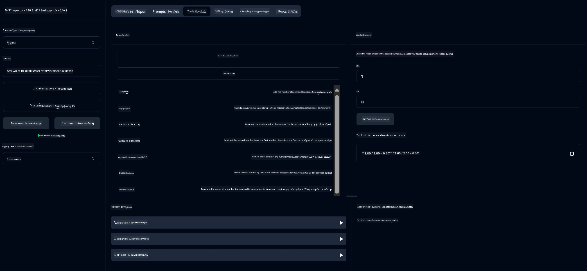

# Βασική Υπηρεσία Αριθμομηχανής MCP

> [!NOTE]
> Αυτή η λύση Java χρησιμοποιεί το παλαιό πρωτόκολλο HTTP+SSE και απευθύνεται σε SDK
> συμβατό με MCP `2025-11-25`. Διατηρείται για αναγνώριση του κώδικα ενός μαθήματος·
> οι νέοι απομακρυσμένοι διακομιστές θα πρέπει να χρησιμοποιούν την υποστήριξη Streamable HTTP `2026-07-28`.

Αυτή η υπηρεσία παρέχει βασικές λειτουργίες αριθμομηχανής μέσω του Πρωτοκόλλου Πλαισιωμένου Μοντέλου (MCP) χρησιμοποιώντας το Spring Boot με μεταφορά WebFlux. Είναι σχεδιασμένη ως απλό παράδειγμα για αρχάριους που μαθαίνουν για υλοποιήσεις MCP.

Για περισσότερες πληροφορίες, δείτε την [αναφορά τεκμηρίωσης MCP Server Boot Starter](https://docs.spring.io/spring-ai/reference/api/mcp/mcp-server-boot-starter-docs.html).


## Χρήση της Υπηρεσίας

Η υπηρεσία εκθέτει τα ακόλουθα σημεία API μέσω του πρωτοκόλλου MCP:

- `add(a, b)`: Προσθέτει δύο αριθμούς
- `subtract(a, b)`: Αφαιρεί τον δεύτερο αριθμό από τον πρώτο
- `multiply(a, b)`: Πολλαπλασιάζει δύο αριθμούς
- `divide(a, b)`: Διαιρεί τον πρώτο αριθμό με τον δεύτερο (με έλεγχο μηδενός)
- `power(base, exponent)`: Υπολογίζει την δύναμη ενός αριθμού
- `squareRoot(number)`: Υπολογίζει την τετραγωνική ρίζα (με έλεγχο αρνητικού αριθμού)
- `modulus(a, b)`: Υπολογίζει το υπόλοιπο μιας διαίρεσης
- `absolute(number)`: Υπολογίζει την απόλυτη τιμή

## Εξαρτήσεις

Το έργο απαιτεί τις ακόλουθες βασικές εξαρτήσεις:

```xml
<dependency>
    <groupId>org.springframework.ai</groupId>
    <artifactId>spring-ai-starter-mcp-server-webflux</artifactId>
</dependency>
```

## Κατασκευή του Έργου

Δημιουργήστε το έργο χρησιμοποιώντας Maven:
```bash
./mvnw clean install -DskipTests
```

## Εκκίνηση του Διακομιστή

### Χρήση Java

```bash
java -jar target/calculator-server-0.0.1-SNAPSHOT.jar
```

### Χρήση MCP Inspector

Το MCP Inspector είναι ένα χρήσιμο εργαλείο για την αλληλεπίδραση με υπηρεσίες MCP. Για να το χρησιμοποιήσετε με αυτήν την υπηρεσία αριθμομηχανής:

1. **Εγκαταστήστε και εκκινήστε το MCP Inspector** σε νέο παράθυρο τερματικού:
   ```bash
   npx @modelcontextprotocol/inspector
   ```

2. **Πρόσβαση στο web UI** κάνοντας κλικ στη διεύθυνση URL που εμφανίζεται από την εφαρμογή (συνήθως http://localhost:6274)

3. **Ρυθμίστε τη σύνδεση**:
   - Ορίστε τον τύπο μεταφοράς σε "SSE"
   - Ορίστε το URL στο τρέχον SSE endpoint του διακομιστή σας: `http://localhost:8080/sse`
   - Κάντε κλικ στο "Connect"

4. **Χρησιμοποιήστε τα εργαλεία**:
   - Κάντε κλικ στο "List Tools" για να δείτε τις διαθέσιμες λειτουργίες της αριθμομηχανής
   - Επιλέξτε ένα εργαλείο και κάντε κλικ στο "Run Tool" για να εκτελέσετε μια λειτουργία



---

<!-- CO-OP TRANSLATOR DISCLAIMER START -->
**Αποποίηση ευθυνών**:
Αυτό το έγγραφο έχει μεταφραστεί χρησιμοποιώντας την υπηρεσία μετάφρασης με τεχνητή νοημοσύνη [Co-op Translator](https://github.com/Azure/co-op-translator). Ενώ επιδιώκουμε την ακρίβεια, παρακαλούμε να έχετε υπόψη ότι οι αυτοματοποιημένες μεταφράσεις ενδέχεται να περιέχουν λάθη ή ανακρίβειες. Το πρωτότυπο έγγραφο στη μητρική του γλώσσα πρέπει να θεωρείται η αυθεντική πηγή. Για κρίσιμες πληροφορίες, συνιστάται επαγγελματική ανθρώπινη μετάφραση. Δεν φέρουμε ευθύνη για τυχόν παρεξηγήσεις ή λανθασμένες ερμηνείες που προκύπτουν από τη χρήση αυτής της μετάφρασης.
<!-- CO-OP TRANSLATOR DISCLAIMER END -->