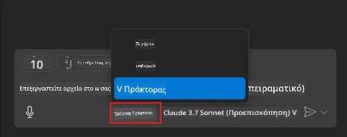
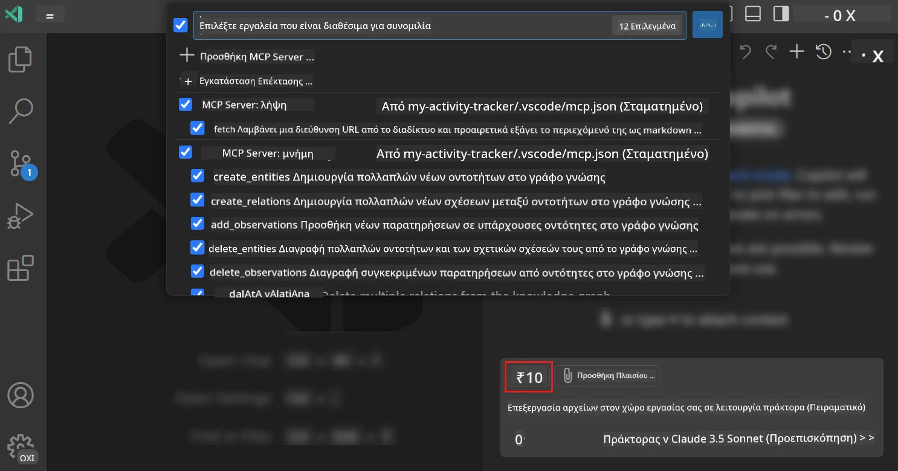
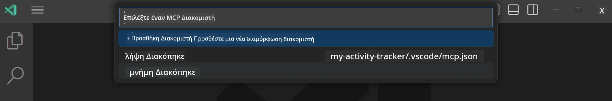
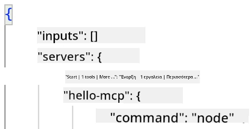
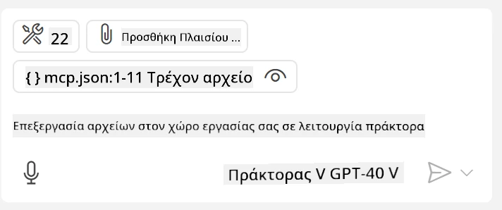
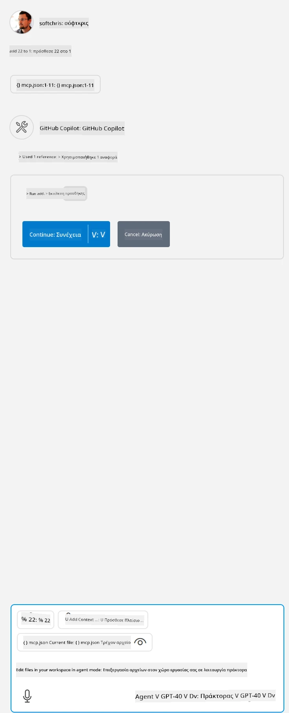

# Χρήση server από τη λειτουργία GitHub Copilot Agent

Το Visual Studio Code και το GitHub Copilot μπορούν να λειτουργούν ως πελάτες και να καταναλώνουν έναν MCP Server. Μπορεί να αναρωτιέστε γιατί να θέλαμε κάτι τέτοιο; Λοιπόν, αυτό σημαίνει ότι οποιαδήποτε δυνατότητα έχει ο MCP Server μπορεί τώρα να χρησιμοποιηθεί μέσα από το IDE σας. Φανταστείτε να προσθέτετε για παράδειγμα τον MCP server του GitHub, αυτό θα επέτρεπε τον έλεγχο του GitHub μέσω προτροπών αντί για πληκτρολόγηση συγκεκριμένων εντολών στο τερματικό. Ή φανταστείτε οτιδήποτε γενικά που θα μπορούσε να βελτιώσει τη εμπειρία του προγραμματιστή, όλα υπό τον έλεγχο φυσικής γλώσσας. Τώρα αρχίζετε να καταλαβαίνετε τη νίκη, σωστά;

## Επισκόπηση

Αυτό το μάθημα καλύπτει πώς να χρησιμοποιήσετε το Visual Studio Code και τη λειτουργία Agent του GitHub Copilot ως πελάτης για τον MCP Server σας.

## Στόχοι Μάθησης

Στο τέλος αυτού του μαθήματος, θα μπορείτε να:

- Καταναλώνετε έναν MCP Server μέσω Visual Studio Code.
- Εκτελείτε δυνατότητες όπως εργαλεία μέσω GitHub Copilot.
- Ρυθμίζετε το Visual Studio Code να βρίσκει και να διαχειρίζεται τον MCP Server σας.

## Χρήση

Μπορείτε να ελέγξετε τον MCP server σας με δύο διαφορετικούς τρόπους:

- Μέσω διεπαφής χρήστη, θα δείτε πώς γίνεται αυτό αργότερα σε αυτό το κεφάλαιο.
- Μέσω τερματικού, είναι δυνατόν να ελέγχετε τα πράγματα από το τερματικό χρησιμοποιώντας το εκτελέσιμο `code`:

  Για να προσθέσετε έναν MCP server στο προφίλ χρήστη σας, χρησιμοποιήστε την επιλογή γραμμής εντολών --add-mcp και παρέχετε τη διαμόρφωση του server σε μορφή JSON σαν {\"name\":\"server-name\",\"command\":...}.

  ```
  code --add-mcp "{\"name\":\"my-server\",\"command\": \"uvx\",\"args\": [\"mcp-server-fetch\"]}"
  ```

### Στιγμιότυπα Οθόνης





Ας μιλήσουμε περισσότερα για το πώς χρησιμοποιούμε την οπτική διεπαφή στις επόμενες ενότητες.

## Προσέγγιση

Δείτε πώς πρέπει να προσεγγίσουμε αυτό σε υψηλό επίπεδο:

- Διαμορφώστε ένα αρχείο για να βρείτε τον MCP Server μας.
- Ξεκινήστε/Συνδεθείτε στον server για να σας εμφανίσει τις δυνατότητές του.
- Χρησιμοποιήστε αυτές τις δυνατότητες μέσω της διεπαφής GitHub Copilot Chat.

Τέλεια, τώρα που καταλαβαίνουμε τη ροή, ας δοκιμάσουμε να χρησιμοποιήσουμε έναν MCP Server μέσω Visual Studio Code με μια άσκηση.

## Άσκηση: Χρήση ενός server

Σε αυτή την άσκηση, θα διαμορφώσουμε το Visual Studio Code ώστε να βρίσκει τον MCP server σας ώστε να μπορεί να χρησιμοποιηθεί από τη διεπαφή GitHub Copilot Chat.

### -0- Προπαρασκευή, ενεργοποίηση ανίχνευσης MCP Server

Ίσως χρειαστεί να ενεργοποιήσετε την ανίχνευση MCP Servers.

1. Μεταβείτε στο `File -> Preferences -> Settings` στο Visual Studio Code.

1. Αναζητήστε "MCP" και ενεργοποιήστε `chat.mcp.discovery.enabled` στο αρχείο settings.json.

### -1- Δημιουργία αρχείου διαμόρφωσης

Ξεκινήστε δημιουργώντας ένα αρχείο διαμόρφωσης στη ρίζα του έργου σας, θα χρειαστείτε ένα αρχείο με όνομα MCP.json και να τοποθετηθεί σε φάκελο που ονομάζεται .vscode. Θα πρέπει να μοιάζει ως εξής:

```text
.vscode
|-- mcp.json
```

Στη συνέχεια, ας δούμε πώς μπορούμε να προσθέσουμε καταχώρηση server.

### -2- Διαμόρφωση server

Προσθέστε το παρακάτω περιεχόμενο στο *mcp.json*:

```json
{
    "inputs": [],
    "servers": {
       "hello-mcp": {
           "command": "node",
           "args": [
               "build/index.js"
           ]
       }
    }
}
```

Εδώ είναι ένα απλό παράδειγμα πώς να ξεκινήσετε έναν server γραμμένο σε Node.js, για άλλες πλατφόρμες δείξτε την κατάλληλη εντολή εκκίνησης του server χρησιμοποιώντας `command` και `args`.

### -3- Εκκίνηση του server

Τώρα που έχετε προσθέσει την καταχώρηση, ας ξεκινήσουμε τον server:

1. Εντοπίστε την καταχώρησή σας στο *mcp.json* και βεβαιωθείτε ότι βλέπετε το εικονίδιο "play":

    

1. Κάντε κλικ στο εικονίδιο "play", θα πρέπει να δείτε το εικονίδιο εργαλείων στο GitHub Copilot Chat να αυξάνει τον αριθμό των διαθέσιμων εργαλείων. Αν κάνετε κλικ σε αυτό το εικονίδιο εργαλείων, θα δείτε μια λίστα καταχωρημένων εργαλείων. Μπορείτε να επιλέξετε/αποεπιλέξετε κάθε εργαλείο ανάλογα με το αν θέλετε το GitHub Copilot να τα χρησιμοποιεί ως πλαίσιο:

  

1. Για να τρέξετε ένα εργαλείο, πληκτρολογήστε μια προτροπή που ξέρετε ότι θα ταιριάξει με την περιγραφή ενός από τα εργαλεία σας, για παράδειγμα μια προτροπή όπως "πρόσθεσε 22 στο 1":

  

  Θα πρέπει να δείτε μια απάντηση που λέει 23.

## Ανάθεση

Προσπαθήστε να προσθέσετε μια καταχώρηση server στο αρχείο *mcp.json* και βεβαιωθείτε ότι μπορείτε να ξεκινήσετε/σταματήσετε τον server. Επίσης, βεβαιωθείτε ότι μπορείτε να επικοινωνήσετε με τα εργαλεία στον server σας μέσω της διεπαφής GitHub Copilot Chat.

## Λύση

[Λύση](./solution/README.md)

## Κύρια Συμπεράσματα

Τα συμπεράσματα από αυτό το κεφάλαιο είναι τα εξής:

- Το Visual Studio Code είναι ένας εξαιρετικός πελάτης που σας επιτρέπει να καταναλώνετε πολλούς MCP Servers και τα εργαλεία τους.
- Η διεπαφή GitHub Copilot Chat είναι ο τρόπος που αλληλεπιδράτε με τους servers.
- Μπορείτε να ζητήσετε από τον χρήστη να εισάγει δεδομένα όπως API keys που μπορούν να περαστούν στον MCP Server όταν διαμορφώνετε την καταχώρηση server στο αρχείο *mcp.json*.

## Παραδείγματα

- [Java Calculator](../samples/java/calculator/README.md)
- [.Net Calculator](../../../../03-GettingStarted/samples/csharp)
- [JavaScript Calculator](../samples/javascript/README.md)
- [TypeScript Calculator](../samples/typescript/README.md)
- [Python Calculator](../../../../03-GettingStarted/samples/python)

## Επιπλέον Πόροι

- [Έγγραφα Visual Studio](https://code.visualstudio.com/docs/copilot/chat/mcp-servers)

## Τι Ακολουθεί

- Επόμενο: [Δημιουργία stdio Server](../05-stdio-server/README.md)

---

<!-- CO-OP TRANSLATOR DISCLAIMER START -->
**Αποποίηση ευθυνών**:
Αυτό το έγγραφο έχει μεταφραστεί χρησιμοποιώντας την υπηρεσία μετάφρασης με τεχνητή νοημοσύνη [Co-op Translator](https://github.com/Azure/co-op-translator). Ενώ επιδιώκουμε την ακρίβεια, παρακαλούμε να έχετε υπόψη ότι οι αυτοματοποιημένες μεταφράσεις ενδέχεται να περιέχουν λάθη ή ανακρίβειες. Το πρωτότυπο έγγραφο στη μητρική του γλώσσα πρέπει να θεωρείται η αυθεντική πηγή. Για κρίσιμες πληροφορίες, συνιστάται επαγγελματική ανθρώπινη μετάφραση. Δεν φέρουμε ευθύνη για τυχόν παρεξηγήσεις ή λανθασμένες ερμηνείες που προκύπτουν από τη χρήση αυτής της μετάφρασης.
<!-- CO-OP TRANSLATOR DISCLAIMER END -->