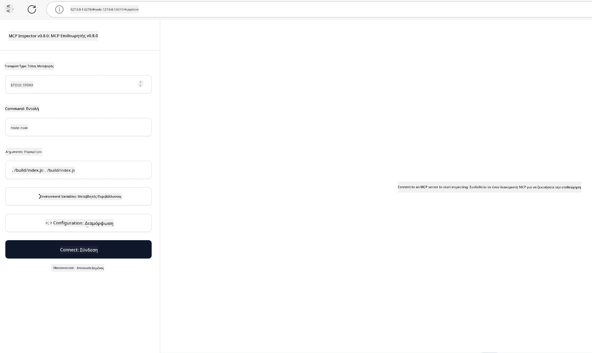

## Δοκιμή και Αποσφαλμάτωση

Πριν ξεκινήσετε να δοκιμάζετε τον MCP διακομιστή σας, είναι σημαντικό να κατανοήσετε τα διαθέσιμα εργαλεία και τις βέλτιστες πρακτικές για την αποσφαλμάτωση. Η αποτελεσματική δοκιμή εξασφαλίζει ότι ο διακομιστής σας λειτουργεί όπως αναμένεται και σας βοηθά να εντοπίσετε και να επιλύσετε γρήγορα προβλήματα. Η ακόλουθη ενότητα περιγράφει προτεινόμενες προσεγγίσεις για την επικύρωση της υλοποίησης MCP σας.

## Επισκόπηση

Αυτό το μάθημα καλύπτει τον τρόπο επιλογής της κατάλληλης προσέγγισης δοκιμής και του πιο αποτελεσματικού εργαλείου δοκιμής.

## Στόχοι Μάθησης

Μέχρι το τέλος αυτού του μαθήματος, θα μπορείτε να:

- Περιγράψετε διάφορες προσεγγίσεις για δοκιμές.
- Χρησιμοποιήσετε διαφορετικά εργαλεία για να δοκιμάσετε αποτελεσματικά τον κώδικά σας.


## Δοκιμή MCP Διακομιστών

Το MCP παρέχει εργαλεία για να σας βοηθήσει να δοκιμάσετε και να αποσφαλματώσετε τους διακομιστές σας:

- **MCP Inspector**: Ένα εργαλείο γραμμής εντολών που μπορεί να εκτελεστεί τόσο ως εργαλείο CLI όσο και ως οπτικό εργαλείο.
- **Χειροκίνητη δοκιμή**: Μπορείτε να χρησιμοποιήσετε ένα εργαλείο όπως το curl για να εκτελέσετε web αιτήματα, αλλά οποιοδήποτε εργαλείο μπορεί να εκτελέσει HTTP είναι κατάλληλο.
- **Μονάδες δοκιμής**: Είναι δυνατό να χρησιμοποιήσετε το προτιμώμενο πλαίσιο δοκιμής σας για να δοκιμάσετε τις λειτουργίες τόσο του διακομιστή όσο και του πελάτη.

### Χρήση του MCP Inspector

Έχουμε περιγράψει τη χρήση αυτού του εργαλείου σε προηγούμενα μαθήματα, αλλά ας μιλήσουμε γι' αυτό σε γενικές γραμμές. Είναι ένα εργαλείο κατασκευασμένο σε Node.js και μπορείτε να το χρησιμοποιήσετε καλώντας το εκτελέσιμο `npx`, το οποίο θα κατεβάσει και θα εγκαταστήσει προσωρινά το ίδιο το εργαλείο και θα καθαρίσει τον εαυτό του μόλις ολοκληρώσει την εκτέλεση του αιτήματός σας.

Ο [MCP Inspector](https://github.com/modelcontextprotocol/inspector) σας βοηθά να:

- **Ανακαλύψετε τις Δυνατότητες του Διακομιστή**: Αυτόματος εντοπισμός διαθέσιμων πόρων, εργαλείων και προτροπών
- **Δοκιμάσετε την Εκτέλεση Εργαλείων**: Δοκιμάστε διαφορετικές παραμέτρους και δείτε τις απαντήσεις σε πραγματικό χρόνο
- **Προβάλετε τα Μεταδεδομένα του Διακομιστή**: Εξετάστε πληροφορίες διακομιστή, σχήματα και ρυθμίσεις

Μια τυπική εκτέλεση του εργαλείου μοιάζει ως εξής:

```bash
npx @modelcontextprotocol/inspector node build/index.js
```

Η παραπάνω εντολή ξεκινά έναν MCP και τη οπτική διεπαφή του και ανοίγει μια τοπική web διεπαφή στον περιηγητή σας. Μπορείτε να περιμένετε να δείτε έναν πίνακα εργαλείων που εμφανίζει τους εγγεγραμμένους MCP διακομιστές σας, τα διαθέσιμα εργαλεία τους, πόρους και προτροπές. Η διεπαφή σας επιτρέπει να δοκιμάσετε διαδραστικά την εκτέλεση εργαλείων, να επιθεωρήσετε τα μεταδεδομένα του διακομιστή και να δείτε απαντήσεις σε πραγματικό χρόνο, καθιστώντας πιο εύκολη την επικύρωση και αποσφαλμάτωση των υλοποιήσεων MCP διακομιστών σας.

Δείτε πώς μπορεί να δείχνει: 

Μπορείτε επίσης να εκτελέσετε αυτό το εργαλείο σε λειτουργία CLI, στην οποία προσθέτετε το χαρακτηριστικό `--cli`. Εδώ είναι ένα παράδειγμα εκτέλεσης του εργαλείου σε λειτουργία "CLI" που εμφανίζει όλα τα εργαλεία στον διακομιστή:

```sh
npx @modelcontextprotocol/inspector --cli node build/index.js --method tools/list
```

### Χειροκίνητη Δοκιμή

Εκτός από την εκτέλεση του εργαλείου inspector για να δοκιμάσετε τις δυνατότητες του διακομιστή, μια άλλη παρόμοια προσέγγιση είναι να εκτελέσετε έναν πελάτη ικανό να χρησιμοποιεί HTTP, όπως για παράδειγμα το curl.

Με το curl, μπορείτε να δοκιμάσετε άμεσα τους MCP διακομιστές χρησιμοποιώντας αιτήματα HTTP:

```bash
# Παράδειγμα: Μεταδεδομένα διακομιστή δοκιμής
curl http://localhost:3000/v1/metadata

# Παράδειγμα: Εκτέλεση εργαλείου
curl -X POST http://localhost:3000/v1/tools/execute \
  -H "Content-Type: application/json" \
  -d '{"name": "calculator", "parameters": {"expression": "2+2"}}'
```

Όπως μπορείτε να δείτε από τη χρήση του curl παραπάνω, χρησιμοποιείτε ένα αίτημα POST για να καλέσετε ένα εργαλείο χρησιμοποιώντας ένα φορτίο που περιλαμβάνει το όνομα του εργαλείου και τις παραμέτρους του. Χρησιμοποιήστε την προσέγγιση που σας ταιριάζει καλύτερα. Τα εργαλεία CLI γενικά τείνουν να είναι ταχύτερα στη χρήση και επιτρέπουν τον αυτοματισμό, κάτι που μπορεί να είναι χρήσιμο σε ένα περιβάλλον CI/CD.

### Μονάδες Δοκιμής

Δημιουργήστε μονάδες δοκιμής για τα εργαλεία και τους πόρους σας ώστε να διασφαλίσετε ότι λειτουργούν όπως αναμένεται. Εδώ είναι ένα παράδειγμα κώδικα δοκιμών.

```python
import pytest

from mcp.server.fastmcp import FastMCP
from mcp.shared.memory import (
    create_connected_server_and_client_session as create_session,
)

# Σημειώστε ολόκληρο το module για ασύγχρονα τεστ
pytestmark = pytest.mark.anyio


async def test_list_tools_cursor_parameter():
    """Test that the cursor parameter is accepted for list_tools.

    Note: FastMCP doesn't currently implement pagination, so this test
    only verifies that the cursor parameter is accepted by the client.
    """

 server = FastMCP("test")

    # Δημιουργήστε μερικά εργαλεία δοκιμών
    @server.tool(name="test_tool_1")
    async def test_tool_1() -> str:
        """First test tool"""
        return "Result 1"

    @server.tool(name="test_tool_2")
    async def test_tool_2() -> str:
        """Second test tool"""
        return "Result 2"

    async with create_session(server._mcp_server) as client_session:
        # Δοκιμή χωρίς παράμετρο cursor (παραλείπεται)
        result1 = await client_session.list_tools()
        assert len(result1.tools) == 2

        # Δοκιμή με cursor=None
        result2 = await client_session.list_tools(cursor=None)
        assert len(result2.tools) == 2

        # Δοκιμή με cursor ως συμβολοσειρά
        result3 = await client_session.list_tools(cursor="some_cursor_value")
        assert len(result3.tools) == 2

        # Δοκιμή με κενή συμβολοσειρά για cursor
        result4 = await client_session.list_tools(cursor="")
        assert len(result4.tools) == 2
    
```

Ο προηγούμενος κώδικας κάνει τα εξής:

- Χρησιμοποιεί το πλαίσιο pytest που σας επιτρέπει να δημιουργείτε δοκιμές ως λειτουργίες και να χρησιμοποιείτε δηλώσεις assert.
- Δημιουργεί έναν MCP Διακομιστή με δύο διαφορετικά εργαλεία.
- Χρησιμοποιεί τη δήλωση `assert` για να ελέγξει ότι πληρούνται ορισμένες συνθήκες.

Ρίξτε μια ματιά στο [πλήρες αρχείο εδώ](https://github.com/modelcontextprotocol/python-sdk/blob/main/tests/client/test_list_methods_cursor.py)

Με βάση το παραπάνω αρχείο, μπορείτε να δοκιμάσετε τον δικό σας διακομιστή ώστε να εξασφαλίσετε ότι οι δυνατότητες δημιουργούνται όπως πρέπει.

Όλα τα βασικά SDK έχουν παρόμοιες ενότητες δοκιμών, ώστε να μπορείτε να προσαρμοστείτε στο επιλεγμένο περιβάλλον εκτέλεσης.

## Παραδείγματα 

- [Java Calculator](../samples/java/calculator/README.md)
- [.Net Calculator](../../../../03-GettingStarted/samples/csharp)
- [JavaScript Calculator](../samples/javascript/README.md)
- [TypeScript Calculator](../samples/typescript/README.md)
- [Python Calculator](../../../../03-GettingStarted/samples/python) 

## Επιπλέον Πόροι

- [Python SDK](https://github.com/modelcontextprotocol/python-sdk)

## Τι Ακολουθεί

- Επόμενο: [Ανάπτυξη](../09-deployment/README.md)

---

<!-- CO-OP TRANSLATOR DISCLAIMER START -->
**Αποποίηση ευθυνών**:
Αυτό το έγγραφο έχει μεταφραστεί χρησιμοποιώντας την υπηρεσία μετάφρασης με τεχνητή νοημοσύνη [Co-op Translator](https://github.com/Azure/co-op-translator). Ενώ επιδιώκουμε την ακρίβεια, παρακαλούμε να έχετε υπόψη ότι οι αυτοματοποιημένες μεταφράσεις ενδέχεται να περιέχουν λάθη ή ανακρίβειες. Το πρωτότυπο έγγραφο στη μητρική του γλώσσα πρέπει να θεωρείται η αυθεντική πηγή. Για κρίσιμες πληροφορίες, συνιστάται επαγγελματική ανθρώπινη μετάφραση. Δεν φέρουμε ευθύνη για τυχόν παρεξηγήσεις ή λανθασμένες ερμηνείες που προκύπτουν από τη χρήση αυτής της μετάφρασης.
<!-- CO-OP TRANSLATOR DISCLAIMER END -->