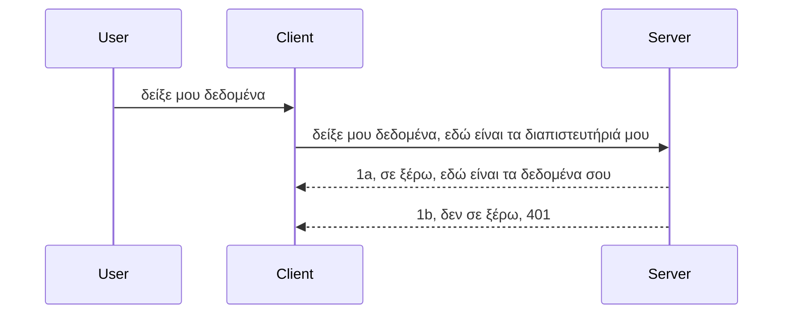

# Απλή αυθεντικοποίηση

Τα SDKs MCP υποστηρίζουν τη χρήση του OAuth 2.1 που για να είμαστε δίκαιοι είναι μια αρκετά περίπλοκη διαδικασία που περιλαμβάνει έννοιες όπως server αυθεντικοποίησης, server πόρων, αποστολή διαπιστευτηρίων, λήψη κωδικού, ανταλλαγή του κωδικού για ένα token bearer μέχρι να μπορέσεις τελικά να πάρεις τα δεδομένα του πόρου σου. Αν δεν έχεις εξοικειωθεί με το OAuth το οποίο είναι κάτι πολύ καλό να υλοποιήσεις, είναι καλή ιδέα να ξεκινήσεις με κάποια βασικά επίπεδα αυθεντικοποίησης και να προχωρήσεις προς όλο και καλύτερη ασφάλεια. Γι' αυτό υπάρχει αυτό το κεφάλαιο, για να σε προετοιμάσει για πιο προχωρημένη αυθεντικοποίηση.

## Αυθεντικοποίηση, τι εννοούμε;

Η αυθεντικοποίηση είναι συντομογραφία για authentication και authorization. Η ιδέα είναι ότι πρέπει να κάνουμε δύο πράγματα:

- **Authentication** (αυθεντικοποίηση), που είναι η διαδικασία να διαπιστώσουμε αν αφήνουμε κάποιον να μπει στο σπίτι μας, ότι έχει το δικαίωμα να είναι "εδώ", δηλαδή να έχει πρόσβαση στο resource server όπου ζουν τα χαρακτηριστικά του MCP Server μας.
- **Authorization** (εξουσιοδότηση), είναι η διαδικασία να διαπιστώσουμε αν ένας χρήστης πρέπει να έχει πρόσβαση σε αυτούς τους συγκεκριμένους πόρους που ζητάει, για παράδειγμα αυτές οι παραγγελίες ή αυτά τα προϊόντα ή αν επιτρέπεται να διαβάζει το περιεχόμενο αλλά όχι να το διαγράφει ως άλλο παράδειγμα.

## Διαπιστευτήρια: πώς λέμε στο σύστημα ποιοι είμαστε

Λοιπόν, οι περισσότεροι web developers εκεί έξω αρχίζουν να σκέφτονται με όρους παροχής διαπιστευτηρίων στον server, συνήθως ένα μυστικό που λέει αν επιτρέπεται να βρίσκεται "εδώ" - αυθεντικοποίηση. Αυτό το διαπιστευτήριο είναι συνήθως μια έκδοση κωδικοποιημένη σε base64 του ονόματος χρήστη και του κωδικού πρόσβασης ή ένα API key που προσδιορίζει μοναδικά έναν συγκεκριμένο χρήστη.

Αυτό περιλαμβάνει την αποστολή του μέσω μιας κεφαλίδας που ονομάζεται "Authorization" ως εξής:

```json
{ "Authorization": "secret123" }
```

Αυτό αναφέρεται συνήθως ως basic authentication. Ο τρόπος που δουλεύει συνολικά η ροή είναι ως εξής:


Τώρα που καταλαβαίνουμε πώς λειτουργεί από πλευράς ροής, πώς το υλοποιούμε; Λοιπόν, οι περισσότερες web servers έχουν μια έννοια που λέγεται middleware, ένα κομμάτι κώδικα που τρέχει ως μέρος του αιτήματος και μπορεί να επαληθεύσει τα διαπιστευτήρια, και αν τα διαπιστευτήρια είναι έγκυρα μπορεί να αφήσει το αίτημα να περάσει. Αν το αίτημα δεν έχει έγκυρα διαπιστευτήρια τότε λαμβάνεις σφάλμα αυθεντικοποίησης. Ας δούμε πώς μπορεί να υλοποιηθεί αυτό:

**Python**

```python
class AuthMiddleware(BaseHTTPMiddleware):
    async def dispatch(self, request, call_next):

        has_header = request.headers.get("Authorization")
        if not has_header:
            print("-> Missing Authorization header!")
            return Response(status_code=401, content="Unauthorized")

        if not valid_token(has_header):
            print("-> Invalid token!")
            return Response(status_code=403, content="Forbidden")

        print("Valid token, proceeding...")
       
        response = await call_next(request)
        # προσθέστε οποιεσδήποτε προσαρμοσμένες κεφαλίδες πελατών ή αλλάξτε με κάποιο τρόπο την απόκριση
        return response


starlette_app.add_middleware(CustomHeaderMiddleware)
```

Εδώ έχουμε:

- Δημιουργήσει ένα middleware που ονομάζεται `AuthMiddleware` όπου η μέθοδος `dispatch` καλείται από τον web server.
- Προσθέσει το middleware στον web server:

    ```python
    starlette_app.add_middleware(AuthMiddleware)
    ```

- Γράψει λογική επικύρωσης που ελέγχει αν υπάρχει το Authorization header και αν το μυστικό που αποστέλλεται είναι έγκυρο:

    ```python
    has_header = request.headers.get("Authorization")
    if not has_header:
        print("-> Missing Authorization header!")
        return Response(status_code=401, content="Unauthorized")

    if not valid_token(has_header):
        print("-> Invalid token!")
        return Response(status_code=403, content="Forbidden")
    ```

    αν το μυστικό υπάρχει και είναι έγκυρο τότε αφήνουμε το αίτημα να περάσει καλώντας `call_next` και επιστρέφουμε την απόκριση.

    ```python
    response = await call_next(request)
    # προσθέστε τυχόν προσαρμοσμένες κεφαλίδες πελατών ή αλλάξτε με κάποιο τρόπο την απόκριση
    return response
    ```

Πώς λειτουργεί: Αν γίνεται ένα web αίτημα στον server, το middleware θα κληθεί και δεδομένης της υλοποίησής του είτε θα αφήσει το αίτημα να περάσει είτε θα επιστρέψει σφάλμα που δείχνει ότι ο client δεν έχει δικαίωμα να προχωρήσει.

**TypeScript**

Εδώ δημιουργούμε ένα middleware με το δημοφιλές πλαίσιο Express και παρεμβαίνουμε στο αίτημα πριν φτάσει στον MCP Server. Ο κώδικας είναι ο εξής:

```typescript
function isValid(secret) {
    return secret === "secret123";
}

app.use((req, res, next) => {
    // 1. Υπάρχει κεφαλίδα εξουσιοδότησης;
    if(!req.headers["Authorization"]) {
        res.status(401).send('Unauthorized');
    }
    
    let token = req.headers["Authorization"];

    // 2. Ελέγξτε την εγκυρότητα.
    if(!isValid(token)) {
        res.status(403).send('Forbidden');
    }

   
    console.log('Middleware executed');
    // 3. Μεταβιβάζει το αίτημα στο επόμενο βήμα στη ροή επεξεργασίας αιτημάτων.
    next();
});
```

Σε αυτόν τον κώδικα:

1. Ελέγχουμε αν υπάρχει το Authorization header, αν όχι, στέλνουμε σφάλμα 401.
2. Βεβαιωνόμαστε ότι το διαπιστευτήριο/token είναι έγκυρο, αν όχι, στέλνουμε σφάλμα 403.
3. Τέλος, προωθεί το αίτημα στο pipeline και επιστρέφει τον ζητούμενο πόρο.

## Άσκηση: Υλοποίηση αυθεντικοποίησης

Ας πάρουμε τη γνώση μας και ας προσπαθήσουμε να την υλοποιήσουμε. Το σχέδιο είναι:

Server

- Δημιουργία web server και instance MCP.
- Υλοποίηση middleware για τον server.

Client

- Αποστολή web αιτήματος με διαπιστευτήριο μέσω header.

### -1- Δημιουργία web server και instance MCP

Στο πρώτο βήμα πρέπει να δημιουργήσουμε το instance του web server και του MCP Server.

**Python**

Εδώ δημιουργούμε ένα instance MCP server, μια εφαρμογή starlette web και τη φιλοξενούμε με uvicorn.

```python
# δημιουργία διακομιστή MCP

app = FastMCP(
    name="MCP Resource Server",
    instructions="Resource Server that validates tokens via Authorization Server introspection",
    host=settings["host"],
    port=settings["port"],
    debug=True
)

# δημιουργία εφαρμογής web starlette
starlette_app = app.streamable_http_app()

# εξυπηρέτηση εφαρμογής μέσω uvicorn
async def run(starlette_app):
    import uvicorn
    config = uvicorn.Config(
            starlette_app,
            host=app.settings.host,
            port=app.settings.port,
            log_level=app.settings.log_level.lower(),
        )
    server = uvicorn.Server(config)
    await server.serve()

run(starlette_app)
```

Σε αυτόν τον κώδικα:

- Δημιουργούμε τον MCP Server.
- Κατασκευάζουμε την εφαρμογή starlette web από τον MCP Server, με `app.streamable_http_app()`.
- Φιλοξενούμε και σερβίρουμε την εφαρμογή web χρησιμοποιώντας uvicorn `server.serve()`.

**TypeScript**

Εδώ δημιουργούμε ένα instance του MCP Server.

```typescript
const server = new McpServer({
      name: "example-server",
      version: "1.0.0"
    });

    // ... ρύθμιση πόρων διακομιστή, εργαλείων και προτροπών ...
```

Αυτή η δημιουργία MCP Server θα πρέπει να συμβαίνει μέσα στον ορισμό της διαδρομής POST /mcp, οπότε πάρτε τον παραπάνω κώδικα και μετακινήστε τον ως εξής:

```typescript
import express from "express";
import { randomUUID } from "node:crypto";
import { McpServer } from "@modelcontextprotocol/sdk/server/mcp.js";
import { StreamableHTTPServerTransport } from "@modelcontextprotocol/sdk/server/streamableHttp.js";
import { isInitializeRequest } from "@modelcontextprotocol/sdk/types.js"

const app = express();
app.use(express.json());

// Χάρτης για αποθήκευση μεταφορών κατά αναγνωριστικό συνεδρίας
const transports: { [sessionId: string]: StreamableHTTPServerTransport } = {};

// Διαχείριση αιτήσεων POST για επικοινωνία πελάτη-διακομιστή
app.post('/mcp', async (req, res) => {
  // Έλεγχος για υπάρχον αναγνωριστικό συνεδρίας
  const sessionId = req.headers['mcp-session-id'] as string | undefined;
  let transport: StreamableHTTPServerTransport;

  if (sessionId && transports[sessionId]) {
    // Επαναχρησιμοποίηση υπάρχουσας μεταφοράς
    transport = transports[sessionId];
  } else if (!sessionId && isInitializeRequest(req.body)) {
    // Νέο αίτημα αρχικοποίησης
    transport = new StreamableHTTPServerTransport({
      sessionIdGenerator: () => randomUUID(),
      onsessioninitialized: (sessionId) => {
        // Αποθήκευση της μεταφοράς κατά αναγνωριστικό συνεδρίας
        transports[sessionId] = transport;
      },
      // Η προστασία DNS rebinding είναι απενεργοποιημένη από προεπιλογή για συμβατότητα με παλαιότερες εκδόσεις. Εάν τρέχετε αυτόν τον διακομιστή
      // τοπικά, βεβαιωθείτε ότι έχετε ορίσει:
      // enableDnsRebindingProtection: true,
      // allowedHosts: ['127.0.0.1'],
    });

    // Καθαρισμός της μεταφοράς όταν κλείνει
    transport.onclose = () => {
      if (transport.sessionId) {
        delete transports[transport.sessionId];
      }
    };
    const server = new McpServer({
      name: "example-server",
      version: "1.0.0"
    });

    // ... ρύθμιση πόρων διακομιστή, εργαλείων και προτροπών ...

    // Σύνδεση με τον MCP διακομιστή
    await server.connect(transport);
  } else {
    // Μη έγκυρο αίτημα
    res.status(400).json({
      jsonrpc: '2.0',
      error: {
        code: -32000,
        message: 'Bad Request: No valid session ID provided',
      },
      id: null,
    });
    return;
  }

  // Διαχείριση του αιτήματος
  await transport.handleRequest(req, res, req.body);
});

// Επαναχρησιμοποιήσιμος χειριστής για αιτήσεις GET και DELETE
const handleSessionRequest = async (req: express.Request, res: express.Response) => {
  const sessionId = req.headers['mcp-session-id'] as string | undefined;
  if (!sessionId || !transports[sessionId]) {
    res.status(400).send('Invalid or missing session ID');
    return;
  }
  
  const transport = transports[sessionId];
  await transport.handleRequest(req, res);
};

// Διαχείριση αιτήσεων GET για ειδοποιήσεις από διακομιστή σε πελάτη μέσω SSE
app.get('/mcp', handleSessionRequest);

// Διαχείριση αιτήσεων DELETE για τερματισμό συνεδρίας
app.delete('/mcp', handleSessionRequest);

app.listen(3000);
```

Τώρα βλέπετε πώς η δημιουργία MCP Server μεταφέρθηκε μέσα στο `app.post("/mcp")`.

Προχωράμε στο επόμενο βήμα, τη δημιουργία του middleware ώστε να μπορούμε να επικυρώνουμε τα εισερχόμενα διαπιστευτήρια.

### -2- Υλοποίηση middleware για τον server

Ας περάσουμε στο κομμάτι του middleware. Εδώ θα δημιουργήσουμε ένα middleware που ψάχνει για διαπιστευτήριο στην κεφαλίδα `Authorization` και το επικυρώνει. Αν είναι αποδεκτό τότε το αίτημα θα προχωρήσει στο να κάνει ό,τι χρειάζεται (π.χ. λίστα εργαλείων, ανάγνωση πόρου ή όποια λειτουργία MCP ζήτησε ο client).

**Python**

Για να δημιουργήσουμε το middleware, πρέπει να φτιάξουμε μια κλάση που κληρονομεί από `BaseHTTPMiddleware`. Υπάρχουν δύο ενδιαφέροντα στοιχεία:

- Το αίτημα `request`, από το οποίο διαβάζουμε τις πληροφορίες των κεφαλίδων.
- Το `call_next`, το callback που πρέπει να καλέσουμε αν ο client έφερε διαπιστευτήριο που αποδεχόμαστε.

Πρώτα πρέπει να χειριστούμε την περίπτωση αν λείπει το header `Authorization`:

```python
has_header = request.headers.get("Authorization")

# δεν υπάρχει επικεφαλίδα, αποτυχία με 401, αλλιώς συνέχισε.
if not has_header:
    print("-> Missing Authorization header!")
    return Response(status_code=401, content="Unauthorized")
```

Εδώ στέλνουμε μήνυμα 401 unauthorized καθώς ο client αποτυγχάνει στην αυθεντικοποίηση.

Έπειτα, αν υποβλήθηκε διαπιστευτήριο, πρέπει να ελέγξουμε την εγκυρότητά του ως εξής:

```python
 if not valid_token(has_header):
    print("-> Invalid token!")
    return Response(status_code=403, content="Forbidden")
```

Παρατηρήστε πώς στέλνουμε μήνυμα 403 forbidden παραπάνω. Ας δούμε ολόκληρο το middleware παρακάτω που υλοποιεί όλα όσα είπαμε:

```python
class AuthMiddleware(BaseHTTPMiddleware):
    async def dispatch(self, request, call_next):

        has_header = request.headers.get("Authorization")
        if not has_header:
            print("-> Missing Authorization header!")
            return Response(status_code=401, content="Unauthorized")

        if not valid_token(has_header):
            print("-> Invalid token!")
            return Response(status_code=403, content="Forbidden")

        print("Valid token, proceeding...")
        print(f"-> Received {request.method} {request.url}")
        response = await call_next(request)
        response.headers['Custom'] = 'Example'
        return response

```

Τέλεια, αλλά τι γίνεται με τη συνάρτηση `valid_token`; Εδώ είναι παρακάτω:

```python
# ΜΗΝ το χρησιμοποιείτε για παραγωγή - βελτιώστε το !!
def valid_token(token: str) -> bool:
    # αφαιρέστε το πρόθεμα "Bearer "
    if token.startswith("Bearer "):
        token = token[7:]
        return token == "secret-token"
    return False
```

Αυτό προφανώς πρέπει να βελτιωθεί.

ΣΗΜΑΝΤΙΚΟ: Δεν πρέπει ΠΟΤΕ να έχεις μυστικά όπως αυτό στον κώδικα. Ιδανικά πρέπει να αντλείς την τιμή για σύγκριση από πηγή δεδομένων ή από IDP (πάροχο ταυτότητας) ή καλύτερα, να αφήνεις τον IDP να κάνει την επικύρωση.

**TypeScript**

Για να το υλοποιήσουμε με Express, πρέπει να καλέσουμε τη μέθοδο `use` που λαμβάνει συναρτήσεις middleware.

Πρέπει να:

- Αλληλεπιδράσουμε με τη μεταβλητή request για να ελέγξουμε το διαπιστευτήριο που περνάει στην ιδιότητα `Authorization`.
- Επικυρώσουμε το διαπιστευτήριο, και αν είναι έγκυρο αφήνουμε το αίτημα να συνεχίσει και να εκτελέσει την αίτηση MCP του client (π.χ. λίστα εργαλείων, ανάγνωση πόρου ή ό,τι άλλο σχετίζεται με MCP).

Εδώ, ελέγχουμε αν υπάρχει το header `Authorization` και αν όχι, σταματάμε το αίτημα να προχωρήσει:

```typescript
if(!req.headers["authorization"]) {
    res.status(401).send('Unauthorized');
    return;
}
```

Αν το header δεν αποσταλεί, λαμβάνεις σφάλμα 401.

Έπειτα, ελέγχουμε αν το διαπιστευτήριο είναι έγκυρο, αν όχι ξανά σταματάμε το αίτημα με ένα διαφορετικό μήνυμα:

```typescript
if(!isValid(token)) {
    res.status(403).send('Forbidden');
    return;
} 
```

Παρατηρήστε πώς λαμβάνετε τώρα σφάλμα 403.

Ολόκληρος ο κώδικας:

```typescript
app.use((req, res, next) => {
    console.log('Request received:', req.method, req.url, req.headers);
    console.log('Headers:', req.headers["authorization"]);
    if(!req.headers["authorization"]) {
        res.status(401).send('Unauthorized');
        return;
    }
    
    let token = req.headers["authorization"];

    if(!isValid(token)) {
        res.status(403).send('Forbidden');
        return;
    }  

    console.log('Middleware executed');
    next();
});
```

Έχουμε ρυθμίσει τον web server να δέχεται middleware για να ελέγχει τα διαπιστευτήρια που μας στέλνει ο client, τι γίνεται όμως με τον ίδιο τον client;

### -3- Αποστολή web αιτήματος με διαπιστευτήριο μέσω header

Πρέπει να διασφαλίσουμε ότι ο client περνάει τα διαπιστευτήρια μέσω της κεφαλίδας. Καθώς θα χρησιμοποιήσουμε έναν MCP client για αυτό, πρέπει να δούμε πώς γίνεται.

**Python**

Για τον client πρέπει να περάσουμε μια κεφαλίδα με το διαπιστευτήριο ως εξής:

```python
# ΜΗ σκληροκωδικοποιείτε την τιμή, να βρίσκεται τουλάχιστον σε μια μεταβλητή περιβάλλοντος ή σε πιο ασφαλή αποθήκευση
token = "secret-token"

async with streamablehttp_client(
        url = f"http://localhost:{port}/mcp",
        headers = {"Authorization": f"Bearer {token}"}
    ) as (
        read_stream,
        write_stream,
        session_callback,
    ):
        async with ClientSession(
            read_stream,
            write_stream
        ) as session:
            await session.initialize()
      
            # TODO, τι θέλετε να γίνει στον πελάτη, π.χ. λίστα εργαλείων, κλήση εργαλείων κ.λπ.
```

Παρατηρήστε πώς γεμίζουμε την ιδιότητα `headers` ως `headers = {"Authorization": f"Bearer {token}"}`.

**TypeScript**

Μπορούμε να το λύσουμε σε δύο βήματα:

1. Να γεμίσουμε ένα αντικείμενο ρυθμίσεων με το διαπιστευτήριο.
2. Να περάσουμε το αντικείμενο ρυθμίσεων στη μεταφορά (transport).

```typescript

// ΜΗΝ σκληροκωδικοποιείτε την τιμή όπως φαίνεται εδώ. Τουλάχιστον να την έχετε ως μεταβλητή περιβάλλοντος και να χρησιμοποιείτε κάτι σαν το dotenv (σε λειτουργία ανάπτυξης).
let token = "secret123"

// ορίστε ένα αντικείμενο επιλογών μεταφοράς πελάτη
let options: StreamableHTTPClientTransportOptions = {
  sessionId: sessionId,
  requestInit: {
    headers: {
      "Authorization": "secret123"
    }
  }
};

// περάστε το αντικείμενο επιλογών στη μεταφορά
async function main() {
   const transport = new StreamableHTTPClientTransport(
      new URL(serverUrl),
      options
   );
```

Εδώ βλέπετε πώς δημιουργήσαμε ένα αντικείμενο `options` και τοποθετήσαμε τις κεφαλίδες μας στην ιδιότητα `requestInit`.

ΣΗΜΑΝΤΙΚΟ: Πώς μπορούμε να το βελτιώσουμε από εδώ και πέρα; Λοιπόν, η τρέχουσα υλοποίηση έχει κάποια ζητήματα. Πρώτον, η αποστολή διαπιστευτηρίου έτσι είναι αρκετά ριψοκίνδυνη αν δεν έχεις τουλάχιστον HTTPS. Ακόμα και τότε, το διαπιστευτήριο μπορεί να κλαπεί, οπότε χρειάζεσαι ένα σύστημα όπου μπορείς εύκολα να αναιρέσεις το token και να προσθέσεις πρόσθετους ελέγχους όπως από πού στον κόσμο προέρχεται, αν το αίτημα γίνεται πάρα πολύ συχνά (συμπεριφορά bot), συνολικά υπάρχουν πολλές ανησυχίες.

Πρέπει να ειπωθεί όμως, για πολύ απλά APIs όπου δεν θες κανέναν να καλεί το API σου χωρίς να αυθεντικοποιείται, αυτά που έχουμε εδώ είναι μια καλή αρχή.

Έχοντας πει αυτά, ας δοκιμάσουμε να ενισχύσουμε κάπως την ασφάλεια χρησιμοποιώντας ένα τυποποιημένο format όπως το JSON Web Token, γνωστό και ως JWT ή διακριτικά "JOT".

## JSON Web Tokens, JWT

Λοιπόν, προσπαθούμε να βελτιώσουμε τα πράγματα από το να στέλνουμε πολύ απλά διαπιστευτήρια. Ποιες είναι οι άμεσες βελτιώσεις που παίρνουμε υιοθετώντας το JWT;

- **Βελτιώσεις ασφάλειας**. Στην basic auth στέλνεις username και password ως base64 κωδικοποιημένο token (ή στέλνεις API key) ξανά και ξανά, κάτι που αυξάνει τον κίνδυνο. Με το JWT, στέλνεις username και password και λαμβάνεις ένα token σε αντάλλαγμα και μάλιστα χρονικά περιορισμένο που λήγει. Το JWT σου επιτρέπει να χρησιμοποιείς εύκολα λεπτομερή έλεγχο πρόσβασης με ρόλους, scopes και permissions.
- **Ανεξαρτησία κατάστασης και κλιμάκωση**. Τα JWT είναι αυτοπεριεχόμενα, μεταφέρουν όλες τις πληροφορίες του χρήστη και εξαλείφουν την ανάγκη αποθήκευσης session στον server. Το token μπορεί να επικυρωθεί τοπικά.
- **Διαλειτουργικότητα και ομοσπονδία**. Τα JWT είναι κεντρικά στο Open ID Connect και χρησιμοποιούνται με γνωστούς παρόχους ταυτότητας όπως Entra ID, Google Identity και Auth0. Επιτρέπουν επίσης τη χρήση single sign on και πολλά άλλα καθιστώντας τα κατάλληλα για επιχειρήσεις.
- **Αρθρωτότητα και ευελιξία**. Τα JWT μπορούν επίσης να χρησιμοποιηθούν με API Gateways όπως Azure API Management, NGINX και άλλα. Υποστηρίζουν ακόμα σεναρια αυθεντικοποίησης και επικοινωνίας server-to-service συμπεριλαμβανομένων σεναρίων εκπροσώπησης και ανάθεσης.
- **Απόδοση και caching**. Τα JWT μπορούν να αποθηκευτούν cached μετά την αποκωδικοποίησή τους μειώνοντας την ανάγκη parsing. Αυτό βοηθά ιδιαίτερα με εφαρμογές υψηλής κυκλοφορίας καθώς βελτιώνει την απόδοση και μειώνει το φόρτο στην υποδομή.
- **Προχωρημένα χαρακτηριστικά**. Υποστηρίζουν introspection (έλεγχο εγκυρότητας στον server) και revocation (ακύρωση token).

Με όλα αυτά τα οφέλη, ας δούμε πώς μπορούμε να ανεβάσουμε την υλοποίησή μας σε επόμενο επίπεδο.

## Μετατροπή της basic auth σε JWT

Λοιπόν, οι αλλαγές που πρέπει να κάνουμε σε μεγάλο επίπεδο είναι:

- **Μάθε να δημιουργείς ένα JWT token** και να το ετοιμάζεις για αποστολή από τον client προς τον server.
- **Επικύρωσε ένα JWT token**, και αν είναι έγκυρο, άφησε τον client να έχει πρόσβαση στους πόρους μας.
- **Ασφαλής αποθήκευση token**. Πώς αποθηκεύουμε αυτό το token.
- **Προστασία των διαδρομών**. Πρέπει να προστατεύσουμε τις διαδρομές μας, στην περίπτωσή μας να προστατεύσουμε συγκεκριμένες διαδρομές και δυνατότητες MCP.
- **Πρόσθεσε refresh tokens**. Εξασφάλισε ότι δημιουργούμε tokens βραχυπρόθεσμα αλλά και refresh tokens μακροπρόθεσμα που μπορούν να χρησιμοποιηθούν για απόκτηση νέων tokens αν λήξουν. Επίσης εξασφάλισε ότι υπάρχει endpoint για refresh και στρατηγική περιστροφής.

### -1- Δημιουργία ενός JWT token

Καταρχάς, ένα JWT token έχει τα εξής μέρη:

- **header**, ο αλγόριθμος και ο τύπος του token.
- **payload**, τα claims, όπως sub (ο χρήστης ή οντότητα που αναπαριστά το token, σε auth σενάριο συνήθως το userid), exp (πότε λήγει), role (ο ρόλος)
- **signature**, υπογεγραμμένο με ένα μυστικό ή ιδιωτικό κλειδί.

Για αυτό, πρέπει να δημιουργήσουμε το header, το payload και να κωδικοποιήσουμε το token.

**Python**

```python

import jwt
import jwt
from jwt.exceptions import ExpiredSignatureError, InvalidTokenError
import datetime

# Μυστικό κλειδί που χρησιμοποιείται για την υπογραφή του JWT
secret_key = 'your-secret-key'

header = {
    "alg": "HS256",
    "typ": "JWT"
}

# οι πληροφορίες χρήστη και οι ισχυρισμοί του και ο χρόνος λήξης
payload = {
    "sub": "1234567890",               # Θέμα (αναγνωριστικό χρήστη)
    "name": "User Userson",                # Προσαρμοσμένος ισχυρισμός
    "admin": True,                     # Προσαρμοσμένος ισχυρισμός
    "iat": datetime.datetime.utcnow(),# Εκδόθηκε στις
    "exp": datetime.datetime.utcnow() + datetime.timedelta(hours=1)  # Λήξη
}

# κωδικοποιήστε το
encoded_jwt = jwt.encode(payload, secret_key, algorithm="HS256", headers=header)
```

Στον παραπάνω κώδικα έχουμε:

- Ορίσει ένα header χρησιμοποιώντας HS256 ως αλγόριθμο και τύπο JWT.
- Δημιουργήσει payload που περιέχει ένα subject ή user id, όνομα χρήστη, ρόλο, πότε εκδόθηκε και πότε λήγει, υλοποιώντας δηλαδή το χρονικό περιορισμό που αναφέραμε.

**TypeScript**

Εδώ θα χρειαστούμε κάποιες εξαρτήσεις που θα μας βοηθήσουν να δημιουργήσουμε το JWT token.

Εξαρτήσεις

```sh

npm install jsonwebtoken
npm install --save-dev @types/jsonwebtoken
```

Τώρα που έχουμε αυτά, ας δημιουργήσουμε το header, το payload και μέσα από αυτά το κωδικοποιημένο token.

```typescript
import jwt from 'jsonwebtoken';

const secretKey = 'your-secret-key'; // Χρησιμοποιήστε μεταβλητές περιβάλλοντος στην παραγωγή

// Ορίστε το φορτίο
const payload = {
  sub: '1234567890',
  name: 'User usersson',
  admin: true,
  iat: Math.floor(Date.now() / 1000), // Εκδόθηκε στις
  exp: Math.floor(Date.now() / 1000) + 60 * 60 // Λήγει σε 1 ώρα
};

// Ορίστε την κεφαλίδα (προαιρετικό, το jsonwebtoken ορίζει προεπιλογές)
const header = {
  alg: 'HS256',
  typ: 'JWT'
};

// Δημιουργήστε το διακριτικό
const token = jwt.sign(payload, secretKey, {
  algorithm: 'HS256',
  header: header
});

console.log('JWT:', token);
```

Αυτό το token:

Υπογράφεται με HS256
Είναι έγκυρο για 1 ώρα
Περιέχει claims όπως sub, name, admin, iat, και exp.

### -2- Επικύρωση token

Θα χρειαστούμε επίσης να επικυρώσουμε το token, κάτι που πρέπει να κάνουμε στον server για να διασφαλίσουμε ότι αυτό που μας στέλνει ο client είναι πράγματι έγκυρο. Πρέπει να κάνουμε πολλούς ελέγχους από το να επικυρώσουμε τη δομή έως την εγκυρότητά του. Επίσης προτρέπεται να προσθέσεις και άλλους ελέγχους όπως να δεις αν ο χρήστης υπάρχει στο σύστημά σου και άλλα.

Για να επικυρώσεις ένα token, πρέπει να το αποκωδικοποιήσεις ώστε να το διαβάσεις και μετά να ξεκινήσεις να ελέγχεις την εγκυρότητά του:

**Python**

```python

# Αποκωδικοποιήστε και επαληθεύστε το JWT
try:
    decoded = jwt.decode(token, secret_key, algorithms=["HS256"])
    print("✅ Token is valid.")
    print("Decoded claims:")
    for key, value in decoded.items():
        print(f"  {key}: {value}")
except ExpiredSignatureError:
    print("❌ Token has expired.")
except InvalidTokenError as e:
    print(f"❌ Invalid token: {e}")

```

Σε αυτόν τον κώδικα καλούμε `jwt.decode` χρησιμοποιώντας το token, το μυστικό κλειδί και τον επιλεγμένο αλγόριθμο ως είσοδο. Παρατήρησε πώς χρησιμοποιούμε try-catch καθώς μια αποτυχημένη επικύρωση οδηγεί σε λάθος.

**TypeScript**

Εδώ πρέπει να καλέσουμε `jwt.verify` για να πάρουμε μια αποκωδικοποιημένη έκδοση του token την οποία μπορούμε να αναλύσουμε περαιτέρω. Αν η κλήση αποτύχει, σημαίνει ότι η δομή του token είναι εσφαλμένη ή δεν είναι πλέον έγκυρο.

```typescript

try {
  const decoded = jwt.verify(token, secretKey);
  console.log('Decoded Payload:', decoded);
} catch (err) {
  console.error('Token verification failed:', err);
}
```

ΣΗΜΕΙΩΣΗ: όπως αναφέρθηκε προηγουμένως, πρέπει να κάνουμε επιπλέον ελέγχους για να βεβαιωθούμε ότι το token δείχνει σε χρήστη στο σύστημά μας και ότι ο χρήστης έχει τα δικαιώματα που υποστηρίζει το token.

Έπειτα, ας δούμε τον έλεγχο πρόσβασης βάσει ρόλων, γνωστό και ως RBAC.
## Προσθήκη ελέγχου πρόσβασης βασισμένου σε ρόλο

Η ιδέα είναι ότι θέλουμε να εκφράσουμε ότι διαφορετικοί ρόλοι έχουν διαφορετικές άδειες. Για παράδειγμα, υποθέτουμε ότι ένας διαχειριστής μπορεί να κάνει τα πάντα, ένας κανονικός χρήστης μπορεί να διαβάζει/γράφει και ένας επισκέπτης μπορεί μόνο να διαβάζει. Επομένως, εδώ είναι μερικά πιθανά επίπεδα αδειών:

- Admin.Write 
- User.Read
- Guest.Read

Ας δούμε πώς μπορούμε να υλοποιήσουμε έναν τέτοιο έλεγχο με middleware. Τα middleware μπορούν να προστεθούν ανά διαδρομή καθώς και για όλες τις διαδρομές.

**Python**

```python
from starlette.middleware.base import BaseHTTPMiddleware
from starlette.responses import JSONResponse
import jwt

# ΜΗΝ έχετε το μυστικό στον κώδικα, αυτό είναι μόνο για σκοπούς επίδειξης. Διαβάστε το από ένα ασφαλές μέρος.
SECRET_KEY = "your-secret-key" # βάλτε το σε μεταβλητή περιβάλλοντος
REQUIRED_PERMISSION = "User.Read"

class JWTPermissionMiddleware(BaseHTTPMiddleware):
    async def dispatch(self, request, call_next):
        auth_header = request.headers.get("Authorization")
        if not auth_header or not auth_header.startswith("Bearer "):
            return JSONResponse({"error": "Missing or invalid Authorization header"}, status_code=401)

        token = auth_header.split(" ")[1]
        try:
            decoded = jwt.decode(token, SECRET_KEY, algorithms=["HS256"])
        except jwt.ExpiredSignatureError:
            return JSONResponse({"error": "Token expired"}, status_code=401)
        except jwt.InvalidTokenError:
            return JSONResponse({"error": "Invalid token"}, status_code=401)

        permissions = decoded.get("permissions", [])
        if REQUIRED_PERMISSION not in permissions:
            return JSONResponse({"error": "Permission denied"}, status_code=403)

        request.state.user = decoded
        return await call_next(request)


```

Υπάρχουν μερικοί διαφορετικοί τρόποι να προσθέσουμε το middleware όπως παρακάτω:

```python

# Εναλλακτικό 1: πρόσθεσε middleware κατά τη δημιουργία της εφαρμογής starlette
middleware = [
    Middleware(JWTPermissionMiddleware)
]

app = Starlette(routes=routes, middleware=middleware)

# Εναλλακτικό 2: πρόσθεσε middleware αφού η εφαρμογή starlette έχει ήδη δημιουργηθεί
starlette_app.add_middleware(JWTPermissionMiddleware)

# Εναλλακτικό 3: πρόσθεσε middleware ανά διαδρομή
routes = [
    Route(
        "/mcp",
        endpoint=..., # χειριστής
        middleware=[Middleware(JWTPermissionMiddleware)]
    )
]
```

**TypeScript**

Μπορούμε να χρησιμοποιήσουμε το `app.use` και ένα middleware που θα τρέχει για όλα τα αιτήματα.

```typescript
app.use((req, res, next) => {
    console.log('Request received:', req.method, req.url, req.headers);
    console.log('Headers:', req.headers["authorization"]);

    // 1. Ελέγξτε αν έχει σταλεί η κεφαλίδα εξουσιοδότησης

    if(!req.headers["authorization"]) {
        res.status(401).send('Unauthorized');
        return;
    }
    
    let token = req.headers["authorization"];

    // 2. Ελέγξτε αν το διακριτικό (token) είναι έγκυρο
    if(!isValid(token)) {
        res.status(403).send('Forbidden');
        return;
    }  

    // 3. Ελέγξτε αν ο χρήστης του διακριτικού υπάρχει στο σύστημά μας
    if(!isExistingUser(token)) {
        res.status(403).send('Forbidden');
        console.log("User does not exist");
        return;
    }
    console.log("User exists");

    // 4. Επαληθεύστε ότι το διακριτικό έχει τα σωστά δικαιώματα
    if(!hasScopes(token, ["User.Read"])){
        res.status(403).send('Forbidden - insufficient scopes');
    }

    console.log("User has required scopes");

    console.log('Middleware executed');
    next();
});

```

Υπάρχουν αρκετά πράγματα που μπορούμε να αφήσουμε το middleware μας να κάνει και που ΘΑ ΠΡΕΠΕΙ να κάνει, συγκεκριμένα:

1. Έλεγχος αν υπάρχει επικεφαλίδα εξουσιοδότησης
2. Έλεγχος αν το token είναι έγκυρο, καλούμε το `isValid` το οποίο είναι μια μέθοδος που γράψαμε και ελέγχει την ακεραιότητα και εγκυρότητα του JWT token.
3. Επιβεβαίωση ότι ο χρήστης υπάρχει στο σύστημά μας, πρέπει να ελέγξουμε αυτό.

   ```typescript
    // χρήστες στη βάση δεδομένων
   const users = [
     "user1",
     "User usersson",
   ]

   function isExistingUser(token) {
     let decodedToken = verifyToken(token);

     // ΕΚΚΡΕΜΕΙ, έλεγχος αν ο χρήστης υπάρχει στη βάση δεδομένων
     return users.includes(decodedToken?.name || "");
   }
   ```

   Πάνω, δημιουργήσαμε μια πολύ απλή λίστα `users`, η οποία προφανώς θα πρέπει να βρίσκεται σε βάση δεδομένων.

4. Επιπλέον, πρέπει επίσης να ελέγξουμε αν το token έχει τα σωστά δικαιώματα.

   ```typescript
   if(!hasScopes(token, ["User.Read"])){
        res.status(403).send('Forbidden - insufficient scopes');
   }
   ```

   Στον παραπάνω κώδικα από το middleware, ελέγχουμε ότι το token περιέχει την άδεια User.Read, αν όχι στέλνουμε σφάλμα 403. Παρακάτω είναι η βοηθητική μέθοδος `hasScopes`.

   ```typescript
   function hasScopes(scope: string, requiredScopes: string[]) {
     let decodedToken = verifyToken(scope);
    return requiredScopes.every(scope => decodedToken?.scopes.includes(scope));
  }
   ```

Have a think which additional checks you should be doing, but these are the absolute minimum of checks you should be doing.

Using Express as a web framework is a common choice. There are helpers library when you use JWT so you can write less code.

- `express-jwt`, helper library that provides a middleware that helps decode your token.
- `express-jwt-permissions`, this provides a middleware `guard` that helps check if a certain permission is on the token.

Here's what these libraries can look like when used:

```typescript
const express = require('express');
const jwt = require('express-jwt');
const guard = require('express-jwt-permissions')();

const app = express();
const secretKey = 'your-secret-key'; // put this in env variable

// Decode JWT and attach to req.user
app.use(jwt({ secret: secretKey, algorithms: ['HS256'] }));

// Check for User.Read permission
app.use(guard.check('User.Read'));

// multiple permissions
// app.use(guard.check(['User.Read', 'Admin.Access']));

app.get('/protected', (req, res) => {
  res.json({ message: `Welcome ${req.user.name}` });
});

// Error handler
app.use((err, req, res, next) => {
  if (err.code === 'permission_denied') {
    return res.status(403).send('Forbidden');
  }
  next(err);
});

```

Τώρα που είδατε πώς μπορεί να χρησιμοποιηθεί middleware για αυθεντικοποίηση και εξουσιοδότηση, τι γίνεται με το MCP, αλλάζει τον τρόπο που κάνουμε auth; Ας το ανακαλύψουμε στην επόμενη ενότητα.

### -3- Προσθήκη RBAC στο MCP

Έχετε δεί μέχρι τώρα πώς μπορείτε να προσθέσετε RBAC μέσω middleware, ωστόσο, για το MCP δεν υπάρχει εύκολος τρόπος να προστεθεί RBAC ανά λειτουργία MCP, οπότε τι κάνουμε; Λοιπόν, απλά πρέπει να προσθέσουμε κώδικα όπως αυτόν που ελέγχει σε αυτή την περίπτωση αν ο πελάτης έχει τα δικαιώματα να καλέσει ένα συγκεκριμένο εργαλείο:

Έχετε μερικές διαφορετικές επιλογές για το πώς να πετύχετε RBAC ανά λειτουργία, εδώ είναι μερικές:

- Προσθήκη ελέγχου για κάθε εργαλείο, πόρο, prompt όπου χρειάζεται να ελέγξετε το επίπεδο αδειών.

   **python**

   ```python
   @tool()
   def delete_product(id: int):
      try:
          check_permissions(role="Admin.Write", request)
      catch:
        pass # Ο πελάτης απέτυχε στην εξουσιοδότηση, προκύπτει σφάλμα εξουσιοδότησης
   ```

   **typescript**

   ```typescript
   server.registerTool(
    "delete-product",
    {
      title: Delete a product",
      description: "Deletes a product",
      inputSchema: { id: z.number() }
    },
    async ({ id }) => {
      
      try {
        checkPermissions("Admin.Write", request);
        // να κάνετε, στείλτε το αναγνωριστικό στο productService και την απομακρυσμένη είσοδο
      } catch(Exception e) {
        console.log("Authorization error, you're not allowed");  
      }

      return {
        content: [{ type: "text", text: `Deletected product with id ${id}` }]
      };
    }
   );
   ```


- Χρήση προχωρημένης προσέγγισης server και των χειριστών αιτήσεων ώστε να ελαχιστοποιήσετε τα σημεία όπου χρειάζεται να γίνει ο έλεγχος.

   **Python**

   ```python
   
   tool_permission = {
      "create_product": ["User.Write", "Admin.Write"],
      "delete_product": ["Admin.Write"]
   }

   def has_permission(user_permissions, required_permissions) -> bool:
      # user_permissions: λίστα δικαιωμάτων που έχει ο χρήστης
      # required_permissions: λίστα δικαιωμάτων που απαιτούνται για το εργαλείο
      return any(perm in user_permissions for perm in required_permissions)

   @server.call_tool()
   async def handle_call_tool(
     name: str, arguments: dict[str, str] | None
   ) -> list[types.TextContent]:
    # Υποθέστε ότι request.user.permissions είναι μια λίστα δικαιωμάτων για τον χρήστη
     user_permissions = request.user.permissions
     required_permissions = tool_permission.get(name, [])
     if not has_permission(user_permissions, required_permissions):
        # Ανυψώστε σφάλμα "Δεν έχετε δικαίωμα να καλέσετε το εργαλείο {name}"
        raise Exception(f"You don't have permission to call tool {name}")
     # συνεχίστε και καλέστε το εργαλείο
     # ...
   ```   
   

   **TypeScript**

   ```typescript
   function hasPermission(userPermissions: string[], requiredPermissions: string[]): boolean {
       if (!Array.isArray(userPermissions) || !Array.isArray(requiredPermissions)) return false;
       // Επιστρέφει true αν ο χρήστης έχει τουλάχιστον μία απαιτούμενη άδεια
       
       return requiredPermissions.some(perm => userPermissions.includes(perm));
   }
  
   server.setRequestHandler(CallToolRequestSchema, async (request) => {
      const { params: { name } } = request;
  
      let permissions = request.user.permissions;
  
      if (!hasPermission(permissions, toolPermissions[name])) {
         return new Error(`You don't have permission to call ${name}`);
      }
  
      // συνέχισε..
   });
   ```

   Σημείωση, θα πρέπει να βεβαιωθείτε ότι το middleware σας αναθέτει ένα αποκωδικοποιημένο token στην ιδιότητα user του αιτήματος ώστε ο παραπάνω κώδικας να είναι απλός.

### Συνοψίζοντας

Τώρα που συζητήσαμε πώς να προσθέσουμε υποστήριξη για RBAC γενικά και για MCP ειδικά, είναι ώρα να προσπαθήσετε να υλοποιήσετε την ασφάλεια μόνοι σας για να βεβαιωθείτε ότι καταλάβατε τις έννοιες που παρουσιάστηκαν.

## Άσκηση 1: Δημιουργία mcp διακομιστή και mcp πελάτη χρησιμοποιώντας βασική αυθεντικοποίηση

Εδώ θα χρησιμοποιήσετε όσα μάθατε σχετικά με την αποστολή διαπιστευτηρίων μέσω κεφαλίδων.

## Λύση 1

[Solution 1](./code/basic/README.md)

## Άσκηση 2: Αναβάθμιση της λύσης από την Άσκηση 1 για χρήση JWT

Πάρτε την πρώτη λύση αλλά αυτή τη φορά, ας την βελτιώσουμε.

Αντί να χρησιμοποιήσουμε Basic Auth, ας χρησιμοποιήσουμε JWT.

## Λύση 2

[Solution 2](./solution/jwt-solution/README.md)

## Πρόκληση

Προσθέστε το RBAC ανά εργαλείο που περιγράφουμε στην ενότητα "Προσθήκη RBAC στο MCP".

## Περίληψη

Ελπίζουμε να μάθατε πολλά σε αυτό το κεφάλαιο, από καθόλου ασφάλεια, έως βασική ασφάλεια, έως JWT και πώς μπορεί να προστεθεί στο MCP.

Έχουμε δημιουργήσει μια στιβαρή βάση με προσαρμοσμένα JWT, αλλά καθώς μεγαλώνουμε, προχωράμε σε ένα μοντέλο ταυτότητας βασισμένο σε πρότυπα. Η υιοθέτηση ενός IdP όπως το Entra ή το Keycloak μας επιτρέπει να αναθέτουμε την έκδοση, τον έλεγχο και τη διαχείριση κύκλου ζωής των token σε μια αξιόπιστη πλατφόρμα — απελευθερώνοντάς μας να επικεντρωθούμε στη λογική της εφαρμογής και στην εμπειρία χρήστη.

Για αυτό, έχουμε ένα πιο [προχωρημένο κεφάλαιο για το Entra](../../05-AdvancedTopics/mcp-security-entra/README.md)

## Τι ακολουθεί

- Επόμενο: [Ρύθμιση Υποδοχών MCP](../12-mcp-hosts/README.md)

---

<!-- CO-OP TRANSLATOR DISCLAIMER START -->
**Αποποίηση ευθυνών**:  
Αυτό το έγγραφο έχει μεταφραστεί χρησιμοποιώντας την υπηρεσία μετάφρασης AI [Co-op Translator](https://github.com/Azure/co-op-translator). Παρόλο που επιδιώκουμε την ακρίβεια, παρακαλούμε να λάβετε υπόψη ότι οι αυτόματες μεταφράσεις ενδέχεται να περιέχουν σφάλματα ή ανακρίβειες. Το πρωτότυπο έγγραφο στη μητρική του γλώσσα πρέπει να θεωρείται η αυθεντική πηγή. Για κρίσιμες πληροφορίες, συνιστάται επαγγελματική μετάφραση από ανθρώπινο μεταφραστή. Δεν φέρουμε ευθύνη για τυχόν παρεξηγήσεις ή λανθασμένες ερμηνείες που προκύπτουν από τη χρήση αυτής της μετάφρασης.
<!-- CO-OP TRANSLATOR DISCLAIMER END -->