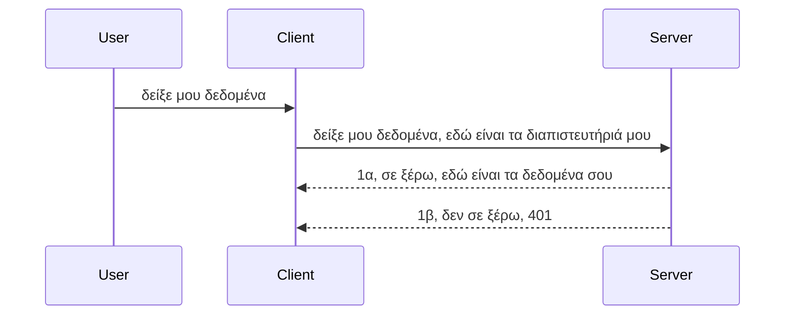

# Απλή αυθεντικοποίηση

Τα SDK MCP υποστηρίζουν τη χρήση του OAuth 2.1 που για να είμαστε δίκαιοι είναι μια αρκετά πολύπλοκη διαδικασία που περιλαμβάνει έννοιες όπως ο διακομιστής αυθεντικοποίησης, ο διακομιστής πόρων, η αποστολή διαπιστευτηρίων, η λήψη κωδικού, η ανταλλαγή του κωδικού με ένα bearer token μέχρι να μπορέσετε τελικά να λάβετε τα δεδομένα των πόρων σας. Αν δεν είστε εξοικειωμένοι με το OAuth που είναι κάτι υπέροχο να υλοποιηθεί, είναι καλή ιδέα να ξεκινήσετε με κάποιο βασικό επίπεδο αυθεντικοποίησης και να προχωρήσετε σε όλο και πιο καλύτερη ασφάλεια. Γι' αυτό υπάρχει αυτό το κεφάλαιο, για να σας οδηγήσει σε πιο προχωρημένη αυθεντικοποίηση.

## Αυθεντικοποίηση, τι εννοούμε;

Η αυθεντικοποίηση είναι η συντομογραφία για την ταυτοποίηση και εξουσιοδότηση. Η ιδέα είναι ότι πρέπει να κάνουμε δύο πράγματα:

- **Αυθεντικοποίηση**, που είναι η διαδικασία του να βρούμε αν επιτρέπουμε σε ένα άτομο να εισέλθει στο σπίτι μας, ότι έχει το δικαίωμα να είναι "εδώ", δηλαδή να έχει πρόσβαση στον διακομιστή πόρων όπου φιλοξενούνται οι λειτουργίες του MCP Server μας.
- **Εξουσιοδότηση**, είναι η διαδικασία να μάθουμε αν ένας χρήστης θα έπρεπε να έχει πρόσβαση σε αυτούς τους συγκεκριμένους πόρους που ζητούν, για παράδειγμα σε αυτές τις παραγγελίες ή αυτά τα προϊόντα ή αν επιτρέπεται να διαβάζει το περιεχόμενο αλλά όχι να διαγράψει, ως άλλο παράδειγμα.

## Διαπιστευτήρια: πώς λέμε στο σύστημα ποιοι είμαστε

Λοιπόν, οι περισσότεροι προγραμματιστές ιστοσελίδων εκεί έξω ξεκινούν να σκέφτονται σε όρους παροχής διαπιστευτηρίου στον διακομιστή, συνήθως ένα μυστικό που λέει αν επιτρέπεται να είναι εδώ "Αυθεντικοποίηση". Αυτό το διαπιστευτήριο είναι συνήθως μια έκδοση κωδικοποιημένη σε base64 του ονόματος χρήστη και κωδικού ή ένα API key που ταυτοποιεί μοναδικά έναν συγκεκριμένο χρήστη. 

Αυτό περιλαμβάνει την αποστολή μέσω ενός header που ονομάζεται "Authorization" ως εξής:

```json
{ "Authorization": "secret123" }
```

Αυτό αναφέρεται συνήθως ως βασική αυθεντικοποίηση. Πώς λειτουργεί συνολικά η ροή στη συνέχεια είναι ως εξής:


```mermaid
sequenceDiagram
   participant User
   participant Client
   participant Server

   User->>Client: δείξε μου δεδομένα
   Client->>Server: δείξε μου δεδομένα, εδώ είναι τα διαπιστευτήριά μου
   Server-->>Client: 1α, σε ξέρω, εδώ είναι τα δεδομένα σου
   Server-->>Client: 1β, δεν σε ξέρω, 401 
```

Τώρα που καταλαβαίνουμε πώς λειτουργεί από πλευράς ροής, πώς το υλοποιούμε; Λοιπόν, οι περισσότεροι web servers έχουν μια έννοια που ονομάζεται middleware, ένα κομμάτι κώδικα που τρέχει ως μέρος του αιτήματος που μπορεί να επαληθεύσει τα διαπιστευτήρια, και αν τα διαπιστευτήρια είναι έγκυρα μπορεί να αφήσει το αίτημα να περάσει. Αν το αίτημα δεν έχει έγκυρα διαπιστευτήρια, τότε λαμβάνουμε σφάλμα αυθεντικοποίησης. Ας δούμε πώς μπορεί να υλοποιηθεί αυτό:

**Python**

```python
class AuthMiddleware(BaseHTTPMiddleware):
    async def dispatch(self, request, call_next):

        has_header = request.headers.get("Authorization")
        if not has_header:
            print("-> Missing Authorization header!")
            return Response(status_code=401, content="Unauthorized")

        if not valid_token(has_header):
            print("-> Invalid token!")
            return Response(status_code=403, content="Forbidden")

        print("Valid token, proceeding...")
       
        response = await call_next(request)
        # προσθέστε οποιεσδήποτε προσαρμοσμένες επικεφαλίδες ή αλλάξτε με κάποιο τρόπο την απόκριση
        return response


starlette_app.add_middleware(CustomHeaderMiddleware)
```

Εδώ έχουμε: 

- Δημιουργήθηκε ένα middleware που ονομάζεται `AuthMiddleware` όπου η μέθοδος `dispatch` του καλείται από τον web server. 
- Προστέθηκε το middleware στον web server:

    ```python
    starlette_app.add_middleware(AuthMiddleware)
    ```

- Γράφτηκε λογική επαλήθευσης που ελέγχει αν το header Authorization είναι παρόν και αν το μυστικό που αποστέλλεται είναι έγκυρο:

    ```python
    has_header = request.headers.get("Authorization")
    if not has_header:
        print("-> Missing Authorization header!")
        return Response(status_code=401, content="Unauthorized")

    if not valid_token(has_header):
        print("-> Invalid token!")
        return Response(status_code=403, content="Forbidden")
    ```

    αν το μυστικό είναι παρόν και έγκυρο, τότε αφήνουμε το αίτημα να περάσει καλώντας το `call_next` και επιστρέφουμε την απάντηση.

    ```python
    response = await call_next(request)
    # προσθέστε οποιεσδήποτε προσαρμοσμένες κεφαλίδες πελατών ή αλλάξτε με κάποιον τρόπο την απόκριση
    return response
    ```

Πώς λειτουργεί αυτό είναι ότι αν γίνει ένα web αίτημα προς τον διακομιστή, το middleware θα κληθεί και δεδομένης της υλοποίησής του είτε θα αφήσει το αίτημα να περάσει είτε θα καταλήξει να επιστρέφει ένα σφάλμα που δηλώνει ότι ο πελάτης δεν επιτρέπεται να συνεχίσει.

**TypeScript**

Εδώ δημιουργούμε ένα middleware με το δημοφιλές framework Express και παρεμβαίνουμε στο αίτημα πριν φτάσει στον MCP Server. Ο κώδικας για αυτό είναι:

```typescript
function isValid(secret) {
    return secret === "secret123";
}

app.use((req, res, next) => {
    // 1. Παρουσιάζεται κεφαλίδα εξουσιοδότησης;
    if(!req.headers["Authorization"]) {
        res.status(401).send('Unauthorized');
    }
    
    let token = req.headers["Authorization"];

    // 2. Ελέγξτε την εγκυρότητα.
    if(!isValid(token)) {
        res.status(403).send('Forbidden');
    }

   
    console.log('Middleware executed');
    // 3. Μεταβιβάζει το αίτημα στο επόμενο βήμα στην αλυσίδα αιτημάτων.
    next();
});
```

Στον κώδικα αυτό:

1. Ελέγχουμε αν το header Authorization είναι παρόν από την αρχή, αν όχι, στέλνουμε σφάλμα 401.
2. Βεβαιωνόμαστε ότι το διαπιστευτήριο/token είναι έγκυρο, αν όχι, στέλνουμε σφάλμα 403.
3. Τέλος, αφήνουμε το αίτημα να συνεχίσει στο pipeline αιτήματος και επιστρέφουμε τον ζητούμενο πόρο.

## Άσκηση: Υλοποίηση αυθεντικοποίησης

Ας πάρουμε τις γνώσεις μας και να προσπαθήσουμε να το υλοποιήσουμε. Το πλάνο είναι:

Server

- Δημιουργία web server και instance MCP.
- Υλοποίηση middleware για τον server.

Client 

- Αποστολή web αιτήματος, με διαπιστευτήριο, μέσω header.

### -1- Δημιουργία web server και instance MCP

> [!WARNING]
> Το παράδειγμα TypeScript παρακάτω στοχεύει το MCP `2025-11-25`. Παρακολουθεί τις μεταφορές
> με το `mcp-session-id` και δεν είναι παράδειγμα μεταφοράς του τρέχοντος `2026-07-28`. Το MCP
> `2026-07-28` αφαιρεί το handshake και το πρωτόκολλο session ID `initialize`; νέες
> υλοποιήσεις χρησιμοποιούν ανεξάρτητα αιτήματα. Δείτε
> [Τι έχει αλλάξει στο MCP: Η προδιαγραφή 2026-07-28](../../01-CoreConcepts/mcp-2026-07-28.md).

Στο πρώτο μας βήμα, πρέπει να δημιουργήσουμε το instance του web server και του MCP Server.

**Python**

Εδώ δημιουργούμε ένα instance MCP server, δημιουργούμε μια εφαρμογή starlette web και τη φιλοξενούμε με τον uvicorn.

```python
# δημιουργία MCP διακομιστή

app = FastMCP(
    name="MCP Resource Server",
    instructions="Resource Server that validates tokens via Authorization Server introspection",
    host=settings["host"],
    port=settings["port"],
    debug=True
)

# δημιουργία web εφαρμογής starlette
starlette_app = app.streamable_http_app()

# εξυπηρέτηση εφαρμογής μέσω uvicorn
async def run(starlette_app):
    import uvicorn
    config = uvicorn.Config(
            starlette_app,
            host=app.settings.host,
            port=app.settings.port,
            log_level=app.settings.log_level.lower(),
        )
    server = uvicorn.Server(config)
    await server.serve()

run(starlette_app)
```

Στον κώδικα αυτό:

- Δημιουργούμε τον MCP Server.
- Κατασκευάζουμε την εφαρμογή starlette web από τον MCP Server, `app.streamable_http_app()`.
- Φιλοξενούμε και διαχειριζόμαστε την web εφαρμογή χρησιμοποιώντας τον uvicorn `server.serve()`.

**TypeScript**

Εδώ δημιουργούμε ένα instance MCP Server.

```typescript
const server = new McpServer({
      name: "example-server",
      version: "1.0.0"
    });

    // ... εγκαθιστώ πόρους διακομιστή, εργαλεία και προτροπές ...
```

Αυτή η δημιουργία του MCP Server θα πρέπει να γίνει εντός του ορισμού της διαδρομής POST /mcp, οπότε ας πάρουμε τον παραπάνω κώδικα και να τον μεταφέρουμε έτσι:

```typescript
import express from "express";
import { randomUUID } from "node:crypto";
import { McpServer } from "@modelcontextprotocol/sdk/server/mcp.js";
import { StreamableHTTPServerTransport } from "@modelcontextprotocol/sdk/server/streamableHttp.js";
import { isInitializeRequest } from "@modelcontextprotocol/sdk/types.js"

const app = express();
app.use(express.json());

// Χάρτης για αποθήκευση των μεταφορών ανά αναγνωριστικό συνεδρίας
const transports: { [sessionId: string]: StreamableHTTPServerTransport } = {};

// Διαχείριση αιτήσεων POST για επικοινωνία πελάτη-προς-διακομιστή
app.post('/mcp', async (req, res) => {
  // Έλεγχος για υπάρχον αναγνωριστικό συνεδρίας
  const sessionId = req.headers['mcp-session-id'] as string | undefined;
  let transport: StreamableHTTPServerTransport;

  if (sessionId && transports[sessionId]) {
    // Επαναχρησιμοποίηση υπάρχουσας μεταφοράς
    transport = transports[sessionId];
  } else if (!sessionId && isInitializeRequest(req.body)) {
    // Νέο αίτημα αρχικοποίησης
    transport = new StreamableHTTPServerTransport({
      sessionIdGenerator: () => randomUUID(),
      onsessioninitialized: (sessionId) => {
        // Αποθήκευση της μεταφοράς ανά αναγνωριστικό συνεδρίας
        transports[sessionId] = transport;
      },
      // Η προστασία DNS rebinding είναι απενεργοποιημένη από προεπιλογή για συμβατότητα προς τα πίσω. Αν τρέχετε αυτόν τον διακομιστή
      // τοπικά, βεβαιωθείτε ότι έχετε ορίσει:
      // enableDnsRebindingProtection: true,
      // allowedHosts: ['127.0.0.1'],
    });

    // Καθαρισμός της μεταφοράς όταν κλείσει
    transport.onclose = () => {
      if (transport.sessionId) {
        delete transports[transport.sessionId];
      }
    };
    const server = new McpServer({
      name: "example-server",
      version: "1.0.0"
    });

    // ... ρύθμιση πόρων διακομιστή, εργαλείων και προτροπών ...

    // Σύνδεση με τον MCP διακομιστή
    await server.connect(transport);
  } else {
    // Μη έγκυρο αίτημα
    res.status(400).json({
      jsonrpc: '2.0',
      error: {
        code: -32000,
        message: 'Bad Request: No valid session ID provided',
      },
      id: null,
    });
    return;
  }

  // Διαχείριση του αιτήματος
  await transport.handleRequest(req, res, req.body);
});

// Επαναχρησιμοποιήσιμος χειριστής για αιτήσεις GET και DELETE
const handleSessionRequest = async (req: express.Request, res: express.Response) => {
  const sessionId = req.headers['mcp-session-id'] as string | undefined;
  if (!sessionId || !transports[sessionId]) {
    res.status(400).send('Invalid or missing session ID');
    return;
  }
  
  const transport = transports[sessionId];
  await transport.handleRequest(req, res);
};

// Διαχείριση αιτήσεων GET για ειδοποιήσεις από διακομιστή προς πελάτη μέσω SSE
app.get('/mcp', handleSessionRequest);

// Διαχείριση αιτήσεων DELETE για τερματισμό συνεδρίας
app.delete('/mcp', handleSessionRequest);

app.listen(3000);
```

Τώρα βλέπετε πώς η δημιουργία του MCP Server μεταφέρθηκε μέσα στο `app.post("/mcp")`.

Ας προχωρήσουμε στο επόμενο βήμα της δημιουργίας του middleware ώστε να επαληθεύουμε το εισερχόμενο διαπιστευτήριο.

### -2- Υλοποίηση middleware για τον server

Ας περάσουμε στο κομμάτι του middleware στη συνέχεια. Εδώ θα δημιουργήσουμε ένα middleware που ψάχνει για διαπιστευτήριο στο header `Authorization` και το επαληθεύει. Αν είναι αποδεκτό, τότε το αίτημα θα συνεχίσει να κάνει αυτό που χρειάζεται (π.χ. να καταγράψει εργαλεία, να διαβάσει έναν πόρο ή όποια λειτουργία MCP ζητούσε ο πελάτης).

**Python**

Για να δημιουργήσουμε το middleware, πρέπει να δημιουργήσουμε μια κλάση που κληρονομεί από την `BaseHTTPMiddleware`. Υπάρχουν δύο ενδιαφέροντα μέρη:

- Το αίτημα `request` , από το οποίο διαβάζουμε τις πληροφορίες του header.
- Την `call_next`, την κλήση επιστροφής (callback) που πρέπει να καλέσουμε αν ο πελάτης έχει φέρει ένα διαπιστευτήριο που αποδεχόμαστε.

Πρώτα, πρέπει να χειριστούμε την περίπτωση αν το header `Authorization` λείπει:

```python
has_header = request.headers.get("Authorization")

# δεν υπάρχει κεφαλίδα, αποτυχία με 401, αλλιώς προχώρησε.
if not has_header:
    print("-> Missing Authorization header!")
    return Response(status_code=401, content="Unauthorized")
```

Εδώ στέλνουμε μήνυμα 401 μη εξουσιοδοτημένου καθώς ο πελάτης αποτυγχάνει στην αυθεντικοποίηση.

Στη συνέχεια, αν υποβλήθηκε διαπιστευτήριο, πρέπει να ελέγξουμε την εγκυρότητά του ως εξής:

```python
 if not valid_token(has_header):
    print("-> Invalid token!")
    return Response(status_code=403, content="Forbidden")
```

Σημειώστε πώς στέλνουμε μήνυμα 403 απαγόρευσης πιο πάνω. Ας δούμε το πλήρες middleware παρακάτω που υλοποιεί όλα όσα αναφέραμε:

```python
class AuthMiddleware(BaseHTTPMiddleware):
    async def dispatch(self, request, call_next):

        has_header = request.headers.get("Authorization")
        if not has_header:
            print("-> Missing Authorization header!")
            return Response(status_code=401, content="Unauthorized")

        if not valid_token(has_header):
            print("-> Invalid token!")
            return Response(status_code=403, content="Forbidden")

        print("Valid token, proceeding...")
        print(f"-> Received {request.method} {request.url}")
        response = await call_next(request)
        response.headers['Custom'] = 'Example'
        return response

```

Τέλεια, αλλά τι γίνεται με τη συνάρτηση `valid_token`; Εδώ είναι παρακάτω:

```python
# ΜΗΝ το χρησιμοποιείτε για παραγωγή - βελτιώστε το !!
def valid_token(token: str) -> bool:
    # αφαιρέστε το πρόθεμα "Bearer "
    if token.startswith("Bearer "):
        token = token[7:]
        return token == "secret-token"
    return False
```

Αυτό σαφώς πρέπει να βελτιωθεί.

ΣΗΜΑΝΤΙΚΟ: Ποτέ δεν πρέπει να έχετε τέτοια μυστικά στον κώδικα. Ιδανικά πρέπει να παίρνετε την τιμή με την οποία συγκρίνετε από κάποια πηγή δεδομένων ή από έναν πάροχο υπηρεσίας ταυτότητας (IDP) ή ακόμα καλύτερα, να αφήσετε τον IDP να κάνει την επικύρωση.

**TypeScript**

Για να υλοποιήσουμε αυτό με το Express, πρέπει να καλέσουμε τη μέθοδο `use` που παίρνει συναρτήσεις middleware.

Πρέπει να:

- Αλληλεπιδράσουμε με τη μεταβλητή request για να ελέγξουμε το περασμένο διαπιστευτήριο στην ιδιότητα `Authorization`.
- Επαληθεύσουμε το διαπιστευτήριο, και αν είναι αποδεκτό, να αφήσουμε το αίτημα να συνεχίσει και να κάνει η MCP αίτηση του πελάτη ό,τι πρέπει (π.χ. λίστα εργαλείων, ανάγνωση πόρου ή οτιδήποτε άλλο σχετικό με MCP).

Εδώ, ελέγχουμε αν το header `Authorization` είναι παρόν και αν όχι, σταματάμε το αίτημα να προχωρήσει:

```typescript
if(!req.headers["authorization"]) {
    res.status(401).send('Unauthorized');
    return;
}
```

Αν το header δεν αποσταλεί καν, λαμβάνετε 401.

Στη συνέχεια, ελέγχουμε αν το διαπιστευτήριο είναι έγκυρο, αν όχι, ξανά σταματάμε το αίτημα αλλά με λίγο διαφορετικό μήνυμα:

```typescript
if(!isValid(token)) {
    res.status(403).send('Forbidden');
    return;
} 
```

Σημειώστε πως τώρα λαμβάνετε σφάλμα 403.

Εδώ είναι ο πλήρης κώδικας:

```typescript
app.use((req, res, next) => {
    console.log('Request received:', req.method, req.url, req.headers);
    console.log('Headers:', req.headers["authorization"]);
    if(!req.headers["authorization"]) {
        res.status(401).send('Unauthorized');
        return;
    }
    
    let token = req.headers["authorization"];

    if(!isValid(token)) {
        res.status(403).send('Forbidden');
        return;
    }  

    console.log('Middleware executed');
    next();
});
```

Ρυθμίσαμε τον web server να αποδέχεται ένα middleware για να ελέγξει το διαπιστευτήριο που ελπίζουμε ότι ο πελάτης μας στέλνει. Τι γίνεται με τον ίδιο τον πελάτη;

### -3- Αποστολή web αιτήματος με διαπιστευτήριο μέσω header

Πρέπει να διασφαλίσουμε ότι ο πελάτης περνάει το διαπιστευτήριο μέσω του header. Καθώς πρόκειται να χρησιμοποιήσουμε έναν MCP client για αυτό, πρέπει να καταλάβουμε πώς το κάνουμε.

**Python**

Για τον πελάτη, πρέπει να περάσουμε ένα header με το διαπιστευτήριό μας ως εξής:

```python
# ΜΗ σκληροκωδικοποιείτε την τιμή, να βρίσκεται τουλάχιστον σε μια μεταβλητή περιβάλλοντος ή σε έναν πιο ασφαλή αποθηκευτικό χώρο
token = "secret-token"

async with streamablehttp_client(
        url = f"http://localhost:{port}/mcp",
        headers = {"Authorization": f"Bearer {token}"}
    ) as (
        read_stream,
        write_stream,
        session_callback,
    ):
        async with ClientSession(
            read_stream,
            write_stream
        ) as session:
            await session.initialize()
      
            # TODO, τι θέλετε να γίνει στον πελάτη, π.χ. λίστα εργαλείων, κλήση εργαλείων κλπ.
```

Σημειώστε πώς συμπληρώνουμε την ιδιότητα `headers` ως ` headers = {"Authorization": f"Bearer {token}"}`.

**TypeScript**

Μπορούμε να το λύσουμε σε δύο βήματα:

1. Συμπληρώνουμε ένα αντικείμενο ρυθμίσεων με το διαπιστευτήριό μας.
2. Περάσουμε το αντικείμενο ρυθμίσεων στην μεταφορά.

```typescript

// ΜΗΝ ορίζετε σταθερά την τιμή όπως φαίνεται εδώ. Τουλάχιστον να είναι μια μεταβλητή περιβάλλοντος και να χρησιμοποιήσετε κάτι σαν το dotenv (σε λειτουργία ανάπτυξης).
let token = "secret123"

// ορίστε ένα αντικείμενο επιλογών μεταφοράς πελάτη
let options: StreamableHTTPClientTransportOptions = {
  sessionId: sessionId,
  requestInit: {
    headers: {
      "Authorization": "secret123"
    }
  }
};

// περάστε το αντικείμενο επιλογών στη μεταφορά
async function main() {
   const transport = new StreamableHTTPClientTransport(
      new URL(serverUrl),
      options
   );
```

Εδώ βλέπετε παραπάνω πώς έπρεπε να δημιουργήσουμε ένα αντικείμενο `options` και να τοποθετήσουμε τα headers μας κάτω από την ιδιότητα `requestInit`.

ΣΗΜΑΝΤΙΚΟ: Πώς όμως το βελτιώνουμε από εδώ και πέρα; Η τρέχουσα υλοποίηση έχει κάποια προβλήματα. Πρώτον, η αποστολή διαπιστευτηρίου έτσι είναι αρκετά ριψοκίνδυνη αν δεν υπάρχει τουλάχιστον HTTPS. Ακόμα κι έτσι, το διαπιστευτήριο μπορεί να κλαπεί οπότε χρειάζεστε ένα σύστημα όπου μπορείτε εύκολα να ανακαλέσετε το token και να προσθέσετε επιπλέον ελέγχους όπως από πού στον κόσμο προέρχεται, αν το αίτημα συμβαίνει πολύ συχνά (συμπεριφορά bot), εν συντομία, υπάρχουν πολλές ανησυχίες. 

Πρέπει ωστόσο να ειπωθεί, για πολύ απλά APIs όπου δεν θέλετε κανείς να καλεί το API σας χωρίς να έχει αυθεντικοποιηθεί και αυτό που έχουμε εδώ είναι μια καλή αρχή. 

Με αυτά τα λόγια, ας προσπαθήσουμε να ενισχύσουμε λίγο την ασφάλεια χρησιμοποιώντας ένα τυποποιημένο μορφότυπο όπως το JSON Web Token, γνωστό και ως JWT ή "JOT" tokens.

## JSON Web Tokens, JWT

Λοιπόν, προσπαθούμε να βελτιώσουμε τα πράγματα από την αποστολή πολύ απλών διαπιστευτηρίων. Ποια είναι τα άμεσα οφέλη που έχουμε υιοθετώντας το JWT;

- **Βελτιώσεις στην ασφάλεια**. Στην βασική αυθεντικοποίηση, στέλνετε το όνομα χρήστη και τον κωδικό ως token κωδικοποιημένο σε base64 (ή στέλνετε ένα API key) συνεχώς, κάτι που αυξάνει τον κίνδυνο. Με το JWT, στέλνετε το όνομα χρήστη και τον κωδικό σας και παίρνετε ένα token ως ανταπόδοση και αυτό είναι χρονικά περιορισμένο, δηλαδή λήγει. Το JWT σας επιτρέπει εύκολη χρήση ελεγχόμενης πρόσβασης με ρόλους, scopes και δικαιώματα.
- **Ανεξαρτησία και κλιμακωσιμότητα**. Τα JWT είναι αυτόνομα, φέρουν όλες τις πληροφορίες χρήστη και εξαλείφουν την ανάγκη αποθήκευσης συνεδρίας στον διακομιστή. Το token μπορεί επίσης να επαληθευτεί τοπικά.
- **Διαλειτουργικότητα και ομοσπονδία**. Τα JWT είναι κεντρικά στο Open ID Connect και χρησιμοποιούνται με γνωστούς παρόχους ταυτότητας όπως Entra ID, Google Identity και Auth0. Επιτρέπουν επίσης το single sign on και πολλά άλλα καθιστώντας το επιχειρησιακού επιπέδου.
- **Ευελιξία και αρθρωτότητα**. Τα JWT μπορούν επίσης να χρησιμοποιηθούν με API Gateways όπως Azure API Management, NGINX και άλλα. Υποστηρίζουν σενάρια αυθεντικοποίησης και επικοινωνίας server-to-service συμπεριλαμβανομένων σεναρίων αντιπροσώπευσης και εκχώρησης.
- **Απόδοση και caching**. Τα JWT μπορούν να αποθηκευτούν στη μνήμη μετά την αποκωδικοποίησή τους, μειώνοντας την ανάγκη για parsing. Αυτό βοηθά ειδικά σε εφαρμογές υψηλής κίνησης καθώς βελτιώνει τη διαπερατότητα και μειώνει το φόρτο στη δομή σας.
- **Προχωρημένα χαρακτηριστικά**. Υποστηρίζει επίσης introspection (έλεγχο εγκυρότητας στον διακομιστή) και revocation (μη εγκυρότητα του token).

Με όλα αυτά τα οφέλη, ας δούμε πώς μπορούμε να προχωρήσουμε την υλοποίησή μας σε επόμενο επίπεδο.

## Μετατροπή βασικής αυθεντικοποίησης σε JWT

Λοιπόν, οι αλλαγές που πρέπει να κάνουμε σε γενικό επίπεδο είναι:

- **Μάθετε να κατασκευάζετε ένα JWT token** και να είναι έτοιμο να σταλεί από τον πελάτη στον διακομιστή.
- **Επαληθεύστε ένα JWT token**, και αν είναι αποδεκτό, αφήστε τον πελάτη να έχει πρόσβαση στους πόρους μας.
- **Ασφαλής αποθήκευση token**. Πώς αποθηκεύουμε αυτό το token.
- **Προστατέψτε τις διαδρομές**. Πρέπει να προστατεύσουμε τις διαδρομές, στην περίπτωσή μας, να προστατεύσουμε συγκεκριμένες διαδρομές και λειτουργίες MCP.
- **Προσθέστε refresh tokens**. Διασφαλίστε ότι δημιουργείτε tokens που είναι βραχυπρόθεσμα αλλά και tokens ανανέωσης μακράς διάρκειας που μπορούν να χρησιμοποιηθούν για να αποκτήσουν νέα tokens αν λήξουν. Επίσης, εξασφαλίστε ότι υπάρχει endpoint ανανέωσης και στρατηγική περιστροφής.

### -1- Κατασκευή JWT token

Πρώτα απ' όλα, ένα JWT token έχει τα ακόλουθα μέρη:

- **header**, αλγόριθμος που χρησιμοποιείται και τύπος token.
- **payload**, δηλώσεις (claims), όπως sub (ο χρήστης ή ο φορέας που αναπαρίσταται από το token. Σε σενάριο αυθεντικοποίησης, αυτό τυπικά είναι το userid), exp (πότε λήγει), role (ο ρόλος)
- **signature**, υπογεγραμμένο με μυστικό ή ιδιωτικό κλειδί.

Για αυτό, θα χρειαστεί να κατασκευάσουμε το header, το payload και το κωδικοποιημένο token.

**Python**

```python

import jwt
import jwt
from jwt.exceptions import ExpiredSignatureError, InvalidTokenError
import datetime

# Μυστικό κλειδί που χρησιμοποιείται για την υπογραφή του JWT
secret_key = 'your-secret-key'

header = {
    "alg": "HS256",
    "typ": "JWT"
}

# οι πληροφορίες χρήστη και οι ισχυρισμοί του και ο χρόνος λήξης
payload = {
    "sub": "1234567890",               # Θέμα (αναγνωριστικό χρήστη)
    "name": "User Userson",                # Προσαρμοσμένος ισχυρισμός
    "admin": True,                     # Προσαρμοσμένος ισχυρισμός
    "iat": datetime.datetime.utcnow(),# Εκδόθηκε στις
    "exp": datetime.datetime.utcnow() + datetime.timedelta(hours=1)  # Λήξη
}

# κωδικοποιήστε το
encoded_jwt = jwt.encode(payload, secret_key, algorithm="HS256", headers=header)
```

Στον παραπάνω κώδικα έχουμε:

- Ορίσει ένα header χρησιμοποιώντας HS256 ως αλγόριθμο και τύπο ως JWT.
- Κατασκευάσει ένα payload που περιέχει ένα υποκείμενο ή id χρήστη, όνομα χρήστη, ρόλο, πότε εκδόθηκε και πότε έχει οριστεί να λήξει, υλοποιώντας έτσι την χρονικά περιορισμένη πτυχή που αναφέραμε νωρίτερα.

**TypeScript**

Εδώ θα χρειαστούμε κάποιες εξαρτήσεις που θα μας βοηθήσουν να κατασκευάσουμε το JWT token.

Εξαρτήσεις

```sh

npm install jsonwebtoken
npm install --save-dev @types/jsonwebtoken
```

Τώρα που έχουμε αυτό, ας δημιουργήσουμε το header, το payload και μέσα από αυτά το κωδικοποιημένο token.

```typescript
import jwt from 'jsonwebtoken';

const secretKey = 'your-secret-key'; // Χρησιμοποιήστε μεταβλητές περιβάλλοντος στην παραγωγή

// Ορίστε το περιεχόμενο
const payload = {
  sub: '1234567890',
  name: 'User usersson',
  admin: true,
  iat: Math.floor(Date.now() / 1000), // Εκδόθηκε στις
  exp: Math.floor(Date.now() / 1000) + 60 * 60 // Λήγει σε 1 ώρα
};

// Ορίστε την κεφαλίδα (προαιρετικό, jsonwebtoken ορίζει προεπιλογές)
const header = {
  alg: 'HS256',
  typ: 'JWT'
};

// Δημιουργήστε το διακριτικό (token)
const token = jwt.sign(payload, secretKey, {
  algorithm: 'HS256',
  header: header
});

console.log('JWT:', token);
```

Αυτό το token είναι:

Υπογεγραμμένο με HS256
Έγκυρο για 1 ώρα
Περιλαμβάνει δηλώσεις (claims) όπως sub, name, admin, iat και exp.

### -2- Επαλήθευση token

Θα χρειαστεί επίσης να επαληθεύσουμε ένα token, κάτι που πρέπει να κάνουμε στον διακομιστή για να διασφαλίσουμε ότι αυτό που στέλνει ο πελάτης είναι πράγματι έγκυρο. Υπάρχουν πολλοί έλεγχοι που πρέπει να κάνουμε εδώ από τον έλεγχο της δομής του μέχρι την εγκυρότητά του. Σας ενθαρρύνουμε επίσης να προσθέσετε άλλους ελέγχους για να δείτε αν ο χρήστης είναι στο σύστημά σας και άλλα.

Για να επαληθεύσουμε ένα token, πρέπει να το αποκωδικοποιήσουμε ώστε να το διαβάσουμε και στη συνέχεια να αρχίσουμε να ελέγχουμε την εγκυρότητά του:

**Python**

```python

# Αποκωδικοποιήστε και επαληθεύστε το JWT
try:
    decoded = jwt.decode(token, secret_key, algorithms=["HS256"])
    print("✅ Token is valid.")
    print("Decoded claims:")
    for key, value in decoded.items():
        print(f"  {key}: {value}")
except ExpiredSignatureError:
    print("❌ Token has expired.")
except InvalidTokenError as e:
    print(f"❌ Invalid token: {e}")

```


Σε αυτόν τον κώδικα, καλούμε τη `jwt.decode` χρησιμοποιώντας το token, το μυστικό κλειδί και τον επιλεγμένο αλγόριθμο ως είσοδο. Σημειώστε πώς χρησιμοποιούμε μια δομή try-catch καθώς μια αποτυχημένη επικύρωση οδηγεί στην εμφάνιση σφάλματος.

**TypeScript**

Εδώ πρέπει να καλέσουμε τη `jwt.verify` για να πάρουμε μια αποκωδικοποιημένη έκδοση του token που μπορούμε να αναλύσουμε περαιτέρω. Αν αυτή η κλήση αποτύχει, αυτό σημαίνει ότι η δομή του token είναι λανθασμένη ή δεν ισχύει πλέον.

```typescript

try {
  const decoded = jwt.verify(token, secretKey);
  console.log('Decoded Payload:', decoded);
} catch (err) {
  console.error('Token verification failed:', err);
}
```

ΣΗΜΕΙΩΣΗ: όπως αναφέρθηκε προηγουμένως, θα πρέπει να πραγματοποιήσουμε πρόσθετους ελέγχους για να διασφαλίσουμε ότι αυτό το token αναφέρεται σε έναν χρήστη στο σύστημά μας και να βεβαιωθούμε ότι ο χρήστης έχει τα δικαιώματα που ισχυρίζεται ότι έχει.

Ας δούμε στη συνέχεια τον έλεγχο πρόσβασης βασισμένο σε ρόλους, γνωστό επίσης ως RBAC.

## Προσθήκη ελέγχου πρόσβασης βασισμένου σε ρόλους

Η ιδέα είναι ότι θέλουμε να εκφράσουμε ότι διαφορετικοί ρόλοι έχουν διαφορετικές άδειες. Για παράδειγμα, υποθέτουμε ότι ένας διαχειριστής μπορεί να κάνει τα πάντα, ένας κανονικός χρήστης μπορεί να διαβάζει/γράφει και ένας επισκέπτης μπορεί μόνο να διαβάζει. Επομένως, εδώ είναι μερικά πιθανά επίπεδα άδειας:

- Admin.Write 
- User.Read
- Guest.Read

Ας δούμε πώς μπορούμε να υλοποιήσουμε έναν τέτοιο έλεγχο με middleware. Τα middleware μπορούν να προστεθούν ανά διαδρομή καθώς και για όλες τις διαδρομές.

**Python**

```python
from starlette.middleware.base import BaseHTTPMiddleware
from starlette.responses import JSONResponse
import jwt

# ΜΗΝ έχετε το μυστικό στον κώδικα όπως, αυτό είναι μόνο για σκοπούς επίδειξης. Διαβάστε το από ένα ασφαλές μέρος.
SECRET_KEY = "your-secret-key" # βάλτε το σε μεταβλητή περιβάλλοντος
REQUIRED_PERMISSION = "User.Read"

class JWTPermissionMiddleware(BaseHTTPMiddleware):
    async def dispatch(self, request, call_next):
        auth_header = request.headers.get("Authorization")
        if not auth_header or not auth_header.startswith("Bearer "):
            return JSONResponse({"error": "Missing or invalid Authorization header"}, status_code=401)

        token = auth_header.split(" ")[1]
        try:
            decoded = jwt.decode(token, SECRET_KEY, algorithms=["HS256"])
        except jwt.ExpiredSignatureError:
            return JSONResponse({"error": "Token expired"}, status_code=401)
        except jwt.InvalidTokenError:
            return JSONResponse({"error": "Invalid token"}, status_code=401)

        permissions = decoded.get("permissions", [])
        if REQUIRED_PERMISSION not in permissions:
            return JSONResponse({"error": "Permission denied"}, status_code=403)

        request.state.user = decoded
        return await call_next(request)


```

Υπάρχουν μερικοί διαφορετικοί τρόποι να προσθέσουμε το middleware όπως παρακάτω:

```python

# Εναλλακτική 1: πρόσθεσε middleware κατά την κατασκευή της εφαρμογής starlette
middleware = [
    Middleware(JWTPermissionMiddleware)
]

app = Starlette(routes=routes, middleware=middleware)

# Εναλλακτική 2: πρόσθεσε middleware αφού η εφαρμογή starlette έχει ήδη κατασκευαστεί
starlette_app.add_middleware(JWTPermissionMiddleware)

# Εναλλακτική 3: πρόσθεσε middleware ανά διαδρομή
routes = [
    Route(
        "/mcp",
        endpoint=..., # χειριστής
        middleware=[Middleware(JWTPermissionMiddleware)]
    )
]
```

**TypeScript**

Μπορούμε να χρησιμοποιήσουμε το `app.use` και ένα middleware που θα τρέχει για όλα τα αιτήματα.

```typescript
app.use((req, res, next) => {
    console.log('Request received:', req.method, req.url, req.headers);
    console.log('Headers:', req.headers["authorization"]);

    // 1. Ελέγξτε αν έχει σταλεί η κεφαλίδα εξουσιοδότησης

    if(!req.headers["authorization"]) {
        res.status(401).send('Unauthorized');
        return;
    }
    
    let token = req.headers["authorization"];

    // 2. Ελέγξτε αν το token είναι έγκυρο
    if(!isValid(token)) {
        res.status(403).send('Forbidden');
        return;
    }  

    // 3. Ελέγξτε αν ο χρήστης του token υπάρχει στο σύστημά μας
    if(!isExistingUser(token)) {
        res.status(403).send('Forbidden');
        console.log("User does not exist");
        return;
    }
    console.log("User exists");

    // 4. Επαληθεύστε ότι το token έχει τα σωστά δικαιώματα
    if(!hasScopes(token, ["User.Read"])){
        res.status(403).send('Forbidden - insufficient scopes');
    }

    console.log("User has required scopes");

    console.log('Middleware executed');
    next();
});

```

Υπάρχουν αρκετά πράγματα που μπορούμε να αφήσουμε στο middleware μας και που το middleware μας ΠΡΕΠΕΙ να κάνει, συγκεκριμένα:

1. Έλεγξε αν υπάρχει το πεδίο εξουσιοδότησης (authorization header)
2. Έλεγξε αν το token είναι έγκυρο, καλούμε τη `isValid` που είναι μια μέθοδος που γράψαμε και ελέγχει την ακεραιότητα και εγκυρότητα του JWT token.
3. Επικύρωσε ότι ο χρήστης υπάρχει στο σύστημά μας, πρέπει να το ελέγξουμε.

   ```typescript
    // χρήστες στη βάση δεδομένων
   const users = [
     "user1",
     "User usersson",
   ]

   function isExistingUser(token) {
     let decodedToken = verifyToken(token);

     // TODO, έλεγξε αν ο χρήστης υπάρχει στη βάση δεδομένων
     return users.includes(decodedToken?.name || "");
   }
   ```

   Πάνω, έχουμε δημιουργήσει μια πολύ απλή λίστα `users`, η οποία φυσικά θα πρέπει να βρίσκεται σε μια βάση δεδομένων.

4. Επιπλέον, θα πρέπει επίσης να ελέγξουμε ότι το token έχει τα σωστά δικαιώματα.

   ```typescript
   if(!hasScopes(token, ["User.Read"])){
        res.status(403).send('Forbidden - insufficient scopes');
   }
   ```

   Σε αυτόν τον κώδικα από το middleware, ελέγχουμε ότι το token περιέχει την άδεια User.Read, αν όχι στέλνουμε σφάλμα 403. Παρακάτω είναι η βοηθητική μέθοδος `hasScopes`.

   ```typescript
   function hasScopes(scope: string, requiredScopes: string[]) {
     let decodedToken = verifyToken(scope);
    return requiredScopes.every(scope => decodedToken?.scopes.includes(scope));
  }
   ```

Have a think which additional checks you should be doing, but these are the absolute minimum of checks you should be doing.

Using Express as a web framework is a common choice. There are helpers library when you use JWT so you can write less code.

- `express-jwt`, helper library that provides a middleware that helps decode your token.
- `express-jwt-permissions`, this provides a middleware `guard` that helps check if a certain permission is on the token.

Here's what these libraries can look like when used:

```typescript
const express = require('express');
const jwt = require('express-jwt');
const guard = require('express-jwt-permissions')();

const app = express();
const secretKey = 'your-secret-key'; // put this in env variable

// Decode JWT and attach to req.user
app.use(jwt({ secret: secretKey, algorithms: ['HS256'] }));

// Check for User.Read permission
app.use(guard.check('User.Read'));

// multiple permissions
// app.use(guard.check(['User.Read', 'Admin.Access']));

app.get('/protected', (req, res) => {
  res.json({ message: `Welcome ${req.user.name}` });
});

// Error handler
app.use((err, req, res, next) => {
  if (err.code === 'permission_denied') {
    return res.status(403).send('Forbidden');
  }
  next(err);
});

```

Τώρα που έχετε δει πώς μπορεί να χρησιμοποιηθεί το middleware τόσο για ταυτοποίηση όσο και για εξουσιοδότηση, τι γίνεται με το MCP όμως; Αλλάζει τον τρόπο που κάνουμε την αυθεντικοποίηση; Ας το μάθουμε στην επόμενη ενότητα.

### -3- Προσθήκη RBAC στο MCP

Έχετε δει μέχρι τώρα πώς μπορείτε να προσθέσετε RBAC μέσω middleware, ωστόσο, για το MCP δεν υπάρχει εύκολος τρόπος να προσθέσετε RBAC ανά χαρακτηριστικό MCP, οπότε τι κάνουμε; Απλώς προσθέτουμε κώδικα όπως αυτόν που ελέγχει σε αυτή την περίπτωση αν ο πελάτης έχει τα δικαιώματα να καλέσει ένα συγκεκριμένο εργαλείο:

Έχετε μερικές διαφορετικές επιλογές για το πώς να υλοποιήσετε RBAC ανά χαρακτηριστικό, εδώ είναι μερικές:

- Προσθέστε έναν έλεγχο για κάθε εργαλείο, πόρο, ερώτημα όπου χρειάζεται να ελέγξετε το επίπεδο άδειας.

   **python**

   ```python
   @tool()
   def delete_product(id: int):
      try:
          check_permissions(role="Admin.Write", request)
      catch:
        pass # ο πελάτης απέτυχε στην εξουσιοδότηση, προκληθείτε σφάλμα εξουσιοδότησης
   ```

   **typescript**

   ```typescript
   server.registerTool(
    "delete-product",
    {
      title: Delete a product",
      description: "Deletes a product",
      inputSchema: { id: z.number() }
    },
    async ({ id }) => {
      
      try {
        checkPermissions("Admin.Write", request);
        // να γίνει, στείλτε το αναγνωριστικό στο productService και στην απομακρυσμένη είσοδο
      } catch(Exception e) {
        console.log("Authorization error, you're not allowed");  
      }

      return {
        content: [{ type: "text", text: `Deletected product with id ${id}` }]
      };
    }
   );
   ```


- Χρησιμοποιήστε προχωρημένη προσέγγιση διακομιστή και τους χειριστές αιτημάτων ώστε να ελαχιστοποιήσετε τα σημεία όπου πρέπει να κάνετε τον έλεγχο.

   **Python**

   ```python
   
   tool_permission = {
      "create_product": ["User.Write", "Admin.Write"],
      "delete_product": ["Admin.Write"]
   }

   def has_permission(user_permissions, required_permissions) -> bool:
      # user_permissions: λίστα δικαιωμάτων που έχει ο χρήστης
      # required_permissions: λίστα απαιτούμενων δικαιωμάτων για το εργαλείο
      return any(perm in user_permissions for perm in required_permissions)

   @server.call_tool()
   async def handle_call_tool(
     name: str, arguments: dict[str, str] | None
   ) -> list[types.TextContent]:
    # Υποθέστε ότι request.user.permissions είναι λίστα δικαιωμάτων για τον χρήστη
     user_permissions = request.user.permissions
     required_permissions = tool_permission.get(name, [])
     if not has_permission(user_permissions, required_permissions):
        # Ρίξτε σφάλμα "Δεν έχετε άδεια να καλέσετε το εργαλείο {name}"
        raise Exception(f"You don't have permission to call tool {name}")
     # συνεχίστε και καλέστε το εργαλείο
     # ...
   ```   
   

   **TypeScript**

   ```typescript
   function hasPermission(userPermissions: string[], requiredPermissions: string[]): boolean {
       if (!Array.isArray(userPermissions) || !Array.isArray(requiredPermissions)) return false;
       // Επιστρέψτε true αν ο χρήστης έχει τουλάχιστον μία απαιτούμενη άδεια
       
       return requiredPermissions.some(perm => userPermissions.includes(perm));
   }
  
   server.setRequestHandler(CallToolRequestSchema, async (request) => {
      const { params: { name } } = request;
  
      let permissions = request.user.permissions;
  
      if (!hasPermission(permissions, toolPermissions[name])) {
         return new Error(`You don't have permission to call ${name}`);
      }
  
      // συνεχίστε..
   });
   ```

   Σημειώστε, θα χρειαστεί να διασφαλίσετε ότι το middleware σας αναθέτει ένα αποκωδικοποιημένο token στην ιδιότητα user του αιτήματος ώστε ο παραπάνω κώδικας να είναι απλός.

### Συνοψίζοντας

Τώρα που συζητήσαμε πώς να προσθέσουμε υποστήριξη για RBAC γενικά και για MCP συγκεκριμένα, είναι ώρα να προσπαθήσετε να υλοποιήσετε την ασφάλεια μόνοι σας για να βεβαιωθείτε ότι καταλάβατε τις έννοιες που σας παρουσιάστηκαν.

## Άσκηση 1: Δημιουργήστε έναν MCP διακομιστή και έναν MCP πελάτη χρησιμοποιώντας βασική αυθεντικοποίηση

Εδώ θα χρησιμοποιήσετε όσα μάθατε σχετικά με την αποστολή διαπιστευτηρίων μέσω των header.

## Λύση 1

[Λύση 1](./code/basic/README.md)

## Άσκηση 2: Αναβαθμίστε τη λύση από την Άσκηση 1 για να χρησιμοποιεί JWT

Πάρτε την πρώτη λύση αλλά αυτή τη φορά, ας την βελτιώσουμε.

Αντί να χρησιμοποιούμε Basic Auth, ας χρησιμοποιήσουμε JWT.

## Λύση 2

[Λύση 2](./solution/jwt-solution/README.md)

## Πρόκληση

Προσθέστε το RBAC ανά εργαλείο που περιγράφουμε στην ενότητα "Προσθήκη RBAC στο MCP".

## Σύνοψη

Ελπίζουμε ότι μάθατε πολλά σε αυτό το κεφάλαιο, από καθόλου ασφάλεια, σε βασική ασφάλεια, σε JWT και πώς μπορεί να προστεθεί στο MCP.

Έχουμε χτίσει μια σταθερή βάση με προσαρμοσμένα JWT, αλλά καθώς κλιμακωνόμαστε, προχωράμε προς ένα πρότυπο μοντέλο ταυτότητας. Η υιοθέτηση ενός IdP όπως το Entra ή το Keycloak μας επιτρέπει να αναθέσουμε την έκδοση, την επικύρωση και τη διαχείριση του κύκλου ζωής των tokens σε μια αξιόπιστη πλατφόρμα - απελευθερώνοντάς μας να εστιάσουμε στη λογική της εφαρμογής και στην εμπειρία του χρήστη.

Για αυτό, έχουμε ένα πιο [προχωρημένο κεφάλαιο για το Entra](../../05-AdvancedTopics/mcp-security-entra/README.md)

## Τι ακολουθεί

- Επόμενο: [Ρύθμιση MCP Hosts](../12-mcp-hosts/README.md)

---

<!-- CO-OP TRANSLATOR DISCLAIMER START -->
**Αποποίηση ευθυνών**:
Αυτό το έγγραφο έχει μεταφραστεί χρησιμοποιώντας την υπηρεσία μετάφρασης με τεχνητή νοημοσύνη [Co-op Translator](https://github.com/Azure/co-op-translator). Ενώ επιδιώκουμε την ακρίβεια, παρακαλούμε να έχετε υπόψη ότι οι αυτοματοποιημένες μεταφράσεις ενδέχεται να περιέχουν λάθη ή ανακρίβειες. Το πρωτότυπο έγγραφο στη μητρική του γλώσσα πρέπει να θεωρείται η αυθεντική πηγή. Για κρίσιμες πληροφορίες, συνιστάται επαγγελματική ανθρώπινη μετάφραση. Δεν φέρουμε ευθύνη για τυχόν παρεξηγήσεις ή λανθασμένες ερμηνείες που προκύπτουν από τη χρήση αυτής της μετάφρασης.
<!-- CO-OP TRANSLATOR DISCLAIMER END -->