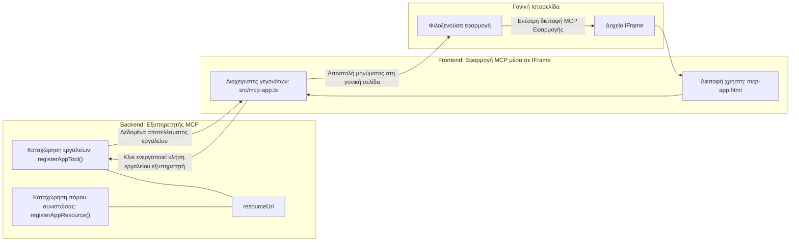
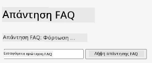
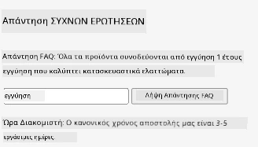
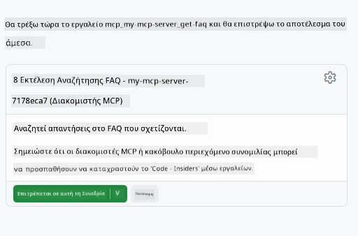

# Εφαρμογές MCP

Οι Εφαρμογές MCP είναι ένα νέο παράδειγμα στο MCP. Η ιδέα είναι ότι όχι μόνο απαντάτε με δεδομένα από μια κλήση εργαλείου, αλλά παρέχετε επίσης πληροφορίες για το πώς πρέπει να γίνει η αλληλεπίδραση με αυτές τις πληροφορίες. Αυτό σημαίνει ότι τα αποτελέσματα των εργαλείων μπορούν πλέον να περιέχουν πληροφορίες για το UI. Γιατί όμως θα θέλαμε κάτι τέτοιο; Λοιπόν, σκεφτείτε πώς κάνετε τα πράγματα σήμερα. Πιθανότατα καταναλώνετε τα αποτελέσματα ενός MCP Server βάζοντας κάποιο είδος frontend μπροστά του, αυτός είναι κώδικας που πρέπει να γράψετε και να διατηρήσετε. Μερικές φορές αυτό είναι που θέλετε, αλλά μερικές φορές θα ήταν υπέροχο αν μπορούσατε απλώς να φέρετε ένα απόσπασμα πληροφοριών που είναι αυτόνομο και έχει τα πάντα, από δεδομένα μέχρι διεπαφή χρήστη.

## Επισκόπηση

Αυτό το μάθημα παρέχει πρακτικές οδηγίες για τις Εφαρμογές MCP, πώς να ξεκινήσετε με αυτές και πώς να τις ενσωματώσετε στις υπάρχουσες Web Εφαρμογές σας. Οι Εφαρμογές MCP είναι μια πολύ νέα προσθήκη στο Πρότυπο MCP.

## Στόχοι Μάθησης

Στο τέλος αυτού του μαθήματος, θα μπορείτε να:

- Εξηγήσετε τι είναι οι Εφαρμογές MCP.
- Πότε να χρησιμοποιείτε τις Εφαρμογές MCP.
- Δημιουργήσετε και να ενσωματώσετε τις δικές σας Εφαρμογές MCP.

## Εφαρμογές MCP - πώς λειτουργούν

Η ιδέα με τις Εφαρμογές MCP είναι να παρέχετε μια απάντηση που ουσιαστικά είναι ένα συστατικό (component) για απόδοση. Ένα τέτοιο συστατικό μπορεί να έχει τόσο οπτικά χαρακτηριστικά όσο και διαδραστικότητα, π.χ. κλικ κουμπιών, είσοδο χρήστη και άλλα. Ας ξεκινήσουμε με την πλευρά του server και τον MCP Server μας. Για να δημιουργήσετε ένα συστατικό MCP App χρειάζεστε να δημιουργήσετε ένα εργαλείο αλλά και τον πόρο εφαρμογής. Αυτά τα δύο μέρη συνδέονται με ένα resourceUri.

Ακολουθεί ένα παράδειγμα. Ας προσπαθήσουμε να οπτικοποιήσουμε τι εμπλέκεται και ποια μέρη κάνουν τι:

```text
server.ts -- responsible for registering tools and the component as a UI component
src/
  mcp-app.ts -- wiring up event handlers
mcp-app.html -- the user interface
```

Αυτή η οπτική περιγράφει την αρχιτεκτονική για τη δημιουργία ενός συστατικού και τη λογική του.


Ας προσπαθήσουμε να περιγράψουμε στη συνέχεια τις ευθύνες για backend και frontend αντίστοιχα.

### Το backend

Υπάρχουν δύο πράγματα που πρέπει να επιτύχουμε εδώ:

- Εγγραφή των εργαλείων με τα οποία θέλουμε να αλληλεπιδράσουμε.
- Ορισμός του συστατικού.

**Εγγραφή του εργαλείου**

```typescript
registerAppTool(
    server,
    "get-time",
    {
      title: "Get Time",
      description: "Returns the current server time.",
      inputSchema: {},
      _meta: { ui: { resourceUri } }, // Συνδέει αυτό το εργαλείο με τον πόρο UI του
    },
    async () => {
      const time = new Date().toISOString();
      return { content: [{ type: "text", text: time }] };
    },
  );

```

Ο προηγούμενος κώδικας περιγράφει τη συμπεριφορά, όπου αποκαλύπτει ένα εργαλείο με όνομα `get-time`. Δεν παίρνει είσοδο αλλά παράγει την τρέχουσα ώρα. Έχουμε τη δυνατότητα να ορίσουμε ένα `inputSchema` για τα εργαλεία όπου πρέπει να δεχόμαστε είσοδο από τον χρήστη.

**Εγγραφή του συστατικού**

Στο ίδιο αρχείο, πρέπει επίσης να καταχωρήσουμε το συστατικό:

```typescript
const resourceUri = "ui://get-time/mcp-app.html";

// Καταχωρίστε την πηγή, η οποία επιστρέφει το ενσωματωμένο HTML/JavaScript για το UI.
registerAppResource(
  server,
  resourceUri,
  resourceUri,
  { mimeType: RESOURCE_MIME_TYPE },
  async () => {
    const html = await fs.readFile(path.join(DIST_DIR, "mcp-app.html"), "utf-8");

    return {
    contents: [
        { uri: resourceUri, mimeType: RESOURCE_MIME_TYPE, text: html },
    ],
    };
  },
);
```

Σημειώστε πώς αναφέρουμε `resourceUri` για να συνδέσουμε το συστατικό με τα εργαλεία του. Ενδιαφέρον παρουσιάζει επίσης το callback όπου φορτώνουμε το αρχείο UI και επιστρέφουμε το συστατικό.

### Το frontend του συστατικού

Όπως και στο backend, υπάρχουν δύο κομμάτια εδώ:

- Ένα frontend γραμμένο σε καθαρό HTML.
- Κώδικας που χειρίζεται συμβάντα και τι πρέπει να γίνει, π.χ. κλήση εργαλείων ή αποστολή μηνυμάτων στο γονικό παράθυρο.

**Διεπαφή χρήστη**

Ας ρίξουμε μια ματιά στη διεπαφή χρήστη.

```html
<!-- mcp-app.html -->
<!DOCTYPE html>
<html lang="en">
  <head>
    <meta charset="UTF-8" />
    <title>Get Time App</title>
  </head>
  <body>
    <p>
      <strong>Server Time:</strong> <code id="server-time">Loading...</code>
    </p>
    <button id="get-time-btn">Get Server Time</button>
    <script type="module" src="/src/mcp-app.ts"></script>
  </body>
</html>
```

**Σύνδεση συμβάντων**

Το τελευταίο κομμάτι είναι η σύνδεση συμβάντων. Αυτό σημαίνει ότι προσδιορίζουμε ποιο μέρος στο UI μας χρειάζεται χειριστές συμβάντων και τι πρέπει να γίνει αν εγερθούν συμβάντα:

```typescript
// mcp-app.ts

import { App } from "@modelcontextprotocol/ext-apps";

// Λήψη αναφορών στοιχείων
const serverTimeEl = document.getElementById("server-time")!;
const getTimeBtn = document.getElementById("get-time-btn")!;

// Δημιουργία στιγμιότυπου εφαρμογής
const app = new App({ name: "Get Time App", version: "1.0.0" });

// Διαχείριση αποτελεσμάτων εργαλείων από τον διακομιστή. Ορίστε πριν από το `app.connect()` για να αποφύγετε
// την απώλεια του αρχικού αποτελέσματος εργαλείου.
app.ontoolresult = (result) => {
  const time = result.content?.find((c) => c.type === "text")?.text;
  serverTimeEl.textContent = time ?? "[ERROR]";
};

// Συνδέστε κλικ κουμπιού
getTimeBtn.addEventListener("click", async () => {
  // Το `app.callServerTool()` επιτρέπει στο UI να ζητήσει νεότερα δεδομένα από τον διακομιστή
  const result = await app.callServerTool({ name: "get-time", arguments: {} });
  const time = result.content?.find((c) => c.type === "text")?.text;
  serverTimeEl.textContent = time ?? "[ERROR]";
});

// Σύνδεση με το host
app.connect();
```

Όπως βλέπετε παραπάνω, αυτός είναι κανονικός κώδικας για το δέσιμο στοιχείων του DOM με συμβάντα. Αξίζει να αναφερθεί η κλήση στο `callServerTool` που τελικά καλεί ένα εργαλείο στο backend.

## Διαχείριση εισόδου χρήστη

Μέχρι τώρα, έχουμε δει ένα συστατικό που έχει ένα κουμπί που όταν πατηθεί καλεί ένα εργαλείο. Ας δούμε αν μπορούμε να προσθέσουμε περισσότερα στοιχεία UI όπως ένα πεδίο εισόδου και να στείλουμε ορίσματα σε ένα εργαλείο. Ας υλοποιήσουμε μια λειτουργία FAQ. Δείτε πώς θα έπρεπε να λειτουργεί:

- Θα πρέπει να υπάρχει ένα κουμπί και ένα στοιχείο εισόδου όπου ο χρήστης πληκτρολογεί μια λέξη-κλειδί για αναζήτηση, για παράδειγμα "Shipping". Αυτό θα πρέπει να καλεί ένα εργαλείο στο backend που κάνει αναζήτηση στα δεδομένα FAQ.
- Ένα εργαλείο που υποστηρίζει την προαναφερθείσα αναζήτηση FAQ.

Ας προσθέσουμε πρώτα την απαραίτητη υποστήριξη στο backend:

```typescript
const faq: { [key: string]: string } = {
    "shipping": "Our standard shipping time is 3-5 business days.",
    "return policy": "You can return any item within 30 days of purchase.",
    "warranty": "All products come with a 1-year warranty covering manufacturing defects.",
  }

registerAppTool(
    server,
    "get-faq",
    {
      title: "Search FAQ",
      description: "Searches the FAQ for relevant answers.",
      inputSchema: zod.object({
        query: zod.string().default("shipping"),
      }),
      _meta: { ui: { resourceUri: faqResourceUri } }, // Συνδέει αυτό το εργαλείο με την πηγή UI του
    },
    async ({ query }) => {
      const answer: string = faq[query.toLowerCase()] || "Sorry, I don't have an answer for that.";
      return { content: [{ type: "text", text: answer }] };
    },
  );
```

Αυτό που βλέπουμε εδώ είναι πώς συμπληρώνουμε το `inputSchema` και του δίνουμε ένα σχήμα `zod` ως εξής:

```typescript
inputSchema: zod.object({
  query: zod.string().default("shipping"),
})
```

Στο παραπάνω σχήμα δηλώνουμε ότι έχουμε μια παράμετρο εισόδου με όνομα `query` και ότι είναι προαιρετική με προεπιλεγμένη τιμή "shipping".

Εντάξει, ας προχωρήσουμε στο *mcp-app.html* για να δούμε τι UI πρέπει να δημιουργήσουμε για αυτό:

```html
<div class="faq">
    <h1>FAQ response</h1>
    <p>FAQ Response: <code id="faq-response">Loading...</code></p>
    <input type="text" id="faq-query" placeholder="Enter FAQ query" />
    <button id="get-faq-btn">Get FAQ Response</button>
  </div>
```

Τέλεια, τώρα έχουμε ένα στοιχείο εισόδου και ένα κουμπί. Ας πάμε στο *mcp-app.ts* στη συνέχεια για να συνδέσουμε αυτά τα συμβάντα:

```typescript
const getFaqBtn = document.getElementById("get-faq-btn")!;
const faqQueryInput = document.getElementById("faq-query") as HTMLInputElement;

getFaqBtn.addEventListener("click", async () => {
  const query = faqQueryInput.value;
  const result = await app.callServerTool({ name: "get-faq", arguments: { query } });
  const faq = result.content?.find((c) => c.type === "text")?.text;
  faqResponseEl.textContent = faq ?? "[ERROR]";
});
```

Στον παραπάνω κώδικα:

- Δημιουργούμε αναφορές στα ενδιαφέροντα στοιχεία UI.
- Χειριζόμαστε ένα κλικ κουμπιού για να αναλύσουμε την τιμή του πεδίου εισόδου και καλούμε επίσης το `app.callServerTool()` με `name` και `arguments`, όπου το τελευταίο περνάει το `query` ως τιμή.

Το πραγματικό που γίνεται όταν καλείτε `callServerTool` είναι ότι στέλνει ένα μήνυμα στο γονικό παράθυρο και αυτό το παράθυρο τελικά καλεί τον MCP Server.

### Δοκιμάστε το

Δοκιμάζοντας αυτό, τώρα θα πρέπει να δούμε τα εξής:



και εδώ όπου το δοκιμάζουμε με είσοδο όπως "warranty"



Για να τρέξετε αυτόν τον κώδικα, πηγαίνετε στην [Ενότητα Κώδικα](./code/README.md)

## Δοκιμές στο Visual Studio Code

Το Visual Studio Code έχει εξαιρετική υποστήριξη για MVP Apps και είναι πιθανόν ένας από τους ευκολότερους τρόπους για να δοκιμάσετε τις Εφαρμογές MCP σας. Για να χρησιμοποιήσετε το Visual Studio Code, προσθέστε μια εγγραφή server στο *mcp.json* ως εξής:

```json
"my-mcp-server-7178eca7": {
    "url": "http://localhost:3001/mcp",
    "type": "http"
  }
```

Στη συνέχεια ξεκινήστε τον server, θα πρέπει να μπορείτε να επικοινωνείτε με την MVP App σας μέσω του Chat Window εφόσον έχετε εγκατεστημένο το GitHub Copilot.

με ενεργοποίηση μέσω prompt, για παράδειγμα "#get-faq":



και όπως όταν το τρέξατε μέσω browser, αποδίδει με τον ίδιο τρόπο ως εξής:


## Άσκηση

Δημιουργήστε ένα παιχνίδι πέτρα-ψαλίδι-χαρτί. Θα πρέπει να αποτελείται από τα εξής:

UI:

- μια αναπτυσσόμενη λίστα με επιλογές
- ένα κουμπί για υποβολή επιλογής
- μια ετικέτα που δείχνει ποιος επέλεξε τι και ποιος κέρδισε

Server:

- θα πρέπει να διαθέτει ένα εργαλείο πέτρα-ψαλίδι-χαρτί που παίρνει "choice" ως είσοδο. Επίσης πρέπει να αποδίδει μια επιλογή υπολογιστή και να προσδιορίζει τον νικητή

## Λύση

[Λύση](./assignment/README.md)

## Περίληψη

Μάθαμε για αυτό το νέο παράδειγμα, τις Εφαρμογές MCP. Είναι ένα νέο παράδειγμα που επιτρέπει στους MCP Servers να έχουν άποψη όχι μόνο για τα δεδομένα αλλά και για το πώς αυτά τα δεδομένα πρέπει να παρουσιαστούν.

Επιπλέον, μάθαμε ότι αυτές οι Εφαρμογές MCP φιλοξενούνται μέσα σε IFrame και για να επικοινωνήσουν με τους MCP Servers χρειάζεται να στέλνουν μηνύματα στην τρέχουσα web εφαρμογή γονέα. Υπάρχουν αρκετές βιβλιοθήκες για απλό JavaScript, React και άλλες που κάνουν αυτή την επικοινωνία πιο εύκολη.

## Κύρια Μαθήματα

Αυτά μάθατε:

- Οι Εφαρμογές MCP είναι ένα νέο πρότυπο που μπορεί να είναι χρήσιμο όταν θέλετε να στείλετε και δεδομένα και λειτουργίες UI.
- Αυτού του τύπου οι εφαρμογές τρέχουν σε IFrame για λόγους ασφαλείας.

## Τι Ακολουθεί

- [Κεφάλαιο 4](../../04-PracticalImplementation/README.md)

---

<!-- CO-OP TRANSLATOR DISCLAIMER START -->
**Αποποίηση ευθυνών**:  
Αυτό το έγγραφο έχει μεταφραστεί χρησιμοποιώντας την υπηρεσία μετάφρασης AI [Co-op Translator](https://github.com/Azure/co-op-translator). Παρόλο που επιδιώκουμε την ακρίβεια, παρακαλούμε να λάβετε υπόψη ότι οι αυτόματες μεταφράσεις ενδέχεται να περιέχουν λάθη ή ανακρίβειες. Το πρωτότυπο έγγραφο στη γλώσσα του πρέπει να θεωρείται η επίσημη πηγή. Για κρίσιμες πληροφορίες, συνιστάται η επαγγελματική μετάφραση από ανθρώπους. Δεν φέρουμε ευθύνη για τυχόν παρεξηγήσεις ή λανθασμένες ερμηνείες που προκύπτουν από τη χρήση αυτής της μετάφρασης.
<!-- CO-OP TRANSLATOR DISCLAIMER END -->