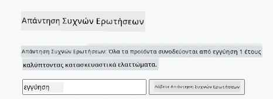
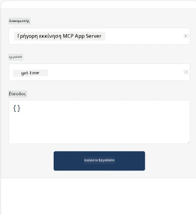
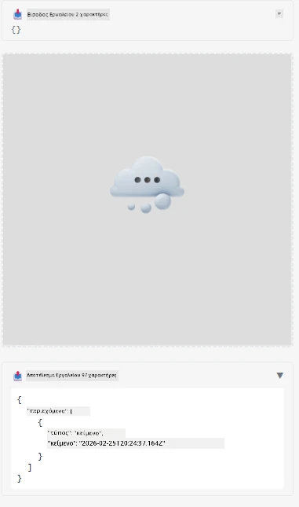

Ακολουθεί ένα δείγμα που παρουσιάζει την Εφαρμογή MCP

## Εγκατάσταση

1. Μεταβείτε στο φάκελο *mcp-app*
1. Εκτελέστε `npm install`, αυτό θα πρέπει να εγκαταστήσει τις εξαρτήσεις frontend και backend

Επιβεβαιώστε ότι το backend μεταγλωττίζεται εκτελώντας:

```sh
npx tsc --noEmit
```

Δεν θα πρέπει να υπάρχει έξοδος αν όλα είναι σωστά.

## Εκτέλεση backend

> Αυτό απαιτεί λίγη περισσότερη δουλειά αν είστε σε μηχάνημα Windows καθώς η λύση MCP Apps χρησιμοποιεί τη βιβλιοθήκη `concurrently` για να τρέξει, για την οποία πρέπει να βρείτε μια εναλλακτική. Η γραμμή που δημιουργεί πρόβλημα στο *package.json* στην MCP App είναι η εξής:

    ```json
    "start": "concurrently \"cross-env NODE_ENV=development INPUT=mcp-app.html vite build --watch\" \"tsx watch main.ts\""
    ```

Αυτή η εφαρμογή έχει δύο μέρη, ένα backend και ένα μέρος host.

Ξεκινήστε το backend καλώντας:

```sh
npm start
```

Αυτό θα πρέπει να ξεκινήσει το backend στο `http://localhost:3001/mcp`.

> Σημείωση, αν βρίσκεστε σε Codespace, ίσως χρειαστεί να ορίσετε την ορατότητα της θύρας σε δημόσια. Ελέγξτε ότι μπορείτε να φτάσετε στο endpoint μέσω https://<όνομα Codespace>.app.github.dev/mcp από το πρόγραμμα περιήγησης.

## Επιλογή -1 Δοκιμή της εφαρμογής στο Visual Studio Code

Για να δοκιμάσετε τη λύση στο Visual Studio Code, κάντε τα εξής:

- Προσθέστε μια καταχώρηση server στο `mcp.json` ως εξής:

    ```json
    {
        "servers": {
            "my-mcp-server-7178eca7": {
                "url": "http://localhost:3001/mcp",
                "type": "http"
            }
        },
        "inputs": []
    }
    ```

1. Κάντε κλικ στο κουμπί "start" στο *mcp.json*
1. Βεβαιωθείτε ότι είναι ανοιχτό ένα παράθυρο συνομιλίας και πληκτρολογήστε `get-faq`, θα δείτε ένα αποτέλεσμα όπως το εξής:

    

## Επιλογή -2- Δοκιμή της εφαρμογής με host

Το αποθετήριο <https://github.com/modelcontextprotocol/ext-apps> περιέχει διάφορους hosts που μπορείτε να χρησιμοποιήσετε για να δοκιμάσετε τις MVP Εφαρμογές σας.

Θα σας παρουσιάσουμε εδώ δύο διαφορετικές επιλογές:

### Τοπικός υπολογιστής

- Μεταβείτε στο *ext-apps* αφού έχετε κλωνοποιήσει το repo.

- Εγκαταστήστε τις εξαρτήσεις

   ```sh
   npm install
   ```

- Σε ξεχωριστό τερματικό, μεταβείτε στο *ext-apps/examples/basic-host*

    > Αν είστε στο Codespace, πρέπει να μεταβείτε στο serve.ts στη γραμμή 27 και να αντικαταστήσετε το http://localhost:3001/mcp με το URL του Codespace σας για το backend, π.χ. https://psychic-xylophone-657rpjgvxpc5g64-3001.app.github.dev/mcp

- Εκτελέστε τον host:

    ```sh
    npm start
    ```

    Αυτό θα πρέπει να συνδέσει τον host με το backend και θα πρέπει να δείτε την εφαρμογή να τρέχει ως εξής:

    

### Codespace

Απαιτεί κάποια επιπλέον δουλειά το να λειτουργήσει ένα περιβάλλον Codespace. Για να χρησιμοποιήσετε host μέσω Codespace:

- Δείτε τον κατάλογο *ext-apps* και μεταβείτε στο *examples/basic-host*.
- Εκτελέστε `npm install` για να εγκαταστήσετε τις εξαρτήσεις
- Εκτελέστε `npm start` για να ξεκινήσετε τον host.

## Δοκιμάστε την εφαρμογή

Δοκιμάστε την εφαρμογή με τον εξής τρόπο:

- Επιλέξτε το κουμπί "Call Tool" και θα δείτε τα αποτελέσματα ως εξής:

    

Τέλεια, λειτουργεί όλα.

---

<!-- CO-OP TRANSLATOR DISCLAIMER START -->
**Αποποίηση ευθυνών**:  
Αυτό το έγγραφο έχει μεταφραστεί χρησιμοποιώντας την υπηρεσία μετάφρασης με τεχνητή νοημοσύνη [Co-op Translator](https://github.com/Azure/co-op-translator). Παρόλο που επιδιώκουμε την ακρίβεια, παρακαλούμε να λάβετε υπόψη ότι οι αυτόματες μεταφράσεις ενδέχεται να περιέχουν σφάλματα ή ανακρίβειες. Το πρωτότυπο έγγραφο στη μητρική του γλώσσα πρέπει να θεωρείται η αυθεντική πηγή. Για κρίσιμες πληροφορίες συνιστάται η επαγγελματική ανθρώπινη μετάφραση. Δεν ευθυνόμαστε για τυχόν παρεξηγήσεις ή λανθασμένες ερμηνείες που προκύπτουν από τη χρήση αυτής της μετάφρασης.
<!-- CO-OP TRANSLATOR DISCLAIMER END -->