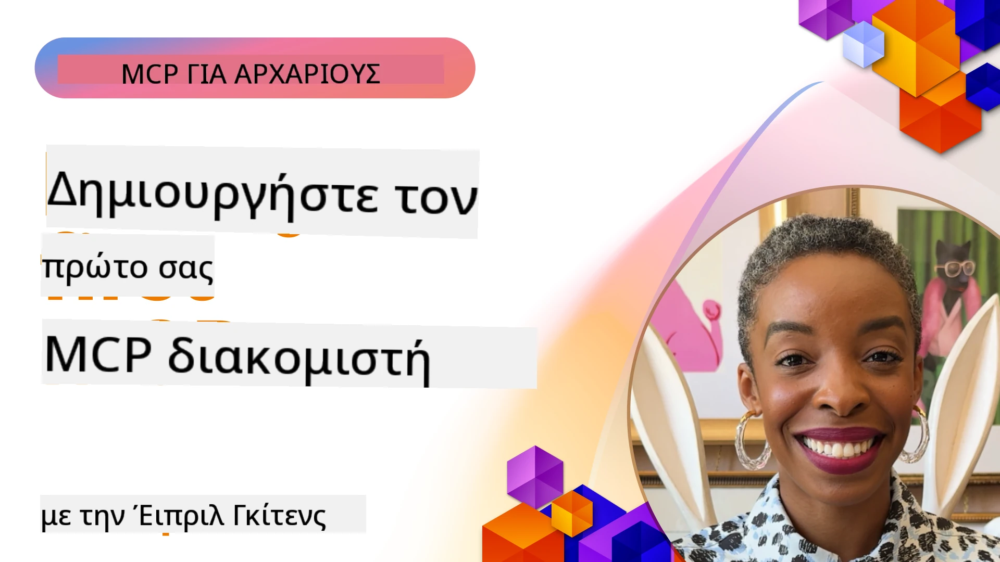

## Ξεκινώντας  

_(Κάντε κλικ στην εικόνα παραπάνω για να δείτε το βίντεο αυτής της μαθήματος)_

Αυτή η ενότητα αποτελείται από διάφορα μαθήματα:

- **1 Ο πρώτος σας server**, σε αυτό το πρώτο μάθημα, θα μάθετε πώς να δημιουργήσετε τον πρώτο σας server και να τον ελέγξετε με το εργαλείο επιθεώρησης, έναν πολύτιμο τρόπο για να δοκιμάσετε και να αποσφαλματώνετε τον server σας, [στο μάθημα](01-first-server/README.md)

- **2 Πελάτης**, σε αυτό το μάθημα, θα μάθετε πώς να γράψετε έναν πελάτη που μπορεί να συνδεθεί με τον server σας, [στο μάθημα](02-client/README.md)

- **3 Πελάτης με LLM**, ένας ακόμη καλύτερος τρόπος για να γράψετε έναν πελάτη είναι να προσθέσετε ένα LLM, ώστε να μπορεί να "διαπραγματεύεται" με τον server σας για το τι θα κάνει, [στο μάθημα](03-llm-client/README.md)

- **4 Χρήση ενός server GitHub Copilot Agent σε Visual Studio Code**. Εδώ εξετάζουμε τη χρήση του MCP Server μας μέσα από το Visual Studio Code, [στο μάθημα](04-vscode/README.md)

- **5 stdio Μεταφορά Server** stdio μεταφορά είναι το προτεινόμενο πρότυπο για τοπική επικοινωνία MCP server-πελάτη, παρέχοντας ασφαλή επικοινωνία βασισμένη σε υποδιαδικασίες με ενσωματωμένη απομόνωση διαδικασιών [στο μάθημα](05-stdio-server/README.md)

- **6 HTTP Streaming με MCP (Streamable HTTP)**. Μάθετε για το σύγχρονο HTTP streaming (η προτεινόμενη μέθοδος για απομακρυσμένους MCP servers σύμφωνα με [MCP Specification 2025-11-25](https://spec.modelcontextprotocol.io/specification/2025-11-25/basic/transports/#streamable-http)), ειδοποιήσεις προόδου, και πώς να υλοποιήσετε κλιμακούμενους, σε πραγματικό χρόνο MCP servers και πελάτες χρησιμοποιώντας Streamable HTTP. [στο μάθημα](06-http-streaming/README.md)

- **7 Εκμετάλλευση του AI Toolkit για VSCode** για κατανάλωση και δοκιμή των MCP Πελατών και Server σας [στο μάθημα](07-aitk/README.md)

- **8 Δοκιμές**. Εδώ θα εστιάσουμε ειδικά στον τρόπο που μπορούμε να δοκιμάσουμε τον server και τον πελάτη μας με διάφορους τρόπους, [στο μάθημα](08-testing/README.md)

- **9 Ανάπτυξη**. Αυτό το κεφάλαιο εξετάζει διάφορους τρόπους ανάπτυξης των λύσεων MCP σας, [στο μάθημα](09-deployment/README.md)

- **10 Προχωρημένη χρήση server**. Αυτό το κεφάλαιο καλύπτει προχωρημένη χρήση server, [στο μάθημα](./10-advanced/README.md)

- **11 Αυθεντικοποίηση**. Αυτό το κεφάλαιο καλύπτει πώς να προσθέσετε απλή αυθεντικοποίηση, από Basic Auth έως χρήση JWT και RBAC. Σας ενθαρρύνουμε να ξεκινήσετε εδώ και μετά να δείτε Προχωρημένα Θέματα στο Κεφάλαιο 5 και να εφαρμόσετε πρόσθετη θωράκιση ασφάλειας μέσω προτάσεων στο Κεφάλαιο 2, [στο μάθημα](./11-simple-auth/README.md)

- **12 Hosts MCP**. Ρυθμίστε και χρησιμοποιήστε δημοφιλείς MCP host clients περιλαμβάνοντας Claude Desktop, Cursor, Cline και Windsurf. Μάθετε τύπους μεταφοράς και επιδιόρθωση προβλημάτων, [στο μάθημα](./12-mcp-hosts/README.md)

- **13 MCP Inspector**. Αποσφαλματώστε και δοκιμάστε τους MCP servers σας διαδραστικά χρησιμοποιώντας το εργαλείο MCP Inspector. Μάθετε πώς να επιλύετε ζητήματα σε εργαλεία, πόρους και μηνύματα πρωτοκόλλου, [στο μάθημα](./13-mcp-inspector/README.md)

- **14 Δείγμα**. Δημιουργήστε MCP Servers που συνεργάζονται με MCP πελάτες σε εργασίες που σχετίζονται με LLM. [στο μάθημα](./14-sampling/README.md)

- **15 Εφαρμογές MCP**. Δημιουργήστε MCP Servers που ανταποκρίνονται επίσης με οδηγίες UI, [στο μάθημα](./15-mcp-apps/README.md)

Το Model Context Protocol (MCP) είναι ένα ανοιχτό πρωτόκολλο που τυποποιεί πώς οι εφαρμογές παρέχουν πλαίσιο στα LLMs. Σκεφτείτε το MCP σαν μια θύρα USB-C για εφαρμογές ΤΝ - παρέχει έναν τυποποιημένο τρόπο σύνδεσης μοντέλων ΤΝ με διαφορετικές πηγές δεδομένων και εργαλεία.

## Μαθησιακοί Στόχοι

Μέχρι το τέλος αυτού του μαθήματος, θα μπορείτε να:

- Ρυθμίσετε περιβάλλοντα ανάπτυξης για MCP σε C#, Java, Python, TypeScript και JavaScript
- Δημιουργήσετε και αναπτύξετε βασικούς MCP servers με προσαρμοσμένα χαρακτηριστικά (πόροι, προτροπές και εργαλεία)
- Δημιουργήσετε εφαρμογές host που συνδέονται με MCP servers
- Δοκιμάσετε και αποσφαλματώσετε υλοποιήσεις MCP
- Κατανοήσετε κοινές προκλήσεις ρύθμισης και τις λύσεις τους
- Συνδέσετε τις υλοποιήσεις MCP με δημοφιλείς υπηρεσίες LLM

## Ρύθμιση του Περιβάλλοντος MCP σας

Πριν ξεκινήσετε να εργάζεστε με MCP, είναι σημαντικό να προετοιμάσετε το περιβάλλον ανάπτυξής σας και να κατανοήσετε τη βασική ροή εργασιών. Αυτή η ενότητα θα σας καθοδηγήσει στα αρχικά βήματα ρύθμισης για ομαλή έναρξη με το MCP.

### Προϋποθέσεις

Πριν ξεκινήσετε την ανάπτυξη MCP, βεβαιωθείτε ότι έχετε:

- **Περιβάλλον Ανάπτυξης**: Για τη γλώσσα που επιλέξατε (C#, Java, Python, TypeScript ή JavaScript)
- **IDE/Επεξεργαστής**: Visual Studio, Visual Studio Code, IntelliJ, Eclipse, PyCharm ή οποιοδήποτε σύγχρονο επεξεργαστή κώδικα
- **Διαχειριστές Πακέτων**: NuGet, Maven/Gradle, pip ή npm/yarn
- **Κλειδιά API**: Για οποιεσδήποτε υπηρεσίες AI σκοπεύετε να χρησιμοποιήσετε στις εφαρμογές host σας

### Επίσημα SDKs

Στα επόμενα κεφάλαια θα δείτε λύσεις που δημιουργήθηκαν χρησιμοποιώντας Python, TypeScript, Java και .NET. Εδώ είναι όλα τα επίσημα υποστηριζόμενα SDKs.

Το MCP παρέχει επίσημα SDKs για πολλές γλώσσες (σύμφωνα με [MCP Specification 2025-11-25](https://spec.modelcontextprotocol.io/specification/2025-11-25/)):
- [C# SDK](https://github.com/modelcontextprotocol/csharp-sdk) - Συντηρείται σε συνεργασία με τη Microsoft
- [Java SDK](https://github.com/modelcontextprotocol/java-sdk) - Συντηρείται σε συνεργασία με τη Spring AI
- [TypeScript SDK](https://github.com/modelcontextprotocol/typescript-sdk) - Η επίσημη υλοποίηση σε TypeScript
- [Python SDK](https://github.com/modelcontextprotocol/python-sdk) - Η επίσημη υλοποίηση σε Python (FastMCP)
- [Kotlin SDK](https://github.com/modelcontextprotocol/kotlin-sdk) - Η επίσημη υλοποίηση σε Kotlin
- [Swift SDK](https://github.com/modelcontextprotocol/swift-sdk) - Συντηρείται σε συνεργασία με τη Loopwork AI
- [Rust SDK](https://github.com/modelcontextprotocol/rust-sdk) - Η επίσημη υλοποίηση σε Rust
- [Go SDK](https://github.com/modelcontextprotocol/go-sdk) - Η επίσημη υλοποίηση σε Go

## Βασικά Συμπεράσματα

- Η ρύθμιση ενός περιβάλλοντος ανάπτυξης MCP είναι απλή με SDKs ειδικά για κάθε γλώσσα
- Η δημιουργία MCP servers περιλαμβάνει τη δημιουργία και εγγραφή εργαλείων με σαφή σχήματα
- Οι MCP πελάτες συνδέονται με servers και μοντέλα για να αξιοποιήσουν εκτεταμένες δυνατότητες
- Οι δοκιμές και η αποσφαλμάτωση είναι απαραίτητες για αξιόπιστες υλοποιήσεις MCP
- Οι επιλογές ανάπτυξης κυμαίνονται από τοπική ανάπτυξη έως λύσεις στο νέφος

## Πρακτική

Διαθέτουμε ένα σύνολο δειγμάτων που συμπληρώνει τις ασκήσεις που θα δείτε σε όλα τα κεφάλαια αυτής της ενότητας. Επιπλέον, κάθε κεφάλαιο έχει τις δικές του ασκήσεις και εργασίες

- [Υπολογιστής Java](./samples/java/calculator/README.md)
- [Υπολογιστής .Net](../../../03-GettingStarted/samples/csharp)
- [Υπολογιστής JavaScript](./samples/javascript/README.md)
- [Υπολογιστής TypeScript](./samples/typescript/README.md)
- [Υπολογιστής Python](../../../03-GettingStarted/samples/python)

## Πρόσθετοι Πόροι

- [Δημιουργία Agents χρησιμοποιώντας Model Context Protocol στο Azure](https://learn.microsoft.com/azure/developer/ai/intro-agents-mcp)
- [Απομακρυσμένο MCP με Azure Container Apps (Node.js/TypeScript/JavaScript)](https://learn.microsoft.com/samples/azure-samples/mcp-container-ts/mcp-container-ts/)
- [.NET OpenAI MCP Agent](https://learn.microsoft.com/samples/azure-samples/openai-mcp-agent-dotnet/openai-mcp-agent-dotnet/)

## Τι ακολουθεί

Ξεκινήστε με το πρώτο μάθημα: [Δημιουργία του πρώτου σας MCP Server](01-first-server/README.md)

Μόλις ολοκληρώσετε αυτή τη μονάδα, συνεχίστε στο: [Μονάδα 4: Πρακτική Εφαρμογή](../04-PracticalImplementation/README.md)

---

<!-- CO-OP TRANSLATOR DISCLAIMER START -->
**Αποποίηση ευθυνών**:  
Αυτό το έγγραφο έχει μεταφραστεί με χρήση της υπηρεσίας αυτόματης μετάφρασης AI [Co-op Translator](https://github.com/Azure/co-op-translator). Παρόλο που επιδιώκουμε την ακρίβεια, παρακαλούμε να λάβετε υπόψη ότι οι αυτοματοποιημένες μεταφράσεις ενδέχεται να περιέχουν σφάλματα ή ανακρίβειες. Το πρωτότυπο έγγραφο στη μητρική του γλώσσα πρέπει να θεωρείται η επίσημη πηγή. Για κρίσιμες πληροφορίες, συνιστάται επαγγελματική ανθρώπινη μετάφραση. Δεν φέρουμε ευθύνη για οποιεσδήποτε παρεξηγήσεις ή λανθασμένες ερμηνείες προκύψουν από τη χρήση αυτής της μετάφρασης.
<!-- CO-OP TRANSLATOR DISCLAIMER END -->