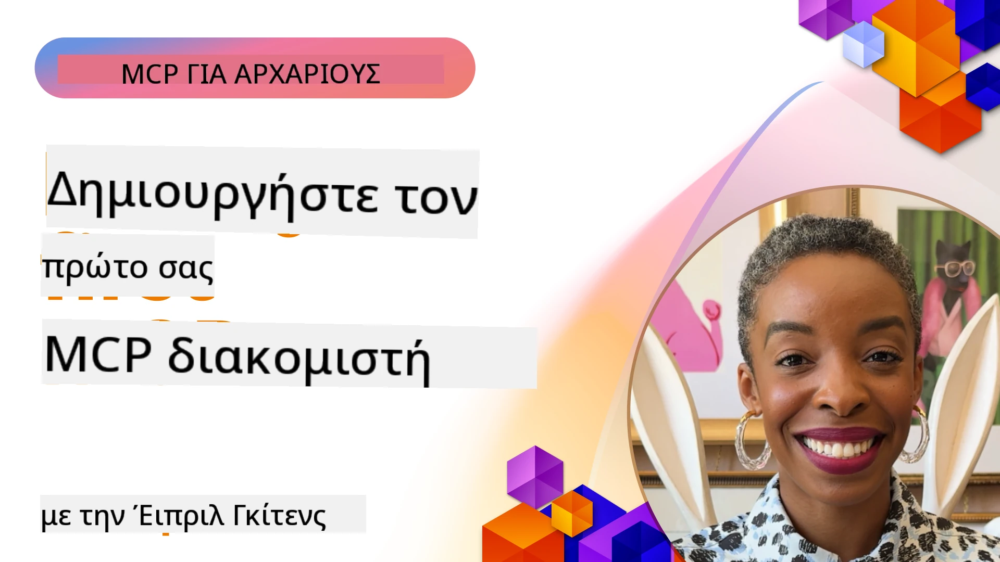

## Ξεκινώντας  

_(Κάντε κλικ στην παραπάνω εικόνα για να δείτε το βίντεο αυτού του μαθήματος)_

Αυτή η ενότητα αποτελείται από διάφορα μαθήματα:

- **1 Ο πρώτος σας διακομιστής**, σε αυτό το πρώτο μάθημα, θα μάθετε πώς να δημιουργήσετε τον πρώτο σας διακομιστή και να τον εξετάσετε με το εργαλείο επιθεώρησης, έναν πολύτιμο τρόπο για να δοκιμάσετε και να αποσφαλματώσετε τον διακομιστή σας, [στο μάθημα](01-first-server/README.md)

- **2 Πελάτης**, σε αυτό το μάθημα, θα μάθετε πώς να γράψετε έναν πελάτη που μπορεί να συνδεθεί στον διακομιστή σας, [στο μάθημα](02-client/README.md)

- **3 Πελάτης με LLM**, ένας ακόμη καλύτερος τρόπος γραφής ενός πελάτη είναι με την προσθήκη ενός LLM ώστε να μπορεί να "διαπραγματευτεί" με τον διακομιστή σας για το τι να κάνει, [στο μάθημα](03-llm-client/README.md)

- **4 Κατανάλωση λειτουργίας Server GitHub Copilot Agent σε Visual Studio Code**. Εδώ, εξετάζουμε την εκτέλεση του MCP Server μας μέσα από το Visual Studio Code, [στο μάθημα](04-vscode/README.md)

- **5 Διακομιστής stdio Transport** stdio transport είναι το συνιστώμενο πρότυπο για την τοπική επικοινωνία διακομιστή MCP-πελάτη, παρέχοντας ασφαλή επικοινωνία μέσω υποδιαδικασιών με ενσωματωμένη απομόνωση διαδικασίας [στο μάθημα](05-stdio-server/README.md)

- **6 HTTP Streaming με MCP (Streamable HTTP)**. Μάθετε για το πρότυπο
	απομακρυσμένης μεταφοράς στο [MCP Specification 2026-07-28](https://modelcontextprotocol.io/specification/2026-07-28/basic/transports/streamable-http),
	συν την παλιά υλοποίηση βασισμένη σε συνεδρίες που διατηρείται στο μάθημα.
	[στο μάθημα](06-http-streaming/README.md)

- **7 Χρήση του AI Toolkit για το VSCode** για κατανάλωση και δοκιμή των MCP πελατών και διακομιστών σας [στο μάθημα](07-aitk/README.md)

- **8 Δοκιμές**. Εδώ θα επικεντρωθούμε ειδικά στο πώς μπορούμε να δοκιμάσουμε τον διακομιστή και τον πελάτη μας με διάφορους τρόπους, [στο μάθημα](08-testing/README.md)

- **9 Ανάπτυξη**. Αυτό το κεφάλαιο εξετάζει διάφορους τρόπους ανάπτυξης των λύσεων MCP, [στο μάθημα](09-deployment/README.md)

- **10 Προχωρημένη χρήση διακομιστή**. Αυτό το κεφάλαιο καλύπτει προχωρημένη χρήση διακομιστή, [στο μάθημα](./10-advanced/README.md)

- **11 Ταυτοποίηση**. Αυτό το κεφάλαιο καλύπτει πώς να προσθέσετε απλή ταυτοποίηση, από Basic Auth μέχρι τη χρήση JWT και RBAC. Σας ενθαρρύνουμε να ξεκινήσετε εδώ και μετά να δείτε Προχωρημένα Θέματα στο Κεφάλαιο 5 και να εφαρμόσετε πρόσθετη θωράκιση ασφαλείας μέσω συστάσεων στο Κεφάλαιο 2, [στο μάθημα](./11-simple-auth/README.md)

- **12 MCP Hosts**. Ρυθμίστε και χρησιμοποιήστε δημοφιλείς MCP host clients όπως Claude Desktop, Cursor, Cline και Windsurf. Μάθετε τύπους μεταφοράς και αντιμετώπιση προβλημάτων, [στο μάθημα](./12-mcp-hosts/README.md)

- **13 MCP Inspector**. Αποσφαλμάτωση και δοκιμή των MCP διακομιστών σας διαδραστικά χρησιμοποιώντας το εργαλείο MCP Inspector. Μάθετε να επιλύετε προβλήματα, να χρησιμοποιείτε πόρους και μηνύματα πρωτοκόλλου, [στο μάθημα](./13-mcp-inspector/README.md)

- **14 Δειγματοληψία**. Μάθετε το παλιό primitive της Δειγματοληψίας για το `2025-11-25` και
	πώς να μεταφέρετε νέα σχέδια στην άμεση ενσωμάτωση παρόχου LLM. Η Δειγματοληψία
	είναι αποθεματική στο MCP `2026-07-28`. [στο μάθημα](./14-sampling/README.md)

- **15 MCP Apps**. Δημιουργήστε MCP Servers που απαντούν επίσης με οδηγίες UI, [στο μάθημα](./15-mcp-apps/README.md)

Το Πρωτόκολλο Πλαισίου Μοντέλου (MCP) είναι ένα ανοικτό πρωτόκολλο που τυποποιεί τον τρόπο με τον οποίο οι εφαρμογές παρέχουν πλαίσιο στα LLMs. Σκεφτείτε το MCP σαν μια θύρα USB-C για εφαρμογές AI - προσφέρει έναν τυποποιημένο τρόπο να συνδέονται μοντέλα AI με διαφορετικές πηγές δεδομένων και εργαλεία.

## Στόχοι Μάθησης

Μέχρι το τέλος αυτού του μαθήματος, θα μπορείτε να:

- Ρυθμίσετε περιβάλλοντα ανάπτυξης για MCP σε C#, Java, Python, TypeScript και JavaScript
- Δημιουργήσετε και αναπτύξετε βασικούς MCP διακομιστές με προσαρμοσμένες λειτουργίες (πόρους, prompts, και εργαλεία)
- Δημιουργήσετε εφαρμογές host που συνδέονται με MCP διακομιστές
- Δοκιμάσετε και αποσφαλματώσετε υλοποιήσεις MCP
- Κατανοήσετε κοινές προκλήσεις ρύθμισης και τις λύσεις τους
- Συνδέσετε τις υλοποιήσεις MCP με δημοφιλείς υπηρεσίες LLM

## Ρύθμιση του Περιβάλλοντος MCP

Πριν ξεκινήσετε να εργάζεστε με το MCP, είναι σημαντικό να προετοιμάσετε το περιβάλλον ανάπτυξης και να κατανοήσετε την βασική ροή εργασιών. Αυτή η ενότητα θα σας καθοδηγήσει στα αρχικά βήματα ρύθμισης για να διασφαλίσετε μια ομαλή εκκίνηση με το MCP.

### Προαπαιτούμενα

Πριν βουτήξετε στην ανάπτυξη MCP, βεβαιωθείτε ότι έχετε:

- **Περιβάλλον Ανάπτυξης**: Για τη γλώσσα που επιλέξατε (C#, Java, Python, TypeScript ή JavaScript)
- **IDE/Επεξεργαστής**: Visual Studio, Visual Studio Code, IntelliJ, Eclipse, PyCharm ή οποιονδήποτε σύγχρονο επεξεργαστή κώδικα
- **Διαχειριστές Πακέτων**: NuGet, Maven/Gradle, pip, ή npm/yarn
- **Κλειδιά API**: Για οποιεσδήποτε υπηρεσίες AI σκοπεύετε να χρησιμοποιήσετε στις εφαρμογές host σας

### Επίσημα SDKs

Στα επερχόμενα κεφάλαια θα δείτε λύσεις που έχουν κατασκευαστεί χρησιμοποιώντας Python, TypeScript,
Java και .NET. Εδώ είναι τα επίσημα SDKs.

Η υποστήριξη SDK για MCP `2026-07-28` κυκλοφορεί ανεξάρτητα ανά γλώσσα.
Πριν τρέξετε ένα παράδειγμα, ελέγξτε την έκδοση του πακέτου και τις σημειώσεις έκδοσης του SDK
για τις υποστηριζόμενες αναθεωρήσεις πρωτοκόλλου. Δείτε τη
[επίσημη λίστα SDK](https://modelcontextprotocol.io/docs/sdk):
- [C# SDK](https://github.com/modelcontextprotocol/csharp-sdk) - Συντηρείται σε συνεργασία με τη Microsoft
- [Java SDK](https://github.com/modelcontextprotocol/java-sdk) - Συντηρείται σε συνεργασία με το Spring AI
- [TypeScript SDK](https://github.com/modelcontextprotocol/typescript-sdk) - Η επίσημη υλοποίηση TypeScript
- [Python SDK](https://github.com/modelcontextprotocol/python-sdk) - Η επίσημη υλοποίηση Python (FastMCP)
- [Kotlin SDK](https://github.com/modelcontextprotocol/kotlin-sdk) - Η επίσημη υλοποίηση Kotlin
- [Swift SDK](https://github.com/modelcontextprotocol/swift-sdk) - Συντηρείται σε συνεργασία με την Loopwork AI
- [Rust SDK](https://github.com/modelcontextprotocol/rust-sdk) - Η επίσημη υλοποίηση Rust
- [Go SDK](https://github.com/modelcontextprotocol/go-sdk) - Η επίσημη υλοποίηση Go

## Κύρια Σημεία

- Η ρύθμιση ενός περιβάλλοντος ανάπτυξης MCP είναι απλή με επίσημα SDK ανά γλώσσα
- Η κατασκευή MCP διακομιστών περιλαμβάνει τη δημιουργία και εγγραφή εργαλείων με σαφή σχήματα
- Οι MCP πελάτες συνδέονται με διακομιστές και μοντέλα για να εκμεταλλευτούν επεκταμένες δυνατότητες
- Οι δοκιμές και η αποσφαλμάτωση είναι απαραίτητες για αξιόπιστες υλοποιήσεις MCP
- Οι επιλογές ανάπτυξης κινούνται από τοπική ανάπτυξη έως λύσεις βασισμένες στο cloud

## Πρακτική Άσκηση

Διαθέτουμε ένα σύνολο δειγμάτων που συμπληρώνει τις ασκήσεις που θα δείτε σε όλα τα κεφάλαια αυτής της ενότητας. Επιπλέον, κάθε κεφάλαιο έχει τις δικές του ασκήσεις και εργασίες

- [Java Calculator](./samples/java/calculator/README.md)
- [.NET Calculator](../../../03-GettingStarted/samples/csharp)
- [JavaScript Calculator](./samples/javascript/README.md)
- [TypeScript Calculator](./samples/typescript/README.md)
- [Python Calculator](../../../03-GettingStarted/samples/python)

## Επιπλέον Πόροι

- [Κατασκευή Agents χρησιμοποιώντας το Model Context Protocol στο Azure](https://learn.microsoft.com/azure/developer/ai/intro-agents-mcp)
- [Απομακρυσμένο MCP με Azure Container Apps (Node.js/TypeScript/JavaScript)](https://learn.microsoft.com/samples/azure-samples/mcp-container-ts/mcp-container-ts/)
- [OpenAI MCP Agent για .NET](https://learn.microsoft.com/samples/azure-samples/openai-mcp-agent-dotnet/openai-mcp-agent-dotnet/)

## Τι ακολουθεί

Ξεκινήστε με το πρώτο μάθημα: [Δημιουργία του πρώτου MCP Server](01-first-server/README.md)

Μόλις ολοκληρώσετε αυτή τη μονάδα, συνεχίστε με: [Μονάδα 4: Πρακτική Εφαρμογή](../04-PracticalImplementation/README.md)

---

<!-- CO-OP TRANSLATOR DISCLAIMER START -->
**Αποποίηση ευθυνών**:
Αυτό το έγγραφο έχει μεταφραστεί χρησιμοποιώντας την υπηρεσία μετάφρασης με τεχνητή νοημοσύνη [Co-op Translator](https://github.com/Azure/co-op-translator). Ενώ επιδιώκουμε την ακρίβεια, παρακαλούμε να έχετε υπόψη ότι οι αυτοματοποιημένες μεταφράσεις ενδέχεται να περιέχουν λάθη ή ανακρίβειες. Το πρωτότυπο έγγραφο στη μητρική του γλώσσα πρέπει να θεωρείται η αυθεντική πηγή. Για κρίσιμες πληροφορίες, συνιστάται επαγγελματική ανθρώπινη μετάφραση. Δεν φέρουμε ευθύνη για τυχόν παρεξηγήσεις ή λανθασμένες ερμηνείες που προκύπτουν από τη χρήση αυτής της μετάφρασης.
<!-- CO-OP TRANSLATOR DISCLAIMER END -->