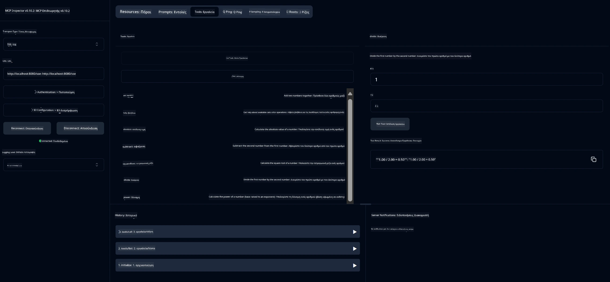

# Βασική Υπηρεσία Υπολογιστή MCP

> [!NOTE]
> Το δείγμα αυτό χρησιμοποιεί τη μεταφορά legacy HTTP+SSE και απευθύνεται σε ένα SDK συμβατό
> με MCP `2025-11-25`. Οι νέοι απομακρυσμένοι διακομιστές θα πρέπει να χρησιμοποιούν την υποστήριξη `2026-07-28` Streamable
> HTTP.

Αυτή η υπηρεσία παρέχει βασικές λειτουργίες υπολογιστή μέσω του Πρωτοκόλλου Πλαισίου Μοντέλου (MCP) χρησιμοποιώντας Spring Boot με μεταφορά WebFlux. Έχει σχεδιαστεί ως απλό παράδειγμα για αρχάριους που μαθαίνουν για υλοποιήσεις MCP.

Για περισσότερες πληροφορίες, δείτε την αναφορά εγχειριδίου [MCP Server Boot Starter](https://docs.spring.io/spring-ai/reference/api/mcp/mcp-server-boot-starter-docs.html).

## Επισκόπηση

Η υπηρεσία παρουσιάζει:
- Υποστήριξη για SSE (Server-Sent Events)
- Αυτόματη εγγραφή εργαλείων χρησιμοποιώντας τη σημείωση `@Tool` του Spring AI
- Βασικές λειτουργίες υπολογιστών:
  - Πρόσθεση, αφαίρεση, πολλαπλασιασμός, διαίρεση
  - Υπολογισμός δύναμης και τετραγωνική ρίζα
  - Υπολογισμός υπολοίπου (modulus) και απόλυτης τιμής
  - Συνάρτηση βοήθειας για περιγραφές λειτουργιών

## Χαρακτηριστικά

Αυτή η υπηρεσία υπολογιστή προσφέρει τις εξής δυνατότητες:

1. **Βασικές αριθμητικές λειτουργίες**:
   - Πρόσθεση δύο αριθμών
   - Αφαίρεση ενός αριθμού από έναν άλλο
   - Πολλαπλασιασμός δύο αριθμών
   - Διαίρεση ενός αριθμού με έναν άλλο (με έλεγχο διαίρεσης με το μηδέν)

2. **Προχωρημένες λειτουργίες**:
   - Υπολογισμός δύναμης (ανύψωση βάσης σε εκθέτη)
   - Υπολογισμός τετραγωνικής ρίζας (με έλεγχο αρνητικού αριθμού)
   - Υπολογισμός υπολοίπου (modulus)
   - Υπολογισμός απόλυτης τιμής

3. **Σύστημα βοήθειας**:
   - Ενσωματωμένη συνάρτηση βοήθειας που εξηγεί όλες τις διαθέσιμες λειτουργίες

## Χρήση της Υπηρεσίας

Η υπηρεσία εκθέτει τα ακόλουθα API endpoints μέσω του πρωτοκόλλου MCP:

- `add(a, b)`: Πρόσθεσε δύο αριθμούς
- `subtract(a, b)`: Αφαίρεσε τον δεύτερο αριθμό από τον πρώτο
- `multiply(a, b)`: Πολλαπλασίασε δύο αριθμούς
- `divide(a, b)`: Διαίρεσε τον πρώτο αριθμό με τον δεύτερο (με έλεγχο για μηδέν)
- `power(base, exponent)`: Υπολογισμός δύναμης ενός αριθμού
- `squareRoot(number)`: Υπολογισμός τετραγωνικής ρίζας (με έλεγχο αρνητικού αριθμού)
- `modulus(a, b)`: Υπολογισμός υπολοίπου διαίρεσης
- `absolute(number)`: Υπολογισμός απόλυτης τιμής
- `help()`: Λήψη πληροφοριών για διαθέσιμες λειτουργίες

## Πελατειακό Πρόγραμμα Δοκιμών

Ένας απλός πελάτης δοκιμών περιλαμβάνεται στο πακέτο `com.microsoft.mcp.sample.client`. Η κλάση `SampleCalculatorClient` δείχνει τις διαθέσιμες λειτουργίες της υπηρεσίας υπολογιστή.

## Χρήση του Πελάτη LangChain4j

Το έργο περιλαμβάνει ένα παράδειγμα πελάτη LangChain4j στο `com.microsoft.mcp.sample.client.LangChain4jClient` που δείχνει πώς να ενσωματώσετε την υπηρεσία υπολογιστή με LangChain4j και μοντέλα GitHub:

### Προαπαιτούμενα

1. **Ρύθμιση Token GitHub**:
   
   Για να χρησιμοποιήσετε τα μοντέλα τεχνητής νοημοσύνης του GitHub (όπως το phi-4), χρειάζεστε ένα προσωπικό token πρόσβασης GitHub:

   α. Μεταβείτε στις ρυθμίσεις λογαριασμού GitHub: https://github.com/settings/tokens
   
   β. Κάντε κλικ στο "Generate new token" → "Generate new token (classic)"
   
   γ. Δώστε στο token σας ένα περιγραφικό όνομα
   
   δ. Επιλέξτε τις εξής επιλογές:
      - `repo` (Πλήρης έλεγχος ιδιωτικών αποθετηρίων)
      - `read:org` (Ανάγνωση μελών οργανισμού και ομάδων, ανάγνωση έργων οργανισμού)
      - `gist` (Δημιουργία gists)
      - `user:email` (Πρόσβαση σε διευθύνσεις email χρήστη (μόνο ανάγνωση))
   
   ε. Κάντε κλικ στο "Generate token" και αντιγράψτε το νέο token
   
   στ. Ορίστε το ως μεταβλητή περιβάλλοντος:
      
      Σε Windows:
      ```
      set GITHUB_TOKEN=your-github-token
      ```
      
      Σε macOS/Linux:
      ```bash
      export GITHUB_TOKEN=your-github-token
      ```

   ζ. Για μόνιμη ρύθμιση, προσθέστε το στις μεταβλητές περιβάλλοντός σας μέσα από τις ρυθμίσεις συστήματος

2. Προσθέστε την εξάρτηση LangChain4j GitHub στο έργο σας (ήδη συμπεριλαμβάνεται στο pom.xml):
   ```xml
   <dependency>
       <groupId>dev.langchain4j</groupId>
       <artifactId>langchain4j-github</artifactId>
       <version>${langchain4j.version}</version>
   </dependency>
   ```

3. Βεβαιωθείτε ότι ο διακομιστής υπολογιστή τρέχει στο `localhost:8080`

### Εκτέλεση πελάτη LangChain4j

Αυτό το παράδειγμα δείχνει:
- Σύνδεση με τον διακομιστή MCP του υπολογιστή μέσω μεταφοράς SSE
- Χρήση του LangChain4j για τη δημιουργία chatbot που αξιοποιεί λειτουργίες υπολογιστή
- Ενσωμάτωση με μοντέλα AI GitHub (τώρα με το μοντέλο phi-4)

Ο πελάτης στέλνει τα ακόλουθα παραδείγματα ερωτημάτων για επίδειξη λειτουργικότητας:
1. Υπολογισμός αθροίσματος δύο αριθμών
2. Εύρεση τετραγωνικής ρίζας ενός αριθμού
3. Λήψη πληροφοριών βοήθειας για διαθέσιμες λειτουργίες υπολογιστή

Εκτελέστε το παράδειγμα και ελέγξτε το περιεχόμενο στην κονσόλα για να δείτε πώς το μοντέλο AI χρησιμοποιεί τα εργαλεία υπολογιστή για να απαντήσει στα ερωτήματα.

### Ρύθμιση Μοντέλου GitHub

Ο πελάτης LangChain4j έχει διαμορφωθεί να χρησιμοποιεί το μοντέλο phi-4 του GitHub με τις εξής ρυθμίσεις:

```java
ChatLanguageModel model = GitHubChatModel.builder()
    .apiKey(System.getenv("GITHUB_TOKEN"))
    .timeout(Duration.ofSeconds(60))
    .modelName("phi-4")
    .logRequests(true)
    .logResponses(true)
    .build();
```

Για να χρησιμοποιήσετε διαφορετικά μοντέλα GitHub, απλά αλλάξτε την παράμετρο `modelName` σε άλλο υποστηριζόμενο μοντέλο (π.χ., "claude-3-haiku-20240307", "llama-3-70b-8192", κλπ.).

## Εξαρτήσεις

Το έργο απαιτεί τις ακόλουθες βασικές εξαρτήσεις:

```xml
<!-- For MCP Server -->
<dependency>
    <groupId>org.springframework.ai</groupId>
    <artifactId>spring-ai-starter-mcp-server-webflux</artifactId>
</dependency>

<!-- For LangChain4j integration -->
<dependency>
    <groupId>dev.langchain4j</groupId>
    <artifactId>langchain4j-mcp</artifactId>
    <version>${langchain4j.version}</version>
</dependency>

<!-- For GitHub models support -->
<dependency>
    <groupId>dev.langchain4j</groupId>
    <artifactId>langchain4j-github</artifactId>
    <version>${langchain4j.version}</version>
</dependency>
```

## Κατασκευή του Έργου

Κατασκευάστε το έργο χρησιμοποιώντας Maven:
```bash
./mvnw clean install -DskipTests
```

## Εκτέλεση του Διακομιστή

### Χρήση Java

```bash
java -jar target/calculator-server-0.0.1-SNAPSHOT.jar
```

### Χρήση MCP Inspector

Ο MCP Inspector είναι ένα χρήσιμο εργαλείο για αλληλεπίδραση με υπηρεσίες MCP. Για να το χρησιμοποιήσετε με αυτήν την υπηρεσία υπολογιστή:

1. **Εγκαταστήστε και εκτελέστε το MCP Inspector** σε νέο παράθυρο τερματικού:
   ```bash
   npx @modelcontextprotocol/inspector
   ```

2. **Πρόσβαση στην web UI** κάνοντας κλικ στο URL που εμφανίζει η εφαρμογή (συνήθως http://localhost:6274)

3. **Διαμόρφωση σύνδεσης**:
   - Ορίστε τον τύπο μεταφοράς σε "SSE"
   - Ορίστε το URL στο endpoint SSE του τρέχοντος διακομιστή σας: `http://localhost:8080/sse`
   - Κάντε κλικ στο "Connect"

4. **Χρήση εργαλείων**:
   - Κάντε κλικ στο "List Tools" για να δείτε τις διαθέσιμες λειτουργίες υπολογιστή
   - Επιλέξτε ένα εργαλείο και κάντε κλικ στο "Run Tool" για να εκτελέσετε μια λειτουργία



### Χρήση Docker

Το έργο περιλαμβάνει ένα Dockerfile για κοντέινερ ανάπτυξης:

1. **Κατασκευή της εικόνας Docker**:
   ```bash
   docker build -t calculator-mcp-service .
   ```

2. **Εκτέλεση του κοντέινερ Docker**:
   ```bash
   docker run -p 8080:8080 calculator-mcp-service
   ```

Αυτό θα:
- Κατασκευάσει μια multi-stage εικόνα Docker με Maven 3.9.9 και Eclipse Temurin 24 JDK
- Δημιουργήσει μια βελτιστοποιημένη εικόνα κοντέινερ
- Ανοίξει την υπηρεσία στην πόρτα 8080
- Ξεκινήσει την υπηρεσία υπολογιστή MCP μέσα στο κοντέινερ

Θα έχετε πρόσβαση στην υπηρεσία στο `http://localhost:8080` μόλις το κοντέινερ είναι σε λειτουργία.

## Αντιμετώπιση Προβλημάτων

### Συνηθισμένα προβλήματα με το Token GitHub

1. **Προβλήματα δικαιωμάτων token**: Αν λάβετε σφάλμα 403 Forbidden, ελέγξτε αν το token σας έχει τα σωστά δικαιώματα όπως περιγράφονται στα προαπαιτούμενα.

2. **Το token δεν βρέθηκε**: Αν λάβετε σφάλμα "No API key found", βεβαιωθείτε ότι η μεταβλητή περιβάλλοντος GITHUB_TOKEN έχει οριστεί σωστά.

3. **Όρια ρυθμού (Rate Limiting)**: Η API του GitHub έχει όρια ρυθμού. Αν συναντήσετε σφάλμα ορίου ρυθμού (κωδικός κατάστασης 429), περιμένετε λίγα λεπτά πριν ξαναδοκιμάσετε.

4. **Λήξη ισχύος token**: Τα tokens GitHub μπορούν να λήξουν. Αν λάβετε σφάλματα αυθεντικοποίησης μετά από κάποιο διάστημα, δημιουργήστε νέο token και ενημερώστε τη μεταβλητή περιβάλλοντός σας.

Αν χρειάζεστε περαιτέρω βοήθεια, ελέγξτε την [τεκμηρίωση LangChain4j](https://github.com/langchain4j/langchain4j) ή την [τεκμηρίωση GitHub API](https://docs.github.com/en/rest).

---

<!-- CO-OP TRANSLATOR DISCLAIMER START -->
**Αποποίηση ευθυνών**:
Αυτό το έγγραφο έχει μεταφραστεί χρησιμοποιώντας την υπηρεσία μετάφρασης με τεχνητή νοημοσύνη [Co-op Translator](https://github.com/Azure/co-op-translator). Ενώ επιδιώκουμε την ακρίβεια, παρακαλούμε να έχετε υπόψη ότι οι αυτοματοποιημένες μεταφράσεις ενδέχεται να περιέχουν λάθη ή ανακρίβειες. Το πρωτότυπο έγγραφο στη μητρική του γλώσσα πρέπει να θεωρείται η αυθεντική πηγή. Για κρίσιμες πληροφορίες, συνιστάται επαγγελματική ανθρώπινη μετάφραση. Δεν φέρουμε ευθύνη για τυχόν παρεξηγήσεις ή λανθασμένες ερμηνείες που προκύπτουν από τη χρήση αυτής της μετάφρασης.
<!-- CO-OP TRANSLATOR DISCLAIMER END -->