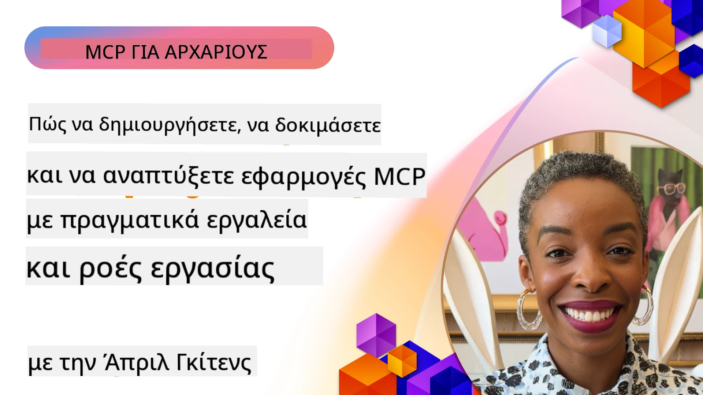
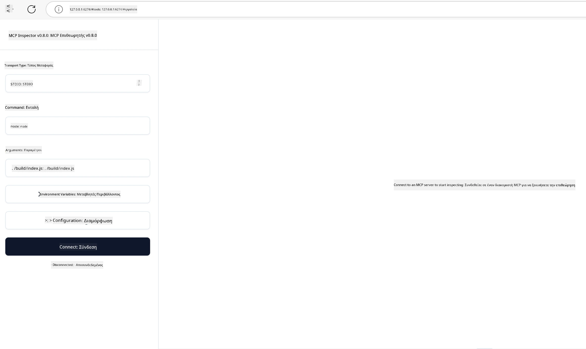

# Πρακτική Υλοποίηση

[](https://youtu.be/vCN9-mKBDfQ)

_(Κάντε κλικ στην εικόνα παραπάνω για να δείτε το βίντεο αυτού του μαθήματος)_

Η πρακτική υλοποίηση είναι όπου η δύναμη του Πρωτοκόλλου Πλαισίου Μοντέλου (MCP) γίνεται απτή. Ενώ η κατανόηση της θεωρίας και της αρχιτεκτονικής πίσω από το MCP είναι σημαντική, η πραγματική αξία προκύπτει όταν εφαρμόζετε αυτές τις έννοιες για να δημιουργήσετε, να δοκιμάσετε και να αναπτύξετε λύσεις που επιλύουν πραγματικά προβλήματα. Αυτό το κεφάλαιο γεφυρώνει το χάσμα μεταξύ της εννοιολογικής γνώσης και της πρακτικής ανάπτυξης, καθοδηγώντας σας στη διαδικασία ζωντανεύματος εφαρμογών βασισμένων σε MCP.

Είτε αναπτύσσετε ευφυείς βοηθούς, ενσωματώνετε τεχνητή νοημοσύνη σε επιχειρηματικές ροές εργασίας, είτε δημιουργείτε προσαρμοσμένα εργαλεία για επεξεργασία δεδομένων, το MCP παρέχει μια ευέλικτη βάση. Ο σχεδιασμός του που δεν εξαρτάται από τη γλώσσα και τα επίσημα SDK για δημοφιλείς γλώσσες προγραμματισμού το καθιστούν προσβάσιμο σε ευρύ φάσμα προγραμματιστών. Αξιοποιώντας αυτά τα SDK, μπορείτε γρήγορα να κάνετε πρωτότυπα, να επαναλάβετε και να κλιμακώσετε τις λύσεις σας σε διάφορες πλατφόρμες και περιβάλλοντα.

Στις ακόλουθες ενότητες θα βρείτε πρακτικά παραδείγματα, δείγματα κώδικα και στρατηγικές ανάπτυξης που δείχνουν πώς να υλοποιήσετε το MCP σε C#, Java με Spring, TypeScript, JavaScript και Python. Θα μάθετε επίσης πώς να αποσφαλματώνετε και να δοκιμάζετε τους MCP διακομιστές σας, να διαχειρίζεστε API και να αναπτύσσετε λύσεις στο cloud χρησιμοποιώντας το Azure. Αυτοί οι πρακτικοί πόροι έχουν σχεδιαστεί για να επιταχύνουν τη μάθησή σας και να σας βοηθήσουν να δημιουργήσετε με αυτοπεποίθηση στέρεες, έτοιμες για παραγωγή εφαρμογές MCP.

## Επισκόπηση

Αυτό το μάθημα εστιάζει σε πρακτικές πτυχές της υλοποίησης του MCP σε πολλές γλώσσες προγραμματισμού. Θα εξερευνήσουμε πώς να χρησιμοποιήσουμε τα MCP SDK σε C#, Java με Spring, TypeScript, JavaScript και Python για να δημιουργήσουμε ανθεκτικές εφαρμογές, να αποσφαλματώσουμε και να δοκιμάσουμε MCP διακομιστές, και να δημιουργήσουμε επαναχρησιμοποιήσιμους πόρους, προτροπές και εργαλεία.

## Μαθησιακοί Στόχοι

Στο τέλος αυτού του μαθήματος, θα μπορείτε να:

- Υλοποιήσετε λύσεις MCP χρησιμοποιώντας επίσημα SDK σε διάφορες γλώσσες προγραμματισμού
- Αποσφαλματώσετε και να δοκιμάσετε συστηματικά MCP διακομιστές
- Δημιουργήσετε και να χρησιμοποιήσετε λειτουργίες διακομιστή (Πόροι, Προτροπές και Εργαλεία)
- Σχεδιάσετε αποτελεσματικές ροές εργασίας MCP για σύνθετες εργασίες
- Βελτιστοποιήσετε υλοποιήσεις MCP για απόδοση και αξιοπιστία

## Επίσημοι Πόροι SDK

Το Πρωτόκολλο Πλαισίου Μοντέλου προσφέρει επίσημα SDK για πολλές γλώσσες (σύμφωνα με [Προδιαγραφή MCP 2025-11-25](https://spec.modelcontextprotocol.io/specification/2025-11-25/)):

- [C# SDK](https://github.com/modelcontextprotocol/csharp-sdk)
- [Java με Spring SDK](https://github.com/modelcontextprotocol/java-sdk) **Σημείωση:** απαιτεί εξάρτηση από [Project Reactor](https://projectreactor.io). (Δείτε [ζήτημα συζήτησης 246](https://github.com/orgs/modelcontextprotocol/discussions/246).)
- [TypeScript SDK](https://github.com/modelcontextprotocol/typescript-sdk)
- [Python SDK](https://github.com/modelcontextprotocol/python-sdk)
- [Kotlin SDK](https://github.com/modelcontextprotocol/kotlin-sdk)
- [Go SDK](https://github.com/modelcontextprotocol/go-sdk)

## Εργασία με τα MCP SDK

Αυτή η ενότητα παρέχει πρακτικά παραδείγματα υλοποίησης MCP σε πολλές γλώσσες προγραμματισμού. Μπορείτε να βρείτε δείγματα κώδικα στον φάκελο `samples` οργανωμένα ανά γλώσσα.

### Διαθέσιμα Δείγματα

Το αποθετήριο περιλαμβάνει [δείγματα υλοποίησης](../../../04-PracticalImplementation/samples) στις ακόλουθες γλώσσες:

- [C#](./samples/csharp/README.md)
- [Java με Spring](./samples/java/containerapp/README.md)
- [TypeScript](./samples/typescript/README.md)
- [JavaScript](./samples/javascript/README.md)
- [Python](./samples/python/README.md)

Κάθε δείγμα δείχνει βασικές έννοιες MCP και πρότυπα υλοποίησης για την συγκεκριμένη γλώσσα και οικοσύστημα.

### Πρακτικοί Οδηγοί

Επιπλέον οδηγοί για πρακτική υλοποίηση MCP:

- [Σελιδοποίηση και Μεγάλες Συλλογές Αποτελεσμάτων](./pagination/README.md) - Διαχείριση σελιδοποίησης με δείκτη για εργαλεία, πόρους και μεγάλες βάσεις δεδομένων

## Βασικά Χαρακτηριστικά Διακομιστή

Οι MCP διακομιστές μπορούν να υλοποιήσουν οποιονδήποτε συνδυασμό αυτών των χαρακτηριστικών:

### Πόροι

Οι πόροι παρέχουν πλαίσιο και δεδομένα για τον χρήστη ή το μοντέλο ΤΝ:

- Αποθετήρια εγγράφων
- Βάσεις γνώσης
- Δομημένες πηγές δεδομένων
- Συστήματα αρχείων

### Προτροπές

Οι προτροπές είναι προτύπα μηνυμάτων και ροών εργασίας για τους χρήστες:

- Προκαθορισμένα πρότυπα συνομιλίας
- Καθοδηγούμενα πρότυπα αλληλεπίδρασης
- Εξειδικευμένες δομές διαλόγου

### Εργαλεία

Τα εργαλεία είναι λειτουργίες που εκτελεί το μοντέλο ΤΝ:

- Εργαλεία επεξεργασίας δεδομένων
- Ενσωματώσεις εξωτερικών API
- Υπολογιστικές ικανότητες
- Λειτουργικότητα αναζήτησης

## Δείγματα Υλοποίησης: Υλοποίηση σε C#

Το επίσημο αποθετήριο C# SDK περιέχει διάφορα δείγματα υλοποίησης που παρουσιάζουν διαφορετικές πτυχές του MCP:

- **Βασικός Πελάτης MCP**: Απλό παράδειγμα που δείχνει πώς να δημιουργήσετε έναν πελάτη MCP και να καλέσετε εργαλεία
- **Βασικός Διακομιστής MCP**: Ελάχιστη υλοποίηση διακομιστή με βασική εγγραφή εργαλείων
- **Προηγμένος Διακομιστής MCP**: Πλήρως εξοπλισμένος διακομιστής με εγγραφή εργαλείων, αυθεντικοποίηση και διαχείριση σφαλμάτων
- **Ενσωμάτωση ASP.NET**: Παραδείγματα που δείχνουν ενσωμάτωση με ASP.NET Core
- **Πρότυπα Υλοποίησης Εργαλείων**: Διάφορα πρότυπα για υλοποίηση εργαλείων με διαφορετικά επίπεδα πολυπλοκότητας

Το MCP C# SDK βρίσκεται σε preview και τα APIs ενδέχεται να αλλάξουν. Θα ενημερώνουμε συνεχώς αυτό το ιστολόγιο καθώς εξελίσσεται το SDK.

### Βασικά Χαρακτηριστικά

- [C# MCP Nuget ModelContextProtocol](https://www.nuget.org/packages/ModelContextProtocol)
- Δημιουργία του [πρώτου MCP διακομιστή σας](https://devblogs.microsoft.com/dotnet/build-a-model-context-protocol-mcp-server-in-csharp/).

Για πλήρη δείγματα υλοποίησης σε C#, επισκεφθείτε το [επίσημο αποθετήριο δειγμάτων C# SDK](https://github.com/modelcontextprotocol/csharp-sdk)

## Δείγμα υλοποίησης: Υλοποίηση Java με Spring

Το SDK Java με Spring προσφέρει αξιόπιστες επιλογές υλοποίησης MCP με χαρακτηριστικά επιπέδου επιχείρησης.

### Βασικά Χαρακτηριστικά

- Ενσωμάτωση με Spring Framework
- Ισχυρή ασφάλεια τύπων
- Υποστήριξη αντιδραστικού προγραμματισμού
- Ολοκληρωμένη διαχείριση σφαλμάτων

Για πλήρες δείγμα υλοποίησης Java με Spring, δείτε το [δείγμα Java με Spring](samples/java/containerapp/README.md) στον φάκελο δειγμάτων.

## Δείγμα υλοποίησης: Υλοποίηση JavaScript

Το SDK JavaScript παρέχει μια ελαφριά και ευέλικτη προσέγγιση για υλοποίηση MCP.

### Βασικά Χαρακτηριστικά

- Υποστήριξη Node.js και προγράμματος περιήγησης
- API βασισμένο σε Promise
- Εύκολη ενσωμάτωση με Express και άλλα frameworks
- Υποστήριξη WebSocket για streaming

Για πλήρες δείγμα υλοποίησης JavaScript, δείτε το [δείγμα JavaScript](samples/javascript/README.md) στον φάκελο δειγμάτων.

## Δείγμα υλοποίησης: Υλοποίηση Python

Το SDK Python προσφέρει μια pythonική προσέγγιση στην υλοποίηση MCP με εξαιρετικές ενσωματώσεις σε ML frameworks.

### Βασικά Χαρακτηριστικά

- Υποστήριξη async/await με asyncio
- Ενσωμάτωση FastAPI
- Απλή εγγραφή εργαλείων
- Φυσική ενσωμάτωση με δημοφιλείς βιβλιοθήκες μηχανικής μάθησης

Για πλήρες δείγμα υλοποίησης Python, δείτε το [δείγμα Python](samples/python/README.md) στον φάκελο δειγμάτων.

## Διαχείριση API

Η Azure API Management είναι μια εξαιρετική λύση για το πώς μπορούμε να ασφαλίσουμε τους MCP διακομιστές. Η ιδέα είναι να τοποθετήσετε ένα Azure API Management instance μπροστά από τον MCP διακομιστή σας και να αφήσετε αυτό να διαχειρίζεται χαρακτηριστικά που πιθανόν να θέλετε, όπως:

- περιορισμός ρυθμού
- διαχείριση token
- παρακολούθηση
- ισορροπία φόρτου
- ασφάλεια

### Παράδειγμα Azure

Ορίστε ένα παράδειγμα Azure που κάνει ακριβώς αυτό, δηλαδή [δημιουργεί διακομιστή MCP και τον ασφαλίζει με Azure API Management](https://github.com/Azure-Samples/remote-mcp-apim-functions-python).

Δείτε πώς γίνεται η ροή εξουσιοδότησης στην παρακάτω εικόνα:


Στην παραπάνω εικόνα συμβαίνουν τα εξής:

- Η αυθεντικοποίηση/εξουσιοδότηση γίνεται χρησιμοποιώντας το Microsoft Entra.
- Η Azure API Management λειτουργεί ως πύλη και χρησιμοποιεί πολιτικές για να κατευθύνει και να διαχειρίζεται την κίνηση.
- Το Azure Monitor καταγράφει όλα τα αιτήματα για περαιτέρω ανάλυση.

#### Ροή Εξουσιοδότησης

Ας δούμε τη ροή εξουσιοδότησης με περισσότερες λεπτομέρειες:


#### Προδιαγραφή Εξουσιοδότησης MCP

Μάθετε περισσότερα για την [Προδιαγραφή Εξουσιοδότησης MCP](https://spec.modelcontextprotocol.io/specification/2025-11-25/basic/authorization/)

## Ανάπτυξη Απομακρυσμένου MCP Διακομιστή στο Azure

Ας δούμε αν μπορούμε να αναπτύξουμε το παράδειγμα που αναφέραμε προηγουμένως:

1. Κλωνοποιήστε το αποθετήριο

    ```bash
    git clone https://github.com/Azure-Samples/remote-mcp-apim-functions-python.git
    cd remote-mcp-apim-functions-python
    ```

1. Καταχωρίστε τον πάροχο πόρων `Microsoft.App`.

   - Αν χρησιμοποιείτε Azure CLI, τρέξτε `az provider register --namespace Microsoft.App --wait`.
   - Αν χρησιμοποιείτε Azure PowerShell, τρέξτε `Register-AzResourceProvider -ProviderNamespace Microsoft.App`. Στη συνέχεια τρέξτε `(Get-AzResourceProvider -ProviderNamespace Microsoft.App).RegistrationState` μετά από λίγο για να ελέγξετε αν η καταχώριση ολοκληρώθηκε.

1. Τρέξτε την εντολή [azd](https://aka.ms/azd) για να προετοιμάσετε την υπηρεσία διαχείρισης API, την εφαρμογή function (με τον κώδικα) και όλους τους άλλους απαιτούμενους πόρους του Azure

    ```shell
    azd up
    ```

    Αυτή η εντολή θα αναπτύξει όλους τους πόρους cloud στο Azure

### Δοκιμή του διακομιστή σας με MCP Inspector

1. Σε **νέο παράθυρο τερματικού**, εγκαταστήστε και τρέξτε το MCP Inspector

    ```shell
    npx @modelcontextprotocol/inspector
    ```

    Θα δείτε μια διεπαφή παρόμοια με:

    

1. Πατήστε CTRL και κάντε κλικ για να φορτώσετε την web εφαρμογή MCP Inspector από το URL που εμφανίζεται από την εφαρμογή (π.χ. [http://127.0.0.1:6274/#resources](http://127.0.0.1:6274/#resources))
1. Ορίστε τον τύπο μεταφοράς σε `SSE`
1. Θέστε το URL στο τρέχον endpoint SSE της διαχείρισης API που εμφανίζεται μετά την εντολή `azd up` και **Συνδεθείτε**:

    ```shell
    https://<apim-servicename-from-azd-output>.azure-api.net/mcp/sse
    ```

1. **Λίστα Εργαλείων**. Κάντε κλικ σε ένα εργαλείο και **Εκτελέστε το Εργαλείο**.

Αν όλα εξελίχθηκαν σωστά, τώρα θα είστε συνδεδεμένοι στον MCP διακομιστή και θα έχετε καταφέρει να καλέσετε ένα εργαλείο.

## MCP διακομιστές για Azure

[Remote-mcp-functions](https://github.com/Azure-Samples/remote-mcp-functions-dotnet): Αυτό το σύνολο αποθετηρίων είναι πρότυπο γρήγορης εκκίνησης για τη δημιουργία και ανάπτυξη προσαρμοσμένων απομακρυσμένων MCP (Model Context Protocol) διακομιστών χρησιμοποιώντας Azure Functions με Python, C# .NET ή Node/TypeScript.

Τα δείγματα παρέχουν μια ολοκληρωμένη λύση που επιτρέπει στους προγραμματιστές να:

- Δημιουργήσουν και να τρέξουν τοπικά: Αναπτύξτε και αποσφαλματώστε έναν MCP διακομιστή σε τοπικό μηχάνημα
- Αναπτύξουν στο Azure: Εύκολη ανάπτυξη στο cloud με μια απλή εντολή azd up
- Συνδεθούν από πελάτες: Συνδεθείτε στον MCP διακομιστή από διάφορους πελάτες περιλαμβανομένων του λειτουργικού τρόπου Copilot του VS Code και του εργαλείου MCP Inspector

### Βασικά Χαρακτηριστικά

- Ασφάλεια από σχεδιασμό: Ο MCP διακομιστής ασφαλίζεται με κλειδιά και HTTPS
- Επιλογές αυθεντικοποίησης: Υποστήριξη OAuth χρησιμοποιώντας ενσωματωμένη αυθεντικοποίηση και/ή API Management
- Απομόνωση δικτύου: Επιτρέπει απομόνωση δικτύου με χρήση Azure Virtual Networks (VNET)
- Αρχιτεκτονική χωρίς διακομιστή: Αξιοποιεί Azure Functions για επεκτάσιμη, βάσει γεγονότων εκτέλεση
- Τοπική ανάπτυξη: Ολοκληρωμένη υποστήριξη τοπικής ανάπτυξης και αποσφαλμάτωσης
- Απλή ανάπτυξη: Απλοποιημένη διαδικασία ανάπτυξης στο Azure

Το αποθετήριο περιλαμβάνει όλα τα απαραίτητα αρχεία διαμόρφωσης, πηγαίο κώδικα και ορισμούς υποδομής για γρήγορη έναρξη υλοποίησης MCP διακομιστή έτοιμου για παραγωγή.

- [Azure Remote MCP Functions Python](https://github.com/Azure-Samples/remote-mcp-functions-python) - Δείγμα υλοποίησης MCP χρησιμοποιώντας Azure Functions με Python

- [Azure Remote MCP Functions .NET](https://github.com/Azure-Samples/remote-mcp-functions-dotnet) - Δείγμα υλοποίησης MCP χρησιμοποιώντας Azure Functions με C# .NET

- [Azure Remote MCP Functions Node/Typescript](https://github.com/Azure-Samples/remote-mcp-functions-typescript) - Δείγμα υλοποίησης MCP χρησιμοποιώντας Azure Functions με Node/TypeScript.

## Βασικά Σημεία

- Τα MCP SDK προσφέρουν γλωσσικά εξειδικευμένα εργαλεία για υλοποίηση ανθεκτικών λύσεων MCP
- Η διαδικασία αποσφαλμάτωσης και δοκιμών είναι κρίσιμη για αξιόπιστες εφαρμογές MCP
- Τα επαναχρησιμοποιήσιμα πρότυπα προτροπών επιτρέπουν συνεπείς αλληλεπιδράσεις με ΤΝ
- Οι καλά σχεδιασμένες ροές εργασίας μπορούν να συντονίζουν σύνθετες εργασίες χρησιμοποιώντας πολλαπλά εργαλεία
- Η υλοποίηση λύσεων MCP απαιτεί προσοχή στην ασφάλεια, απόδοση και διαχείριση σφαλμάτων

## Άσκηση

Σχεδιάστε μια πρακτική ροή εργασίας MCP που αντιμετωπίζει ένα πραγματικό πρόβλημα στο πεδίο σας:

1. Εντοπίστε 3-4 εργαλεία που θα ήταν χρήσιμα για την επίλυση αυτού του προβλήματος
2. Δημιουργήστε ένα διάγραμμα ροής εργασίας που να δείχνει πώς αλληλεπιδρούν αυτά τα εργαλεία
3. Υλοποιήστε μια βασική έκδοση ενός από τα εργαλεία χρησιμοποιώντας την προτιμώμενη γλώσσα σας
4. Δημιουργήστε ένα πρότυπο προτροπής που θα βοηθήσει το μοντέλο να χρησιμοποιήσει αποτελεσματικά το εργαλείο σας

## Επιπλέον Πόροι

---

## Τι Ακολουθεί

Επόμενο: [Προχωρημένα Θέματα](../05-AdvancedTopics/README.md)

---

<!-- CO-OP TRANSLATOR DISCLAIMER START -->
**Αποποίηση ευθύνης**:  
Αυτό το έγγραφο έχει μεταφραστεί χρησιμοποιώντας την υπηρεσία μετάφρασης με τεχνητή νοημοσύνη [Co-op Translator](https://github.com/Azure/co-op-translator). Παρόλο που επιδιώκουμε την ακρίβεια, παρακαλούμε να σημειώσετε ότι οι αυτόματες μεταφράσεις ενδέχεται να περιέχουν λάθη ή ανακρίβειες. Το πρωτότυπο έγγραφο στη μητρική του γλώσσα πρέπει να θεωρείται η αυθεντική πηγή. Για κρίσιμες πληροφορίες, συνιστάται επαγγελματική ανθρώπινη μετάφραση. Δεν φέρουμε ευθύνη για τυχόν παρεξηγήσεις ή λανθασμένες ερμηνείες που προκύπτουν από τη χρήση αυτής της μετάφρασης.
<!-- CO-OP TRANSLATOR DISCLAIMER END -->