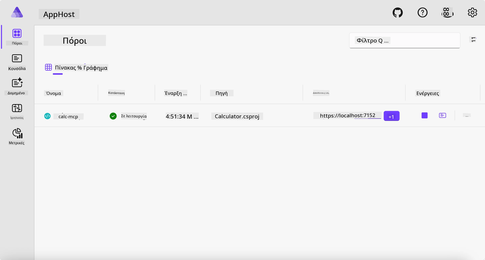
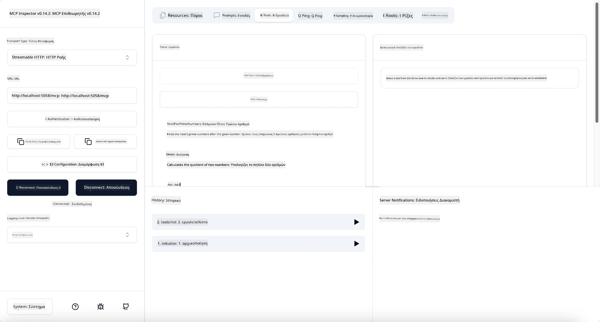

# Παράδειγμα

Το προηγούμενο παράδειγμα δείχνει πώς να χρησιμοποιήσετε ένα τοπικό έργο .NET με τον τύπο `stdio`. Και πώς να τρέξετε τον διακομιστή τοπικά σε ένα κοντέινερ. Αυτή είναι μια καλή λύση σε πολλές περιπτώσεις. Ωστόσο, μπορεί να είναι χρήσιμο να λειτουργεί ο διακομιστής απομακρυσμένα, όπως σε ένα περιβάλλον cloud. Εδώ έρχεται ο τύπος `http`.

Κοιτάζοντας τη λύση στον φάκελο `04-PracticalImplementation`, μπορεί να φαίνεται πολύ πιο σύνθετη από το προηγούμενο παράδειγμα. Αλλά στην πραγματικότητα, δεν είναι. Αν κοιτάξετε προσεκτικά το έργο `src/Calculator`, θα δείτε ότι είναι κατά κύριο λόγο ο ίδιος κώδικας με το προηγούμενο παράδειγμα. Η μόνη διαφορά είναι ότι χρησιμοποιούμε μια διαφορετική βιβλιοθήκη `ModelContextProtocol.AspNetCore` για την διαχείριση των αιτημάτων HTTP. Και αλλάζουμε τη μέθοδο `IsPrime` για να γίνει ιδιωτική, απλώς για να δείξουμε ότι μπορείτε να έχετε ιδιωτικές μεθόδους στον κώδικά σας. Ο υπόλοιπος κώδικας είναι ο ίδιος όπως πριν.

Τα άλλα έργα προέρχονται από το [Aspire](https://aspire.dev/get-started/what-is-aspire/). Η ενσωμάτωση του Aspire στη λύση θα βελτιώσει την εμπειρία του προγραμματιστή κατά την ανάπτυξη και τη δοκιμή και θα βοηθήσει στην παρατηρησιμότητα. Δεν είναι απαραίτητο για τη λειτουργία του διακομιστή, αλλά είναι μια καλή πρακτική να το έχετε στη λύση σας.

## Ξεκινήστε τον διακομιστή τοπικά

1. Από το VS Code (με την επέκταση C# DevKit), πλοηγηθείτε στον φάκελο `04-PracticalImplementation/samples/csharp`.
1. Εκτελέστε την ακόλουθη εντολή για να ξεκινήσετε τον διακομιστή:

   ```bash
    dotnet watch run --project ./src/AppHost
   ```

1. Όταν ένας φυλλομετρητής ανοίξει τον πίνακα ελέγχου Aspire, σημειώστε το URL `http`. Θα πρέπει να είναι κάτι σαν `http://localhost:5058/`.

   

## Δοκιμάστε το Streamable HTTP με το MCP Inspector

Εάν έχετε Node.js 22.7.5 ή υψηλότερη έκδοση, μπορείτε να χρησιμοποιήσετε το MCP Inspector για να δοκιμάσετε τον διακομιστή σας.

Ξεκινήστε τον διακομιστή και εκτελέστε την ακόλουθη εντολή σε ένα τερματικό:

```bash
npx @modelcontextprotocol/inspector http://localhost:5058
```



- Επιλέξτε το `Streamable HTTP` ως τύπο μεταφοράς.
- Στο πεδίο Url, εισάγετε το URL του διακομιστή που σημειώσατε προηγουμένως και προσθέστε `/mcp`. Θα πρέπει να είναι `http` (όχι `https`), κάτι σαν `http://localhost:5058/mcp`.
- Επιλέξτε το κουμπί Connect.

Ένα ωραίο πράγμα για τον Inspector είναι ότι παρέχει καλή ορατότητα σε όσα συμβαίνουν.

- Δοκιμάστε να εμφανίσετε τα διαθέσιμα εργαλεία
- Δοκιμάστε μερικά από αυτά, θα πρέπει να λειτουργούν όπως πριν.

## Δοκιμάστε τον MCP Server με το GitHub Copilot Chat στο VS Code

Για να χρησιμοποιήσετε τη μεταφορά Streamable HTTP με το GitHub Copilot Chat, αλλάξτε τη διαμόρφωση του διακομιστή `calc-mcp` που δημιουργήσατε προηγουμένως ώστε να μοιάζει έτσι:

```jsonc
// .vscode/mcp.json
{
  "servers": {
    "calc-mcp": {
      "type": "http",
      "url": "http://localhost:5058/mcp"
    }
  }
}
```

Κάντε μερικές δοκιμές:

- Ζητήστε "3 πρώτους αριθμούς μετά το 6780". Σημειώστε πώς ο Copilot θα χρησιμοποιήσει τα νέα εργαλεία `NextFivePrimeNumbers` και θα επιστρέψει μόνο τους πρώτους 3 πρώτους αριθμούς.
- Ζητήστε "7 πρώτους αριθμούς μετά το 111", για να δείτε τι συμβαίνει.
- Ζητήστε "Ο John έχει 24 γλειφιτζούρια και θέλει να τα μοιράσει όλα στα 3 παιδιά του. Πόσα γλειφιτζούρια έχει κάθε παιδί;", για να δείτε τι συμβαίνει.

## Αναπτύξτε τον διακομιστή στο Azure

Ας αναπτύξουμε τον διακομιστή στο Azure ώστε να τον χρησιμοποιούν περισσότεροι άνθρωποι.

Από ένα τερματικό, πλοηγηθείτε στον φάκελο `04-PracticalImplementation/samples/csharp` και εκτελέστε την ακόλουθη εντολή:

```bash
azd up
```

Μόλις ολοκληρωθεί η ανάπτυξη, θα πρέπει να δείτε ένα μήνυμα σαν αυτό:


Πάρτε το URL και χρησιμοποιήστε το στο MCP Inspector και στο GitHub Copilot Chat.

```jsonc
// .vscode/mcp.json
{
  "servers": {
    "calc-mcp": {
      "type": "http",
      "url": "https://calc-mcp.gentleriver-3977fbcf.australiaeast.azurecontainerapps.io/mcp"
    }
  }
}
```

## Τι ακολουθεί;

Δοκιμάσαμε διαφορετικούς τύπους μεταφοράς και εργαλεία δοκιμών. Επίσης αναπτύξαμε τον MCP διακομιστή σας στο Azure. Αλλά τι γίνεται αν ο διακομιστής μας χρειάζεται να έχει πρόσβαση σε ιδιωτικούς πόρους; Για παράδειγμα, μια βάση δεδομένων ή ένα ιδιωτικό API; Στο επόμενο κεφάλαιο, θα δούμε πώς μπορούμε να βελτιώσουμε την ασφάλεια του διακομιστή μας.

---

<!-- CO-OP TRANSLATOR DISCLAIMER START -->
**Αποποίηση ευθυνών**:
Αυτό το έγγραφο έχει μεταφραστεί χρησιμοποιώντας την υπηρεσία μετάφρασης με τεχνητή νοημοσύνη [Co-op Translator](https://github.com/Azure/co-op-translator). Ενώ επιδιώκουμε την ακρίβεια, παρακαλούμε να έχετε υπόψη ότι οι αυτοματοποιημένες μεταφράσεις ενδέχεται να περιέχουν λάθη ή ανακρίβειες. Το πρωτότυπο έγγραφο στη μητρική του γλώσσα πρέπει να θεωρείται η αυθεντική πηγή. Για κρίσιμες πληροφορίες, συνιστάται επαγγελματική ανθρώπινη μετάφραση. Δεν φέρουμε ευθύνη για τυχόν παρεξηγήσεις ή λανθασμένες ερμηνείες που προκύπτουν από τη χρήση αυτής της μετάφρασης.
<!-- CO-OP TRANSLATOR DISCLAIMER END -->