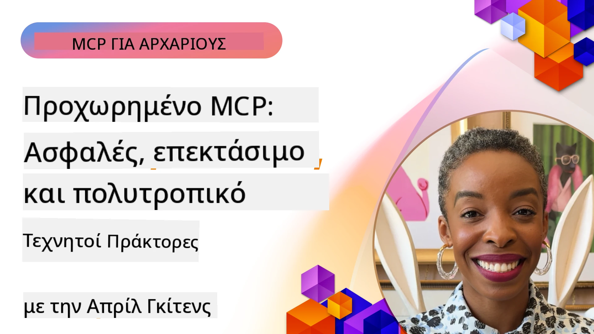

# Προχωρημένα Θέματα στο MCP

_(Κάντε κλικ στην παραπάνω εικόνα για να δείτε το βίντεο αυτού του μαθήματος)_

Αυτό το κεφάλαιο καλύπτει μια σειρά προχωρημένων θεμάτων στην υλοποίηση του Πρωτοκόλλου Πλαισίου Μοντέλου (MCP), συμπεριλαμβανομένης της πολυτροπικής ολοκλήρωσης, της επεκτασιμότητας, των βέλτιστων πρακτικών ασφάλειας και της ολοκλήρωσης επιχειρήσεων. Αυτά τα θέματα είναι σημαντικά για την κατασκευή στιβαρών και έτοιμων για παραγωγή εφαρμογών MCP που μπορούν να ανταποκριθούν στις απαιτήσεις των σύγχρονων συστημάτων AI.

## Επισκόπηση

Αυτό το μάθημα εξερευνά προχωρημένες έννοιες στην υλοποίηση του Πρωτοκόλλου Πλαισίου Μοντέλου, εστιάζοντας στην πολυτροπική ολοκλήρωση, την επεκτασιμότητα, τις βέλτιστες πρακτικές ασφάλειας και την ολοκλήρωση επιχειρήσεων. Αυτά τα θέματα είναι απαραίτητα για την κατασκευή εφαρμογών MCP παραγωγικού επιπέδου που μπορούν να χειριστούν σύνθετες απαιτήσεις σε επιχειρησιακά περιβάλλοντα.

> **Σημείωση τρέχουσας προδιαγραφής:** Το MCP `2026-07-28` αποσύρει τις ρίζες και
> τις πρωτόγονες λειτουργίες δειγματοληψίας που καλύπτονται στα μαθήματα 5.4 και 5.6. Μεταφέρει επίσης
> τη δοκιμαστική λειτουργία Εργασιών που αναφέρεται στα Χαρακτηριστικά Πρωτοκόλλου (5.16)
> σε μια αφιερωμένη επέκταση Εργασιών. Αυτά τα μαθήματα διατηρούνται για την κληρονομιά
> των υλοποιήσεων `2025-11-25` και περιλαμβάνουν οδηγίες μετανάστευσης. Δείτε
> [Τι άλλαξε στο MCP: Η προδιαγραφή 2026-07-28](../01-CoreConcepts/mcp-2026-07-28.md).

## Στόχοι Μάθησης

Στο τέλος αυτού του μαθήματος, θα μπορείτε να:

- Εφαρμόζετε δυνατότητες πολυτροπικότητας μέσα σε πλαίσια MCP
- Σχεδιάζετε επεκτάσιμες αρχιτεκτονικές MCP για σενάρια υψηλής ζήτησης
- Εφαρμόζετε βέλτιστες πρακτικές ασφάλειας σύμφωνα με τις αρχές ασφαλείας του MCP
- Ενσωματώνετε το MCP με επιχειρησιακά συστήματα και πλαίσια AI
- Βελτιστοποιείτε την απόδοση και την αξιοπιστία σε περιβάλλοντα παραγωγής

## Μαθήματα και δείγματα έργων

| Σύνδεσμος | Τίτλος | Περιγραφή |
|------|-------|-------------|
| [5.1 Integration with Azure](./mcp-integration/README.md) | Ενσωμάτωση με Azure | Μάθετε πώς να ενσωματώνετε τον MCP Server σας στο Azure |
| [5.2 Multi modal sample](./mcp-multi-modality/README.md) | Παραδείγματα MCP πολυτροπικότητας | Παραδείγματα για ήχο, εικόνα και πολυτροπικές απαντήσεις |
| [5.3 MCP OAuth2 sample](../../../05-AdvancedTopics/mcp-oauth2-demo) | Παραδειγματική εφαρμογή MCP OAuth2 | Ελάχιστη εφαρμογή Spring Boot που παρουσιάζει OAuth2 με MCP, τόσο ως Authorization όσο και ως Resource Server. Επιδεικνύει ασφαλή έκδοση token, προστατευόμενα endpoints, ανάπτυξη σε Azure Container Apps, και ολοκλήρωση με API Management. |
| [5.4 Root Contexts](./mcp-root-contexts/README.md) | Ρίζες contexts | Μάθετε το κληρονομημένο `2025-11-25` πρωτόγονο Roots και τις τρέχουσες επιλογές μετανάστευσης (αποσυρμένο στο `2026-07-28`) |
| [5.5 Routing](./mcp-routing/README.md) | Δρομολόγηση | Μάθετε διαφορετικούς τύπους δρομολόγησης |
| [5.6 Sampling](./mcp-sampling/README.md) | Δειγματοληψία | Μάθετε το κληρονομημένο `2025-11-25` πρωτόγονο Sampling και τις τρέχουσες επιλογές μετανάστευσης (αποσυρμένο στο `2026-07-28`) |
| [5.7 Scaling](./mcp-scaling/README.md) | Κλιμάκωση | Μάθετε για την κλιμάκωση |
| [5.8 Security](./mcp-security/README.md) | Ασφάλεια | Ασφαλίστε τον MCP Server σας |
| [5.9 Web Search sample](./web-search-mcp/README.md) | Αναζήτηση Διαδικτύου MCP | Python MCP server και client που ενσωματώνει το SerpAPI για αναζήτηση ιστοσελίδων, ειδήσεων, προϊόντων και ερωταπαντήσεων σε πραγματικό χρόνο. Επιδεικνύει πολυ-εργαλειακό συντονισμό, εξωτερική ενσωμάτωση API, και στιβαρό χειρισμό σφαλμάτων. |
| [5.10 Realtime Streaming](./mcp-realtimestreaming/README.md) | Ροή δεδομένων | Η ροή δεδομένων σε πραγματικό χρόνο έχει γίνει απαραίτητη στον σημερινό κόσμο που βασίζεται στα δεδομένα, όπου επιχειρήσεις και εφαρμογές απαιτούν άμεση πρόσβαση σε πληροφορίες για να λαμβάνουν έγκαιρες αποφάσεις.|
| [5.11 Realtime Web Search](./mcp-realtimesearch/README.md) | Αναζήτηση Διαδικτύου | Πώς το MCP μεταμορφώνει την αναζήτηση διαδικτύου σε πραγματικό χρόνο παρέχοντας μια τυποποιημένη προσέγγιση στη διαχείριση πλαισίου ανάμεσα σε μοντέλα AI, μηχανές αναζήτησης και εφαρμογές.| 
| [5.12  Entra ID Authentication for Model Context Protocol Servers](./mcp-security-entra/README.md) | Πιστοποίηση Entra ID | Το Microsoft Entra ID παρέχει μια στιβαρή λύση διαχείρισης ταυτότητας και πρόσβασης στο cloud, βοηθώντας να διασφαλιστεί ότι μόνο εξουσιοδοτημένοι χρήστες και εφαρμογές μπορούν να αλληλεπιδρούν με τον MCP server σας.|
| [5.13 Microsoft Foundry Agent Integration](./mcp-foundry-agent-integration/README.md) | Ενσωμάτωση Microsoft Foundry | Μάθετε πώς να ενσωματώνετε servers MCP με πράκτορες Microsoft Foundry, επιτρέποντας ισχυρό συντονισμό εργαλείων και επιχειρησιακές δυνατότητες AI με τυποποιημένες συνδέσεις εξωτερικών πηγών δεδομένων.|
| [5.14 Context Engineering](./mcp-contextengineering/README.md) | Μηχανική Πλαισίου | Η μελλοντική ευκαιρία των τεχνικών μηχανικής πλαισίου για servers MCP, συμπεριλαμβανομένης της βελτιστοποίησης πλαισίου, της δυναμικής διαχείρισης πλαισίου, και στρατηγικών για αποτελεσματικό prompt engineering εντός πλαισίων MCP.|
| [5.15 MCP Custom Transport](./mcp-transport/README.md) | Προσαρμοσμένη Μεταφορά | Μάθετε πώς να υλοποιείτε προσαρμοσμένους μηχανισμούς μεταφοράς για εξειδικευμένα σενάρια επικοινωνίας MCP.|
| [5.16 Protocol Features Deep Dive](./mcp-protocol-features/README.md) | Χαρακτηριστικά Πρωτοκόλλου | Κατακτήστε προχωρημένα χαρακτηριστικά πρωτοκόλλου όπως ειδοποιήσεις προόδου, ακύρωση αιτημάτων, πρότυπα πόρων, και πρότυπα χειρισμού σφαλμάτων.|
| [5.17 Adversarial Multi-Agent Reasoning](./mcp-adversarial-agents/README.md) | Αντιπαραθετικοί Πράκτορες | Χρησιμοποιήστε δύο πράκτορες με αντίθετες θέσεις, μοιράζοντας ένα μόνο σύνολο εργαλείων MCP, για να ανιχνεύσετε παραισθήσεις, να εντοπίσετε ακραίες περιπτώσεις, και να παράγετε καλύτερα βαθμονομημένα αποτελέσματα μέσω δομημένης αντιπαράθεσης.|

> **Ιστορική σημείωση `2025-11-25`:** αυτή η αναθεώρηση εισήγαγε πειραματικές
> Εργασίες και επέκτεινε αρκετά χαρακτηριστικά πρωτοκόλλου. Στο `2026-07-28`, οι Εργασίες μεταφέρθηκαν
> σε επίσημη επέκταση και οι Ρίζες αποσύρθηκαν. Μην χρησιμοποιείτε την
> κατάσταση λειτουργίας `2025-11-25` ως τρέχουσα οδηγία· δείτε το
> [ιστορικό αλλαγών 2026-07-28](https://modelcontextprotocol.io/specification/2026-07-28/changelog).

## Πρόσθετες Αναφορές

Για τις πιο ενημερωμένες πληροφορίες για προχωρημένα θέματα MCP, ανατρέξτε σε:
- [Τεκμηρίωση MCP](https://modelcontextprotocol.io/)
- [Προδιαγραφή MCP (2026-07-28)](https://modelcontextprotocol.io/specification/2026-07-28/)
- [Αποθετήριο GitHub](https://github.com/modelcontextprotocol)
- [OWASP MCP Top 10](https://microsoft.github.io/mcp-azure-security-guide/mcp/) - Κίνδυνοι ασφάλειας και μέτρα μετριασμού
- [Εργαστήριο Ασφάλειας MCP Σούμιτ (Sherpa)](https://azure-samples.github.io/sherpa/) - Πρακτική εκπαίδευση ασφαλείας

## Βασικά Σημεία

- Οι υλοποιήσεις MCP με πολυτροπικότητα επεκτείνουν τις δυνατότητες AI πέρα από την επεξεργασία κειμένου
- Η επεκτασιμότητα είναι απαραίτητη για επιχειρησιακές αναπτύξεις και μπορεί να αντιμετωπιστεί μέσω οριζόντιας και κάθετης κλιμάκωσης
- Περιεκτικά μέτρα ασφαλείας προστατεύουν τα δεδομένα και διασφαλίζουν σωστό έλεγχο πρόσβασης
- Η ολοκλήρωση επιχειρήσεων με πλατφόρμες όπως Azure OpenAI και Microsoft AI Foundry ενισχύει τις δυνατότητες MCP
- Οι προχωρημένες υλοποιήσεις MCP ωφελούνται από βελτιστοποιημένες αρχιτεκτονικές και προσεκτική διαχείριση πόρων

## Άσκηση

Σχεδιάστε μια επιχείρηση-επίπεδο υλοποίηση MCP για μια συγκεκριμένη χρήση:

1. Αναγνωρίστε τις πολυτροπικές απαιτήσεις για την περίπτωσή σας
2. Καθορίστε τους ελέγχους ασφάλειας που απαιτούνται για την προστασία ευαίσθητων δεδομένων
3. Σχεδιάστε μια επεκτάσιμη αρχιτεκτονική που μπορεί να χειριστεί μεταβαλλόμενο φορτίο
4. Σχεδιάστε σημεία ολοκλήρωσης με επιχειρησιακά συστήματα AI
5. Τεκμηριώστε πιθανά σημεία συμφόρησης στην απόδοση και στρατηγικές μετριασμού

## Πρόσθετοι Πόροι

- [Τεκμηρίωση Azure OpenAI](https://learn.microsoft.com/en-us/azure/ai-services/openai/)
- [Τεκμηρίωση Microsoft AI Foundry](https://learn.microsoft.com/en-us/ai-services/)

---

## Τι ακολουθεί

Εξερευνήστε τα μαθήματα αυτού του μονάδας ξεκινώντας με: [5.1 MCP Integration](./mcp-integration/README.md)

Μόλις ολοκληρώσετε αυτή τη μονάδα, συνεχίστε στο: [Μονάδα 6: Συνεισφορές Κοινότητας](../06-CommunityContributions/README.md)

---

<!-- CO-OP TRANSLATOR DISCLAIMER START -->
**Αποποίηση ευθυνών**:
Αυτό το έγγραφο έχει μεταφραστεί χρησιμοποιώντας την υπηρεσία μετάφρασης με τεχνητή νοημοσύνη [Co-op Translator](https://github.com/Azure/co-op-translator). Ενώ επιδιώκουμε την ακρίβεια, παρακαλούμε να έχετε υπόψη ότι οι αυτοματοποιημένες μεταφράσεις ενδέχεται να περιέχουν λάθη ή ανακρίβειες. Το πρωτότυπο έγγραφο στη μητρική του γλώσσα πρέπει να θεωρείται η αυθεντική πηγή. Για κρίσιμες πληροφορίες, συνιστάται επαγγελματική ανθρώπινη μετάφραση. Δεν φέρουμε ευθύνη για τυχόν παρεξηγήσεις ή λανθασμένες ερμηνείες που προκύπτουν από τη χρήση αυτής της μετάφρασης.
<!-- CO-OP TRANSLATOR DISCLAIMER END -->