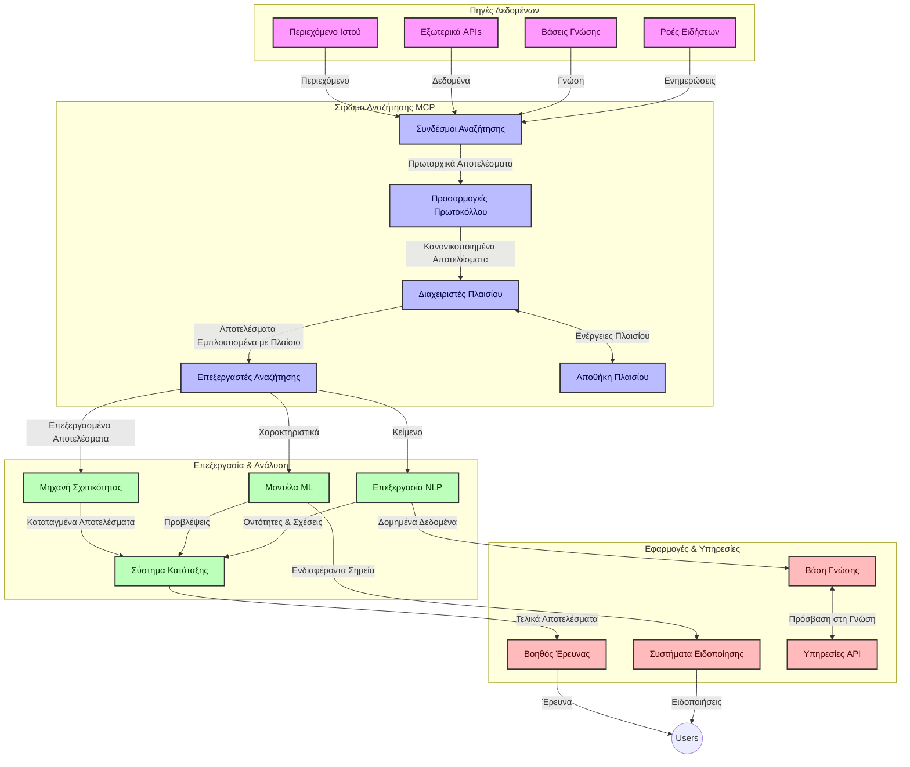
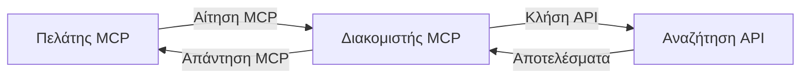
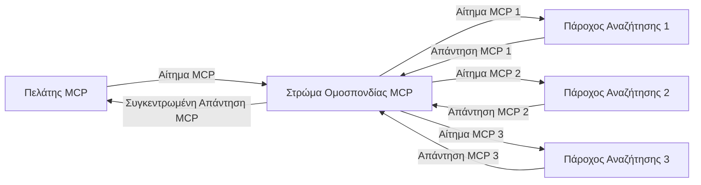
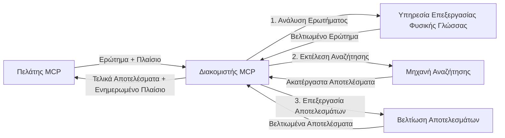

# Πρωτόκολλο Πλαισίου Μοντέλου για Αναζήτηση Ιστού σε Πραγματικό Χρόνο

## Επισκόπηση

Η αναζήτηση ιστού σε πραγματικό χρόνο έχει γίνει απαραίτητη στο σημερινό περιβάλλον που καθοδηγείται από την πληροφορία, όπου οι εφαρμογές χρειάζονται άμεση πρόσβαση σε ενημερωμένες πληροφορίες σε όλο το διαδίκτυο για να παρέχουν σχετικές και έγκαιρες απαντήσεις. Το Πρωτόκολλο Πλαισίου Μοντέλου (MCP) αντιπροσωπεύει μια σημαντική πρόοδο στην βελτιστοποίηση αυτών των διαδικασιών αναζήτησης σε πραγματικό χρόνο, βελτιώνοντας την αποδοτικότητα της αναζήτησης, διατηρώντας την ακεραιότητα του πλαισίου και βελτιώνοντας την συνολική απόδοση του συστήματος.

Αυτό το μονάδα εξερευνά πώς το MCP μετασχηματίζει την αναζήτηση ιστού σε πραγματικό χρόνο παρέχοντας μια τυποποιημένη προσέγγιση στη διαχείριση πλαισίου μεταξύ μοντέλων AI, μηχανών αναζήτησης και εφαρμογών.

### Τι Θα Μάθετε

Σε αυτόν τον ολοκληρωμένο οδηγό, θα ανακαλύψετε:

- Πώς το MCP δημιουργεί μια αδιάκοπη γέφυρα μεταξύ μοντέλων AI και δυνατοτήτων αναζήτησης ιστού σε πραγματικό χρόνο
- Αρχιτεκτονικές δομές για την υλοποίηση αποτελεσματικών και κλιμακώσιμων λύσεων αναζήτησης με MCP
- Τεχνικές για τη διατήρηση του πλαισίου αναζήτησης σε πολλαπλά ερωτήματα και αλληλεπιδράσεις
- Πρακτικές υλοποιήσεις κώδικα σε Python και JavaScript για διάφορα σενάρια αναζήτησης
- Μεθόδους για την ισορροπία μεταξύ σχετικότητας, επικαιρότητας και απόδοσης σε συστήματα αναζήτησης με MCP

## Εισαγωγή στην Αναζήτηση Ιστού σε Πραγματικό Χρόνο

Η αναζήτηση ιστού σε πραγματικό χρόνο είναι μια τεχνολογική προσέγγιση που επιτρέπει τη συνεχή εκτέλεση ερωτημάτων, την επεξεργασία και ανάλυση πληροφοριών που βασίζονται στο διαδίκτυο καθώς αυτές δημοσιεύονται ή ενημερώνονται, επιτρέποντας στα συστήματα να παρέχουν φρέσκες και σχετικές πληροφορίες με ελάχιστη καθυστέρηση. Αντιθέτως στα παραδοσιακά συστήματα αναζήτησης που λειτουργούν με ευρετηριασμένα δεδομένα που μπορεί να είναι παλιά ώρες ή ημέρες, η αναζήτηση σε πραγματικό χρόνο επεξεργάζεται ζωντανά δεδομένα από το διαδίκτυο, παρέχοντας πληροφορίες και δεδομένα που αντικατοπτρίζουν την τρέχουσα κατάσταση του διαδικτυακού περιεχομένου.

### Βασικές Έννοιες της Αναζήτησης Ιστού σε Πραγματικό Χρόνο:

- **Συνεχής Επεξεργασία Ερωτημάτων**: Τα ερωτήματα αναζήτησης επεξεργάζονται έναντι δεδομένων που ενημερώνονται συνεχώς
- **Προτεραιότητα στην Επικαιρότητα**: Τα συστήματα σχεδιάζονται να δίνουν προτεραιότητα στις φρέσκες πληροφορίες
- **Ισορροπία Σχετικότητας**: Διατήρηση ισορροπίας μεταξύ σχετικότητας και επικαιρότητας
- **Κλιμακούμενη Αρχιτεκτονική**: Τα συστήματα πρέπει να διαχειρίζονται μεταβαλλόμενα φορτία ερωτημάτων και όγκους δεδομένων
- **Κατανόηση Πλαισίου**: Η διατήρηση του πλαισίου χρήστη σε επαναλήψεις αναζήτησης είναι ουσιαστική για ουσιαστικά αποτελέσματα
- **Δυναμικός Ανασχηματισμός Ερωτημάτων**: Προσαρμογή των ερωτημάτων με βάση το πλαίσιο και τα προηγούμενα αποτελέσματα
- **Ενσωμάτωση Πολλαπλών Πηγών**: Συνδυασμός αποτελεσμάτων από πολλαπλούς παρόχους αναζήτησης και διαδικτυακές πηγές
- **Σημασιολογική Κατανόηση**: Επεξεργασία ερωτημάτων και περιεχομένου με βάση το νόημα και όχι μόνο τις λέξεις-κλειδιά
- **Κατάταξη σε Πραγματικό Χρόνο**: Συνεχής ρύθμιση της κατάταξης αποτελεσμάτων καθώς νέες πληροφορίες γίνονται διαθέσιμες

### Το Πρωτόκολλο Πλαισίου Μοντέλου και η Αναζήτηση Ιστού σε Πραγματικό Χρόνο

Το Πρωτόκολλο Πλαισίου Μοντέλου (MCP) αντιμετωπίζει πολλές κρίσιμες προκλήσεις σε περιβάλλοντα αναζήτησης ιστού σε πραγματικό χρόνο:

1. **Διατήρηση Πλαισίου Αναζήτησης**: Το MCP τυποποιεί τον τρόπο διατήρησης του πλαισίου σε διανεμημένα συστατικά αναζήτησης, εξασφαλίζοντας ότι τα μοντέλα AI και οι κόμβοι επεξεργασίας έχουν πρόσβαση σε σχετικό ιστορικό ερωτημάτων και προτιμήσεις χρηστών.

2. **Αποτελεσματική Διαχείριση Ερωτημάτων**: Παρέχοντας δομημένους μηχανισμούς για τη μετάδοση του πλαισίου, το MCP μειώνει το φόρτο της επανάληψης του πλαισίου σε κάθε επανάληψη αναζήτησης.

3. **Διαλειτουργικότητα**: Το MCP δημιουργεί μια κοινή γλώσσα για την ανταλλαγή πλαισίου μεταξύ διαφορετικών τεχνολογιών αναζήτησης και μοντέλων AI, επιτρέποντας πιο ευέλικτες και επεκτάσιμες αρχιτεκτονικές.

4. **Πλαίσιο Βελτιστοποιημένο για Αναζήτηση**: Οι υλοποιήσεις MCP μπορούν να δώσουν προτεραιότητα σε ποιες στοιχεία πλαισίου είναι πιο σχετικά για αποτελεσματική αναζήτηση, βελτιστοποιώντας τόσο την απόδοση όσο και την ακρίβεια.

5. **Προσαρμοστική Επεξεργασία Αναζήτησης**: Με κατάλληλη διαχείριση πλαισίου μέσω του MCP, τα συστήματα αναζήτησης μπορούν να προσαρμόζουν δυναμικά την επεξεργασία με βάση τις εξελισσόμενες ανάγκες του χρήστη και τα τοπία πληροφοριών.

Σε σύγχρονες εφαρμογές, από συγκέντρωση ειδήσεων έως βοηθούς έρευνας, η ενσωμάτωση του MCP με τις τεχνολογίες αναζήτησης ιστού επιτρέπει πιο έξυπνη, ενσυνείδητη αναζήτηση πλαισίου που μπορεί να παρέχει όλο και πιο σχετικά αποτελέσματα καθώς συνεχίζονται οι αλληλεπιδράσεις των χρηστών.

## Μαθησιακοί Στόχοι

Μέχρι το τέλος αυτού του μαθήματος, θα μπορείτε να:

- Κατανοήσετε τα βασικά της αναζήτησης ιστού σε πραγματικό χρόνο και τις προκλήσεις της σε σύγχρονες εφαρμογές
- Εξηγήσετε πώς το Πρωτόκολλο Πλαισίου Μοντέλου (MCP) βελτιώνει τις δυνατότητες αναζήτησης ιστού σε πραγματικό χρόνο
- Υλοποιήσετε λύσεις αναζήτησης βασισμένες σε MCP χρησιμοποιώντας δημοφιλή πλαίσια και API
- Σχεδιάσετε και να αναπτύξετε κλιμακούμενες, υψηλής απόδοσης αρχιτεκτονικές αναζήτησης με MCP
- Εφαρμόσετε έννοιες MCP σε διάφορες περιπτώσεις χρήσης, συμπεριλαμβανομένης της σημασιολογικής αναζήτησης, της βοήθειας έρευνας και της περιήγησης με υποστήριξη AI
- Αξιολογήσετε ανερχόμενες τάσεις και μελλοντικές καινοτομίες σε τεχνολογίες αναζήτησης με βάση το MCP
- Αναπτύξετε συστήματα αναζήτησης με επίγνωση πλαισίου που μαθαίνουν από τις αλληλεπιδράσεις των χρηστών
- Ενσωματώσετε δυνατότητες αναζήτησης ιστού σε βοηθούς AI χρησιμοποιώντας τυποποιημένα πρωτόκολλα MCP
- Δημιουργήσετε pipeline αναζήτησης πολλαπλών σταδίων που βελτιώνουν προοδευτικά τα αποτελέσματα με βάση το πλαίσιο
- Βελτιστοποιήσετε την απόδοση αναζήτησης διατηρώντας ταυτόχρονα ευρεία επίγνωση πλαισίου

### Ορισμός και Σημασία

Η αναζήτηση ιστού σε πραγματικό χρόνο περιλαμβάνει τη συνεχή εκτέλεση ερωτημάτων, την ανάκτηση και την παράδοση πληροφοριών διαδικτύου με ελάχιστη καθυστέρηση. Αντίθετα από τις παραδοσιακές μηχανές αναζήτησης που σαρώνουν και ευρετηριάζουν περιοδικά το διαδίκτυο, η αναζήτηση σε πραγματικό χρόνο στοχεύει στην εμφάνιση των πληροφοριών μόλις αυτές γίνουν διαθέσιμες, επιτρέποντας άμεση πρόσβαση στο πιο πρόσφατο περιεχόμενο.

Βασικά χαρακτηριστικά της αναζήτησης ιστού σε πραγματικό χρόνο περιλαμβάνουν:

- **Φρεσκάδα**: Προτεραιότητα στο πρόσφατο περιεχόμενο και ενημερώσεις
- **Συνεχής Επεξεργασία**: Συνεχής παρακολούθηση για νέες πληροφορίες
- **Προσαρμογή Ερωτημάτων**: Βελτίωση ερωτημάτων αναζήτησης με βάση το πλαίσιο και την ανατροφοδότηση
- **Άμεση Παράδοση**: Παροχή αποτελεσμάτων αναζήτησης με ελάχιστη καθυστέρηση
- **Διατήρηση Πλαισίου**: Βασιζόμενο σε προηγούμενα ερωτήματα για βελτιωμένη σχετικότητα

### Προκλήσεις στην Παραδοσιακή Αναζήτηση Ιστού

Οι παραδοσιακές προσεγγίσεις αναζήτησης ιστού αντιμετωπίζουν αρκετούς περιορισμούς όταν εφαρμόζονται σε σενάρια πραγματικού χρόνου:

1. **Κατακερματισμός Πλαισίου**: Δυσκολία στη διατήρηση του πλαισίου αναζήτησης σε πολλαπλά ερωτήματα
2. **Φρεσκάδα Πληροφορίας**: Προκλήσεις στην πρόσβαση και προτεραιότητα της πιο πρόσφατης πληροφορίας
3. **Πολυπλοκότητα Ενσωμάτωσης**: Προβλήματα διαλειτουργικότητας μεταξύ συστημάτων αναζήτησης και εφαρμογών
4. **Ζητήματα Καθυστέρησης**: Ισορροπία μεταξύ ολοκληρωμένης αναζήτησης και απαιτήσεων χρόνου απόκρισης
5. **Ρύθμιση Σχετικότητας**: Εξασφάλιση ακρίβειας και σχετικότητας ενώ δίνεται προτεραιότητα στην επικαιρότητα

## Κατανόηση του Πρωτοκόλλου Πλαισίου Μοντέλου (MCP) για Αναζήτηση

### Τι είναι το MCP σε Πλαίσια Αναζήτησης;

Το Πρωτόκολλο Πλαισίου Μοντέλου (MCP) είναι ένα τυποποιημένο πρωτόκολλο επικοινωνίας που σχεδιάστηκε για να διευκολύνει την αποδοτική αλληλεπίδραση μεταξύ μοντέλων AI και εφαρμογών. Στο πλαίσιο της αναζήτησης ιστού σε πραγματικό χρόνο, το MCP παρέχει ένα πλαίσιο για:

- Διατήρηση του πλαισίου αναζήτησης καθ’ όλη τη διάρκεια αλληλουχιών ερωτημάτων
- Τυποποίηση των μορφών αιτημάτων και αποτελεσμάτων αναζήτησης
- Βελτιστοποίηση της μετάδοσης παραμέτρων και αποτελεσμάτων αναζήτησης
- Ενίσχυση της επικοινωνίας μεταξύ μοντέλου και μηχανής αναζήτησης

### Βασικά Συστατικά και Αρχιτεκτονική

Η αρχιτεκτονική MCP για αναζήτηση ιστού σε πραγματικό χρόνο αποτελείται από αρκετά βασικά συστατικά:

1. **Διαχειριστές Πλαισίου Ερωτημάτων**: Διαχειρίζονται και διατηρούν το πλαίσιο αναζήτησης σε πολλαπλά ερωτήματα
2. **Επεξεργαστές Αναζήτησης**: Επεξεργάζονται τα εισερχόμενα αιτήματα αναζήτησης χρησιμοποιώντας τεχνικές ευαίσθητες στο πλαίσιο
3. **Πρωτοκολλικοί Προσαρμογείς**: Μετατρέπουν μεταξύ διαφορετικών API αναζήτησης διατηρώντας το πλαίσιο
4. **Αποθήκη Πλαισίου**: Αποθηκεύει και ανακτά αποτελεσματικά το ιστορικό αναζήτησης και τις προτιμήσεις
5. **Συνδέσμοι Αναζήτησης**: Συνδέονται με διάφορες μηχανές αναζήτησης και web APIs



### Πώς το MCP Βελτιώνει την Αναζήτηση Ιστού σε Πραγματικό Χρόνο

Το MCP αντιμετωπίζει τις παραδοσιακές προκλήσεις αναζήτησης ιστού μέσω:

- **Συνεχής Συνέχεια Πλαισίου**: Διατήρηση σχέσεων μεταξύ ερωτημάτων σε ολόκληρη τη συνεδρία αναζήτησης
- **Βελτιστοποιημένη Μετάδοση**: Μείωση της πλεονάζουσας πληροφορίας σε παραμέτρους αναζήτησης μέσω έξυπνης διαχείρισης πλαισίου
- **Τυποποιημένα Διεπαφές**: Παροχή συνεπών API για συστατικά αναζήτησης
- **Μειωμένη Καθυστέρηση**: Ελαχιστοποίηση του φόρτου επεξεργασίας μέσω αποδοτικής διαχείρισης πλαισίου
- **Ενισχυμένη Σχετικότητα**: Βελτίωση της σχετικότητας αναζήτησης διατηρώντας την πρόθεση χρήστη σε πολλαπλά ερωτήματα

## Ενσωμάτωση και Υλοποίηση

Τα συστήματα αναζήτησης ιστού σε πραγματικό χρόνο απαιτούν προσεκτικό σχεδιασμό αρχιτεκτονικής και υλοποίηση για να διατηρήσουν τόσο την απόδοση όσο και την ακεραιότητα του πλαισίου. Το Πρωτόκολλο Πλαισίου Μοντέλου προσφέρει μια τυποποιημένη προσέγγιση για την ενσωμάτωση μοντέλων AI και τεχνολογιών αναζήτησης, επιτρέποντας πιο εξελιγμένους, ευαίσθητους στο πλαίσιο, αγωγούς αναζήτησης.

### Επισκόπηση Ενσωμάτωσης MCP σε Αρχιτεκτονικές Αναζήτησης

Η υλοποίηση MCP σε περιβάλλοντα αναζήτησης ιστού σε πραγματικό χρόνο περιλαμβάνει αρκετές βασικές παραμέτρους:

1. **Σειριοποίηση Πλαισίου Αναζήτησης**: Το MCP παρέχει αποτελεσματικούς μηχανισμούς κωδικοποίησης πληροφοριών πλαισίου μέσα σε αιτήματα αναζήτησης, εξασφαλίζοντας ότι το ουσιώδες πλαίσιο ακολουθεί το ερώτημα σε ολόκληρη την επεξεργαστική αλυσίδα. Αυτό περιλαμβάνει τυποποιημένες μορφές σειριοποίησης βελτιστοποιημένες για μετα-δεδομένα σχετιζόμενα με την αναζήτηση.

2. **Κρατούμενη Πολιτεία Επεξεργασίας Αναζήτησης**: Το MCP επιτρέπει πιο έξυπνη επεξεργασία με διατήρηση κατάστασης διατηρώντας συνεπή αναπαράσταση πλαισίου σε πολλαπλές επαναλήψεις αναζήτησης. Αυτό είναι ιδιαίτερα πολύτιμο σε αγωγούς αναζήτησης πολλαπλών σταδίων όπου η βελτίωση του πλαισίου βελτιώνει τα αποτελέσματα.

3. **Επέκταση και Βελτίωση Ερωτημάτων**: Οι υλοποιήσεις MCP σε συστήματα αναζήτησης μπορούν να διευκολύνουν την εξελιγμένη επέκταση και βελτίωση των ερωτημάτων με βάση το συσσωρευμένο πλαίσιο, επιτρέποντας όλο και πιο σχετικά αποτελέσματα καθώς προχωρά η συνεδρία αναζήτησης.

4. **Caching Αποτελεσμάτων και Προτεραιοποίηση**: Μέσω της τυποποίησης της διαχείρισης πλαισίου, το MCP βοηθά στη διαχείριση αποθήκευσης μνήμης αποτελεσμάτων και στην προτεραιοποίηση, επιτρέποντας στα συστατικά να προσαρμόζονται βάσει του εξελισσόμενου πλαισίου αναζήτησης.

5. **Ομοσπονδία και Συγκέντρωση Αναζήτησης**: Το MCP διευκολύνει πιο εξελιγμένη ομοσπονδία αναζήτησης μεταξύ πολλαπλών backend παρέχοντας δομημένες αναπαραστάσεις του πλαισίου αναζήτησης, επιτρέποντας πιο ουσιαστική συγκέντρωση αποτελεσμάτων από διάφορες πηγές.

Η υλοποίηση του MCP σε διάφορες τεχνολογίες αναζήτησης δημιουργεί μια ενιαία προσέγγιση στη διαχείριση πλαισίου, μειώνοντας την ανάγκη για προσαρμοσμένο κώδικα ενσωμάτωσης ενώ ενισχύει την ικανότητα του συστήματος να διατηρεί ουσιαστικό πλαίσιο καθώς εξελίσσονται τα ερωτήματα αναζήτησης.

### MCP σε Διάφορες Υλοποιήσεις Αναζήτησης Ιστού

Αυτά τα παραδείγματα ακολουθούν τις τρέχουσες προδιαγραφές MCP που εστιάζουν σε ένα πρωτόκολλο βασισμένο σε JSON-RPC με διακριτούς μηχανισμούς μεταφοράς. Ο κώδικας δείχνει πώς μπορείτε να υλοποιήσετε προσαρμοσμένες ενσωματώσεις αναζήτησης διατηρώντας πλήρη συμβατότητα με το πρωτόκολλο MCP.


<details>
<summary>Υλοποίηση σε Python με Γενικό API Αναζήτησης</summary>

```python
import asyncio
import json
import aiohttp
from typing import Dict, Any, Optional, List
from contextlib import asynccontextmanager
from collections.abc import AsyncIterator

# Εισαγωγή τυπικών βιβλιοθηκών MCP
from mcp.client.session import ClientSession
from mcp.client.streamable_http import streamablehttp_client
from mcp.types import TextContent, CreateMessageRequestParams, CreateMessageResult
from mcp.server.fastmcp import FastMCP

# Δημιουργία διακομιστή FastMCP για αναζήτηση στο διαδίκτυο
search_server = FastMCP("WebSearch")

# Κλάση για διαχείριση λειτουργιών αναζήτησης στο διαδίκτυο
class WebSearchHandler:
    def __init__(self, api_endpoint: str, api_key: str):
        self.api_endpoint = api_endpoint
        self.api_key = api_key
        self.session = None
        
    async def initialize(self):
        """Initialize the HTTP session"""
        self.session = aiohttp.ClientSession(
            headers={"Authorization": f"Bearer {self.api_key}"}
        )
    
    async def close(self):
        """Close the HTTP session"""
        if self.session:
            await self.session.close()
            
    async def perform_search(self, query: str, max_results: int = 5, 
                           include_domains: List[str] = None, 
                           exclude_domains: List[str] = None,
                           time_period: str = "any") -> Dict[str, Any]:
        """Perform web search using the search API"""
        # Κατασκευή παραμέτρων αναζήτησης
        search_params = {
            "q": query,
            "limit": max_results,
            "time": time_period
        }
        
        if include_domains:
            search_params["site"] = ",".join(include_domains)
            
        if exclude_domains:
            search_params["exclude_site"] = ",".join(exclude_domains)
        
        # Εκτέλεση της αίτησης αναζήτησης
        try:
            async with self.session.get(
                self.api_endpoint,
                params=search_params
            ) as response:
                if response.status != 200:
                    error_text = await response.text()
                    raise Exception(f"Search API error: {response.status} - {error_text}")
                
                search_data = await response.json()
                
                # Μετατροπή της απόκρισης ειδικής για το API σε τυπική μορφή
                results = []
                for item in search_data.get("results", []):
                    results.append({
                        "title": item.get("title", ""),
                        "url": item.get("url", ""),
                        "snippet": item.get("snippet", ""),
                        "date": item.get("published_date", ""),
                        "source": item.get("source", "")
                    })
                
                return {
                    "query": query,
                    "totalResults": len(results),
                    "results": results
                }
        except Exception as e:
            print(f"Search API request error: {e}")
            raise

# Αρχικοποίηση του χειριστή αναζήτησης
search_handler = WebSearchHandler(
    api_endpoint="https://api.search-service.example/search",
    api_key="your-api-key-here"
)

# Ρύθμιση διάρκειας ζωής για διαχείριση του χειριστή αναζήτησης
@asyncio.asynccontextmanager
async def app_lifespan(server: FastMCP):
    """Manage application lifecycle"""
    await search_handler.initialize()
    try:
        yield {"search_handler": search_handler}
    finally:
        await search_handler.close()

# Ορισμός διάρκειας ζωής για τον διακομιστή
search_server = FastMCP("WebSearch", lifespan=app_lifespan)

# Καταχώριση εργαλείου αναζήτησης στο διαδίκτυο
@search_server.tool()
async def web_search(query: str, max_results: int = 5, 
                   include_domains: List[str] = None,
                   exclude_domains: List[str] = None,
                   time_period: str = "any") -> Dict[str, Any]:
    """
    Search the web for information
    
    Args:
        query: The search query
        max_results: Maximum number of results to return (default: 5)
        include_domains: List of domains to include in search results
        exclude_domains: List of domains to exclude from search results
        time_period: Time period for results ("day", "week", "month", "any")
        
    Returns:
        Dictionary containing search results
    """
    ctx = search_server.get_context()
    search_handler = ctx.request_context.lifespan_context["search_handler"]
    
    results = await search_handler.perform_search(
        query=query,
        max_results=max_results,
        include_domains=include_domains,
        exclude_domains=exclude_domains,
        time_period=time_period
    )
    
    return results

# Παράδειγμα χρήσης από τον πελάτη
async def client_example():
    # Σύνδεση με τον διακομιστή αναζήτησης χρησιμοποιώντας μεταφορά Streamable HTTP
    async with streamablehttp_client("http://localhost:8000/mcp") as (read, write, _):
        async with ClientSession(read, write) as session:
            # Αρχικοποίηση της σύνδεσης
            await session.initialize()
            
            # Κλήση του εργαλείου web_search
            search_results = await session.call_tool(
                "web_search", 
                {
                    "query": "latest developments in AI and Model Context Protocol",
                    "max_results": 5,
                    "time_period": "day",
                    "include_domains": ["github.com", "microsoft.com"]
                }
            )
            
            print(f"Search results: {search_results}")

# Παράδειγμα εκτέλεσης διακομιστή
if __name__ == "__main__":
    # Εκτέλεση του διακομιστή με μεταφορά Streamable HTTP
    search_server.run(transport="streamable-http")
```
</details> 

<details>
<summary>Υλοποίηση σε JavaScript με Αναζήτηση μέσω Browser</summary>


```javascript
// Υλοποίηση διακομιστή MCP για αναζήτηση στον Ιστό
import { McpServer, ResourceTemplate } from '@modelcontextprotocol/sdk/server/mcp.js';
import { StreamableHTTPServerTransport } from '@modelcontextprotocol/sdk/server/streamableHttp.js';
import { z } from 'zod';

// Δημιουργία διακομιστή MCP για αναζήτηση στον Ιστό
const searchServer = new McpServer({
    name: "BrowserSearch",
    description: "A server that provides web search capabilities"
});

// Κλάση υπηρεσίας αναζήτησης
class SearchService {
    constructor(searchApiUrl, apiKey) {
        this.searchApiUrl = searchApiUrl;
        this.apiKey = apiKey;
    }

    async performSearch(parameters) {
        const {
            query = '',
            maxResults = 5,
            includeDomains = [],
            excludeDomains = [],
            timePeriod = 'any'
        } = parameters;
        
        // Κατασκευή URL αναζήτησης με παραμέτρους
        const url = new URL(this.searchApiUrl);
        url.searchParams.append('q', query);
        url.searchParams.append('limit', maxResults);
        url.searchParams.append('time', timePeriod);
        
        if (includeDomains.length > 0) {
            url.searchParams.append('site', includeDomains.join(','));
        }
        
        if (excludeDomains.length > 0) {
            url.searchParams.append('exclude_site', excludeDomains.join(','));
        }
        
        try {
            const response = await fetch(url.toString(), {
                method: 'GET',
                headers: {
                    'Authorization': `Bearer ${this.apiKey}`,
                    'Content-Type': 'application/json'
                }
            });
            
            if (!response.ok) {
                const errorText = await response.text();
                throw new Error(`Search API error: ${response.status} - ${errorText}`);
            }
            
            const searchData = await response.json();
            
            // Μετατροπή της απόκρισης ειδικής για API σε τυπική μορφή
            const results = searchData.results?.map(item => ({
                title: item.title || '',
                url: item.url || '',
                snippet: item.snippet || '',
                date: item.published_date || '',
                source: item.source || ''
            })) || [];
            
            return {
                query,
                totalResults: results.length,
                results
            };
        } catch (error) {
            console.error('Search API request error:', error);
            throw error;
        }
    }
}

// Αρχικοποίηση της υπηρεσίας αναζήτησης
const searchService = new SearchService(
    'https://api.search-service.example/search',
    'your-api-key-here'
);

// Ρύθμιση του παρόχου περιβάλλοντος για τον διακομιστή
searchServer.setContextProvider(() => {
    return {
        searchService
    };
});

// Καταχώρηση εργαλείου αναζήτησης διαδικτύου
searchServer.tool({
    name: 'web_search',
    description: 'Search the web for information',
    parameters: {
        type: 'object',
        properties: {
            query: {
                type: 'string',
                description: 'The search query'
            },
            maxResults: {
                type: 'integer',
                description: 'Maximum number of results to return',
                default: 5
            },
            includeDomains: {
                type: 'array',
                items: { type: 'string' },
                description: 'List of domains to include in search results'
            },
            excludeDomains: {
                type: 'array',
                items: { type: 'string' },
                description: 'List of domains to exclude from search results'
            },
            timePeriod: {
                type: 'string',
                description: 'Time period for results',
                enum: ['day', 'week', 'month', 'any'],
                default: 'any'
            }
        },
        required: ['query']
    },
    handler: async (params, context) => {
        const { searchService } = context;
        return await searchService.performSearch(params);
    }
});

// Παράδειγμα κώδικα πελάτη για σύνδεση με τον διακομιστή αναζήτησης
import { Client } from '@modelcontextprotocol/sdk/client/index.js';
import { StreamableHTTPClientTransport } from '@modelcontextprotocol/sdk/client/streamableHttp.js';

async function connectToSearchServer() {
    // Σύνδεση με τον διακομιστή αναζήτησης
    const transport = new StreamableHTTPClientTransport(
        new URL('http://localhost:8000/mcp')
    );
    
    const client = new Client({
        name: 'search-client',
        version: '1.0.0'
    });
    
    await client.connect(transport);
    
    // Εκτέλεση του εργαλείου αναζήτησης
    const searchResults = await client.callTool({
        name: 'web_search',
        arguments: {
            query: 'Model Context Protocol implementation examples',
            maxResults: 10,
            timePeriod: 'week',
            includeDomains: ['github.com', 'docs.microsoft.com']
        }
    });
    
    console.log('Search results:', searchResults);
    
    // Καθαρισμός
    await client.disconnect();
}

// Εκκίνηση του διακομιστή
const transport = new StreamableHTTPServerTransport();
await searchServer.connect(transport);
console.log('Search server running at http://localhost:8000/mcp');

// Σε ξεχωριστή διεργασία ή μετά την εκκίνηση του διακομιστή
// connectToSearchServer().catch(console.error);
```
</details> 


## Δήλωση Αποποίησης Παραδειγμάτων Κώδικα

> **Σημαντική Σημείωση**: Τα παρακάτω παραδείγματα κώδικα επιδεικνύουν την ενσωμάτωση του Πρωτοκόλλου Πλαισίου Μοντέλου (MCP) με λειτουργίες αναζήτησης ιστού. Παρόλο που ακολουθούν τα πρότυπα και τις δομές των επίσημων SDK MCP, έχουν απλοποιηθεί για εκπαιδευτικούς σκοπούς.
> 
> Αυτά τα παραδείγματα παρουσιάζουν:
> 
> 1. **Υλοποίηση σε Python**: Μια υλοποίηση FastMCP server που παρέχει ένα εργαλείο αναζήτησης ιστού και συνδέεται με εξωτερικό API αναζήτησης. Αυτό το παράδειγμα δείχνει σωστή διαχείριση διάρκειας ζωής, διαχείριση πλαισίου, και υλοποίηση εργαλείων ακολουθώντας τα πρότυπα του [επίσημου MCP Python SDK](https://github.com/modelcontextprotocol/python-sdk). Ο server χρησιμοποιεί το συνιστώμενο Streamable HTTP transport που έχει αντικαταστήσει τον παλαιότερο SSE transport για παραγωγικές αναπτύξεις.
> 
> 2. **Υλοποίηση σε JavaScript**: Μια υλοποίηση TypeScript/JavaScript που χρησιμοποιεί το πρότυπο FastMCP από το [επίσημο MCP TypeScript SDK](https://github.com/modelcontextprotocol/typescript-sdk) για να δημιουργήσει έναν server αναζήτησης με σωστούς ορισμούς εργαλείων και συνδέσεις πελατών. Ακολουθεί τα τελευταία συνιστώμενα πρότυπα για διαχείριση συνεδριών και διατήρηση πλαισίου.
> 
> Αυτά τα παραδείγματα θα απαιτούσαν επιπλέον χειρισμό σφαλμάτων, αυθεντικοποίηση, και συγκεκριμένο κώδικα ενσωμάτωσης API για παραγωγική χρήση. Τα endpoints του API αναζήτησης που εμφανίζονται (`https://api.search-service.example/search`) είναι προσαρμογές και πρέπει να αντικατασταθούν με πραγματικά endpoints υπηρεσίας αναζήτησης.
> 
> Για πλήρεις λεπτομέρειες υλοποίησης και τις πιο ενημερωμένες προσεγγίσεις, παρακαλούμε ανατρέξτε στην [επίσημη προδιαγραφή MCP](https://spec.modelcontextprotocol.io/) και στη τεκμηρίωση SDK.

## Βασικές Έννοιες

### Το Πλαίσιο Πρωτοκόλλου Πλαισίου Μοντέλου (MCP)

Στον πυρήνα του, το Πρωτόκολλο Πλαισίου Μοντέλου παρέχει έναν τυποποιημένο τρόπο για τα μοντέλα AI, τις εφαρμογές και τις υπηρεσίες να ανταλλάσσουν πλαίσιο. Στην αναζήτηση ιστού σε πραγματικό χρόνο, αυτό το πλαίσιο είναι απαραίτητο για τη δημιουργία συνεκτικών, πολυβάθμιων εμπειριών αναζήτησης. Βασικά συστατικά περιλαμβάνουν:

1. **Αρχιτεκτονική Πελάτη-Εξυπηρετητή**: Το MCP καθιερώνει σαφή διαχωρισμό μεταξύ των πελατών αναζήτησης (αιτούντων) και των εξυπηρετητών αναζήτησης (παρόχων), επιτρέποντας ευέλικτα μοντέλα ανάπτυξης.

2. **Επικοινωνία JSON-RPC**: Το πρωτόκολλο χρησιμοποιεί JSON-RPC για ανταλλαγή μηνυμάτων, καθιστώντας το συμβατό με τεχνολογίες ιστού και εύκολο στην υλοποίηση σε διάφορες πλατφόρμες.

3. **Διαχείριση Πλαισίου**: Το MCP ορίζει δομημένες μεθόδους για τη διατήρηση, ενημέρωση και αξιοποίηση του πλαισίου αναζήτησης σε πολλαπλές αλληλεπιδράσεις.

4. **Ορισμοί Εργαλείων**: Οι δυνατότητες αναζήτησης εκτίθενται ως τυποποιημένα εργαλεία με καλά ορισμένες παραμέτρους και τιμές επιστροφής.

5. **Υποστήριξη Streaming**: Το πρωτόκολλο υποστηρίζει ροή αποτελεσμάτων, κρίσιμη για την αναζήτηση σε πραγματικό χρόνο όπου τα αποτελέσματα μπορεί να φτάνουν σταδιακά.

### Πρότυπα Ενσωμάτωσης Αναζήτησης Ιστού

Κατά την ενσωμάτωση του MCP με την αναζήτηση ιστού, προκύπτουν αρκετά πρότυπα:

#### 1. Άμεση Ενσωμάτωση Παρόχου Αναζήτησης



Σε αυτό το πρότυπο, ο server MCP αλληλεπιδρά απευθείας με ένα ή περισσότερα API αναζήτησης, μεταφράζοντας τα αιτήματα MCP σε κλήσεις συγκεκριμένου API και διαμορφώνοντας τα αποτελέσματα ως απαντήσεις MCP.

#### 2. Ομοσπονδιακή Αναζήτηση με Διατήρηση Πλαισίου



Αυτό το πρότυπο διανέμει τα ερωτήματα αναζήτησης σε πολλούς παρόχους αναζήτησης συμβατούς με MCP, κάθε ένας ενδεχομένως εξειδικευμένος σε διαφορετικού τύπου περιεχόμενο ή δυνατότητες αναζήτησης, διατηρώντας ενιαίο πλαίσιο.

#### 3. Αλυσίδα Αναζήτησης Με Ενισχυμένο Πλαίσιο



Σε αυτό το πρότυπο, η διαδικασία αναζήτησης διαιρείται σε πολλαπλά στάδια, με το πλαίσιο να εμπλουτίζεται σε κάθε βήμα, οδηγώντας σε προοδευτικά πιο σχετικά αποτελέσματα.

### Συστατικά Πλαισίου Αναζήτησης

Στην αναζήτηση ιστού βασισμένη στο MCP, το πλαίσιο συνήθως περιλαμβάνει:

- **Ιστορικό Ερωτημάτων**: Προηγούμενα ερωτήματα αναζήτησης στη συνεδρία
- **Προτιμήσεις Χρήστη**: Γλώσσα, περιοχή, ρυθμίσεις ασφαλούς αναζήτησης
- **Ιστορικό Αλληλεπίδρασης**: Ποια αποτελέσματα επιλέχθηκαν, χρόνος παραμονής στα αποτελέσματα
- **Παράμετροι Αναζήτησης**: Φίλτρα, ταξινομήσεις και άλλοι τροποποιητές αναζήτησης
- **Γνώση Τομέα**: Πλαίσιο ειδικού θέματος σχετικό με την αναζήτηση
- **Χρονικό Πλαίσιο**: Παράγοντες σχετικότητας βάσει χρόνου
- **Προτιμήσεις Πηγής**: Έμπιστα ή προτιμώμενα μέσα πληροφόρησης

## Περιπτώσεις Χρήσης και Εφαρμογές

### Έρευνα και Συλλογή Πληροφοριών

Το MCP βελτιώνει τις ροές εργασίας έρευνας μέσω:

- Διατήρησης πλαισίου έρευνας σε συνεδρίες αναζήτησης
- Δυνατοποίησης πιο προηγμένων και σχετικών ερωτημάτων πλαισίου
- Υποστήριξης ομοσπονδίας αναζήτησης από πολλαπλές πηγές
- Διευκόλυνσης εξαγωγής γνώσης από αποτελέσματα αναζήτησης

### Παρακολούθηση Ειδήσεων και Τάσεων σε Πραγματικό Χρόνο

Η αναζήτηση με υποστήριξη MCP προσφέρει πλεονεκτήματα για την παρακολούθηση ειδήσεων:

- Εύρεση ειδησεογραφικών γεγονότων σχεδόν σε πραγματικό χρόνο
- Φιλτράρισμα σχετικών πληροφοριών με βάση το πλαίσιο
- Παρακολούθηση θεμάτων και οντοτήτων σε πολλαπλές πηγές
- Εξατομικευμένες ειδοποιήσεις ειδήσεων βάσει πλαισίου χρήστη

### Περιήγηση και Έρευνα με Υποστήριξη AI

Το MCP δημιουργεί νέες δυνατότητες για περιήγηση με υποστήριξη AI:

- Συμβουλές αναζήτησης βάσει του τρέχοντος περιεχομένου του browser
- Αδιάκοπη ενσωμάτωση αναζήτησης ιστού με βοηθούς υποστηριζόμενους από LLM
- Πολυβάθμια βελτίωση αναζήτησης με διατηρούμενο πλαίσιο
- Ενισχυμένος έλεγχος και επαλήθευση πληροφοριών

## Μελλοντικές Τάσεις και Καινοτομίες

### Εξέλιξη του MCP στην Αναζήτηση Ιστού

Κοιτώντας μπροστά, αναμένουμε το MCP να εξελιχθεί για να αντιμετωπίσει:


- **Αναζήτηση Πολυτροπικού Τύπου**: Ενσωμάτωση αναζήτησης κειμένου, εικόνας, ήχου και βίντεο με διατήρηση του πλαισίου
- **Αποκεντρωμένη Αναζήτηση**: Υποστήριξη κατανεμημένων και ομοσπονδιακών οικοσυστημάτων αναζήτησης
- **Απόρρητο Αναζήτησης**: Μηχανισμοί αναζήτησης που διαφυλάσσουν το απόρρητο λαμβάνοντας υπόψη το πλαίσιο
- **Κατανόηση Ερωτημάτων**: Βαθιά σημασιολογική ανάλυση φυσικού γλωσσικού ερωτημάτων αναζήτησης

### Πιθανές Τεχνολογικές Εξελίξεις

Αναδυόμενες τεχνολογίες που θα διαμορφώσουν το μέλλον της αναζήτησης MCP:

1. **Νευρωνικές Αρχιτεκτονικές Αναζήτησης**: Συστήματα αναζήτησης βασισμένα σε ενσωματώσεις, βελτιστοποιημένα για MCP
2. **Εξατομικευμένο Πλαίσιο Αναζήτησης**: Μάθηση με μοτίβα αναζήτησης ατόμων με την πάροδο του χρόνου
3. **Ενσωμάτωση Γραφήματος Γνώσης**: Αναζήτηση με πλαίσιο, ενισχυμένη από γραφήματα γνώσης εξειδικευμένων τομέων
4. **Δια-λειτουργικό Πλαίσιο**: Διατήρηση του πλαισίου ανάμεσα σε διαφορετικές μορφές αναζήτησης

## Πρακτικές Ασκήσεις

### Άσκηση 1: Ρύθμιση Αρχικής Διαδικασίας Αναζήτησης MCP

Σε αυτή την άσκηση, θα μάθετε πώς να:
- Διαμορφώσετε ένα βασικό περιβάλλον αναζήτησης MCP
- Υλοποιήσετε διαχειριστές πλαισίου για αναζήτηση στο διαδίκτυο
- Δοκιμάσετε και να επικυρώσετε τη διατήρηση του πλαισίου κατά τις επαναλήψεις αναζήτησης

### Άσκηση 2: Δημιουργία Βοηθού Έρευνας με Αναζήτηση MCP

Δημιουργήστε μια ολοκληρωμένη εφαρμογή που:
- Επεξεργάζεται ερωτήματα έρευνας σε φυσική γλώσσα
- Πραγματοποιεί αναζητήσεις στο διαδίκτυο με επίγνωση του πλαισίου
- Συνθέτει πληροφορίες από πολλαπλές πηγές
- Παρουσιάζει οργανωμένα ευρήματα έρευνας

### Άσκηση 3: Υλοποίηση Ομοσπονδυμένης Αναζήτησης Πολλαπλών Πηγών με MCP

Προχωρημένη άσκηση που καλύπτει:
- Αποστολή ερωτημάτων με επίγνωση του πλαισίου σε πολλαπλές μηχανές αναζήτησης
- Ιεράρχηση και συλλογή αποτελεσμάτων
- Συγχώνευση αποτελεσμάτων με αποφυγή διπλοτυπιών βάσει πλαισίου
- Διαχείριση μεταδεδομένων ειδικών για κάθε πηγή

## Πρόσθετοι Πόροι

- [Προδιαγραφή Πρωτοκόλλου Model Context](https://spec.modelcontextprotocol.io/) - Επίσημη προδιαγραφή MCP και λεπτομερής τεκμηρίωση πρωτοκόλλου
- [Τεκμηρίωση Πρωτοκόλλου Model Context](https://modelcontextprotocol.io/) - Λεπτομερή εκπαιδευτικά υλικά και οδηγούς υλοποίησης
- [MCP Python SDK](https://github.com/modelcontextprotocol/python-sdk) - Επίσημη υλοποίηση του MCP πρωτοκόλλου σε Python
- [MCP TypeScript SDK](https://github.com/modelcontextprotocol/typescript-sdk) - Επίσημη υλοποίηση του MCP πρωτοκόλλου σε TypeScript
- [MCP Reference Servers](https://github.com/modelcontextprotocol/servers) - Αναφορικές υλοποιήσεις διακομιστών MCP
- [Τεκμηρίωση Bing Web Search API](https://learn.microsoft.com/en-us/bing/search-apis/bing-web-search/overview) - Το API αναζήτησης στο διαδίκτυο της Microsoft
- [Google Custom Search JSON API](https://developers.google.com/custom-search/v1/overview) - Προγραμματιζόμενη μηχανή αναζήτησης της Google
- [SerpAPI Τεκμηρίωση](https://serpapi.com/search-api) - API σελίδας αποτελεσμάτων μηχανών αναζήτησης
- [Meilisearch Τεκμηρίωση](https://www.meilisearch.com/docs) - Ανοιχτού κώδικα μηχανή αναζήτησης
- [Elasticsearch Τεκμηρίωση](https://www.elastic.co/guide/index.html) - Κατανεμημένη μηχανή αναζήτησης και αναλύσεων
- [LangChain Τεκμηρίωση](https://python.langchain.com/docs/get_started/introduction) - Δημιουργία εφαρμογών με LLMs

## Μαθησιακά Αποτελέσματα

Ολοκληρώνοντας αυτή τη μονάδα, θα είστε σε θέση να:

- Κατανοήσετε τις βασικές αρχές της άμεσης αναζήτησης στο διαδίκτυο και τις προκλήσεις της
- Εξηγήσετε πώς το Πρωτόκολλο Πλαισίου Μοντέλου (MCP) βελτιώνει τις δυνατότητες άμεσης αναζήτησης στο διαδίκτυο
- Υλοποιήσετε λύσεις αναζήτησης βασισμένες σε MCP χρησιμοποιώντας δημοφιλή πλαίσια και APIs
- Σχεδιάσετε και αναπτύξετε κλιμακούμενες, υψηλών επιδόσεων αρχιτεκτονικές αναζήτησης με MCP
- Εφαρμόσετε έννοιες MCP σε διάφορα σενάρια χρήσης, συμπεριλαμβανομένης της σημασιολογικής αναζήτησης, της βοήθειας έρευνας και της περιήγησης που ενισχύεται από AI
- Αξιολογήσετε τις αναδυόμενες τάσεις και τις μελλοντικές καινοτομίες στις τεχνολογίες αναζήτησης βασισμένες σε MCP


### Σκέψεις για Αξιοπιστία και Ασφάλεια

Κατά την υλοποίηση λύσεων αναζήτησης στο διαδίκτυο βασισμένων σε MCP, θυμηθείτε αυτές τις σημαντικές αρχές από την προδιαγραφή MCP:

1. **Συναίνεση και Έλεγχος Χρήστη**: Οι χρήστες πρέπει να συναινούν ρητά και να κατανοούν όλες τις προσβάσεις και λειτουργίες δεδομένων. Αυτό είναι ιδιαίτερα σημαντικό για υλοποιήσεις που ενδέχεται να έχουν πρόσβαση σε εξωτερικές πηγές δεδομένων.

2. **Απόρρητο Δεδομένων**: Εξασφαλίστε κατάλληλο χειρισμό των ερωτημάτων και των αποτελεσμάτων αναζήτησης, ειδικά όταν αυτά μπορεί να περιέχουν ευαίσθητες πληροφορίες. Υλοποιήστε κατάλληλους ελέγχους πρόσβασης για την προστασία των δεδομένων του χρήστη.

3. **Ασφάλεια Εργαλείων**: Υλοποιήστε σωστή εξουσιοδότηση και επικύρωση για τα εργαλεία αναζήτησης, καθώς αποτελούν πιθανές απειλές ασφαλείας μέσω αυθαίρετης εκτέλεσης κώδικα. Οι περιγραφές της συμπεριφοράς των εργαλείων θα πρέπει να θεωρούνται μη αξιόπιστες εκτός αν προέρχονται από αξιόπιστο διακομιστή.

4. **Καθαρή Τεκμηρίωση**: Παρέχετε σαφή τεκμηρίωση σχετικά με τις δυνατότητες, τους περιορισμούς και τις σκέψεις ασφάλειας της υλοποίησής σας βασισμένης σε MCP, ακολουθώντας τις οδηγίες υλοποίησης από την προδιαγραφή MCP.

5. **Αξιόπιστες Ροές Συναίνεσης**: Δημιουργήστε αξιόπιστες ροές συναίνεσης και εξουσιοδότησης που εξηγούν σαφώς τι κάνει κάθε εργαλείο πριν από την εξουσιοδότησή του, ειδικά για εργαλεία που αλληλεπιδρούν με εξωτερικούς πόρους διαδικτύου.

Για πλήρεις λεπτομέρειες σχετικά με την ασφάλεια και τις σκέψεις αξιοπιστίας του MCP, ανατρέξτε στην [επίσημη τεκμηρίωση](https://modelcontextprotocol.io/specification/2025-11-25/basic/security_best_practices).

## Τι ακολουθεί

- [5.12 Έλεγχος Ταυτότητας Entra ID για Model Context Protocol Servers](../mcp-security-entra/README.md)

---

<!-- CO-OP TRANSLATOR DISCLAIMER START -->
**Αποποίηση ευθυνών**:
Αυτό το έγγραφο έχει μεταφραστεί χρησιμοποιώντας την υπηρεσία μετάφρασης με τεχνητή νοημοσύνη [Co-op Translator](https://github.com/Azure/co-op-translator). Ενώ επιδιώκουμε την ακρίβεια, παρακαλούμε να έχετε υπόψη ότι οι αυτοματοποιημένες μεταφράσεις ενδέχεται να περιέχουν λάθη ή ανακρίβειες. Το πρωτότυπο έγγραφο στη μητρική του γλώσσα πρέπει να θεωρείται η αυθεντική πηγή. Για κρίσιμες πληροφορίες, συνιστάται επαγγελματική ανθρώπινη μετάφραση. Δεν φέρουμε ευθύνη για τυχόν παρεξηγήσεις ή λανθασμένες ερμηνείες που προκύπτουν από τη χρήση αυτής της μετάφρασης.
<!-- CO-OP TRANSLATOR DISCLAIMER END -->