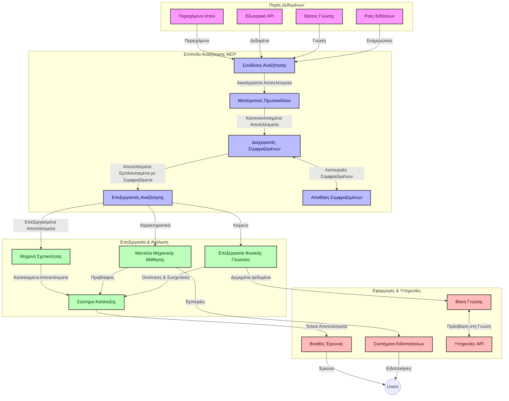

# Πρωτόκολλο Πλαισίου Μοντέλου για Αναζήτηση Ιστού σε Πραγματικό Χρόνο

## Επισκόπηση

Η αναζήτηση ιστού σε πραγματικό χρόνο έχει γίνει απαραίτητη στο σύγχρονο περιβάλλον που βασίζεται στην πληροφόρηση, όπου οι εφαρμογές χρειάζονται άμεση πρόσβαση σε ενημερωμένες πληροφορίες από το διαδίκτυο για να παρέχουν σχετικές και έγκαιρες απαντήσεις. Το Πρωτόκολλο Πλαισίου Μοντέλου (MCP) αποτελεί σημαντική πρόοδο στην βελτιστοποίηση αυτών των διαδικασιών αναζήτησης σε πραγματικό χρόνο, ενισχύοντας την αποδοτικότητα της αναζήτησης, διατηρώντας την ακεραιότητα του πλαισίου και βελτιώνοντας τη συνολική απόδοση του συστήματος.

Αυτό το module εξερευνά πώς το MCP μετασχηματίζει την αναζήτηση ιστού σε πραγματικό χρόνο παρέχοντας μια τυποποιημένη προσέγγιση στη διαχείριση πλαισίου ανάμεσα σε μοντέλα AI, μηχανές αναζήτησης και εφαρμογές.

### Τι θα μάθετε

Σε αυτόν τον ολοκληρωμένο οδηγό, θα ανακαλύψετε:

- Πώς το MCP δημιουργεί μια απρόσκοπτη γέφυρα μεταξύ μοντέλων AI και δυνατοτήτων αναζήτησης ιστού σε πραγματικό χρόνο
- Αρχιτεκτονικά μοτίβα για την υλοποίηση αποδοτικών και επεκτάσιμων λύσεων αναζήτησης με MCP
- Τεχνικές για τη διατήρηση του πλαισίου αναζήτησης σε πολλαπλά ερωτήματα και αλληλεπιδράσεις
- Πρακτικές υλοποιήσεις κώδικα σε Python και JavaScript για διάφορα σενάρια αναζήτησης
- Μεθόδους ισορροπίας μεταξύ σχετικότητας, επικαιρότητας και απόδοσης σε συστήματα αναζήτησης με MCP

## Εισαγωγή στην Αναζήτηση Ιστού σε Πραγματικό Χρόνο

Η αναζήτηση ιστού σε πραγματικό χρόνο είναι μια τεχνολογική προσέγγιση που επιτρέπει τη συνεχή υποβολή ερωτημάτων, επεξεργασία και ανάλυση πληροφοριών που βασίζονται στον ιστό καθώς δημοσιεύονται ή ενημερώνονται, επιτρέποντας στα συστήματα να παρέχουν φρέσκες και σχετικές πληροφορίες με ελάχιστη καθυστέρηση. Σε αντίθεση με τα παραδοσιακά συστήματα αναζήτησης που λειτουργούν σε ευρετηριασμένα δεδομένα που μπορεί να είναι παλιά ώρες ή μέρες, οι διαδικασίες αναζήτησης σε πραγματικό χρόνο επεξεργάζονται ζωντανά δεδομένα από τον ιστό, παρέχοντας πληροφορίες και δεδομένα που αντικατοπτρίζουν την τρέχουσα κατάσταση του περιεχομένου στο διαδίκτυο.

### Βασικές Έννοιες της Αναζήτησης Ιστού σε Πραγματικό Χρόνο:

- **Συνεχής Επεξεργασία Ερωτημάτων**: Τα ερωτήματα αναζήτησης επεξεργάζονται σε συνεχώς ανανεούμενες πηγές δεδομένων
- **Προτεραιότητα στην Επικαιρότητα**: Τα συστήματα σχεδιάζονται για να δίνουν προτεραιότητα στις φρέσκες πληροφορίες
- **Ισορροπία Σχετικότητας**: Διατήρηση ισορροπίας μεταξύ σχετικότητας και επικαιρότητας
- **Επεκτάσιμη Αρχιτεκτονική**: Τα συστήματα πρέπει να χειρίζονται μεταβαλλόμενα φορτία ερωτημάτων και όγκο δεδομένων
- **Κατανόηση Πλαισίου**: Η διατήρηση του πλαισίου χρήστη σε επαναλήψεις αναζήτησης είναι κρίσιμη για ουσιαστικά αποτελέσματα
- **Δυναμική Αναδιατύπωση Ερωτημάτων**: Προσαρμοστική τροποποίηση των ερωτημάτων βάσει πλαισίου και προηγούμενων αποτελεσμάτων
- **Ενσωμάτωση Πολλαπλών Πηγών**: Συνδυασμός αποτελεσμάτων από πολλαπλούς παρόχους αναζήτησης και πηγές web
- **Σημασιολογική Κατανόηση**: Επεξεργασία ερωτημάτων και περιεχομένου βάσει νοήματος και όχι μόνο λέξεων-κλειδιών
- **Κατάταξη σε Πραγματικό Χρόνο**: Συνεχής ρύθμιση της κατάταξης των αποτελεσμάτων καθώς νέες πληροφορίες γίνονται διαθέσιμες

### Το Πρωτόκολλο Πλαισίου Μοντέλου και η Αναζήτηση Ιστού σε Πραγματικό Χρόνο

Το Πρωτόκολλο Πλαισίου Μοντέλου (MCP) αντιμετωπίζει αρκετές κρίσιμες προκλήσεις στο περιβάλλον της αναζήτησης ιστού σε πραγματικό χρόνο:

1. **Διατήρηση Πλαισίου Αναζήτησης**: Το MCP τυποποιεί τον τρόπο που διατηρείται το πλαίσιο μεταξύ διανεμημένων συνιστωσών αναζήτησης, εξασφαλίζοντας ότι τα μοντέλα AI και οι κόμβοι επεξεργασίας έχουν πρόσβαση σε σχετικό ιστορικό ερωτημάτων και προτιμήσεις χρήστη.

2. **Αποτελεσματική Διαχείριση Ερωτημάτων**: Παρέχοντας δομημένους μηχανισμούς για μετάδοση πλαισίου, το MCP μειώνει το φόρτο της επανάληψης του πλαισίου σε κάθε επανάληψη αναζήτησης.

3. **Διαλειτουργικότητα**: Το MCP δημιουργεί μια κοινή γλώσσα για την ανταλλαγή πλαισίου μεταξύ ποικίλων τεχνολογιών αναζήτησης και μοντέλων AI, επιτρέποντας πιο ευέλικτες και επεκτάσιμες αρχιτεκτονικές.

4. **Βελτιστοποιημένο Πλαίσιο για Αναζήτηση**: Οι υλοποιήσεις MCP μπορούν να προτεραιοποιήσουν ποια στοιχεία πλαισίου είναι πιο σχετικά για αποτελεσματική αναζήτηση, βελτιστοποιώντας τόσο την απόδοση όσο και την ακρίβεια.

5. **Προσαρμοστική Επεξεργασία Αναζήτησης**: Με σωστή διαχείριση πλαισίου μέσω MCP, τα συστήματα αναζήτησης μπορούν να προσαρμόζουν δυναμικά την επεξεργασία βασισμένοι στις εξελισσόμενες ανάγκες του χρήστη και το τοπίο πληροφοριών.

Σε σύγχρονες εφαρμογές που κυμαίνονται από συγκέντρωση ειδήσεων μέχρι βοηθούς έρευνας, η ενσωμάτωση του MCP με τις τεχνολογίες αναζήτησης ιστού επιτρέπει πιο έξυπνη, πλαισιο-ενημερωμένη αναζήτηση που μπορεί να παρέχει όλο και πιο σχετικά αποτελέσματα καθώς συνεχίζονται οι αλληλεπιδράσεις χρήστη.

## Στόχοι Μάθησης

Μέχρι το τέλος αυτού του μαθήματος, θα μπορείτε να:

- Κατανοήσετε τα βασικά της αναζήτησης ιστού σε πραγματικό χρόνο και τις προκλήσεις της σε σύγχρονες εφαρμογές
- Εξηγήσετε πώς το Πρωτόκολλο Πλαισίου Μοντέλου (MCP) ενισχύει τις δυνατότητες αναζήτησης ιστού σε πραγματικό χρόνο
- Υλοποιήσετε λύσεις αναζήτησης βασισμένες σε MCP χρησιμοποιώντας δημοφιλή πλαίσια και APIs
- Σχεδιάσετε και αναπτύξετε επεκτάσιμες, υψηλής απόδοσης αρχιτεκτονικές αναζήτησης με MCP
- Εφαρμόσετε τις έννοιες MCP σε διάφορες περιπτώσεις χρήσης που περιλαμβάνουν σημασιολογική αναζήτηση, υποστήριξη έρευνας και περιήγηση ενισχυμένη από AI
- Αξιολογήσετε αναδυόμενες τάσεις και μελλοντικές καινοτομίες στις τεχνολογίες αναζήτησης με βάση το MCP
- Αναπτύξετε συστήματα αναζήτησης με επίγνωση πλαισίου που μαθαίνουν από αλληλεπιδράσεις χρηστών
- Ενσωματώσετε δυνατότητες αναζήτησης ιστού σε βοηθούς AI χρησιμοποιώντας τυποποιημένα πρωτόκολλα MCP
- Δημιουργήσετε πολυσταδιακές γραμμές αναζήτησης που βελτιώνουν προοδευτικά τα αποτελέσματα με βάση το πλαίσιο
- Βελτιστοποιήσετε την απόδοση της αναζήτησης διατηρώντας πλήρη επίγνωση του πλαισίου

### Ορισμός και Σημασία

Η αναζήτηση ιστού σε πραγματικό χρόνο περιλαμβάνει τη συνεχή υποβολή ερωτημάτων, ανάκτηση και παράδοση πληροφοριών βασισμένων στον ιστό με ελάχιστη καθυστέρηση. Σε αντίθεση με τις παραδοσιακές μηχανές αναζήτησης που συλλέγουν περιοδικά και ευρετηριάζουν τον ιστό, η αναζήτηση σε πραγματικό χρόνο στοχεύει να εμφανίζει πληροφορίες μόλις γίνουν διαθέσιμες, επιτρέποντας άμεση πρόσβαση στο πιο ενημερωμένο περιεχόμενο.

Κύρια χαρακτηριστικά της αναζήτησης ιστού σε πραγματικό χρόνο περιλαμβάνουν:

- **Φρεσκάδα**: Προτεραιότητα στο πιο πρόσφατο περιεχόμενο και ενημερώσεις
- **Συνεχής Επεξεργασία**: Συνεχής παρακολούθηση για νέες πληροφορίες
- **Προσαρμογή Ερωτημάτων**: Βελτίωση των ερωτημάτων αναζήτησης με βάση το πλαίσιο και τις ανατροφοδοτήσεις
- **Άμεση Παράδοση**: Παροχή αποτελεσμάτων αναζήτησης με ελάχιστη καθυστέρηση
- **Διατήρηση Πλαισίου**: Ανάπτυξη πάνω σε προηγούμενα ερωτήματα για βελτιωμένη σχετικότητα

### Προκλήσεις στην Παραδοσιακή Αναζήτηση Ιστού

Οι παραδοσιακές προσεγγίσεις αναζήτησης ιστού αντιμετωπίζουν αρκετούς περιορισμούς όταν εφαρμόζονται σε σενάρια πραγματικού χρόνου:

1. **Κατάτμηση Πλαισίου**: Δυσκολία στη διατήρηση του πλαισίου αναζήτησης σε πολλαπλά ερωτήματα
2. **Επικαιρότητα Πληροφορίας**: Προκλήσεις στο να έχει πρόσβαση και να δίνει προτεραιότητα στην πιο πρόσφατη πληροφορία
3. **Πολυπλοκότητα Ενσωμάτωσης**: Προβλήματα διαλειτουργικότητας μεταξύ συστημάτων αναζήτησης και εφαρμογών
4. **Θέματα Καθυστέρησης**: Ισορροπία μεταξύ ολοκληρωμένης αναζήτησης και απαιτήσεων χρόνου απόκρισης
5. **Ρύθμιση Σχετικότητας**: Διασφάλιση ακρίβειας και σχετικότητας ενώ δίνεται προτεραιότητα στην επικαιρότητα

## Κατανόηση του Πρωτοκόλλου Πλαισίου Μοντέλου (MCP) για Αναζήτηση

### Τι είναι το MCP σε Πλαίσια Αναζήτησης;

Το Πρωτόκολλο Πλαισίου Μοντέλου (MCP) είναι ένα τυποποιημένο πρωτόκολλο επικοινωνίας σχεδιασμένο για να διευκολύνει αποδοτική αλληλεπίδραση μεταξύ μοντέλων AI και εφαρμογών. Στο πλαίσιο της αναζήτησης ιστού σε πραγματικό χρόνο, το MCP παρέχει ένα πλαίσιο για:

- Διατήρηση του πλαισίου αναζήτησης σε όλη τη διαδοχή των ερωτημάτων
- Τυποποίηση των φορμάτ των ερωτημάτων αναζήτησης και των αποτελεσμάτων
- Βελτιστοποίηση της μετάδοσης παραμέτρων και αποτελεσμάτων αναζήτησης
- Ενίσχυση της επικοινωνίας μεταξύ μοντέλου και μηχανής αναζήτησης

### Κύρια Στοιχεία και Αρχιτεκτονική

Η αρχιτεκτονική MCP για αναζήτηση ιστού σε πραγματικό χρόνο αποτελείται από αρκετά βασικά στοιχεία:

1. **Διαχειριστές Πλαισίου Ερωτήματος**: Διαχειρίζονται και διατηρούν το πλαίσιο αναζήτησης σε πολλαπλά ερωτήματα
2. **Επεξεργαστές Αναζήτησης**: Επεξεργάζονται αιτήματα αναζήτησης χρησιμοποιώντας τεχνικές με επίγνωση πλαισίου
3. **Πρωτόκολλα Προσαρμογείς**: Μετατρέπουν μεταξύ διαφορετικών API αναζήτησης διατηρώντας το πλαίσιο
4. **Αποθήκη Πλαισίου**: Αποθηκεύει και ανακτά αποδοτικά το ιστορικό αναζήτησης και τις προτιμήσεις
5. **Συνδέσεις Αναζήτησης**: Συνδέεται με διάφορες μηχανές αναζήτησης και web APIs



### Πώς το MCP Βελτιώνει την Αναζήτηση Ιστού σε Πραγματικό Χρόνο

Το MCP αντιμετωπίζει τις παραδοσιακές προκλήσεις αναζήτησης ιστού μέσω:

- **Συνεχής Πλαίσιο**: Διατήρηση των σχέσεων μεταξύ ερωτημάτων καθ’ όλη τη διάρκεια της συνεδρίας αναζήτησης
- **Βελτιστοποιημένη Μετάδοση**: Μείωση πλεονασμών στις παραμέτρους αναζήτησης μέσω ευφυούς διαχείρισης πλαισίου
- **Τυποποιημένες Διεπαφές**: Παροχή συνεπών APIs για τα στοιχεία αναζήτησης
- **Μειωμένη Καθυστέρηση**: Ελαχιστοποίηση του φόρτου επεξεργασίας μέσω αποδοτικής διαχείρισης πλαισίου
- **Ενισχυμένη Σχετικότητα**: Βελτίωση της σχετικότητας αναζήτησης διατηρώντας την πρόθεση του χρήστη σε πολλαπλά ερωτήματα

## Ενσωμάτωση και Υλοποίηση

Τα συστήματα αναζήτησης ιστού σε πραγματικό χρόνο απαιτούν προσεκτικό σχεδιασμό αρχιτεκτονικής και υλοποίηση για να διατηρήσουν τόσο την απόδοση όσο και την ακεραιότητα του πλαισίου. Το Πρωτόκολλο Πλαισίου Μοντέλου προσφέρει μια τυποποιημένη προσέγγιση για την ενσωμάτωση μοντέλων AI και τεχνολογιών αναζήτησης, επιτρέποντας πιο προηγμένες, με επίγνωση πλαισίου, ροές αναζήτησης.

### Επισκόπηση Ενσωμάτωσης MCP σε Αρχιτεκτονικές Αναζήτησης

Η εφαρμογή του MCP σε περιβάλλοντα αναζήτησης ιστού σε πραγματικό χρόνο περιλαμβάνει αρκετές βασικές παραμέτρους:

1. **Σειριοποίηση Πλαισίου Αναζήτησης**: Το MCP παρέχει αποδοτικούς μηχανισμούς κωδικοποίησης πληροφοριών πλαισίου μέσα σε αιτήματα αναζήτησης, εξασφαλίζοντας ότι το απαραίτητο πλαίσιο ακολουθεί το ερώτημα καθ’ όλη τη ροή επεξεργασίας. Αυτό περιλαμβάνει τυποποιημένα φορμάτ σειριοποίησης βελτιστοποιημένα για μεταδεδομένα σχετιζόμενα με αναζήτηση.

2. **Καταστάσεις Επεξεργασίας Αναζήτησης**: Το MCP επιτρέπει πιο έξυπνη επεξεργασία με διατήρηση κατάστασης μέσω συνεπούς αναπαράστασης πλαισίου σε επαναλήψεις αναζήτησης. Αυτό είναι ιδιαίτερα χρήσιμο σε πολυσταδιακές ροές αναζήτησης όπου η βελτίωση του πλαισίου οδηγεί σε καλύτερα αποτελέσματα.

3. **Επέκταση και Βελτίωση Ερωτημάτων**: Οι υλοποιήσεις MCP σε συστήματα αναζήτησης μπορούν να διευκολύνουν προηγμένη επέκταση και βελτίωση των ερωτημάτων βάσει συσσωρευμένου πλαισίου, επιτρέποντας όλο και πιο σχετικά αποτελέσματα καθώς προχωρά η συνεδρία αναζήτησης.

4. **Κρυφή Μνήμη Αποτελεσμάτων και Προτεραιότητα**: Με την τυποποίηση της διαχείρισης πλαισίου, το MCP βοηθά στη διαχείριση της κρυφής μνήμης και της προτεραιοποίησης αποτελεσμάτων, επιτρέποντας στα στοιχεία να προσαρμόζονται με βάση το εξελισσόμενο πλαίσιο αναζήτησης.

5. **Ομοσπονδία και Συγκέντρωση Αναζήτησης**: Το MCP διευκολύνει πιο προηγμένη ομοσπονδία αναζήτησης σε πολλαπλούς πίσω κομμάτια παρέχοντας δομημένες αναπαραστάσεις πλαισίου αναζήτησης, επιτρέποντας πιο ουσιαστική συγκέντρωση αποτελεσμάτων από διαφορετικές πηγές.

Η υλοποίηση του MCP σε διάφορες τεχνολογίες αναζήτησης δημιουργεί μια ενιαία προσέγγιση στη διαχείριση πλαισίου, μειώνοντας την ανάγκη για προσαρμοσμένο κώδικα ενσωμάτωσης ενώ ενισχύει την ικανότητα του συστήματος να διατηρεί ουσιαστικό πλαίσιο καθώς εξελίσσονται τα ερωτήματα αναζήτησης.

### MCP σε Διάφορες Υλοποιήσεις Αναζήτησης Ιστού

Αυτά τα παραδείγματα ακολουθούν την τρέχουσα προδιαγραφή MCP που εστιάζει σε ένα πρωτόκολλο βασισμένο σε JSON-RPC με διακριτούς μηχανισμούς μεταφοράς. Ο κώδικας δείχνει πώς μπορείτε να υλοποιήσετε προσαρμοσμένες ενσωματώσεις αναζήτησης ενώ διατηρείτε πλήρη συμβατότητα με το πρωτόκολλο MCP.


<details>
<summary>Υλοποίηση σε Python με Γενικό API Αναζήτησης</summary>

```python
import asyncio
import json
import aiohttp
from typing import Dict, Any, Optional, List
from contextlib import asynccontextmanager
from collections.abc import AsyncIterator

# Εισαγωγή βασικών βιβλιοθηκών MCP
from mcp.client.session import ClientSession
from mcp.client.streamable_http import streamablehttp_client
from mcp.types import TextContent, CreateMessageRequestParams, CreateMessageResult
from mcp.server.fastmcp import FastMCP

# Δημιουργία διακομιστή FastMCP για αναζήτηση στον ιστό
search_server = FastMCP("WebSearch")

# Κλάση για τη διαχείριση λειτουργιών αναζήτησης στον ιστό
class WebSearchHandler:
    def __init__(self, api_endpoint: str, api_key: str):
        self.api_endpoint = api_endpoint
        self.api_key = api_key
        self.session = None
        
    async def initialize(self):
        """Initialize the HTTP session"""
        self.session = aiohttp.ClientSession(
            headers={"Authorization": f"Bearer {self.api_key}"}
        )
    
    async def close(self):
        """Close the HTTP session"""
        if self.session:
            await self.session.close()
            
    async def perform_search(self, query: str, max_results: int = 5, 
                           include_domains: List[str] = None, 
                           exclude_domains: List[str] = None,
                           time_period: str = "any") -> Dict[str, Any]:
        """Perform web search using the search API"""
        # Κατασκευή παραμέτρων αναζήτησης
        search_params = {
            "q": query,
            "limit": max_results,
            "time": time_period
        }
        
        if include_domains:
            search_params["site"] = ",".join(include_domains)
            
        if exclude_domains:
            search_params["exclude_site"] = ",".join(exclude_domains)
        
        # Εκτέλεση του αιτήματος αναζήτησης
        try:
            async with self.session.get(
                self.api_endpoint,
                params=search_params
            ) as response:
                if response.status != 200:
                    error_text = await response.text()
                    raise Exception(f"Search API error: {response.status} - {error_text}")
                
                search_data = await response.json()
                
                # Μετατροπή της απόκρισης ειδικής για API σε τυπική μορφή
                results = []
                for item in search_data.get("results", []):
                    results.append({
                        "title": item.get("title", ""),
                        "url": item.get("url", ""),
                        "snippet": item.get("snippet", ""),
                        "date": item.get("published_date", ""),
                        "source": item.get("source", "")
                    })
                
                return {
                    "query": query,
                    "totalResults": len(results),
                    "results": results
                }
        except Exception as e:
            print(f"Search API request error: {e}")
            raise

# Αρχικοποίηση του χειριστή αναζήτησης
search_handler = WebSearchHandler(
    api_endpoint="https://api.search-service.example/search",
    api_key="your-api-key-here"
)

# Ρύθμιση διάρκειας ζωής για διαχείριση του χειριστή αναζήτησης
@asyncio.asynccontextmanager
async def app_lifespan(server: FastMCP):
    """Manage application lifecycle"""
    await search_handler.initialize()
    try:
        yield {"search_handler": search_handler}
    finally:
        await search_handler.close()

# Ορισμός διάρκειας ζωής για τον διακομιστή
search_server = FastMCP("WebSearch", lifespan=app_lifespan)

# Καταχώριση εργαλείου αναζήτησης ιστού
@search_server.tool()
async def web_search(query: str, max_results: int = 5, 
                   include_domains: List[str] = None,
                   exclude_domains: List[str] = None,
                   time_period: str = "any") -> Dict[str, Any]:
    """
    Search the web for information
    
    Args:
        query: The search query
        max_results: Maximum number of results to return (default: 5)
        include_domains: List of domains to include in search results
        exclude_domains: List of domains to exclude from search results
        time_period: Time period for results ("day", "week", "month", "any")
        
    Returns:
        Dictionary containing search results
    """
    ctx = search_server.get_context()
    search_handler = ctx.request_context.lifespan_context["search_handler"]
    
    results = await search_handler.perform_search(
        query=query,
        max_results=max_results,
        include_domains=include_domains,
        exclude_domains=exclude_domains,
        time_period=time_period
    )
    
    return results

# Παράδειγμα χρήσης πελάτη
async def client_example():
    # Σύνδεση με τον διακομιστή αναζήτησης χρησιμοποιώντας μεταφορά Streamable HTTP
    async with streamablehttp_client("http://localhost:8000/mcp") as (read, write, _):
        async with ClientSession(read, write) as session:
            # Αρχικοποίηση της σύνδεσης
            await session.initialize()
            
            # Κλήση του εργαλείου web_search
            search_results = await session.call_tool(
                "web_search", 
                {
                    "query": "latest developments in AI and Model Context Protocol",
                    "max_results": 5,
                    "time_period": "day",
                    "include_domains": ["github.com", "microsoft.com"]
                }
            )
            
            print(f"Search results: {search_results}")

# Παράδειγμα εκτέλεσης διακομιστή
if __name__ == "__main__":
    # Εκτέλεση του διακομιστή με μεταφορά Streamable HTTP
    search_server.run(transport="streamable-http")
```
</details> 

<details>
<summary>Υλοποίηση σε JavaScript με Αναζήτηση Βάσει Περιηγητή</summary>


```javascript
// Υλοποίηση διακομιστή MCP για αναζήτηση στο διαδίκτυο
import { McpServer, ResourceTemplate } from '@modelcontextprotocol/sdk/server/mcp.js';
import { StreamableHTTPServerTransport } from '@modelcontextprotocol/sdk/server/streamableHttp.js';
import { z } from 'zod';

// Δημιουργία διακομιστή MCP για αναζήτηση στο διαδίκτυο
const searchServer = new McpServer({
    name: "BrowserSearch",
    description: "A server that provides web search capabilities"
});

// Κλάση υπηρεσίας αναζήτησης
class SearchService {
    constructor(searchApiUrl, apiKey) {
        this.searchApiUrl = searchApiUrl;
        this.apiKey = apiKey;
    }

    async performSearch(parameters) {
        const {
            query = '',
            maxResults = 5,
            includeDomains = [],
            excludeDomains = [],
            timePeriod = 'any'
        } = parameters;
        
        // Κατασκευή URL αναζήτησης με παραμέτρους
        const url = new URL(this.searchApiUrl);
        url.searchParams.append('q', query);
        url.searchParams.append('limit', maxResults);
        url.searchParams.append('time', timePeriod);
        
        if (includeDomains.length > 0) {
            url.searchParams.append('site', includeDomains.join(','));
        }
        
        if (excludeDomains.length > 0) {
            url.searchParams.append('exclude_site', excludeDomains.join(','));
        }
        
        try {
            const response = await fetch(url.toString(), {
                method: 'GET',
                headers: {
                    'Authorization': `Bearer ${this.apiKey}`,
                    'Content-Type': 'application/json'
                }
            });
            
            if (!response.ok) {
                const errorText = await response.text();
                throw new Error(`Search API error: ${response.status} - ${errorText}`);
            }
            
            const searchData = await response.json();
            
            // Μετατροπή της αποκρίσεως συγκεκριμένης API σε τυποποιημένη μορφή
            const results = searchData.results?.map(item => ({
                title: item.title || '',
                url: item.url || '',
                snippet: item.snippet || '',
                date: item.published_date || '',
                source: item.source || ''
            })) || [];
            
            return {
                query,
                totalResults: results.length,
                results
            };
        } catch (error) {
            console.error('Search API request error:', error);
            throw error;
        }
    }
}

// Αρχικοποίηση της υπηρεσίας αναζήτησης
const searchService = new SearchService(
    'https://api.search-service.example/search',
    'your-api-key-here'
);

// Ρύθμιση του παρόχου πλαισίου για τον διακομιστή
searchServer.setContextProvider(() => {
    return {
        searchService
    };
});

// Καταχώρηση εργαλείου αναζήτησης ιστού
searchServer.tool({
    name: 'web_search',
    description: 'Search the web for information',
    parameters: {
        type: 'object',
        properties: {
            query: {
                type: 'string',
                description: 'The search query'
            },
            maxResults: {
                type: 'integer',
                description: 'Maximum number of results to return',
                default: 5
            },
            includeDomains: {
                type: 'array',
                items: { type: 'string' },
                description: 'List of domains to include in search results'
            },
            excludeDomains: {
                type: 'array',
                items: { type: 'string' },
                description: 'List of domains to exclude from search results'
            },
            timePeriod: {
                type: 'string',
                description: 'Time period for results',
                enum: ['day', 'week', 'month', 'any'],
                default: 'any'
            }
        },
        required: ['query']
    },
    handler: async (params, context) => {
        const { searchService } = context;
        return await searchService.performSearch(params);
    }
});

// Παράδειγμα κώδικα πελάτη για σύνδεση με τον διακομιστή αναζήτησης
import { Client } from '@modelcontextprotocol/sdk/client/index.js';
import { StreamableHTTPClientTransport } from '@modelcontextprotocol/sdk/client/streamableHttp.js';

async function connectToSearchServer() {
    // Σύνδεση με τον διακομιστή αναζήτησης
    const transport = new StreamableHTTPClientTransport(
        new URL('http://localhost:8000/mcp')
    );
    
    const client = new Client({
        name: 'search-client',
        version: '1.0.0'
    });
    
    await client.connect(transport);
    
    // Εκτέλεση εργαλείου αναζήτησης
    const searchResults = await client.callTool({
        name: 'web_search',
        arguments: {
            query: 'Model Context Protocol implementation examples',
            maxResults: 10,
            timePeriod: 'week',
            includeDomains: ['github.com', 'docs.microsoft.com']
        }
    });
    
    console.log('Search results:', searchResults);
    
    // Καθαρισμός
    await client.disconnect();
}

// Εκκίνηση του διακομιστή
const transport = new StreamableHTTPServerTransport();
await searchServer.connect(transport);
console.log('Search server running at http://localhost:8000/mcp');

// Σε ξεχωριστή διαδικασία ή μετά την εκκίνηση του διακομιστή
// connectToSearchServer().catch(console.error);
```
</details> 


## Δήλωση Αποποίησης Παραδειγμάτων Κώδικα

> **Σημαντική Σημείωση**: Τα παραδείγματα κώδικα παρακάτω δείχνουν την ενσωμάτωση του Πρωτοκόλλου Πλαισίου Μοντέλου (MCP) με λειτουργίες αναζήτησης ιστού. Αν και ακολουθούν τα πρότυπα και τις δομές των επίσημων SDK MCP, έχουν απλοποιηθεί για εκπαιδευτικούς σκοπούς.
> 
> Αυτά τα παραδείγματα δείχνουν:
> 
> 1. **Υλοποίηση σε Python**: Μια υλοποίηση FastMCP server που παρέχει εργαλείο αναζήτησης ιστού και συνδέεται με εξωτερικό API αναζήτησης. Αυτό το παράδειγμα δείχνει σωστή διαχείριση διάρκειας ζωής, διαχείριση πλαισίου και υλοποίηση εργαλείου ακολουθώντας τα μοτίβα του [επίσημου MCP Python SDK](https://github.com/modelcontextprotocol/python-sdk). Ο server χρησιμοποιεί την προτεινόμενη μεταφορά Streamable HTTP που έχει αντικαταστήσει την παλαιότερη SSE για παραγωγικές αναπτύξεις.
> 
> 2. **Υλοποίηση σε JavaScript**: Μια υλοποίηση TypeScript/JavaScript που χρησιμοποιεί το μοτίβο FastMCP από το [επίσημο MCP TypeScript SDK](https://github.com/modelcontextprotocol/typescript-sdk) για τη δημιουργία server αναζήτησης με σωστούς ορισμούς εργαλείων και συνδέσεις πελάτη. Ακολουθεί τις τελευταίες προτεινόμενες προσεγγίσεις για διαχείριση συνεδρίας και διατήρηση πλαισίου.
> 
> Αυτά τα παραδείγματα θα απαιτούσαν επιπλέον διαχείριση σφαλμάτων, αυθεντικοποίηση και συγκεκριμένο κώδικα ενσωμάτωσης API για χρήση στην παραγωγή. Τα τελικά σημεία API αναζήτησης που εμφανίζονται (`https://api.search-service.example/search`) είναι δείγματα και θα πρέπει να αντικατασταθούν με πραγματικά σημεία υπηρεσίας αναζήτησης.
> 
> Για πλήρεις λεπτομέρειες υλοποίησης και τις πιο ενημερωμένες προσεγγίσεις,
> ανατρέξτε στην [επίσημη προδιαγραφή MCP](https://modelcontextprotocol.io/specification/2026-07-28/)
> και την τεκμηρίωση SDK.

## Βασικές Έννοιες

### Το Πλαίσιο του Πρωτοκόλλου Πλαισίου Μοντέλου (MCP)

Στον πυρήνα του, το Πρωτόκολλο Πλαισίου Μοντέλου παρέχει έναν τυποποιημένο τρόπο για μοντέλα AI, εφαρμογές και υπηρεσίες να ανταλλάσσουν πλαίσιο. Στην αναζήτηση ιστού σε πραγματικό χρόνο, αυτό το πλαίσιο είναι ουσιώδες για τη δημιουργία συνεκτικών, πολυεπεισοδιακών εμπειριών αναζήτησης. Βασικά στοιχεία περιλαμβάνουν:

1. **Αρχιτεκτονική Πελάτη-Διακομιστή**: Το MCP καθιερώνει σαφή διάκριση μεταξύ πελατών αναζήτησης (αιτούντων) και διακομιστών αναζήτησης (παρόχων), επιτρέποντας ευέλικτα μοντέλα ανάπτυξης.

2. **Επικοινωνία JSON-RPC**: Το πρωτόκολλο χρησιμοποιεί JSON-RPC για ανταλλαγή μηνυμάτων, καθιστώντας το συμβατό με τεχνολογίες web και εύκολο στην υλοποίηση σε διάφορες πλατφόρμες.

3. **Διαχείριση Πλαισίου**: Το MCP ορίζει δομημένες μεθόδους για τη διατήρηση, ενημέρωση και αξιοποίηση του πλαισίου αναζήτησης σε πολλαπλές αλληλεπιδράσεις.

4. **Ορισμοί Εργαλείων**: Οι δυνατότητες αναζήτησης εκτίθενται ως τυποποιημένα εργαλεία με καλά ορισμένες παραμέτρους και τιμές επιστροφής.

5. **Υποστήριξη Streaming**: Το πρωτόκολλο υποστηρίζει ροή αποτελεσμάτων, απαραίτητη για αναζήτηση σε πραγματικό χρόνο όπου τα αποτελέσματα μπορεί να φτάνουν προοδευτικά.

### Μοτίβα Ενσωμάτωσης Αναζήτησης Ιστού

Κατά την ενσωμάτωση του MCP με την αναζήτηση ιστού, εμφανίζονται αρκετά μοτίβα:

#### 1. Άμεση Ενσωμάτωση Παρόχου Αναζήτησης


Σε αυτό το μοτίβο, ο διακομιστής MCP αλληλεπιδρά απευθείας με ένα ή περισσότερα API αναζήτησης, μεταφράζοντας τα αιτήματα MCP σε κλήσεις ειδικές για το API και μορφοποιώντας τα αποτελέσματα ως απαντήσεις MCP.

#### 2. Ομοσπονδιακή Αναζήτηση με Διατήρηση Πλαισίου


Αυτό το μοτίβο κατανέμει τα αιτήματα αναζήτησης σε πολλούς παρόχους αναζήτησης συμβατούς με MCP, ο καθένας πιθανόν ειδικευμένος σε διαφορετικούς τύπους περιεχομένου ή δυνατοτήτων αναζήτησης, διατηρώντας ενιαίο πλαίσιο.

#### 3. Αλυσίδα Αναζήτησης με Ενισχυμένο Πλαίσιο


Σε αυτό το μοτίβο, η διαδικασία αναζήτησης χωρίζεται σε πολλαπλά στάδια, με το πλαίσιο να εμπλουτίζεται σε κάθε βήμα, οδηγώντας σε προοδευτικά πιο σχετικά αποτελέσματα.

### Στοιχεία Πλαισίου Αναζήτησης

Στην αναζήτηση ιστού βασισμένη στο MCP, το πλαίσιο συνήθως περιλαμβάνει:

- **Ιστορικό Ερωτημάτων**: Προηγούμενα ερωτήματα στη συνεδρία
- **Προτιμήσεις Χρήστη**: Γλώσσα, περιοχή, ρυθμίσεις ασφαλούς αναζήτησης
- **Ιστορικό Αλληλεπίδρασης**: Ποια αποτελέσματα επιλέχτηκαν, χρόνος που δαπανήθηκε στα αποτελέσματα
- **Παράμετροι Αναζήτησης**: Φίλτρα, σειρές ταξινόμησης και άλλοι τροποποιητές αναζήτησης
- **Γνώση Τομέα**: Ειδικό πλαίσιο σχετικό με το θέμα αναζήτησης
- **Χρονικό Πλαίσιο**: Παράγοντες σχετικότητας βάσει χρόνου
- **Προτιμήσεις Πηγής**: Αξιόπιστες ή προτιμώμενες πηγές πληροφορίας

## Περιπτώσεις Χρήσης και Εφαρμογές

### Έρευνα και Συλλογή Πληροφοριών

Το MCP ενισχύει τις ροές εργασίας έρευνας μέσω:

- Διατήρηση του πλαισίου της έρευνας σε συνεδρίες αναζήτησης
- Δυνατότητα πιο προηγμένων και πλαισιο-σχετικών ερωτημάτων
- Υποστήριξη ομοσπονδιακής αναζήτησης από πολλαπλές πηγές
- Διευκόλυνση της εξαγωγής γνώσης από τα αποτελέσματα αναζήτησης

### Παρακολούθηση Ειδήσεων και Τάσεων σε Πραγματικό Χρόνο

Η αναζήτηση με υποστήριξη MCP προσφέρει πλεονεκτήματα για την παρακολούθηση ειδήσεων:

- Ανακάλυψη αναδυόμενων ειδησεογραφικών θεμάτων σχεδόν σε πραγματικό χρόνο
- Πλαισιο-ενεργή φιλτράρισμα σχετικών πληροφοριών
- Παρακολούθηση θεμάτων και οντοτήτων σε πολλαπλές πηγές
- Εξατομικευμένες ειδοποιήσεις ειδήσεων βάσει πλαισίου χρήστη

### Περιήγηση και Έρευνα με Ενίσχυση AI

Το MCP δημιουργεί νέες δυνατότητες για περιήγηση και έρευνα ενισχυμένη από AI:

- Πλαισιο-ενεργές προτάσεις αναζήτησης βασισμένες στη τρέχουσα δραστηριότητα περιηγητή
- Απρόσκοπτη ενσωμάτωση αναζήτησης ιστού με βοηθούς βασισμένους σε LLM
- Πολυεπεισοδιακή βελτίωση αναζήτησης με διατηρημένο πλαίσιο
- Βελτιωμένος έλεγχος γεγονότων και επαλήθευση πληροφοριών

## Μελλοντικές Τάσεις και Καινοτομίες

### Εξέλιξη του MCP στην Αναζήτηση Ιστού

Κοιτώντας μπροστά, αναμένουμε το MCP να εξελιχθεί ώστε να αντιμετωπίσει:


- **Πολυτροπική Αναζήτηση**: Ενσωμάτωση αναζήτησης κειμένου, εικόνας, ήχου και βίντεο με διατηρούμενο πλαίσιο
- **Αποκεντρωμένη Αναζήτηση**: Υποστήριξη διανεμημένων και ομοσπονδιακών οικοσυστημάτων αναζήτησης
- **Απόρρητο Αναζήτησης**: Μηχανισμοί αναζήτησης που διατηρούν την ιδιωτικότητα με επίγνωση του πλαισίου
- **Κατανόηση Ερωτήσεων**: Βαθιά σημασιολογική ανάλυση ερωτημάτων αναζήτησης σε φυσική γλώσσα

### Πιθανές Τεχνολογικές Εξελίξεις

Αναδυόμενες τεχνολογίες που θα διαμορφώσουν το μέλλον της αναζήτησης MCP:

1. **Νευρωνικές Αρχιτεκτονικές Αναζήτησης**: Συστήματα αναζήτησης βασισμένα σε ενσωματώσεις βελτιστοποιημένα για MCP
2. **Εξατομικευμένο Πλαίσιο Αναζήτησης**: Μάθηση ατομικών προτύπων αναζήτησης χρηστών με την πάροδο του χρόνου
3. **Ενσωμάτωση Γραφήματος Γνώσης**: Ενισχυμένη αναζήτηση με πλαίσιο μέσω εξειδικευμένων γραφημάτων γνώσης
4. **Δια-τροπικό Πλαίσιο**: Διατήρηση του πλαισίου μέσα από διαφορετικές μορφές αναζήτησης

## Πρακτικές Ασκήσεις

### Άσκηση 1: Ρύθμιση Βασικού Σωλήνα Αναζήτησης MCP

Σε αυτήν την άσκηση, θα μάθετε πώς να:
- Διαμορφώσετε ένα βασικό περιβάλλον αναζήτησης MCP
- Υλοποιήσετε διαχειριστές πλαισίου για αναζήτηση στο διαδίκτυο
- Δοκιμάσετε και επικυρώσετε τη διατήρηση του πλαισίου σε διαδοχικές αναζητήσεις

### Άσκηση 2: Δημιουργία Βοηθού Έρευνας με Αναζήτηση MCP

Δημιουργήστε μία ολοκληρωμένη εφαρμογή που:
- Επεξεργάζεται ερωτήσεις έρευνας σε φυσική γλώσσα
- Πραγματοποιεί αναζητήσεις στο διαδίκτυο με επίγνωση πλαισίου
- Συνθέτει πληροφορίες από πολλαπλές πηγές
- Παρουσιάζει οργανωμένα ευρήματα έρευνας

### Άσκηση 3: Υλοποίηση Ομοσπονδίας Αναζήτησης Πολλαπλών Πηγών με MCP

Προχωρημένη άσκηση που καλύπτει:
- Διαχείριση αποστολής ερωτημάτων με επίγνωση πλαισίου σε πολλαπλές μηχανές αναζήτησης
- Κατάταξη και συγκέντρωση αποτελεσμάτων
- Σημασιολογική αποδιπλοποίηση αποτελεσμάτων αναζήτησης
- Διαχείριση μεταδεδομένων ειδικών πηγών

## Πρόσθετοι Πόροι

- [Model Context Protocol Specification](https://modelcontextprotocol.io/specification/2026-07-28/) - Επίσημη προδιαγραφή MCP και αναλυτική τεκμηρίωση πρωτοκόλλου
- [Model Context Protocol Documentation](https://modelcontextprotocol.io/) - Αναλυτικά σεμινάρια και οδηγοί υλοποίησης
- [MCP Python SDK](https://github.com/modelcontextprotocol/python-sdk) - Επίσημη υλοποίηση MCP σε Python
- [MCP TypeScript SDK](https://github.com/modelcontextprotocol/typescript-sdk) - Επίσημη υλοποίηση MCP σε TypeScript
- [MCP Reference Servers](https://github.com/modelcontextprotocol/servers) - Αναφορές υλοποιήσεων διακομιστών MCP
- [Bing Web Search API Documentation](https://learn.microsoft.com/en-us/bing/search-apis/bing-web-search/overview) - API αναζήτησης web της Microsoft
- [Google Custom Search JSON API](https://developers.google.com/custom-search/v1/overview) - Προγραμματιζόμενη μηχανή αναζήτησης της Google
- [SerpAPI Documentation](https://serpapi.com/search-api) - API σελίδας αποτελεσμάτων μηχανής αναζήτησης
- [Meilisearch Documentation](https://www.meilisearch.com/docs) - Ανοιχτού κώδικα μηχανή αναζήτησης
- [Elasticsearch Documentation](https://www.elastic.co/guide/index.html) - Διανεμημένη μηχανή αναζήτησης και ανάλυσης
- [LangChain Documentation](https://python.langchain.com/docs/get_started/introduction) - Δημιουργία εφαρμογών με LLMs

## Μαθησιακά Αποτελέσματα

Ολοκληρώνοντας αυτή τη μονάδα, θα μπορείτε να:

- Κατανοήσετε τα βασικά της αναζήτησης web σε πραγματικό χρόνο και τις προκλήσεις της
- Εξηγήσετε πώς το Model Context Protocol (MCP) βελτιώνει τις δυνατότητες αναζήτησης σε πραγματικό χρόνο
- Υλοποιήσετε λύσεις αναζήτησης βασισμένες στο MCP χρησιμοποιώντας δημοφιλή frameworks και APIs
- Σχεδιάσετε και αναπτύξετε κλιμακούμενες, υψηλής απόδοσης αρχιτεκτονικές αναζήτησης με MCP
- Εφαρμόσετε τις έννοιες MCP σε διάφορες περιπτώσεις χρήσης, όπως σημασιολογική αναζήτηση, βοήθεια έρευνας και περιήγηση με υποβοήθηση AI
- Αξιολογήσετε αναδυόμενες τάσεις και μελλοντικές καινοτομίες στις τεχνολογίες αναζήτησης με βάση το MCP


### Θεωρήσεις Ασφάλειας και Αξιοπιστίας

Κατά την υλοποίηση λύσεων αναζήτησης στο διαδίκτυο βασισμένων στο MCP, θυμηθείτε αυτές τις σημαντικές αρχές από την προδιαγραφή MCP:

1. **Συναίνεση και Έλεγχος Χρήστη**: Οι χρήστες πρέπει να δίνουν ρητή συναίνεση και να κατανοούν πλήρως όλες τις προσβάσεις και τις λειτουργίες δεδομένων. Αυτό είναι ιδιαίτερα σημαντικό για υλοποιήσεις αναζήτησης web που μπορεί να προσπελαύνουν εξωτερικές πηγές δεδομένων.

2. **Απόρρητο Δεδομένων**: Διασφαλίστε την κατάλληλη διαχείριση των ερωτημάτων και των αποτελεσμάτων αναζήτησης, ειδικά όταν μπορεί να περιέχουν ευαίσθητες πληροφορίες. Υλοποιήστε τους κατάλληλους ελέγχους πρόσβασης για την προστασία των δεδομένων των χρηστών.

3. **Ασφάλεια Εργαλείων**: Υλοποιήστε σωστή εξουσιοδότηση και επικύρωση για τα εργαλεία αναζήτησης, καθώς αντιπροσωπεύουν πιθανούς κινδύνους ασφαλείας μέσω εκτέλεσης αυθαίρετου κώδικα. Οι περιγραφές της συμπεριφοράς των εργαλείων θα πρέπει να θεωρούνται μη αξιόπιστες εκτός αν προέρχονται από αξιόπιστο διακομιστή.

4. **Σαφής Τεκμηρίωση**: Παρέχετε σαφή τεκμηρίωση για τις δυνατότητες, τους περιορισμούς και τα ζητήματα ασφαλείας της υλοποίησής σας βασισμένης στο MCP, ακολουθώντας τις οδηγίες υλοποίησης της προδιαγραφής MCP.

5. **Αξιόπιστες Ροές Συναίνεσης**: Δημιουργήστε αξιόπιστες ροές συναίνεσης και εξουσιοδότησης που εξηγούν καθαρά τι κάνει κάθε εργαλείο πριν επιτραπεί η χρήση του, ιδιαίτερα για εργαλεία που αλληλεπιδρούν με εξωτερικούς πόρους διαδικτύου.

Για πλήρεις λεπτομέρειες σχετικά με τα θέματα ασφαλείας και αξιοπιστίας του MCP, ανατρέξτε στην
[επίσημη τεκμηρίωση](https://modelcontextprotocol.io/specification/2026-07-28/basic/security_best_practices).

## Το επόμενο βήμα 

- [5.12 Επαλήθευση ταυτότητας Entra ID για Διακομιστές Model Context Protocol](../mcp-security-entra/README.md)

---

<!-- CO-OP TRANSLATOR DISCLAIMER START -->
**Αποποίηση ευθυνών**:
Αυτό το έγγραφο έχει μεταφραστεί χρησιμοποιώντας την υπηρεσία μετάφρασης με τεχνητή νοημοσύνη [Co-op Translator](https://github.com/Azure/co-op-translator). Ενώ επιδιώκουμε την ακρίβεια, παρακαλούμε να έχετε υπόψη ότι οι αυτοματοποιημένες μεταφράσεις ενδέχεται να περιέχουν λάθη ή ανακρίβειες. Το πρωτότυπο έγγραφο στη μητρική του γλώσσα πρέπει να θεωρείται η αυθεντική πηγή. Για κρίσιμες πληροφορίες, συνιστάται επαγγελματική ανθρώπινη μετάφραση. Δεν φέρουμε ευθύνη για τυχόν παρεξηγήσεις ή λανθασμένες ερμηνείες που προκύπτουν από τη χρήση αυτής της μετάφρασης.
<!-- CO-OP TRANSLATOR DISCLAIMER END -->