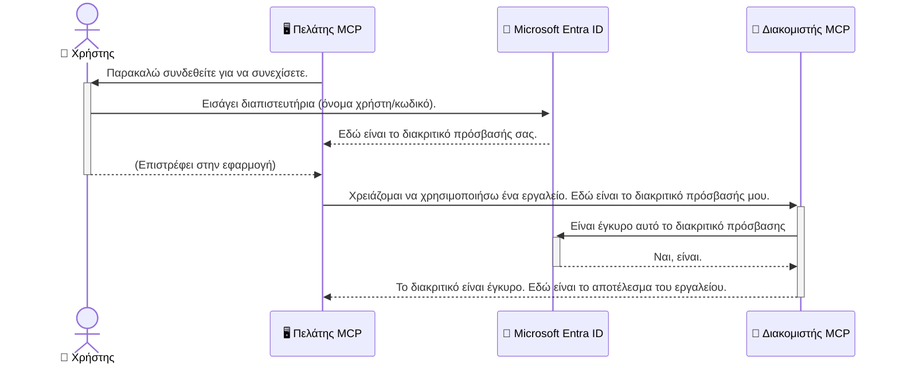

# Ασφάλεια Ροών Εργασίας AI: Πιστοποίηση Entra ID για Διακομιστές Πρωτοκόλλου Model Context

> [!NOTE]
> Ο κώδικας απομακρυσμένου διακομιστή σε αυτό το μάθημα προστατεύει τα παλαιά endpoints `/sse` και `/message`
> και στοχεύει το MCP `2025-11-25`. Διατηρήστε τις πρακτικές ταυτότητας και επικύρωσης token,
> αλλά χρησιμοποιήστε ένα `2026-07-28`-συμβατό Streamable HTTP transport για νέες
> υλοποιήσεις.

## Εισαγωγή
Η ασφάλεια του Model Context Protocol (MCP) διακομιστή σας είναι εξίσου σημαντική με το να κλειδώνετε την μπροστινή πόρτα του σπιτιού σας. Αφήνοντας τον MCP διακομιστή σας ανοιχτό, εκθέτετε τα εργαλεία και τα δεδομένα σας σε μη εξουσιοδοτημένη πρόσβαση, κάτι που μπορεί να οδηγήσει σε παραβιάσεις της ασφάλειας. Το Microsoft Entra ID παρέχει μια ισχυρή λύση διαχείρισης ταυτότητας και πρόσβασης βασισμένη στο νέφος, βοηθώντας να διασφαλιστεί ότι μόνο εξουσιοδοτημένοι χρήστες και εφαρμογές μπορούν να αλληλεπιδράσουν με τον MCP διακομιστή σας. Σε αυτή την ενότητα, θα μάθετε πώς να προστατεύετε τις ροές εργασίας AI χρησιμοποιώντας την πιστοποίηση Entra ID.

## Στόχοι Μάθησης
Μέχρι το τέλος αυτής της ενότητας, θα μπορείτε να:

- Κατανοείτε τη σημασία της ασφάλειας των MCP διακομιστών.
- Εξηγείτε τα βασικά του Microsoft Entra ID και της πιστοποίησης OAuth 2.0.
- Αναγνωρίζετε τη διαφορά μεταξύ δημόσιων και εμπιστευτικών πελατών.
- Υλοποιείτε την πιστοποίηση Entra ID σε σενάρια τοπικού (δημόσιου πελάτη) και απομακρυσμένου (εμπιστευτικού πελάτη) MCP διακομιστή.
- Εφαρμόζετε τις βέλτιστες πρακτικές ασφάλειας κατά την ανάπτυξη ροών εργασίας AI.

## Ασφάλεια και MCP

Όπως δεν θα αφήνατε την μπροστινή πόρτα του σπιτιού σας ξεκλείδωτη, έτσι δεν πρέπει να αφήνετε τον MCP διακομιστή σας ανοιχτό για οποιονδήποτε. Η ασφάλεια των ροών εργασίας AI είναι ουσιαστική για την κατασκευή ισχυρών, αξιόπιστων και ασφαλών εφαρμογών. Αυτό το κεφάλαιο θα σας εισαγάγει στη χρήση του Microsoft Entra ID για την ασφάλεια των MCP διακομιστών σας, διασφαλίζοντας ότι μόνο εξουσιοδοτημένοι χρήστες και εφαρμογές μπορούν να αλληλεπιδράσουν με τα εργαλεία και τα δεδομένα σας.

## Γιατί η Ασφάλεια Είναι Σημαντική για τους MCP Διακομιστές

Φανταστείτε ότι ο MCP διακομιστής σας έχει ένα εργαλείο που μπορεί να στέλνει email ή να έχει πρόσβαση σε μια βάση δεδομένων πελατών. Ένας μη ασφαλής διακομιστής θα σήμαινε ότι ο καθένας θα μπορούσε ενδεχομένως να χρησιμοποιεί αυτό το εργαλείο, οδηγώντας σε μη εξουσιοδοτημένη πρόσβαση σε δεδομένα, spam ή άλλες κακόβουλες ενέργειες.

Με την εφαρμογή της πιστοποίησης, διασφαλίζετε ότι κάθε αίτημα προς τον διακομιστή σας επαληθεύεται, επιβεβαιώνοντας την ταυτότητα του χρήστη ή της εφαρμογής που κάνει το αίτημα. Αυτό είναι το πρώτο και πιο κρίσιμο βήμα για την ασφάλεια των ροών εργασίας AI.

## Εισαγωγή στο Microsoft Entra ID

[**Microsoft Entra ID**](https://adoption.microsoft.com/microsoft-security/entra/) είναι μια υπηρεσία διαχείρισης ταυτότητας και πρόσβασης βασισμένη στο νέφος. Σκεφτείτε το σαν έναν καθολικό φύλακα ασφαλείας για τις εφαρμογές σας. Διαχειρίζεται τη σύνθετη διαδικασία επαλήθευσης των ταυτοτήτων των χρηστών (πιστοποίηση) και καθορίζει τι επιτρέπεται να κάνουν (εξουσιοδότηση).

Με τη χρήση του Entra ID, μπορείτε:

- Να ενεργοποιήσετε ασφαλή σύνδεση για τους χρήστες.
- Να προστατεύσετε APIs και υπηρεσίες.
- Να διαχειριστείτε πολιτικές πρόσβασης από ένα κεντρικό σημείο.

Για τους MCP διακομιστές, το Entra ID παρέχει μια ισχυρή και ευρέως αξιόπιστη λύση για να διαχειρίζεστε ποιος μπορεί να έχει πρόσβαση στις δυνατότητες του διακομιστή σας.

---

## Κατανόηση της Μαγείας: Πώς Λειτουργεί η Πιστοποίηση Entra ID

Το Entra ID χρησιμοποιεί ανοικτά πρότυπα όπως το **OAuth 2.0** για τη διαχείριση της πιστοποίησης. Αν και οι λεπτομέρειες μπορεί να είναι περίπλοκες, η βασική ιδέα είναι απλή και μπορεί να κατανοηθεί με μια αναλογία.

### Μια Απαλή Εισαγωγή στο OAuth 2.0: Το Κλειδί Βαλέ

Σκεφτείτε το OAuth 2.0 σαν μια υπηρεσία valet για το αυτοκίνητό σας. Όταν φτάνετε σε ένα εστιατόριο, δεν δίνετε στον valet το κύριο κλειδί σας. Αντίθετα, δίνετε ένα **κλειδί valet** που έχει περιορισμένες άδειες—μπορεί να ξεκινήσει το αυτοκίνητο και να κλειδώσει τις πόρτες, αλλά δεν μπορεί να ανοίξει το πορτ-μπαγκάζ ή το ντουλαπάκι.

Σε αυτή την αναλογία:

- **Εσείς** είστε ο **Χρήστης**.
- **Το αυτοκίνητό σας** είναι ο **MCP Διακομιστής** με τα πολύτιμα εργαλεία και δεδομένα του.
- Ο **Valet** είναι το **Microsoft Entra ID**.
- Ο **Υπάλληλος Στάθμευσης** είναι ο **MCP Πελάτης** (η εφαρμογή που προσπαθεί να έχει πρόσβαση στο διακομιστή).
- Το **Κλειδί Valet** είναι το **Access Token**.

Το access token είναι μια ασφαλής συμβολοσειρά κειμένου που λαμβάνει ο MCP πελάτης από το Entra ID αφού συνδεθείτε. Ο πελάτης στη συνέχεια παρουσιάζει αυτό το token στον MCP διακομιστή με κάθε αίτημα. Ο διακομιστής μπορεί να επαληθεύσει το token για να διασφαλίσει ότι το αίτημα είναι νόμιμο και ότι ο πελάτης έχει τις απαραίτητες άδειες, χωρίς ποτέ να χρειάζεται να χειριστεί τα πραγματικά σας διαπιστευτήρια (όπως τον κωδικό πρόσβασης).

### Η Ροή της Πιστοποίησης

Έτσι λειτουργεί η διαδικασία στην πράξη:



### Εισαγωγή στη Βιβλιοθήκη Πιστοποίησης της Microsoft (MSAL)

Πριν βουτήξουμε στον κώδικα, είναι σημαντικό να παρουσιάσουμε ένα βασικό συστατικό που θα δείτε στα παραδείγματα: τη **Βιβλιοθήκη Πιστοποίησης της Microsoft (MSAL)**.

Το MSAL είναι μια βιβλιοθήκη που αναπτύχθηκε από τη Microsoft και καθιστά πολύ πιο εύκολο για τους προγραμματιστές να διαχειρίζονται την πιστοποίηση. Αντί να γράφετε όλο τον περίπλοκο κώδικα για το χειρισμό των security tokens, τη διαχείριση συνδέσεων και την ανανέωση συνεδριών, το MSAL αναλαμβάνει το καθήκον αυτό.

Η χρήση μιας βιβλιοθήκης όπως η MSAL συνιστάται έντονα επειδή:

- **Είναι Ασφαλής:** Εφαρμόζει πρωτόκολλα βιομηχανικού προτύπου και βέλτιστες πρακτικές ασφαλείας, μειώνοντας τον κίνδυνο ευπάθειας στον κώδικά σας.
- **Απλοποιεί την Ανάπτυξη:** Αφαιρεί την πολυπλοκότητα των πρωτοκόλλων OAuth 2.0 και OpenID Connect, επιτρέποντάς σας να προσθέσετε ισχυρή πιστοποίηση στην εφαρμογή σας με μερικές μόνο γραμμές κώδικα.
- **Υποστηρίζεται και Συντηρείται:** Η Microsoft διατηρεί και ενημερώνει ενεργά το MSAL για να αντιμετωπίσει νέες απειλές ασφάλειας και αλλαγές στην πλατφόρμα.

Το MSAL υποστηρίζει μια μεγάλη ποικιλία γλωσσών και πλαισίων εφαρμογών, όπως .NET, JavaScript/TypeScript, Python, Java, Go και κινητές πλατφόρμες όπως iOS και Android. Αυτό σημαίνει ότι μπορείτε να χρησιμοποιείτε σταθερά πρότυπα πιστοποίησης σε όλο το τεχνολογικό σας οικοσύστημα.

Για να μάθετε περισσότερα για το MSAL, μπορείτε να ρίξετε μια ματιά στην επίσημη [τεκμηρίωση επισκόπησης MSAL](https://learn.microsoft.com/entra/identity-platform/msal-overview).

---

## Ασφαλίζοντας τον MCP Διακομιστή σας με το Entra ID: Οδηγός Βήμα προς Βήμα

Τώρα, ας δούμε πώς να ασφαλίσετε έναν τοπικό MCP διακομιστή (που επικοινωνεί μέσω `stdio`) χρησιμοποιώντας το Entra ID. Το παράδειγμα αυτό χρησιμοποιεί έναν **δημόσιο πελάτη**, που είναι κατάλληλος για εφαρμογές που τρέχουν στον υπολογιστή ενός χρήστη, όπως μια εφαρμογή desktop ή ένας τοπικός διακομιστής ανάπτυξης.

### Σενάριο 1: Ασφάλιση Τοπικού MCP Διακομιστή (με Δημόσιο Πελάτη)

Σε αυτό το σενάριο, θα δούμε έναν MCP διακομιστή που λειτουργεί τοπικά, επικοινωνεί μέσω `stdio` και χρησιμοποιεί το Entra ID για την πιστοποίηση του χρήστη πριν επιτρέψει πρόσβαση στα εργαλεία του. Ο διακομιστής θα έχει ένα μοναδικό εργαλείο που ανακτά τις πληροφορίες προφίλ χρήστη από το Microsoft Graph API.

#### 1. Διαμόρφωση της Εφαρμογής στο Entra ID

Πριν γράψετε κώδικα, πρέπει να καταχωρήσετε την εφαρμογή σας στο Microsoft Entra ID. Αυτό ενημερώνει το Entra ID για την εφαρμογή σας και της παραχωρεί την άδεια να χρησιμοποιεί την υπηρεσία πιστοποίησης.

1. Μεταβείτε στην **[πύλη Microsoft Entra](https://entra.microsoft.com/)**.
2. Πηγαίνετε στο **Καταχωρήσεις εφαρμογών** και κάντε κλικ στο **Νέα καταχώρηση**.
3. Δώστε στην εφαρμογή σας ένα όνομα (π.χ., "My Local MCP Server").
4. Για τους **Υποστηριζόμενους τύπους λογαριασμών**, επιλέξτε **Λογαριασμοί μόνο σε αυτόν τον οργανωτικό κατάλογο**.
5. Μπορείτε να αφήσετε το **Redirect URI** κενό για αυτό το παράδειγμα.
6. Κάντε κλικ στο **Εγγραφή**.

Μόλις εγγραφεί, σημειώστε το **Application (client) ID** και το **Directory (tenant) ID**. Θα τα χρειαστείτε στον κώδικα σας.

#### 2. Ο Κώδικας: Ανάλυση

Ας δούμε τα βασικά μέρη του κώδικα που διαχειρίζονται την πιστοποίηση. Ο πλήρης κώδικας για αυτό το παράδειγμα είναι διαθέσιμος στον φάκελο [Entra ID - Local - WAM](https://github.com/Azure-Samples/mcp-auth-servers/tree/main/src/entra-id-local-wam) του [mcp-auth-servers GitHub αποθετηρίου](https://github.com/Azure-Samples/mcp-auth-servers).

**`AuthenticationService.cs`**

Αυτή η κλάση είναι υπεύθυνη για τη διαχείριση της αλληλεπίδρασης με το Entra ID.

- **`CreateAsync`**: Αυτή η μέθοδος αρχικοποιεί το `PublicClientApplication` από το MSAL (Microsoft Authentication Library). Είναι ρυθμισμένη με το `clientId` και το `tenantId` της εφαρμογής σας.
- **`WithBroker`**: Επιτρέπει τη χρήση ενός broker (όπως ο Windows Web Account Manager), που παρέχει μια πιο ασφαλή και αδιάλειπτη εμπειρία single sign-on.
- **`AcquireTokenAsync`**: Αυτή είναι η βασική μέθοδος. Προσπαθεί πρώτα να αποκτήσει ένα token αθόρυβα (χωρίς να απαιτείται εκ νέου είσοδος από το χρήστη εάν ήδη υπάρχει έγκυρη συνεδρία). Αν δεν μπορεί να αποκτήσει αθόρυβα token, προτρέπει το χρήστη να συνδεθεί διαδραστικά.

```csharp
// Simplified for clarity
public static async Task<AuthenticationService> CreateAsync(ILogger<AuthenticationService> logger)
{
    var msalClient = PublicClientApplicationBuilder
        .Create(_clientId) // Your Application (client) ID
        .WithAuthority(AadAuthorityAudience.AzureAdMyOrg)
        .WithTenantId(_tenantId) // Your Directory (tenant) ID
        .WithBroker(new BrokerOptions(BrokerOptions.OperatingSystems.Windows))
        .Build();

    // ... cache registration ...

    return new AuthenticationService(logger, msalClient);
}

public async Task<string> AcquireTokenAsync()
{
    try
    {
        // Try silent authentication first
        var accounts = await _msalClient.GetAccountsAsync();
        var account = accounts.FirstOrDefault();

        AuthenticationResult? result = null;

        if (account != null)
        {
            result = await _msalClient.AcquireTokenSilent(_scopes, account).ExecuteAsync();
        }
        else
        {
            // If no account, or silent fails, go interactive
            result = await _msalClient.AcquireTokenInteractive(_scopes).ExecuteAsync();
        }

        return result.AccessToken;
    }
    catch (Exception ex)
    {
        _logger.LogError(ex, "An error occurred while acquiring the token.");
        throw; // Optionally rethrow the exception for higher-level handling
    }
}
```

**`Program.cs`**

Εδώ γίνεται η ρύθμιση του MCP διακομιστή και η ενσωμάτωση της υπηρεσίας πιστοποίησης.

- **`AddSingleton<AuthenticationService>`**: Καταχωρεί την `AuthenticationService` στο container εξαρτήσεων, ώστε να μπορεί να χρησιμοποιηθεί από άλλα μέρη της εφαρμογής (όπως το εργαλείο μας).
- **Το εργαλείο `GetUserDetailsFromGraph`**: Αυτό το εργαλείο απαιτεί μια παρουσία της `AuthenticationService`. Πριν κάνει οτιδήποτε, καλεί το `authService.AcquireTokenAsync()` για να λάβει ένα έγκυρο access token. Αν η πιστοποίηση είναι επιτυχής, χρησιμοποιεί το token για να καλέσει το Microsoft Graph API και να ανακτήσει τις λεπτομέρειες του χρήστη.

```csharp
// Simplified for clarity
[McpServerTool(Name = "GetUserDetailsFromGraph")]
public static async Task<string> GetUserDetailsFromGraph(
    AuthenticationService authService)
{
    try
    {
        // This will trigger the authentication flow
        var accessToken = await authService.AcquireTokenAsync();

        // Use the token to create a GraphServiceClient
        var graphClient = new GraphServiceClient(
            new BaseBearerTokenAuthenticationProvider(new TokenProvider(authService)));

        var user = await graphClient.Me.GetAsync();

        return System.Text.Json.JsonSerializer.Serialize(user);
    }
    catch (Exception ex)
    {
        return $"Error: {ex.Message}";
    }
}
```

#### 3. Πώς Λειτουργεί Όλο Μαζί

1. Όταν ο MCP πελάτης προσπαθεί να χρησιμοποιήσει το εργαλείο `GetUserDetailsFromGraph`, το εργαλείο καλεί πρώτα το `AcquireTokenAsync`.
2. Το `AcquireTokenAsync` ενεργοποιεί τη βιβλιοθήκη MSAL για να ελέγξει αν υπάρχει έγκυρο token.
3. Εάν δεν βρεθεί token, το MSAL, μέσω του broker, θα προτρέψει το χρήστη να συνδεθεί με τον λογαριασμό Entra ID.
4. Μόλις ο χρήστης συνδεθεί, το Entra ID εκδίδει ένα access token.
5. Το εργαλείο λαμβάνει το token και το χρησιμοποιεί για να κάνει μια ασφαλή κλήση στο Microsoft Graph API.
6. Οι λεπτομέρειες του χρήστη επιστρέφονται στον MCP πελάτη.

Αυτή η διαδικασία διασφαλίζει ότι μόνο πιστοποιημένοι χρήστες μπορούν να χρησιμοποιήσουν το εργαλείο, προστατεύοντας αποτελεσματικά τον τοπικό MCP διακομιστή σας.

### Σενάριο 2: Ασφάλιση Απομακρυσμένου MCP Διακομιστή (με Εμπιστευτικό Πελάτη)

Όταν ο MCP διακομιστής σας λειτουργεί σε απομακρυσμένο μηχάνημα (όπως ένας διακομιστής νέφους) και επικοινωνεί μέσω πρωτοκόλλου όπως HTTP Streaming, οι απαιτήσεις ασφαλείας είναι διαφορετικές. Σε αυτή την περίπτωση, πρέπει να χρησιμοποιείτε έναν **εμπιστευτικό πελάτη** και τη **Ροή Κωδικού Εξουσιοδότησης (Authorization Code Flow)**. Αυτή είναι μια πιο ασφαλής μέθοδος επειδή τα μυστικά της εφαρμογής δεν εκτίθενται ποτέ στον browser.

Αυτό το παράδειγμα χρησιμοποιεί έναν MCP διακομιστή βασισμένο σε TypeScript που χρησιμοποιεί το Express.js για τη διαχείριση αιτημάτων HTTP.

#### 1. Διαμόρφωση της Εφαρμογής στο Entra ID

Η ρύθμιση στο Entra ID είναι παρόμοια με τον δημόσιο πελάτη, αλλά με μια βασική διαφορά: πρέπει να δημιουργήσετε ένα **client secret**.

1. Μεταβείτε στην **[πύλη Microsoft Entra](https://entra.microsoft.com/)**.
2. Στην καταχώρηση της εφαρμογής σας, πηγαίνετε στην καρτέλα **Πιστοποιητικά & μυστικά (Certificates & secrets)**.
3. Κάντε κλικ στο **New client secret**, δώστε μια περιγραφή και κάντε κλικ στο **Add**.
4. **Σημαντικό:** Αντιγράψτε την τιμή του μυστικού αμέσως. Δεν θα μπορείτε να τη δείτε ξανά.
5. Πρέπει επίσης να ρυθμίσετε ένα **Redirect URI**. Πηγαίνετε στην καρτέλα **Authentication**, κάντε κλικ στο **Add a platform**, επιλέξτε **Web** και εισάγετε το redirect URI για την εφαρμογή σας (π.χ., `http://localhost:3001/auth/callback`).

> **⚠️ Σημαντική Σημείωση Ασφαλείας:** Για παραγωγικές εφαρμογές, η Microsoft συνιστά ανεπιφύλακτα τη χρήση μεθόδων πιστοποίησης χωρίς μυστικά, όπως **Managed Identity** ή **Workload Identity Federation**, αντί για client secrets. Τα client secrets αποτελούν κινδύνους ασφάλειας καθώς μπορούν να εκτεθούν ή να παραβιαστούν. Τα managed identities παρέχουν μια πιο ασφαλή προσέγγιση eliminando την ανάγκη αποθήκευσης διαπιστευτηρίων στον κώδικα ή τη διαμόρφωσή σας.
>
> Για περισσότερες πληροφορίες σχετικά με τα managed identities και πώς να τα υλοποιήσετε, δείτε το [Managed identities for Azure resources overview](https://learn.microsoft.com/entra/identity/managed-identities-azure-resources/overview).

#### 2. Ο Κώδικας: Ανάλυση

Αυτό το παράδειγμα χρησιμοποιεί προσέγγιση βασισμένη σε συνεδρία. Όταν ο χρήστης πιστοποιείται, ο διακομιστής αποθηκεύει το access token και το refresh token σε μια συνεδρία και δίνει στον χρήστη ένα session token. Αυτό το session token χρησιμοποιείται στη συνέχεια για τα επόμενα αιτήματα. Ο πλήρης κώδικας για αυτό το παράδειγμα είναι διαθέσιμος στον φάκελο [Entra ID - Confidential client](https://github.com/Azure-Samples/mcp-auth-servers/tree/main/src/entra-id-cca-session) του [mcp-auth-servers GitHub αποθετηρίου](https://github.com/Azure-Samples/mcp-auth-servers).

**`Server.ts`**

Αυτό το αρχείο ρυθμίζει τον Express διακομιστή και το επίπεδο μεταφοράς MCP.

- **`requireBearerAuth`**: Αυτή είναι middleware που προστατεύει τα endpoints `/sse` και `/message`. Ελέγχει αν υπάρχει έγκυρο bearer token στην κεφαλίδα `Authorization` του αιτήματος.
- **`EntraIdServerAuthProvider`**: Αυτή είναι μια προσαρμοσμένη κλάση που υλοποιεί το interface `McpServerAuthorizationProvider`. Είναι υπεύθυνη για τη διαχείριση της ροής OAuth 2.0.
- **`/auth/callback`**: Αυτό το endpoint χειρίζεται την ανακατεύθυνση από το Entra ID μετά την πιστοποίηση του χρήστη. Ανταλλάσσει τον κωδικό εξουσιοδότησης για ένα access token και ένα refresh token.

```typescript
// Απλοποιημένο για σαφήνεια
const app = express();
const { server } = createServer();
const provider = new EntraIdServerAuthProvider();

// Προστατέψτε το SSE endpoint
app.get("/sse", requireBearerAuth({
  provider,
  requiredScopes: ["User.Read"]
}), async (req, res) => {
  // ... συνδεθείτε στη μεταφορά ...
});

// Προστατέψτε το endpoint μηνυμάτων
app.post("/message", requireBearerAuth({
  provider,
  requiredScopes: ["User.Read"]
}), async (req, res) => {
  // ... χειριστείτε το μήνυμα ...
});

// Χειριστείτε την κλήση επιστροφής OAuth 2.0
app.get("/auth/callback", (req, res) => {
  provider.handleCallback(req.query.code, req.query.state)
    .then(result => {
      // ... χειριστείτε την επιτυχία ή την αποτυχία ...
    });
});
```

**`Tools.ts`**

Αυτό το αρχείο ορίζει τα εργαλεία που παρέχει ο MCP διακομιστής. Το εργαλείο `getUserDetails` είναι παρόμοιο με το αντίστοιχο του προηγούμενου παραδείγματος, αλλά παίρνει το access token από τη συνεδρία.

```typescript
// Απλοποιημένο για σαφήνεια
server.setRequestHandler(CallToolRequestSchema, async (request) => {
  const { name } = request.params;
  const context = request.params?.context as { token?: string } | undefined;
  const sessionToken = context?.token;

  if (name === ToolName.GET_USER_DETAILS) {
    if (!sessionToken) {
      throw new AuthenticationError("Authentication token is missing or invalid. Ensure the token is provided in the request context.");
    }

    // Λάβετε το διακριτικό Entra ID από την αποθήκη συνεδρίας
    const tokenData = tokenStore.getToken(sessionToken);
    const entraIdToken = tokenData.accessToken;

    const graphClient = Client.init({
      authProvider: (done) => {
        done(null, entraIdToken);
      }
    });

    const user = await graphClient.api('/me').get();

    // ... επιστροφή λεπτομερειών χρήστη ...
  }
});
```

**`auth/EntraIdServerAuthProvider.ts`**

Αυτή η κλάση χειρίζεται τη λογική για:

- Ανακατεύθυνση του χρήστη στη σελίδα σύνδεσης του Entra ID.
- Ανταλλαγή του κωδικού εξουσιοδότησης για access token.
- Αποθήκευση των tokens στο `tokenStore`.
- Ανανέωση του access token όταν λήγει.


#### 3. Πώς Λειτουργούν Όλα Μαζί

1. Όταν ένας χρήστης προσπαθεί για πρώτη φορά να συνδεθεί στον MCP server, το `requireBearerAuth` middleware θα διαπιστώσει ότι δεν έχει έγκυρη συνεδρία και θα τον ανακατευθύνει στη σελίδα σύνδεσης Entra ID.
2. Ο χρήστης συνδέεται με τον λογαριασμό του Entra ID.
3. Το Entra ID ανακατευθύνει τον χρήστη πίσω στο endpoint `/auth/callback` με έναν κωδικό εξουσιοδότησης.
4. Ο διακομιστής ανταλλάσσει τον κωδικό με ένα token πρόσβασης και ένα token ανανέωσης, τα αποθηκεύει και δημιουργεί ένα token συνεδρίας που αποστέλλεται στον πελάτη.
5. Ο πελάτης μπορεί τώρα να χρησιμοποιήσει αυτό το token συνεδρίας στην κεφαλίδα `Authorization` για όλα τα μελλοντικά αιτήματα προς τον MCP server.
6. Όταν καλείται το εργαλείο `getUserDetails`, χρησιμοποιεί το token συνεδρίας για να βρει το token πρόσβασης του Entra ID και στη συνέχεια το χρησιμοποιεί για να καλέσει το Microsoft Graph API.

Αυτή η ροή είναι πιο σύνθετη από τη ροή δημόσιου πελάτη, αλλά είναι απαραίτητη για endpoints προσβάσιμα από το διαδίκτυο. Δεδομένου ότι οι απομακρυσμένοι MCP servers είναι προσβάσιμοι μέσω του δημόσιου διαδικτύου, χρειάζονται αυστηρότερα μέτρα ασφάλειας για την προστασία από μη εξουσιοδοτημένη πρόσβαση και πιθανούς επιθέσεις.


## Καλύτερες Πρακτικές Ασφάλειας

- **Χρησιμοποιήστε πάντα HTTPS**: Κρυπτογραφήστε την επικοινωνία μεταξύ πελάτη και διακομιστή για να προστατέψετε τα tokens από υποκλοπή.
- **Εφαρμόστε Έλεγχο Πρόσβασης με Βάση Ρόλους (RBAC)**: Μην ελέγχετε μόνο *αν* ένας χρήστης είναι πιστοποιημένος· ελέγξτε *τι* δικαιούται να κάνει. Μπορείτε να ορίσετε ρόλους στο Entra ID και να τους ελέγχετε στον MCP server σας.
- **Παρακολουθήστε και κάντε έλεγχο**: Καταγράψτε όλα τα γεγονότα πιστοποίησης ώστε να μπορείτε να ανιχνεύσετε και να ανταποκριθείτε σε ύποπτη δραστηριότητα.
- **Χειριστείτε τον περιορισμό ρυθμού και το throttling**: Το Microsoft Graph και άλλα APIs εφαρμόζουν περιορισμούς ρυθμού για να αποτρέψουν κατάχρηση. Εφαρμόστε εκθετική επαναπροσπάθεια (exponential backoff) και λογική επανάληψης στον MCP server σας για ομαλή διαχείριση των απαντήσεων HTTP 429 (Too Many Requests). Σκεφτείτε την αποθήκευση συχνά προσπελασμένων δεδομένων για μείωση των κλήσεων API.
- **Ασφαλής αποθήκευση token**: Αποθηκεύστε τα access tokens και refresh tokens με ασφάλεια. Για τοπικές εφαρμογές, χρησιμοποιήστε τους μηχανισμούς ασφαλούς αποθήκευσης του συστήματος. Για εφαρμογές server, εξετάστε τη χρήση κρυπτογραφημένης αποθήκευσης ή υπηρεσιών ασφαλούς διαχείρισης κλειδιών όπως το Azure Key Vault.
- **Χειρισμός λήξης token**: Τα access tokens έχουν περιορισμένη διάρκεια ζωής. Εφαρμόστε αυτόματη ανανέωση token χρησιμοποιώντας τα refresh tokens για να διατηρείτε απρόσκοπτη εμπειρία χρήστη χωρίς να απαιτείται επαναπιστοποίηση.
- **Σκεφτείτε τη χρήση του Azure API Management**: Ενώ η εφαρμογή ασφάλειας απευθείας στον MCP server σας σας δίνει λεπτομερή έλεγχο, οι πύλες API όπως το Azure API Management μπορούν να διαχειριστούν πολλά από αυτά τα ζητήματα ασφάλειας αυτόματα, συμπεριλαμβανομένης της πιστοποίησης, της εξουσιοδότησης, του περιορισμού ρυθμού και της παρακολούθησης. Παρέχουν ένα κεντρικό επίπεδο ασφάλειας που βρίσκεται ανάμεσα στους πελάτες σας και τους MCP servers σας. Για περισσότερες λεπτομέρειες σχετικά με τη χρήση πύλων API με MCP, δείτε το [Azure API Management Your Auth Gateway For MCP Servers](https://techcommunity.microsoft.com/blog/integrationsonazureblog/azure-api-management-your-auth-gateway-for-mcp-servers/4402690).


## Βασικά Συμπεράσματα

- Η ασφάλεια του MCP server σας είναι κρίσιμη για την προστασία των δεδομένων και εργαλείων σας.
- Το Microsoft Entra ID παρέχει μια ισχυρή και επεκτάσιμη λύση για πιστοποίηση και εξουσιοδότηση.
- Χρησιμοποιήστε **δημόσιο πελάτη** για τοπικές εφαρμογές και **εμπιστευτικό πελάτη** για απομακρυσμένους servers.
- Η **Ροή Κώδικα Εξουσιοδότησης** είναι η πιο ασφαλής επιλογή για web εφαρμογές.


## Άσκηση

1. Σκεφτείτε έναν MCP server που μπορεί να κατασκευάσετε. Θα ήταν τοπικός server ή απομακρυσμένος;
2. Βάσει της απάντησής σας, θα χρησιμοποιούσατε δημόσιο ή εμπιστευτικό πελάτη;
3. Ποια άδεια θα ζητούσε ο MCP server σας για να εκτελέσει ενέργειες στο Microsoft Graph;


## Πρακτικές Ασκήσεις

### Άσκηση 1: Καταχώριση Εφαρμογής στο Entra ID
Μεταβείτε στην πύλη Microsoft Entra.
Καταχωρίστε μια νέα εφαρμογή για τον MCP server σας.
Καταγράψτε το Application (client) ID και το Directory (tenant) ID.

### Άσκηση 2: Ασφάλεια Τοπικού MCP Server (Δημόσιος Πελάτης)
- Ακολουθήστε το παράδειγμα κώδικα για να ενσωματώσετε το MSAL (Microsoft Authentication Library) για την πιστοποίηση χρηστών.
- Δοκιμάστε τη ροή πιστοποίησης καλώντας το εργαλείο MCP που αντλεί λεπτομέρειες χρήστη από το Microsoft Graph.

### Άσκηση 3: Ασφάλεια Απομακρυσμένου MCP Server (Εμπιστευτικός Πελάτης)
- Καταχωρίστε έναν εμπιστευτικό πελάτη στο Entra ID και δημιουργήστε ένα client secret.
- Διαμορφώστε τον Express.js MCP server σας να χρησιμοποιεί τη Ροή Κώδικα Εξουσιοδότησης.
- Δοκιμάστε τα προστατευμένα endpoints και επιβεβαιώστε την πρόσβαση με βάση token.

### Άσκηση 4: Εφαρμογή Καλύτερων Πρακτικών Ασφάλειας
- Ενεργοποιήστε το HTTPS για τον τοπικό ή απομακρυσμένο server σας.
- Εφαρμόστε τον έλεγχο πρόσβασης με βάση ρόλους (RBAC) στη λογική του server σας.
- Προσθέστε χειρισμό λήξης token και ασφαλή αποθήκευση token.

## Πόροι

1. **Τεκμηρίωση Επισκόπησης MSAL**  
   Μάθετε πώς η βιβλιοθήκη Microsoft Authentication Library (MSAL) επιτρέπει την ασφαλή απόκτηση token σε διάφορες πλατφόρμες:  
   [MSAL Overview on Microsoft Learn](https://learn.microsoft.com/en-gb/entra/msal/overview)

2. **Azure-Samples/mcp-auth-servers Αποθετήριο GitHub**  
   Υλοποιήσεις-παραδείγματα MCP servers που παρουσιάζουν ροές πιστοποίησης:  
   [Azure-Samples/mcp-auth-servers on GitHub](https://github.com/Azure-Samples/mcp-auth-servers)

3. **Επισκόπηση Διαχειριζόμενων Ταυτοτήτων για Πόρους Azure**  
   Κατανοήστε πώς να εξαλείψετε τα μυστικά χρησιμοποιώντας διαχειριζόμενες ταυτότητες εκχώρησης από το σύστημα ή τον χρήστη:  
   [Managed Identities Overview on Microsoft Learn](https://learn.microsoft.com/en-us/entra/identity/managed-identities-azure-resources/)

4. **Azure API Management: Η πύλη πιστοποίησής σας για MCP Servers**  
   Αναλυτική παρουσίαση της χρήσης του APIM ως ασφαλή πύλη OAuth2 για MCP servers:  
   [Azure API Management Your Auth Gateway For MCP Servers](https://techcommunity.microsoft.com/blog/integrationsonazureblog/azure-api-management-your-auth-gateway-for-mcp-servers/4402690)

5. **Αναφορά Δικαιωμάτων Microsoft Graph**  
   Αναλυτική λίστα εξουσιοδοτημένων δικαιωμάτων και δικαιωμάτων εφαρμογής για το Microsoft Graph:  
   [Microsoft Graph Permissions Reference](https://learn.microsoft.com/zh-tw/graph/permissions-reference)


## Μαθησιακά Αποτελέσματα
Μετά την ολοκλήρωση αυτής της ενότητας, θα μπορείτε να:

- Αναλύετε γιατί η πιστοποίηση είναι κρίσιμη για MCP servers και ροές εργασίας AI.
- Ρυθμίζετε και διαμορφώνετε την πιστοποίηση Entra ID για τοπικά και απομακρυσμένα σενάρια MCP server.
- Επιλέγετε τον κατάλληλο τύπο πελάτη (δημόσιο ή εμπιστευτικό) βάσει της ανάπτυξης του server σας.
- Εφαρμόζετε πρακτικές ασφαλούς κωδικοποίησης, συμπεριλαμβανομένης της αποθήκευσης token και της εξουσιοδότησης με βάση ρόλο.
- Προστατεύετε με σιγουριά τον MCP server και τα εργαλεία του από μη εξουσιοδοτημένη πρόσβαση.

## Τι ακολουθεί 

- [5.13 Ενσωμάτωση Πρωτοκόλλου Περιβάλλοντος Μοντέλου (MCP) με Microsoft Foundry](../mcp-foundry-agent-integration/README.md)

---

<!-- CO-OP TRANSLATOR DISCLAIMER START -->
**Αποποίηση ευθυνών**:
Αυτό το έγγραφο έχει μεταφραστεί χρησιμοποιώντας την υπηρεσία μετάφρασης με τεχνητή νοημοσύνη [Co-op Translator](https://github.com/Azure/co-op-translator). Ενώ επιδιώκουμε την ακρίβεια, παρακαλούμε να έχετε υπόψη ότι οι αυτοματοποιημένες μεταφράσεις ενδέχεται να περιέχουν λάθη ή ανακρίβειες. Το πρωτότυπο έγγραφο στη μητρική του γλώσσα πρέπει να θεωρείται η αυθεντική πηγή. Για κρίσιμες πληροφορίες, συνιστάται επαγγελματική ανθρώπινη μετάφραση. Δεν φέρουμε ευθύνη για τυχόν παρεξηγήσεις ή λανθασμένες ερμηνείες που προκύπτουν από τη χρήση αυτής της μετάφρασης.
<!-- CO-OP TRANSLATOR DISCLAIMER END -->