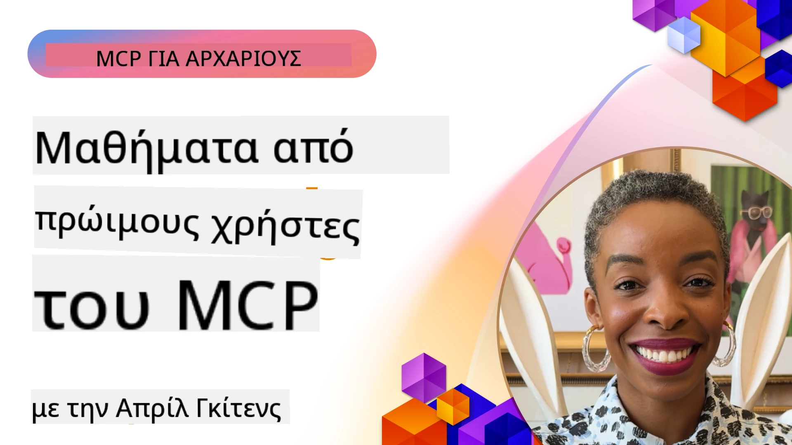

# 🌟 Μαθήματα από Πρώιμους Υιοθετητές

[](https://youtu.be/jds7dSmNptE)

_(Κάντε κλικ στην παραπάνω εικόνα για να δείτε το βίντεο αυτού του μαθήματος)_

## 🎯 Τι Καλύπτει Αυτό το Μάθημα

Αυτό το μάθημα διερευνά πώς πραγματικοί οργανισμοί και προγραμματιστές αξιοποιούν το Πρωτόκολλο Πλαισίου Μοντέλου (MCP) για να λύσουν πραγματικές προκλήσεις και να προωθήσουν την καινοτομία. Μέσα από λεπτομερείς μελέτες περιπτώσεων, πρακτικά έργα, και παραδείγματα, θα ανακαλύψετε πώς το MCP επιτρέπει ασφαλή, επεκτάσιμη ενσωμάτωση τεχνητής νοημοσύνης που συνδέει μοντέλα γλώσσας, εργαλεία και επιχειρησιακά δεδομένα.

### 📚 Δείτε το MCP σε Δράση

Θέλετε να δείτε αυτά τα αρχές να εφαρμόζονται σε εργαλεία έτοιμα για παραγωγή; Ρίξτε μια ματιά στους [**10 Διακομιστές MCP της Microsoft που Μεταμορφώνουν την Παραγωγικότητα των Προγραμματιστών**](microsoft-mcp-servers.md), που παρουσιάζουν πραγματικούς διακομιστές MCP της Microsoft που μπορείτε να χρησιμοποιήσετε σήμερα.

## Επισκόπηση

Αυτό το μάθημα εξετάζει πώς οι πρώιμοι χρήστες αξιοποίησαν το Πρωτόκολλο Πλαισίου Μοντέλου (MCP) για να λύσουν πραγματικές προκλήσεις και να προωθήσουν την καινοτομία σε διάφορους κλάδους. Μέσα από λεπτομερείς μελέτες περιπτώσεων και πρακτικά έργα, θα δείτε πώς το MCP επιτρέπει τυποποιημένη, ασφαλή και επεκτάσιμη ενσωμάτωση τεχνητής νοημοσύνης — συνδέοντας μεγάλα γλωσσικά μοντέλα, εργαλεία και επιχειρησιακά δεδομένα σε ένα ενιαίο πλαίσιο. Θα αποκτήσετε πρακτική εμπειρία σχεδιάζοντας και δημιουργώντας λύσεις βασισμένες σε MCP, θα μάθετε από αποδεδειγμένα πρότυπα υλοποίησης και θα ανακαλύψετε βέλτιστες πρακτικές για την ανάπτυξη MCP σε περιβάλλοντα παραγωγής. Το μάθημα επίσης αναδεικνύει ανερχόμενες τάσεις, μελλοντικές κατευθύνσεις και πόρους ανοικτού κώδικα για να σας βοηθήσει να παραμείνετε στην αιχμή της τεχνολογίας MCP και του εξελισσόμενου οικοσυστήματός της.

## Στόχοι Μάθησης

- Ανάλυση πραγματικών υλοποιήσεων MCP σε διάφορους κλάδους
- Σχεδιασμός και κατασκευή πλήρων εφαρμογών βασισμένων σε MCP
- Εξερεύνηση ανερχόμενων τάσεων και μελλοντικών κατευθύνσεων στην τεχνολογία MCP
- Εφαρμογή βέλτιστων πρακτικών σε πραγματικά σενάρια ανάπτυξης

## Πραγματικές Υλοποιήσεις MCP

### Μελέτη Περιπτώσεως 1: Αυτοματοποίηση Υποστήριξης Πελατών Επιχείρησης

Μια πολυεθνική εταιρεία υλοποίησε μια λύση βασισμένη σε MCP για να τυποποιήσει τις αλληλεπιδράσεις τεχνητής νοημοσύνης στα συστήματα υποστήριξης πελατών της. Αυτό της επέτρεψε να:

- Δημιουργήσει ένα ενοποιημένο περιβάλλον για πολλούς παρόχους LLM
- Διατηρήσει συνεπή διαχείριση προτροπών σε όλα τα τμήματα
- Εφαρμόσει αυστηρούς ελέγχους ασφαλείας και συμμόρφωσης
- Εύκολα αλλάζει μεταξύ διαφορετικών μοντέλων AI βάσει συγκεκριμένων αναγκών

**Τεχνική Υλοποίηση:**

```python
# Υλοποίηση διακομιστή MCP σε Python για υποστήριξη πελατών
import logging
import asyncio
from modelcontextprotocol import create_server, ServerConfig
from modelcontextprotocol.server import MCPServer
from modelcontextprotocol.transports import create_http_transport
from modelcontextprotocol.resources import ResourceDefinition
from modelcontextprotocol.prompts import PromptDefinition
from modelcontextprotocol.tool import ToolDefinition

# Διαμόρφωση καταγραφής
logging.basicConfig(level=logging.INFO)

async def main():
    # Δημιουργία ρύθμισης διακομιστή
    config = ServerConfig(
        name="Enterprise Customer Support Server",
        version="1.0.0",
        description="MCP server for handling customer support inquiries"
    )
    
    # Αρχικοποίηση διακομιστή MCP
    server = create_server(config)
    
    # Καταχώριση πόρων βάσης γνώσεων
    server.resources.register(
        ResourceDefinition(
            name="customer_kb",
            description="Customer knowledge base documentation"
        ),
        lambda params: get_customer_documentation(params)
    )
    
    # Καταχώριση προτύπων προτροπών
    server.prompts.register(
        PromptDefinition(
            name="support_template",
            description="Templates for customer support responses"
        ),
        lambda params: get_support_templates(params)
    )
    
    # Καταχώριση εργαλείων υποστήριξης
    server.tools.register(
        ToolDefinition(
            name="ticketing",
            description="Create and update support tickets"
        ),
        handle_ticketing_operations
    )
    
    # Εκκίνηση διακομιστή με μεταφορά HTTP
    transport = create_http_transport(port=8080)
    await server.run(transport)

if __name__ == "__main__":
    asyncio.run(main())
```

**Αποτελέσματα:** Μείωση κόστους μοντέλων κατά 30%, βελτίωση συνέπειας στην απόκριση κατά 45%, και ενισχυμένη συμμόρφωση σε παγκόσμιες λειτουργίες.

### Μελέτη Περιπτώσεως 2: Βοηθός Διαγνωστικής στην Υγεία

Πάροχος υπηρεσιών υγείας ανέπτυξε υποδομή MCP για να ενσωματώσει πολλαπλά εξειδικευμένα ιατρικά μοντέλα AI διασφαλίζοντας ότι ευαίσθητα δεδομένα ασθενών παραμένουν προστατευμένα:

- Αδιάκοπη εναλλαγή μεταξύ γενικών και εξειδικευμένων ιατρικών μοντέλων
- Αυστηροί έλεγχοι απορρήτου και ίχνη ελέγχου
- Ενσωμάτωση με υπάρχοντα συστήματα Ηλεκτρονικού Φακέλου Υγείας (EHR)
- Συνεπής μηχανική προτροπών για ιατρική ορολογία

**Τεχνική Υλοποίηση:**

```csharp
// C# MCP host application implementation in healthcare application
using Microsoft.Extensions.DependencyInjection;
using ModelContextProtocol.SDK.Client;
using ModelContextProtocol.SDK.Security;
using ModelContextProtocol.SDK.Resources;

public class DiagnosticAssistant
{
    private readonly MCPHostClient _mcpClient;
    private readonly PatientContext _patientContext;
    
    public DiagnosticAssistant(PatientContext patientContext)
    {
        _patientContext = patientContext;
        
        // Configure MCP client with healthcare-specific settings
        var clientOptions = new ClientOptions
        {
            Name = "Healthcare Diagnostic Assistant",
            Version = "1.0.0",
            Security = new SecurityOptions
            {
                Encryption = EncryptionLevel.Medical,
                AuditEnabled = true
            }
        };
        
        _mcpClient = new MCPHostClientBuilder()
            .WithOptions(clientOptions)
            .WithTransport(new HttpTransport("https://healthcare-mcp.example.org"))
            .WithAuthentication(new HIPAACompliantAuthProvider())
            .Build();
    }
    
    public async Task<DiagnosticSuggestion> GetDiagnosticAssistance(
        string symptoms, string patientHistory)
    {
        // Create request with appropriate resources and tool access
        var resourceRequest = new ResourceRequest
        {
            Name = "patient_records",
            Parameters = new Dictionary<string, object>
            {
                ["patientId"] = _patientContext.PatientId,
                ["requestingProvider"] = _patientContext.ProviderId
            }
        };
        
        // Request diagnostic assistance using appropriate prompt
        var response = await _mcpClient.SendPromptRequestAsync(
            promptName: "diagnostic_assistance",
            parameters: new Dictionary<string, object>
            {
                ["symptoms"] = symptoms,
                patientHistory = patientHistory,
                relevantGuidelines = _patientContext.GetRelevantGuidelines()
            });
            
        return DiagnosticSuggestion.FromMCPResponse(response);
    }
}
```

**Αποτελέσματα:** Βελτιωμένες διαγνωστικές προτάσεις για ιατρούς ενώ τηρείται πλήρης συμμόρφωση με HIPAA και σημαντική μείωση στην εναλλαγή πλαισίου μεταξύ συστημάτων.

### Μελέτη Περιπτώσεως 3: Ανάλυση Κινδύνων στις Χρηματοοικονομικές Υπηρεσίες

Χρηματοπιστωτικό ίδρυμα υλοποίησε MCP για να τυποποιήσει τις διαδικασίες ανάλυσης κινδύνου σε διαφορετικά τμήματα:

- Δημιουργία ενοποιημένου περιβάλλοντος για μοντέλα κινδύνου πιστοληπτικής ικανότητας, ανίχνευσης απάτης, και κινδύνου επενδύσεων
- Εφαρμογή αυστηρών ελέγχων πρόσβασης και διαχείρισης εκδόσεων μοντέλων
- Διασφάλιση ιχνηλασιμότητας όλων των συστάσεων AI
- Διατήρηση συνεπούς μορφοποίησης δεδομένων σε ποικίλα συστήματα

**Τεχνική Υλοποίηση:**

```java
// Διακομιστής MCP Java για αξιολόγηση χρηματοοικονομικού κινδύνου
import org.mcp.server.*;
import org.mcp.security.*;

public class FinancialRiskMCPServer {
    public static void main(String[] args) {
        // Δημιουργία διακομιστή MCP με χαρακτηριστικά χρηματοοικονομικής συμμόρφωσης
        MCPServer server = new MCPServerBuilder()
            .withModelProviders(
                new ModelProvider("risk-assessment-primary", new AzureOpenAIProvider()),
                new ModelProvider("risk-assessment-audit", new LocalLlamaProvider())
            )
            .withPromptTemplateDirectory("./compliance/templates")
            .withAccessControls(new SOCCompliantAccessControl())
            .withDataEncryption(EncryptionStandard.FINANCIAL_GRADE)
            .withVersionControl(true)
            .withAuditLogging(new DatabaseAuditLogger())
            .build();
            
        server.addRequestValidator(new FinancialDataValidator());
        server.addResponseFilter(new PII_RedactionFilter());
        
        server.start(9000);
        
        System.out.println("Financial Risk MCP Server running on port 9000");
    }
}
```

**Αποτελέσματα:** Ενισχυμένη συμμόρφωση με κανονισμούς, 40% ταχύτεροι κύκλοι ανάπτυξης μοντέλων και βελτιωμένη συνέπεια στην αξιολόγηση κινδύνου μεταξύ των τμημάτων.

### Μελέτη Περιπτώσεως 4: Διακομιστής MCP Microsoft Playwright για Αυτοματισμό Browser

Η Microsoft ανέπτυξε τον [διακομιστή MCP Playwright](https://github.com/microsoft/playwright-mcp) για να επιτρέψει ασφαλή, τυποποιημένο αυτοματισμό browser μέσω του Πρωτοκόλλου Πλαισίου Μοντέλου. Αυτός ο διακομιστής έτοιμος για παραγωγή επιτρέπει σε πράκτορες AI και LLM να αλληλεπιδρούν με προγράμματα περιήγησης με ελεγχόμενο, ελεγχόμενο και επεκτάσιμο τρόπο — υποστηρίζοντας περιπτώσεις χρήσης όπως αυτοματοποιημένο web testing, εξαγωγή δεδομένων, και ολοκληρωμένες ροές εργασίας.

> **🎯 Εργαλείο Έτοιμο για Παραγωγή**
> 
> Αυτή η μελέτη περιπτώσεως παρουσιάζει έναν πραγματικό διακομιστή MCP που μπορείτε να χρησιμοποιήσετε σήμερα! Μάθετε περισσότερα για τον Playwright MCP Server και άλλους 9 διακομιστές MCP της Microsoft στον [**Οδηγό Διακομιστών MCP της Microsoft**](microsoft-mcp-servers.md#8--playwright-mcp-server).

**Κύρια Χαρακτηριστικά:**
- Εκθέτει δυνατότητες αυτοματισμού browser (πλοήγηση, συμπλήρωση φορμών, σύλληψη στιγμιότυπων, κλπ.) ως εργαλεία MCP
- Εφαρμόζει αυστηρούς ελέγχους πρόσβασης και sandboxing για αποφυγή μη εξουσιοδοτημένων ενεργειών
- Παρέχει λεπτομερή αρχεία ελέγχου για όλες τις αλληλεπιδράσεις με το πρόγραμμα περιήγησης
- Υποστηρίζει ενσωμάτωση με Azure OpenAI και άλλους παρόχους LLM για αυτοματισμό που ελέγχεται από πράκτορες
- Τροφοδοτεί τον Coding Agent του GitHub Copilot με δυνατότητες περιήγησης web

**Τεχνική Υλοποίηση:**

```typescript
// TypeScript: Εγγραφή εργαλείων αυτοματισμού προγράμματος περιήγησης Playwright σε έναν διακομιστή MCP
import { createServer, ToolDefinition } from 'modelcontextprotocol';
import { launch } from 'playwright';

const server = createServer({
  name: 'Playwright MCP Server',
  version: '1.0.0',
  description: 'MCP server for browser automation using Playwright'
});

// Καταχώριση εργαλείου για πλοήγηση σε URL και λήψη στιγμιότυπου οθόνης
server.tools.register(
  new ToolDefinition({
    name: 'navigate_and_screenshot',
    description: 'Navigate to a URL and capture a screenshot',
    parameters: {
      url: { type: 'string', description: 'The URL to visit' }
    }
  }),
  async ({ url }) => {
    const browser = await launch();
    const page = await browser.newPage();
    await page.goto(url);
    const screenshot = await page.screenshot();
    await browser.close();
    return { screenshot };
  }
);

// Εκκίνηση του διακομιστή MCP
server.listen(8080);
```

**Αποτελέσματα:**

- Ενεργοποίησε ασφαλή, προγραμματισμένο αυτοματισμό browser για πράκτορες AI και LLM
- Μείωσε τον χειροκίνητο έλεγχο και βελτίωσε την κάλυψη δοκιμών για web εφαρμογές
- Παρείχε ένα επαναχρησιμοποιήσιμο, επεκτάσιμο πλαίσιο για ενσωμάτωση εργαλείων βασισμένων σε browser σε επιχειρησιακά περιβάλλοντα
- Τροφοδοτεί τις δυνατότητες περιήγησης web του GitHub Copilot

**Αναφορές:**

- [Αποθετήριο GitHub Playwright MCP Server](https://github.com/microsoft/playwright-mcp)
- [Λύσεις AI και Αυτοματισμού Microsoft](https://azure.microsoft.com/en-us/products/ai-services/)

### Μελέτη Περιπτώσεως 5: Azure MCP – Πρωτόκολλο Πλαισίου Μοντέλου Επιχειρησιακής Κλάσης ως Υπηρεσία

Ο διακομιστής Azure MCP ([https://aka.ms/azmcp](https://aka.ms/azmcp)) είναι η διαχειριζόμενη, επιχειρησιακής κλάσης υλοποίηση του Model Context Protocol της Microsoft, σχεδιασμένος να παρέχει επεκτάσιμες, ασφαλείς και συμμορφούμενες δυνατότητες διακομιστή MCP ως υπηρεσία cloud. Το Azure MCP επιτρέπει σε οργανισμούς να αναπτύσσουν γρήγορα, να διαχειρίζονται και να ενσωματώνουν διακομιστές MCP με υπηρεσίες Azure AI, δεδομένων και ασφάλειας, μειώνοντας το λειτουργικό βάρος και επιταχύνοντας την υιοθέτηση AI.

> **🎯 Εργαλείο Έτοιμο για Παραγωγή**
> 
> Αυτός είναι ένας πραγματικός διακομιστής MCP που μπορείτε να χρησιμοποιήσετε σήμερα! Μάθετε περισσότερα για τον Microsoft Foundry MCP Server στον [**Οδηγό Διακομιστών MCP της Microsoft**](microsoft-mcp-servers.md).


- Πλήρως διαχειριζόμενη φιλοξενία διακομιστή MCP με ενσωματωμένη κλιμάκωση, παρακολούθηση και ασφάλεια
- Φυσική ενσωμάτωση με Azure OpenAI, Azure AI Search και άλλες υπηρεσίες Azure
- Επιχειρησιακή πιστοποίηση και εξουσιοδότηση μέσω Microsoft Entra ID
- Υποστήριξη για προσαρμοσμένα εργαλεία, πρότυπα προτροπών και συνδέσεις πόρων
- Συμμόρφωση με επιχειρησιακές απαιτήσεις ασφάλειας και κανονισμών

**Τεχνική Υλοποίηση:**

```yaml
# Example: Azure MCP server deployment configuration (YAML)
apiVersion: mcp.microsoft.com/v1
kind: McpServer
metadata:
  name: enterprise-mcp-server
spec:
  modelProviders:
    - name: azure-openai
      type: AzureOpenAI
      endpoint: https://<your-openai-resource>.openai.azure.com/
      apiKeySecret: <your-azure-keyvault-secret>
  tools:
    - name: document_search
      type: AzureAISearch
      endpoint: https://<your-search-resource>.search.windows.net/
      apiKeySecret: <your-azure-keyvault-secret>
  authentication:
    type: EntraID
    tenantId: <your-tenant-id>
  monitoring:
    enabled: true
    logAnalyticsWorkspace: <your-log-analytics-id>
```

**Αποτελέσματα:**  
- Μείωσε το χρόνο προς αξία για έργα επιχειρησιακής AI παρέχοντας μια έτοιμη προς χρήση, συμμορφούμενη πλατφόρμα διακομιστή MCP
- Απλοποίησε την ενσωμάτωση LLM, εργαλείων και επιχειρησιακών πηγών δεδομένων
- Ενίσχυσε την ασφάλεια, την παρατηρησιμότητα και τη λειτουργική αποδοτικότητα για φορτία εργασίας MCP
- Βελτίωσε την ποιότητα κώδικα με βέλτιστες πρακτικές του Azure SDK και τρέχοντα πρότυπα πιστοποίησης

**Αναφορές:**  
- [Τεκμηρίωση Azure MCP](https://aka.ms/azmcp)
- [Αποθετήριο GitHub Azure MCP Server](https://github.com/Azure/azure-mcp)
- [Υπηρεσίες AI Azure](https://azure.microsoft.com/en-us/products/ai-services/)
- [Κέντρο Microsoft MCP](https://mcp.azure.com)

## Μελέτη Περιπτώσεως 6: NLWeb 
Το MCP (Πρωτόκολλο Πλαισίου Μοντέλου) είναι ένα αναδυόμενο πρωτόκολλο για chatbots και βοηθούς AI να αλληλεπιδρούν με εργαλεία. Κάθε παράδειγμα NLWeb είναι επίσης διακομιστής MCP, που υποστηρίζει μία βασική μέθοδο, ask, η οποία χρησιμοποιείται για να ρωτήσει μια ιστοσελίδα μια ερώτηση σε φυσική γλώσσα. Η απάντηση που επιστρέφεται αξιοποιεί το schema.org, ένα ευρέως χρησιμοποιούμενο λεξιλόγιο για την περιγραφή δεδομένων web. Χονδρικά, το MCP είναι σαν το NLWeb όπως το Http για το HTML. Το NLWeb συνδυάζει πρωτόκολλα, φορμά schema.org, και δείγματα κώδικα για να βοηθήσει τις ιστοσελίδες να δημιουργούν γρήγορα αυτές τις διαδρομές, ωφελώντας τόσο τους ανθρώπους μέσω διαλογικών διεπαφών όσο και τις μηχανές μέσω φυσικής αλληλεπίδρασης πράκτορα προς πράκτορα.

Υπάρχουν δύο διακριτά συστατικά στο NLWeb.
- Ένα πρωτόκολλο, πολύ απλό για αρχή, για διεπαφή με μια ιστοσελίδα σε φυσική γλώσσα και ένα φορμά, αξιοποιώντας json και schema.org για την απάντηση που επιστρέφεται. Δείτε την τεκμηρίωση του REST API για περισσότερες λεπτομέρειες.
- Μια απλή υλοποίηση του (1) που αξιοποιεί υπάρχουσα σήμανση, για ιστοσελίδες που μπορούν να αφαιρεθούν ως λίστες αντικειμένων (προϊόντα, συνταγές, αξιοθέατα, κριτικές, κλπ.). Μαζί με ένα σύνολο widgets διεπαφής χρήστη, οι ιστοσελίδες μπορούν εύκολα να παρέχουν διαλογικές διεπαφές στο περιεχόμενό τους. Δείτε την τεκμηρίωση για τη Ζωή μιας ερώτησης συνομιλίας για περισσότερες λεπτομέρειες για το πώς λειτουργεί αυτό.
 
**Αναφορές:**  
- [Τεκμηρίωση Azure MCP](https://aka.ms/azmcp)
- [NLWeb](https://github.com/microsoft/NlWeb)

### Μελέτη Περιπτώσεως 7: Microsoft Foundry MCP Server – Ενσωμάτωση Πράκτορα AI για Επιχειρήσεις

Οι διακομιστές Microsoft Foundry MCP δείχνουν πώς το MCP μπορεί να χρησιμοποιηθεί για την ορχήστρωση και διαχείριση πρακτόρων AI και ροών εργασίας σε επιχειρησιακά περιβάλλοντα. Ενσωματώνοντας το MCP με το Microsoft Foundry, οι οργανισμοί μπορούν να τυποποιήσουν τις αλληλεπιδράσεις πρακτόρων, να αξιοποιήσουν τη διαχείριση ροών εργασίας του Foundry και να διασφαλίσουν ασφαλείς, επεκτάσιμες αναπτύξεις.

> **🎯 Εργαλείο Έτοιμο για Παραγωγή**
> 
> Αυτός είναι πραγματικός διακομιστής MCP που μπορείτε να χρησιμοποιήσετε σήμερα! Μάθετε περισσότερα για τον Microsoft Foundry MCP Server στον [**Οδηγό Διακομιστών MCP της Microsoft**](microsoft-mcp-servers.md#9--microsoft-foundry-mcp-server).

**Κύρια Χαρακτηριστικά:**
- Ολοκληρωμένη πρόσβαση στο οικοσύστημα AI του Azure, συμπεριλαμβανομένων καταλόγων μοντέλων και διαχείρισης ανάπτυξης
- Ευρετηρίαση γνώσης με το Azure AI Search για εφαρμογές RAG
- Εργαλεία αξιολόγησης για την απόδοση μοντέλων AI και διασφάλιση ποιότητας
- Ενσωμάτωση με τον Κατάλογο και τα Εργαστήρια Microsoft Foundry για μοντέλα αιχμής
- Δυνατότητες διαχείρισης και αξιολόγησης πρακτόρων για σενάρια παραγωγής

**Αποτελέσματα:**
- Γρήγορη πρωτοτυποποίηση και αξιόπιστη παρακολούθηση ροών εργασίας πρακτόρων AI
- Αδιάλειπτη ενσωμάτωση με υπηρεσίες Azure AI για προηγμένα σενάρια
- Ενοποιημένο περιβάλλον για κατασκευή, ανάπτυξη και παρακολούθηση γραμμών πραγματοποίησης πρακτόρων
- Βελτιωμένη ασφάλεια, συμμόρφωση και λειτουργική αποδοτικότητα για επιχειρήσεις
- Επιταχυνόμενη υιοθέτηση AI διατηρώντας τον έλεγχο πολύπλοκων διαδικασιών που ελέγχονται από πράκτορες

**Αναφορές:**
- [Αποθετήριο GitHub Microsoft Foundry MCP Server](https://github.com/azure-ai-foundry/mcp-foundry)
- [Ενσωμάτωση Πρακτόρων Azure AI με MCP (Microsoft Foundry Blog)](https://devblogs.microsoft.com/foundry/integrating-azure-ai-agents-mcp/)

### Μελέτη Περιπτώσεως 8: Foundry MCP Playground – Πειραματισμός και Πρωτοτυποποίηση

Το Foundry MCP Playground προσφέρει ένα περιβάλλον έτοιμο για χρήση για πειραματισμό με διακομιστές MCP και ενσωματώσεις Microsoft Foundry. Οι προγραμματιστές μπορούν γρήγορα να δημιουργήσουν πρωτότυπα, να δοκιμάσουν και να αξιολογήσουν μοντέλα AI και ροές εργασίας πρακτόρων χρησιμοποιώντας πόρους από τον Κατάλογο και τα Εργαστήρια Microsoft Foundry. Το playground απλοποιεί την εγκατάσταση, παρέχει δείγματα έργων και υποστηρίζει συνεργατική ανάπτυξη, καθιστώντας εύκολη την εξερεύνηση βέλτιστων πρακτικών και νέων σεναρίων με ελάχιστο κόστος. Είναι ιδιαίτερα χρήσιμο για ομάδες που θέλουν να επικυρώσουν ιδέες, να μοιραστούν πειράματα και να επιταχύνουν τη μάθηση χωρίς την ανάγκη σύνθετης υποδομής. Με τη μείωση του φραγμού εισόδου, το playground βοηθά την καινοτομία και τις συνεισφορές στην κοινότητα στο οικοσύστημα MCP και Microsoft Foundry.

**Αναφορές:**

- [Αποθετήριο GitHub Foundry MCP Playground](https://github.com/azure-ai-foundry/foundry-mcp-playground)

### Μελέτη Περιπτώσεως 9: Microsoft Learn Docs MCP Server – Πρόσβαση σε Τεκμηρίωση με Υποστήριξη AI

Ο Microsoft Learn Docs MCP Server είναι μια υπηρεσία φιλοξενίας cloud που παρέχει βοηθούς AI με πρόσβαση σε πραγματικό χρόνο στην επίσημη τεκμηρίωση της Microsoft μέσω του Πρωτοκόλλου Πλαισίου Μοντέλου. Αυτός ο διακομιστής έτοιμος για παραγωγή συνδέεται με το ολοκληρωμένο οικοσύστημα Microsoft Learn και επιτρέπει σημασιολογική αναζήτηση σε όλες τις επίσημες πηγές της Microsoft.

> **🎯 Εργαλείο Έτοιμο για Παραγωγή**
> 
> Αυτός είναι πραγματικός διακομιστής MCP που μπορείτε να χρησιμοποιήσετε σήμερα! Μάθετε περισσότερα για τον Microsoft Learn Docs MCP Server στον [**Οδηγό Διακομιστών MCP της Microsoft**](microsoft-mcp-servers.md#1--microsoft-learn-docs-mcp-server).

**Κύρια Χαρακτηριστικά:**
- Πρόσβαση σε πραγματικό χρόνο στην επίσημη τεκμηρίωση Microsoft, τεκμηρίωση Azure, και Microsoft 365
- Προηγμένες δυνατότητες σημασιολογικής αναζήτησης που κατανοούν το πλαίσιο και το σκοπό
- Πάντα ενημερωμένες πληροφορίες καθώς δημοσιεύεται το περιεχόμενο Microsoft Learn
- Ολοκληρωμένη κάλυψη σε Microsoft Learn, τεκμηρίωση Azure, και πηγές Microsoft 365
- Επιστρέφει έως 10 υψηλής ποιότητας τμήματα περιεχομένου με τίτλους άρθρων και URLs

**Γιατί είναι Κρίσιμο:**
- Λύνει το πρόβλημα της «ξεπερασμένης γνώσης AI» για τις τεχνολογίες Microsoft
- Εξασφαλίζει πρόσβαση βοηθών AI στις πιο πρόσφατες λειτουργίες .NET, C#, Azure και Microsoft 365
- Παρέχει ακριβείς, αυθεντικές πληροφορίες για ακριβή δημιουργία κώδικα
- Απαραίτητο για προγραμματιστές που εργάζονται με ραγδαία εξελισσόμενες τεχνολογίες Microsoft

**Αποτελέσματα:**
- Δραματική βελτίωση ακρίβειας κώδικα που παράγεται από AI για τεχνολογίες Microsoft
- Μείωση χρόνου αναζήτησης για τρέχουσα τεκμηρίωση και βέλτιστες πρακτικές
- Ενίσχυση παραγωγικότητας προγραμματιστών με ανάκτηση τεκμηρίωσης που κατανοεί το πλαίσιο
- Αδιάλειπτη ενσωμάτωση με ροές εργασίας ανάπτυξης χωρίς αποχώρηση από το IDE

**Αναφορές:**
- [Αποθετήριο GitHub Microsoft Learn Docs MCP Server](https://github.com/MicrosoftDocs/mcp)
- [Τεκμηρίωση Microsoft Learn](https://learn.microsoft.com/)

## Πρακτικά Έργα

### Έργο 1: Δημιουργία Πολλαπλού Παρόχου MCP Server

**Στόχος:** Δημιουργήστε έναν διακομιστή MCP που μπορεί να δρομολογεί αιτήσεις προς πολλούς παρόχους μοντέλων AI βάσει συγκεκριμένων κριτηρίων.

**Απαιτήσεις:**

- Υποστήριξη τουλάχιστον τριών διαφορετικών παρόχων μοντέλων (π.χ., OpenAI, Anthropic, τοπικά μοντέλα)
- Υλοποίηση μηχανισμού δρομολόγησης βάσει μεταδεδομένων αιτήματος
- Δημιουργία συστήματος ρύθμισης για τη διαχείριση διαπιστευτηρίων παρόχων
- Προσθήκη caching για βελτιστοποίηση απόδοσης και κόστους
- Δημιουργία απλής κονσόλας για παρακολούθηση χρήσης

**Βήματα Υλοποίησης:**

1. Στήστε τη βασική υποδομή διακομιστή MCP
2. Υλοποιήστε προσαρμογείς παρόχων για κάθε υπηρεσία μοντέλου AI
3. Δημιουργήστε τη λογική δρομολόγησης βάσει χαρακτηριστικών αιτήματος
4. Προσθέστε μηχανισμούς caching για συχνά αιτήματα
5. Αναπτύξτε την κονσόλα παρακολούθησης
6. Δοκιμάστε με διάφορα μοτίβα αιτημάτων

**Τεχνολογίες:** Επιλέξτε από Python (.NET/Java/Python ανάλογα με τις προτιμήσεις σας), Redis για caching, και ένα απλό web framework για την κονσόλα.

### Έργο 2: Σύστημα Διαχείρισης Προτροπών Επιχείρησης

**Στόχος:** Αναπτύξτε ένα σύστημα βασισμένο σε MCP για διαχείριση, έκδοση και ανάπτυξη προτύπων προτροπών σε όλη την οργάνωση.

**Απαιτήσεις:**


- Δημιουργήστε μια κεντρική αποθήκη για πρότυπα προτροπών
- Υλοποιήστε συστήματα εκδόσεων και ροές έγκρισης
- Δημιουργήστε δυνατότητες δοκιμών προτύπων με δείγματα εισόδων
- Αναπτύξτε ελέγχους πρόσβασης βάσει ρόλων
- Δημιουργήστε ένα API για ανάκτηση και ανάπτυξη προτύπων

**Βήματα Υλοποίησης:**

1. Σχεδιάστε το σχήμα βάσης δεδομένων για αποθήκευση προτύπων
2. Δημιουργήστε το βασικό API για λειτουργίες CRUD προτύπων
3. Υλοποιήστε το σύστημα εκδόσεων
4. Δημιουργήστε τη ροή εργασίας έγκρισης
5. Αναπτύξτε το πλαίσιο δοκιμών
6. Δημιουργήστε απλή διαδικτυακή διεπαφή για διαχείριση
7. Ενσωματώστε με διακομιστή MCP

**Τεχνολογίες:** Η επιλογή σας από πλαίσιο backend, βάση δεδομένων SQL ή NoSQL, και πλαίσιο frontend για τη διεπαφή διαχείρισης.

### Έργο 3: Πλατφόρμα Δημιουργίας Περιεχομένου Βασισμένη σε MCP

**Στόχος:** Δημιουργήστε μια πλατφόρμα δημιουργίας περιεχομένου που αξιοποιεί το MCP για να παρέχει συνεπή αποτελέσματα σε διάφορους τύπους περιεχομένου.

**Απαιτήσεις:**

- Υποστήριξη πολλαπλών μορφών περιεχομένου (άρθρα blog, κοινωνικά μέσα, κείμενο μάρκετινγκ)
- Υλοποίηση δημιουργίας βάσει προτύπων με επιλογές προσαρμογής
- Δημιουργία συστήματος αναθεώρησης και ανατροφοδότησης περιεχομένου
- Παρακολούθηση μετρήσεων απόδοσης περιεχομένου
- Υποστήριξη εκδόσεων και επαναλήψεων περιεχομένου

**Βήματα Υλοποίησης:**

1. Στήστε την υποδομή πελάτη MCP
2. Δημιουργήστε πρότυπα για διαφορετικούς τύπους περιεχομένου
3. Δημιουργήστε την αλυσίδα δημιουργίας περιεχομένου
4. Υλοποιήστε το σύστημα αναθεώρησης
5. Αναπτύξτε το σύστημα παρακολούθησης μετρήσεων
6. Δημιουργήστε διεπαφή χρήστη για διαχείριση προτύπων και δημιουργία περιεχομένου

**Τεχνολογίες:** Η προτιμώμενη γλώσσα προγραμματισμού, το web framework και το σύστημα βάσης δεδομένων σας.

## Μελλοντικές Κατευθύνσεις για την Τεχνολογία MCP

### Αναδυόμενες Τάσεις

1. **Πολυμορφικό MCP**
   - Επέκταση του MCP για τυποποίηση αλληλεπιδράσεων με μοντέλα εικόνων, ήχου και βίντεο
   - Ανάπτυξη δυνατοτήτων διμορφικής συλλογιστικής
   - Τυποποιημένες μορφές προτροπών για διαφορετικές μορφές

2. **Ομοσπονδιακή Υποδομή MCP**
   - Κατανεμημένα δίκτυα MCP που μπορούν να μοιραστούν πόρους μεταξύ οργανισμών
   - Τυποποιημένα πρωτόκολλα για ασφαλή κοινή χρήση μοντέλων
   - Τεχνικές υπολογισμών που προστατεύουν την ιδιωτικότητα

3. **Αγορές MCP**
   - Οικοσυστήματα για κοινή χρήση και εμπορευματοποίηση προτύπων και προσθέτων MCP
   - Διαδικασίες διασφάλισης ποιότητας και πιστοποίησης
   - Ενσωμάτωση με αγορές μοντέλων

4. **MCP για Edge Computing**
   - Προσαρμογή προτύπων MCP για συσκευές edge με περιορισμένους πόρους
   - Βελτιστοποιημένα πρωτόκολλα για περιβάλλοντα χαμηλού εύρους ζώνης
   - Εξειδικευμένες υλοποιήσεις MCP για οικοσυστήματα IoT

5. **Κανονιστικά Πλαίσια**
   - Ανάπτυξη επεκτάσεων MCP για τη συμμόρφωση με κανονισμούς
   - Τυποποιημένα ίχνη ελέγχου και διεπαφές εξηγήσεων
   - Ενσωμάτωση με εναρμονισμένα πλαίσια διακυβέρνησης AI

### Λύσεις MCP από τη Microsoft

Microsoft και Azure έχουν αναπτύξει αρκετά αποθετήρια ανοιχτού κώδικα για να βοηθήσουν προγραμματιστές να υλοποιήσουν MCP σε διάφορα σενάρια:

#### Οργανισμός Microsoft

1. [playwright-mcp](https://github.com/microsoft/playwright-mcp) - Διακομιστής Playwright MCP για αυτοματοποίηση και δοκιμές περιηγητή
2. [files-mcp-server](https://github.com/microsoft/files-mcp-server) - Υλοποίηση διακομιστή MCP OneDrive για τοπικές δοκιμές και συμβολή στην κοινότητα
3. [NLWeb](https://github.com/microsoft/NlWeb) - Συλλογή ανοιχτών πρωτοκόλλων και σχετικών εργαλείων ανοιχτού κώδικα. Κύριος στόχος η δημιουργία θεμελιακού επιπέδου για το AI Web

#### Οργανισμός Azure-Samples

1. [mcp](https://github.com/Azure-Samples/mcp) - Σύνδεσμοι προς δείγματα, εργαλεία και πόρους για δημιουργία και ενσωμάτωση διακομιστών MCP στο Azure με πολλαπλές γλώσσες
2. [mcp-auth-servers](https://github.com/Azure-Samples/mcp-auth-servers) - Αναφορά διακομιστών MCP που επιδεικνύουν αυθεντικοποίηση με το τρέχον προδιαγραφόμενο πρωτόκολλο Model Context
3. [remote-mcp-functions](https://github.com/Azure-Samples/remote-mcp-functions) - Αρχική σελίδα για υλοποιήσεις Remote MCP Server σε Azure Functions με συνδέσμους σε αποθετήρια γλωσσών
4. [remote-mcp-functions-python](https://github.com/Azure-Samples/remote-mcp-functions-python) - Πρότυπο γρήγορης εκκίνησης για δημιουργία και ανάπτυξη προσαρμοσμένων απομακρυσμένων διακομιστών MCP με Python σε Azure Functions
5. [remote-mcp-functions-dotnet](https://github.com/Azure-Samples/remote-mcp-functions-dotnet) - Πρότυπο γρήγορης εκκίνησης για δημιουργία και ανάπτυξη προσαρμοσμένων απομακρυσμένων διακομιστών MCP με .NET/C# σε Azure Functions
6. [remote-mcp-functions-typescript](https://github.com/Azure-Samples/remote-mcp-functions-typescript) - Πρότυπο γρήγορης εκκίνησης για δημιουργία και ανάπτυξη προσαρμοσμένων απομακρυσμένων διακομιστών MCP με TypeScript σε Azure Functions
7. [remote-mcp-apim-functions-python](https://github.com/Azure-Samples/remote-mcp-apim-functions-python) - Azure API Management ως Πύλη AI προς Απομακρυσμένους διακομιστές MCP χρησιμοποιώντας Python
8. [AI-Gateway](https://github.com/Azure-Samples/AI-Gateway) - Πειράματα APIM ❤️ AI που περιλαμβάνουν δυνατότητες MCP, ενσωμάτωση με Azure OpenAI και AI Foundry

Αυτά τα αποθετήρια παρέχουν διάφορες υλοποιήσεις, πρότυπα και πόρους για εργασία με το Model Context Protocol σε διαφορετικές γλώσσες προγραμματισμού και υπηρεσίες Azure. Καλύπτουν ένα εύρος χρήσεων από βασικές υλοποιήσεις διακομιστών μέχρι αυθεντικοποίηση, ανάπτυξη στο cloud και σενάρια ενσωμάτωσης επιχειρήσεων.

#### Κατάλογος Πόρων MCP

Ο [κατάλογος πόρων MCP](https://github.com/microsoft/mcp/tree/main/Resources) στο επίσημο αποθετήριο Microsoft MCP παρέχει μια επιμελημένη συλλογή δειγμάτων πόρων, προτύπων προτροπής και ορισμών εργαλείων για χρήση με διακομιστές Model Context Protocol. Ο κατάλογος αυτός έχει σχεδιαστεί για να βοηθήσει τους προγραμματιστές να ξεκινήσουν γρήγορα με το MCP προσφέροντας επαναχρησιμοποιήσιμα δομικά στοιχεία και παραδείγματα βέλτιστων πρακτικών για:

- **Πρότυπα Προτροπών:** Έτοιμα προς χρήση πρότυπα προτροπών για κοινές εργασίες AI και σενάρια, που μπορούν να προσαρμοστούν για τις δικές σας υλοποιήσεις διακομιστών MCP.
- **Ορισμοί Εργαλείων:** Παραδείγματα σχημάτων εργαλείων και μεταδεδομένων για τυποποίηση ενσωμάτωσης και κλήσης εργαλείων σε διάφορους διακομιστές MCP.
- **Δείγματα Πόρων:** Παραδείγματα ορισμών πόρων για σύνδεση με πηγές δεδομένων, APIs, και εξωτερικές υπηρεσίες εντός του πλαισίου MCP.
- **Υλοποιήσεις Αναφοράς:** Πρακτικά δείγματα που επιδεικνύουν πώς να δομούνται και να οργανώνονται πόροι, προτροπές και εργαλεία σε πραγματικά έργα MCP.

Αυτοί οι πόροι επιταχύνουν την ανάπτυξη, προωθούν την τυποποίηση και βοηθούν να διασφαλιστούν οι βέλτιστες πρακτικές κατά την κατασκευή και ανάπτυξη λύσεων βασισμένων σε MCP.

#### Κατάλογος Πόρων MCP

- [Πόροι MCP (Δείγματα Προτροπών, Εργαλεία και Ορισμοί Πόρων)](https://github.com/microsoft/mcp/tree/main/Resources)

### Ευκαιρίες Έρευνας

- Αποτελεσματικές τεχνικές βελτιστοποίησης προτροπών εντός πλαισίων MCP
- Μοντέλα ασφαλείας για πολλαπλές εγκαταστάσεις MCP
- Μέτρηση επιδόσεων σε διάφορες υλοποιήσεις MCP
- Μέθοδοι τυπικής επαλήθευσης για διακομιστές MCP

## Συμπέρασμα

Το Model Context Protocol (MCP) διαμορφώνει ραγδαία το μέλλον της τυποποιημένης, ασφαλούς και διαλειτουργικής ενσωμάτωσης AI σε βιομηχανίες. Μέσα από τις μελέτες περίπτωσης και τα πρακτικά έργα σε αυτό το μάθημα, έχετε δει πώς οι πρώτοι υιοθετητές—συμπεριλαμβανομένης της Microsoft και του Azure—χρησιμοποιούν το MCP για να λύσουν πραγματικά προβλήματα, να επιταχύνουν την υιοθέτηση AI και να διασφαλίσουν συμμόρφωση, ασφάλεια και επεκτασιμότητα. Η αρθρωτή προσέγγιση του MCP επιτρέπει σε οργανισμούς να συνδέουν μεγάλα μοντέλα γλώσσας, εργαλεία και επιχειρησιακά δεδομένα σε ένα ενιαίο, ελεγχόμενο πλαίσιο. Καθώς το MCP εξελίσσεται, η ενεργή συμμετοχή στην κοινότητα, η εξερεύνηση πόρων ανοιχτού κώδικα και η εφαρμογή βέλτιστων πρακτικών θα είναι κλειδιά για την κατασκευή ανθεκτικών, μέλλον-έτοιμων λύσεων AI.

## Πρόσθετοι Πόροι

- [Αποθετήριο MCP Foundry στο GitHub](https://github.com/azure-ai-foundry/mcp-foundry)
- [Παιδική Χαρά Foundry MCP](https://github.com/azure-ai-foundry/foundry-mcp-playground)
- [Ενσωμάτωση Πρακτόρων Azure AI με MCP (Microsoft Foundry Blog)](https://devblogs.microsoft.com/foundry/integrating-azure-ai-agents-mcp/)
- [Αποθετήριο MCP στο GitHub (Microsoft)](https://github.com/microsoft/mcp)
- [Κατάλογος Πόρων MCP (Δείγματα Προτροπών, Εργαλεία και Ορισμοί Πόρων)](https://github.com/microsoft/mcp/tree/main/Resources)
- [Κοινότητα & Τεκμηρίωση MCP](https://modelcontextprotocol.io/introduction)
- [Προδιαγραφή MCP (2026-07-28)](https://modelcontextprotocol.io/specification/2026-07-28/)
- [Τεκμηρίωση Azure MCP](https://aka.ms/azmcp)
- [OWASP MCP Top 10](https://microsoft.github.io/mcp-azure-security-guide/mcp/) - Καλές πρακτικές ασφαλείας
- [Αποθετήριο Playwright MCP Server στο GitHub](https://github.com/microsoft/playwright-mcp)
- [Διακομιστής Files MCP (OneDrive)](https://github.com/microsoft/files-mcp-server)
- [Azure-Samples MCP](https://github.com/Azure-Samples/mcp)
- [Διακομιστές αυθεντικοποίησης MCP (Azure-Samples)](https://github.com/Azure-Samples/mcp-auth-servers)
- [Απομακρυσμένες λειτουργίες MCP (Azure-Samples)](https://github.com/Azure-Samples/remote-mcp-functions)
- [Απομακρυσμένες λειτουργίες MCP Python (Azure-Samples)](https://github.com/Azure-Samples/remote-mcp-functions-python)
- [Απομακρυσμένες λειτουργίες MCP .NET (Azure-Samples)](https://github.com/Azure-Samples/remote-mcp-functions-dotnet)
- [Απομακρυσμένες λειτουργίες MCP TypeScript (Azure-Samples)](https://github.com/Azure-Samples/remote-mcp-functions-typescript)
- [Απομακρυσμένες λειτουργίες MCP APIM Python (Azure-Samples)](https://github.com/Azure-Samples/remote-mcp-apim-functions-python)
- [AI-Gateway (Azure-Samples)](https://github.com/Azure-Samples/AI-Gateway)
- [Λύσεις AI και Αυτοματοποίησης της Microsoft](https://azure.microsoft.com/en-us/products/ai-services/)

## Ασκήσεις

1. Αναλύστε μία από τις μελέτες περίπτωσης και προτείνετε εναλλακτική προσέγγιση υλοποίησης.
2. Επιλέξτε μία από τις ιδέες έργων και δημιουργήστε αναλυτική τεχνική προδιαγραφή.
3. Ερευνήστε μια βιομηχανία που δεν καλύφθηκε στις μελέτες περίπτωσης και περιγράψτε πώς το MCP θα μπορούσε να αντιμετωπίσει τις ειδικές προκλήσεις της.
4. Εξερευνήστε μία από τις μελλοντικές κατευθύνσεις και δημιουργήστε ένα concept για νέα επέκταση MCP που να τη στηρίζει.

## Τι Ακολουθεί

Εξερευνήστε περισσότερα: [Microsoft MCP Servers](./microsoft-mcp-servers.md)

Συνεχίστε στο: [Ενότητα 8: Βέλτιστες Πρακτικές](../08-BestPractices/README.md)

---

<!-- CO-OP TRANSLATOR DISCLAIMER START -->
**Αποποίηση ευθυνών**:
Αυτό το έγγραφο έχει μεταφραστεί χρησιμοποιώντας την υπηρεσία μετάφρασης με τεχνητή νοημοσύνη [Co-op Translator](https://github.com/Azure/co-op-translator). Ενώ επιδιώκουμε την ακρίβεια, παρακαλούμε να έχετε υπόψη ότι οι αυτοματοποιημένες μεταφράσεις ενδέχεται να περιέχουν λάθη ή ανακρίβειες. Το πρωτότυπο έγγραφο στη μητρική του γλώσσα πρέπει να θεωρείται η αυθεντική πηγή. Για κρίσιμες πληροφορίες, συνιστάται επαγγελματική ανθρώπινη μετάφραση. Δεν φέρουμε ευθύνη για τυχόν παρεξηγήσεις ή λανθασμένες ερμηνείες που προκύπτουν από τη χρήση αυτής της μετάφρασης.
<!-- CO-OP TRANSLATOR DISCLAIMER END -->