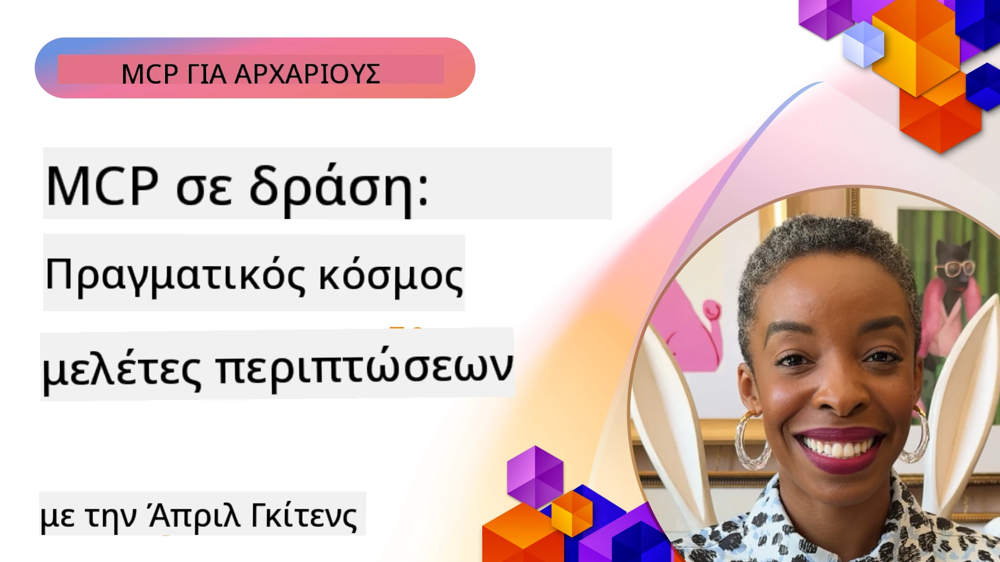

# MCP σε Δράση: Μελέτες Περίπτωσης από τον Πραγματικό Κόσμο

_(Κάντε κλικ στην εικόνα παραπάνω για να δείτε το βίντεο αυτού του μαθήματος)_

Το Πρωτόκολλο Πλαισίου Μοντέλου (MCP) μεταμορφώνει τον τρόπο με τον οποίο οι εφαρμογές τεχνητής νοημοσύνης αλληλεπιδρούν με δεδομένα, εργαλεία και υπηρεσίες. Αυτή η ενότητα παρουσιάζει μελέτες περίπτωσης από τον πραγματικό κόσμο που αποδεικνύουν πρακτικές εφαρμογές του MCP σε διάφορα επιχειρησιακά σενάρια.

## Επισκόπηση

Αυτή η ενότητα παρουσιάζει συγκεκριμένα παραδείγματα υλοποιήσεων MCP, αναδεικνύοντας τον τρόπο με τον οποίο οργανισμοί αξιοποιούν αυτό το πρωτόκολλο για να επιλύουν πολύπλοκες επιχειρησιακές προκλήσεις. Με την εξέταση αυτών των μελετών περίπτωσης, θα αποκτήσετε γνώσεις σχετικά με την ευελιξία, την κλιμακωσιμότητα και τα πρακτικά οφέλη του MCP σε σενάρια του πραγματικού κόσμου.

## Κύριοι Στόχοι Μάθησης

Μελετώντας αυτές τις μελέτες περίπτωσης, θα:

- Κατανοήσετε πώς το MCP μπορεί να εφαρμοστεί για την επίλυση συγκεκριμένων επιχειρησιακών προβλημάτων
- Μάθετε για διάφορα πρότυπα ενσωμάτωσης και αρχιτεκτονικές προσεγγίσεις
- Αναγνωρίσετε βέλτιστες πρακτικές για την υλοποίηση MCP σε επιχειρησιακά περιβάλλοντα
- Αποκτήσετε γνώσεις για τις προκλήσεις και τις λύσεις που αντιμετωπίστηκαν σε υλοποιήσεις του πραγματικού κόσμου
- Εντοπίσετε ευκαιρίες για να εφαρμόσετε παρόμοια πρότυπα στα δικά σας έργα

## Επιλεγμένες Μελέτες Περίπτωσης

### 1. [Πράκτορες Ταξιδιών Azure AI – Αναφορά Υλοποίησης](./travelagentsample.md)

Αυτή η μελέτη περίπτωσης εξετάζει την ολοκληρωμένη λύση αναφοράς της Microsoft που επιδεικνύει πώς να δημιουργήσετε μια εφαρμογή πολυπράκτορα προγραμματισμού ταξιδιών με τεχνητή νοημοσύνη, χρησιμοποιώντας MCP, Azure OpenAI και Azure AI Search. Το έργο παρουσιάζει:

- Ορχήστρωση πολλαπλών πρακτόρων μέσω MCP
- Ενσωμάτωση δεδομένων επιχειρήσεων με Azure AI Search
- Ασφαλής, κλιμακούμενη αρχιτεκτονική με χρήση υπηρεσιών Azure
- Επεκτάσιμα εργαλεία με επαναχρησιμοποιήσιμα συστατικά MCP
- Συνομιλιακή εμπειρία χρήστη powered by Azure OpenAI

Η αρχιτεκτονική και οι λεπτομέρειες υλοποίησης παρέχουν πολύτιμες γνώσεις για την κατασκευή σύνθετων συστημάτων πολλαπλών πρακτόρων με το MCP ως το επίπεδο συντονισμού.

### 2. [Ενημέρωση Αντικειμένων Azure DevOps από Δεδομένα YouTube](./UpdateADOItemsFromYT.md)

Αυτή η μελέτη περίπτωσης παρουσιάζει μια πρακτική εφαρμογή του MCP για την αυτοματοποίηση διαδικασιών εργασίας. Δείχνει πώς τα εργαλεία MCP μπορούν να χρησιμοποιηθούν για να:

- Εξάγουν δεδομένα από διαδικτυακές πλατφόρμες (YouTube)
- Ενημερώσουν εργασίες σε συστήματα Azure DevOps
- Δημιουργήσουν επαναλαμβανόμενα αυτοματοποιημένα ροές εργασίας
- Ενσωματώσουν δεδομένα ανάμεσα σε διαφορετικά συστήματα

Αυτό το παράδειγμα δείχνει πώς ακόμη και οι σχετικά απλές υλοποιήσεις MCP μπορούν να προσφέρουν σημαντική αποτελεσματικότητα αυτοματοποιώντας συνηθισμένες εργασίες και βελτιώνοντας τη συνοχή δεδομένων μεταξύ των συστημάτων.

### 3. [Άμεση Ανάκτηση Τεκμηρίωσης με MCP](./docs-mcp/README.md)

Αυτή η μελέτη περίπτωσης σας καθοδηγεί για το πώς να συνδέσετε έναν πελάτη Python κονσόλας με έναν διακομιστή Model Context Protocol (MCP) για την ανάκτηση και καταγραφή σε πραγματικό χρόνο, τεκμηρίωσης της Microsoft με επίγνωση πλαισίου. Θα μάθετε πώς να:

- Συνδεθείτε σε διακομιστή MCP χρησιμοποιώντας έναν πελάτη Python και το επίσημο MCP SDK
- Χρησιμοποιήσετε streaming HTTP clients για αποδοτική ανάκτηση δεδομένων σε πραγματικό χρόνο
- Κάνετε κλήσεις σε εργαλεία τεκμηρίωσης στον εξυπηρετητή και να καταγράψετε τις απαντήσεις απευθείας στην κονσόλα
- Ενσωματώσετε ενημερωμένη τεκμηρίωση της Microsoft στη ροή εργασίας σας χωρίς να βγαίνετε από το τερματικό

Το κεφάλαιο περιλαμβάνει μια πρακτική άσκηση, ένα ελάχιστο λειτουργικό δείγμα κώδικα και συνδέσμους σε πρόσθετους πόρους για να εμβαθύνετε στη μάθηση. Δείτε τον πλήρη οδηγό και τον κώδικα στο συνδεδεμένο κεφάλαιο για να κατανοήσετε πώς το MCP μπορεί να μεταμορφώσει την πρόσβαση στην τεκμηρίωση και την παραγωγικότητα των προγραμματιστών σε περιβάλλοντα κονσόλας.

### 4. [Διαδραστικός Γεννήτορας Σχεδίου Μελέτης Web App με MCP](./docs-mcp/README.md)

Αυτή η μελέτη περίπτωσης παρουσιάζει πώς να δημιουργήσετε μια διαδραστική web εφαρμογή χρησιμοποιώντας Chainlit και το Model Context Protocol (MCP) για να δημιουργήσετε εξατομικευμένα σχέδια μελέτης για οποιοδήποτε θέμα. Οι χρήστες μπορούν να καθορίσουν ένα θέμα (όπως "πιστοποίηση AI-900") και μια διάρκεια μελέτης (π.χ., 8 εβδομάδες), και η εφαρμογή θα παρέχει μια ανάλυση εβδομάδα προς εβδομάδα με τις προτεινόμενες ενότητες. Το Chainlit επιτρέπει μια συνομιλιακή διεπαφή chat, καθιστώντας την εμπειρία διαδραστική και προσαρμοστική.

- Διαδραστική web εφαρμογή συνομιλίας με Chainlit
- Προυποθέσεις χρήστη για θέμα και διάρκεια
- Προτάσεις περιεχομένου εβδομάδα προς εβδομάδα χρησιμοποιώντας MCP
- Απαντήσεις σε πραγματικό χρόνο και προσαρμοστικές σε διεπαφή συνομιλίας

Το έργο δείχνει πώς η συνομιλιακή τεχνητή νοημοσύνη και το MCP μπορούν να συνδυαστούν για τη δημιουργία δυναμικών, χρήστη-κατευθυνόμενων εκπαιδευτικών εργαλείων σε μοντέρνο web περιβάλλον.

### 5. [Τεκμηρίωση μέσα στον Επεξεργαστή με MCP Server στο VS Code](./docs-mcp/README.md)

Αυτή η μελέτη περίπτωσης δείχνει πώς μπορείτε να φέρετε τα Microsoft Learn Docs απευθείας στο περιβάλλον του VS Code χρησιμοποιώντας τον MCP server — χωρίς να αλλάζετε καρτέλες στον περιηγητή! Θα δείτε πώς να:

- Αναζητάτε και διαβάζετε τεκμηρίωση άμεσα μέσα στο VS Code χρησιμοποιώντας το πάνελ MCP ή την παλέτα εντολών
- Αναφέρετε τεκμηρίωση και εισάγετε συνδέσμους απευθείας στα αρχεία README ή markdown του μαθήματός σας
- Χρησιμοποιείτε GitHub Copilot και MCP μαζί για αδιάλειπτες ροές εργασίας τεκμηρίωσης και κώδικα με χρήση AI
- Επικυρώνετε και βελτιώνετε την τεκμηρίωσή σας με ανατροφοδότηση σε πραγματικό χρόνο και ακρίβεια από τη Microsoft
- Ενσωματώνετε το MCP με workflows του GitHub για συνεχή επικύρωση τεκμηρίωσης

Η υλοποίηση περιλαμβάνει:

- Παράδειγμα ρύθμισης αρχείου `.vscode/mcp.json` για εύκολη εγκατάσταση
- Περιηγήσεις με στιγμιότυπα οθόνης της εμπειρίας μέσα στον επεξεργαστή
- Συμβουλές για τον συνδυασμό Copilot και MCP για μέγιστη παραγωγικότητα

Αυτό το σενάριο είναι ιδανικό για συγγραφείς μαθημάτων, συγγραφείς τεκμηρίωσης και προγραμματιστές που θέλουν να παραμείνουν συγκεντρωμένοι στον επεξεργαστή τους ενώ δουλεύουν με τεκμηρίωση, Copilot και εργαλεία επικύρωσης — όλα powered by MCP.

### 6. [Δημιουργία MCP Server με APIM](./apimsample.md)

Αυτή η μελέτη περίπτωσης παρέχει έναν βήμα προς βήμα οδηγό για το πώς να δημιουργήσετε έναν MCP server χρησιμοποιώντας το Azure API Management (APIM). Καλύπτει:

- Ρύθμιση MCP server στο Azure API Management
- Έκθεση λειτουργιών API ως εργαλεία MCP
- Διαμόρφωση πολιτικών για περιορισμό ρυθμού και ασφάλεια
- Δοκιμή MCP server χρησιμοποιώντας Visual Studio Code και GitHub Copilot

Αυτό το παράδειγμα δείχνει πώς να αξιοποιήσετε τις δυνατότητες του Azure για τη δημιουργία ενός ισχυρού MCP server που μπορεί να χρησιμοποιηθεί σε διάφορες εφαρμογές, βελτιώνοντας την ενσωμάτωση συστημάτων AI με enterprise APIs.

### 7. [Μητρώο MCP GitHub — Επιτάχυνση Ενσωμάτωσης Πρακτόρων](https://github.com/mcp)

Αυτή η μελέτη περίπτωσης εξετάζει πώς το Μητρώο MCP του GitHub, που λανσαρίστηκε τον Σεπτέμβριο του 2025, αντιμετωπίζει μια κρίσιμη πρόκληση στο οικοσύστημα της τεχνητής νοημοσύνης: τη κατακερματισμένη ανακάλυψη και ανάπτυξη διακομιστών Model Context Protocol (MCP).

#### Επισκόπηση
Το **Μητρώο MCP** επιλύει το αυξανόμενο πρόβλημα των κατακερματισμένων MCP servers σε αποθετήρια και μητρώα, που προηγουμένως καθιστούσαν αργή και επιρρεπή σε σφάλματα την ενσωμάτωση. Αυτοί οι διακομιστές επιτρέπουν σε πρακτόρια AI να αλληλεπιδρούν με εξωτερικά συστήματα όπως APIs, βάσεις δεδομένων και πηγές τεκμηρίωσης.

#### Διατύπωση Προβλήματος
Οι προγραμματιστές που δημιουργούν αυτοματισμούς πρακτόρων αντιμετώπιζαν πολλές προκλήσεις:
- **Κακή ανακάλυψη** MCP servers σε διάφορες πλατφόρμες
- **Επαναλαμβανόμενες ερωτήσεις ρύθμισης** διασκορπισμένες σε φόρουμ και τεκμηρίωση
- **Κίνδυνοι ασφαλείας** από μη επαληθευμένες και μη αξιόπιστες πηγές
- **Έλλειψη τυποποίησης** στην ποιότητα και συμβατότητα των διακομιστών

#### Αρχιτεκτονική Λύσης
Το Μητρώο MCP του GitHub εστιάζει σε αξιόπιστους MCP servers με βασικά χαρακτηριστικά:
- **Εγκατάσταση με ένα κλικ** μέσω VS Code για απλοποιημένη ρύθμιση
- **Κατάταξη σήματος έναντι θορύβου** με βάση αστέρια, δραστηριότητα και επικύρωση κοινότητας
- **Άμεση ενσωμάτωση** με GitHub Copilot και άλλα συμβατά με MCP εργαλεία
- **Ανοιχτό μοντέλο συνεισφοράς** που επιτρέπει σε κοινότητα και εταίρους επιχειρήσεων να συμβάλλουν

#### Επιχειρησιακός Αντίκτυπος
Το μητρώο έχει φέρει μετρήσιμες βελτιώσεις:
- **Ταχύτερη ενσωμάτωση** προγραμματιστών με εργαλεία όπως ο Microsoft Learn MCP Server, που μεταδίδει επίσημη τεκμηρίωση απευθείας στους πρακτόρους
- **Αυξημένη παραγωγικότητα** μέσω εξειδικευμένων διακομιστών όπως ο `github-mcp-server`, που επιτρέπει αυτοματοποίηση GitHub με φυσική γλώσσα (δημιουργία PR, επανεκτέλεση CI, σάρωση κώδικα)
- **Ισχυρότερη εμπιστοσύνη στο οικοσύστημα** μέσω επιμελημένων καταχωρίσεων και διαφανών προτύπων διαμόρφωσης

#### Στρατηγική Αξία
Για τους επαγγελματίες που ειδικεύονται στη διαχείριση κύκλου ζωής πρακτόρων και αναπαραγώγιμες ροές εργασίας, το Μητρώο MCP παρέχει:
- **Δυνατότητες μονάδο-βασισμένης ανάπτυξης πρακτόρων** με τυποποιημένα συστατικά
- **Αξιολόγηση με στήλες σφαλμάτων Στις Υπηρεσίες** που υποστηρίζουν συνεπή δοκιμές και επικύρωση
- **Διαλειτουργικότητα μεταξύ εργαλείων** που επιτρέπει απρόσκοπτη ενσωμάτωση σε διαφορετικές πλατφόρμες AI

Αυτή η μελέτη περίπτωσης αποδεικνύει ότι το Μητρώο MCP είναι κάτι περισσότερο από ένα απλό κατάλογο — είναι μια θεμελιώδης πλατφόρμα για κλιμακούμενη ενσωμάτωση μοντέλων και ανάπτυξη πρακτόρων.

### 8. [Δημοσίευση στα Κοινωνικά Δίκτυα από Πράκτορα](./publora-social-publishing.md)

Αυτή η μελέτη περίπτωσης παρουσιάζει έναν **MCP server απομακρυσμένης γραφής** — έναν server των οποίων τα εργαλεία εκτελούν μη αναστρέψιμες ενέργειες εκ μέρους ενός χρήστη — χρησιμοποιώντας τη δημοσίευση στα κοινωνικά δίκτυα ως παράδειγμα. Ένας πράκτορας δημιουργεί ένα ποστ, ο άνθρωπος το εγκρίνει, και ο server το προγραμματίζει σε δίκτυα.

Το ενδιαφέρον μέρος είναι οι σχεδιαστικοί περιορισμοί που επιβάλλει η δημοσίευση, οι οποίοι ισχύουν για κάθε server που γράφει αντί να διαβάζει:

- **Ανοιχτή ανακάλυψη, αυθεντικοποιημένη εκτέλεση** — το `tools/list` απαντά χωρίς διαπιστευτήρια για να μπορούν τα μητρώα και οι πελάτες να κάνουν introspect, ενώ κάθε `tools/call` απαιτεί token και αλλιώς επιστρέφει `401` με header `WWW-Authenticate`
- **Εγγραφή OAuth χωρίς βήμα εκτός ζώνης** — δυναμική καταχώρηση πελάτη σήμερα, με Client ID Metadata Documents ως τον προσανατολισμό που δείχνει η προδιαγραφή της `2026-07-28`
- **Σχολιασμοί εργαλείων** (`readOnlyHint`, `destructiveHint`, `idempotentHint`) που χρησιμοποιούν οι πελάτες για να αποφασίζουν τι να επιβεβαιώσουν — υποδείξεις αντί επιβολής, και κάτι που τα μητρώα συνδετήρων πλέον αναμένουν στη διαδικασία ανασκόπησης
- **Αναγνωριστικά που δεν μπορούν να εφευρεθούν**, ώστε μια φανταστική τιμή να αποτυγχάνει δυνατά αντί να ενεργεί βάσει μιας πιθανώς αληθοφανούς
- **Κλειδιά ιδιοτοπικότητας στα εργαλεία δημιουργίας ποστ**, ώστε μια προσπάθεια επανεκτέλεσης από το runtime πρακτόρα να μην δημιουργεί διπλή δημοσίευση
- **Περιγραφόμενος στόχος no-op στο σχήμα εργαλείων** που ασκεί ολόκληρη την διαδρομή γραφής χωρίς να δημοσιεύει τίποτα, για ελεγκτές και CI

Το κεφάλαιο κλείνει με έναν σύντομο κατάλογο ελέγχου που μπορείτε να εφαρμόσετε σε έναν server που δημιουργείτε.

## Συμπέρασμα

Αυτές οι οκτώ πλήρεις μελέτες περίπτωσης δείχνουν την αξιοσημείωτη ευελιξία και τις πρακτικές εφαρμογές του Model Context Protocol σε διάφορα σενάρια του πραγματικού κόσμου. Από σύνθετα συστήματα πολλαπλών πρακτόρων για προγραμματισμό ταξιδιών και διαχείριση επιχειρησιακών API μέχρι απλοποιημένες ροές εργασίας τεκμηρίωσης και το επαναστατικό Μητρώο MCP του GitHub, αυτά τα παραδείγματα δείχνουν πώς το MCP παρέχει έναν τυποποιημένο, κλιμακούμενο τρόπο σύνδεσης συστημάτων AI με τα εργαλεία, τα δεδομένα και τις υπηρεσίες που χρειάζονται για να προσφέρουν εξαιρετική αξία.

Οι μελέτες περίπτωσης καλύπτουν πολλές διαστάσεις υλοποίησης MCP:
- **Ενσωμάτωση Επιχειρήσεων**: Azure API Management και αυτοματοποίηση Azure DevOps
- **Ορχήστρωση Πολλαπλών Πρακτόρων**: Προγραμματισμός ταξιδιών με συντονισμένους πρακτόρες AI
- **Παραγωγικότητα Προγραμματιστών**: Ενσωμάτωση VS Code και πρόσβαση τεκμηρίωσης σε πραγματικό χρόνο
- **Ανάπτυξη Οικοσυστήματος**: Μητρώο MCP του GitHub ως θεμελιώδης πλατφόρμα
- **Εκπαιδευτικές Εφαρμογές**: Διαδραστικοί γεννήτορες σχεδίων μελέτης και συνομιλιακές διεπαφές

Μελετώντας αυτές τις υλοποιήσεις, αποκτάτε κρίσιμες γνώσεις σχετικά με:
- **Αρχιτεκτονικά πρότυπα** για διαφορετικές κλίμακες και περιπτώσεις χρήσης
- **Στρατηγικές υλοποίησης** που ισορροπούν τη λειτουργικότητα με τη διατηρησιμότητα
- **Θέματα ασφάλειας και κλιμακωσιμότητας** για παραγωγικές αναπτύξεις
- **Βέλτιστες πρακτικές** για ανάπτυξη MCP server και ενσωμάτωση πελατών
- **Σκέψη οικοσυστήματος** για την κατασκευή διασυνδεδεμένων λύσεων με τεχνολογία AI

Αυτά τα παραδείγματα συλλογικά αποδεικνύουν ότι το MCP δεν είναι απλώς ένα θεωρητικό πλαίσιο αλλά ένα ώριμο, παραγωγικής λειτουργίας πρωτόκολλο που επιτρέπει πρακτικές λύσεις σε σύνθετες επιχειρησιακές προκλήσεις. Είτε κατασκευάζετε απλά εργαλεία αυτοματισμού είτε εξελιγμένα συστήματα πολλαπλών πρακτόρων, τα πρότυπα και οι προσεγγίσεις που παρουσιάζονται εδώ παρέχουν μια σταθερή βάση για τα δικά σας έργα MCP.

## Πρόσθετοι Πόροι

- [Azure AI Travel Agents GitHub Repository](https://github.com/Azure-Samples/azure-ai-travel-agents)
- [Azure DevOps MCP Tool](https://github.com/microsoft/azure-devops-mcp)
- [Playwright MCP Tool](https://github.com/microsoft/playwright-mcp)
- [Microsoft Docs MCP Server](https://github.com/MicrosoftDocs/mcp)
- [GitHub MCP Registry — Επιτάχυνση Ενσωμάτωσης Πρακτόρων](https://github.com/mcp)
- [MCP Community Examples](https://github.com/microsoft/mcp)

## Τι Ακολουθεί

- Προηγούμενο: [Ενότητα 8: Βέλτιστες Πρακτικές](../08-BestPractices/README.md)
- Επόμενο: [Ενότητα 10: Απλοποίηση Ροών Εργασίας AI: Δημιουργία MCP Server με AI Toolkit](../10-StreamliningAIWorkflowsBuildingAnMCPServerWithAIToolkit/README.md)

---

<!-- CO-OP TRANSLATOR DISCLAIMER START -->
**Αποποίηση ευθυνών**:
Αυτό το έγγραφο έχει μεταφραστεί χρησιμοποιώντας την υπηρεσία μετάφρασης με τεχνητή νοημοσύνη [Co-op Translator](https://github.com/Azure/co-op-translator). Ενώ επιδιώκουμε την ακρίβεια, παρακαλούμε να έχετε υπόψη ότι οι αυτοματοποιημένες μεταφράσεις ενδέχεται να περιέχουν λάθη ή ανακρίβειες. Το πρωτότυπο έγγραφο στη μητρική του γλώσσα πρέπει να θεωρείται η αυθεντική πηγή. Για κρίσιμες πληροφορίες, συνιστάται επαγγελματική ανθρώπινη μετάφραση. Δεν φέρουμε ευθύνη για τυχόν παρεξηγήσεις ή λανθασμένες ερμηνείες που προκύπτουν από τη χρήση αυτής της μετάφρασης.
<!-- CO-OP TRANSLATOR DISCLAIMER END -->