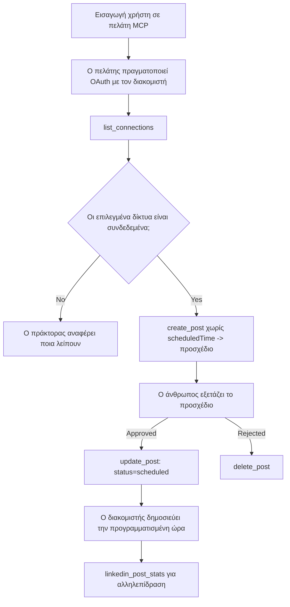

# Μελέτη Περίπτωσης: Δημοσίευση σε Κοινωνικά Δίκτυα από έναν Πράκτορα με Απομακρυσμένο MCP Server

> **Αποποίηση ευθυνών:** Πολλές υπηρεσίες και έργα ανοικτού κώδικα μπορούν να δημοσιεύουν σε κοινωνικά δίκτυα, και μια ομάδα θα μπορούσε επίσης να ενσωματώσει απευθείας το API κάθε δικτύου. Το παρακάτω σενάριο παρέχεται ως ένα παραδειγματικό παράδειγμα του πώς μπορεί να σχεδιαστεί και να καταναλωθεί ένας **απομακρυσμένος MCP server με δυνατότητα εγγραφής**. Το Publora είναι μια εμπορική υπηρεσία με δωρεάν επίπεδο· τα μοτίβα που περιγράφονται εδώ ισχύουν για κάθε MCP server που εκτελεί μη αναιρετές ενέργειες εξ ονόματος χρήστη.

## Επισκόπηση

Οι πράκτορες είναι καλοί στο να διατυπώνουν περιεχόμενο αλλά κακοί στο να το παραδίδουν. Ένα μοντέλο μπορεί να γράψει μια ανακοίνωση κυκλοφορίας σε δευτερόλεπτα, και μετά η δουλειά σταματά: η δημοσίευση σημαίνει ένα API ανά δίκτυο, μια εφαρμογή OAuth ανά δίκτυο, και ένα διαφορετικό σύνολο κανόνων μέσων για το καθένα. Οι περισσότερες ομάδες λύνουν αυτό το ζήτημα αντιγράφοντας το κείμενο χειροκίνητα σε έναν περιηγητή.

Αυτή η μελέτη περίπτωσης εξετάζει πώς κλείνει αυτό το τελευταίο βήμα με έναν μόνο απομακρυσμένο MCP server και — πιο χρήσιμα για όποιον κατασκευάζει έναν — τις σχεδιαστικές αποφάσεις που πρέπει να πάρει ένας **server με δυνατότητα εγγραφής**. Η ανάγνωση δεδομένων συγχωρείται. Η δημοσίευση όχι: μια λανθασμένη κλήση εργαλείου φαίνεται στο κοινό και δεν μπορεί να αναιρεθεί.

## Σενάριο

Μια μικρή ομάδα ανάπτυξης σχέσεων δημιουργεί αναρτήσεις μέσα σε έναν πράκτορα (Claude, VS Code, Cursor — ο πελάτης δεν έχει σημασία). Θέλουν ο πράκτορας να:

- βλέπει ποιοι κοινωνικοί λογαριασμοί έχουν συνδεθεί με την ομάδα,
- δημιουργεί ένα προσχέδιο ανάρτησης και να το κρατά ως προσχέδιο για έγκριση από άνθρωπο,
- επισυνάπτει μια εικόνα,
- προγραμματίζει την ανάρτηση σε διάφορα δίκτυα σε επιλεγμένη ώρα,
- και αργότερα αναφέρει την απόδοσή της.

Σημαντικό: θέλουν ο πράκτορας *να μην μπορεί* να δημοσιεύσει κατά λάθος ενώ ακόμα πειραματίζονται.

## Χρησιμοποιούμενα Εργαλεία

- [Publora MCP Server](https://github.com/publora/mcp-server) — ένας απομακρυσμένος MCP server (`streamable-http`) που εκθέτει εργαλεία δημοσίευσης, προγραμματισμού, μέσων και αναλυτικών στοιχείων LinkedIn. Καταχωρημένος στο επίσημο MCP registry ως `com.publora/mcp-server`.

## Διαδικασία Βήμα-Βήμα

1. **Σύνδεση του server.** Οι πελάτες που υποστηρίζουν OAuth ολοκληρώνουν τη ροή κωδικού εξουσιοδότησης με PKCE μέσω της δικής τους οθόνης συγκατάθεσης· οι πελάτες χωρίς OAuth, όπως CLI χωρίς UI, χρησιμοποιούν κλειδί API Publora στο header. Υποστηρίζονται και οι δύο τρόποι, και ποιος χρησιμοποιείται εξαρτάται από τον πελάτη, όχι από τον server.
2. **Καταγραφή συνδέσεων.** Ο πράκτορας καλεί `list_connections` και λαμβάνει τους συνδεδεμένους λογαριασμούς με τα αναγνωριστικά τους.
3. **Δημιουργία προσχεδίου.** Ο πράκτορας καλεί `create_post` *χωρίς* προγραμματισμένη ώρα. Η ανάρτηση αποθηκεύεται ως προσχέδιο — δεν δημοσιεύεται τίποτα.
4. **Επισύναψη μέσων.** Δημόσιοι URL εικόνων μεταβιβάζονται στην ίδια κλήση· ο server τους κατεβάζει και τους επαληθεύει.
5. **Προγραμματισμός.** Μετά την έγκριση από άνθρωπο, το `update_post` ορίζει την κατάσταση ως προγραμματισμένη με ώρα ISO 8601.
6. **Μέτρηση.** Για το LinkedIn, το `linkedin_post_stats` επιστρέφει αλληλεπίδραση μόλις η ανάρτηση είναι ζωντανή.

## Παράδειγμα Εντολής

```text
Which social accounts do I have connected?
Draft a post announcing our new changelog page, attach the screenshot at
https://example.com/changelog.png, and keep it as a draft — do not publish it.
Once I approve, schedule it to LinkedIn and Bluesky for tomorrow at 09:00 UTC.
```

## Διάγραμμα Ροής Mermaid



## Τεχνική Υλοποίηση

Τα παρακάτω μαθήματα είναι το μεταβιβάσιμο μέρος αυτής της μελέτης περίπτωσης.

### Ανοιχτή ανακάλυψη, αυθεντικοποιημένη εκτέλεση

Το `tools/list` προσφέρεται χωρίς διαπιστευτήρια· κάθε `tools/call` απαιτεί token
και αλλιώς επιστρέφει `401` με header `WWW-Authenticate` που δείχνει στα
μεταδεδομένα του προστατευμένου πόρου. Το legacy endpoint του server απαντά επίσης
σε μη αυθεντικοποιημένο `initialize` για πελάτες σε εκδόσεις προτύπου πριν
από `2026-07-28`; οι τρέχοντες πελάτες δεν χρησιμοποιούν αυτή τη χειραψία.

Αυτός ο server-ειδικός διαχωρισμός επιτρέπει σε μητρώα, καταλόγους και πελάτες να ελέγχουν τα
ονόματα εργαλείων, σχήματα και υποδείξεις χωρίς μυστικό, ενώ εμποδίζει την ανώνυμη
εκτέλεση. Η ανοιχτή ανακάλυψη είναι επιλογή ανάπτυξης, όχι απαίτηση MCP· μια
προστατευμένη ανάπτυξη ίσως απαιτεί εξουσιοδότηση και για το `tools/list`.

### Εγγραφή: δυναμική εγγραφή πελατών, και τι την αντικαθιστά

Ο server διαφημίζει τα `/.well-known/oauth-protected-resource` και `/.well-known/oauth-authorization-server`, και υποστηρίζει τη ροή κωδικού εξουσιοδότησης με PKCE (`S256`), ανανεώσεις token, και **δυναμική εγγραφή πελατών**.

Η δυναμική εγγραφή αφαίρεσε το χειροκίνητο βήμα για παλιούς πελάτες: χωρίς αυτή,
κάθε πελάτης χρειαζόταν προεκδομένο `client_id` από τον προμηθευτή.

Αντιμετωπίστε αυτό ως συμπεριφορά συμβατότητας και όχι ως πρότυπο προς αντιγραφή. Η αναθεώρηση της προδιαγραφής `2026-07-28` αποσύρει τη δυναμική εγγραφή πελατών υπέρ των Client ID Metadata Documents, όπου ο πελάτης φιλοξενεί ένα έγγραφο μεταδεδομένων σε σταθερό URL HTTPS και αυτό το URL *είναι* το `client_id`. Η DCR λειτουργεί προς το παρόν, αλλά ένας server που κατασκευάζεται σήμερα πρέπει να σχεδιάζει για CIMD και να κρατήσει DCR μόνο για παλιούς πελάτες.

### Οι υποδείξεις εργαλείων δεν είναι διακοσμητικές

Κάθε εργαλείο φέρει έναν `τίτλο` και τις σχετικές υποδείξεις: `readOnlyHint`, `destructiveHint`, `idempotentHint`, `openWorldHint`.

Δύο λόγοι για να επενδύσετε σε αυτές. Πρώτον, οι πελάτες χρησιμοποιούν τις υποδείξεις για να αποφασίσουν τι πρέπει να επιβεβαιώσουν με τον χρήστη — ένας πελάτης μπορεί να τρέξει αυτόματα μια αναζήτηση μόνο-ανάγνωσης και να σταματήσει για έγκριση πριν από μια διαγραφή. Η προδιαγραφή είναι σαφής ότι οι υποδείξεις είναι μη αξιόπιστες και όχι μηχανισμός εξουσιοδότησης: διαμορφώνουν τι προτείνει ο πελάτης να κάνει, δεν εμποδίζουν τίποτα στον server, και ο server πρέπει ακόμα να επιβάλει τους δικούς του κανόνες. Δεύτερον, οι σημαντικοί κατάλογοι συνδετήρων πλέον *απαιτούν* αυτές για ανασκόπηση· ένας server που τα εργαλεία του δεν έχουν τίτλους και υποδείξεις θα απορριφθεί ανεξάρτητα από τη λειτουργικότητα.

### Κάντε τα αναγνωριστικά αδύνατα προς επινόηση

Τα αναγνωριστικά πλατφόρμας είναι αδιαφανείς συμβολοσειρές που επιστρέφονται από το `list_connections`, και η περιγραφή του σχήματος λέει ρητά ότι πρέπει να αντιγράφονται αυτούσια και να μην μαντεύονται ποτέ. Ο server απορρίπτει οτιδήποτε άλλο.

Τα μοντέλα έχουν έφεση στις μαντεψιές. Κάθε server με δυνατότητα εγγραφής πρέπει να υποθέτει ότι ένα αναγνωριστικό τελικά θα εφευρεθεί ψευδώς και να κάνει αυτή τη διαδρομή να αποτυγχάνει έντονα και νωρίς, αντί να ενεργεί βάσει μιας εύλογης τιμής.

### Αποτυχία πριν τη δημοσίευση, με μήνυμα που επιτρέπει δράση

Κάποια δίκτυα αρνούνται αναρτήσεις μόνο με κείμενο και απαιτούν εικόνα ή βίντεο. Αυτό επαληθεύεται όταν προγραμματίζεται η ανάρτηση, και το σφάλμα ονομάζει την πλατφόρμα και την ελλείπουσα απαίτηση.

Ο πράκτορας μπορεί να αναρρώσει από το "Το Instagram απαιτεί μέσα — επισυνάψτε μια εικόνα ή βίντεο" χωρίς επιπλέον περιήγηση. Δεν μπορεί να αναρρώσει από ένα γενικό `400`.

### Κάντε τις επαναλήψεις ασφαλείς

Τα δύο εργαλεία που δημιουργούν περιεχόμενο, `create_post` και `update_post`, δέχονται κλειδί αμοιβαιότητας: η επαναχρησιμοποίηση του με πανομοιότυπο αίτημα επαναπαίζει την αρχική απόκριση αντί να δημιουργήσει δεύτερη ανάρτηση. Τα περιβάλλοντα εκτέλεσης των πρακτόρων επαναλαμβάνουν σε περιπτώσεις χρονοδιακοπών· χωρίς αμοιβαιότητα, μια αργή απάντηση γίνεται διπλή δημοσίευση. Τα υπόλοιπα εργαλεία εγγραφής — διαγραφές, βήματα μέσων, αντιδράσεις και σχόλια LinkedIn — δεν δέχονται τέτοιο κλειδί, οπότε μια επανάληψη δεν είναι αυτόματα ασφαλής. Αξίζει να γνωρίζετε ποιες από τις δικές σας μεταβολές προστατεύονται και ποιες όχι.

### Παρέχετε έναν τρόπο δοκιμής που δεν δημοσιεύει τίποτα

Ο server δέχεται έναν κρατημένο προορισμό, `publora-playground`, ο οποίος επαληθεύεται και αναγνωρίζεται σαν πραγματικός προορισμός και μετά απορρίπτεται — τίποτα δεν φτάνει σε ζωντανό λογαριασμό. Περιγράφεται στο ίδιο το σχήμα του εργαλείου, το οποίο οποιοσδήποτε πελάτης μπορεί να διαβάσει χωρίς διαπιστευτήρια: το πεδίο `platforms` του `create_post` το προσδιορίζει ως "στόχο δοκιμής σύνδεσης που δεν απαιτεί πραγματική σύνδεση — η ανάρτηση αναγνωρίζεται και απορρίπτεται, τίποτα δεν δημοσιεύεται". Καλείται περνώντας το ως το μόνο στοιχείο: `platforms: ["publora-playground"]`.

Αυτό αποδείχθηκε μία από τις πιο χρήσιμες λεπτομέρειες ολόκληρης της επιφάνειας. Οι κριτές των καταλόγων συνδετήρων, οι συνεισφέροντες και το CI μπορούν να εκτελέσουν ολόκληρη τη διαδρομή εγγραφής από άκρο σε άκρο χωρίς κίνδυνο για πραγματικό κοινό. Κάθε MCP server με μη αναστρέψιμες ενέργειες ωφελείται από έναν τεκμηριωμένο στόχο που δεν κάνει τίποτα.

## Αποτελέσματα και Επιπτώσεις

- Το βήμα δημοσίευσης μεταφέρθηκε από περιηγητή στην ίδια συνομιλία όπου γράφεται το περιεχόμενο, και η συνήθεια πρώτα του προσχεδίου κρατά άνθρωπο στη ροή. Να είστε ακριβείς για το τι είναι αυτό: ένα προσχέδιο είναι μια σύμβαση, όχι ένα όριο. Το ίδιο διαπιστευτήριο μπορεί να προγραμματίσει ή να δημοσιεύσει, οπότε όποιος χρειάζεται πραγματική πύλη έγκρισης πρέπει να την επιβάλει εκτός της επιφάνειας εργαλείου — ξεχωριστά διαπιστευτήρια, ή ένα επίπεδο πολιτικής μπροστά από τον server.
- Οι διαφορές ανά δίκτυο — απαιτήσεις μέσων, νήμα αναρτήσεων, έλεγχοι απάντησης — χειρίζονται κατά ένα μόνο server αντί σε κάθε πράκτορα που συνομιλεί μαζί του.
- Ο ίδιος server υποστηρίζει πολλούς πελάτες MCP χωρίς προεκδομένα διαπιστευτήρια.
    Οι τρέχοντες πελάτες μπορούν να χρησιμοποιούν Client ID Metadata Documents· η DCR παραμένει εφεδρεία
    για παλιότερους πελάτες.
- Οι παραπάνω σχεδιαστικοί περιορισμοί διαμορφώθηκαν τόσο από ανασκοπήσεις καταλόγων συνδετήρων όσο και από τους χρήστες: οι υποδείξεις, το OAuth και ένας ασφαλής στόχος δοκιμής απαιτήθηκαν από τουλάχιστον έναν από αυτούς.

## Αναφορές

- [Publora MCP Server (πηγή)](https://github.com/publora/mcp-server)
- [Τεκμηρίωση API και MCP Publora](https://docs.publora.com)
- [Καταχώρηση MCP στο Registry: `com.publora/mcp-server`](https://registry.modelcontextprotocol.io/v0/servers?search=com.publora/mcp-server)
- [Προδιαγραφή MCP — Εξουσιοδότηση](https://modelcontextprotocol.io/specification/2026-07-28/basic/authorization)
- [Προδιαγραφή MCP — Υποδείξεις εργαλείων](https://modelcontextprotocol.io/docs/concepts/tools)

## Τι Ακολουθεί

- Πάρτε έναν MCP server που κατασκευάζετε και ελέγξτε τις τρεις πιο φθηνές νίκες εδώ: υποδείξεις σε κάθε εργαλείο, κλειδί αμοιβαιότητας σε κάθε εγγραφή, και τεκμηριωμένο στόχο no-op.
- Δοκιμάστε το διαχωρισμό ανοιχτής ανακάλυψης: καλέστε `tools/list` σε δημόσιο απομακρυσμένο server χωρίς διαπιστευτήρια, μετά καλέστε ένα εργαλείο και ελέγξτε το `401` μήνυμα.
- Σκεφτείτε τι σημαίνει το "αναιρώ" για τον τομέα σας. Η δημοσίευση έχει προσχέδια και διαγραφή· αν οι ενέργειές σας δεν έχουν ισοδύναμο, η επιβεβαίωση πρέπει να είναι στο σχεδιασμό εργαλείου, όχι στην εντολή.

---

<!-- CO-OP TRANSLATOR DISCLAIMER START -->
**Αποποίηση ευθυνών**:
Αυτό το έγγραφο έχει μεταφραστεί χρησιμοποιώντας την υπηρεσία μετάφρασης με τεχνητή νοημοσύνη [Co-op Translator](https://github.com/Azure/co-op-translator). Ενώ επιδιώκουμε την ακρίβεια, παρακαλούμε να έχετε υπόψη ότι οι αυτοματοποιημένες μεταφράσεις ενδέχεται να περιέχουν λάθη ή ανακρίβειες. Το πρωτότυπο έγγραφο στη μητρική του γλώσσα πρέπει να θεωρείται η αυθεντική πηγή. Για κρίσιμες πληροφορίες, συνιστάται επαγγελματική ανθρώπινη μετάφραση. Δεν φέρουμε ευθύνη για τυχόν παρεξηγήσεις ή λανθασμένες ερμηνείες που προκύπτουν από τη χρήση αυτής της μετάφρασης.
<!-- CO-OP TRANSLATOR DISCLAIMER END -->