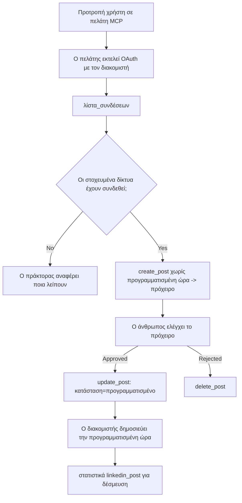

# Μελέτη Περίπτωσης: Δημοσίευση σε Κοινωνικά Δίκτυα από έναν Agent με Απομακρυσμένο MCP Server

> **Αποποίηση:** Διάφορες υπηρεσίες και έργα ανοιχτού κώδικα μπορούν να δημοσιεύουν σε κοινωνικά δίκτυα, και μια ομάδα θα μπορούσε επίσης να ενσωματώσει απευθείας το API κάθε δικτύου. Το παρακάτω σενάριο παρέχεται ως ένα δείγμα εργασίας του πώς μπορεί να σχεδιαστεί και να καταναλωθεί ένας **απομακρυσμένος MCP server με δυνατότητα εγγραφής**. Το Publora είναι μια εμπορική υπηρεσία με δωρεάν επίπεδο. Τα προτύπα που περιγράφονται εδώ εφαρμόζονται σε οποιονδήποτε MCP server εκτελεί μη αναστρέψιμες ενέργειες εκ μέρους ενός χρήστη.

## Επισκόπηση

Οι agents είναι καλοί στο να συντάσσουν περιεχόμενο και κακοί στην παράδοσή του. Ένα μοντέλο μπορεί να γράψει μια ανακοίνωση κυκλοφορίας σε δευτερόλεπτα, και μετά η δουλειά σταματά: η δημοσίευση σημαίνει ένα API ανά δίκτυο, μια εφαρμογή OAuth ανά δίκτυο, και ένα διαφορετικό σύνολο κανόνων μέσων για το καθένα. Οι περισσότερες ομάδες λύνουν αυτό το πρόβλημα αντιγράφοντας το κείμενο χειροκίνητα σε ένα πρόγραμμα περιήγησης.

Αυτή η μελέτη περίπτωσης εξετάζει πώς κλείνει το τελευταίο βήμα με έναν απομακρυσμένο MCP server, και — πιο χρήσιμο για όσους κατασκευάζουν έναν — ποιες σχεδιαστικές αποφάσεις πρέπει να λάβει σωστά ένας **server με δυνατότητα εγγραφής**. Η ανάγνωση δεδομένων είναι επιεικής. Η δημοσίευση δεν είναι: μια λάθος κλήση εργαλείου είναι ορατή σε κοινό και δεν μπορεί να αναιρεθεί.

## Σενάριο

Μια μικρή ομάδα developer-relations συντάσσει αναρτήσεις μέσα σε έναν agent (Claude, VS Code, Cursor — ο πελάτης δεν έχει σημασία). Θέλουν ο agent να:

- δει ποιοι κοινωνικοί λογαριασμοί έχουν συνδεθεί με την ομάδα,
- συντάξει μια ανάρτηση και να την κρατήσει ως προσχέδιο προς έγκριση από άνθρωπο,
- επισυνάψει μια εικόνα,
- προγραμματίσει την ανάρτηση σε διάφορα δίκτυα σε επιλεγμένη ώρα,
- και αργότερα να αναφέρει την απόδοσή της.

Απολύτως σημαντικό, θέλουν ο agent να μην μπορεί να δημοσιεύσει ακούσια ενώ ακόμα πειραματίζονται.

## Χρησιμοποιούμενα Εργαλεία

- [Publora MCP Server](https://github.com/publora/mcp-server) — ένας απομακρυσμένος MCP server (`streamable-http`) που εκθέτει εργαλεία δημοσίευσης, προγραμματισμού, μέσων και στατιστικών LinkedIn. Καταχωρημένος στο επίσημο μητρώο MCP ως `com.publora/mcp-server`.

## Βήμα-βήμα Ροή Εργασίας

1. **Σύνδεση του server.** Οι πελάτες που υποστηρίζουν OAuth ολοκληρώνουν τη ροή κωδικού εξουσιοδότησης με PKCE μέσω της σελίδας συγκατάθεσης του server· clients που δεν το κάνουν, όπως headless CLI, χρησιμοποιούν API κλειδί Publora σε header. Και οι δύο διαδρομές υποστηρίζονται, και ποια θα λάβετε εξαρτάται από τον πελάτη, όχι από τον server.
2. **Λίστα συνδέσεων.** Ο agent καλεί `list_connections` και λαμβάνει τους συνδεδεμένους λογαριασμούς με τους αναγνωριστικούς τους κωδικούς.
3. **Σύνταξη.** Ο agent καλεί `create_post` *χωρίς* προγραμματισμένη ώρα. Η ανάρτηση αποθηκεύεται ως προσχέδιο — δεν δημοσιεύεται τίποτα.
4. **Επισύναψη μέσων.** Δημόσια URL εικόνων περνώνται στην ίδια κλήση· ο server τα κατεβάζει και τα εξακρίβωσε.
5. **Προγραμματισμός.** Μετά από έγκριση ανθρώπου, το `update_post` ορίζει την κατάσταση σε προγραμματισμένη με ώρα ISO 8601.
6. **Μέτρηση.** Για το LinkedIn, το `linkedin_post_stats` επιστρέφει αλληλεπίδραση μόλις η ανάρτηση είναι ενεργή.

## Παράδειγμα Εντολής

```text
Which social accounts do I have connected?
Draft a post announcing our new changelog page, attach the screenshot at
https://example.com/changelog.png, and keep it as a draft — do not publish it.
Once I approve, schedule it to LinkedIn and Bluesky for tomorrow at 09:00 UTC.
```

## Διάγραμμα Ροής Mermaid



## Τεχνική Υλοποίηση

Τα παρακάτω μαθήματα είναι το μεταφερόμενο μέρος αυτής της μελέτης περίπτωσης.

### Ανοιχτό discovery, εκτέλεση με ταυτότητα

Το `tools/list` εξυπηρετείται χωρίς διαπιστευτήρια· κάθε `tools/call` απαιτεί token και σε άλλη περίπτωση επιστρέφει `401` με header `WWW-Authenticate` που δείχνει τα metadata προστατευμένου πόρου. (Ο server απαντά επίσης σε μη αυθεντικοποιημένο `initialize`, που αφορά πελάτες σε εκδόσεις πρωτοκόλλου πριν την `2026-07-28`, όπου αφαιρέθηκε εντελώς το handshake.)

Αυτή η διάσπαση έχει σημασία στην πράξη. Τα μητρώα, κατάλογοι και clients μπορούν να αναλυθούν επιφανειακά — ονόματα, δομές, σχολιασμοί — χωρίς να έχουν μυστικό, αλλά τίποτα δεν μπορεί να *εκτελεστεί* ανώνυμα. Ένας server που απαιτεί token για `initialize` είναι πρακτικά αόρατος για εργαλεία· ένας server που επιτρέπει ανώνυμο `tools/call` είναι ευπάθεια.

### Εγγραφή: δυναμική εγγραφή πελάτη, και η αντικατάστασή της

Ο server δημοσιεύει τα `/.well-known/oauth-protected-resource` και `/.well-known/oauth-authorization-server`, και υποστηρίζει τη ροή κωδικού εξουσιοδότησης με PKCE (`S256`), refresh tokens, και **δυναμική εγγραφή πελάτη**.

Η δυναμική εγγραφή αφαιρεί το χειροκίνητο βήμα: χωρίς αυτήν κάθε client χρειάζεται ένα προεκχωρημένο `client_id`, που σημαίνει εκτός-ζώνης αίτημα προς τον προμηθευτή για κάθε νέο client.

Αντιμετωπίστε αυτό ως συμπεριφορά συμβατότητας αντί για σχέδιο προς αντιγραφή. Η αναθεώρηση `2026-07-28` της προδιαγραφής καταργεί τη δυναμική εγγραφή υπέρ των Client ID Metadata Documents, όπου ο πελάτης φιλοξενεί ένα έγγραφο μεταδεδομένων σε σταθερό URL HTTPS και αυτό το URL *είναι* το `client_id`. Το DCR συνεχίζει να λειτουργεί προς το παρόν, αλλά ένας server υπό κατασκευή σήμερα πρέπει να σχεδιάζει για CIMD και να κρατήσει το DCR μόνο για παλαιότερους clients.

### Οι σχολιασμοί εργαλείων δεν είναι διακόσμηση

Κάθε εργαλείο φέρει έναν `title` και τις εφαρμόσιμες υποδείξεις: `readOnlyHint`, `destructiveHint`, `idempotentHint`, `openWorldHint`.

Δύο λόγοι για να επενδύσετε σε αυτές. Πρώτον, οι clients χρησιμοποιούν τις υποδείξεις για να αποφασίσουν τι πρέπει να επιβεβαιωθεί με τον χρήστη — ένας client μπορεί να κάνει αυτόματη αναζήτηση μόνο για ανάγνωση και να σταματήσει για έγκριση πριν διαγράψει. Η προδιαγραφή δηλώνει ρητά ότι οι σχολιασμοί είναι αμετάβλητες υποδείξεις, όχι μηχανισμός εξουσιοδότησης: διαμορφώνουν τι προσφέρει να κάνει ένας client, δεν σταματούν τίποτα στον server, και ο server πρέπει να επιβάλλει τους δικούς του κανόνες. Δεύτερον, οι σημαντικοί κατάλογοι συνδέσεων απαιτούν πλέον *υποχρεωτικά* αυτούς για την αξιολόγηση· ένας server που λείπουν τίτλοι και υποδείξεις θα απορριφθεί ανεξάρτητα από την απόδοσή του.

### Κάντε τα αναγνωριστικά αδύνατα να εφευρεθούν

Τα αναγνωριστικά πλατφόρμας είναι αδιαφανείς συμβολοσειρές που επιστρέφονται από `list_connections`, και η περιγραφή του σχήματος λέει ρητά ότι πρέπει να αντιγραφούν ακριβώς και ποτέ να μην μαντευτούν. Ο server απορρίπτει οτιδήποτε άλλο.

Τα μοντέλα είναι επιδέξια στο να μαντεύουν. Οποιοσδήποτε server με δυνατότητα εγγραφής πρέπει να υποθέτει ότι ένα αναγνωριστικό θα παραισθήσει κάποια στιγμή και να κάνει αυτό το μονοπάτι να αποτύχει έντονα και νωρίς, αντί να ενεργήσει βάσει μιας πιθανής τιμής.

### Αποτύχετε πριν τη δημοσίευση, με μηνύματα τεκμηριωμένα

Κάποια δίκτυα αρνούνται δημοσιεύσεις μόνο κειμένου και απαιτούν εικόνα ή βίντεο. Αυτό επαληθεύεται κατά τον προγραμματισμό της ανάρτησης, και το σφάλμα ονομάζει την πλατφόρμα και την ελλείπουσα απαίτηση.

Ένας agent μπορεί να ανακάμψει από "Το Instagram απαιτεί μέσα — επισυνάψτε μια εικόνα ή ένα βίντεο" χωρίς άλλη επιστροφή. Δεν μπορεί να ανακάμψει από ένα γενικό `400`.

### Κάντε τις επαναλήψεις ασφαλείς

Τα δύο εργαλεία που δημιουργούν περιεχόμενο, `create_post` και `update_post`, αποδέχονται ένα κλειδί επαναληψιμότητας: η επανάχρηση αυτού με το ίδιο αίτημα αναπαράγει την αρχική απάντηση αντί να δημιουργήσει δεύτερη ανάρτηση. Τα περιβάλλοντα agent επιχειρούν επανάληψη σε χρονικά όρια; χωρίς επαναληψιμότητα, μια αργή απόκριση γίνεται διπλή δημοσίευση. Τα άλλα εργαλεία εγγραφής — διαγραφές, βήματα μέσων, αντιδράσεις και σχόλια LinkedIn — δεν αποδέχονται, οπότε η επανάληψη εκεί δεν είναι αυτόματα ασφαλής. Αξίζει να ξέρετε ποιες δικές σας μεταβολές προστατεύονται και ποιες όχι.

### Παρέχετε τρόπο να δοκιμάσετε χωρίς να δημοσιεύει τίποτα

Ο server αποδέχεται έναν κρατημένο προορισμό, `publora-playground`, που επαληθεύεται και αναγνωρίζεται όπως ένας πραγματικός προορισμός και μετά απορρίπτεται — τίποτα δεν φτάνει σε ζωντανό λογαριασμό. Περιγράφεται στο ίδιο το σχήμα εργαλείου, το οποίο οποιοσδήποτε πελάτης μπορεί να διαβάσει χωρίς διαπιστευτήρια: το πεδίο `platforms` του `create_post` το τεκμηριώνει ως "στόχος δοκιμής σύνδεσης που δεν απαιτεί πραγματική σύνδεση — η ανάρτηση αναγνωρίζεται και απορρίπτεται, δεν δημοσιεύεται τίποτα". Καλείται περνώντας το ως μοναδική καταχώρηση: `platforms: ["publora-playground"]`.

Αυτό αποδείχθηκε ένα από τα πιο χρήσιμα στοιχεία όλης της επιφάνειας. Κριτές καταλόγων συνδέσεων, συνεισφέροντες και CI μπορούν να εκτελέσουν ολόκληρη τη διαδρομή εγγραφής από άκρο σε άκρο χωρίς κίνδυνο για πραγματικό κοινό. Κάθε MCP server με μη αναστρέψιμες ενέργειες ωφελείται από έναν τεκμηριωμένο στόχο χωρίς λειτουργία.

## Αποτελέσματα και Επιπτώσεις

- Το βήμα δημοσίευσης μεταφέρθηκε από πρόγραμμα περιήγησης στην ίδια συνομιλία όπου γράφεται το περιεχόμενο, με συνήθεια πρώτα προσχεδίου που κρατά άνθρωπο εντός της διαδικασίας. Να είστε ακριβείς για το τι σημαίνει αυτό: ένα προσχέδιο είναι μια σύμβαση, όχι όριο. Η ίδια διαπίστευση μπορεί να προγραμματίσει ή να δημοσιεύσει, οπότε όποιος χρειάζεται πραγματική πύλη έγκρισης πρέπει να την επιβάλει εκτός της επιφάνειας εργαλείων — ξεχωριστά διαπιστευτήρια ή ένα επίπεδο πολιτικής μπροστά από τον server.
- Οι διαφορές ανά δίκτυο — απαιτήσεις μέσων, threading, έλεγχοι απάντησης — χειρίζονται μία φορά στον server αντί σε κάθε agent που συνδέεται.
- Ο ίδιος server υποστηρίζει αρκετούς MCP clients χωρίς δουλειά ανά client, γιατί το discovery είναι ανοιχτό και η εγγραφή δυναμική.
- Οι σχεδιαστικοί περιορισμοί παραπάνω διαμορφώθηκαν τόσο από αξιολογήσεις καταλόγων συνδέσεων όσο και από χρήστες: σχολιασμοί, OAuth και ασφαλής στόχος δοκιμής απαιτήθηκαν προκειμένου από αυτούς.

## Αναφορές

- [Publora MCP Server (πηγή)](https://github.com/publora/mcp-server)
- [Τεκμηρίωση API και MCP Publora](https://docs.publora.com)
- [Καταχώρηση MCP: `com.publora/mcp-server`](https://registry.modelcontextprotocol.io/v0/servers?search=com.publora/mcp-server)
- [Προδιαγραφή MCP — Εξουσιοδότηση](https://modelcontextprotocol.io/specification/draft/basic/authorization)
- [Προδιαγραφή MCP — Σχολιασμοί εργαλείων](https://modelcontextprotocol.io/docs/concepts/tools)

## Τι Ακολουθεί

- Πάρτε έναν MCP server που χτίζετε και ελέγξτε τα τρία πιο φτηνά κέρδη εδώ: σχολιασμοί σε κάθε εργαλείο, κλειδί επαναληψιμότητας σε κάθε εγγραφή, και τεκμηριωμένος στόχος χωρίς λειτουργία.
- Δοκιμάστε τη διαίρεση ανοιχτού discovery: καλέστε `tools/list` σε έναν δημόσιο απομακρυσμένο server χωρίς διαπιστευτήρια, μετά καλέστε ένα εργαλείο και εξετάστε το πρόκληση `401`.
- Σκεφτείτε τι σημαίνει «αναίρεση» για τον τομέα σας. Η δημοσίευση έχει προσχέδια και διαγραφή· αν οι ενέργειές σας δεν έχουν ισοδύναμο, η επιβεβαίωση πρέπει να συμπεριλαμβάνεται στο σχεδιασμό εργαλείου, όχι στην εντολή.

---

<!-- CO-OP TRANSLATOR DISCLAIMER START -->
**Αποποίηση ευθυνών**:
Αυτό το έγγραφο έχει μεταφραστεί χρησιμοποιώντας την υπηρεσία μετάφρασης με τεχνητή νοημοσύνη [Co-op Translator](https://github.com/Azure/co-op-translator). Ενώ επιδιώκουμε την ακρίβεια, παρακαλούμε να έχετε υπόψη ότι οι αυτοματοποιημένες μεταφράσεις ενδέχεται να περιέχουν λάθη ή ανακρίβειες. Το πρωτότυπο έγγραφο στη μητρική του γλώσσα πρέπει να θεωρείται η αυθεντική πηγή. Για κρίσιμες πληροφορίες, συνιστάται επαγγελματική ανθρώπινη μετάφραση. Δεν φέρουμε ευθύνη για τυχόν παρεξηγήσεις ή λανθασμένες ερμηνείες που προκύπτουν από τη χρήση αυτής της μετάφρασης.
<!-- CO-OP TRANSLATOR DISCLAIMER END -->