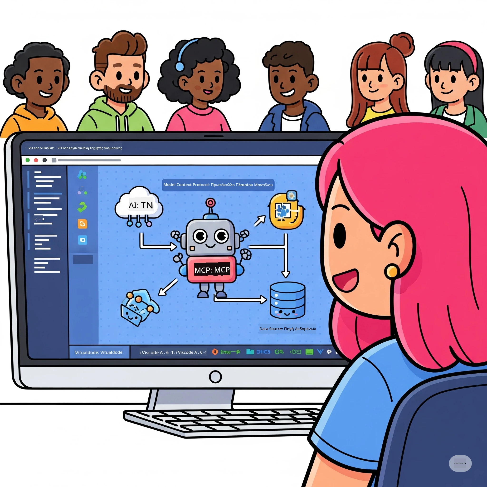
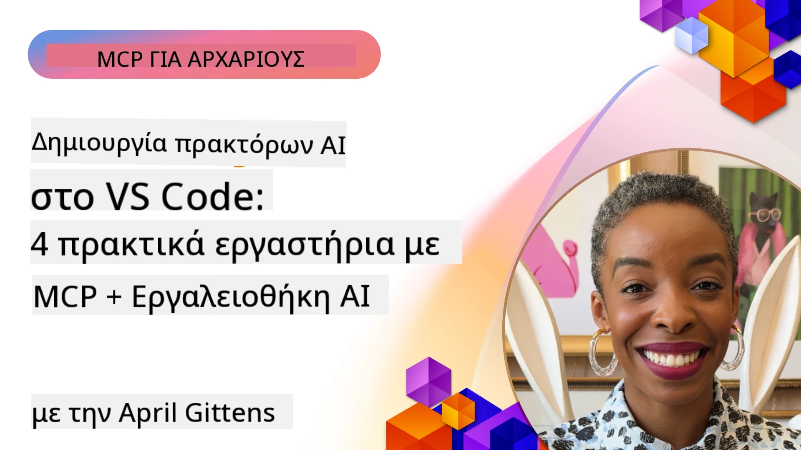

# Απλοποίηση Ροών Εργασίας AI: Δημιουργία MCP Server με το Microsoft Foundry Toolkit

## 🎯 Επισκόπηση

_(Κάντε κλικ στην εικόνα παραπάνω για να δείτε το βίντεο αυτού του μαθήματος)_

Καλώς ήρθατε στο **Model Context Protocol (MCP) Workshop**! Αυτό το ολοκληρωμένο εργαστήριο με πρακτική εξάσκηση συνδυάζει δύο σύγχρονες τεχνολογίες για να φέρει επανάσταση στην ανάπτυξη εφαρμογών AI:

> **Σημείωση συμβατότητας:** ο κώδικας του εργαστηρίου δημιουργήθηκε και δοκιμάστηκε με το MCP
> `2025-11-25`, όπως φαίνεται στο σήμα παραπάνω. Χρησιμοποιήστε τη
> [τρέχουσα προδιαγραφή `2026-07-28`](https://modelcontextprotocol.io/specification/2026-07-28/)
> για νέες υλοποιήσεις πρωτοκόλλου και αναθεωρήστε τις σημειώσεις κυκλοφορίας του SDK πριν
> μεταφέρετε τα εργαστήρια.

- **🔗 Model Context Protocol (MCP)**: Ένα ανοιχτό πρότυπο για απρόσκοπτη ενσωμάτωση εργαλείων AI
- **🛠️ Microsoft Foundry Toolkit Extension για VS Code**: Η ισχυρή επέκταση ανάπτυξης AI της Microsoft

### 🎓 Τι θα μάθετε

Μέχρι το τέλος αυτού του εργαστηρίου, θα κυριαρχήσετε στην τέχνη της δημιουργίας έξυπνων εφαρμογών που γεφυρώνουν τα μοντέλα AI με πραγματικά εργαλεία και υπηρεσίες. Από αυτοματοποιημένες δοκιμές μέχρι προσαρμοσμένες ενσωματώσεις API, θα αποκτήσετε πρακτικές δεξιότητες για να λύσετε σύνθετες επιχειρηματικές προκλήσεις.

## 🏗️ Τεχνολογικό Υπόβαθρο

### 🔌 Model Context Protocol (MCP)

Το MCP είναι το **"USB-C για την AI"** - ένα καθολικό πρότυπο που συνδέει τα μοντέλα AI με εξωτερικά εργαλεία και πηγές δεδομένων.

**✨ Βασικά Χαρακτηριστικά:**

- 🔄 **Τυποποιημένη Ενσωμάτωση**: Καθολική διεπαφή για συνδέσεις AI-εργαλείων
- 🏛️ **Ευέλικτη Αρχιτεκτονική**: Τοπικοί και απομακρυσμένοι διακομιστές μέσω stdio/SSE μεταφοράς
- 🧰 **Πλούσιο Οικοσύστημα**: Εργαλεία, εντολές, και πόροι σε ένα πρωτόκολλο
- 🔒 **Έτοιμο για Επιχειρήσεις**: Ενσωματωμένη ασφάλεια και αξιοπιστία

**🎯 Γιατί είναι σημαντικό το MCP:**
Όπως το USB-C εξαφάνισε το χάος καλωδίων, το MCP αφαιρεί την πολυπλοκότητα των ενσωματώσεων AI. Ένα πρωτόκολλο, απεριόριστες δυνατότητες.

### 🤖 Microsoft Foundry Toolkit Extension για VS Code

Η σημαία της Microsoft στην επέκταση ανάπτυξης AI που μετατρέπει το VS Code σε μια ισχυρή πλατφόρμα AI.

**🚀 Κύριες Δυνατότητες:**

- 📦 **Κατάλογος Μοντέλων**: Πρόσβαση σε μοντέλα από Azure AI, GitHub, Hugging Face, Ollama
- ⚡ **Τοπική Ερμηνεία**: Εκτέλεση optimized ONNX για CPU/GPU/NPU
- 🏗️ **Agent Builder**: Οπτική ανάπτυξη ενστικτώδη AI agent με ενσωμάτωση MCP
- 🎭 **Πολλαπλή Λειτουργικότητα**: Υποστήριξη κειμένου, εικόνας και δομημένης εξόδου

**💡 Οφέλη στην Ανάπτυξη:**

- Ανάπτυξη μοντέλου χωρίς ρυθμίσεις
- Οπτική δημιουργία προτροπών (prompts)
- Πεδίο δοκιμών σε πραγματικό χρόνο
- Απρόσκοπτη ενσωμάτωση MCP server

## 📚 Διαδρομή Μάθησης

### [🚀 Ενότητα 1: Βασικά Microsoft Foundry Toolkit](./lab1/README.md)

**Διάρκεια**: 15 λεπτά

- 🛠️ Εγκατάσταση και διαμόρφωση Microsoft Foundry Toolkit για VS Code
- 🗂️ Εξερεύνηση του Καταλόγου Μοντέλων (πάνω από 100 μοντέλα από GitHub, ONNX, OpenAI, Anthropic, Google)
- 🎮 Εξοικείωση με το Interactive Playground για δοκιμές μοντέλων σε πραγματικό χρόνο
- 🤖 Δημιουργία του πρώτου AI agent με το Agent Builder
- 📊 Αξιολόγηση της απόδοσης μοντέλου με ενσωματωμένους δείκτες (F1, συνάφεια, ομοιότητα, συνοχή)
- ⚡ Μάθηση δυνατοτήτων batch processing και πολυμορφικής υποστήριξης

**🎯 Αποτέλεσμα Μάθησης**: Δημιουργία λειτουργικού AI agent με πλήρη κατανόηση των δυνατοτήτων του Microsoft Foundry Toolkit

### [🌐 Ενότητα 2: MCP με Microsoft Foundry Toolkit Βασικά](./lab2/README.md)

**Διάρκεια**: 20 λεπτά

- 🧠 Κυριαρχία στην αρχιτεκτονική και τις έννοιες του Model Context Protocol (MCP)
- 🌐 Εξερεύνηση του οικοσυστήματος Microsoft MCP server
- 🤖 Δημιουργία agent αυτοματισμού browser με χρήση Playwright MCP server
- 🔧 Ενσωμάτωση MCP servers με τον Agent Builder του Microsoft Foundry Toolkit
- 📊 Διαμόρφωση και δοκιμή εργαλείων MCP μέσα στους agents σας
- 🚀 Εξαγωγή και ανάπτυξη agents με ισχύ MCP για παραγωγική χρήση

**🎯 Αποτέλεσμα Μάθησης**: Ανάπτυξη AI agent με ενισχυμένη λειτουργικότητα μέσω εξωτερικών εργαλείων μέσω MCP

### [🔧 Ενότητα 3: Προχωρημένη Ανάπτυξη MCP με Microsoft Foundry Toolkit](./lab3/README.md)

**Διάρκεια**: 20 λεπτά

- 💻 Δημιουργία προσαρμοσμένων MCP servers χρησιμοποιώντας το Microsoft Foundry Toolkit
- 🐍 Διαμόρφωση και χρήση του τελευταίου MCP Python SDK (v1.9.3)
- 🔍 Εγκατάσταση και χρήση MCP Inspector για debugging
- 🛠️ Δημιουργία Weather MCP Server με επαγγελματικές ροές εργασίας debugging
- 🧪 Debugging σε MCP servers τόσο σε περιβάλλον Agent Builder όσο και Inspector

**🎯 Αποτέλεσμα Μάθησης**: Ανάπτυξη και debugging προσαρμοσμένων MCP servers με σύγχρονα εργαλεία

### [🐙 Ενότητα 4: Πρακτική Ανάπτυξη MCP - Προσαρμοσμένος GitHub Clone Server](./lab4/README.md)

**Διάρκεια**: 30 λεπτά

- 🏗️ Δημιουργία πραγματικού GitHub Clone MCP Server για ροές εργασίας ανάπτυξης
- 🔄 Υλοποίηση έξυπνης κλωνοποίησης αποθετηρίου με επικύρωση και χειρισμό σφαλμάτων
- 📁 Δημιουργία ευφυούς διαχείρισης καταλόγων και ενσωμάτωση με VS Code
- 🤖 Χρήση GitHub Copilot Agent Mode με προσαρμοσμένα εργαλεία MCP
- 🛡️ Εφαρμογή αξιοπιστίας και συμβατότητας μεταξύ πλατφορμών έτοιμη για παραγωγή

**🎯 Αποτέλεσμα Μάθησης**: Ανάπτυξη MCP server έτοιμου για παραγωγική χρήση που απλοποιεί τις πραγματικές ροές εργασίας ανάπτυξης

## 💡 Εφαρμογές & Επιπτώσεις στον Πραγματικό Κόσμο

### 🏢 Επιχειρησιακές Χρήσεις

#### 🔄 Αυτοματισμός DevOps

Μεταμορφώστε τη ροή εργασίας ανάπτυξης με έξυπνο αυτοματισμό:

- **Έξυπνη Διαχείριση Αποθετηρίων**: Επανεξέταση κώδικα και αποφάσεις συγχώνευσης με AI
- **Έξυπνο CI/CD**: Αυτόματη βελτιστοποίηση pipeline βάσει αλλαγών κώδικα
- **Διαλογή Θεμάτων**: Αυτόματη ταξινόμηση και ανάθεση σφαλμάτων

#### 🧪 Επανάσταση Ποιοτικού Ελέγχου

Αναβαθμίστε τις δοκιμές με αυτοματισμό υποβοηθούμενο από AI:

- **Έξυπνη Δημιουργία Δοκιμαστικών Σετ**: Δημιουργία ολοκληρωμένων δοκιμών αυτόματα
- **Οπτικός Έλεγχος Υποβάθμισης**: Ανίχνευση αλλαγών UI με AI
- **Παρακολούθηση Απόδοσης**: Προληπτική ανίχνευση και επίλυση προβλημάτων

#### 📊 Νοημοσύνη Ροών Δεδομένων

Δημιουργήστε πιο έξυπνες ροές δεδομένων:

- **Προσαρμοσμένες Διαδικασίες ETL**: Αυτοβελτιστοποιούμενοι μετασχηματισμοί δεδομένων
- **Ανίχνευση Ανωμαλιών**: Παρακολούθηση ποιότητας δεδομένων σε πραγματικό χρόνο
- **Έξυπνη Κατεύθυνση**: Έξυπνη διαχείριση ροής δεδομένων

#### 🎧 Βελτίωση Εμπειρίας Πελάτη

Δημιουργήστε εξαιρετικές αλληλεπιδράσεις με πελάτες:

- **Υποστήριξη Ενημερωμένη με Πλαίσιο**: AI agents με πρόσβαση στο ιστορικό πελάτη
- **Προληπτική Επίλυση Ζητημάτων**: Προβλεπτική εξυπηρέτηση πελατών
- **Πολυκαναλική Ενσωμάτωση**: Ενιαία εμπειρία AI σε όλες τις πλατφόρμες

## 🛠️ Προαπαιτούμενα & Ρύθμιση

### 💻 Απαιτήσεις Συστήματος

| Συστατικό | Απαίτηση | Σημειώσεις |
|-----------|-------------|-------|
| **Λειτουργικό Σύστημα** | Windows 10+, macOS 10.15+, Linux | Οποιοδήποτε σύγχρονο λειτουργικό |
| **Visual Studio Code** | Τελευταία σταθερή έκδοση | Απαραίτητο για Microsoft Foundry Toolkit |
| **Node.js** | v18.0+ και npm | Για ανάπτυξη MCP server |
| **Python** | 3.10+ | Προαιρετικό για MCP servers σε Python |
| **Μνήμη** | Ελάχιστο 8GB RAM | Συνιστάται 16GB για τοπικά μοντέλα |

### 🔧 Περιβάλλον Ανάπτυξης

#### Συνιστώμενες Επεκτάσεις VS Code

- **Microsoft Foundry Toolkit** (ms-windows-ai-studio.windows-ai-studio)
- **Python** (ms-python.python)
- **Python Debugger** (ms-python.debugpy)
- **GitHub Copilot** (GitHub.copilot) - Προαιρετικό αλλά χρήσιμο

#### Προαιρετικά Εργαλεία

- **uv**: Σύγχρονος διαχειριστής πακέτων Python
- **MCP Inspector**: Οπτικό εργαλείο debugging για MCP servers
- **Playwright**: Για παραδείγματα αυτοματισμού ιστού

## 🎖️ Αποτέλεσμα Μάθησης & Διαδρομή Πιστοποίησης

### 🏆 Πίνακας Ελέγχου Δεξιοτήτων

Με την ολοκλήρωση αυτού του εργαστηρίου, θα αποκτήσετε δεξιότητες σε:

#### 🎯 Βασικές Ικανότητες

- [ ] **Κυριαρχία στο Πρωτόκολλο MCP**: Βαθιά κατανόηση αρχιτεκτονικής και προτύπων υλοποίησης
- [ ] **Επάρκεια στο Microsoft Foundry Toolkit**: Χρήση επιπέδου ειδικού για γρήγορη ανάπτυξη
- [ ] **Ανάπτυξη Προσαρμοσμένων Διακομιστών**: Δημιουργία, ανάπτυξη και συντήρηση διακομιστών MCP στην παραγωγή
- [ ] **Αριστεία στην Ενσωμάτωση Εργαλείων**: Απρόσκοπτη σύνδεση AI με υπάρχουσες ροές εργασίας ανάπτυξης
- [ ] **Εφαρμογή Επίλυσης Προβλημάτων**: Εφαρμογή των δεξιοτήτων σε πραγματικές επιχειρηματικές προκλήσεις

#### 🔧 Τεχνικές Δεξιότητες

- [ ] Εγκατάσταση και διαμόρφωση Microsoft Foundry Toolkit στο VS Code
- [ ] Σχεδιασμός και υλοποίηση προσαρμοσμένων MCP servers
- [ ] Ενσωμάτωση Μοντέλων GitHub με την αρχιτεκτονική MCP
- [ ] Δημιουργία αυτοματοποιημένων ροών δοκιμών με Playwright
- [ ] Ανάπτυξη AI agents για παραγωγική χρήση
- [ ] Debugging και βελτιστοποίηση απόδοσης MCP servers

#### 🚀 Προχωρημένες Δυνατότητες

- [ ] Σχεδιασμός κλιμακούμενων ενσωματώσεων AI σε επίπεδο επιχείρησης
- [ ] Εφαρμογή βέλτιστων πρακτικών ασφαλείας για εφαρμογές AI
- [ ] Σχεδιασμός κλιμακούμενων αρχιτεκτονικών MCP server
- [ ] Δημιουργία εξατομικευμένων αλυσίδων εργαλείων για συγκεκριμένους τομείς
- [ ] Καθοδήγηση άλλων στην ανάπτυξη εγγενών σε AI λύσεων

## 📖 Επιπλέον Πόροι

- [MCP Specification (2026-07-28)](https://modelcontextprotocol.io/specification/2026-07-28/)
- [Microsoft Foundry Toolkit GitHub Repository](https://github.com/microsoft/vscode-ai-toolkit)
- [Sample MCP Servers Collection](https://github.com/modelcontextprotocol/servers)
- [Best Practices Guide](https://modelcontextprotocol.io/docs/best-practices)
- [OWASP MCP Top 10](https://microsoft.github.io/mcp-azure-security-guide/mcp/) - Καλές πρακτικές ασφάλειας

---

**🚀 Έτοιμοι να φέρουμε επανάσταση στη ροή ανάπτυξης AI σας;**

Ας δημιουργήσουμε μαζί το μέλλον των έξυπνων εφαρμογών με το MCP και το Microsoft Foundry Toolkit!

## Τι Ακολουθεί

Συνεχίστε στο: [Module 11: MCP Server Hands-On Labs](../11-MCPServerHandsOnLabs/README.md)

---

<!-- CO-OP TRANSLATOR DISCLAIMER START -->
**Αποποίηση ευθυνών**:
Αυτό το έγγραφο έχει μεταφραστεί χρησιμοποιώντας την υπηρεσία μετάφρασης με τεχνητή νοημοσύνη [Co-op Translator](https://github.com/Azure/co-op-translator). Ενώ επιδιώκουμε την ακρίβεια, παρακαλούμε να έχετε υπόψη ότι οι αυτοματοποιημένες μεταφράσεις ενδέχεται να περιέχουν λάθη ή ανακρίβειες. Το πρωτότυπο έγγραφο στη μητρική του γλώσσα πρέπει να θεωρείται η αυθεντική πηγή. Για κρίσιμες πληροφορίες, συνιστάται επαγγελματική ανθρώπινη μετάφραση. Δεν φέρουμε ευθύνη για τυχόν παρεξηγήσεις ή λανθασμένες ερμηνείες που προκύπτουν από τη χρήση αυτής της μετάφρασης.
<!-- CO-OP TRANSLATOR DISCLAIMER END -->