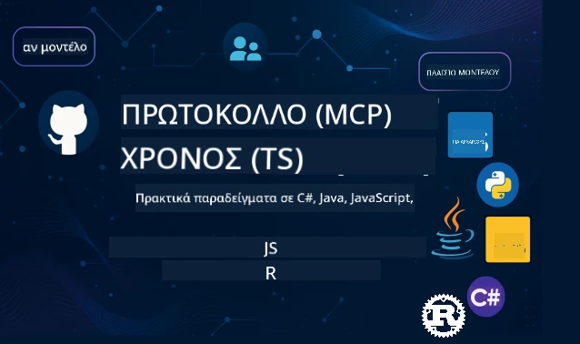

 

[](https://GitHub.com/microsoft/mcp-for-beginners/graphs/contributors)
[](https://GitHub.com/microsoft/mcp-for-beginners/issues)
[](https://GitHub.com/microsoft/mcp-for-beginners/pulls)
[](http://makeapullrequest.com)

[](https://GitHub.com/microsoft/mcp-for-beginners/watchers)
[](https://GitHub.com/microsoft/mcp-for-beginners/fork)
[](https://GitHub.com/microsoft/mcp-for-beginners/stargazers)


[](https://discord.gg/nTYy5BXMWG)

Ακολουθήστε αυτά τα βήματα για να ξεκινήσετε να χρησιμοποιείτε αυτούς τους πόρους:
1. **Διακλάδωση του Αποθετηρίου**: Κάντε κλικ στο [](https://GitHub.com/microsoft/mcp-for-beginners/fork)
2. **Κλωνοποίηση του Αποθετηρίου**:   `git clone https://github.com/microsoft/mcp-for-beginners.git`
3. **Εγγραφή στο** [](https://discord.gg/nTYy5BXMWG)


### 🌐 Υποστήριξη Πολλών Γλωσσών

#### Υποστηρίζεται μέσω GitHub Action (Αυτοματοποιημένο & Πάντα Ενημερωμένο)

<!-- CO-OP TRANSLATOR LANGUAGES TABLE START -->
[Arabic](../ar/README.md) | [Bengali](../bn/README.md) | [Bulgarian](../bg/README.md) | [Burmese (Myanmar)](../my/README.md) | [Chinese (Simplified)](../zh-CN/README.md) | [Chinese (Traditional, Hong Kong)](../zh-HK/README.md) | [Chinese (Traditional, Macau)](../zh-MO/README.md) | [Chinese (Traditional, Taiwan)](../zh-TW/README.md) | [Croatian](../hr/README.md) | [Czech](../cs/README.md) | [Danish](../da/README.md) | [Dutch](../nl/README.md) | [Estonian](../et/README.md) | [Finnish](../fi/README.md) | [French](../fr/README.md) | [German](../de/README.md) | [Greek](./README.md) | [Hebrew](../he/README.md) | [Hindi](../hi/README.md) | [Hungarian](../hu/README.md) | [Indonesian](../id/README.md) | [Italian](../it/README.md) | [Japanese](../ja/README.md) | [Kannada](../kn/README.md) | [Korean](../ko/README.md) | [Lithuanian](../lt/README.md) | [Malay](../ms/README.md) | [Malayalam](../ml/README.md) | [Marathi](../mr/README.md) | [Nepali](../ne/README.md) | [Nigerian Pidgin](../pcm/README.md) | [Norwegian](../no/README.md) | [Persian (Farsi)](../fa/README.md) | [Polish](../pl/README.md) | [Portuguese (Brazil)](../pt-BR/README.md) | [Portuguese (Portugal)](../pt-PT/README.md) | [Punjabi (Gurmukhi)](../pa/README.md) | [Romanian](../ro/README.md) | [Russian](../ru/README.md) | [Serbian (Cyrillic)](../sr/README.md) | [Slovak](../sk/README.md) | [Slovenian](../sl/README.md) | [Spanish](../es/README.md) | [Swahili](../sw/README.md) | [Swedish](../sv/README.md) | [Tagalog (Filipino)](../tl/README.md) | [Tamil](../ta/README.md) | [Telugu](../te/README.md) | [Thai](../th/README.md) | [Turkish](../tr/README.md) | [Ukrainian](../uk/README.md) | [Urdu](../ur/README.md) | [Vietnamese](../vi/README.md)

> **Προτιμάτε να κλωνοποιήσετε τοπικά;**

> Αυτό το αποθετήριο περιλαμβάνει πάνω από 50 μεταφράσεις γλωσσών, γεγονός που αυξάνει σημαντικά το μέγεθος λήψης. Για να κλωνοποιήσετε χωρίς τις μεταφράσεις, χρησιμοποιήστε το sparse checkout:
> ```bash
> git clone --filter=blob:none --sparse https://github.com/microsoft/mcp-for-beginners.git
> cd mcp-for-beginners
> git sparse-checkout set --no-cone '/*' '!translations' '!translated_images'
> ```
> Αυτό σας δίνει ό,τι χρειάζεστε για να ολοκληρώσετε το μάθημα με πολύ πιο γρήγορη λήψη.
<!-- CO-OP TRANSLATOR LANGUAGES TABLE END -->

# 🚀 Αναλυτικό Πρόγραμμα του Model Context Protocol (MCP) για Αρχάριους

## **Μάθετε MCP με Παραδείγματα Κώδικα σε C#, Java, JavaScript, Rust, Python και TypeScript**

## 🧠 Επισκόπηση του Αναλυτικού Προγράμματος του Model Context Protocol 
Καλωσορίσατε στο ταξίδι σας στο Model Context Protocol! Αν έχετε ποτέ αναρωτηθεί πώς οι εφαρμογές AI επικοινωνούν με διάφορα εργαλεία και υπηρεσίες, είστε έτοιμοι να ανακαλύψετε τη λαμπρή λύση που μεταμορφώνει τον τρόπο που οι προγραμματιστές δημιουργούν έξυπνα συστήματα.

Σκεφτείτε το MCP σαν έναν καθολικό μεταφραστή για τις εφαρμογές AI - όπως οι θύρες USB επιτρέπουν τη σύνδεση οποιασδήποτε συσκευής στον υπολογιστή σας, το MCP επιτρέπει στα μοντέλα AI να συνδέονται με οποιοδήποτε εργαλείο ή υπηρεσία με έναν τυποποιημένο τρόπο. Είτε δημιουργείτε το πρώτο σας chatbot είτε εργάζεστε σε σύνθετες ροές εργασιών AI, η κατανόηση του MCP θα σας δώσει τη δύναμη να δημιουργήσετε πιο ικανές και ευέλικτες εφαρμογές.

Αυτό το αναλυτικό πρόγραμμα έχει σχεδιαστεί με υπομονή και φροντίδα για το ταξίδι μάθησής σας. Θα ξεκινήσουμε με απλές έννοιες που ήδη κατανοείτε και σταδιακά θα χτίσουμε την εξειδίκευσή σας μέσω πρακτικής με τον κώδικα στη γλώσσα προγραμματισμού που προτιμάτε. Κάθε βήμα περιλαμβάνει σαφείς εξηγήσεις, πρακτικά παραδείγματα και πολλή ενθάρρυνση κατά μήκος του δρόμου.

Μέχρι να ολοκληρώσετε αυτό το ταξίδι, θα έχετε την αυτοπεποίθηση να δημιουργήσετε τους δικούς σας MCP servers, να τους ενσωματώσετε με δημοφιλείς πλατφόρμες AI και να κατανοήσετε πώς αυτή η τεχνολογία διαμορφώνει το μέλλον της ανάπτυξης AI. Ας ξεκινήσουμε αυτή την συναρπαστική περιπέτεια μαζί!

### Επίσημη Τεκμηρίωση και Προδιαγραφές

Αυτοί οι πόροι γίνονται πιο πολύτιμοι καθώς αυξάνεται η κατανόησή σας, αλλά μην νιώσετε την πίεση να διαβάσετε τα πάντα αμέσως. Ξεκινήστε με τους τομείς που σας ενδιαφέρουν περισσότερο!
- 📘 [Τεκμηρίωση MCP](https://modelcontextprotocol.io/) – Αυτός είναι ο βασικός σας πόρος για βήμα-βήμα εκπαιδευτικά προγράμματα και οδηγούς χρήσης. Η τεκμηρίωση είναι γραμμένη με γνώμονα τους αρχάριους, παρέχοντας σαφή παραδείγματα που μπορείτε να ακολουθήσετε με τον δικό σας ρυθμό.
- 📜 [Προδιαγραφή MCP](https://modelcontextprotocol.io/docs/) – Σκεφτείτε το ως το ολοκληρωμένο εγχειρίδιο αναφοράς σας. Καθώς προχωράτε στο πρόγραμμα, θα το επισκέπτεστε για να βρείτε συγκεκριμένες λεπτομέρειες και να εξερευνήσετε προχωρημένες λειτουργίες.
- 📜 [Αρχική Προδιαγραφή MCP](https://modelcontextprotocol.io/specification/versioning) – Περιέχει επιπλέον τεχνικές λεπτομέρειες που μπορεί να είναι χρήσιμες για προχωρημένες υλοποιήσεις. Είναι εκεί όταν το χρειάζεστε, αλλά μην ανησυχείτε αν ξεκινάτε τώρα.
- 🧑‍💻 [Αποθετήριο MCP στο GitHub](https://github.com/modelcontextprotocol) – Εδώ θα βρείτε SDKs, εργαλεία και δείγματα κώδικα σε πολλές γλώσσες προγραμματισμού. Είναι σαν ένας θησαυρός πρακτικών παραδειγμάτων και έτοιμων προς χρήση εξαρτημάτων.
- 🌐 [Κοινότητα MCP](https://github.com/orgs/modelcontextprotocol/discussions) – Ενταχθείτε με άλλους μαθητευόμενους και έμπειρους προγραμματιστές σε συζητήσεις για το MCP. Είναι μια φιλόξενη κοινότητα όπου οι ερωτήσεις είναι ευπρόσδεκτες και η γνώση μοιράζεται ελεύθερα.
  
## Στόχοι Μάθησης

Μέχρι το τέλος αυτού του προγράμματος, θα αισθάνεστε σίγουροι και ενθουσιασμένοι με τις νέες σας ικανότητες. Δείτε τι θα πετύχετε:

• **Κατανόηση των βασικών του MCP**: Θα κατανοήσετε τι είναι το Model Context Protocol και γιατί φέρνει επανάσταση στο πώς οι εφαρμογές AI συνεργάζονται, χρησιμοποιώντας αναλογίες και παραδείγματα που έχουν νόημα.

• **Δημιουργία του πρώτου MCP server σας**: Θα φτιάξετε έναν λειτουργικό MCP server στη γλώσσα προγραμματισμού που προτιμάτε, ξεκινώντας με απλά παραδείγματα και αναπτύσσοντας τα skills σας βήμα-βήμα.

• **Σύνδεση των μοντέλων AI με πραγματικά εργαλεία**: Θα μάθετε πώς να γεφυρώνετε το χάσμα μεταξύ των μοντέλων AI και των πραγματικών υπηρεσιών, δίνοντας στις εφαρμογές σας ισχυρές νέες δυνατότητες.

• **Εφαρμογή βέλτιστων πρακτικών ασφαλείας**: Θα κατανοήσετε πώς να κρατάτε τις υλοποιήσεις MCP ασφαλείς, προστατεύοντας τόσο τις εφαρμογές όσο και τους χρήστες σας.

• **Ανάπτυξη με αυτοπεποίθηση**: Θα γνωρίζετε πώς να μεταφέρετε τα έργα MCP από την ανάπτυξη στην παραγωγή, με πρακτικές στρατηγικές ανάπτυξης που δουλεύουν στον πραγματικό κόσμο.

• **Εγγραφή στην κοινότητα MCP**: Θα γίνετε μέλος μιας αναπτυσσόμενης κοινότητας προγραμματιστών που διαμορφώνουν το μέλλον της ανάπτυξης εφαρμογών AI.

## Απαραίτητο Υπόβαθρο

Πριν βουτήξουμε στα συγκεκριμένα του MCP, ας βεβαιωθούμε ότι αισθάνεστε άνετα με κάποιες θεμελιώδεις έννοιες. Μην ανησυχείτε αν δεν είστε ειδικός σε αυτούς τους τομείς - θα εξηγήσουμε όλα όσα χρειάζεστε καθώς προχωράμε!

### Κατανόηση Πρωτοκόλλων (Το Θεμέλιο)

Σκεφτείτε ένα πρωτόκολλο σαν τους κανόνες για μια συνομιλία. Όταν καλείτε έναν φίλο, και οι δύο ξέρετε να λέτε "γεια" όταν απαντάτε, να μιλάτε με τη σειρά και να λέτε "αντίο" όταν τελειώνετε. Τα προγράμματα υπολογιστή χρειάζονται παρόμοιους κανόνες για να επικοινωνούν αποτελεσματικά.

Το MCP είναι ένα πρωτόκολλο - ένα σύνολο συμφωνημένων κανόνων που βοηθούν τα μοντέλα AI και τις εφαρμογές να έχουν παραγωγικές "συνομιλίες" με εργαλεία και υπηρεσίες. Όπως το να υπάρχουν κανόνες συνομιλίας κάνει την ανθρώπινη επικοινωνία πιο ομαλή, έτσι το MCP κάνει την επικοινωνία των εφαρμογών AI πιο αξιόπιστη και ισχυρή.

### Σχέσεις Client-Server (Πώς Λειτουργούν Μαζί τα Προγράμματα)

Χρησιμοποιείτε ήδη καθημερινά σχέσεις client-server! Όταν χρησιμοποιείτε έναν φυλλομετρητή (client) για να επισκεφθείτε μια ιστοσελίδα, συνδέεστε με έναν web server που σας στέλνει το περιεχόμενο της σελίδας. Ο φυλλομετρητής ξέρει πώς να ζητήσει πληροφορίες, και ο server ξέρει πώς να απαντήσει.

Στο MCP, έχουμε παρόμοια σχέση: τα μοντέλα AI λειτουργούν ως clients που ζητούν πληροφορίες ή ενέργειες, ενώ οι MCP servers παρέχουν αυτές τις δυνατότητες. Είναι σαν να έχετε έναν βοηθό (τον server) που το AI μπορεί να ζητήσει να εκτελέσει συγκεκριμένες εργασίες.

### Γιατί Είναι Σημαντική η Τυποποίηση (Κάνοντας Τα Πράγματα να Λειτουργούν Μαζί)

Φανταστείτε αν κάθε κατασκευαστής αυτοκινήτων χρησιμοποιούσε διαφορετικά σχήματα αντλιών καυσίμων - θα χρειαζόσασταν διαφορετικό αντάπτορα για κάθε αυτοκίνητο! Η τυποποίηση σημαίνει συμφωνία σε κοινές προσεγγίσεις έτσι ώστε τα πράγματα να λειτουργούν αρμονικά.

Το MCP παρέχει αυτήν την τυποποίηση για τις εφαρμογές AI. Αντί κάθε μοντέλο AI να χρειάζεται προσαρμοσμένο κώδικα για να δουλέψει με κάθε εργαλείο, το MCP δημιουργεί έναν καθολικό τρόπο να επικοινωνούν. Αυτό σημαίνει ότι οι προγραμματιστές μπορούν να φτιάξουν εργαλεία μία φορά και να δουλεύουν με πολλά διαφορετικά AI συστήματα.

## 🧭 Περιγραφή της Διαδρομής Μάθησης

Το ταξίδι σας στο MCP είναι φροντισμένα δομημένο για να χτίσει την αυτοπεποίθηση και τις δεξιότητές σας σταδιακά. Κάθε φάση εισάγει νέες έννοιες ενώ ενισχύει όσα έχετε ήδη μάθει.

### 🌱 Φάση Θεμελίωσης: Κατανόηση των Βασικών (Ενότητες 0-2)

Εδώ ξεκινά η περιπέτειά σας! Θα σας παρουσιάσουμε τις έννοιες του MCP με γνώριμες αναλογίες και απλά παραδείγματα. Θα καταλάβετε τι είναι το MCP, γιατί υπάρχει και πώς εντάσσεται στον ευρύτερο κόσμο της ανάπτυξης AI.

• **Ενότητα 0 - Εισαγωγή στο MCP**: Θα ξεκινήσουμε εξερευνώντας τι είναι το MCP και γιατί είναι τόσο σημαντικό για τις σύγχρονες εφαρμογές AI. Θα δείτε πραγματικά παραδείγματα MCP σε δράση και θα καταλάβετε πώς λύνει κοινά προβλήματα που αντιμετωπίζουν οι προγραμματιστές.

• **Ενότητα 1 - Επεξήγηση Βασικών Εννοιών**: Εδώ θα μάθετε τα θεμελιώδη δομικά στοιχεία του MCP. Θα χρησιμοποιήσουμε πολλές αναλογίες και οπτικά παραδείγματα για να βεβαιωθούμε ότι αυτές οι έννοιες γίνονται φυσικές και κατανοητές.

• **Ενότητα 2 - Ασφάλεια στο MCP**: Η ασφάλεια μπορεί να ακούγεται τρομακτική, αλλά θα σας δείξουμε πώς το MCP περιλαμβάνει ενσωματωμένες λειτουργίες ασφαλείας και θα σας μάθουμε τις βέλτιστες πρακτικές που προστατεύουν τις εφαρμογές σας από την αρχή.

### 🔨 Φάση Δημιουργίας: Κατασκευή των Πρώτων Υλοποιήσεών σας (Ενότητα 3)

Τώρα αρχίζει η πραγματική διασκέδαση! Θα αποκτήσετε πρακτική εμπειρία δημιουργώντας πραγματικούς MCP servers και clients. Μην ανησυχείτε – θα ξεκινήσουμε απλά και θα σας καθοδηγήσουμε σε κάθε βήμα.

Αυτή η ενότητα περιλαμβάνει πολλούς πρακτικούς οδηγούς που σας επιτρέπουν να εξασκηθείτε στη γλώσσα προγραμματισμού που προτιμάτε. Θα δημιουργήσετε τον πρώτο σας server, θα φτιάξετε έναν client για να συνδεθεί με αυτόν, και θα το ενσωματώσετε ακόμη και με δημοφιλή εργαλεία ανάπτυξης όπως το VS Code.
Κάθε οδηγός περιλαμβάνει πλήρη παραδείγματα κώδικα, συμβουλές αντιμετώπισης προβλημάτων και εξηγήσεις για το γιατί κάνουμε συγκεκριμένες επιλογές σχεδίασης. Στο τέλος αυτής της φάσης, θα έχετε λειτουργικές υλοποιήσεις MCP για τις οποίες μπορείτε να είστε περήφανοι!

### 🚀 Φάση Ανάπτυξης: Προχωρημένες Έννοιες και Πρακτική Εφαρμογή στον Πραγματικό Κόσμο (Ενότητες 4-5)

Με τις βασικές γνώσεις να έχουν κυριαρχηθεί, είστε έτοιμοι να εξερευνήσετε πιο εξελιγμένες λειτουργίες MCP. Θα καλύψουμε πρακτικές στρατηγικές υλοποίησης, τεχνικές αποσφαλμάτωσης και προχωρημένα θέματα όπως η ενσωμάτωση πολυτροπικής τεχνητής νοημοσύνης.

Επίσης, θα μάθετε πώς να κλιμακώνετε τις υλοποιήσεις MCP για παραγωγική χρήση και να ενσωματώνεστε με πλατφόρμες cloud όπως το Azure. Αυτές οι ενότητες σας προετοιμάζουν να δημιουργήσετε λύσεις MCP που μπορούν να ανταποκριθούν στις απαιτήσεις του πραγματικού κόσμου.

### 🌟 Φάση Επάρκειας: Κοινότητα και Εξειδίκευση (Ενότητες 6-11)

Η τελική φάση επικεντρώνεται στην ένταξη στην κοινότητα MCP και στην εξειδίκευση σε τομείς που σας ενδιαφέρουν περισσότερο. Θα μάθετε πώς να συνεισφέρετε σε έργα ανοικτού κώδικα MCP, να υλοποιείτε προχωρημένα μοτίβα αυθεντικοποίησης και να κατασκευάζετε ολοκληρωμένες λύσεις με ενσωμάτωση βάσεων δεδομένων.

Η Ενότητα 11 αξίζει ειδική αναφορά - αποτελεί έναν πλήρη κύκλο 13 εργαστηρίων πρακτικής εκμάθησης που σας διδάσκει πώς να δημιουργήσετε παραγωγικούς διακομιστές MCP με ενσωμάτωση PostgreSQL. Πρόκειται για ένα τελικό έργο που συγκεντρώνει ό,τι έχετε μάθει!

### 📚 Πλήρης Δομή Προγράμματος Σπουδών

| Ενότητα | Θέμα | Περιγραφή | Σύνδεσμος |
|--------|-------|-------------|------|
| **Ενότητες 1-3: Θεμελιώδεις Αρχές** | | | |
| 00 | Εισαγωγή στο MCP | Επισκόπηση του Πρωτοκόλλου Σύνθετου Μοντέλου και η σημασία του στα κανάλια AI | [Διαβάστε περισσότερα](./00-Introduction/README.md) |
| 01 | Εξήγηση Βασικών Εννοιών | Ενδελεχής εξερεύνηση βασικών εννοιών MCP | [Διαβάστε περισσότερα](./01-CoreConcepts/README.md) |
| 02 | Ασφάλεια στο MCP | Απειλές ασφαλείας και βέλτιστες πρακτικές | [Διαβάστε περισσότερα](./02-Security/README.md) |
| 03 | Ξεκινώντας με το MCP | Ρύθμιση περιβάλλοντος, βασικοί διακομιστές/πελάτες, ενσωμάτωση | [Διαβάστε περισσότερα](./03-GettingStarted/README.md) |
| **Ενότητα 3: Δημιουργία του Πρώτου σας Διακομιστή & Πελάτη** | | | |
| 3.1 | Πρώτος Διακομιστής | Δημιουργήστε τον πρώτο σας διακομιστή MCP | [Οδηγός](./03-GettingStarted/01-first-server/README.md) |
| 3.2 | Πρώτος Πελάτης | Αναπτύξτε έναν βασικό πελάτη MCP | [Οδηγός](./03-GettingStarted/02-client/README.md) |
| 3.3 | Πελάτης με LLM | Ενσωματώστε μεγάλα γλωσσικά μοντέλα | [Οδηγός](./03-GettingStarted/03-llm-client/README.md) |
| 3.4 | Ενσωμάτωση με VS Code | Χρησιμοποιήστε διακομιστές MCP στο VS Code | [Οδηγός](./03-GettingStarted/04-vscode/README.md) |
| 3.5 | Διακομιστής stdio | Δημιουργία διακομιστών με μεταφορά stdio | [Οδηγός](./03-GettingStarted/05-stdio-server/README.md) |
| 3.6 | HTTP Streaming | Υλοποίηση ροής δεδομένων HTTP στο MCP | [Οδηγός](./03-GettingStarted/06-http-streaming/README.md) |
| 3.7 | AI Toolkit | Χρήση του AI Toolkit με το MCP | [Οδηγός](./03-GettingStarted/07-aitk/README.md) |
| 3.8 | Δοκιμές | Δοκιμάστε την υλοποίηση του διακομιστή MCP | [Οδηγός](./03-GettingStarted/08-testing/README.md) |
| 3.9 | Ανάπτυξη | Ανάπτυξη διακομιστών MCP σε παραγωγή | [Οδηγός](./03-GettingStarted/09-deployment/README.md) |
| 3.10 | Προχωρημένη χρήση διακομιστή | Χρήση προχωρημένων διακομιστών για προχωρημένα χαρακτηριστικά και βελτιωμένη αρχιτεκτονική | [Οδηγός](./03-GettingStarted/10-advanced/README.md) |
| 3.11 | Απλή αυθεντικοποίηση | Κεφάλαιο που σας δείχνει αυθεντικοποίηση από την αρχή και RBAC | [Οδηγός](./03-GettingStarted/11-simple-auth/README.md) |
| **Ενότητες 4-5: Πρακτική & Προχωρημένη** | | | |
| 04 | Πρακτική Υλοποίηση | SDKs, αποσφαλμάτωση, δοκιμές, επαναχρησιμοποιήσιμα πρότυπα prompt | [Διαβάστε περισσότερα](./04-PracticalImplementation/README.md) |
| 05 | Προχωρημένα Θέματα στο MCP | Πολυτροπική AI, κλιμάκωση, χρήση σε επιχειρήσεις | [Διαβάστε περισσότερα](./05-AdvancedTopics/README.md) |
| 5.1 | Ενσωμάτωση Azure | Ενσωμάτωση MCP με Azure | [Οδηγός](./05-AdvancedTopics/mcp-integration/README.md) |
| 5.2 | Πολυτροπικότητα | Εργασία με πολλαπλές μορφές δεδομένων | [Οδηγός](./05-AdvancedTopics/mcp-multi-modality/README.md) |
| 5.3 | Παράδειγμα OAuth2 | Υλοποίηση αυθεντικοποίησης OAuth2 | [Οδηγός](./05-AdvancedTopics/mcp-oauth2-demo/README.md) |
| 5.4 | Βασικά Πλαίσια | Κατανόηση και υλοποίηση βασικών πλαισίων | [Οδηγός](./05-AdvancedTopics/mcp-root-contexts/README.md) |
| 5.5 | Δρομολόγηση | Στρατηγικές δρομολόγησης MCP | [Οδηγός](./05-AdvancedTopics/mcp-routing/README.md) |
| 5.6 | Δειγματοληψία | Τεχνικές δειγματοληψίας στο MCP | [Οδηγός](./05-AdvancedTopics/mcp-sampling/README.md) |
| 5.7 | Κλιμάκωση | Κλιμάκωση υλοποιήσεων MCP | [Οδηγός](./05-AdvancedTopics/mcp-scaling/README.md) |
| 5.8 | Ασφάλεια | Προχωρημένες θεωρήσεις ασφάλειας | [Οδηγός](./05-AdvancedTopics/mcp-security/README.md) |
| 5.9 | Αναζήτηση Web | Υλοποίηση δυνατοτήτων web search | [Οδηγός](./05-AdvancedTopics/web-search-mcp/README.md) |
| 5.10 | Ροή σε Πραγματικό Χρόνο | Δημιουργία λειτουργικότητας ροής δεδομένων σε πραγματικό χρόνο | [Οδηγός](./05-AdvancedTopics/mcp-realtimestreaming/README.md) |
| 5.11 | Αναζήτηση σε Πραγματικό Χρόνο | Υλοποίηση αναζήτησης σε πραγματικό χρόνο | [Οδηγός](./05-AdvancedTopics/mcp-realtimesearch/README.md) |
| 5.12 | Αυθεντικοποίηση Entra ID | Αυθεντικοποίηση με Microsoft Entra ID | [Οδηγός](./05-AdvancedTopics/mcp-security-entra/README.md) |
| 5.13 | Ενσωμάτωση Foundry | Ενσωμάτωση με Azure AI Foundry | [Οδηγός](./05-AdvancedTopics/mcp-foundry-agent-integration/README.md) |
| 5.14 | Μηχανική Πλαισίου | Τεχνικές αποτελεσματικής μηχανικής πλαισίου | [Οδηγός](./05-AdvancedTopics/mcp-contextengineering/README.md) |
| 5.15 | Προσαρμοσμένη Μεταφορά MCP | Υλοποιήσεις προσαρμοσμένης μεταφοράς | [Οδηγός](./05-AdvancedTopics/mcp-transport/README.md) |
| **Ενότητες 6-10: Κοινότητα & Βέλτιστες Πρακτικές** | | | |
| 06 | Συμβολές Κοινότητας | Πώς να συμβάλλετε στο οικοσύστημα MCP | [Οδηγός](./06-CommunityContributions/README.md) |
| 07 | Συμπεράσματα από την Πρώιμη Υιοθέτηση | Ιστορίες πρακτικών υλοποιήσεων | [Οδηγός](./07-LessonsFromEarlyAdoption/README.md) |
| 08 | Βέλτιστες Πρακτικές για MCP | Απόδοση, ανθεκτικότητα σε σφάλματα, ευελιξία | [Οδηγός](./08-BestPractices/README.md) |
| 09 | Μελέτες Περιπτώσεων MCP | Πρακτικά παραδείγματα υλοποίησης | [Οδηγός](./09-CaseStudy/README.md) |
| 10 | Εργαστήριο με Πρακτική | Δημιουργία διακομιστή MCP με AI Toolkit | [Εργαστήριο](./10-StreamliningAIWorkflowsBuildingAnMCPServerWithAIToolkit/README.md) |
| **Ενότητα 11: Πρακτικό Εργαστήριο Διακομιστή MCP** | | | |
| 11 | Ενσωμάτωση Βάσης Δεδομένων MCP Server | Ολοκληρωμένος κύκλος 13 εργαστηρίων πρακτικής εκμάθησης για ενσωμάτωση PostgreSQL | [Εργαστήρια](./11-MCPServerHandsOnLabs/README.md) |
| 11.1 | Εισαγωγή | Επισκόπηση MCP με ενσωμάτωση βάσης δεδομένων και χρήση στην ανάλυση λιανικής | [Εργαστήριο 00](./11-MCPServerHandsOnLabs/00-Introduction/README.md) |
| 11.2 | Βασική Αρχιτεκτονική | Κατανόηση της αρχιτεκτονικής διακομιστή MCP, των επιπέδων βάσης δεδομένων και των μοτίβων ασφάλειας | [Εργαστήριο 01](./11-MCPServerHandsOnLabs/01-Architecture/README.md) |
| 11.3 | Ασφάλεια & Πολυ-ενοικιαστικότητα | Ασφάλεια επιπέδου γραμμής, αυθεντικοποίηση και πρόσβαση σε δεδομένα πολλαπλών ενοικιαστών | [Εργαστήριο 02](./11-MCPServerHandsOnLabs/02-Security/README.md) |
| 11.4 | Ρύθμιση Περιβάλλοντος | Ρύθμιση περιβάλλοντος ανάπτυξης, Docker, πόροι Azure | [Εργαστήριο 03](./11-MCPServerHandsOnLabs/03-Setup/README.md) |
| 11.5 | Σχεδίαση Βάσης Δεδομένων | Ρύθμιση PostgreSQL, σχεδιασμός σχήματος λιανικής και δείγματα δεδομένων | [Εργαστήριο 04](./11-MCPServerHandsOnLabs/04-Database/README.md) |
| 11.6 | Υλοποίηση MCP Server | Δημιουργία του διακομιστή FastMCP με ενσωμάτωση βάσης δεδομένων | [Εργαστήριο 05](./11-MCPServerHandsOnLabs/05-MCP-Server/README.md) |
| 11.7 | Ανάπτυξη Εργαλείων | Δημιουργία εργαλείων ερωτημάτων βάσης δεδομένων και ενδοσκόπηση σχήματος | [Εργαστήριο 06](./11-MCPServerHandsOnLabs/06-Tools/README.md) |
| 11.8 | Σημασιολογική Αναζήτηση | Υλοποίηση vector embeddings με Azure OpenAI και pgvector | [Εργαστήριο 07](./11-MCPServerHandsOnLabs/07-Semantic-Search/README.md) |
| 11.9 | Δοκιμές & Αποσφαλμάτωση | Στρατηγικές δοκιμών, εργαλεία αποσφαλμάτωσης και μέθοδοι επικύρωσης | [Εργαστήριο 08](./11-MCPServerHandsOnLabs/08-Testing/README.md) |
| 11.10 | Ενσωμάτωση VS Code | Ρύθμιση της ενσωμάτωσης MCP στο VS Code και χρήση AI Chat | [Εργαστήριο 09](./11-MCPServerHandsOnLabs/09-VS-Code/README.md) |
| 11.11 | Στρατηγικές Ανάπτυξης | Ανάπτυξη με Docker, Azure Container Apps και θεωρήσεις κλιμάκωσης | [Εργαστήριο 10](./11-MCPServerHandsOnLabs/10-Deployment/README.md) |
| 11.12 | Παρακολούθηση | Application Insights, καταγραφή, παρακολούθηση απόδοσης | [Εργαστήριο 11](./11-MCPServerHandsOnLabs/11-Monitoring/README.md) |
| 11.13 | Βέλτιστες Πρακτικές | Βελτιστοποίηση απόδοσης, ενίσχυση ασφάλειας και συμβουλές παραγωγής | [Εργαστήριο 12](./11-MCPServerHandsOnLabs/12-Best-Practices/README.md) |

### 💻 Παραδείγματα Κώδικα

Ένα από τα πιο συναρπαστικά μέρη της εκμάθησης MCP είναι να βλέπετε τις δεξιότητές σας στον κώδικα να αναπτύσσονται σταδιακά. Έχουμε σχεδιάσει τα παραδείγματα κώδικα ώστε να ξεκινούν απλά και να γίνονται πιο εξελιγμένα καθώς εμβαθύνετε στην κατανόησή σας. Να πώς παρουσιάζουμε τις έννοιες - με κώδικα εύκολο στην κατανόηση αλλά που επιδεικνύει πραγματικές αρχές MCP, θα καταλάβετε όχι μόνο τι κάνει ο κώδικας αυτός, αλλά γιατί είναι δομημένος έτσι και πώς εντάσσεται σε μεγαλύτερες εφαρμογές MCP.

#### Βασικά Παραδείγματα Αριθμομηχανής MCP

| Γλώσσα | Περιγραφή | Σύνδεσμος |
|----------|-------------|------|
| C# | Παράδειγμα MCP Server | [Δείτε Κώδικα](./03-GettingStarted/samples/csharp/README.md) |
| Java | Αριθμομηχανή MCP | [Δείτε Κώδικα](./03-GettingStarted/samples/java/calculator/README.md) |
| JavaScript | DEMO MCP | [Δείτε Κώδικα](./03-GettingStarted/samples/javascript/README.md) |
| Python | MCP Server | [Δείτε Κώδικα](../../03-GettingStarted/samples/python/mcp_calculator_server.py) |
| TypeScript | Παράδειγμα MCP | [Δείτε Κώδικα](./03-GettingStarted/samples/typescript/README.md) |
| Rust | Παράδειγμα MCP | [Δείτε Κώδικα](./03-GettingStarted/samples/rust/README.md) |

#### Προχωρημένες Υλοποιήσεις MCP

| Γλώσσα | Περιγραφή | Σύνδεσμος |
|----------|-------------|------|
| C# | Προχωρημένο Παράδειγμα | [Δείτε Κώδικα](./04-PracticalImplementation/samples/csharp/README.md) |
| Java με Spring | Παράδειγμα Container App | [Δείτε Κώδικα](./04-PracticalImplementation/samples/java/containerapp/README.md) |
| JavaScript | Προχωρημένο Παράδειγμα | [Δείτε Κώδικα](./04-PracticalImplementation/samples/javascript/README.md) |
| Python | Πολύπλοκη Υλοποίηση | [Δείτε Κώδικα](../../04-PracticalImplementation/samples/python/READMEmd) |
| TypeScript | Παράδειγμα Container | [Δείτε Κώδικα](./04-PracticalImplementation/samples/typescript/README.md) |


## 🎯 Προαπαιτούμενα για την Εκμάθηση MCP

Για να επωφεληθείτε στο μέγιστο από αυτό το πρόγραμμα σπουδών, θα πρέπει να έχετε:

- Βασικές γνώσεις προγραμματισμού σε τουλάχιστον μία από τις ακόλουθες γλώσσες: C#, Java, JavaScript, Python ή TypeScript
- Κατανόηση του μοντέλου πελάτη-διακομιστή και APIs
- Εξοικείωση με τις έννοιες REST και HTTP
- (Προαιρετικό) Υπόβαθρο σε έννοιες AI/ML

- Συμμετοχή σε συζητήσεις της κοινότητάς μας για υποστήριξη

## 📚 Οδηγός Μελέτης & Πόροι

Αυτό το αποθετήριο περιλαμβάνει αρκετούς πόρους για να σας βοηθήσει να πλοηγηθείτε και να μάθετε αποτελεσματικά:

### Οδηγός Μελέτης

Ένας ολοκληρωμένος [Οδηγός Μελέτης](./study_guide.md) είναι διαθέσιμος για να σας βοηθήσει να πλοηγηθείτε αποτελεσματικά σε αυτό το αποθετήριο. Αυτός ο οπτικός χάρτης προγράμματος σπουδών δείχνει πώς συνδέονται όλα τα θέματα και παρέχει καθοδήγηση για το πώς να χρησιμοποιείτε τα παραδείγματα έργων αποτελεσματικά. Είναι ιδιαίτερα χρήσιμος αν είστε οπτικός μαθητής που θέλει να δει τη μεγάλη εικόνα.

Ο οδηγός περιλαμβάνει:
- Οπτικό χάρτη προγράμματος σπουδών με όλα τα καλυπτόμενα θέματα
- Αναλυτική ανάλυση κάθε ενότητας αποθετηρίου
- Καθοδήγηση για τη χρήση των παραδειγμάτων έργων
- Προτεινόμενες μαθησιακές διαδρομές για διαφορετικά επίπεδα δεξιοτήτων
- Πρόσθετους πόρους για να συμπληρώσουν το ταξίδι μάθησής σας

### Αρχείο Αλλαγών

Διατηρούμε ένα λεπτομερές [Αρχείο Αλλαγών](./changelog.md) που παρακολουθεί όλες τις σημαντικές ενημερώσεις στα υλικά του προγράμματος σπουδών, ώστε να παραμένετε ενήμεροι με τις τελευταίες βελτιώσεις και προσθήκες.
- Νέες προσθήκες περιεχομένου
- Δομικές αλλαγές
- Βελτιώσεις χαρακτηριστικών
- Ενημερώσεις τεκμηρίωσης

## 🛠️ Πώς να Χρησιμοποιήσετε Αποτελεσματικά Αυτό το Πρόγραμμα Σπουδών

Κάθε μάθημα σε αυτόν τον οδηγό περιλαμβάνει:
1. Σαφείς εξηγήσεις των εννοιών του MCP  
2. Παραδείγματα ζωντανού κώδικα σε πολλές γλώσσες  
3. Ασκήσεις για τη δημιουργία πραγματικών εφαρμογών MCP  
4. Επιπλέον πόροι για προχωρημένους μαθητευόμενους

## Περιεχόμενο Κατ’ Απαίτηση

### [MCP Dev Days Ιούλιος 2025](https://developer.microsoft.com/en-us/reactor/series/S-1563/)
#### [➡️Παρακολούθηση Κατ’ Απαίτηση - MCP Dev Days](https://developer.microsoft.com/en-us/reactor/series/S-1563/)
Ετοιμαστείτε για δύο ημέρες βαθιάς τεχνικής κατανόησης, σύνδεσης με την κοινότητα και πρακτικής μάθησης στο MCP Dev Days, μια εικονική εκδήλωση αφιερωμένη στο Model Context Protocol (MCP) — το αναδυόμενο πρότυπο που γεφυρώνει τα μοντέλα AI και τα εργαλεία που χρησιμοποιούν.
Μπορείτε να παρακολουθήσετε το MCP Dev Days εγγραφόμενοι στη σελίδα της εκδήλωσής μας: https://aka.ms/mcpdevdays.

#### [Ημέρα 1: Παραγωγικότητα MCP, Εργαλεία Ανάπτυξης & Κοινότητα:](https://developer.microsoft.com/en-us/reactor/series/S-1563/)

Αφορά την ενδυνάμωση των προγραμματιστών να χρησιμοποιούν το MCP στην ροή εργασίας τους και τον εορτασμό της καταπληκτικής κοινότητας MCP. Θα είμαστε μαζί με μέλη της κοινότητας και συνεργάτες όπως Arcade, Block, Okta και Neon για να δούμε πώς συνεργάζονται με τη Microsoft για να διαμορφώσουν ένα ανοιχτό, επεκτάσιμο οικοσύστημα MCP. Επίκαιρες επιδείξεις σε VS Code, Visual Studio, GitHub Copilot και δημοφιλή εργαλεία κοινότητας  
Πρακτικές, συγκειμενικές ροές εργασίας ανάπτυξης  
Συνεδρίες και ιδέες με καθοδήγηση από την κοινότητα  
Είτε ξεκινάτε τώρα με το MCP είτε ήδη αναπτύσσετε με αυτό, η Ημέρα 1 θα θέσει το πλαίσιο με έμπνευση και εφαρμόσιμα συμπεράσματα.

#### [Ημέρα 2: Δημιουργία MCP Servers με Σιγουριά](https://developer.microsoft.com/en-us/reactor/series/S-1563/)

Απευθύνεται σε δημιουργούς MCP. Θα εμβαθύνουμε σε στρατηγικές υλοποίησης και βέλτιστες πρακτικές για τη δημιουργία MCP servers και την ενσωμάτωση του MCP στις ροές εργασίας AI σας.

#### Θέματα που περιλαμβάνονται:

- Δημιουργία MCP Servers και ενσωμάτωσή τους σε εμπειρίες πρακτόρων  
- Ανάπτυξη καθοδηγούμενη από prompts  
- Βέλτιστες πρακτικές ασφαλείας  
- Χρήση βασικών δομικών στοιχείων όπως Functions, ACA και API Management  
- Ευθυγράμμιση μητρώου και εργαλεία (1P + 3P)

Αν είστε προγραμματιστής, δημιουργός εργαλείων ή στρατηγικός σχεδιαστής προϊόντων AI, αυτή η ημέρα είναι γεμάτη με τις γνώσεις που χρειάζεστε για να δημιουργήσετε κλιμακούμενες, ασφαλείς και έτοιμες για το μέλλον λύσεις MCP.

### MCP Boot Camp Αύγουστος 2025  
Μάθετε σε εντατικές βίντεο συνεδρίες πώς να δημιουργείτε MCP servers, να ενσωματώνεστε με το VS Code, και να αναπτύσσεστε επαγγελματικά στο Azure βασισμένοι σε περιεχόμενο από το πρόγραμμα MCP για Αρχάριους. Αποκτήστε πρακτικές δεξιότητες σε μια τεχνολογία που ήδη χρησιμοποιούν μεγάλες εταιρίες.

#### [➡️Παρακολούθηση Κατ’ Απαίτηση MCP Bootcamp | Αγγλικά](https://developer.microsoft.com/en-us/reactor/series/s-1568/)
#### [➡️Παρακολούθηση Κατ’ Απαίτηση MCP Bootcamp | Βραζιλία](https://developer.microsoft.com/en-us/reactor/series/S-1566/)
#### [➡️Παρακολούθηση Κατ’ Απαίτηση MCP Bootcamp | Ισπανικά](https://developer.microsoft.com/en-us/reactor/series/S-1567/)

### Ας Μάθουμε MCP με C# - Σειρά Μαθημάτων  
Ας μάθουμε για το Model Context Protocol (MCP), ένα πρωτοποριακό πλαίσιο σχεδιασμένο να τυποποιεί τις αλληλεπιδράσεις μεταξύ των μοντέλων AI και των πελατειακών εφαρμογών. Μέσα από αυτή τη φιλική για αρχάριους συνεδρία, θα σας παρουσιάσουμε το MCP και θα σας καθοδηγήσουμε στη δημιουργία του πρώτου MCP server σας.  
#### C#: [https://aka.ms/letslearnmcp-csharp](https://aka.ms/letslearnmcp-csharp)  
#### Java: [https://aka.ms/letslearnmcp-java](https://aka.ms/letslearnmcp-java)  
#### JavaScript: [https://aka.ms/letslearnmcp-javascript](https://aka.ms/letslearnmcp-javascript)  
#### Python: [https://aka.ms/letslearnmcp-python](https://aka.ms/letslearnmcp-python)

## 🎓 Το Ταξίδι Σας στο MCP Ξεκινά

Συγχαρητήρια! Κάνατε το πρώτο βήμα σε ένα συναρπαστικό ταξίδι που θα διευρύνει τις προγραμματιστικές σας δεξιότητες και θα σας συνδέσει με την αιχμή της ανάπτυξης AI.

### Τι Έχετε Ήδη Καταφέρει

Διαβάζοντας αυτή την εισαγωγή, έχετε ήδη ξεκινήσει να χτίζετε το θεμέλιο της γνώσης σας στο MCP. Κατανοείτε τι είναι το MCP, γιατί είναι σημαντικό, και πώς αυτό το πρόγραμμα μελέτης θα υποστηρίξει το ταξίδι μάθησής σας. Αυτό αποτελεί σημαντικό επίτευγμα και την αρχή της εξειδίκευσής σας σε αυτή τη σημαντική τεχνολογία.

### Η Περιπέτεια Που Ακολουθεί

Καθώς προχωράτε στα κεφάλαια, θυμηθείτε ότι κάθε ειδικός ήταν κάποτε αρχάριος. Οι έννοιες που ίσως φαίνονται πολύπλοκες τώρα, θα γίνουν δεύτερη φύση καθώς τις εξασκείτε και τις εφαρμόζετε. Κάθε μικρό βήμα οδηγεί σε ισχυρές δυνατότητες που θα σας υπηρετούν σε όλη σας την καριέρα.

### Το Δίκτυο Υποστήριξής Σας

Ενώνεστε με μια κοινότητα μαθητών και ειδικών που είναι παθιασμένοι με το MCP και πρόθυμοι να βοηθήσουν άλλους να πετύχουν. Είτε κολλάτε σε μια πρόκληση κώδικα, είτε ενθουσιάζεστε να μοιραστείτε μια ανακάλυψη, η κοινότητα είναι εδώ για να στηρίξει το ταξίδι σας.

Εάν κολλήσετε ή έχετε ερωτήσεις σχετικά με τη δημιουργία εφαρμογών AI, συμμετέχετε σε συζητήσεις με άλλους μαθητές και έμπειρους προγραμματιστές για το MCP. Είναι μια υποστηρικτική κοινότητα όπου καλωσορίζονται οι ερωτήσεις και η γνώση μοιράζεται ελεύθερα.

[](https://discord.gg/nTYy5BXMWG)

Εάν έχετε σχόλια για προϊόν ή σφάλματα κατά την ανάπτυξη, επισκεφτείτε:

[](https://aka.ms/foundry/forum)

### Έτοιμοι να ξεκινήσετε;

Η περιπέτειά σας στο MCP ξεκινά τώρα! Ξεκινήστε με το Module 0 για να βυθιστείτε στις πρώτες σας πρακτικές εμπειρίες MCP ή εξερευνήστε τα δείγματα έργων για να δείτε τι θα δημιουργήσετε. Θυμηθείτε - κάθε ειδικός ξεκίνησε ακριβώς από εκεί που είστε τώρα, και με υπομονή και εξάσκηση, θα εκπλαγείτε με όσα μπορείτε να πετύχετε.

Καλώς ήρθατε στον κόσμο της ανάπτυξης με το Model Context Protocol. Ας δημιουργήσουμε κάτι εκπληκτικό μαζί!

## 🤝 Συμβολή στην Κοινότητα Μάθησης

Αυτό το πρόγραμμα σπουδών δυναμώνει με τις συνεισφορές μαθητών σαν εσάς! Είτε διορθώνετε ένα τυπογραφικό λάθος, προτείνετε μια πιο σαφή εξήγηση, είτε προσθέτετε ένα νέο παράδειγμα, οι συνεισφορές σας βοηθούν άλλους αρχάριους να πετύχουν.

Ευχαριστούμε τον Microsoft Valued Professional [Shivam Goyal](https://www.linkedin.com/in/shivam2003/) για τη συνεισφορά δειγμάτων κώδικα.

Η διαδικασία συνεισφοράς είναι σχεδιασμένη να είναι φιλόξενη και υποστηρικτική. Οι περισσότερες συνεισφορές απαιτούν Συμφωνία Άδειας Συνεισφοράς (CLA), αλλά τα αυτοματοποιημένα εργαλεία θα σας καθοδηγήσουν ομαλά μέσα στη διαδικασία.

## 📜 Ανοιχτή Πηγή Μάθησης

Ολόκληρο το πρόγραμμα σπουδών διατίθεται υπό την άδεια MIT [LICENSE](../../LICENSE), που σημαίνει ότι μπορείτε να το χρησιμοποιήσετε, τροποποιήσετε και να το μοιραστείτε ελεύθερα. Αυτό υποστηρίζει την αποστολή μας να καθιστούμε την γνώση MCP προσιτή σε προγραμματιστές παντού.

## 🤝 Οδηγίες Συνεισφοράς

Αυτό το έργο καλωσορίζει συνεισφορές και προτάσεις. Οι περισσότερες συνεισφορές απαιτούν να συμφωνήσετε σε μια  
Συμφωνία Άδειας Συνεισφοράς (CLA) δηλώνοντας ότι έχετε το δικαίωμα, και πράγματι παραχωρείτε, τα δικαιώματα για τη χρήση της συνεισφοράς σας. Για λεπτομέρειες, επισκεφτείτε το <https://cla.opensource.microsoft.com>.

Όταν υποβάλετε ένα αίτημα pull, ένα bot CLA θα καθορίσει αυτόματα αν χρειάζεται να παράσχετε  
CLA και θα διακοσμήσει κατάλληλα το PR (π.χ. έλεγχος κατάστασης, σχόλιο). Απλά ακολουθήστε τις οδηγίες που παρέχει το bot. Θα χρειαστεί να το κάνετε μόνο μία φορά σε όλα τα αποθετήρια που χρησιμοποιούν το CLA μας.

Αυτό το έργο έχει υιοθετήσει τον [Κώδικα Δεοντολογίας Ανοιχτού Κώδικα της Microsoft](https://opensource.microsoft.com/codeofconduct/).  
Για περισσότερες πληροφορίες δείτε τις [συχνές ερωτήσεις Κώδικα Δεοντολογίας](https://opensource.microsoft.com/codeofconduct/faq/) ή  
επικοινωνήστε με [opencode@microsoft.com](mailto:opencode@microsoft.com) για επιπλέον ερωτήσεις ή σχόλια.

---

*Έτοιμοι να ξεκινήσετε το ταξίδι σας στο MCP; Ξεκινήστε με το [Module 00 - Εισαγωγή στο MCP](./00-Introduction/README.md) και κάντε τα πρώτα σας βήματα στον κόσμο της ανάπτυξης του Model Context Protocol!*

## 🎒 Άλλα Μαθήματα  
Η ομάδα μας δημιουργεί και άλλα μαθήματα! Δείτε:

<!-- CO-OP TRANSLATOR OTHER COURSES START -->
### LangChain  
[](https://aka.ms/langchain4j-for-beginners)  
[](https://aka.ms/langchainjs-for-beginners?WT.mc_id=m365-94501-dwahlin)

---

### Azure / Edge / MCP / Agents  
[](https://github.com/microsoft/AZD-for-beginners?WT.mc_id=academic-105485-koreyst)  
[](https://github.com/microsoft/edgeai-for-beginners?WT.mc_id=academic-105485-koreyst)  
[](https://github.com/microsoft/mcp-for-beginners?WT.mc_id=academic-105485-koreyst)  
[](https://github.com/microsoft/ai-agents-for-beginners?WT.mc_id=academic-105485-koreyst)

---

### Σειρά Γενετικής Τεχνητής Νοημοσύνης  
[](https://github.com/microsoft/generative-ai-for-beginners?WT.mc_id=academic-105485-koreyst)  
[-9333EA?style=for-the-badge&labelColor=E5E7EB&color=9333EA)](https://github.com/microsoft/Generative-AI-for-beginners-dotnet?WT.mc_id=academic-105485-koreyst)  
[-C084FC?style=for-the-badge&labelColor=E5E7EB&color=C084FC)](https://github.com/microsoft/generative-ai-for-beginners-java?WT.mc_id=academic-105485-koreyst)  
[-E879F9?style=for-the-badge&labelColor=E5E7EB&color=E879F9)](https://github.com/microsoft/generative-ai-with-javascript?WT.mc_id=academic-105485-koreyst)

---

### Βασική Μάθηση  
[](https://aka.ms/ml-beginners?WT.mc_id=academic-105485-koreyst)  
[](https://aka.ms/datascience-beginners?WT.mc_id=academic-105485-koreyst)  
[](https://aka.ms/ai-beginners?WT.mc_id=academic-105485-koreyst)  
[](https://github.com/microsoft/Security-101?WT.mc_id=academic-96948-sayoung)
[](https://aka.ms/webdev-beginners?WT.mc_id=academic-105485-koreyst)
[](https://aka.ms/iot-beginners?WT.mc_id=academic-105485-koreyst)
[](https://github.com/microsoft/xr-development-for-beginners?WT.mc_id=academic-105485-koreyst)

---
 
### Σειρά Copilot
[](https://aka.ms/GitHubCopilotAI?WT.mc_id=academic-105485-koreyst)
[](https://github.com/microsoft/mastering-github-copilot-for-dotnet-csharp-developers?WT.mc_id=academic-105485-koreyst)
[](https://github.com/microsoft/CopilotAdventures?WT.mc_id=academic-105485-koreyst)
<!-- CO-OP TRANSLATOR OTHER COURSES END -->

---

<!-- CO-OP TRANSLATOR DISCLAIMER START -->
**Αποποίηση Ευθυνών**:  
Αυτό το έγγραφο έχει μεταφραστεί χρησιμοποιώντας την υπηρεσία αυτόματης μετάφρασης AI [Co-op Translator](https://github.com/Azure/co-op-translator). Παρόλο που επιδιώκουμε την ακρίβεια, παρακαλούμε να σημειώσετε ότι οι αυτοματοποιημένες μεταφράσεις μπορεί να περιέχουν σφάλματα ή ανακρίβειες. Το πρωτότυπο έγγραφο στη γλώσσα του θεωρείται η αυθεντική πηγή. Για κρίσιμες πληροφορίες, συνιστάται η επαγγελματική μετάφραση από ανθρώπους. Δεν φέρουμε ευθύνη για οποιεσδήποτε παρεξηγήσεις ή λανθασμένες ερμηνείες προκύψουν από τη χρήση αυτής της μετάφρασης.
<!-- CO-OP TRANSLATOR DISCLAIMER END -->