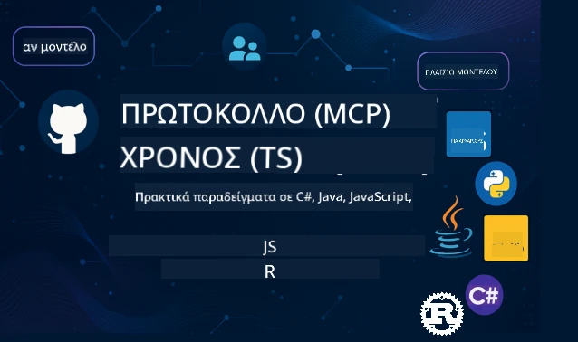

 

[](https://GitHub.com/microsoft/mcp-for-beginners/graphs/contributors)
[](https://GitHub.com/microsoft/mcp-for-beginners/issues)
[](https://GitHub.com/microsoft/mcp-for-beginners/pulls)
[](http://makeapullrequest.com)

[](https://GitHub.com/microsoft/mcp-for-beginners/watchers)
[](https://GitHub.com/microsoft/mcp-for-beginners/fork)
[](https://GitHub.com/microsoft/mcp-for-beginners/stargazers)


[](https://discord.gg/nTYy5BXMWG)

Ακολουθήστε αυτά τα βήματα για να ξεκινήσετε να χρησιμοποιείτε αυτούς τους πόρους:
1. **Κάντε Fork το Αποθετήριο**: Κάντε κλικ στο [](https://GitHub.com/microsoft/mcp-for-beginners/fork)
2. **Κλωνοποιήστε το Αποθετήριο**:   `git clone https://github.com/microsoft/mcp-for-beginners.git`
3. **Εγγραφείτε στο** [](https://discord.gg/nTYy5BXMWG)


### 🌐 Υποστήριξη Πολλών Γλωσσών

#### Υποστηρίζεται μέσω GitHub Action (Αυτοματοποιημένο & Πάντα Ενημερωμένο)

<!-- CO-OP TRANSLATOR LANGUAGES TABLE START -->
[Arabic](../ar/README.md) | [Bengali](../bn/README.md) | [Bulgarian](../bg/README.md) | [Burmese (Myanmar)](../my/README.md) | [Chinese (Simplified)](../zh-CN/README.md) | [Chinese (Traditional, Hong Kong)](../zh-HK/README.md) | [Chinese (Traditional, Macau)](../zh-MO/README.md) | [Chinese (Traditional, Taiwan)](../zh-TW/README.md) | [Croatian](../hr/README.md) | [Czech](../cs/README.md) | [Danish](../da/README.md) | [Dutch](../nl/README.md) | [Estonian](../et/README.md) | [Finnish](../fi/README.md) | [French](../fr/README.md) | [German](../de/README.md) | [Greek](./README.md) | [Hebrew](../he/README.md) | [Hindi](../hi/README.md) | [Hungarian](../hu/README.md) | [Indonesian](../id/README.md) | [Italian](../it/README.md) | [Japanese](../ja/README.md) | [Kannada](../kn/README.md) | [Korean](../ko/README.md) | [Lithuanian](../lt/README.md) | [Malay](../ms/README.md) | [Malayalam](../ml/README.md) | [Marathi](../mr/README.md) | [Nepali](../ne/README.md) | [Nigerian Pidgin](../pcm/README.md) | [Norwegian](../no/README.md) | [Persian (Farsi)](../fa/README.md) | [Polish](../pl/README.md) | [Portuguese (Brazil)](../pt-BR/README.md) | [Portuguese (Portugal)](../pt-PT/README.md) | [Punjabi (Gurmukhi)](../pa/README.md) | [Romanian](../ro/README.md) | [Russian](../ru/README.md) | [Serbian (Cyrillic)](../sr/README.md) | [Slovak](../sk/README.md) | [Slovenian](../sl/README.md) | [Spanish](../es/README.md) | [Swahili](../sw/README.md) | [Swedish](../sv/README.md) | [Tagalog (Filipino)](../tl/README.md) | [Tamil](../ta/README.md) | [Telugu](../te/README.md) | [Thai](../th/README.md) | [Turkish](../tr/README.md) | [Ukrainian](../uk/README.md) | [Urdu](../ur/README.md) | [Vietnamese](../vi/README.md)

> **Προτιμάτε να Κλωνοποιήσετε Τοπικά;**
>
> Αυτό το αποθετήριο περιλαμβάνει μεταφράσεις σε 50+ γλώσσες, γεγονός που αυξάνει σημαντικά το μέγεθος λήψης. Για κλωνοποίηση χωρίς τις μεταφράσεις, χρησιμοποιήστε sparse checkout:
>
> **Bash / macOS / Linux:**
> ```bash
> git clone --filter=blob:none --sparse https://github.com/microsoft/mcp-for-beginners.git
> cd mcp-for-beginners
> git sparse-checkout set --no-cone '/*' '!translations' '!translated_images'
> ```
>
> **CMD (Windows):**
> ```cmd
> git clone --filter=blob:none --sparse https://github.com/microsoft/mcp-for-beginners.git
> cd mcp-for-beginners
> git sparse-checkout set --no-cone "/*" "!translations" "!translated_images"
> ```
>
> Αυτό σας παρέχει όλα όσα χρειάζεστε για να ολοκληρώσετε το μάθημα με πολύ πιο γρήγορη λήψη.
<!-- CO-OP TRANSLATOR LANGUAGES TABLE END -->

# 🚀 Πρόγραμμα Σπουδών Model Context Protocol (MCP) για Αρχάριους

## **Μάθετε MCP με Πρακτικά Παραδείγματα Κώδικα σε C#, Java, JavaScript, Rust, Python και TypeScript**

## 🧠 Επισκόπηση του Προγράμματος Σπουδών Model Context Protocol
Καλώς ήρθατε στο ταξίδι σας στο Model Context Protocol! Αν έχετε ποτέ αναρωτηθεί πώς οι εφαρμογές AI επικοινωνούν με διάφορα εργαλεία και υπηρεσίες, σύντομα θα ανακαλύψετε την κομψή λύση που μετασχηματίζει τον τρόπο με τον οποίο οι προγραμματιστές δημιουργούν ευφυή συστήματα.

Σκεφτείτε το MCP ως έναν παγκόσμιο μεταφραστή για εφαρμογές AI — ακριβώς όπως οι θύρες USB σας επιτρέπουν να συνδέετε οποιαδήποτε συσκευή στον υπολογιστή σας, το MCP επιτρέπει στα μοντέλα AI να συνδέονται με οποιοδήποτε εργαλείο ή υπηρεσία με έναν τυποποιημένο τρόπο. Είτε κατασκευάζετε το πρώτο σας chatbot είτε εργάζεστε σε σύνθετα AI workflows, η κατανόηση του MCP θα σας δώσει τη δύναμη να δημιουργήσετε πιο δυνατές και ευέλικτες εφαρμογές.

Αυτό το πρόγραμμα σπουδών έχει σχεδιαστεί με υπομονή και φροντίδα για το ταξίδι μάθησής σας. Θα ξεκινήσουμε με απλές έννοιες που ήδη γνωρίζετε και σταδιακά θα χτίσουμε την εμπειρογνωμοσύνη σας μέσω πρακτικής εξάσκησης στη γλώσσα προγραμματισμού που προτιμάτε. Κάθε βήμα περιλαμβάνει σαφείς εξηγήσεις, πρακτικά παραδείγματα και πολλή υποστήριξη στην πορεία.

Μέχρι να ολοκληρώσετε αυτό το ταξίδι, θα έχετε την αυτοπεποίθηση να δημιουργήσετε τους δικούς σας MCP servers, να τους ενσωματώσετε με δημοφιλείς πλατφόρμες AI και να κατανοήσετε πώς αυτή η τεχνολογία αναδιαμορφώνει το μέλλον της ανάπτυξης AI. Ας ξεκινήσουμε αυτήν την συναρπαστική περιπέτεια μαζί!

### Επίσημη Τεκμηρίωση και Προδιαγραφές

Το πρόγραμμα σπουδών ευθυγραμμίζεται με την **Προδιαγραφή MCP 2025-11-25** (την τελευταία σταθερή έκδοση). Η προδιαγραφή MCP χρησιμοποιεί αριθμών εκδόσεων βάσει ημερομηνίας (μορφή YYYY-MM-DD) για να διασφαλίσει ξεκάθαρη παρακολούθηση της έκδοσης του πρωτοκόλλου.

Αυτοί οι πόροι γίνονται πιο πολύτιμοι καθώς αυξάνεται η κατανόησή σας, αλλά μην πιέζεστε να διαβάσετε τα πάντα άμεσα. Ξεκινήστε με τις περιοχές που σας ενδιαφέρουν περισσότερο!
- 📘 [Τεκμηρίωση MCP](https://modelcontextprotocol.io/) – Αυτός είναι ο βασικός σας πόρος για βήμα-βήμα μαθήματα και οδηγούς χρήστη. Η τεκμηρίωση έχει γραφτεί με σκέψη για αρχάριους, παρέχοντας σαφή παραδείγματα που μπορείτε να ακολουθήσετε με τον δικό σας ρυθμό.
- 📜 [Προδιαγραφή MCP](https://modelcontextprotocol.io/specification/2025-11-25) – Σκεφτείτε το ως το πλήρες βιβλιαράκι αναφοράς σας. Καθώς προχωράτε στο πρόγραμμα, θα επιστρέφετε εδώ για να ψάξετε συγκεκριμένες λεπτομέρειες και να εξερευνήσετε προηγμένες λειτουργίες.
- 📜 [Έκδοση Προδιαγραφής MCP](https://modelcontextprotocol.io/specification/versioning) – Περιέχει πληροφορίες σχετικά με το ιστορικό εκδόσεων του πρωτοκόλλου και το πώς το MCP χρησιμοποιεί την αριθμοδότηση βάσει ημερομηνίας (YYYY-MM-DD).
- 🧑‍💻 [Αποθετήριο MCP στο GitHub](https://github.com/modelcontextprotocol) – Εδώ θα βρείτε SDK, εργαλεία και δείγματα κώδικα σε πολλές γλώσσες προγραμματισμού. Είναι σαν ένας θησαυρός πρακτικών παραδειγμάτων και έτοιμων προς χρήση εξαρτημάτων.
- 🌐 [Κοινότητα MCP](https://github.com/orgs/modelcontextprotocol/discussions) – Ενταχθείτε σε άλλους μαθητές και έμπειρους προγραμματιστές σε συζητήσεις για το MCP. Είναι μια υποστηρικτική κοινότητα όπου καλωσορίζονται οι ερωτήσεις και η γνώση μοιράζεται ελεύθερα.
  
## Στόχοι Μάθησης

Στο τέλος αυτού του προγράμματος σπουδών, θα αισθάνεστε σίγουροι και ενθουσιασμένοι για τις νέες σας ικανότητες. Να τι θα πετύχετε:

• **Κατανόηση των βασικών του MCP**: Θα κατανοήσετε τι είναι το Model Context Protocol και γιατί φέρνει επανάσταση στον τρόπο που οι εφαρμογές AI συνεργάζονται, χρησιμοποιώντας αναλογίες και παραδείγματα που έχουν νόημα.

• **Δημιουργία του πρώτου σας MCP server**: Θα φτιάξετε έναν λειτουργικό MCP server στη γλώσσα προγραμματισμού που προτιμάτε, ξεκινώντας με απλά παραδείγματα και βελτιώνοντας τις δεξιότητές σας βήμα-βήμα.

• **Σύνδεση μοντέλων AI με πραγματικά εργαλεία**: Θα μάθετε πώς να γεφυρώνετε το κενό ανάμεσα σε μοντέλα AI και πραγματικές υπηρεσίες, δίνοντας στις εφαρμογές σας ισχυρές νέες δυνατότητες.

• **Εφαρμογή βέλτιστων πρακτικών ασφαλείας**: Θα κατανοήσετε πώς να κρατάτε τις υλοποιήσεις MCP ασφαλείς, προστατεύοντας τόσο τις εφαρμογές σας όσο και τους χρήστες σας.

• **Ανάπτυξη με αυτοπεποίθηση**: Θα ξέρετε πώς να μεταφέρετε τα MCP έργα σας από την ανάπτυξη στην παραγωγή, με πρακτικές στρατηγικές ανάπτυξης που δουλεύουν στην πραγματικότητα.

• **Ενταχθείτε στην κοινότητα MCP**: Θα γίνετε μέρος μιας αναπτυσσόμενης κοινότητας προγραμματιστών που διαμορφώνουν το μέλλον της ανάπτυξης εφαρμογών AI.

## Απαραίτητα Θεμελιώδη

Πριν βουτήξουμε στις ιδιαιτερότητες του MCP, ας βεβαιωθούμε ότι αισθάνεστε άνετα με ορισμένες βασικές έννοιες. Μην ανησυχείτε αν δεν είστε ειδικός σε αυτούς τους τομείς — θα εξηγήσουμε ό,τι χρειάζεστε καθώς προχωράμε!

### Κατανόηση Πρωτοκόλλων (Η Βάση)

Σκεφτείτε ένα πρωτόκολλο σαν τους κανόνες μιας συνομιλίας. Όταν καλείτε έναν φίλο, και οι δύο ξέρετε να λέτε «γεια» όταν απαντάτε, να μιλάτε με τη σειρά και να λέτε «αντίο» όταν τελειώνετε. Τα προγράμματα υπολογιστών χρειάζονται παρόμοιους κανόνες για να επικοινωνούν αποτελεσματικά.

Το MCP είναι ένα πρωτόκολλο — ένα σύνολο συμφωνημένων κανόνων που βοηθούν τα μοντέλα AI και τις εφαρμογές να έχουν παραγωγικές «συνομιλίες» με εργαλεία και υπηρεσίες. Όπως οι κανόνες συνομιλίας κάνουν την ανθρώπινη επικοινωνία ομαλότερη, έτσι το MCP κάνει την επικοινωνία των εφαρμογών AI πιο αξιόπιστη και ισχυρή.

### Σχέσεις Πελάτη-Εξυπηρετητή (Πώς Λειτουργούν μαζι τα Προγράμματα)

Χρησιμοποιείτε καθημερινά σχέσεις πελάτη-εξυπηρετητή! Όταν χρησιμοποιείτε έναν φυλλομετρητή ιστοσελίδων (τον πελάτη) για να επισκεφθείτε μια ιστοσελίδα, συνδέεστε με έναν web server που σας στέλνει το περιεχόμενο της σελίδας. Ο φυλλομετρητής ξέρει πώς να ζητήσει πληροφορίες, και ο διακομιστής ξέρει πώς να απαντήσει.

Στο MCP, έχουμε μια παρόμοια σχέση: Τα μοντέλα AI λειτουργούν ως πελάτες που ζητούν πληροφορίες ή ενέργειες, ενώ οι MCP servers παρέχουν αυτές τις δυνατότητες. Είναι σαν να έχετε έναν βοηθό (τον server) που μπορεί το AI να ζητήσει να εκτελέσει συγκεκριμένες εργασίες.

### Γιατί η Τυποποίηση Μετράει (Κάνοντας τα Πράγματα να Λειτουργούν Μαζί)

Φανταστείτε αν κάθε κατασκευαστής αυτοκινήτων χρησιμοποιούσε διαφορετικό σχήμα αντλίας βενζίνης — θα χρειαζόσασταν διαφορετικό αντάπτορα για κάθε αυτοκίνητο! Η τυποποίηση σημαίνει συμφωνία σε κοινές προσεγγίσεις ώστε τα πράγματα να λειτουργούν αρμονικά.

Το MCP παρέχει αυτήν την τυποποίηση για τις εφαρμογές AI. Αντί κάθε μοντέλο AI να χρειάζεται προσαρμοσμένο κώδικα για να λειτουργεί με κάθε εργαλείο, το MCP δημιουργεί έναν καθολικό τρόπο επικοινωνίας. Αυτό σημαίνει ότι οι προγραμματιστές μπορούν να δημιουργούν εργαλεία μία φορά και να λειτουργούν με πολλά διαφορετικά συστήματα AI.

## 🧭 Επισκόπηση της Διαδρομής Μάθησης

Το ταξίδι σας με το MCP έχει σχεδιαστεί προσεκτικά ώστε να χτίζει την αυτοπεποίθηση και δεξιότητες σταδιακά. Κάθε φάση εισάγει νέες έννοιες ενώ ενισχύει όσα έχετε ήδη μάθει.

### 🌱 Φάση Θεμελίωσης: Κατανόηση των Βασικών (Ενότητες 0-2)

Εδώ ξεκινά η περιπέτειά σας! Θα σας εισαγάγουμε στις έννοιες του MCP χρησιμοποιώντας οικείες αναλογίες και απλά παραδείγματα. Θα κατανοήσετε τι είναι το MCP, γιατί υπάρχει, και πώς εντάσσεται στον ευρύτερο κόσμο της ανάπτυξης AI.

• **Ενότητα 0 – Εισαγωγή στο MCP**: Θα ξεκινήσουμε εξερευνώντας τι είναι το MCP και γιατί είναι τόσο σημαντικό για τις σύγχρονες εφαρμογές AI. Θα δείτε πραγματικά παραδείγματα του MCP σε δράση και θα κατανοήσετε πώς επιλύει συνηθισμένα προβλήματα που αντιμετωπίζουν οι προγραμματιστές.

• **Ενότητα 1 – Επεξήγηση Βασικών Εννοιών**: Εδώ θα μάθετε τα βασικά δομικά στοιχεία του MCP. Θα χρησιμοποιήσουμε πολλές αναλογίες και οπτικά παραδείγματα για να διασφαλίσουμε ότι αυτές οι έννοιες γίνονται φυσικές και κατανοητές.

• **Ενότητα 2 – Ασφάλεια στο MCP**: Η ασφάλεια μπορεί να φαίνεται εκφοβιστική, αλλά θα σας δείξουμε πώς το MCP περιλαμβάνει ενσωματωμένα χαρακτηριστικά ασφάλειας και θα σας διδάξουμε τις καλύτερες πρακτικές που προστατεύουν τις εφαρμογές σας από την αρχή.

### 🔨 Φάση Κατασκευής: Δημιουργία των Πρώτων Υλοποιήσεών σας (Ενότητα 3)

Τώρα αρχίζει το πραγματικό διασκεδαστικό μέρος! Θα αποκτήσετε πρακτική εμπειρία κατασκευάζοντας πραγματικούς MCP servers και clients. Μην ανησυχείτε — θα ξεκινήσουμε απλά και θα σας καθοδηγήσουμε σε κάθε βήμα.
Αυτό το μάθημα περιλαμβάνει πολλούς πρακτικούς οδηγούς που σας επιτρέπουν να εξασκηθείτε στη γλώσσα προγραμματισμού της επιλογής σας. Θα δημιουργήσετε τον πρώτο σας διακομιστή, θα φτιάξετε έναν πελάτη για να συνδεθεί σε αυτόν και ακόμη θα ενσωματωθείτε με δημοφιλή εργαλεία ανάπτυξης όπως το VS Code.

Κάθε οδηγός περιλαμβάνει ολοκληρωμένα παραδείγματα κώδικα, συμβουλές αντιμετώπισης προβλημάτων και εξηγήσεις για το γιατί κάνουμε συγκεκριμένες επιλογές σχεδίασης. Στο τέλος αυτής της φάσης, θα έχετε λειτουργικές υλοποιήσεις MCP για τις οποίες μπορείτε να είστε υπερήφανοι!

### 🚀 Φάση Ανάπτυξης: Προχωρημένες Έννοιες και Εφαρμογή στον Πραγματικό Κόσμο (Μονάδες 4-5)

Με τα βασικά που έχουν κατακτηθεί, είστε έτοιμοι να εξερευνήσετε πιο προηγμένα χαρακτηριστικά του MCP. Θα καλύψουμε πρακτικές στρατηγικές υλοποίησης, τεχνικές αποσφαλμάτωσης και προχωρημένα θέματα όπως η πολυτροπική ενσωμάτωση AI.

Επίσης, θα μάθετε πώς να κλιμακώνετε τις υλοποιήσεις MCP για χρήση στην παραγωγή και να ενσωματώνεστε με πλατφόρμες cloud όπως το Azure. Αυτές οι μονάδες σας προετοιμάζουν να κατασκευάσετε λύσεις MCP που μπορούν να ανταποκριθούν στις απαιτήσεις του πραγματικού κόσμου.

### 🌟 Φάση Εξειδίκευσης: Κοινότητα και Ειδίκευση (Μονάδες 6-11)

Η τελική φάση επικεντρώνεται στην ένταξη στην κοινότητα MCP και στην εξειδίκευση σε τομείς που σας ενδιαφέρουν περισσότερο. Θα μάθετε πώς να συμβάλλετε σε έργα ανοικτού κώδικα MCP, να εφαρμόζετε προχωρημένα πρότυπα αυθεντικοποίησης και να κατασκευάζετε ολιστικές λύσεις ενσωματωμένες με βάσεις δεδομένων.

Η Μονάδα 11 αξίζει ειδική μνεία - είναι μια πλήρης διαδρομή μάθησης 13 εργαστηρίων που σας διδάσκει πώς να χτίσετε MCP servers παραγωγικής χρήσης με ενσωμάτωση PostgreSQL. Είναι σαν ένα τελικό έργο που συνδυάζει όλα όσα έχετε μάθει!

### 📚 Πλήρης Δομή Προγράμματος Σπουδών

| Μονάδα | Θέμα | Περιγραφή | Σύνδεσμος |
|--------|-------|-------------|------|
| **Μονάδες 0-3: Βασικά** | | | |
| 00 | Εισαγωγή στο MCP | Επισκόπηση του Πρωτοκόλλου Πλαισίου Μοντέλου και της σημασίας του στα AI pipelines | [Περισσότερα](./00-Introduction/README.md) |
| 01 | Εξηγημένα Κύρια Σχήματα | Εκτεθειμένη ανάλυση βασικών εννοιών MCP | [Περισσότερα](./01-CoreConcepts/README.md) |
| 02 | Ασφάλεια στο MCP | Απειλές ασφάλειας και βέλτιστες πρακτικές | [Περισσότερα](./02-Security/README.md) |
| 03 | Εισαγωγή στο MCP | Ρύθμιση περιβάλλοντος, βασικοί διακομιστές/πελάτες, ενσωμάτωση | [Περισσότερα](./03-GettingStarted/README.md) |
| **Μονάδα 3: Δημιουργία Πρώτου Διακομιστή & Πελάτη** | | | |
| 3.1 | Πρώτος Διακομιστής | Δημιουργήστε τον πρώτο σας διακομιστή MCP | [Οδηγός](./03-GettingStarted/01-first-server/README.md) |
| 3.2 | Πρώτος Πελάτης | Αναπτύξτε έναν βασικό MCP πελάτη | [Οδηγός](./03-GettingStarted/02-client/README.md) |
| 3.3 | Πελάτης με LLM | Ενσωματώστε μεγάλα μοντέλα γλώσσας | [Οδηγός](./03-GettingStarted/03-llm-client/README.md) |
| 3.4 | Ενσωμάτωση VS Code | Χρήση διακομιστών MCP στο VS Code | [Οδηγός](./03-GettingStarted/04-vscode/README.md) |
| 3.5 | stdio Διακομιστής | Δημιουργία διακομιστών με μεταφορά stdio | [Οδηγός](./03-GettingStarted/05-stdio-server/README.md) |
| 3.6 | HTTP Ροή | Υλοποίηση HTTP ροής στο MCP | [Οδηγός](./03-GettingStarted/06-http-streaming/README.md) |
| 3.7 | AI Toolkit | Χρησιμοποιήστε το AI Toolkit με MCP | [Οδηγός](./03-GettingStarted/07-aitk/README.md) |
| 3.8 | Δοκιμές | Δοκιμάστε την υλοποίηση του MCP διακομιστή σας | [Οδηγός](./03-GettingStarted/08-testing/README.md) |
| 3.9 | Ανάπτυξη | Αναπτύξτε διακομιστές MCP στην παραγωγή | [Οδηγός](./03-GettingStarted/09-deployment/README.md) |
| 3.10 | Προχωρημένη χρήση διακομιστή | Χρήση προχωρημένων διακομιστών για προχωρημένη χρήση δυνατοτήτων και βελτιωμένη αρχιτεκτονική | [Οδηγός](./03-GettingStarted/10-advanced/README.md) |
| 3.11 | Απλή αυθεντικοποίηση | Κεφάλαιο που σας δείχνει την αυθεντικοποίηση από την αρχή και RBAC | [Οδηγός](./03-GettingStarted/11-simple-auth/README.md) |
| 3.12 | MCP Hosts | Ρύθμιση Claude Desktop, Cursor, Cline και άλλων MCP hosts | [Οδηγός](./03-GettingStarted/12-mcp-hosts/README.md) |
| 3.13 | MCP Inspector | Αποσφαλμάτωση και δοκιμές διακομιστών MCP με το εργαλείο Inspector | [Οδηγός](./03-GettingStarted/13-mcp-inspector/README.md) |
| 3.14 | Δειγματοληψία | Χρησιμοποιήστε τη δειγματοληψία για να συνεργαστείτε με τον πελάτη | [Οδηγός](./03-GettingStarted/14-sampling/README.md) |
| 3.15 | MCP Εφαρμογές | Δημιουργήστε εφαρμογές MCP | [Οδηγός](./03-GettingStarted/15-mcp-apps/README.md) |
| **Μονάδες 4-5: Πρακτικά & Προχωρημένα** | | | |
| 04 | Πρακτική Υλοποίηση | SDK, αποσφαλμάτωση, δοκιμές, επαναχρησιμοποιήσιμα πρότυπα prompt | [Περισσότερα](./04-PracticalImplementation/README.md) |
| 4.1 | Σελιδοποίηση | Διαχείριση μεγάλων συνόλων αποτελεσμάτων με σελιδοποίηση με βάση τον κέρσορα | [Οδηγός](./04-PracticalImplementation/pagination/README.md) |
| 05 | Προχωρημένα Θέματα στο MCP | Πολυτροπική AI, κλιμάκωση, επιχειρησιακή χρήση | [Περισσότερα](./05-AdvancedTopics/README.md) |
| 5.1 | Ενσωμάτωση Azure | Ενσωμάτωση MCP με Azure | [Οδηγός](./05-AdvancedTopics/mcp-integration/README.md) |
| 5.2 | Πολυτροπικότητα | Εργασία με πολλαπλά μέσα | [Οδηγός](./05-AdvancedTopics/mcp-multi-modality/README.md) |
| 5.3 | Παράδειγμα OAuth2 | Υλοποίηση αυθεντικοποίησης OAuth2 | [Οδηγός](./05-AdvancedTopics/mcp-oauth2-demo/README.md) |
| 5.4 | Root Contexts | Κατανόηση και υλοποίηση root contexts | [Οδηγός](./05-AdvancedTopics/mcp-root-contexts/README.md) |
| 5.5 | Δρομολόγηση | Στρατηγικές δρομολόγησης MCP | [Οδηγός](./05-AdvancedTopics/mcp-routing/README.md) |
| 5.6 | Δειγματοληψία | Τεχνικές δειγματοληψίας στο MCP | [Οδηγός](./05-AdvancedTopics/mcp-sampling/README.md) |
| 5.7 | Κλιμάκωση | Κλιμάκωση υλοποιήσεων MCP | [Οδηγός](./05-AdvancedTopics/mcp-scaling/README.md) |
| 5.8 | Ασφάλεια | Προχωρημένα ζητήματα ασφάλειας | [Οδηγός](./05-AdvancedTopics/mcp-security/README.md) |
| 5.9 | Αναζήτηση Ιστού | Υλοποίηση δυνατοτήτων αναζήτησης ιστού | [Οδηγός](./05-AdvancedTopics/web-search-mcp/README.md) |
| 5.10 | Ροή σε Πραγματικό Χρόνο | Δημιουργία λειτουργικότητας ροής σε πραγματικό χρόνο | [Οδηγός](./05-AdvancedTopics/mcp-realtimestreaming/README.md) |
| 5.11 | Αναζήτηση σε Πραγματικό Χρόνο | Υλοποίηση αναζήτησης σε πραγματικό χρόνο | [Οδηγός](./05-AdvancedTopics/mcp-realtimesearch/README.md) |
| 5.12 | Αυθεντικοποίηση Entra ID | Αυθεντικοποίηση με Microsoft Entra ID | [Οδηγός](./05-AdvancedTopics/mcp-security-entra/README.md) |
| 5.13 | Ενσωμάτωση Foundry | Ενσωμάτωση με Azure AI Foundry | [Οδηγός](./05-AdvancedTopics/mcp-foundry-agent-integration/README.md) |
| 5.14 | Μηχανική Συμφραζομένων | Τεχνικές για αποτελεσματική μηχανική συμφραζομένων | [Οδηγός](./05-AdvancedTopics/mcp-contextengineering/README.md) |
| 5.15 | Προσαρμοσμένη Μεταφορά MCP | Υλοποιήσεις προσαρμοσμένης μεταφοράς | [Οδηγός](./05-AdvancedTopics/mcp-transport/README.md) |
| 5.16 | Χαρακτηριστικά Πρωτοκόλλου | Ειδοποιήσεις προόδου, ακύρωση, πρότυπα πόρων | [Οδηγός](./05-AdvancedTopics/mcp-protocol-features/README.md) |
| **Μονάδες 6-10: Κοινότητα & Καλύτερες Πρακτικές** | | | |
| 06 | Συνεισφορές Κοινότητας | Πώς να συνεισφέρετε στο οικοσύστημα MCP | [Οδηγός](./06-CommunityContributions/README.md) |
| 07 | Μαθήματα από Πρώιμη Υιοθέτηση | Ιστορίες υλοποίησης από τον πραγματικό κόσμο | [Οδηγός](./07-LessonsfromEarlyAdoption/README.md) |
| 08 | Καλύτερες Πρακτικές για MCP | Απόδοση, αντοχή σε σφάλματα, ανθεκτικότητα | [Οδηγός](./08-BestPractices/README.md) |
| 09 | Μελέτες Περιπτώσεων MCP | Πρακτικά παραδείγματα υλοποίησης | [Οδηγός](./09-CaseStudy/README.md) |
| 10 | Πρακτικό Εργαστήριο | Δημιουργία MCP Server με AI Toolkit | [Εργαστήριο](./10-StreamliningAIWorkflowsBuildingAnMCPServerWithAIToolkit/README.md) |
| **Μονάδα 11: MCP Server Πρακτικό Εργαστήριο** | | | |
| 11 | Ενσωμάτωση βάσης δεδομένων MCP Server | Περιεκτική διαδρομή μάθησης 13 εργαστηρίων για ενσωμάτωση PostgreSQL | [Εργαστήρια](./11-MCPServerHandsOnLabs/README.md) |
| 11.1 | Εισαγωγή | Επισκόπηση MCP με ενσωμάτωση βάσης δεδομένων και χρήση ανάλυσης λιανικής | [Εργαστήριο 00](./11-MCPServerHandsOnLabs/00-Introduction/README.md) |
| 11.2 | Βασική Αρχιτεκτονική | Κατανόηση αρχιτεκτονικής MCP server, επίπεδα βάσης δεδομένων και μοτίβα ασφάλειας | [Εργαστήριο 01](./11-MCPServerHandsOnLabs/01-Architecture/README.md) |
| 11.3 | Ασφάλεια & Πολυενοικίαση | Row Level Security, αυθεντικοποίηση και πρόσβαση δεδομένων πολλαπλών ενοικιαστών | [Εργαστήριο 02](./11-MCPServerHandsOnLabs/02-Security/README.md) |
| 11.4 | Ρύθμιση Περιβάλλοντος | Ρύθμιση περιβάλλοντος ανάπτυξης, Docker, πόροι Azure | [Εργαστήριο 03](./11-MCPServerHandsOnLabs/03-Setup/README.md) |
| 11.5 | Σχεδίαση Βάσης Δεδομένων | Ρύθμιση PostgreSQL, σχεδίαση σχήματος λιανικής και δείγματα δεδομένων | [Εργαστήριο 04](./11-MCPServerHandsOnLabs/04-Database/README.md) |
| 11.6 | Υλοποίηση MCP Server | Κατασκευή του FastMCP server με ενσωμάτωση βάσης δεδομένων | [Εργαστήριο 05](./11-MCPServerHandsOnLabs/05-MCP-Server/README.md) |
| 11.7 | Ανάπτυξη Εργαλείων | Δημιουργία εργαλείων ερωτήσεων βάσης δεδομένων και ανάλυσης σχήματος | [Εργαστήριο 06](./11-MCPServerHandsOnLabs/06-Tools/README.md) |
| 11.8 | Σημασιολογική Αναζήτηση | Υλοποίηση ενσωματώσεων διανυσμάτων με Azure OpenAI και pgvector | [Εργαστήριο 07](./11-MCPServerHandsOnLabs/07-Semantic-Search/README.md) |
| 11.9 | Δοκιμές & Αποσφαλμάτωση | Στρατηγικές δοκιμών, εργαλεία αποσφαλμάτωσης και προσεγγίσεις επικύρωσης | [Εργαστήριο 08](./11-MCPServerHandsOnLabs/08-Testing/README.md) |
| 11.10 | Ενσωμάτωση VS Code | Ρύθμιση ενσωμάτωσης MCP στο VS Code και χρήση AI Chat | [Εργαστήριο 09](./11-MCPServerHandsOnLabs/09-VS-Code/README.md) |
| 11.11 | Στρατηγικές Ανάπτυξης | Ανάπτυξη Docker, Azure Container Apps και θέματα κλιμάκωσης | [Εργαστήριο 10](./11-MCPServerHandsOnLabs/10-Deployment/README.md) |
| 11.12 | Παρακολούθηση | Application Insights, καταγραφή, παρακολούθηση απόδοσης | [Εργαστήριο 11](./11-MCPServerHandsOnLabs/11-Monitoring/README.md) |
| 11.13 | Καλύτερες Πρακτικές | Βελτιστοποίηση απόδοσης, ενίσχυση ασφάλειας και συμβουλές παραγωγής | [Εργαστήριο 12](./11-MCPServerHandsOnLabs/12-Best-Practices/README.md) |

### 💻 Παραδείγματα Κώδικα

Ένα από τα πιο συναρπαστικά μέρη της εκμάθησης MCP είναι να δείτε τις δεξιότητές σας στον κώδικα να εξελίσσονται σταδιακά. Έχουμε σχεδιάσει τα παραδείγματα κώδικα μας ώστε να αρχίζουν απλά και να γίνονται πιο σύνθετα καθώς βαθύνει η κατανόησή σας. Εδώ παρουσιάζουμε τις έννοιες - με κώδικα που είναι εύκολος στην κατανόηση αλλά που αποδεικνύει πραγματικές αρχές MCP, θα καταλάβετε όχι μόνο τι κάνει αυτός ο κώδικας αλλά και γιατί είναι δομημένος έτσι και πώς εντάσσεται σε μεγαλύτερες εφαρμογές MCP.

#### Βασικά Παραδείγματα Υπολογιστή MCP

| Γλώσσα | Περιγραφή | Σύνδεσμος |
|----------|-------------|------|
| C# | Παράδειγμα MCP Server | [Δείτε Κώδικα](./03-GettingStarted/samples/csharp/README.md) |
| Java | Υπολογιστής MCP | [Δείτε Κώδικα](./03-GettingStarted/samples/java/calculator/README.md) |
| JavaScript | Επίδειξη MCP | [Δείτε Κώδικα](./03-GettingStarted/samples/javascript/README.md) |
| Python | MCP Server | [Δείτε Κώδικα](../../03-GettingStarted/samples/python/mcp_calculator_server.py) |
| TypeScript | Παράδειγμα MCP | [Δείτε Κώδικα](./03-GettingStarted/samples/typescript/README.md) |
| Rust | Παράδειγμα MCP | [Δείτε Κώδικα](./03-GettingStarted/samples/rust/README.md) |

#### Προχωρημένες Υλοποιήσεις MCP

| Γλώσσα | Περιγραφή | Σύνδεσμος |
|----------|-------------|------|
| C# | Προχωρημένο Παράδειγμα | [Δείτε Κώδικα](./04-PracticalImplementation/samples/csharp/README.md) |
| Java με Spring | Παράδειγμα Εφαρμογής Container | [Δείτε Κώδικα](./04-PracticalImplementation/samples/java/containerapp/README.md) |
| JavaScript | Προχωρημένο Παράδειγμα | [Δείτε Κώδικα](./04-PracticalImplementation/samples/javascript/README.md) |
| Python | Σύνθετη Υλοποίηση | [Δείτε Κώδικα](./04-PracticalImplementation/samples/python/README.md) |
| TypeScript | Δείγμα Container | [Δείτε Κώδικα](./04-PracticalImplementation/samples/typescript/README.md) |


## 🎯 Προϋποθέσεις για την Εκμάθηση MCP

Για να αξιοποιήσετε στο έπακρο αυτό το πρόγραμμα σπουδών, θα πρέπει να έχετε:
- Βασικές γνώσεις προγραμματισμού σε τουλάχιστον μία από τις ακόλουθες γλώσσες: C#, Java, JavaScript, Python, ή TypeScript
- Κατανόηση του μοντέλου πελάτη-διακομιστή και των API
- Εξοικείωση με τις έννοιες REST και HTTP
- (Προαιρετικό) Υπόβαθρο σε έννοιες AI/ML

- Συμμετοχή στις συζητήσεις της κοινότητάς μας για υποστήριξη

## 📚 Οδηγός Μελέτης & Πόροι

Αυτό το αποθετήριο περιλαμβάνει αρκετούς πόρους για να σας βοηθήσει να πλοηγηθείτε και να μάθετε αποτελεσματικά:

### Οδηγός Μελέτης

Ένας ολοκληρωμένος [Οδηγός Μελέτης](./study_guide.md) είναι διαθέσιμος για να σας βοηθήσει να πλοηγηθείτε αποτελεσματικά σε αυτό το αποθετήριο. Αυτός ο οπτικός χάρτης προγράμματος σπουδών δείχνει πώς συνδέονται όλα τα θέματα και παρέχει κατευθύνσεις για το πώς να χρησιμοποιήσετε τα δείγματα έργων αποτελεσματικά. Είναι ιδιαίτερα χρήσιμος αν είστε οπτικός μαθητής που προτιμά να βλέπει τη συνολική εικόνα.

Ο οδηγός περιλαμβάνει:
- Έναν οπτικό χάρτη προγράμματος σπουδών που δείχνει όλα τα καλυπτόμενα θέματα
- Λεπτομερή ανάλυση κάθε ενότητας του αποθετηρίου
- Κατευθύνσεις για το πώς να χρησιμοποιείτε τα δείγματα έργων
- Συνιστώμενες διαδρομές μάθησης για διαφορετικά επίπεδα δεξιοτήτων
- Πρόσθετους πόρους για να συμπληρώσουν το εκπαιδευτικό σας ταξίδι

### Αρχείο αλλαγών

Διατηρούμε έναν λεπτομερή [Αρχείο αλλαγών](./changelog.md) που παρακολουθεί όλες τις σημαντικές ενημερώσεις στο υλικό του προγράμματος σπουδών, ώστε να είστε ενημερωμένοι με τις τελευταίες βελτιώσεις και προσθήκες.
- Νέες προσθήκες περιεχομένου
- Δομικές αλλαγές
- Βελτιώσεις λειτουργιών
- Ενημερώσεις τεκμηρίωσης

## 🛠️ Πώς να Χρησιμοποιήσετε Αποτελεσματικά Αυτό το Πρόγραμμα Σπουδών

Κάθε μάθημα σε αυτόν τον οδηγό περιλαμβάνει:

1. Σαφείς εξηγήσεις των εννοιών MCP  
2. Παραδείγματα κώδικα σε ζωντανή μορφή σε πολλές γλώσσες  
3. Ασκήσεις για την κατασκευή πραγματικών εφαρμογών MCP  
4. Επιπλέον πόρους για προχωρημένους μαθητές

### Ας μάθουμε MCP με C# - Σειρά Μαθημάτων
Ας μάθουμε για το Model Context Protocol (MCP), ένα προηγμένο πλαίσιο σχεδιασμένο να τυποποιεί τις αλληλεπιδράσεις μεταξύ μοντέλων AI και εφαρμογών πελάτη. Μέσω αυτής της εισαγωγικής σειράς φιλική προς αρχάριους, θα σας παρουσιάσουμε το MCP και θα σας καθοδηγήσουμε στη δημιουργία του πρώτου σας MCP διακομιστή.
#### C#: [https://aka.ms/letslearnmcp-csharp](https://aka.ms/letslearnmcp-csharp)
#### Java: [https://aka.ms/letslearnmcp-java](https://aka.ms/letslearnmcp-java)
#### JavaScript: [https://aka.ms/letslearnmcp-javascript](https://aka.ms/letslearnmcp-javascript)
#### Python: [https://aka.ms/letslearnmcp-python](https://aka.ms/letslearnmcp-python)

## 🎓 Το Ταξίδι σας στο MCP Ξεκινά

Συγχαρητήρια! Μόλις κάνατε το πρώτο βήμα σε ένα συναρπαστικό ταξίδι που θα διευρύνει τις προγραμματιστικές σας δυνατότητες και θα σας συνδέσει με την αιχμή της ανάπτυξης AI.

### Τι Έχετε Ήδη Καταφέρει

Διαβάζοντας αυτή την εισαγωγή, έχετε ήδη αρχίσει να χτίζετε το βασικό σας υπόβαθρο στην MCP. Καταλαβαίνετε τι είναι το MCP, γιατί έχει σημασία, και πώς αυτό το πρόγραμμα σπουδών θα υποστηρίξει το εκπαιδευτικό σας ταξίδι. Αυτό είναι μια σημαντική επιτυχία και η αρχή της εξειδίκευσής σας σε αυτή την σημαντική τεχνολογία.

### Η Περιπέτεια που Ακολουθεί

Καθώς προχωράτε μέσα από τα μαθήματα, θυμηθείτε ότι κάθε ειδικός υπήρξε κάποτε αρχάριος. Οι έννοιες που τώρα μοιάζουν πολύπλοκες, θα γίνουν δεύτερη φύση καθώς τις εξασκείτε και τις εφαρμόζετε. Κάθε μικρό βήμα χτίζει προς ισχυρές δυνατότητες που θα σας εξυπηρετήσουν σε όλη την καριέρα σας στην ανάπτυξη.

### Το Δίκτυο Υποστήριξής σας

Ενώνεστε με μια κοινότητα μαθητών και ειδικών που έχουν πάθος για το MCP και ανυπομονούν να βοηθήσουν άλλους να πετύχουν. Είτε αντιμετωπίζετε πρόβλημα σε μια πρόκληση κώδικα είτε ενθουσιάζεστε να μοιραστείτε μια καινοτομία, η κοινότητα είναι εδώ για να υποστηρίξει το ταξίδι σας.

Αν κολλήσετε ή έχετε ερωτήσεις σχετικά με την κατασκευή εφαρμογών AI, συμμετέχετε σε συζητήσεις με άλλους μαθητές και έμπειρους προγραμματιστές για το MCP. Είναι μια υποστηρικτική κοινότητα όπου οι ερωτήσεις είναι ευπρόσδεκτες και οι γνώσεις μοιράζονται ελεύθερα.

[](https://discord.gg/nTYy5BXMWG)

Αν έχετε σχόλια για το προϊόν ή σφάλματα κατά την ανάπτυξη, επισκεφτείτε:

[](https://aka.ms/foundry/forum)

### Έτοιμοι να Ξεκινήσετε;

Η περιπέτειά σας με το MCP ξεκινά τώρα! Ξεκινήστε με το Module 0 για να εισέλθετε στις πρώτες σας πρακτικές εμπειρίες MCP, ή εξερευνήστε τα δείγματα έργων για να δείτε τι θα κατασκευάσετε. Θυμηθείτε - κάθε ειδικός ξεκίνησε ακριβώς από εκεί που βρίσκεστε τώρα, και με υπομονή και εξάσκηση, θα εκπλαγείτε με το τι μπορείτε να πετύχετε.

Καλώς ήρθατε στον κόσμο της ανάπτυξης Model Context Protocol. Ας δημιουργήσουμε κάτι καταπληκτικό μαζί!

## 🤝 Συμβολή στην Κοινότητα Μάθησης

Αυτό το πρόγραμμα σπουδών γίνεται πιο δυνατό με τις συμβολές από μαθητές όπως εσείς! Είτε διορθώνετε ένα ορθογραφικό λάθος, προτείνετε μια πιο σαφή εξήγηση, είτε προσθέτετε ένα νέο παράδειγμα, οι συμβολές σας βοηθούν άλλους αρχάριους να πετύχουν.

Ευχαριστούμε τον Microsoft Valued Professional [Shivam Goyal](https://www.linkedin.com/in/shivam2003/) για τη συμβολή δειγμάτων κώδικα.

Η διαδικασία συμβολής έχει σχεδιαστεί ώστε να είναι φιλόξενη και υποστηρικτική. Οι περισσότερες συμβολές απαιτούν Συμφωνία Άδειας Συμβολής (CLA), αλλά τα αυτοματοποιημένα εργαλεία θα σας καθοδηγήσουν ομαλά στη διαδικασία.

## 📜 Ανοιχτή Μάθηση Πηγαίου Κώδικα

Ολόκληρο αυτό το πρόγραμμα σπουδών είναι διαθέσιμο υπό την άδεια MIT [LICENSE](../../LICENSE), που σημαίνει ότι μπορείτε να το χρησιμοποιήσετε, να το τροποποιήσετε και να το μοιραστείτε ελεύθερα. Αυτό υποστηρίζει την αποστολή μας να κάνουμε τη γνώση MCP προσβάσιμη σε προγραμματιστές παντού.

## 🤝 Οδηγίες Συμβολής

Αυτό το έργο καλωσορίζει συμβολές και προτάσεις. Οι περισσότερες συμβολές απαιτούν να συμφωνήσετε με μια Συμφωνία Άδειας Συμβολής (CLA) που δηλώνει ότι έχετε το δικαίωμα, και όντως παραχωρείτε σε εμάς, τα δικαιώματα χρήσης της συμβολής σας. Για λεπτομέρειες, επισκεφτείτε <https://cla.opensource.microsoft.com>.

Όταν υποβάλλετε ένα pull request, ένα bot CLA θα καθορίσει αυτόματα αν χρειάζεται να παράσχετε μια CLA και θα σημάνει κατάλληλα το PR (π.χ., έλεγχος κατάστασης, σχόλιο). Απλά ακολουθήστε τις οδηγίες που παρέχει το bot. Θα χρειαστεί να το κάνετε μόνο μία φορά σε όλα τα αποθετήρια που χρησιμοποιούν το CLA μας.

Αυτό το έργο έχει υιοθετήσει τον [Κώδικα Δεοντολογίας Ανοιχτού Κώδικα της Microsoft](https://opensource.microsoft.com/codeofconduct/).  
Για περισσότερες πληροφορίες, δείτε τις [Συχνές ερωτήσεις για τον Κώδικα Δεοντολογίας](https://opensource.microsoft.com/codeofconduct/faq/) ή επικοινωνήστε στο [opencode@microsoft.com](mailto:opencode@microsoft.com) για επιπλέον ερωτήσεις ή σχόλια.

---

*Έτοιμοι να ξεκινήσετε το ταξίδι σας στο MCP; Ξεκινήστε με το [Module 00 - Εισαγωγή στο MCP](./00-Introduction/README.md) και κάντε τα πρώτα σας βήματα στον κόσμο της ανάπτυξης Model Context Protocol!*


## 🎒 Άλλα Μαθήματα
Η ομάδα μας παράγει και άλλα μαθήματα! Ρίξτε μια ματιά:

<!-- CO-OP TRANSLATOR OTHER COURSES START -->
### LangChain
[](https://aka.ms/langchain4j-for-beginners)
[](https://aka.ms/langchainjs-for-beginners?WT.mc_id=m365-94501-dwahlin)
[](https://github.com/microsoft/langchain-for-beginners?WT.mc_id=m365-94501-dwahlin)
---

### Azure / Edge / MCP / Agents
[](https://github.com/microsoft/AZD-for-beginners?WT.mc_id=academic-105485-koreyst)
[](https://github.com/microsoft/edgeai-for-beginners?WT.mc_id=academic-105485-koreyst)
[](https://github.com/microsoft/mcp-for-beginners?WT.mc_id=academic-105485-koreyst)
[](https://github.com/microsoft/ai-agents-for-beginners?WT.mc_id=academic-105485-koreyst)

---
 
### Σειρά Generative AI
[](https://github.com/microsoft/generative-ai-for-beginners?WT.mc_id=academic-105485-koreyst)
[-9333EA?style=for-the-badge&labelColor=E5E7EB&color=9333EA)](https://github.com/microsoft/Generative-AI-for-beginners-dotnet?WT.mc_id=academic-105485-koreyst)
[-C084FC?style=for-the-badge&labelColor=E5E7EB&color=C084FC)](https://github.com/microsoft/generative-ai-for-beginners-java?WT.mc_id=academic-105485-koreyst)
[-E879F9?style=for-the-badge&labelColor=E5E7EB&color=E879F9)](https://github.com/microsoft/generative-ai-with-javascript?WT.mc_id=academic-105485-koreyst)

---
 
### Βασική Εκπαίδευση
[](https://aka.ms/ml-beginners?WT.mc_id=academic-105485-koreyst)
[](https://aka.ms/datascience-beginners?WT.mc_id=academic-105485-koreyst)
[](https://aka.ms/ai-beginners?WT.mc_id=academic-105485-koreyst)
[](https://github.com/microsoft/Security-101?WT.mc_id=academic-96948-sayoung)
[](https://aka.ms/webdev-beginners?WT.mc_id=academic-105485-koreyst)
[](https://aka.ms/iot-beginners?WT.mc_id=academic-105485-koreyst)
[](https://github.com/microsoft/xr-development-for-beginners?WT.mc_id=academic-105485-koreyst)

---
 
### Σειρά Copilot

[](https://aka.ms/GitHubCopilotAI?WT.mc_id=academic-105485-koreyst)
[](https://github.com/microsoft/mastering-github-copilot-for-dotnet-csharp-developers?WT.mc_id=academic-105485-koreyst)
[](https://github.com/microsoft/CopilotAdventures?WT.mc_id=academic-105485-koreyst)
<!-- CO-OP TRANSLATOR OTHER COURSES END -->

---

<!-- CO-OP TRANSLATOR DISCLAIMER START -->
**Αποποίηση Ευθυνών**:  
Αυτό το έγγραφο έχει μεταφραστεί χρησιμοποιώντας την υπηρεσία μετάφρασης AI [Co-op Translator](https://github.com/Azure/co-op-translator). Παρόλο που καταβάλλουμε προσπάθειες για ακρίβεια, παρακαλούμε να γνωρίζετε ότι οι αυτόματες μεταφράσεις ενδέχεται να περιέχουν σφάλματα ή ανακρίβειες. Το πρωτότυπο έγγραφο στη γλώσσα του πρέπει να θεωρείται η επίσημη πηγή. Για κρίσιμες πληροφορίες συνιστάται η επαγγελματική ανθρώπινη μετάφραση. Δεν φέρουμε καμία ευθύνη για τυχόν παρεξηγήσεις ή παρανοήσεις που προκύπτουν από τη χρήση αυτής της μετάφρασης.
<!-- CO-OP TRANSLATOR DISCLAIMER END -->