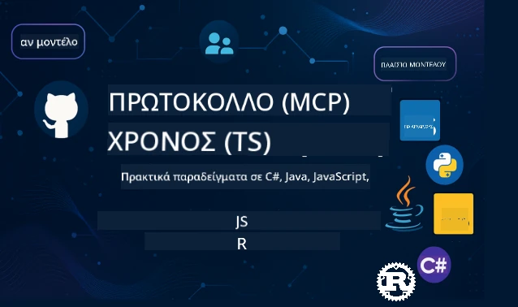

 

[](https://GitHub.com/microsoft/mcp-for-beginners/graphs/contributors)
[](https://GitHub.com/microsoft/mcp-for-beginners/issues)
[](https://GitHub.com/microsoft/mcp-for-beginners/pulls)
[](http://makeapullrequest.com)
[](https://mcptoplist.com/server/mcp.so%2Fmcp-for-beginners%2Fmicrosoft)

[](https://GitHub.com/microsoft/mcp-for-beginners/watchers)
[](https://GitHub.com/microsoft/mcp-for-beginners/fork)
[](https://GitHub.com/microsoft/mcp-for-beginners/stargazers)


[](https://discord.gg/nTYy5BXMWG)

Ακολουθήστε αυτά τα βήματα για να ξεκινήσετε να χρησιμοποιείτε αυτούς τους πόρους:
1. **Διακλάδωση του Αποθετηρίου**: Κάντε κλικ [](https://GitHub.com/microsoft/mcp-for-beginners/fork)
2. **Κλωνοποίηση του Αποθετηρίου**:   `git clone https://github.com/microsoft/mcp-for-beginners.git`
3. **Εγγραφή στο** [](https://discord.gg/nTYy5BXMWG)


### 🌐 Υποστήριξη πολλών γλωσσών

#### Υποστηρίζεται μέσω GitHub Action (Αυτοματοποιημένο & Πάντα Ενημερωμένο)

<!-- CO-OP TRANSLATOR LANGUAGES TABLE START -->
[Arabic](../ar/README.md) | [Bengali](../bn/README.md) | [Bulgarian](../bg/README.md) | [Burmese (Myanmar)](../my/README.md) | [Chinese (Simplified)](../zh-CN/README.md) | [Chinese (Traditional, Hong Kong)](../zh-HK/README.md) | [Chinese (Traditional, Macau)](../zh-MO/README.md) | [Chinese (Traditional, Taiwan)](../zh-TW/README.md) | [Croatian](../hr/README.md) | [Czech](../cs/README.md) | [Danish](../da/README.md) | [Dutch](../nl/README.md) | [Estonian](../et/README.md) | [Finnish](../fi/README.md) | [French](../fr/README.md) | [German](../de/README.md) | [Greek](./README.md) | [Hebrew](../he/README.md) | [Hindi](../hi/README.md) | [Hungarian](../hu/README.md) | [Indonesian](../id/README.md) | [Italian](../it/README.md) | [Japanese](../ja/README.md) | [Kannada](../kn/README.md) | [Khmer](../km/README.md) | [Korean](../ko/README.md) | [Lithuanian](../lt/README.md) | [Malay](../ms/README.md) | [Malayalam](../ml/README.md) | [Marathi](../mr/README.md) | [Nepali](../ne/README.md) | [Nigerian Pidgin](../pcm/README.md) | [Norwegian](../no/README.md) | [Persian (Farsi)](../fa/README.md) | [Polish](../pl/README.md) | [Portuguese (Brazil)](../pt-BR/README.md) | [Portuguese (Portugal)](../pt-PT/README.md) | [Punjabi (Gurmukhi)](../pa/README.md) | [Romanian](../ro/README.md) | [Russian](../ru/README.md) | [Serbian (Cyrillic)](../sr/README.md) | [Slovak](../sk/README.md) | [Slovenian](../sl/README.md) | [Spanish](../es/README.md) | [Swahili](../sw/README.md) | [Swedish](../sv/README.md) | [Tagalog (Filipino)](../tl/README.md) | [Tamil](../ta/README.md) | [Telugu](../te/README.md) | [Thai](../th/README.md) | [Turkish](../tr/README.md) | [Ukrainian](../uk/README.md) | [Urdu](../ur/README.md) | [Vietnamese](../vi/README.md)

> **Προτιμάτε να Κλωνοποιήσετε τοπικά;**
>
> Αυτό το αποθετήριο περιλαμβάνει πάνω από 50 μεταφράσεις γλωσσών που αυξάνουν σημαντικά το μέγεθος λήψης. Για να κλωνοποιήσετε χωρίς μεταφράσεις, χρησιμοποιήστε sparse checkout:
>
> **Bash / macOS / Linux:**
> ```bash
> git clone --filter=blob:none --sparse https://github.com/microsoft/mcp-for-beginners.git
> cd mcp-for-beginners
> git sparse-checkout set --no-cone '/*' '!translations' '!translated_images'
> ```
>
> **CMD (Windows):**
> ```cmd
> git clone --filter=blob:none --sparse https://github.com/microsoft/mcp-for-beginners.git
> cd mcp-for-beginners
> git sparse-checkout set --no-cone "/*" "!translations" "!translated_images"
> ```
>
> Αυτό σας προσφέρει όλα όσα χρειάζεστε για να ολοκληρώσετε το μάθημα με πολύ πιο γρήγορη λήψη.
<!-- CO-OP TRANSLATOR LANGUAGES TABLE END -->

# 🚀 Πρόγραμμα Σπουδών του Πρωτοκόλλου Πλαισίου Μοντέλου (MCP) για Αρχάριους

## **Μάθετε MCP με Παραδείγματα Κώδικα σε C#, Java, JavaScript, Rust, Python και TypeScript**

## 🧠 Επισκόπηση του Προγράμματος Σπουδών του Πρωτοκόλλου Πλαισίου Μοντέλου
Καλώς ήρθατε στο ταξίδι σας στο Πρωτόκολλο Πλαισίου Μοντέλου! Αν έχετε ποτέ αναρωτηθεί πώς οι εφαρμογές Τεχνητής Νοημοσύνης επικοινωνούν με διάφορα εργαλεία και υπηρεσίες, ετοιμαστείτε να ανακαλύψετε τη κομψή λύση που μεταμορφώνει τον τρόπο που οι προγραμματιστές δημιουργούν ευφυή συστήματα.

Σκεφτείτε το MCP ως έναν καθολικό μεταφραστή για εφαρμογές ΤΝ - όπως οι θύρες USB σας επιτρέπουν να συνδέετε οποιαδήποτε συσκευή στον υπολογιστή σας, έτσι και το MCP επιτρέπει στα μοντέλα ΤΝ να συνδέονται με οποιοδήποτε εργαλείο ή υπηρεσία με ένα τυποποιημένο τρόπο. Είτε δημιουργείτε τον πρώτο σας chatbot είτε εργάζεστε σε πολύπλοκες ροές εργασίας ΤΝ, η κατανόηση του MCP θα σας δώσει τη δύναμη να δημιουργήσετε πιο ικανές και ευέλικτες εφαρμογές.

Αυτό το πρόγραμμα σπουδών έχει σχεδιαστεί με υπομονή και φροντίδα για το ταξίδι μάθησής σας. Θα ξεκινήσουμε με απλές έννοιες που ήδη καταλαβαίνετε και σταδιακά θα αναπτύξουμε την εξειδίκευσή σας μέσα από πρακτική εξάσκηση στην αγαπημένη σας γλώσσα προγραμματισμού. Κάθε βήμα περιλαμβάνει σαφείς εξηγήσεις, πρακτικά παραδείγματα και πολύ ενθάρρυνση στην πορεία.

Μέχρι να ολοκληρώσετε αυτό το ταξίδι, θα έχετε την αυτοπεποίθηση να δημιουργήσετε τους δικούς σας MCP servers, να τους ενσωματώσετε με δημοφιλείς πλατφόρμες ΤΝ και να κατανοήσετε πώς αυτή η τεχνολογία αλλάζει το μέλλον της ανάπτυξης ΤΝ. Ας ξεκινήσουμε αυτή τη συναρπαστική περιπέτεια μαζί!

### Επίσημη Τεκμηρίωση και Προδιαγραφές

Αυτό το πρόγραμμα σπουδών είναι ευθυγραμμισμένο με την **Προδιαγραφή MCP 2025-11-25** (η πιο πρόσφατη σταθερή έκδοση). Η προδιαγραφή MCP χρησιμοποιεί έκδοση με βάση την ημερομηνία (μορφή YYYY-MM-DD) για να εξασφαλίσει σαφή παρακολούθηση των εκδόσεων πρωτοκόλλου.

> **Μια ματιά στο μέλλον:** ένας υποψήφιος για έκδοση της επόμενης προδιαγραφής, **2026-07-28**, προγραμματίζεται να κυκλοφορήσει στις 28 Ιουλίου 2026. Κάνει το πρωτόκολλο χωρίς κατάσταση στο επίπεδο μεταφοράς, θεσμοθετεί ένα πλαίσιο Επεκτάσεων (MCP Apps, Tasks), ενισχύει την εξουσιοδότηση και αποσύρει τις λειτουργίες Ρίζας, Δειγματοληψίας και Καταγραφής. Δείτε το [Τι αλλάζει στο MCP: Ο Υποψήφιος για Έκδοση 2026-07-28](./01-CoreConcepts/mcp-2026-07-28-release-candidate.md) για πλήρη ανάλυση.

Αυτοί οι πόροι γίνονται πιο πολύτιμοι καθώς η κατανόησή σας μεγαλώνει, αλλά μην νιώθετε πίεση να διαβάσετε τα πάντα αμέσως. Ξεκινήστε με τις περιοχές που σας ενδιαφέρουν περισσότερο!
- 📘 [Τεκμηρίωση MCP](https://modelcontextprotocol.io/) – Αυτός είναι ο βασικός πόρος για βήμα-βήμα οδηγούς και οδηγίες χρήσης. Η τεκμηρίωση έχει γραφτεί με γνώμονα τους αρχάριους, προσφέροντας καθαρά παραδείγματα που μπορείτε να ακολουθήσετε με τον δικό σας ρυθμό.
- 📜 [Προδιαγραφή MCP](https://modelcontextprotocol.io/specification/2025-11-25) – Σκεφτείτε το ως τον πλήρη οδηγό αναφοράς σας. Καθώς προχωράτε στο πρόγραμμα, θα τις αναζητάτε συχνά για να δείτε συγκεκριμένες λεπτομέρειες και να εξερευνήσετε προηγμένες δυνατότητες.
- 📜 [Έκδοση Προδιαγραφής MCP](https://modelcontextprotocol.io/specification/versioning) – Περιέχει πληροφορίες για το ιστορικό εκδόσεων πρωτοκόλλου και πώς το MCP χρησιμοποιεί έκδοση με βάση την ημερομηνία (μορφή YYYY-MM-DD).
- 🧑‍💻 [Αποθετήριο MCP στο GitHub](https://github.com/modelcontextprotocol) – Εδώ θα βρείτε SDK, εργαλεία και παραδείγματα κώδικα σε διάφορες γλώσσες προγραμματισμού. Είναι ένας θησαυρός πρακτικών παραδειγμάτων και έτοιμων προς χρήση στοιχείων.
- 🌐 [Κοινότητα MCP](https://github.com/orgs/modelcontextprotocol/discussions) – Ενταχθείτε με άλλους μαθητές και έμπειρους προγραμματιστές σε συζητήσεις για το MCP. Είναι μια υποστηρικτική κοινότητα όπου οι ερωτήσεις είναι ευπρόσδεκτες και η γνώση μοιράζεται ελεύθερα.
  
## Στόχοι Μάθησης

Μέχρι το τέλος αυτού του προγράμματος, θα αισθάνεστε αυτοπεποίθηση και ενθουσιασμό για τις νέες σας ικανότητες. Εδώ είναι τι θα επιτύχετε:

• **Κατανόηση των βασικών του MCP**: Θα κατανοήσετε τι είναι το Πρωτόκολλο Πλαισίου Μοντέλου και γιατί φέρνει επανάσταση στον τρόπο που οι εφαρμογές ΤΝ συνεργάζονται, χρησιμοποιώντας αναλογίες και παραδείγματα που έχουν νόημα.

• **Κατασκευή του πρώτου σας MCP server**: Θα δημιουργήσετε έναν λειτουργικό MCP server στη γλώσσα προγραμματισμού που προτιμάτε, ξεκινώντας με απλά παραδείγματα και αναπτύσσοντας τις δεξιότητές σας βήμα-βήμα.

• **Σύνδεση μοντέλων ΤΝ με πραγματικά εργαλεία**: Θα μάθετε πώς να γεφυρώνετε το κενό μεταξύ μοντέλων ΤΝ και πραγματικών υπηρεσιών, δίνοντας στις εφαρμογές σας ισχυρές νέες δυνατότητες.

• **Εφαρμογή βέλτιστων πρακτικών ασφάλειας**: Θα κατανοήσετε πώς να διατηρείτε τις υλοποιήσεις MCP ασφαλείς, προστατεύοντας τις εφαρμογές και τους χρήστες σας.

• **Ανάπτυξη με αυτοπεποίθηση**: Θα ξέρετε πώς να μεταφέρετε τα έργα MCP από την ανάπτυξη στην παραγωγή, με πρακτικές στρατηγικές ανάπτυξης που λειτουργούν στον πραγματικό κόσμο.

• **Ενταχθείτε στην κοινότητα MCP**: Θα γίνετε μέρος μιας αναπτυσσόμενης κοινότητας προγραμματιστών που διαμορφώνουν το μέλλον της ανάπτυξης εφαρμογών ΤΝ.

## Απαραίτητο Υπόβαθρο

Πριν βουτήξουμε σε λεπτομέρειες του MCP, ας βεβαιωθούμε ότι αισθάνεστε άνετα με κάποιες βασικές έννοιες. Μην ανησυχείτε αν δεν είστε ειδικός σε αυτούς τους τομείς - θα εξηγήσουμε όλα όσα χρειάζεστε ενώ προχωράμε!

### Κατανόηση Πρωτοκόλλων (Το Θεμέλιο)

Σκεφτείτε ένα πρωτόκολλο ως τους κανόνες για μια συνομιλία. Όταν καλείτε έναν φίλο, και οι δύο ξέρετε να λέτε "γεια" όταν απαντάτε, να μιλάτε με σειρά και να λέτε "αντίο" όταν τελειώνετε. Τα προγράμματα υπολογιστών χρειάζονται παρόμοιους κανόνες για αποτελεσματική επικοινωνία.

Το MCP είναι ένα πρωτόκολλο - ένα σύνολο συμφωνημένων κανόνων που βοηθούν τα μοντέλα ΤΝ και τις εφαρμογές να έχουν παραγωγικές "συνομιλίες" με εργαλεία και υπηρεσίες. Όπως οι κανόνες συνομιλίας κάνουν την ανθρώπινη επικοινωνία πιο ομαλή, έτσι το MCP καθιστά την επικοινωνία εφαρμογών ΤΝ πιο αξιόπιστη και ισχυρή.

### Σχέσεις Πελάτη-Διακομιστή (Πώς τα Προγράμματα Συνεργάζονται)

Χρησιμοποιείτε καθημερινά σχέσεις πελάτη-διακομιστή! Όταν χρησιμοποιείτε ένα πρόγραμμα περιήγησης (πελάτης) για να επισκεφθείτε μια ιστοσελίδα, συνδέεστε σε έναν web server που σας στέλνει το περιεχόμενο της σελίδας. Το πρόγραμμα ξέρει πώς να ζητήσει πληροφορίες και ο διακομιστής ξέρει πώς να απαντήσει.

Στο MCP, έχουμε μια παρόμοια σχέση: τα μοντέλα ΤΝ λειτουργούν ως πελάτες που ζητούν πληροφορίες ή ενέργειες, ενώ οι MCP servers παρέχουν αυτές τις δυνατότητες. Είναι σαν να έχετε έναν βοηθό (τον διακομιστή) που η ΤΝ μπορεί να ζητήσει να εκτελέσει συγκεκριμένα καθήκοντα.

### Γιατί η Τυποποίηση Έχει Σημασία (Κάνοντας τα Πράγματα Να Λειτουργούν Μαζί)

Φανταστείτε αν κάθε κατασκευαστής αυτοκινήτων χρησιμοποιούσε διαφορετικούς τύπους αντλιών καυσίμου - θα χρειάζεστε έναν διαφορετικό αντάπτορα για κάθε αυτοκίνητο! Η τυποποίηση σημαίνει συμφωνία σε κοινές προσεγγίσεις ώστε τα πράγματα να λειτουργούν αρμονικά.

Το MCP παρέχει αυτήν την τυποποίηση για τις εφαρμογές ΤΝ. Αντί κάθε μοντέλο ΤΝ να χρειάζεται προσαρμοσμένο κώδικα για να συνεργαστεί με κάθε εργαλείο, το MCP δημιουργεί έναν καθολικό τρόπο επικοινωνίας. Αυτό σημαίνει ότι οι προγραμματιστές μπορούν να δημιουργήσουν εργαλεία μία φορά και να λειτουργούν με πολλά διαφορετικά συστήματα ΤΝ.

## 🧭 Επισκόπηση της Διαδρομής Μάθησης σας

Το ταξίδι σας στο MCP είναι δομημένο προσεκτικά για να αναπτύξει την αυτοπεποίθηση και τις δεξιότητές σας σταδιακά. Κάθε φάση εισάγει νέες έννοιες ενώ ενισχύει ό,τι έχετε ήδη μάθει.

### 🌱 Φάση Βάσης: Κατανόηση των Βασικών (Ενότητες 0-2)

Εδώ ξεκινά η περιπέτειά σας! Θα σας εισάγουμε στις έννοιες του MCP χρησιμοποιώντας γνωστές αναλογίες και απλά παραδείγματα. Θα καταλάβετε τι είναι το MCP, γιατί υπάρχει και πώς εντάσσεται στον ευρύτερο κόσμο της ανάπτυξης ΤΝ.


• **Ενότητα 0 - Εισαγωγή στο MCP**: Θα ξεκινήσουμε εξερευνώντας τι είναι το MCP και γιατί είναι τόσο σημαντικό για τις σύγχρονες εφαρμογές τεχνητής νοημοσύνης. Θα δείτε παραδείγματα από πραγματικό κόσμο του MCP σε δράση και θα κατανοήσετε πώς επιλύει κοινά προβλήματα που αντιμετωπίζουν οι προγραμματιστές.

• **Ενότητα 1 - Επεξήγηση Βασικών Εννοιών**: Εδώ θα μάθετε τα βασικά θεμέλια του MCP. Θα χρησιμοποιήσουμε πολλά ανάλογα και οπτικά παραδείγματα ώστε αυτές οι έννοιες να γίνουν φυσικές και κατανοητές.

• **Ενότητα 2 - Ασφάλεια στο MCP**: Η ασφάλεια μπορεί να ακούγεται απαιτητική, αλλά θα σας δείξουμε πώς το MCP περιλαμβάνει ενσωματωμένα χαρακτηριστικά ασφαλείας και θα σας διδάξουμε βέλτιστες πρακτικές που προστατεύουν τις εφαρμογές σας από την αρχή.

### 🔨 Φάση Κατασκευής: Δημιουργώντας τις Πρώτες Υλοποιήσεις σας (Ενότητα 3)

Τώρα αρχίζει η πραγματική διασκέδαση! Θα αποκτήσετε πρακτική εμπειρία δημιουργώντας πραγματικούς MCP servers και clients. Μη ανησυχείτε - θα ξεκινήσουμε απλά και θα σας καθοδηγήσουμε σε κάθε βήμα.

Αυτή η ενότητα περιλαμβάνει πολλούς πρακτικούς οδηγούς που σας επιτρέπουν να εξασκηθείτε στη γλώσσα προγραμματισμού της επιλογής σας. Θα δημιουργήσετε τον πρώτο σας server, θα δημιουργήσετε έναν client για να συνδεθεί σε αυτόν και θα ενσωματωθείτε ακόμα και με δημοφιλή εργαλεία ανάπτυξης όπως το VS Code.

Κάθε οδηγός περιλαμβάνει πλήρη παραδείγματα κώδικα, συμβουλές αντιμετώπισης προβλημάτων και επεξηγήσεις για το γιατί λαμβάνουμε συγκεκριμένες σχεδιαστικές επιλογές. Στο τέλος αυτής της φάσης, θα έχετε λειτουργικές υλοποιήσεις MCP για τις οποίες θα είστε περήφανοι!

### 🚀 Φάση Ανάπτυξης: Προχωρημένες Έννοιες και Εφαρμογές από τον Πραγματικό Κόσμο (Ενότητες 4-5)

Μετά την κατανόηση των βασικών, είστε έτοιμοι να εξερευνήσετε πιο προηγμένα χαρακτηριστικά του MCP. Θα καλύψουμε πρακτικές στρατηγικές υλοποίησης, τεχνικές αποσφαλμάτωσης και προχωρημένα θέματα όπως η πολυτροπική ενσωμάτωση τεχνητής νοημοσύνης.

Θα μάθετε επίσης πώς να κλιμακώνετε τις υλοποιήσεις MCP για χρήση σε παραγωγή και να ενσωματώνεστε με πλατφόρμες cloud όπως η Azure. Αυτές οι ενότητες σας προετοιμάζουν να δημιουργήσετε λύσεις MCP που μπορούν να αντιμετωπίσουν τις απαιτήσεις του πραγματικού κόσμου.

### 🌟 Φάση Εξειδίκευσης: Κοινότητα και Εξειδίκευση (Ενότητες 6-11)

Η τελική φάση εστιάζει στην ένταξή σας στην κοινότητα MCP και στην εξειδίκευση στους τομείς που σας ενδιαφέρουν περισσότερο. Θα μάθετε πώς να συμβάλλετε σε έργα ανοιχτού κώδικα MCP, να υλοποιείτε προηγμένα μοτίβα αυθεντικοποίησης και να δημιουργείτε ολοκληρωμένες λύσεις με ενσωμάτωση βάσεων δεδομένων.

Η Ενότητα 11 αξίζει ειδική αναφορά - είναι μια πλήρης διαδρομή μάθησης με 13 εργαστήρια που σας διδάσκει πώς να δημιουργήσετε MCP servers έτοιμους για παραγωγή με ενσωμάτωση PostgreSQL. Είναι σαν ένα τελικό έργο που συνδυάζει όλα όσα έχετε μάθει!

### 📚 Πλήρης Δομή Προγράμματος Σπουδών

| Ενότητα | Θέμα | Περιγραφή | Σύνδεσμος |
|--------|-------|-------------|------|
| **Ενότητες 0-3: Βασικά** | | | |
| 00 | Εισαγωγή στο MCP | Επισκόπηση του Πρωτοκόλλου Συμφραζομένου Μοντέλου και της σημασίας του σε ροές AI | [Read more](./00-Introduction/README.md) |
| 01 | Επεξήγηση Βασικών Εννοιών | Εκτενής διερεύνηση βασικών εννοιών MCP | [Read more](./01-CoreConcepts/README.md) |
| 1.1 | Τι Αλλάζει στο MCP (2026-07-28 RC) | Αποκεντρωμένο πρωτόκολλο, πλαίσιο επεκτάσεων, και αποσύρσεις δυνατοτήτων στη νέα έκδοση προδιαγραφών | [Guide](./01-CoreConcepts/mcp-2026-07-28-release-candidate.md) |
| 02 | Ασφάλεια στο MCP | Απειλές ασφάλειας και βέλτιστες πρακτικές | [Read more](./02-Security/README.md) |
| 03 | Εισαγωγή στο MCP | Ρύθμιση περιβάλλοντος, βασικοί servers/clients, ενσωμάτωση | [Read more](./03-GettingStarted/README.md) |
| **Ενότητα 3: Δημιουργία του Πρώτου σας Server & Client** | | | |
| 3.1 | Πρώτος Server | Δημιουργήστε τον πρώτο σας MCP server | [Guide](./03-GettingStarted/01-first-server/README.md) |
| 3.2 | Πρώτος Client | Αναπτύξτε έναν βασικό MCP client | [Guide](./03-GettingStarted/02-client/README.md) |
| 3.3 | Client με LLM | Ενσωμάτωση μεγάλων γλωσσικών μοντέλων | [Guide](./03-GettingStarted/03-llm-client/README.md) |
| 3.4 | Ενσωμάτωση VS Code | Χρήση MCP servers στο VS Code | [Guide](./03-GettingStarted/04-vscode/README.md) |
| 3.5 | stdio Server | Δημιουργία servers με μεταφορά stdio | [Guide](./03-GettingStarted/05-stdio-server/README.md) |
| 3.6 | HTTP Streaming | Υλοποίηση streaming HTTP στο MCP | [Guide](./03-GettingStarted/06-http-streaming/README.md) |
| 3.7 | Microsoft Foundry Toolkit | Χρήση του Microsoft Foundry Toolkit με το MCP | [Guide](./03-GettingStarted/07-aitk/README.md) |
| 3.8 | Δοκιμές | Δοκιμάστε την υλοποίηση του MCP server σας | [Guide](./03-GettingStarted/08-testing/README.md) |
| 3.9 | Ανάπτυξη | Αναπτύξτε MCP servers σε παραγωγή | [Guide](./03-GettingStarted/09-deployment/README.md) |
| 3.10 | Προχωρημένη χρήση server | Χρήση προχωρημένων servers για προχωρημένες λειτουργίες και βελτιωμένη αρχιτεκτονική | [Guide](./03-GettingStarted/10-advanced/README.md) |
| 3.11 | Απλή πιστοποίηση | Κεφάλαιο που δείχνει την πιστοποίηση από την αρχή και RBAC | [Guide](./03-GettingStarted/11-simple-auth/README.md) |
| 3.12 | MCP Hosts | Ρύθμιση Claude Desktop, Cursor, Cline και άλλων MCP hosts | [Guide](./03-GettingStarted/12-mcp-hosts/README.md) |
| 3.13 | MCP Inspector | Αποσφαλμάτωση και δοκιμή MCP servers με το εργαλείο Inspector | [Guide](./03-GettingStarted/13-mcp-inspector/README.md) |
| 3.14 | Sampling | Χρήση δειγματοληψίας για συνεργασία με τον client | [Guide](./03-GettingStarted/14-sampling/README.md) |
| 3.15 | MCP Apps | Δημιουργήστε εφαρμογές MCP | [Guide](./03-GettingStarted/15-mcp-apps/README.md) |
| **Ενότητες 4-5: Πρακτικά & Προχωρημένα** | | | |
| 04 | Πρακτική Υλοποίηση | SDKs, αποσφαλμάτωση, δοκιμές, επαναχρησιμοποιήσιμα πρότυπα προτροπής | [Read more](./04-PracticalImplementation/README.md) |
| 4.1 | Σελιδοποίηση | Διαχείριση μεγάλων συνόλων αποτελεσμάτων με σελιδοποίηση βάσει δεικτών | [Guide](./04-PracticalImplementation/pagination/README.md) |
| 05 | Προχωρημένα Θέματα στο MCP | Πολυτροπική AI, κλιμάκωση, χρήση σε επιχειρήσεις | [Read more](./05-AdvancedTopics/README.md) |
| 5.1 | Ενσωμάτωση Azure | Ενσωμάτωση MCP με Azure | [Guide](./05-AdvancedTopics/mcp-integration/README.md) |
| 5.2 | Πολυτροπικότητα | Εργασία με πολλαπλές μορφές | [Guide](./05-AdvancedTopics/mcp-multi-modality/README.md) |
| 5.3 | Demo OAuth2 | Υλοποίηση αυθεντικοποίησης OAuth2 | [Guide](./05-AdvancedTopics/mcp-oauth2-demo/README.md) |
| 5.4 | Ρίζες Συμφραζομένων | Κατανόηση και υλοποίηση ριζικών συμφραζομένων | [Guide](./05-AdvancedTopics/mcp-root-contexts/README.md) |
| 5.5 | Δρομολόγηση | Στρατηγικές δρομολόγησης MCP | [Guide](./05-AdvancedTopics/mcp-routing/README.md) |
| 5.6 | Δειγματοληψία | Τεχνικές δειγματοληψίας στο MCP | [Guide](./05-AdvancedTopics/mcp-sampling/README.md) |
| 5.7 | Κλιμάκωση | Κλιμάκωση υλοποιήσεων MCP | [Guide](./05-AdvancedTopics/mcp-scaling/README.md) |
| 5.8 | Ασφάλεια | Προχωρημένες παρατηρήσεις για την ασφάλεια | [Guide](./05-AdvancedTopics/mcp-security/README.md) |
| 5.9 | Αναζήτηση Ιστού | Υλοποίηση δυνατοτήτων αναζήτησης ιστού | [Guide](./05-AdvancedTopics/web-search-mcp/README.md) |
| 5.10 | Ροή Σε Πραγματικό Χρόνο | Δημιουργία λειτουργικότητας ροής σε πραγματικό χρόνο | [Guide](./05-AdvancedTopics/mcp-realtimestreaming/README.md) |
| 5.11 | Αναζήτηση Σε Πραγματικό Χρόνο | Υλοποίηση αναζήτησης σε πραγματικό χρόνο | [Guide](./05-AdvancedTopics/mcp-realtimesearch/README.md) |
| 5.12 | Πιστοποίηση Entra ID | Πιστοποίηση με Microsoft Entra ID | [Guide](./05-AdvancedTopics/mcp-security-entra/README.md) |
| 5.13 | Ενσωμάτωση Foundry | Ενσωμάτωση με Microsoft Foundry | [Guide](./05-AdvancedTopics/mcp-foundry-agent-integration/README.md) |
| 5.14 | Μηχανική Συμφραζομένων | Τεχνικές για αποτελεσματική μηχανική συμφραζομένων | [Guide](./05-AdvancedTopics/mcp-contextengineering/README.md) |
| 5.15 | Προσαρμοσμένη Μεταφορά MCP | Υλοποιήσεις προσαρμοσμένης μεταφοράς | [Guide](./05-AdvancedTopics/mcp-transport/README.md) |
| 5.16 | Χαρακτηριστικά Πρωτοκόλλου | Ειδοποιήσεις προόδου, ακύρωση, πρότυπα πόρων | [Guide](./05-AdvancedTopics/mcp-protocol-features/README.md) |
| 5.17 | Αντιπαραθετική Σκέψη Πολυπράκτορα | Δύο πράκτορες αντιπαρατίθενται σε αντίθετες πλευρές χρησιμοποιώντας κοινά εργαλεία MCP, αξιολογούμενοι από δικαστή | [Guide](./05-AdvancedTopics/mcp-adversarial-agents/README.md) |
| **Ενότητες 6-10: Κοινότητα & Βέλτιστες Πρακτικές** | | | |
| 06 | Συνεισφορές Κοινότητας | Πώς να συμβάλλετε στο οικοσύστημα MCP | [Guide](./06-CommunityContributions/README.md) |
| 07 | Μαθήματα από Πρώιμη Υιοθέτηση | Ιστορίες υλοποίησης από τον πραγματικό κόσμο | [Guide](./07-LessonsfromEarlyAdoption/README.md) |
| 08 | Βέλτιστες Πρακτικές για το MCP | Απόδοση, αντοχή σε σφάλματα, ανθεκτικότητα | [Guide](./08-BestPractices/README.md) |
| 09 | Μελέτες Περίπτωσης MCP | Πρακτικά παραδείγματα υλοποίησης | [Guide](./09-CaseStudy/README.md) |
| 10 | Εργαστήριο | Δημιουργία MCP Server με Microsoft Foundry Toolkit | [Lab](./10-StreamliningAIWorkflowsBuildingAnMCPServerWithAIToolkit/README.md) |
| **Ενότητα 11: Πρακτικά Εργαστήρια MCP Server** | | | |
| 11 | Ενσωμάτωση Βάσης Δεδομένων MCP Server | Περιεκτική διαδρομή μάθησης 13 εργαστηρίων για ενσωμάτωση PostgreSQL | [Labs](./11-MCPServerHandsOnLabs/README.md) |
| 11.1 | Εισαγωγή | Επισκόπηση MCP με ενσωμάτωση βάσης δεδομένων και χρήση ανάλυσης λιανικής | [Lab 00](./11-MCPServerHandsOnLabs/00-Introduction/README.md) |
| 11.2 | Βασική Αρχιτεκτονική | Κατανόηση αρχιτεκτονικής MCP server, στρώματα βάσης δεδομένων και μοτίβα ασφάλειας | [Lab 01](./11-MCPServerHandsOnLabs/01-Architecture/README.md) |
| 11.3 | Ασφάλεια & Πολυ-ενοικίαση | Ασφάλεια Επιπέδου Γραμμής, αυθεντικοποίηση και πρόσβαση σε δεδομένα πολλαπλών ενοικιαστών | [Lab 02](./11-MCPServerHandsOnLabs/02-Security/README.md) |
| 11.4 | Ρύθμιση Περιβάλλοντος | Ρύθμιση περιβάλλοντος ανάπτυξης, Docker, πόροι Azure | [Lab 03](./11-MCPServerHandsOnLabs/03-Setup/README.md) |
| 11.5 | Σχεδιασμός Βάσης Δεδομένων | Ρύθμιση PostgreSQL, σχεδιασμός schema λιανικής και δείγματα δεδομένων | [Lab 04](./11-MCPServerHandsOnLabs/04-Database/README.md) |
| 11.6 | Υλοποίηση MCP Server | Δημιουργία του FastMCP server με ενσωμάτωση βάσης δεδομένων | [Lab 05](./11-MCPServerHandsOnLabs/05-MCP-Server/README.md) |
| 11.7 | Ανάπτυξη Εργαλείων | Δημιουργία εργαλείων ερωτημάτων βάσης δεδομένων και ανάλυση schema | [Lab 06](./11-MCPServerHandsOnLabs/06-Tools/README.md) |
| 11.8 | Σημασιολογική Αναζήτηση | Υλοποίηση ενσωματώσεων διανυσμάτων με Azure OpenAI και pgvector | [Lab 07](./11-MCPServerHandsOnLabs/07-Semantic-Search/README.md) |
| 11.9 | Δοκιμή & Αποσφαλμάτωση | Στρατηγικές δοκιμών, εργαλεία αποσφαλμάτωσης και μέθοδοι επικύρωσης | [Lab 08](./11-MCPServerHandsOnLabs/08-Testing/README.md) |
| 11.10 | Ενσωμάτωση VS Code | Ρύθμιση ενσωμάτωσης MCP στο VS Code και χρήση AI Chat | [Lab 09](./11-MCPServerHandsOnLabs/09-VS-Code/README.md) |
| 11.11 | Στρατηγικές Ανάπτυξης | Ανάπτυξη Docker, Azure Container Apps και σκέψεις για κλιμάκωση | [Lab 10](./11-MCPServerHandsOnLabs/10-Deployment/README.md) |
| 11.12 | Παρακολούθηση | Application Insights, καταγραφή, παρακολούθηση απόδοσης | [Lab 11](./11-MCPServerHandsOnLabs/11-Monitoring/README.md) |
| 11.13 | Βέλτιστες Πρακτικές | Βελτιστοποίηση απόδοσης, ενίσχυση ασφάλειας και συμβουλές παραγωγής | [Lab 12](./11-MCPServerHandsOnLabs/12-Best-Practices/README.md) |
| **Ενότητα 12: Εργαλεία MCP** | | | |
| 12.1 | Εργαλεία | Χρήση MCP στην εφαρμογή Copilot | [ Guide ](./12-tooling/README.md) |

### 💻 Παραδείγματα Κώδικα

Ένα από τα πιο συναρπαστικά μέρη της εκμάθησης MCP είναι να βλέπετε τις δεξιότητές σας στον κώδικα να αναπτύσσονται βαθμιαία. Έχουμε σχεδιάσει τα παραδείγματα κώδικα μας να ξεκινούν απλά και να γίνονται πιο σύνθετα καθώς εμβαθύνετε στην κατανόηση. Δείτε πώς εισάγουμε έννοιες - με κώδικα που είναι εύκολο να κατανοηθεί αλλά δείχνει πραγματικές αρχές MCP, θα καταλάβετε όχι μόνο τι κάνει αυτός ο κώδικας, αλλά και γιατί είναι δομημένος έτσι και πώς εντάσσεται σε μεγαλύτερες εφαρμογές MCP.

#### Βασικά Παραδείγματα Υπολογιστή MCP

| Γλώσσα | Περιγραφή | Σύνδεσμος |
|----------|-------------|------|

| C# | Παράδειγμα Διακομιστή MCP | [Προβολή Κώδικα](./03-GettingStarted/samples/csharp/README.md) |
| Java | Υπολογιστής MCP | [Προβολή Κώδικα](./03-GettingStarted/samples/java/calculator/README.md) |
| JavaScript | Επίδειξη MCP | [Προβολή Κώδικα](./03-GettingStarted/samples/javascript/README.md) |
| Python | Διακομιστής MCP | [Προβολή Κώδικα](../../03-GettingStarted/samples/python/mcp_calculator_server.py) |
| TypeScript | Παράδειγμα MCP | [Προβολή Κώδικα](./03-GettingStarted/samples/typescript/README.md) |
| Rust | Παράδειγμα MCP | [Προβολή Κώδικα](./03-GettingStarted/samples/rust/README.md) |

#### Προχωρημένες Υλοποιήσεις MCP

| Γλώσσα | Περιγραφή | Σύνδεσμος |
|----------|-------------|------|
| C# | Προχωρημένο Παράδειγμα | [Προβολή Κώδικα](./04-PracticalImplementation/samples/csharp/README.md) |
| Java με Spring | Παράδειγμα Εφαρμογής Container | [Προβολή Κώδικα](./04-PracticalImplementation/samples/java/containerapp/README.md) |
| JavaScript | Προχωρημένο Παράδειγμα | [Προβολή Κώδικα](./04-PracticalImplementation/samples/javascript/README.md) |
| Python | Πολύπλοκη Υλοποίηση | [Προβολή Κώδικα](./04-PracticalImplementation/samples/python/README.md) |
| TypeScript | Παράδειγμα Container | [Προβολή Κώδικα](./04-PracticalImplementation/samples/typescript/README.md) |


## 🎯 Προαπαιτούμενα για την Εκμάθηση MCP

Για να αξιοποιήσετε στο έπακρο αυτό το πρόγραμμα σπουδών, πρέπει να έχετε:

- Βασικές γνώσεις προγραμματισμού σε τουλάχιστον μία από τις ακόλουθες γλώσσες: C#, Java, JavaScript, Python ή TypeScript
- Κατανόηση του μοντέλου πελάτη-διακομιστή και των API
- Εξοικείωση με τις έννοιες REST και HTTP
- (Προαιρετικό) Υπόβαθρο σε έννοιες AI/ML

- Συμμετοχή σε συζητήσεις της κοινότητάς μας για υποστήριξη

## 📚 Οδηγός Μελέτης & Πόροι

Αυτό το αποθετήριο περιλαμβάνει διάφορους πόρους για να σας βοηθήσει να πλοηγηθείτε και να μάθετε αποτελεσματικά:

### Οδηγός Μελέτης

Ένας περιεκτικός [Οδηγός Μελέτης](./study_guide.md) είναι διαθέσιμος για να σας βοηθήσει να πλοηγηθείτε αποτελεσματικά σε αυτό το αποθετήριο. Αυτός ο οπτικός χάρτης προγράμματος σπουδών δείχνει πώς συνδέονται όλα τα θέματα και παρέχει κατευθύνσεις για το πώς να χρησιμοποιήσετε τα δείγματα έργων αποτελεσματικά. Είναι ιδιαίτερα χρήσιμος αν είστε οπτικός μαθητής που θέλει να δει τη μεγάλη εικόνα.

Ο οδηγός περιλαμβάνει:
- Έναν οπτικό χάρτη προγράμματος με όλα τα καλυπτόμενα θέματα
- Λεπτομερή ανάλυση κάθε ενότητας του αποθετηρίου
- Οδηγίες για το πώς να χρησιμοποιήσετε τα δείγματα έργων
- Προτεινόμενες διαδρομές μάθησης για διαφορετικά επίπεδα δεξιοτήτων
- Πρόσθετους πόρους για να συμπληρώσετε το ταξίδι της μάθησής σας

### Αρχείο Αλλαγών

Συντηρούμε ένα λεπτομερές [Αρχείο Αλλαγών](./changelog.md) που παρακολουθεί όλες τις σημαντικές ενημερώσεις στο υλικό του προγράμματος σπουδών, ώστε να παραμένετε ενημερωμένοι με τις τελευταίες βελτιώσεις και προσθήκες.
- Νέες προσθήκες περιεχομένου
- Δομικές αλλαγές
- Βελτιώσεις λειτουργιών
- Ενημερώσεις τεκμηρίωσης

## 🛠️ Πώς να χρησιμοποιήσετε αυτό το πρόγραμμα σπουδών αποδοτικά

Κάθε μάθημα σε αυτόν τον οδηγό περιλαμβάνει:

1. Σαφείς εξηγήσεις των εννοιών MCP  
2. Παραδείγματα ζωντανού κώδικα σε πολλές γλώσσες  
3. Ασκήσεις για την κατασκευή πραγματικών εφαρμογών MCP  
4. Πρόσθετους πόρους για προχωρημένους μαθητές

### Ας μάθουμε MCP με C# - Σειρά Μαθημάτων
Ας μάθουμε για το Model Context Protocol (MCP), ένα πρωτοποριακό πλαίσιο σχεδιασμένο να τυποποιήσει τις αλληλεπιδράσεις μεταξύ μοντέλων AI και πελατειακών εφαρμογών. Μέσω αυτής της φιλικής προς τον αρχάριο συνεδρίας, θα σας παρουσιάσουμε το MCP και θα σας καθοδηγήσουμε στη δημιουργία του πρώτου σας διακομιστή MCP.
#### C#: [https://aka.ms/letslearnmcp-csharp](https://aka.ms/letslearnmcp-csharp)
#### Java: [https://aka.ms/letslearnmcp-java](https://aka.ms/letslearnmcp-java)
#### JavaScript: [https://aka.ms/letslearnmcp-javascript](https://aka.ms/letslearnmcp-javascript)
#### Python: [https://aka.ms/letslearnmcp-python](https://aka.ms/letslearnmcp-python)

## 🎓 Το ταξίδι σου με το MCP ξεκινά

Συγχαρητήρια! Μόλις έκανες το πρώτο βήμα σε ένα συναρπαστικό ταξίδι που θα επεκτείνει τις ικανότητές σου στον προγραμματισμό και θα σε συνδέσει με την αιχμή της ανάπτυξης AI.

### Τι έχεις ήδη επιτύχει

Διαβάζοντας αυτή την εισαγωγή, έχεις ήδη ξεκινήσει να χτίζεις το θεμέλιο γνώσεων MCP. Καταλαβαίνεις τι είναι το MCP, γιατί έχει σημασία, και πώς αυτό το πρόγραμμα σπουδών θα υποστηρίξει το ταξίδι μάθησής σου. Αυτό είναι ένα σημαντικό επίτευγμα και η αρχή της εξειδίκευσής σου σε αυτήν την σημαντική τεχνολογία.

### Η περιπέτεια που έρχεται

Καθώς προχωράς μέσα από τις ενότητες, θυμήσου ότι κάθε ειδικός ήταν κάποτε αρχάριος. Οι έννοιες που ίσως φαίνονται περίπλοκες τώρα θα γίνουν δεύτερη φύση καθώς τις εξασκείς και τις εφαρμόζεις. Κάθε μικρό βήμα χτίζει ισχυρές ικανότητες που θα σε υπηρετήσουν σε όλη την καριέρα ανάπτυξής σου.

### Το δίκτυο υποστήριξής σου

Εντάσσεσαι σε μια κοινότητα μαθητών και ειδικών που αγαπούν το MCP και είναι πρόθυμοι να βοηθήσουν άλλους να πετύχουν. Είτε κολλάς σε μια πρόκληση κώδικα είτε είσαι ενθουσιασμένος να μοιραστείς μια ανακάλυψη, η κοινότητα είναι εδώ για να στηρίξει το ταξίδι σου.

Αν κολλήσεις ή έχεις απορίες για την κατασκευή εφαρμογών AI, συμμετείχε στις συζητήσεις μαζί με άλλους μαθητές και έμπειρους προγραμματιστές σχετικά με το MCP. Είναι μια υποστηρικτική κοινότητα όπου οι ερωτήσεις γίνονται δεκτές και η γνώση μοιράζεται ελεύθερα.

[](https://discord.gg/nTYy5BXMWG)

Αν έχεις σχολιασμό προϊόντος ή σφάλματα κατά την κατασκευή, επισκέψου:

[](https://aka.ms/foundry/forum)

### Έτοιμος να ξεκινήσεις;

Η περιπέτεια σου με το MCP ξεκινά τώρα! Ξεκίνα με τη Ενότητα 0 για να βυθιστείς στην πρώτη σου πρακτική εμπειρία MCP ή εξερεύνησε τα δείγματα έργων για να δεις τι θα κατασκευάσεις. Θυμήσου - κάθε ειδικός ξεκίνησε ακριβώς όπου βρίσκεσαι τώρα, και με υπομονή και εξάσκηση, θα εκπλαγείς με το τι μπορείς να επιτύχεις.

Καλώς ήρθες στον κόσμο της ανάπτυξης Model Context Protocol. Ας φτιάξουμε κάτι καταπληκτικό μαζί!

## 🤝 Συμβολή στην Κοινότητα Μάθησης

Αυτό το πρόγραμμα σπουδών γίνεται πιο δυνατό με τις συνεισφορές από μαθητές όπως εσύ! Είτε διορθώνεις ένα λάθος, προτείνεις μια πιο καθαρή εξήγηση ή προσθέτεις ένα νέο παράδειγμα, οι συνεισφορές σου βοηθούν άλλους αρχάριους να πετύχουν.

Ευχαριστούμε τον Επαγγελματία Εκτιμημένο από τη Microsoft [Shivam Goyal](https://www.linkedin.com/in/shivam2003/) για τις συνεισφορές σε δείγματα κώδικα.

Η διαδικασία συνεισφοράς έχει σχεδιαστεί να είναι φιλόξενη και υποστηρικτική. Οι περισσότερες συνεισφορές απαιτούν Συμφωνία Άδειας Συνεισφοράς (CLA), αλλά τα αυτοματοποιημένα εργαλεία θα σας καθοδηγήσουν ομαλά μέσα από τη διαδικασία.

## 📜 Μάθηση Ανοιχτού Κώδικα

Ολόκληρο αυτό το πρόγραμμα σπουδών είναι διαθέσιμο υπό την άδεια MIT [LICENSE](../../LICENSE), που σημαίνει ότι μπορείτε να το χρησιμοποιήσετε, να το τροποποιήσετε και να το μοιραστείτε ελεύθερα. Αυτό υποστηρίζει την αποστολή μας να κάνουμε τη γνώση MCP προσβάσιμη σε προγραμματιστές παντού.
## 🤝 Οδηγίες Συμβολής

Αυτό το έργο καλωσορίζει συνεισφορές και προτάσεις. Οι περισσότερες συνεισφορές απαιτούν να συμφωνήσετε σε μια
Συμφωνία Άδειας Συνεισφοράς (CLA) που δηλώνει ότι έχετε το δικαίωμα, και πράγματι παραχωρείτε σε εμάς
τα δικαιώματα χρήσης της συνεισφοράς σας. Για λεπτομέρειες, επισκεφτείτε <https://cla.opensource.microsoft.com>.

Όταν υποβάλλετε ένα pull request, ένα bot CLA θα καθορίσει αυτόματα αν πρέπει να παρέχετε
μια CLA και θα διακοσμήσει ανάλογα το PR (π.χ. έλεγχος κατάστασης, σχόλιο). Απλώς ακολουθήστε τις οδηγίες
που παρέχονται από το bot. Θα χρειαστεί να το κάνετε μόνο μια φορά σε όλα τα αποθετήρια που χρησιμοποιούν την CLA μας.

Αυτό το έργο έχει υιοθετήσει τον [Κώδικα Συμπεριφοράς Ανοιχτού Κώδικα της Microsoft](https://opensource.microsoft.com/codeofconduct/).
Για περισσότερες πληροφορίες δείτε τις [Συχνές Ερωτήσεις Κώδικα Συμπεριφοράς](https://opensource.microsoft.com/codeofconduct/faq/) ή
επικοινωνήστε με [opencode@microsoft.com](mailto:opencode@microsoft.com) για οποιεσδήποτε πρόσθετες ερωτήσεις ή σχόλια.

---

*Έτοιμος να ξεκινήσεις το ταξίδι MCP σου; Ξεκίνα με το [Module 00 - Εισαγωγή στο MCP](./00-Introduction/README.md) και κάνε τα πρώτα σου βήματα στον κόσμο της ανάπτυξης Model Context Protocol!*


## 🎒 Άλλα Μαθήματα
Η ομάδα μας παράγει και άλλα μαθήματα! Δες:

<!-- CO-OP TRANSLATOR OTHER COURSES START -->
### LangChain
[](https://aka.ms/langchain4j-for-beginners)
[](https://aka.ms/langchainjs-for-beginners?WT.mc_id=m365-94501-dwahlin)
[](https://github.com/microsoft/langchain-for-beginners?WT.mc_id=m365-94501-dwahlin)
---

### Azure / Edge / MCP / Agents
[](https://github.com/microsoft/AZD-for-beginners?WT.mc_id=academic-105485-koreyst)
[](https://github.com/microsoft/edgeai-for-beginners?WT.mc_id=academic-105485-koreyst)
[](https://github.com/microsoft/mcp-for-beginners?WT.mc_id=academic-105485-koreyst)
[](https://github.com/microsoft/ai-agents-for-beginners?WT.mc_id=academic-105485-koreyst)

---
 
### Σειρά Γεννητικής Τεχνητής Νοημοσύνης
[](https://github.com/microsoft/generative-ai-for-beginners?WT.mc_id=academic-105485-koreyst)
[-9333EA?style=for-the-badge&labelColor=E5E7EB&color=9333EA)](https://github.com/microsoft/Generative-AI-for-beginners-dotnet?WT.mc_id=academic-105485-koreyst)
[-C084FC?style=for-the-badge&labelColor=E5E7EB&color=C084FC)](https://github.com/microsoft/generative-ai-for-beginners-java?WT.mc_id=academic-105485-koreyst)
[-E879F9?style=for-the-badge&labelColor=E5E7EB&color=E879F9)](https://github.com/microsoft/generative-ai-with-javascript?WT.mc_id=academic-105485-koreyst)

---
 
### Βασική Μάθηση
[](https://aka.ms/ml-beginners?WT.mc_id=academic-105485-koreyst)
[](https://aka.ms/datascience-beginners?WT.mc_id=academic-105485-koreyst)
[](https://aka.ms/ai-beginners?WT.mc_id=academic-105485-koreyst)

[](https://github.com/microsoft/Security-101?WT.mc_id=academic-96948-sayoung)
[](https://aka.ms/webdev-beginners?WT.mc_id=academic-105485-koreyst)
[](https://aka.ms/iot-beginners?WT.mc_id=academic-105485-koreyst)
[](https://github.com/microsoft/xr-development-for-beginners?WT.mc_id=academic-105485-koreyst)

---
 
### Σειρά Copilot
[](https://aka.ms/GitHubCopilotAI?WT.mc_id=academic-105485-koreyst)
[](https://github.com/microsoft/mastering-github-copilot-for-dotnet-csharp-developers?WT.mc_id=academic-105485-koreyst)
[](https://github.com/microsoft/CopilotAdventures?WT.mc_id=academic-105485-koreyst)
<!-- CO-OP TRANSLATOR OTHER COURSES END -->

---

<!-- CO-OP TRANSLATOR DISCLAIMER START -->
**Αποποίηση ευθυνών**:
Αυτό το έγγραφο έχει μεταφραστεί χρησιμοποιώντας την υπηρεσία μετάφρασης με τεχνητή νοημοσύνη [Co-op Translator](https://github.com/Azure/co-op-translator). Ενώ επιδιώκουμε την ακρίβεια, παρακαλούμε να έχετε υπόψη ότι οι αυτοματοποιημένες μεταφράσεις ενδέχεται να περιέχουν λάθη ή ανακρίβειες. Το πρωτότυπο έγγραφο στη μητρική του γλώσσα πρέπει να θεωρείται η αυθεντική πηγή. Για κρίσιμες πληροφορίες, συνιστάται επαγγελματική ανθρώπινη μετάφραση. Δεν φέρουμε ευθύνη για τυχόν παρεξηγήσεις ή λανθασμένες ερμηνείες που προκύπτουν από τη χρήση αυτής της μετάφρασης.
<!-- CO-OP TRANSLATOR DISCLAIMER END -->