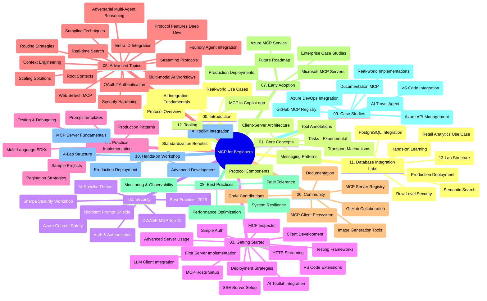

# Πρωτόκολλο Πλαισίου Μοντέλου (MCP) για Αρχάριους - Οδηγός Μελέτης

Αυτός ο οδηγός μελέτης παρέχει μια επισκόπηση της δομής και του περιεχομένου του αποθετηρίου για το πρόγραμμα σπουδών "Πρωτόκολλο Πλαισίου Μοντέλου (MCP) για Αρχάριους". Χρησιμοποιήστε αυτόν τον οδηγό για να πλοηγηθείτε αποτελεσματικά στο αποθετήριο και να αξιοποιήσετε στο έπακρο τους διαθέσιμους πόρους.

## Επισκόπηση Αποθετηρίου

Το Πρωτόκολλο Πλαισίου Μοντέλου (MCP) είναι ένα τυποποιημένο πλαίσιο για αλληλεπιδράσεις μεταξύ μοντέλων τεχνητής νοημοσύνης και πελατειακών εφαρμογών. Αρχικά δημιουργήθηκε από την Anthropic, το MCP πλέον διατηρείται από την ευρύτερη κοινότητα MCP μέσω της επίσημης οργάνωσης στο GitHub. Αυτό το αποθετήριο παρέχει ένα ολοκληρωμένο πρόγραμμα σπουδών με πρακτικά παραδείγματα κώδικα σε C#, Java, JavaScript, Python και TypeScript, σχεδιασμένο για προγραμματιστές τεχνητής νοημοσύνης, αρχιτέκτονες συστημάτων και μηχανικούς λογισμικού.

## Οπτικός Χάρτης Προγράμματος Σπουδών

## Δομή Αποθετηρίου

Το αποθετήριο οργανώνεται σε δώδεκα βασικές ενότητες, καθεμία εστιάζοντας σε διαφορετικές πτυχές του MCP:

1. **Εισαγωγή (00-Introduction/)**
   - Επισκόπηση του Πρωτοκόλλου Πλαισίου Μοντέλου
   - Γιατί η τυποποίηση είναι σημαντική στις ροές εργασίας ΤΝ
   - Πρακτικές χρήσεις και ωφέλη

2. **Κύριες Έννοιες (01-CoreConcepts/)**
   - Αρχιτεκτονική πελάτη-εξυπηρετητή
   - Βασικά στοιχεία πρωτοκόλλου
   - Πρότυπα μηνυμάτων στο MCP
   - Τρέχουσα προδιαγραφή: [Τι έχει αλλάξει στο MCP: Η προδιαγραφή 2026-07-28](./01-CoreConcepts/mcp-2026-07-28.md) — ο χωρίς κατάσταση πυρήνας πρωτοκόλλου, πλαίσιο επεκτάσεων και καταργήσεις Roots/Sampling/Logging

3. **Ασφάλεια (02-Security/)**
   - Απειλές ασφαλείας σε συστήματα βασισμένα σε MCP
   - Καλές πρακτικές για την ασφαλή υλοποίηση
   - Στρατηγικές πιστοποίησης και εξουσιοδότησης
   - Πρακτικό [παράδειγμα εξουσιοδότησης CIMD και DCR](./02-Security/samples/cimd-dcr-auth/README.md)
   - **Ολοκληρωμένη Τεκμηρίωση Ασφαλείας**:
     - Καλές Πρακτικές Ασφαλείας MCP
     - Οδηγός Υλοποίησης Προστασίας Περιεχομένου Azure
     - Έλεγχοι και Τεχνικές Ασφαλείας MCP
     - Ταχεία Αναφορά Καλών Πρακτικών MCP
   - **Κύρια Θέματα Ασφάλειας**:
     - Εισαγωγή εντολών και επιθέσεις δηλητηρίασης εργαλείων
     - Υφαρπαγή συνεδρίας και προβλήματα confused deputy
     - Ευπάθειες διαμεταγωγής διακριτικών
     - Υπερβολικά δικαιώματα και έλεγχος πρόσβασης
     - Ασφάλεια αλυσίδας εφοδιασμού για συστατικά ΤΝ
     - Ενσωμάτωση Microsoft Prompt Shields

4. **Εκκίνηση (03-GettingStarted/)**
   - Ρύθμιση και διαμόρφωση περιβάλλοντος
   - Δημιουργία βασικών MCP εξυπηρετητών και πελατών
   - Ενσωμάτωση με υπάρχουσες εφαρμογές
   - Περιλαμβάνει ενότητες για:
     - Πρώτη υλοποίηση εξυπηρετητή
     - Ανάπτυξη πελάτη
     - Ενσωμάτωση πελάτη LLM
     - Ενσωμάτωση VS Code
     - Εξυπηρετητής Server-Sent Events (SSE)
     - Προηγμένη χρήση εξυπηρετητή
     - Ροή HTTP
     - Ενσωμάτωση AI Toolkit
     - Στρατηγικές δοκιμών
     - Οδηγίες ανάπτυξης

5. **Πρακτική Υλοποίηση (04-PracticalImplementation/)**
   - Χρήση SDK σε διάφορες γλώσσες προγραμματισμού
   - Τεχνικές αποσφαλμάτωσης, δοκιμών και επαλήθευσης
   - Δημιουργία επαναχρησιμοποιήσιμων προτύπων και ροών εργασίας εντολών
   - Παραδείγματα έργων με υλοποιήσεις

6. **Προχωρημένα Θέματα (05-AdvancedTopics/)**
   - Τεχνικές μηχανικής πλαισίου
   - Ενσωμάτωση πράκτορα Foundry
   - Πολυτροπικές ροές εργασίας ΤΝ
   - Επιδείξεις πιστοποίησης OAuth2
   - Δυνατότητες αναζήτησης σε πραγματικό χρόνο
   - Ροή δεδομένων σε πραγματικό χρόνο
   - Υλοποίηση πλαισίων ρίζας
   - Στρατηγικές δρομολόγησης
   - Τεχνικές δειγματοληψίας
   - Προσεγγίσεις κλιμάκωσης
   - Ζητήματα ασφάλειας
   - Ενσωμάτωση ασφάλειας Entra ID
   - Ενσωμάτωση διαδικτυακής αναζήτησης
   - Επιθετική πολυπρακτορική λογική (πρότυπα αντιπαράθεσης)

7. **Συνεισφορές Κοινότητας (06-CommunityContributions/)**
   - Πώς να συνεισφέρετε κώδικα και τεκμηρίωση
   - Συνεργασία μέσω GitHub
   - Βελτιώσεις καθοδηγούμενες από την κοινότητα και ανατροφοδότηση
   - Χρήση διαφόρων πελατών MCP (Claude Desktop, Cline, VSCode)
   - Εργασία με δημοφιλείς MCP εξυπηρετητές συμπεριλαμβανομένης δημιουργίας εικόνας

8. **Μαθήματα από Πρώιμη Υιοθέτηση (07-LessonsfromEarlyAdoption/)**
   - Υλοποιήσεις στον πραγματικό κόσμο και ιστορίες επιτυχίας
   - Δημιουργία και ανάπτυξη λύσεων βασισμένων σε MCP
   - Τάσεις και μελλοντικός οδικός χάρτης
   - **Οδηγός Microsoft MCP Servers**: Ολοκληρωμένος οδηγός για 10 MCP εξυπηρετητές έτοιμους για παραγωγή, μεταξύ άλλων:
     - Microsoft Learn Docs MCP Server
     - Azure MCP Server (15+ εξειδικευμένοι συνδέσεις)
     - GitHub MCP Server
     - Azure DevOps MCP Server
     - MarkItDown MCP Server
     - SQL Server MCP Server
     - Playwright MCP Server
     - Dev Box MCP Server
     - Microsoft Foundry MCP Server
     - Microsoft 365 Agents Toolkit MCP Server

9. **Καλές Πρακτικές (08-BestPractices/)**
   - Βελτιστοποίηση απόδοσης και ρύθμιση
   - Σχεδιασμός ανθεκτικών MCP συστημάτων
   - Στρατηγικές δοκιμών και ανθεκτικότητας

10. **Μελέτες Περιπτώσεων (09-CaseStudy/)**
    - **Επτά ολοκληρωμένες μελέτες περιπτώσεων** που δείχνουν την ευελιξία του MCP σε διάφορα σενάρια:
    - **Azure AI Travel Agents**: Πολυπρακτορική ορχήστρωση με Azure OpenAI και AI Search
    - **Azure DevOps Integration**: Αυτοματισμός ροών εργασιών με ενημερώσεις δεδομένων YouTube
    - **Ανάκτηση Τεκμηρίωσης σε Πραγματικό Χρόνο**: Πελάτης κονσόλας Python με HTTP streaming
    - **Διαδραστικός Γεννήτορας Σχεδίου Μελέτης**: Εφαρμογή Chainlit web με συνομιλητική AI
    - **Τεκμηρίωση εντός Επεξεργαστή**: Ενσωμάτωση VS Code με ροές εργασίας GitHub Copilot
    - **Διαχείριση API Azure**: Ενσωμάτωση επιχειρηματικών API με δημιουργία MCP server
    - **Μητρώο GitHub MCP**: Ανάπτυξη οικοσυστήματος και πλατφόρμα ενσωμάτωσης πρακτόρων
    - Παραδείγματα υλοποίησης που καλύπτουν επιχειρηματική ενσωμάτωση, παραγωγικότητα προγραμματιστών και ανάπτυξη οικοσυστήματος

11. **Πρακτικό Εργαστήριο (10-StreamliningAIWorkflowsBuildingAnMCPServerWithAIToolkit/)**
    - Ολοκληρωμένο πρακτικό εργαστήριο που συνδυάζει MCP με AI Toolkit
    - Δημιουργία έξυπνων εφαρμογών που γεφυρώνουν μοντέλα ΤΝ με εργαλεία πραγματικού κόσμου
    - Πρακτικές ενότητες που καλύπτουν τα βασικά, ανάπτυξη προσαρμοσμένου εξυπηρετητή και στρατηγικές παραγωγικής ανάπτυξης
    - **Δομή Εργαστηρίου**:
      - Εργαστήριο 1: Βασικά MCP Server
      - Εργαστήριο 2: Προχωρημένη Ανάπτυξη MCP Server
      - Εργαστήριο 3: Ενσωμάτωση AI Toolkit
      - Εργαστήριο 4: Παραγωγική Ανάπτυξη και Κλιμάκωση
    - Εκπαιδευτική προσέγγιση βασισμένη σε εργαστήρια με βήμα-βήμα οδηγίες

12. **Εργαστήρια Ενσωμάτωσης Βάσεων Δεδομένων MCP Server (11-MCPServerHandsOnLabs/)**
    - **Ολοκληρωμένη διαδρομή 13 εργαστηρίων** για δημιουργία MCP εξυπηρετητών παραγωγής με ενσωμάτωση PostgreSQL
    - **Υλοποίηση ανάλυσης λιανικής σε πραγματικό κόσμο** χρησιμοποιώντας το σενάριο χρήσης Zava Retail
    - **Πρότυπα επιχειρηματικού επιπέδου** περιλαμβάνοντας Row Level Security (RLS), σημασιολογική αναζήτηση και πολυ-ενοικιακή πρόσβαση δεδομένων
    - **Πλήρης Δομή Εργαστηρίου**:
      - **Εργαστήρια 00-03: Θεμελιώδη** - Εισαγωγή, Αρχιτεκτονική, Ασφάλεια, Ρύθμιση Περιβάλλοντος
      - **Εργαστήρια 04-06: Δημιουργία MCP Server** - Σχεδιασμός Βάσης Δεδομένων, Υλοποίηση MCP Server, Ανάπτυξη Εργαλείων
      - **Εργαστήρια 07-09: Προχωρημένα Χαρακτηριστικά** - Σημασιολογική Αναζήτηση, Δοκιμές & Αποσφαλμάτωση, Ενσωμάτωση VS Code
      - **Εργαστήρια 10-12: Παραγωγή & Καλές Πρακτικές** - Ανάπτυξη, Παρακολούθηση, Βελτιστοποίηση
    - **Τεχνολογίες που Καλύπτονται**: Πλαίσιο FastMCP, PostgreSQL, Azure OpenAI, Azure Container Apps, Application Insights
    - **Αποτελέσματα Μάθησης**: MCP servers παραγωγής, πρότυπα ενσωμάτωσης βάσης δεδομένων, αναλύσεις με τεχνητή νοημοσύνη, ασφάλεια επιπέδου επιχείρησης

13. **Εργαλεία (12-tooling/)**
    - Μάθετε πώς να χρησιμοποιείτε το MCP στην εφαρμογή Copilot και σε άλλα εργαλεία

## Πρόσθετοι Πόροι

Το αποθετήριο περιλαμβάνει υποστηρικτικούς πόρους:

- **Φάκελος Εικόνων**: Περιέχει διαγράμματα και εικονογραφήσεις που χρησιμοποιούνται καθ’ όλη τη διάρκεια του προγράμματος σπουδών
- **Μεταφράσεις**: Υποστήριξη πολλαπλών γλωσσών με αυτοματοποιημένες μεταφράσεις της τεκμηρίωσης
- **Επίσημοι Πόροι MCP**:
  - [Τεκμηρίωση MCP](https://modelcontextprotocol.io/)
  - [Προδιαγραφή MCP](https://modelcontextprotocol.io/specification/2026-07-28/)
  - [Αποθετήριο MCP στο GitHub](https://github.com/modelcontextprotocol)

## Πώς να Χρησιμοποιήσετε Αυτό το Αποθετήριο

1. **Ακολουθία Μάθησης**: Ακολουθήστε τα κεφάλαια με τη σειρά (00 έως 11) για μια δομημένη εμπειρία μάθησης.
2. **Εστίαση σε Γλώσσα Προγραμματισμού**: Εάν ενδιαφέρεστε για μια συγκεκριμένη γλώσσα προγραμματισμού, εξερευνήστε τους φακέλους με τα δείγματα για υλοποιήσεις στη γλώσσα της επιλογής σας.
3. **Πρακτική Υλοποίηση**: Ξεκινήστε με την ενότητα "Εκκίνηση" για να ρυθμίσετε το περιβάλλον σας και να δημιουργήσετε τον πρώτο MCP εξυπηρετητή και πελάτη.
4. **Προχωρημένη Εξερεύνηση**: Μόλις νιώσετε άνετα με τα βασικά, εμβαθύνετε στα προχωρημένα θέματα για να διευρύνετε τις γνώσεις σας.
5. **Συμμετοχή στην Κοινότητα**: Ενταχθείτε στην κοινότητα MCP μέσω συζητήσεων στο GitHub και καναλιών Discord για να συνδεθείτε με ειδικούς και συναδέλφους προγραμματιστές.

## Πελάτες και Εργαλεία MCP

Το πρόγραμμα καλύπτει διάφορους πελάτες και εργαλεία MCP:

1. **Επίσημοι Πελάτες**:
   - Visual Studio Code 
   - MCP στο Visual Studio Code
   - Claude Desktop
   - Claude στο VSCode 
   - Claude API

2. **Κοινοτικοί Πελάτες**:
   - Cline (με βάση τερματικό)
   - Cursor (επεξεργαστής κώδικα)
   - ChatMCP
   - Windsurf

3. **Εργαλεία Διαχείρισης MCP**:
   - MCP CLI
   - MCP Manager
   - MCP Linker
   - MCP Router

## Δημοφιλείς MCP Εξυπηρετητές

Το αποθετήριο παρουσιάζει διάφορους MCP εξυπηρετητές, συμπεριλαμβανομένων:

1. **Επίσημοι Microsoft MCP Εξυπηρετητές**:
   - Microsoft Learn Docs MCP Server
   - Azure MCP Server (15+ εξειδικευμένοι συνδέσεις)
   - GitHub MCP Server
   - Azure DevOps MCP Server
   - MarkItDown MCP Server
   - SQL Server MCP Server
   - Playwright MCP Server
   - Dev Box MCP Server
   - Microsoft Foundry MCP Server
   - Microsoft 365 Agents Toolkit MCP Server

2. **Επίσημοι Αναφορικοί Εξυπηρετητές**:
   - Filesystem
   - Fetch
   - Memory
   - Sequential Thinking

3. **Δημιουργία Εικόνων**:
   - Azure OpenAI DALL-E 3
   - Stable Diffusion WebUI
   - Replicate

4. **Εργαλεία Ανάπτυξης**:
   - Git MCP
   - Terminal Control
   - Code Assistant

5. **Εξειδικευμένοι Εξυπηρετητές**:
   - Salesforce
   - Microsoft Teams
   - Jira & Confluence

## Συνεισφορά

Αυτό το αποθετήριο καλωσορίζει συνεισφορές από την κοινότητα. Δείτε την ενότητα Συνεισφορές Κοινότητας για οδηγίες σχετικά με το πώς να συνεισφέρετε αποτελεσματικά στο οικοσύστημα MCP.

----

*Αυτός ο οδηγός μελέτης ενημερώθηκε τελευταία φορά στις 9 Σεπτεμβρίου 2026. Αντικατοπτρίζει τη
Προδιαγραφή MCP `2026-07-28`, την τρέχουσα αναθεώρηση πρωτοκόλλου. Μερικά πρακτικά
παραδείγματα παραμένουν ρητά εκδομένα στο `2025-11-25` ενώ τα SDKs και τα εργαλεία τους
υιοθετούν τα APIs πρωτοκόλλου χωρίς κατάσταση.*

---

<!-- CO-OP TRANSLATOR DISCLAIMER START -->
**Αποποίηση ευθυνών**:
Αυτό το έγγραφο έχει μεταφραστεί χρησιμοποιώντας την υπηρεσία μετάφρασης με τεχνητή νοημοσύνη [Co-op Translator](https://github.com/Azure/co-op-translator). Ενώ επιδιώκουμε την ακρίβεια, παρακαλούμε να έχετε υπόψη ότι οι αυτοματοποιημένες μεταφράσεις ενδέχεται να περιέχουν λάθη ή ανακρίβειες. Το πρωτότυπο έγγραφο στη μητρική του γλώσσα πρέπει να θεωρείται η αυθεντική πηγή. Για κρίσιμες πληροφορίες, συνιστάται επαγγελματική ανθρώπινη μετάφραση. Δεν φέρουμε ευθύνη για τυχόν παρεξηγήσεις ή λανθασμένες ερμηνείες που προκύπτουν από τη χρήση αυτής της μετάφρασης.
<!-- CO-OP TRANSLATOR DISCLAIMER END -->