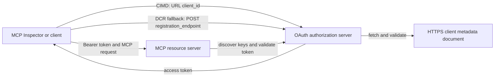

# CIMD and DCR Authorization Sample

This TypeScript sample compares two ways an OAuth client can obtain an identity
before accessing a protected MCP server:

- **Client ID Metadata Documents (CIMD)** use a stable HTTPS URL as the
  `client_id`. This is the preferred mechanism for clients and authorization
  servers that have no pre-existing relationship.
- **Dynamic Client Registration (DCR)** asks the authorization server to mint
  an opaque client ID at runtime. MCP `2026-07-28` retains DCR only for backward
  compatibility.

The sample uses the stable MCP TypeScript SDK v2 and the stateless
MCP `2026-07-28` request model. It works with an external OAuth 2.1/OpenID
Connect authorization server such as Auth0. The MCP server is a resource
server: it validates access tokens but does not authenticate users or issue
tokens.

## Learning Objectives

By completing this sample, you will be able to:

- Explain why CIMD is preferred over DCR for new MCP clients.
- Publish a valid CIMD document for a public native client.
- Configure an MCP resource server for OAuth discovery and JWT validation.
- Exercise CIMD and DCR with the same MCP server and authorization server.
- Enforce an OAuth scope inside an MCP tool.
- Identify which responsibilities belong to the client, resource server, and
  authorization server.

## Architecture



The authorization server chooses and validates the registration mechanism.
The MCP server sees only the resulting verified `client_id` claim. An HTTPS URL
with a path identifies CIMD. An opaque ID is not enough to prove DCR because a
pre-registered client can also use an opaque ID; the optional
`DCR_CLIENT_ID_PREFIX` setting supplies a provider-specific demo hint.

## Registration Priority

MCP clients that support every mechanism should use this order:

1. Use pre-registered client information when it is already available.
2. Use CIMD when the authorization server advertises
   `client_id_metadata_document_supported: true`.
3. Use DCR only as a fallback when the server advertises a
   `registration_endpoint`.
4. Ask the user for pre-registered client information when none of the above is
   available.

## Project Layout

```text
src/
  config.ts          Environment validation
  dcr.ts             DCR compatibility request
  mcp.ts             MCP tools and scope checks
  oauth.ts           Authorization metadata and JWT verification
  register-dcr.ts    DCR command-line helper
  registration.ts    CIMD document and mechanism classification
  server.ts          Express, OAuth discovery, and MCP endpoint
test/
  dcr.test.ts
  oauth.test.ts
  registration.test.ts
  server.test.ts
```

## Prerequisites

- Node.js 20.6 or newer. The scripts use `--env-file` and `--import`.
- An OAuth 2.1/OpenID Connect authorization server that supports:
  - Authorization code flow with S256 PKCE.
  - OAuth Protected Resource Metadata and Resource Indicators.
  - JWT access tokens and a JWKS endpoint.
  - CIMD, plus DCR if you want to compare the legacy fallback.
- MCP Inspector or another MCP `2026-07-28` client.
- A public HTTPS URL for the CIMD document. A development tunnel is suitable
  for the lab; use a stable domain in production.

## Install and Test

```bash
npm install
npm run build
npm test
```

The twelve tests use local keys and mock HTTP endpoints. They do not require an
authorization server account. They verify:

- CIMD document shape and URL constraints.
- Honest classification of URL and opaque client IDs.
- DCR request and response handling.
- Rejection of insecure non-loopback DCR endpoints.
- JWT signature, issuer, audience, expiry, client ID, and scope validation.
- An in-process MCP `2026-07-28` call to `registration-info`.

## Configure the Authorization Server

The exact control names vary by provider. Configure these capabilities:

1. Create an API or resource server whose identifier exactly matches your MCP
   URL, including `/mcp`, for example `http://127.0.0.1:3001/mcp`.
2. Use RS256 access tokens and include a `client_id` or `azp` claim.
3. Add the `tool:greet` permission or scope.
4. Enable authorization code flow with S256 PKCE for public native clients.
5. Enable Client ID Metadata Documents.
6. For the comparison only, enable Dynamic Client Registration.
7. Ensure authorization server metadata advertises:
   - `issuer`
   - `authorization_endpoint`
   - `token_endpoint`
   - `jwks_uri`
   - `client_id_metadata_document_supported: true`
   - `registration_endpoint` when DCR is enabled

### Auth0 Example

For Auth0, enable Client ID Metadata Document Registration, OIDC Dynamic
Application Registration, and Resource Parameter compatibility. Create an API
whose identifier is the exact MCP URL and add the `tool:greet` permission.
Permit the test user and third-party clients to request that permission.

Provider dashboards and feature availability change over time. Check the
provider documentation before using these settings outside this lab.

## Configure the Sample

Create `.env` from the example:

```powershell
Copy-Item .env.example .env
```

On bash-compatible shells:

```bash
cp .env.example .env
```

Set these values:

```dotenv
MCP_SERVER_URL=http://127.0.0.1:3001/mcp
AUTHORIZATION_SERVER_ISSUER=https://your-tenant.example.com/
AUTHORIZATION_SERVER_METADATA_URL=https://your-tenant.example.com/.well-known/openid-configuration
CLIENT_METADATA_URL=https://your-public-host.example.com/client-metadata.json
OAUTH_REDIRECT_URIS=http://127.0.0.1:6274/oauth/callback
DCR_CLIENT_ID_PREFIX=tpc_
```

Important details:

- `AUTHORIZATION_SERVER_ISSUER` must exactly match `issuer` in the discovered
  authorization server metadata, including any trailing slash.
- `MCP_SERVER_URL` must match the access token audience.
- `CLIENT_METADATA_URL` must use HTTPS, contain a non-root path, and be the
  public URL that serves the metadata route. Query strings and fragments are
  rejected so the route and `client_id` remain identical.
- `OAUTH_REDIRECT_URIS` is a comma-separated allowlist. The default is the MCP
  Inspector loopback callback.
- `DCR_CLIENT_ID_PREFIX` is optional and provider-specific. Leave it empty when
  your provider has no reliable DCR prefix.

## Publish the CIMD Document

Start a tunnel that forwards its public HTTPS origin to `127.0.0.1:3001`.
Set `CLIENT_METADATA_URL` to that origin plus `/client-metadata.json`, then run:

```bash
npm run build
npm start
```

Verify both discovery documents:

```bash
curl http://127.0.0.1:3001/health
curl http://127.0.0.1:3001/client-metadata.json
curl http://127.0.0.1:3001/.well-known/oauth-protected-resource/mcp
```

The `client_id` returned by the public HTTPS metadata URL must be byte-for-byte
identical to that URL. The authorization server must validate the document and
its redirect URI before issuing a token.

> [!NOTE]
> The sample hosts the client document and MCP resource server in one process
> to keep the lab small. In production, the MCP client owns and hosts its CIMD
> document independently of the resource server.

## Compare CIMD and DCR

Start MCP Inspector:

```bash
npx @modelcontextprotocol/inspector
```

Use Streamable HTTP and connect to `http://127.0.0.1:3001/mcp`.

### CIMD (Preferred)

1. Enter the public `CLIENT_METADATA_URL` as the OAuth Client ID.
2. Request `tool:greet` plus any identity scopes required by your provider.
3. Complete sign-in and consent.
4. Call `registration-info`. It reports `mechanism: "cimd"`.
5. Call `greet` to verify scope enforcement.

### DCR (Compatibility Fallback)

1. Clear Inspector's saved OAuth state.
2. Leave OAuth Client ID empty so Inspector may use the advertised
   `registration_endpoint`.
3. Complete sign-in and consent.
4. Call `registration-info`.
5. If `DCR_CLIENT_ID_PREFIX` matches the provider's generated IDs, the tool
   reports `mechanism: "dcr"`; otherwise it correctly reports
   `opaque-client-id`.

You can also demonstrate the registration request directly:

```bash
npm run build
npm run register:dcr
```

The helper prints the returned client ID but never prints a client secret.
Treat any returned secret as sensitive and store it in a proper secret store.

## Tools

| Tool | Required scope | Purpose |
| --- | --- | --- |
| `registration-info` | Verified client | Report the client ID type |
| `greet` | `tool:greet` | Demonstrate per-tool authorization |

## Security Notes

- Validate JWT signatures through the authorization server's JWKS endpoint.
- Require exact issuer and audience matches.
- Require expiration and client ID claims.
- Never accept a token issued for a different resource.
- Never pass the MCP token through to a downstream API.
- Keep DCR credentials bound to the issuer that created them.
- Validate CIMD redirect URIs with exact matching.
- Apply SSRF controls when an authorization server fetches CIMD URLs.
- Use HTTPS for authorization and metadata endpoints outside loopback
  development.
- Do not infer DCR from an opaque client ID unless the provider documents a
  reliable identifier convention.

## References

- [MCP authorization specification](https://modelcontextprotocol.io/specification/2026-07-28/basic/authorization)
- [MCP client registration](https://modelcontextprotocol.io/specification/2026-07-28/basic/authorization/client-registration)
- [MCP security best practices](https://modelcontextprotocol.io/specification/2026-07-28/basic/security_best_practices)
- [MCP TypeScript SDK v2 authorization guide](https://ts.sdk.modelcontextprotocol.io/v2/serving/authorization)
- [OAuth Dynamic Client Registration (RFC 7591)](https://datatracker.ietf.org/doc/html/rfc7591)
- [OAuth Client ID Metadata Document draft](https://datatracker.ietf.org/doc/html/draft-ietf-oauth-client-id-metadata-document-00)

## Acknowledgement

The side-by-side teaching approach was inspired by
[Sambego/auth0-xmcp-cimd](https://github.com/Sambego/auth0-xmcp-cimd). This
sample is an original, provider-neutral implementation built with the official
MCP TypeScript SDK v2 for this curriculum.

---

<!-- CO-OP TRANSLATOR DISCLAIMER START -->
**Disclaimer**:
This document has been translated using AI translation service [Co-op Translator](https://github.com/Azure/co-op-translator). While we strive for accuracy, please be aware that automated translations may contain errors or inaccuracies. The original document in its native language should be considered the authoritative source. For critical information, professional human translation is recommended. We are not liable for any misunderstandings or misinterpretations arising from the use of this translation.
<!-- CO-OP TRANSLATOR DISCLAIMER END -->