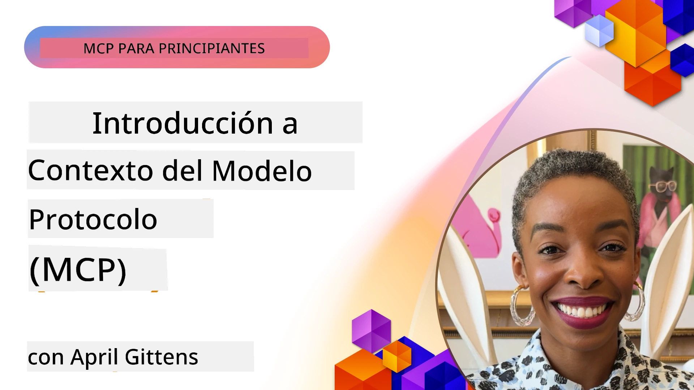
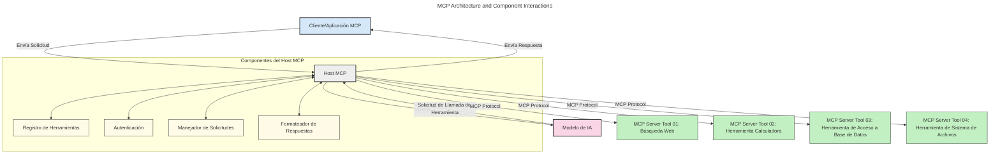
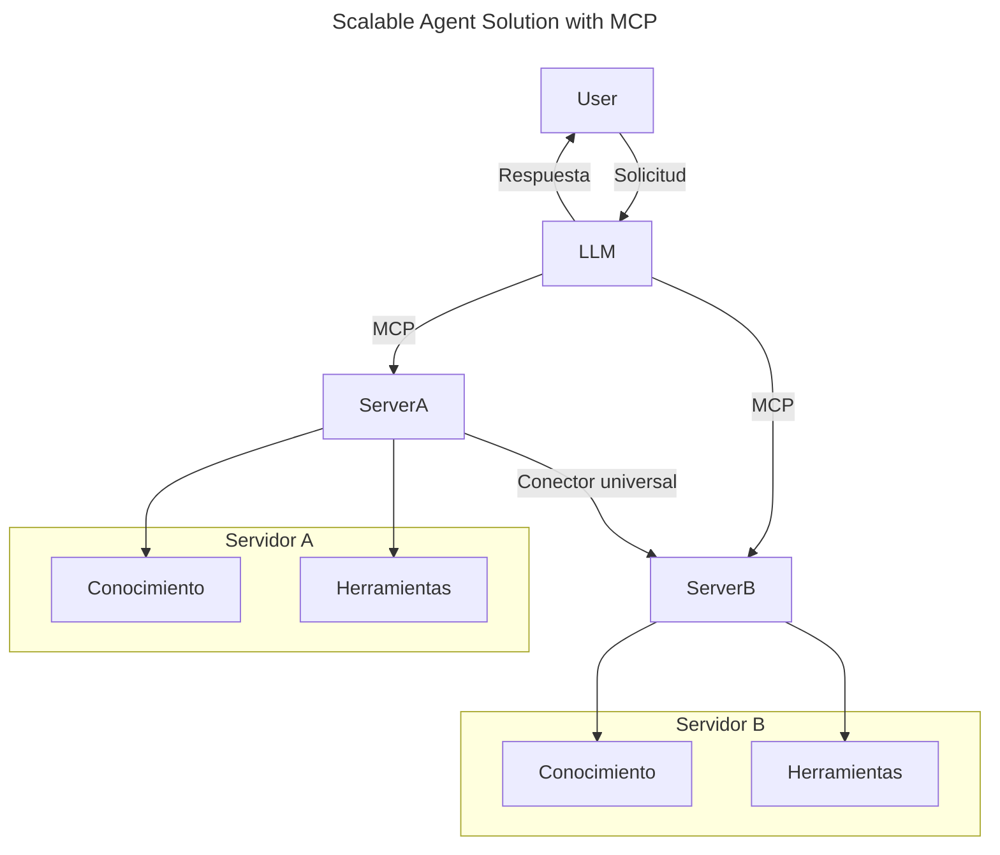
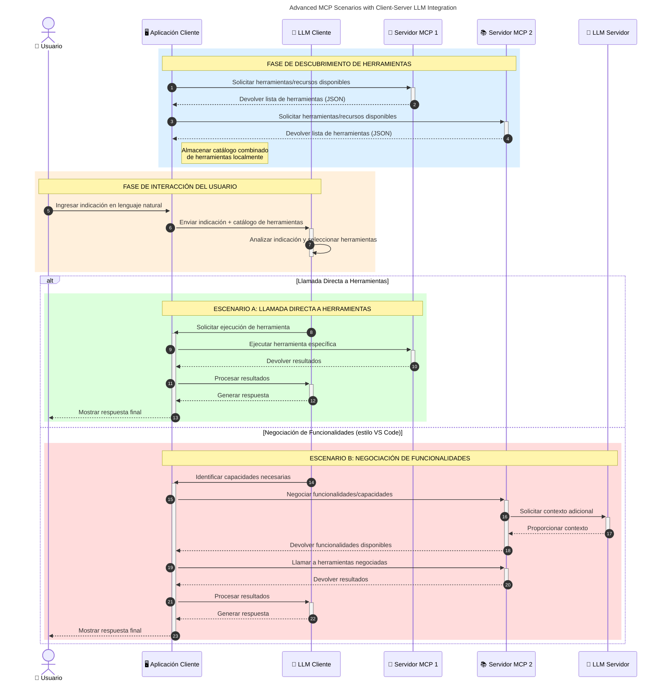

# Introducción al Protocolo de Contexto de Modelo (MCP): Por qué es importante para aplicaciones de IA escalables

_(Haz clic en la imagen de arriba para ver el video de esta lección)_

Las aplicaciones de IA generativa son un gran avance ya que a menudo permiten al usuario interactuar con la aplicación usando indicaciones en lenguaje natural. Sin embargo, a medida que se invierte más tiempo y recursos en estas aplicaciones, quieres asegurarte de poder integrar funcionalidades y recursos fácilmente de tal manera que sea sencillo extenderlas, que tu aplicación pueda atender a más de un modelo usado y manejar varias complejidades del modelo. En resumen, construir aplicaciones de IA generativa es fácil para comenzar, pero a medida que crecen y se vuelven más complejas, necesitas empezar a definir una arquitectura y probablemente dependerás de un estándar para asegurar que tus aplicaciones se construyan de manera consistente. Aquí es donde MCP entra para organizar las cosas y proporcionar un estándar.

---

## **🔍 ¿Qué es el Protocolo de Contexto de Modelo (MCP)?**

El **Protocolo de Contexto de Modelo (MCP)** es una **interfaz abierta y estandarizada** que permite a los Grandes Modelos de Lenguaje (LLMs) interactuar sin problemas con herramientas externas, APIs y fuentes de datos. Proporciona una arquitectura consistente para mejorar la funcionalidad del modelo de IA más allá de sus datos de entrenamiento, permitiendo sistemas de IA más inteligentes, escalables y con mejor capacidad de respuesta.

---

## **🎯 Por qué la Estandarización en IA es Importante**

A medida que las aplicaciones de IA generativa se vuelven más complejas, es esencial adoptar estándares que aseguren **escalabilidad, extensibilidad, mantenibilidad** y **evitar el bloqueo por proveedor**. MCP aborda estas necesidades mediante:

- Unificar las integraciones modelo-herramienta
- Reducir soluciones personalizadas frágiles y únicas
- Permitir que múltiples modelos de diferentes proveedores coexistan dentro de un mismo ecosistema

**Nota:** Aunque MCP se promociona como un estándar abierto, no hay planes para estandarizar MCP mediante ningún organismo de estándares existente como IEEE, IETF, W3C, ISO u otro.

---

## **📚 Objetivos de Aprendizaje**

Al final de este artículo serás capaz de:

- Definir **Protocolo de Contexto de Modelo (MCP)** y sus casos de uso
- Entender cómo MCP estandariza la comunicación modelo-herramienta
- Identificar los componentes centrales de la arquitectura MCP
- Explorar aplicaciones reales de MCP en contextos empresariales y de desarrollo

---

## **💡 Por qué el Protocolo de Contexto de Modelo (MCP) es un Cambio Radical**

### **🔗 MCP Resuelve la Fragmentación en las Interacciones de IA**

Antes de MCP, integrar modelos con herramientas requería:

- Código personalizado por cada par herramienta-modelo
- APIs no estándar para cada proveedor
- Rupturas frecuentes por actualizaciones
- Escalabilidad deficiente con más herramientas

### **✅ Beneficios de la Estandarización MCP**

| **Beneficio**             | **Descripción**                                                                |
|--------------------------|--------------------------------------------------------------------------------|
| Interoperabilidad         | Los LLMs funcionan sin problemas con herramientas de diferentes proveedores    |
| Consistencia              | Comportamiento uniforme en plataformas y herramientas                          |
| Reusabilidad              | Herramientas construidas una vez pueden usarse en varios proyectos y sistemas  |
| Desarrollo Acelerado      | Reduce el tiempo de desarrollo usando interfaces estandarizadas y plug-and-play |

---

## **🧱 Descripción General de la Arquitectura MCP**

MCP sigue un **modelo cliente-servidor**, donde:

- Los **Hosts MCP** ejecutan los modelos de IA
- Los **Clientes MCP** inician solicitudes
- Los **Servidores MCP** proveen contexto, herramientas y capacidades

### **Componentes Clave:**

- **Recursos** – Datos estáticos o dinámicos para los modelos  
- **Prompts** – Flujos de trabajo predefinidos para generación guiada  
- **Herramientas** – Funciones ejecutables como búsqueda, cálculos  
- **Muestreo** – Comportamiento agente vía interacciones recursivas (obsoleto en
    MCP `2026-07-28`; las nuevas implementaciones deben integrarse directamente con un proveedor LLM)

- **Elicitación** – Solicitudes iniciadas por el servidor para entrada del usuario
- **Raíces** – Ubicaciones informativas del sistema de archivos relevantes para un servidor
    (obsoleto en MCP `2026-07-28`; preferir parámetros de herramienta, URIs de recursos, o configuración del servidor)

### **Arquitectura del Protocolo:**

MCP utiliza una arquitectura de dos capas:
- **Capa de Datos**: mensajes JSON-RPC 2.0, metadatos por solicitud, descubrimiento y
    primitivas del protocolo
- **Capa de Transporte**: stdio para subprocesos locales y HTTP con streaming para
    servidores remotos. HTTP con streaming puede usar encuadre SSE para respuestas transmitidas,
    pero el transporte HTTP+SSE antiguo está obsoleto.

---

## Cómo Funcionan los Servidores MCP

Los servidores MCP operan de la siguiente manera:

- **Flujo de Solicitudes**:
    1. Una solicitud es iniciada por un usuario final o un software actuando en su nombre.
    2. El **Cliente MCP** envía la solicitud a un **Host MCP**, que gestiona la ejecución del modelo de IA.
    3. El **Modelo de IA** recibe la indicación del usuario y puede solicitar acceso a herramientas o datos externos mediante una o más llamadas a herramientas.
    4. El **Host MCP**, no el modelo directamente, se comunica con el/los **Servidor(es) MCP** apropiado(s) usando el protocolo estandarizado.
- **Funcionalidad del Host MCP**:
    - **Registro de Herramientas:** Mantiene un catálogo de herramientas disponibles y sus capacidades.
    - **Autenticación:** Verifica permisos para acceso a herramientas.
    - **Manejador de Solicitudes:** Procesa peticiones entrantes de herramientas del modelo.
    - **Formateador de Respuestas:** Estructura las salidas de herramientas en un formato que el modelo puede entender.
- **Ejecución del Servidor MCP**:
    - El **Host MCP** dirige las llamadas a herramientas a uno o varios **Servidores MCP**, cada uno exponiendo funciones especializadas (ej. búsqueda, cálculos, consultas a bases de datos).
    - Los **Servidores MCP** realizan sus operaciones respectivas y devuelven resultados al **Host MCP** en un formato consistente.
    - El **Host MCP** formatea y retransmite estos resultados al **Modelo de IA**.
- **Finalización de la Respuesta**:
    - El **Modelo de IA** incorpora las salidas de herramientas en una respuesta final.
    - El **Host MCP** envía esta respuesta de vuelta al **Cliente MCP**, que la entrega al usuario final o software solicitante.
    

## 👨‍💻 Cómo Construir un Servidor MCP (Con Ejemplos)

Los servidores MCP te permiten extender las capacidades de los LLM proporcionando datos y funcionalidades. 

¿Listo para probar? Aquí hay SDKs específicos de lenguaje y/o stack con ejemplos de creación de servidores MCP simples en diferentes lenguajes/stacks:

- **SDK de Python**: https://github.com/modelcontextprotocol/python-sdk

- **SDK de TypeScript**: https://github.com/modelcontextprotocol/typescript-sdk

- **SDK de Java**: https://github.com/modelcontextprotocol/java-sdk

- **SDK de C#/.NET**: https://github.com/modelcontextprotocol/csharp-sdk

## 🌍 Casos de Uso Reales para MCP

MCP posibilita una amplia gama de aplicaciones extendiendo las capacidades de IA:

| **Aplicación**               | **Descripción**                                                               |
|------------------------------|-------------------------------------------------------------------------------|
| Integración de Datos Empresariales | Conectar LLMs a bases de datos, CRM o herramientas internas                 |
| Sistemas de IA Agentes         | Habilitar agentes autónomos con acceso a herramientas y flujos de toma de decisiones |
| Aplicaciones Multimodales      | Combinar herramientas de texto, imagen y audio dentro de una sola app de IA   |
| Integración de Datos en Tiempo Real | Incorporar datos en vivo a interacciones de IA para resultados más precisos y actuales |

### 🧠 MCP = Estándar Universal para Interacciones de IA

El Protocolo de Contexto de Modelo (MCP) actúa como un estándar universal para interacciones de IA, al igual que USB-C estandarizó las conexiones físicas para dispositivos. En el mundo de la IA, MCP proporciona una interfaz consistente que permite a los modelos (clientes) integrarse sin problemas con herramientas externas y proveedores de datos (servidores). Esto elimina la necesidad de protocolos personalizados diversos para cada API o fuente de datos.

Bajo MCP, una herramienta compatible con MCP (denominada servidor MCP) sigue un estándar unificado. Estos servidores pueden listar las herramientas o acciones que ofrecen y ejecutar esas acciones cuando un agente de IA las solicita. Las plataformas de agentes de IA que soportan MCP son capaces de descubrir las herramientas disponibles en los servidores e invocarlas mediante este protocolo estándar.

### 💡 Facilita el acceso al conocimiento

Más allá de ofrecer herramientas, MCP también facilita el acceso al conocimiento. Permite a las aplicaciones suministrar contexto a los grandes modelos de lenguaje (LLMs) vinculándolos a diversas fuentes de datos. Por ejemplo, un servidor MCP podría representar el repositorio de documentos de una empresa, permitiendo a los agentes recuperar información relevante bajo demanda. Otro servidor podría manejar acciones específicas como enviar correos electrónicos o actualizar registros. Desde la perspectiva del agente, estas son simplemente herramientas que pueden usar: algunas herramientas retornan datos (contexto de conocimiento), mientras que otras realizan acciones. MCP gestiona ambas eficientemente.

Un agente que se conecta a un servidor MCP aprende automáticamente las capacidades disponibles del servidor y los datos accesibles mediante un formato estándar. Esta estandarización permite una disponibilidad dinámica de herramientas. Por ejemplo, añadir un nuevo servidor MCP al sistema del agente hace que sus funciones sean inmediatamente utilizables sin requerir personalización adicional de las instrucciones del agente.

Esta integración optimizada se alinea con el flujo ilustrado en el siguiente diagrama, donde los servidores proveen tanto herramientas como conocimiento, asegurando una colaboración fluida entre sistemas. 

### 👉 Ejemplo: Solución de Agente Escalable

El Conector Universal permite a los servidores MCP comunicarse y compartir capacidades entre sí, permitiendo que ServerA delegue tareas a ServerB o acceda a sus herramientas y conocimiento. Esto federara herramientas y datos a través de servidores, apoyando arquitecturas de agentes escalables y modulares. Debido a que MCP estandariza la exposición de herramientas, los agentes pueden descubrir dinámicamente y enrutar solicitudes entre servidores sin integraciones codificadas a mano.

Federación de herramientas y conocimiento: Las herramientas y datos pueden ser accedidos a través de servidores, permitiendo arquitecturas agenticas más escalables y modulares.

### 🔄 Escenarios Avanzados MCP con Integración de LLM en Cliente

Más allá de la arquitectura básica MCP, existen escenarios avanzados donde tanto cliente como servidor contienen LLMs, permitiendo interacciones más sofisticadas. En el siguiente diagrama, **App Cliente** podría ser un IDE con varias herramientas MCP disponibles para uso por el LLM:

## 🔐 Beneficios Prácticos de MCP

Aquí están los beneficios prácticos de usar MCP:

- **Actualidad**: Los modelos pueden acceder a información actualizada más allá de sus datos de entrenamiento
- **Extensión de Capacidades**: Los modelos pueden aprovechar herramientas especializadas para tareas para las que no fueron entrenados
- **Reducción de Alucinaciones**: Fuentes externas de datos proporcionan base factual
- **Privacidad**: Los datos sensibles pueden mantenerse dentro de entornos seguros en lugar de integrarse en prompts

## 📌 Conclusiones Clave

Las siguientes son conclusiones clave para usar MCP:

- **MCP** estandariza cómo los modelos de IA interactúan con herramientas y datos
- Promueve **extensibilidad, consistencia e interoperabilidad**
- MCP ayuda a **reducir el tiempo de desarrollo, mejorar la fiabilidad y ampliar las capacidades del modelo**
- La arquitectura cliente-servidor **habilita aplicaciones de IA flexibles y extensibles**

## 🧠 Ejercicio

Piensa en una aplicación de IA que te interese desarrollar.

- ¿Qué **herramientas o datos externos** podrían mejorar sus capacidades?
- ¿Cómo podría MCP hacer que la integración sea **más sencilla y confiable?**

## Recursos Adicionales

- [Repositorio MCP en GitHub](https://github.com/modelcontextprotocol)

## Qué sigue

Siguiente: [Capítulo 1: Conceptos Básicos](../01-CoreConcepts/README.md)

---

<!-- CO-OP TRANSLATOR DISCLAIMER START -->
**Descargo de responsabilidad**:
Este documento ha sido traducido utilizando el servicio de traducción automática [Co-op Translator](https://github.com/Azure/co-op-translator). Aunque nos esforzamos por la precisión, tenga en cuenta que las traducciones automatizadas pueden contener errores o inexactitudes. El documento original en su idioma nativo debe considerarse la fuente autorizada. Para información crítica, se recomienda una traducción profesional humana. No somos responsables de cualquier malentendido o interpretación errónea que surja del uso de esta traducción.
<!-- CO-OP TRANSLATOR DISCLAIMER END -->