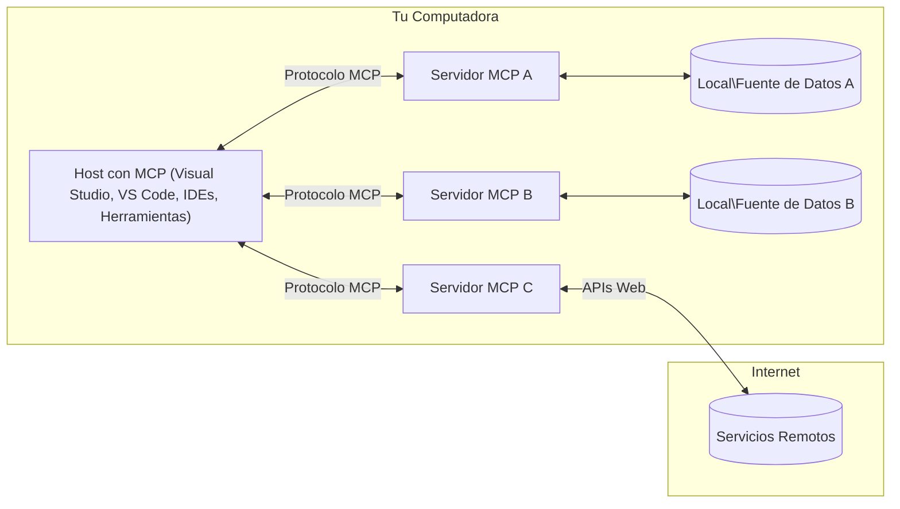

# Conceptos Básicos de MCP: Dominando el Protocolo de Contexto de Modelo para la Integración de IA

[](https://youtu.be/earDzWGtE84)

_(Haz clic en la imagen de arriba para ver el video de esta lección)_

El [Protocolo de Contexto de Modelo (MCP)](https://github.com/modelcontextprotocol) es un marco poderoso y estandarizado que optimiza la comunicación entre Modelos de Lenguaje Grande (LLMs) y herramientas externas, aplicaciones y fuentes de datos.  
Esta guía te llevará a través de los conceptos básicos de MCP. Aprenderás sobre su arquitectura cliente-servidor, componentes esenciales, mecánicas de comunicación y mejores prácticas de implementación.

- **Consentimiento Explícito del Usuario**: Todo acceso a datos y operaciones requieren aprobación explícita del usuario antes de su ejecución. Los usuarios deben entender claramente qué datos serán accedidos y qué acciones se realizarán, con control granular sobre permisos y autorizaciones.

- **Protección de la Privacidad de Datos**: Los datos del usuario solo se exponen con consentimiento explícito y deben estar protegidos por controles de acceso robustos durante todo el ciclo de vida de la interacción. Las implementaciones deben prevenir la transmisión no autorizada de datos y mantener límites estrictos de privacidad.

- **Seguridad en la Ejecución de Herramientas**: Cada invocación de herramienta requiere consentimiento explícito del usuario con comprensión clara de la funcionalidad, parámetros e impacto potencial de la herramienta. Límites de seguridad robustos deben prevenir ejecuciones no intencionadas, inseguras o maliciosas.

- **Seguridad en la Capa de Transporte**: Todos los canales de comunicación deben usar mecanismos apropiados de cifrado y autenticación. Las conexiones remotas deben implementar protocolos de transporte seguros y gestión adecuada de credenciales.

#### Directrices de Implementación:

- **Gestión de Permisos**: Implementar sistemas de permisos finos que permitan a los usuarios controlar qué servidores, herramientas y recursos son accesibles  
- **Autenticación y Autorización**: Usar métodos seguros de autenticación (OAuth, claves API) con gestión adecuada de tokens y expiración  
- **Validación de Entradas**: Validar todos los parámetros y entradas de datos según esquemas definidos para prevenir ataques de inyección  
- **Registro de Auditoría**: Mantener registros completos de todas las operaciones para monitoreo de seguridad y cumplimiento

## Visión General

Esta lección explora la arquitectura fundamental y los componentes que conforman el ecosistema del Protocolo de Contexto de Modelo (MCP). Aprenderás sobre la arquitectura cliente-servidor, componentes clave y mecanismos de comunicación que impulsan las interacciones MCP.

## Objetivos Clave de Aprendizaje

Al final de esta lección, podrás:

- Entender la arquitectura cliente-servidor de MCP.  
- Identificar roles y responsabilidades de Hosts, Clientes y Servidores.  
- Analizar las características centrales que hacen de MCP una capa de integración flexible.  
- Aprender cómo fluye la información dentro del ecosistema MCP.  
- Obtener conocimientos prácticos a través de ejemplos de código en .NET, Java, Python y JavaScript.

## Arquitectura MCP: Una Mirada Más Profunda

El ecosistema MCP se construye sobre un modelo cliente-servidor. Esta estructura modular permite que aplicaciones de IA interactúen con herramientas, bases de datos, APIs y recursos contextuales de manera eficiente. Desglosemos esta arquitectura en sus componentes principales.

En su núcleo, MCP sigue una arquitectura cliente-servidor donde una aplicación host puede conectarse a múltiples servidores:


- **Hosts MCP**: Programas como VSCode, Claude Desktop, IDEs o herramientas de IA que desean acceder a datos a través de MCP  
- **Clientes MCP**: Clientes del protocolo que mantienen conexiones 1:1 con servidores  
- **Servidores MCP**: Programas livianos que exponen capacidades específicas mediante el Protocolo de Contexto de Modelo estandarizado  
- **Fuentes de Datos Locales**: Archivos, bases de datos y servicios de tu computadora a los que los servidores MCP pueden acceder de forma segura  
- **Servicios Remotos**: Sistemas externos disponibles por internet a los que los servidores MCP pueden conectarse mediante APIs.

El Protocolo MCP es un estándar en evolución que usa versionado basado en fechas (formato AAAA-MM-DD). La versión actual del protocolo es **2025-11-25**. Puedes ver las últimas actualizaciones en la [especificación del protocolo](https://modelcontextprotocol.io/specification/2025-11-25/)

### 1. Hosts

En el Protocolo de Contexto de Modelo (MCP), los **Hosts** son aplicaciones de IA que sirven como la interfaz principal a través de la cual los usuarios interactúan con el protocolo. Los Hosts coordinan y gestionan conexiones a múltiples servidores MCP creando clientes MCP dedicados para cada conexión de servidor. Ejemplos de Hosts incluyen:

- **Aplicaciones de IA**: Claude Desktop, Visual Studio Code, Claude Code  
- **Entornos de Desarrollo**: IDEs y editores de código con integración MCP  
- **Aplicaciones Personalizadas**: Agentes y herramientas de IA construidos a medida

Los **Hosts** son aplicaciones que coordinan interacciones con modelos de IA. Ellos:

- **Orquestan Modelos de IA**: Ejecutan o interactúan con LLMs para generar respuestas y coordinar flujos de trabajo de IA  
- **Gestionan Conexiones de Clientes**: Crean y mantienen un cliente MCP por cada conexión a servidor MCP  
- **Controlan la Interfaz de Usuario**: Manejan el flujo de conversación, interacciones del usuario y presentación de respuestas  
- **Imponen Seguridad**: Controlan permisos, restricciones de seguridad y autenticación  
- **Gestionan Consentimiento del Usuario**: Administran la aprobación del usuario para compartir datos y ejecutar herramientas

### 2. Clientes

Los **Clientes** son componentes esenciales que mantienen conexiones dedicadas uno a uno entre Hosts y servidores MCP. Cada cliente MCP es instanciado por el Host para conectarse a un servidor MCP específico, asegurando canales de comunicación organizados y seguros. Múltiples clientes permiten a los Hosts conectarse a varios servidores simultáneamente.

Los **Clientes** son componentes conectores dentro de la aplicación host. Ellos:

- **Comunicación del Protocolo**: Envían solicitudes JSON-RPC 2.0 a los servidores con indicaciones e instrucciones  
- **Negociación de Capacidades**: Negocian características soportadas y versiones del protocolo con los servidores durante la inicialización  
- **Ejecución de Herramientas**: Gestionan solicitudes de ejecución de herramientas desde modelos y procesan respuestas  
- **Actualizaciones en Tiempo Real**: Manejan notificaciones y actualizaciones en tiempo real desde los servidores  
- **Procesamiento de Respuestas**: Procesan y formatean respuestas del servidor para mostrar a los usuarios

### 3. Servidores

Los **Servidores** son programas que proporcionan contexto, herramientas y capacidades a los clientes MCP. Pueden ejecutarse localmente (en la misma máquina que el Host) o remotamente (en plataformas externas), y son responsables de manejar solicitudes de clientes y proporcionar respuestas estructuradas. Los servidores exponen funcionalidades específicas mediante el Protocolo de Contexto de Modelo estandarizado.

Los **Servidores** son servicios que proveen contexto y capacidades. Ellos:

- **Registro de Funcionalidades**: Registran y exponen primitivas disponibles (recursos, indicaciones, herramientas) a los clientes  
- **Procesamiento de Solicitudes**: Reciben y ejecutan llamadas a herramientas, solicitudes de recursos e indicaciones desde clientes  
- **Provisión de Contexto**: Proporcionan información contextual y datos para mejorar las respuestas del modelo  
- **Gestión de Estado**: Mantienen estado de sesión y manejan interacciones con estado cuando es necesario  
- **Notificaciones en Tiempo Real**: Envían notificaciones sobre cambios en capacidades y actualizaciones a clientes conectados

Los servidores pueden ser desarrollados por cualquiera para extender capacidades del modelo con funcionalidades especializadas, y soportan escenarios de despliegue tanto local como remoto.

### 4. Primitivas del Servidor

Los servidores en el Protocolo de Contexto de Modelo (MCP) proveen tres **primitivas** centrales que definen los bloques fundamentales para interacciones ricas entre clientes, hosts y modelos de lenguaje. Estas primitivas especifican los tipos de información contextual y acciones disponibles a través del protocolo.

Los servidores MCP pueden exponer cualquier combinación de las siguientes tres primitivas centrales:

#### Recursos

Los **Recursos** son fuentes de datos que proporcionan información contextual a aplicaciones de IA. Representan contenido estático o dinámico que puede mejorar la comprensión y toma de decisiones del modelo:

- **Datos Contextuales**: Información estructurada y contexto para consumo del modelo de IA  
- **Bases de Conocimiento**: Repositorios de documentos, artículos, manuales y trabajos de investigación  
- **Fuentes de Datos Locales**: Archivos, bases de datos e información del sistema local  
- **Datos Externos**: Respuestas de APIs, servicios web y datos de sistemas remotos  
- **Contenido Dinámico**: Datos en tiempo real que se actualizan según condiciones externas

Los recursos se identifican por URIs y soportan descubrimiento mediante `resources/list` y recuperación mediante `resources/read`:

```text
file://documents/project-spec.md
database://production/users/schema
api://weather/current
```

#### Indicaciones

Las **Indicaciones** son plantillas reutilizables que ayudan a estructurar interacciones con modelos de lenguaje. Proporcionan patrones de interacción estandarizados y flujos de trabajo con plantillas:

- **Interacciones Basadas en Plantillas**: Mensajes preestructurados e iniciadores de conversación  
- **Plantillas de Flujo de Trabajo**: Secuencias estandarizadas para tareas e interacciones comunes  
- **Ejemplos Few-shot**: Plantillas basadas en ejemplos para instrucción del modelo  
- **Indicaciones del Sistema**: Indicaciones fundamentales que definen comportamiento y contexto del modelo  
- **Plantillas Dinámicas**: Indicaciones parametrizadas que se adaptan a contextos específicos

Las indicaciones soportan sustitución de variables y pueden descubrirse vía `prompts/list` y recuperarse con `prompts/get`:

```markdown
Generate a {{task_type}} for {{product}} targeting {{audience}} with the following requirements: {{requirements}}
```

#### Herramientas

Las **Herramientas** son funciones ejecutables que los modelos de IA pueden invocar para realizar acciones específicas. Representan los "verbos" del ecosistema MCP, permitiendo a los modelos interactuar con sistemas externos:

- **Funciones Ejecutables**: Operaciones discretas que los modelos pueden invocar con parámetros específicos  
- **Integración con Sistemas Externos**: Llamadas a APIs, consultas a bases de datos, operaciones de archivos, cálculos  
- **Identidad Única**: Cada herramienta tiene un nombre, descripción y esquema de parámetros distinto  
- **Entrada/Salida Estructurada**: Las herramientas aceptan parámetros validados y retornan respuestas estructuradas y tipadas  
- **Capacidades de Acción**: Permiten a los modelos realizar acciones en el mundo real y obtener datos en vivo

Las herramientas se definen con JSON Schema para validación de parámetros y se descubren mediante `tools/list` y se ejecutan vía `tools/call`:

```typescript
server.tool(
  "search_products", 
  {
    query: z.string().describe("Search query for products"),
    category: z.string().optional().describe("Product category filter"),
    max_results: z.number().default(10).describe("Maximum results to return")
  }, 
  async (params) => {
    // Ejecutar búsqueda y devolver resultados estructurados
    return await productService.search(params);
  }
);
```

## Primitivas del Cliente

En el Protocolo de Contexto de Modelo (MCP), los **clientes** pueden exponer primitivas que permiten a los servidores solicitar capacidades adicionales de la aplicación host. Estas primitivas del lado cliente permiten implementaciones de servidor más ricas e interactivas que pueden acceder a capacidades del modelo de IA e interacciones del usuario.

### Muestreo

El **Muestreo** permite a los servidores solicitar completaciones de modelos de lenguaje desde la aplicación de IA del cliente. Esta primitiva habilita a los servidores para acceder a capacidades LLM sin incrustar sus propias dependencias de modelo:

- **Acceso Independiente del Modelo**: Los servidores pueden solicitar completaciones sin incluir SDKs LLM o gestionar acceso a modelos  
- **IA Iniciada por el Servidor**: Permite a los servidores generar contenido autónomamente usando el modelo de IA del cliente  
- **Interacciones Recursivas con LLM**: Soporta escenarios complejos donde los servidores necesitan asistencia de IA para procesamiento  
- **Generación Dinámica de Contenido**: Permite a los servidores crear respuestas contextuales usando el modelo del host

El muestreo se inicia mediante el método `sampling/complete`, donde los servidores envían solicitudes de completación a los clientes.

### Solicitud de Información

La **Solicitud de Información** permite a los servidores pedir información adicional o confirmación a los usuarios a través de la interfaz del cliente:

- **Solicitudes de Entrada del Usuario**: Los servidores pueden pedir información adicional cuando es necesaria para la ejecución de herramientas  
- **Diálogos de Confirmación**: Solicitar aprobación del usuario para operaciones sensibles o de impacto  
- **Flujos de Trabajo Interactivos**: Permiten a los servidores crear interacciones paso a paso con el usuario  
- **Recolección Dinámica de Parámetros**: Recopilar parámetros faltantes u opcionales durante la ejecución de herramientas

Las solicitudes de información se realizan usando el método `elicitation/request` para recolectar entradas del usuario a través de la interfaz del cliente.

### Registro

El **Registro** permite a los servidores enviar mensajes de registro estructurados a los clientes para depuración, monitoreo y visibilidad operativa:

- **Soporte para Depuración**: Permite a los servidores proporcionar registros detallados de ejecución para solución de problemas  
- **Monitoreo Operativo**: Enviar actualizaciones de estado y métricas de rendimiento a los clientes  
- **Reporte de Errores**: Proporcionar contexto detallado de errores e información diagnóstica  
- **Rastros de Auditoría**: Crear registros completos de operaciones y decisiones del servidor

Los mensajes de registro se envían a los clientes para proporcionar transparencia en las operaciones del servidor y facilitar la depuración.

## Flujo de Información en MCP

El Protocolo de Contexto de Modelo (MCP) define un flujo estructurado de información entre hosts, clientes, servidores y modelos. Entender este flujo ayuda a clarificar cómo se procesan las solicitudes de los usuarios y cómo las herramientas y datos externos se integran en las respuestas del modelo.

- **El Host Inicia la Conexión**  
  La aplicación host (como un IDE o interfaz de chat) establece una conexión con un servidor MCP, típicamente vía STDIO, WebSocket u otro transporte soportado.

- **Negociación de Capacidades**  
  El cliente (incrustado en el host) y el servidor intercambian información sobre sus características soportadas, herramientas, recursos y versiones del protocolo. Esto asegura que ambas partes entiendan qué capacidades están disponibles para la sesión.

- **Solicitud del Usuario**  
  El usuario interactúa con el host (por ejemplo, ingresa un prompt o comando). El host recopila esta entrada y la pasa al cliente para su procesamiento.

- **Uso de Recursos o Herramientas**  
  - El cliente puede solicitar contexto adicional o recursos al servidor (como archivos, entradas de base de datos o artículos de base de conocimiento) para enriquecer la comprensión del modelo.  
  - Si el modelo determina que se necesita una herramienta (por ejemplo, para obtener datos, realizar un cálculo o llamar a una API), el cliente envía una solicitud de invocación de herramienta al servidor, especificando el nombre de la herramienta y los parámetros.

- **Ejecución en el Servidor**  
  El servidor recibe la solicitud de recurso o herramienta, ejecuta las operaciones necesarias (como correr una función, consultar una base de datos o recuperar un archivo) y devuelve los resultados al cliente en un formato estructurado.

- **Generación de Respuesta**  
  El cliente integra las respuestas del servidor (datos de recursos, salidas de herramientas, etc.) en la interacción continua con el modelo. El modelo usa esta información para generar una respuesta completa y contextualmente relevante.

- **Presentación del Resultado**  
  El host recibe la salida final del cliente y la presenta al usuario, a menudo incluyendo tanto el texto generado por el modelo como cualquier resultado de ejecuciones de herramientas o búsquedas de recursos.

Este flujo permite que MCP soporte aplicaciones de IA avanzadas, interactivas y conscientes del contexto conectando sin problemas modelos con herramientas y fuentes de datos externas.

## Arquitectura y Capas del Protocolo

MCP consta de dos capas arquitectónicas distintas que trabajan juntas para proporcionar un marco completo de comunicación:

### Capa de Datos

La **Capa de Datos** implementa el protocolo central MCP usando **JSON-RPC 2.0** como base. Esta capa define la estructura de mensajes, semántica y patrones de interacción:

#### Componentes Centrales:

- **Protocolo JSON-RPC 2.0**: Toda la comunicación usa el formato estandarizado de mensajes JSON-RPC 2.0 para llamadas a métodos, respuestas y notificaciones
- **Gestión del Ciclo de Vida**: Maneja la inicialización de la conexión, la negociación de capacidades y la terminación de la sesión entre clientes y servidores  
- **Primitivas del Servidor**: Permite a los servidores proporcionar funcionalidad central a través de herramientas, recursos y prompts  
- **Primitivas del Cliente**: Permite a los servidores solicitar muestreo de LLMs, obtener entrada del usuario y enviar mensajes de registro  
- **Notificaciones en Tiempo Real**: Soporta notificaciones asincrónicas para actualizaciones dinámicas sin sondeo  

#### Características Clave:

- **Negociación de Versión del Protocolo**: Usa versionado basado en fechas (AAAA-MM-DD) para asegurar compatibilidad  
- **Descubrimiento de Capacidades**: Clientes y servidores intercambian información sobre características soportadas durante la inicialización  
- **Sesiones con Estado**: Mantiene el estado de la conexión a través de múltiples interacciones para continuidad de contexto  

### Capa de Transporte

La **Capa de Transporte** gestiona los canales de comunicación, el enmarcado de mensajes y la autenticación entre los participantes de MCP:

#### Mecanismos de Transporte Soportados:

1. **Transporte STDIO**:  
   - Usa flujos estándar de entrada/salida para comunicación directa entre procesos  
   - Óptimo para procesos locales en la misma máquina sin sobrecarga de red  
   - Comúnmente usado para implementaciones locales de servidores MCP  

2. **Transporte HTTP Transmisible**:  
   - Usa HTTP POST para mensajes de cliente a servidor  
   - Opcionalmente Server-Sent Events (SSE) para streaming de servidor a cliente  
   - Permite comunicación remota entre servidores a través de redes  
   - Soporta autenticación HTTP estándar (tokens bearer, claves API, encabezados personalizados)  
   - MCP recomienda OAuth para autenticación segura basada en tokens  

#### Abstracción del Transporte:

La capa de transporte abstrae los detalles de comunicación de la capa de datos, permitiendo el mismo formato de mensaje JSON-RPC 2.0 en todos los mecanismos de transporte. Esta abstracción permite a las aplicaciones cambiar sin problemas entre servidores locales y remotos.

### Consideraciones de Seguridad

Las implementaciones de MCP deben adherirse a varios principios críticos de seguridad para garantizar interacciones seguras, confiables y protegidas en todas las operaciones del protocolo:

- **Consentimiento y Control del Usuario**: Los usuarios deben proporcionar consentimiento explícito antes de que se acceda a cualquier dato o se realicen operaciones. Deben tener control claro sobre qué datos se comparten y qué acciones están autorizadas, apoyado por interfaces intuitivas para revisar y aprobar actividades.

- **Privacidad de Datos**: Los datos del usuario solo deben exponerse con consentimiento explícito y deben protegerse mediante controles de acceso apropiados. Las implementaciones de MCP deben proteger contra la transmisión no autorizada de datos y asegurar que la privacidad se mantenga en todas las interacciones.

- **Seguridad de las Herramientas**: Antes de invocar cualquier herramienta, se requiere consentimiento explícito del usuario. Los usuarios deben comprender claramente la funcionalidad de cada herramienta, y se deben aplicar límites de seguridad robustos para prevenir ejecuciones no intencionadas o inseguras.

Siguiendo estos principios de seguridad, MCP garantiza la confianza, privacidad y seguridad del usuario en todas las interacciones del protocolo, mientras habilita integraciones potentes de IA.

## Ejemplos de Código: Componentes Clave

A continuación se presentan ejemplos de código en varios lenguajes populares que ilustran cómo implementar componentes clave del servidor MCP y herramientas.

### Ejemplo .NET: Creando un Servidor MCP Simple con Herramientas

Aquí hay un ejemplo práctico en .NET que demuestra cómo implementar un servidor MCP simple con herramientas personalizadas. Este ejemplo muestra cómo definir y registrar herramientas, manejar solicitudes y conectar el servidor usando el Protocolo de Contexto de Modelo.

```csharp
using System;
using System.Threading.Tasks;
using ModelContextProtocol.Server;
using ModelContextProtocol.Server.Transport;
using ModelContextProtocol.Server.Tools;

public class WeatherServer
{
    public static async Task Main(string[] args)
    {
        // Create an MCP server
        var server = new McpServer(
            name: "Weather MCP Server",
            version: "1.0.0"
        );
        
        // Register our custom weather tool
        server.AddTool<string, WeatherData>("weatherTool", 
            description: "Gets current weather for a location",
            execute: async (location) => {
                // Call weather API (simplified)
                var weatherData = await GetWeatherDataAsync(location);
                return weatherData;
            });
        
        // Connect the server using stdio transport
        var transport = new StdioServerTransport();
        await server.ConnectAsync(transport);
        
        Console.WriteLine("Weather MCP Server started");
        
        // Keep the server running until process is terminated
        await Task.Delay(-1);
    }
    
    private static async Task<WeatherData> GetWeatherDataAsync(string location)
    {
        // This would normally call a weather API
        // Simplified for demonstration
        await Task.Delay(100); // Simulate API call
        return new WeatherData { 
            Temperature = 72.5,
            Conditions = "Sunny",
            Location = location
        };
    }
}

public class WeatherData
{
    public double Temperature { get; set; }
    public string Conditions { get; set; }
    public string Location { get; set; }
}
```

### Ejemplo Java: Componentes del Servidor MCP

Este ejemplo demuestra el mismo servidor MCP y registro de herramientas que el ejemplo .NET anterior, pero implementado en Java.

```java
import io.modelcontextprotocol.server.McpServer;
import io.modelcontextprotocol.server.McpToolDefinition;
import io.modelcontextprotocol.server.transport.StdioServerTransport;
import io.modelcontextprotocol.server.tool.ToolExecutionContext;
import io.modelcontextprotocol.server.tool.ToolResponse;

public class WeatherMcpServer {
    public static void main(String[] args) throws Exception {
        // Crear un servidor MCP
        McpServer server = McpServer.builder()
            .name("Weather MCP Server")
            .version("1.0.0")
            .build();
            
        // Registrar una herramienta meteorológica
        server.registerTool(McpToolDefinition.builder("weatherTool")
            .description("Gets current weather for a location")
            .parameter("location", String.class)
            .execute((ToolExecutionContext ctx) -> {
                String location = ctx.getParameter("location", String.class);
                
                // Obtener datos meteorológicos (simplificado)
                WeatherData data = getWeatherData(location);
                
                // Devolver respuesta formateada
                return ToolResponse.content(
                    String.format("Temperature: %.1f°F, Conditions: %s, Location: %s", 
                    data.getTemperature(), 
                    data.getConditions(), 
                    data.getLocation())
                );
            })
            .build());
        
        // Conectar el servidor usando transporte stdio
        try (StdioServerTransport transport = new StdioServerTransport()) {
            server.connect(transport);
            System.out.println("Weather MCP Server started");
            // Mantener el servidor en ejecución hasta que el proceso termine
            Thread.currentThread().join();
        }
    }
    
    private static WeatherData getWeatherData(String location) {
        // La implementación llamaría a una API meteorológica
        // Simplificado para fines de ejemplo
        return new WeatherData(72.5, "Sunny", location);
    }
}

class WeatherData {
    private double temperature;
    private String conditions;
    private String location;
    
    public WeatherData(double temperature, String conditions, String location) {
        this.temperature = temperature;
        this.conditions = conditions;
        this.location = location;
    }
    
    public double getTemperature() {
        return temperature;
    }
    
    public String getConditions() {
        return conditions;
    }
    
    public String getLocation() {
        return location;
    }
}
```

### Ejemplo Python: Construyendo un Servidor MCP

Este ejemplo usa fastmcp, por favor asegúrate de instalarlo primero:

```python
pip install fastmcp
```
Ejemplo de Código:

```python
#!/usr/bin/env python3
import asyncio
from fastmcp import FastMCP
from fastmcp.transports.stdio import serve_stdio

# Crear un servidor FastMCP
mcp = FastMCP(
    name="Weather MCP Server",
    version="1.0.0"
)

@mcp.tool()
def get_weather(location: str) -> dict:
    """Gets current weather for a location."""
    return {
        "temperature": 72.5,
        "conditions": "Sunny",
        "location": location
    }

# Enfoque alternativo usando una clase
class WeatherTools:
    @mcp.tool()
    def forecast(self, location: str, days: int = 1) -> dict:
        """Gets weather forecast for a location for the specified number of days."""
        return {
            "location": location,
            "forecast": [
                {"day": i+1, "temperature": 70 + i, "conditions": "Partly Cloudy"}
                for i in range(days)
            ]
        }

# Registrar herramientas de clase
weather_tools = WeatherTools()

# Iniciar el servidor
if __name__ == "__main__":
    asyncio.run(serve_stdio(mcp))
```

### Ejemplo JavaScript: Creando un Servidor MCP

Este ejemplo muestra la creación de un servidor MCP en JavaScript y cómo registrar dos herramientas relacionadas con el clima.

```javascript
// Usando el SDK oficial del Protocolo de Contexto del Modelo
import { McpServer } from "@modelcontextprotocol/sdk/server/mcp.js";
import { StdioServerTransport } from "@modelcontextprotocol/sdk/server/stdio.js";
import { z } from "zod"; // Para la validación de parámetros

// Crear un servidor MCP
const server = new McpServer({
  name: "Weather MCP Server",
  version: "1.0.0"
});

// Definir una herramienta de clima
server.tool(
  "weatherTool",
  {
    location: z.string().describe("The location to get weather for")
  },
  async ({ location }) => {
    // Normalmente esto llamaría a una API de clima
    // Simplificado para demostración
    const weatherData = await getWeatherData(location);
    
    return {
      content: [
        { 
          type: "text", 
          text: `Temperature: ${weatherData.temperature}°F, Conditions: ${weatherData.conditions}, Location: ${weatherData.location}` 
        }
      ]
    };
  }
);

// Definir una herramienta de pronóstico
server.tool(
  "forecastTool",
  {
    location: z.string(),
    days: z.number().default(3).describe("Number of days for forecast")
  },
  async ({ location, days }) => {
    // Normalmente esto llamaría a una API de clima
    // Simplificado para demostración
    const forecast = await getForecastData(location, days);
    
    return {
      content: [
        { 
          type: "text", 
          text: `${days}-day forecast for ${location}: ${JSON.stringify(forecast)}` 
        }
      ]
    };
  }
);

// Funciones auxiliares
async function getWeatherData(location) {
  // Simular llamada a API
  return {
    temperature: 72.5,
    conditions: "Sunny",
    location: location
  };
}

async function getForecastData(location, days) {
  // Simular llamada a API
  return Array.from({ length: days }, (_, i) => ({
    day: i + 1,
    temperature: 70 + Math.floor(Math.random() * 10),
    conditions: i % 2 === 0 ? "Sunny" : "Partly Cloudy"
  }));
}

// Conectar el servidor usando transporte stdio
const transport = new StdioServerTransport();
server.connect(transport).catch(console.error);

console.log("Weather MCP Server started");
```

Este ejemplo en JavaScript demuestra cómo crear un cliente MCP que se conecta a un servidor, envía un prompt y procesa la respuesta incluyendo cualquier llamada a herramientas que se haya realizado.

## Seguridad y Autorización

MCP incluye varios conceptos y mecanismos integrados para gestionar la seguridad y autorización a lo largo del protocolo:

1. **Control de Permisos de Herramientas**:  
  Los clientes pueden especificar qué herramientas un modelo puede usar durante una sesión. Esto asegura que solo las herramientas explícitamente autorizadas estén accesibles, reduciendo el riesgo de operaciones no intencionadas o inseguras. Los permisos pueden configurarse dinámicamente según preferencias del usuario, políticas organizacionales o el contexto de la interacción.

2. **Autenticación**:  
  Los servidores pueden requerir autenticación antes de conceder acceso a herramientas, recursos u operaciones sensibles. Esto puede involucrar claves API, tokens OAuth u otros esquemas de autenticación. La autenticación adecuada asegura que solo clientes y usuarios confiables puedan invocar capacidades del servidor.

3. **Validación**:  
  Se aplica validación de parámetros para todas las invocaciones de herramientas. Cada herramienta define los tipos, formatos y restricciones esperados para sus parámetros, y el servidor valida las solicitudes entrantes en consecuencia. Esto previene que entradas malformadas o maliciosas lleguen a las implementaciones de herramientas y ayuda a mantener la integridad de las operaciones.

4. **Limitación de Tasa**:  
  Para prevenir abusos y asegurar un uso justo de los recursos del servidor, los servidores MCP pueden implementar limitación de tasa para llamadas a herramientas y acceso a recursos. Los límites pueden aplicarse por usuario, por sesión o globalmente, y ayudan a proteger contra ataques de denegación de servicio o consumo excesivo de recursos.

Combinando estos mecanismos, MCP provee una base segura para integrar modelos de lenguaje con herramientas y fuentes de datos externas, mientras ofrece a usuarios y desarrolladores control detallado sobre acceso y uso.

## Mensajes del Protocolo y Flujo de Comunicación

La comunicación MCP usa mensajes estructurados **JSON-RPC 2.0** para facilitar interacciones claras y confiables entre hosts, clientes y servidores. El protocolo define patrones específicos de mensajes para diferentes tipos de operaciones:

### Tipos de Mensajes Principales:

#### **Mensajes de Inicialización**
- Solicitud **`initialize`**: Establece conexión y negocia versión del protocolo y capacidades  
- Respuesta **`initialize`**: Confirma características soportadas e información del servidor  
- **`notifications/initialized`**: Señala que la inicialización está completa y la sesión lista  

#### **Mensajes de Descubrimiento**
- Solicitud **`tools/list`**: Descubre herramientas disponibles en el servidor  
- Solicitud **`resources/list`**: Lista recursos disponibles (fuentes de datos)  
- Solicitud **`prompts/list`**: Recupera plantillas de prompts disponibles  

#### **Mensajes de Ejecución**  
- Solicitud **`tools/call`**: Ejecuta una herramienta específica con parámetros proporcionados  
- Solicitud **`resources/read`**: Recupera contenido de un recurso específico  
- Solicitud **`prompts/get`**: Obtiene una plantilla de prompt con parámetros opcionales  

#### **Mensajes del Lado Cliente**
- Solicitud **`sampling/complete`**: El servidor solicita completado LLM al cliente  
- **`elicitation/request`**: El servidor solicita entrada del usuario a través de la interfaz cliente  
- Mensajes de Registro: El servidor envía mensajes de registro estructurados al cliente  

#### **Mensajes de Notificación**
- **`notifications/tools/list_changed`**: El servidor notifica al cliente cambios en herramientas  
- **`notifications/resources/list_changed`**: El servidor notifica al cliente cambios en recursos  
- **`notifications/prompts/list_changed`**: El servidor notifica al cliente cambios en prompts  

### Estructura del Mensaje:

Todos los mensajes MCP siguen el formato JSON-RPC 2.0 con:  
- **Mensajes de Solicitud**: Incluyen `id`, `method` y `params` opcionales  
- **Mensajes de Respuesta**: Incluyen `id` y `result` o `error`  
- **Mensajes de Notificación**: Incluyen `method` y `params` opcionales (sin `id` ni respuesta esperada)  

Esta comunicación estructurada asegura interacciones confiables, trazables y extensibles que soportan escenarios avanzados como actualizaciones en tiempo real, encadenamiento de herramientas y manejo robusto de errores.

## Puntos Clave

- **Arquitectura**: MCP usa una arquitectura cliente-servidor donde hosts gestionan múltiples conexiones cliente a servidores  
- **Participantes**: El ecosistema incluye hosts (aplicaciones de IA), clientes (conectores de protocolo) y servidores (proveedores de capacidades)  
- **Mecanismos de Transporte**: La comunicación soporta STDIO (local) y HTTP Transmisible con SSE opcional (remoto)  
- **Primitivas Centrales**: Los servidores exponen herramientas (funciones ejecutables), recursos (fuentes de datos) y prompts (plantillas)  
- **Primitivas del Cliente**: Los servidores pueden solicitar muestreo (completados LLM), elicitation (entrada de usuario) y registro desde clientes  
- **Fundamento del Protocolo**: Construido sobre JSON-RPC 2.0 con versionado basado en fechas (actual: 2025-11-25)  
- **Capacidades en Tiempo Real**: Soporta notificaciones para actualizaciones dinámicas y sincronización en tiempo real  
- **Seguridad Primero**: Consentimiento explícito del usuario, protección de privacidad de datos y transporte seguro son requisitos centrales  

## Ejercicio

Diseña una herramienta MCP simple que sería útil en tu dominio. Define:  
1. Cómo se llamaría la herramienta  
2. Qué parámetros aceptaría  
3. Qué salida devolvería  
4. Cómo un modelo podría usar esta herramienta para resolver problemas de usuario  

---

## Qué sigue

Siguiente: [Capítulo 2: Seguridad](../02-Security/README.md)

---

<!-- CO-OP TRANSLATOR DISCLAIMER START -->
**Aviso Legal**:
Este documento ha sido traducido utilizando el servicio de traducción automática [Co-op Translator](https://github.com/Azure/co-op-translator). Aunque nos esforzamos por la precisión, tenga en cuenta que las traducciones automáticas pueden contener errores o inexactitudes. El documento original en su idioma nativo debe considerarse la fuente autorizada. Para información crítica, se recomienda una traducción profesional realizada por humanos. No nos hacemos responsables de malentendidos o interpretaciones erróneas derivadas del uso de esta traducción.
<!-- CO-OP TRANSLATOR DISCLAIMER END -->