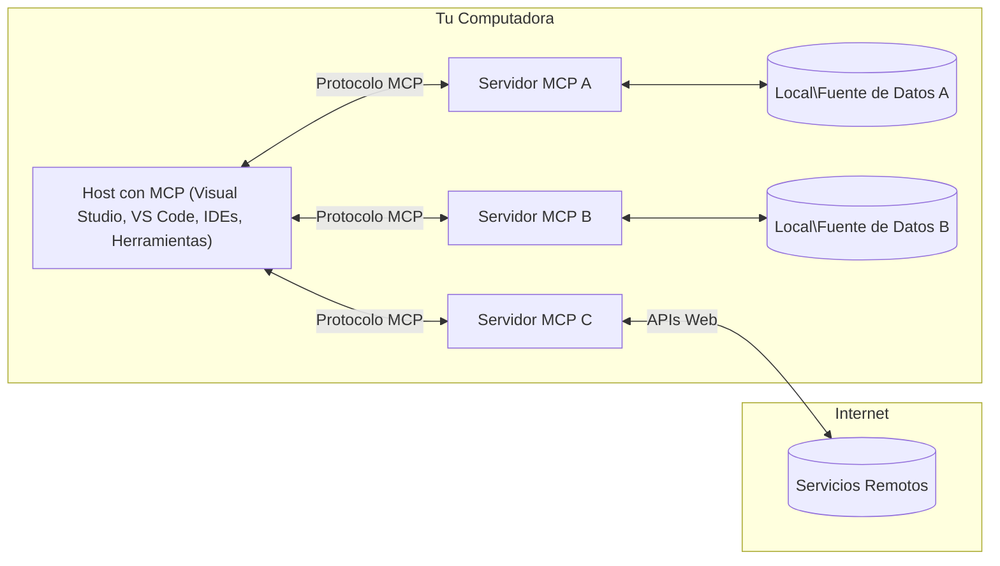

# Conceptos básicos de MCP: Dominando el Protocolo de Contexto de Modelo para la Integración de IA

[](https://youtu.be/earDzWGtE84)

_(Haz clic en la imagen de arriba para ver el video de esta lección)_

El [Protocolo de Contexto de Modelo (MCP)](https://github.com/modelcontextprotocol) es un marco poderoso y estandarizado que optimiza la comunicación entre Modelos de Lenguaje Grande (LLMs) y herramientas externas, aplicaciones y fuentes de datos.  
Esta guía te llevará a través de los conceptos básicos de MCP. Aprenderás sobre su arquitectura cliente-servidor, componentes esenciales, mecanismos de comunicación y mejores prácticas de implementación.

- **Consentimiento Explícito del Usuario**: Todos los accesos a datos y operaciones requieren la aprobación explícita del usuario antes de su ejecución. Los usuarios deben comprender claramente qué datos se accederán y qué acciones se realizarán, con control granular sobre permisos y autorizaciones.

- **Protección de la Privacidad de Datos**: Los datos del usuario solo se exponen con consentimiento explícito y deben estar protegidos por controles de acceso robustos durante todo el ciclo de vida de la interacción. Las implementaciones deben prevenir la transmisión no autorizada de datos y mantener límites estrictos de privacidad.

- **Seguridad en la Ejecución de Herramientas**: Cada invocación de herramientas requiere consentimiento explícito del usuario con comprensión clara de la funcionalidad, parámetros e impacto potencial de la herramienta. Las fronteras de seguridad robustas deben prevenir ejecuciones no intencionadas, inseguras o maliciosas.

- **Seguridad en la Capa de Transporte**: Todos los canales de comunicación deben usar mecanismos apropiados de encriptación y autenticación. Las conexiones remotas deben implementar protocolos de transporte seguro y gestión adecuada de credenciales.

#### Directrices de Implementación:

- **Gestión de Permisos**: Implementar sistemas de permisos granular que permitan a los usuarios controlar qué servidores, herramientas y recursos son accesibles  
- **Autenticación y Autorización**: Usar métodos de autenticación seguros (OAuth, claves API) con gestión adecuada de tokens y expiración  
- **Validación de Entradas**: Validar todos los parámetros y entradas de datos según esquemas definidos para prevenir ataques de inyección  
- **Registro de Auditoría**: Mantener registros completos de todas las operaciones para monitoreo de seguridad y cumplimiento

## Visión general

Esta lección explora la arquitectura fundamental y los componentes que conforman el ecosistema del Protocolo de Contexto de Modelo (MCP). Aprenderás sobre la arquitectura cliente-servidor, los componentes clave y los mecanismos de comunicación que impulsan las interacciones en MCP.

## Objetivos de aprendizaje clave

Al final de esta lección, podrás:

- Entender la arquitectura cliente-servidor de MCP.
- Identificar roles y responsabilidades de Hosts, Clientes y Servidores.
- Analizar las características principales que hacen de MCP una capa de integración flexible.
- Aprender cómo fluye la información dentro del ecosistema MCP.
- Obtener conocimientos prácticos a través de ejemplos de código en .NET, Java, Python y JavaScript.

## Arquitectura MCP: Una mirada más profunda

El ecosistema MCP se basa en un modelo cliente-servidor. Esta estructura modular permite que aplicaciones de IA interactúen eficientemente con herramientas, bases de datos, APIs y recursos contextuales. Desglosemos esta arquitectura en sus componentes principales.

En esencia, MCP sigue una arquitectura cliente-servidor donde una aplicación host puede conectarse a múltiples servidores:


```mermaid
flowchart LR
    subgraph "Tu Computadora"
        Host["Host con MCP (Visual Studio, VS Code, IDEs, Herramientas)"]
        S1["Servidor MCP A"]
        S2["Servidor MCP B"]
        S3["Servidor MCP C"]
        Host <-->|"Protocolo MCP"| S1
        Host <-->|"Protocolo MCP"| S2
        Host <-->|"Protocolo MCP"| S3
        S1 <--> D1[("Local\Fuente de Datos A")]
        S2 <--> D2[("Local\Fuente de Datos B")]
    end
    subgraph "Internet"
        S3 <-->|"APIs Web"| D3[("Servicios Remotos")]
    end
```
- **Hosts MCP**: Programas como VSCode, Claude Desktop, IDEs, o herramientas IA que desean acceder a datos mediante MCP  
- **Clientes MCP**: Clientes de protocolo que mantienen conexiones 1:1 con servidores  
- **Servidores MCP**: Programas livianos que exponen capacidades específicas a través del Protocolo de Contexto de Modelo estandarizado  
- **Fuentes de Datos Locales**: Archivos, bases de datos y servicios de tu computadora que los servidores MCP pueden acceder de forma segura  
- **Servicios Remotos**: Sistemas externos disponibles por internet a los que servidores MCP pueden conectarse mediante APIs.

El Protocolo MCP es un estándar en evolución que utiliza versión por fecha (formato AAAA-MM-DD). La versión actual del protocolo es **2025-11-25**. Puedes ver las últimas actualizaciones de la [especificación del protocolo](https://modelcontextprotocol.io/specification/2025-11-25/)  

### 1. Hosts

En el Protocolo de Contexto de Modelo (MCP), los **Hosts** son aplicaciones de IA que sirven como la interfaz principal mediante la cual los usuarios interactúan con el protocolo. Los Hosts coordinan y gestionan conexiones a múltiples servidores MCP creando clientes MCP dedicados para cada conexión de servidor. Ejemplos de Hosts incluyen:

- **Aplicaciones de IA**: Claude Desktop, Visual Studio Code, Claude Code  
- **Entornos de Desarrollo**: IDEs y editores de código con integración MCP  
- **Aplicaciones Personalizadas**: Agentes y herramientas AI creados a medida

Los **Hosts** son aplicaciones que coordinan las interacciones con modelos de IA. Ellos:

- **Orquestan Modelos de IA**: Ejecutan o interactúan con LLMs para generar respuestas y coordinar flujos de trabajo de IA  
- **Gestionan Conexiones de Clientes**: Crean y mantienen un cliente MCP por cada conexión a servidores MCP  
- **Controlan la Interfaz de Usuario**: Manejan el flujo de conversación, interacciones del usuario y presentación de respuestas  
- **Imponen Seguridad**: Controlan permisos, restricciones de seguridad y autenticación  
- **Gestionan el Consentimiento del Usuario**: Manejan la aprobación del usuario para compartir datos y ejecutar herramientas  

### 2. Clientes

Los **Clientes** son componentes esenciales que mantienen conexiones dedicadas uno a uno entre Hosts y servidores MCP. Cada cliente MCP es instanciado por el Host para conectar con un servidor MCP específico, asegurando canales de comunicación organizados y seguros. Múltiples clientes permiten a los Hosts conectarse a varios servidores simultáneamente.

Los **Clientes** son componentes conectores dentro de la aplicación host. Ellos:

- **Comunicación del Protocolo**: Envian solicitudes JSON-RPC 2.0 a los servidores con indicaciones e instrucciones  
- **Negociación de Capacidades**: Negocian características soportadas y versiones del protocolo con servidores durante la inicialización  
- **Ejecución de Herramientas**: Gestionan solicitudes de ejecución de herramientas desde modelos y procesan respuestas  
- **Actualizaciones en Tiempo Real**: Manejan notificaciones y actualizaciones en tiempo real de los servidores  
- **Procesamiento de Respuestas**: Procesan y formatean las respuestas del servidor para mostrar a los usuarios  

### 3. Servidores

Los **Servidores** son programas que proveen contexto, herramientas y capacidades a los clientes MCP. Pueden ejecutarse localmente (en la misma máquina que el Host) o remotamente (en plataformas externas), y son responsables de manejar solicitudes de clientes y proporcionar respuestas estructuradas. Los Servidores exponen funcionalidades específicas mediante el Protocolo de Contexto de Modelo estandarizado.

Los **Servidores** son servicios que proporcionan contexto y capacidades. Ellos:

- **Registro de Funciones**: Registran y exponen primitivas disponibles (recursos, indicaciones, herramientas) a los clientes  
- **Procesamiento de Solicitudes**: Reciben y ejecutan llamadas a herramientas, solicitudes de recursos y solicitudes de indicaciones de los clientes  
- **Provisión de Contexto**: Proporcionan información contextual y datos para mejorar las respuestas del modelo  
- **Gestión de Estado**: Mantienen estado de sesión y manejan interacciones con estado cuando es necesario  
- **Notificaciones en Tiempo Real**: Envían notificaciones sobre cambios en capacidades y actualizaciones a clientes conectados  

Los servidores pueden ser desarrollados por cualquier persona para extender las capacidades del modelo con funcionalidades especializadas, y soportan escenarios de despliegue local y remoto.

### 4. Primitivas del Servidor

Los servidores en el Protocolo de Contexto de Modelo (MCP) proporcionan tres **primitivas** principales que definen los bloques fundamentales para interacciones ricas entre clientes, hosts y modelos de lenguaje. Estas primitivas especifican los tipos de información contextual y acciones disponibles a través del protocolo.

Los servidores MCP pueden exponer cualquier combinación de las siguientes tres primitivas principales:

#### Recursos

Los **Recursos** son fuentes de datos que proveen información contextual a aplicaciones de IA. Representan contenido estático o dinámico que puede mejorar la comprensión y toma de decisiones del modelo:

- **Datos Contextuales**: Información estructurada y contexto para consumo del modelo AI  
- **Bases de Conocimiento**: Repositorios de documentos, artículos, manuales y papers de investigación  
- **Fuentes de Datos Locales**: Archivos, bases de datos e información del sistema local  
- **Datos Externos**: Respuestas API, servicios web y datos de sistemas remotos  
- **Contenido Dinámico**: Datos en tiempo real que se actualizan según condiciones externas

Los recursos son identificados por URIs y soportan descubrimiento mediante `resources/list` y recuperación mediante `resources/read`:

```text
file://documents/project-spec.md
database://production/users/schema
api://weather/current
```

#### Indicaciones

Las **Indicaciones** son plantillas reutilizables que ayudan a estructurar interacciones con modelos de lenguaje. Proveen patrones de interacción estandarizados y flujos de trabajo con plantillas:

- **Interacciones Basadas en Plantillas**: Mensajes preestructurados e iniciadores de conversación  
- **Plantillas de Flujo de Trabajo**: Secuencias estandarizadas para tareas e interacciones comunes  
- **Ejemplos Few-shot**: Plantillas basadas en ejemplos para instrucción del modelo  
- **Indicaciones del Sistema**: Indicaciones fundamentales que definen comportamiento y contexto del modelo  
- **Plantillas Dinámicas**: Indicaciones parametrizadas que se adaptan a contextos específicos

Las indicaciones soportan sustitución de variables y pueden descubrirse mediante `prompts/list` y recuperarse con `prompts/get`:

```markdown
Generate a {{task_type}} for {{product}} targeting {{audience}} with the following requirements: {{requirements}}
```

#### Herramientas

Las **Herramientas** son funciones ejecutables que los modelos de IA pueden invocar para realizar acciones específicas. Representan los "verbos" del ecosistema MCP, permitiendo a los modelos interactuar con sistemas externos:

- **Funciones Ejecutables**: Operaciones discretas que los modelos pueden invocar con parámetros específicos  
- **Integración con Sistemas Externos**: Llamadas API, consultas de bases de datos, operaciones sobre archivos, cálculos  
- **Identidad Única**: Cada herramienta tiene un nombre distinto, descripción y esquema de parámetros  
- **Entrada/Salida Estructurada**: Las herramientas aceptan parámetros validados y devuelven respuestas estructuradas y tipadas  
- **Capacidades de Acción**: Permiten a los modelos realizar acciones en el mundo real y obtener datos en vivo

Las herramientas se definen con JSON Schema para validación de parámetros y se descubren mediante `tools/list` y ejecutan mediante `tools/call`. Las herramientas también pueden incluir **iconos** como metadatos adicionales para mejor presentación en la UI.

**Anotaciones de Herramientas**: Las herramientas soportan anotaciones de comportamiento (p.ej., `readOnlyHint`, `destructiveHint`) que describen si una herramienta es solo lectura o destructiva, ayudando a los clientes a tomar decisiones informadas sobre la ejecución de herramientas.

Ejemplo de definición de herramienta:

```typescript
server.tool(
  "search_products", 
  {
    query: z.string().describe("Search query for products"),
    category: z.string().optional().describe("Product category filter"),
    max_results: z.number().default(10).describe("Maximum results to return")
  }, 
  async (params) => {
    // Ejecutar búsqueda y devolver resultados estructurados
    return await productService.search(params);
  }
);
```

## Primitivas del Cliente

En el Protocolo de Contexto de Modelo (MCP), los **clientes** pueden exponer primitivas que permiten a los servidores solicitar capacidades adicionales desde la aplicación host. Estas primitivas del lado cliente habilitan implementaciones de servidor más ricas e interactivas que pueden acceder a capacidades del modelo AI y a interacciones de usuarios.

### Muestreo

El **Muestreo** permite a los servidores solicitar completaciones de modelos de lenguaje desde la aplicación AI del cliente. Esta primitiva habilita el acceso a capacidades LLM sin que los servidores incrusten sus propias dependencias de modelo:

- **Acceso Independiente del Modelo**: Los servidores pueden solicitar completaciones sin incluir SDKs de LLM ni gestionar acceso a modelos  
- **IA Iniciada por Servidor**: Permite a los servidores generar contenido autónomamente usando el modelo AI del cliente  
- **Interacciones Recursivas con LLMs**: Soporta escenarios complejos donde los servidores necesitan asistencia AI para procesamiento  
- **Generación Dinámica de Contenido**: Permite a los servidores crear respuestas contextuales usando el modelo del host  
- **Soporte para Llamadas a Herramientas**: Los servidores pueden incluir parámetros `tools` y `toolChoice` para habilitar que el modelo del cliente invoque herramientas durante el muestreo

El muestreo se inicia mediante el método `sampling/complete`, donde los servidores envían solicitudes de completación a los clientes.

### Raíces

Las **Raíces** proveen una forma estandarizada para que los clientes expongan límites del sistema de archivos a los servidores, ayudando a los servidores a entender qué directorios y archivos tienen acceso:

- **Límites del Sistema de Archivos**: Definen los límites donde los servidores pueden operar dentro del sistema de archivos  
- **Control de Acceso**: Ayudan a los servidores a entender qué directorios y archivos pueden acceder  
- **Actualizaciones Dinámicas**: Los clientes pueden notificar a los servidores cuando cambia la lista de raíces  
- **Identificación basada en URI**: Las raíces usan URIs `file://` para identificar directorios y archivos accesibles

Las raíces se descubren mediante el método `roots/list`, con clientes enviando `notifications/roots/list_changed` cuando hay cambios.

### Solicitud de Información

La **Solicitud de Información** permite a los servidores pedir información adicional o confirmación a los usuarios a través de la interfaz del cliente:

- **Peticiones de Entrada del Usuario**: Los servidores pueden solicitar información adicional cuando es necesaria para la ejecución de herramientas  
- **Diálogos de Confirmación**: Solicitan aprobación del usuario para operaciones sensibles o con impacto  
- **Flujos Interactivos**: Permiten a los servidores crear interacciones paso a paso con el usuario  
- **Recolección Dinámica de Parámetros**: Recopilan parámetros faltantes u opcionales durante la ejecución de herramientas

Las solicitudes de información se hacen utilizando el método `elicitation/request` para recopilar entradas de usuario a través de la interfaz del cliente.

**Modo URL para Solicitud de Información**: Los servidores también pueden solicitar interacciones de usuario basadas en URL, permitiendo que dirijan a usuarios a páginas web externas para autenticación, confirmación o ingreso de datos.

### Registro

El **Registro** permite a los servidores enviar mensajes de registro estructurados a los clientes para depuración, monitoreo y visibilidad operativa:

- **Soporte para Depuración**: Permiten a los servidores proporcionar registros detallados de ejecución para resolución de problemas  
- **Monitoreo Operativo**: Envian actualizaciones de estado y métricas de rendimiento a los clientes  
- **Reporte de Errores**: Proveen contexto detallado de errores e información diagnóstica  
- **Trazabilidad de Auditoría**: Crean registros completos de las operaciones y decisiones del servidor

Los mensajes de registro se envían a los clientes para proveer transparencia sobre las operaciones del servidor y facilitar la depuración.

## Flujo de Información en MCP

El Protocolo de Contexto de Modelo (MCP) define un flujo estructurado de información entre hosts, clientes, servidores y modelos. Entender este flujo ayuda a clarificar cómo se procesan las solicitudes de los usuarios y cómo las herramientas externas y los datos se integran en las respuestas del modelo.
- **El host inicia la conexión**  
  La aplicación host (como un IDE o interfaz de chat) establece una conexión con un servidor MCP, típicamente vía STDIO, WebSocket u otro transporte compatible.

- **Negociación de capacidades**  
  El cliente (integrado en el host) y el servidor intercambian información sobre sus funciones, herramientas, recursos y versiones de protocolo soportadas. Esto garantiza que ambas partes entiendan qué capacidades están disponibles para la sesión.

- **Solicitud del usuario**  
  El usuario interactúa con el host (por ejemplo, introduce un mensaje o comando). El host recopila esta entrada y la pasa al cliente para su procesamiento.

- **Uso de recursos o herramientas**  
  - El cliente puede solicitar contexto adicional o recursos al servidor (como archivos, entradas de bases de datos o artículos de la base de conocimientos) para enriquecer la comprensión del modelo.  
  - Si el modelo determina que se necesita una herramienta (por ejemplo, para obtener datos, realizar un cálculo o llamar a una API), el cliente envía una solicitud de invocación de herramienta al servidor, especificando el nombre de la herramienta y los parámetros.

- **Ejecución por parte del servidor**  
  El servidor recibe la solicitud de recurso o herramienta, ejecuta las operaciones necesarias (como ejecutar una función, consultar una base de datos o recuperar un archivo) y devuelve los resultados al cliente en un formato estructurado.

- **Generación de respuesta**  
  El cliente integra las respuestas del servidor (datos de recursos, salidas de herramientas, etc.) en la interacción en curso con el modelo. El modelo usa esta información para generar una respuesta completa y contextualmente relevante.

- **Presentación del resultado**  
  El host recibe la salida final del cliente y la presenta al usuario, a menudo incluyendo tanto el texto generado por el modelo como cualquier resultado de las ejecuciones de herramientas o consultas a recursos.

Este flujo permite que MCP soporte aplicaciones de IA avanzadas, interactivas y conscientes del contexto al conectar sin problemas modelos con herramientas externas y fuentes de datos.

## Arquitectura y capas del protocolo

MCP consta de dos capas arquitectónicas distintas que trabajan juntas para proporcionar un marco completo de comunicación:

### Capa de datos

La **Capa de Datos** implementa el protocolo central de MCP usando **JSON-RPC 2.0** como base. Esta capa define la estructura del mensaje, su semántica y los patrones de interacción:

#### Componentes principales:

- **Protocolo JSON-RPC 2.0**: Toda la comunicación usa el formato estándar de mensajes JSON-RPC 2.0 para llamadas a métodos, respuestas y notificaciones  
- **Gestión del ciclo de vida**: Maneja la inicialización de conexión, negociación de capacidades y terminación de sesiones entre clientes y servidores  
- **Primitivas del servidor**: Permite a los servidores proveer funcionalidades básicas mediante herramientas, recursos y prompts  
- **Primitivas del cliente**: Permite a los servidores solicitar muestras de modelos de lenguaje, obtener entrada de usuario y enviar mensajes de registro  
- **Notificaciones en tiempo real**: Soporta notificaciones asíncronas para actualizaciones dinámicas sin necesidad de sondeo

#### Características clave:

- **Negociación de versión del protocolo**: Usa versionado basado en fecha (AAAA-MM-DD) para asegurar compatibilidad  
- **Descubrimiento de capacidades**: Clientes y servidores intercambian información sobre características soportadas durante la inicialización  
- **Sesiones con estado**: Mantiene el estado de la conexión a lo largo de múltiples interacciones para continuidad contextual

### Capa de transporte

La **Capa de Transporte** gestiona los canales de comunicación, el encuadre de mensajes y la autenticación entre los participantes MCP:

#### Mecanismos de transporte soportados:

1. **Transporte STDIO**:  
   - Usa flujos estándar de entrada/salida para comunicación directa de procesos  
   - Óptimo para procesos locales en la misma máquina sin sobrecarga de red  
   - Común para implementaciones locales de servidores MCP

2. **Transporte HTTP transmisible**:  
   - Usa HTTP POST para mensajes de cliente a servidor  
   - Opcionalmente usa Server-Sent Events (SSE) para transmisión del servidor al cliente  
   - Permite comunicación remota de servidores a través de redes  
   - Soporta autenticación HTTP estándar (tokens bearer, claves API, encabezados personalizados)  
   - MCP recomienda OAuth para autenticación segura basada en tokens

#### Abstracción de transporte:

La capa de transporte abstrae los detalles de comunicación de la capa de datos, permitiendo usar el mismo formato de mensajes JSON-RPC 2.0 en todos los mecanismos de transporte. Esta abstracción permite a las aplicaciones cambiar sin problemas entre servidores locales y remotos.

### Consideraciones de seguridad

Las implementaciones de MCP deben adherirse a varios principios críticos de seguridad para garantizar interacciones seguras, confiables y protegidas en todas las operaciones del protocolo:

- **Consentimiento y control del usuario**: Los usuarios deben proporcionar consentimiento explícito antes de que se acceda a cualquier dato o se realicen operaciones. Deben tener control claro sobre qué datos se comparten y qué acciones están autorizadas, apoyados por interfaces intuitivas para revisar y aprobar actividades.

- **Privacidad de datos**: Los datos del usuario solo deben exponerse con consentimiento explícito y deben protegerse mediante controles de acceso adecuados. Las implementaciones de MCP deben evitar la transmisión no autorizada de datos y garantizar que la privacidad se mantenga a lo largo de todas las interacciones.

- **Seguridad de las herramientas**: Antes de invocar cualquier herramienta, se requiere consentimiento explícito del usuario. Los usuarios deben comprender claramente la funcionalidad de cada herramienta y se deben imponer límites robustos de seguridad para prevenir ejecuciones no deseadas o inseguras.

Al seguir estos principios de seguridad, MCP asegura que la confianza del usuario, la privacidad y la seguridad se mantengan en todas las interacciones del protocolo, al tiempo que habilita integraciones poderosas de IA.

## Ejemplos de código: Componentes clave

A continuación se muestran ejemplos de código en varios lenguajes populares que ilustran cómo implementar componentes clave de servidores MCP y herramientas.

### Ejemplo .NET: Creando un servidor MCP simple con herramientas

Aquí hay un ejemplo práctico en .NET que demuestra cómo implementar un servidor MCP simple con herramientas personalizadas. Este ejemplo muestra cómo definir y registrar herramientas, manejar solicitudes y conectar el servidor usando el Protocolo de Contexto del Modelo.

```csharp
using System;
using System.Threading.Tasks;
using ModelContextProtocol.Server;
using ModelContextProtocol.Server.Transport;
using ModelContextProtocol.Server.Tools;

public class WeatherServer
{
    public static async Task Main(string[] args)
    {
        // Create an MCP server
        var server = new McpServer(
            name: "Weather MCP Server",
            version: "1.0.0"
        );
        
        // Register our custom weather tool
        server.AddTool<string, WeatherData>("weatherTool", 
            description: "Gets current weather for a location",
            execute: async (location) => {
                // Call weather API (simplified)
                var weatherData = await GetWeatherDataAsync(location);
                return weatherData;
            });
        
        // Connect the server using stdio transport
        var transport = new StdioServerTransport();
        await server.ConnectAsync(transport);
        
        Console.WriteLine("Weather MCP Server started");
        
        // Keep the server running until process is terminated
        await Task.Delay(-1);
    }
    
    private static async Task<WeatherData> GetWeatherDataAsync(string location)
    {
        // This would normally call a weather API
        // Simplified for demonstration
        await Task.Delay(100); // Simulate API call
        return new WeatherData { 
            Temperature = 72.5,
            Conditions = "Sunny",
            Location = location
        };
    }
}

public class WeatherData
{
    public double Temperature { get; set; }
    public string Conditions { get; set; }
    public string Location { get; set; }
}
```

### Ejemplo Java: Componentes del servidor MCP

Este ejemplo demuestra el mismo servidor MCP y registro de herramientas que el ejemplo en .NET anterior, pero implementado en Java.

```java
import io.modelcontextprotocol.server.McpServer;
import io.modelcontextprotocol.server.McpToolDefinition;
import io.modelcontextprotocol.server.transport.StdioServerTransport;
import io.modelcontextprotocol.server.tool.ToolExecutionContext;
import io.modelcontextprotocol.server.tool.ToolResponse;

public class WeatherMcpServer {
    public static void main(String[] args) throws Exception {
        // Crear un servidor MCP
        McpServer server = McpServer.builder()
            .name("Weather MCP Server")
            .version("1.0.0")
            .build();
            
        // Registrar una herramienta de clima
        server.registerTool(McpToolDefinition.builder("weatherTool")
            .description("Gets current weather for a location")
            .parameter("location", String.class)
            .execute((ToolExecutionContext ctx) -> {
                String location = ctx.getParameter("location", String.class);
                
                // Obtener datos del clima (simplificado)
                WeatherData data = getWeatherData(location);
                
                // Devolver una respuesta formateada
                return ToolResponse.content(
                    String.format("Temperature: %.1f°F, Conditions: %s, Location: %s", 
                    data.getTemperature(), 
                    data.getConditions(), 
                    data.getLocation())
                );
            })
            .build());
        
        // Conectar el servidor usando transporte stdio
        try (StdioServerTransport transport = new StdioServerTransport()) {
            server.connect(transport);
            System.out.println("Weather MCP Server started");
            // Mantener el servidor en ejecución hasta que el proceso se termine
            Thread.currentThread().join();
        }
    }
    
    private static WeatherData getWeatherData(String location) {
        // La implementación llamaría a una API de clima
        // Simplificado para fines de ejemplo
        return new WeatherData(72.5, "Sunny", location);
    }
}

class WeatherData {
    private double temperature;
    private String conditions;
    private String location;
    
    public WeatherData(double temperature, String conditions, String location) {
        this.temperature = temperature;
        this.conditions = conditions;
        this.location = location;
    }
    
    public double getTemperature() {
        return temperature;
    }
    
    public String getConditions() {
        return conditions;
    }
    
    public String getLocation() {
        return location;
    }
}
```

### Ejemplo Python: Construyendo un servidor MCP

Este ejemplo usa fastmcp, así que por favor instálelo primero:

```python
pip install fastmcp
```
Código de ejemplo:

```python
#!/usr/bin/env python3
import asyncio
from fastmcp import FastMCP
from fastmcp.transports.stdio import serve_stdio

# Crear un servidor FastMCP
mcp = FastMCP(
    name="Weather MCP Server",
    version="1.0.0"
)

@mcp.tool()
def get_weather(location: str) -> dict:
    """Gets current weather for a location."""
    return {
        "temperature": 72.5,
        "conditions": "Sunny",
        "location": location
    }

# Enfoque alternativo usando una clase
class WeatherTools:
    @mcp.tool()
    def forecast(self, location: str, days: int = 1) -> dict:
        """Gets weather forecast for a location for the specified number of days."""
        return {
            "location": location,
            "forecast": [
                {"day": i+1, "temperature": 70 + i, "conditions": "Partly Cloudy"}
                for i in range(days)
            ]
        }

# Registrar herramientas de clase
weather_tools = WeatherTools()

# Iniciar el servidor
if __name__ == "__main__":
    asyncio.run(serve_stdio(mcp))
```

### Ejemplo JavaScript: Creando un servidor MCP

Este ejemplo muestra la creación de un servidor MCP en JavaScript y cómo registrar dos herramientas relacionadas con el clima.

```javascript
// Usando el SDK oficial del Protocolo de Contexto de Modelo
import { McpServer } from "@modelcontextprotocol/sdk/server/mcp.js";
import { StdioServerTransport } from "@modelcontextprotocol/sdk/server/stdio.js";
import { z } from "zod"; // Para la validación de parámetros

// Crear un servidor MCP
const server = new McpServer({
  name: "Weather MCP Server",
  version: "1.0.0"
});

// Definir una herramienta de clima
server.tool(
  "weatherTool",
  {
    location: z.string().describe("The location to get weather for")
  },
  async ({ location }) => {
    // Normalmente esto llamaría a una API de clima
    // Simplificado para demostración
    const weatherData = await getWeatherData(location);
    
    return {
      content: [
        { 
          type: "text", 
          text: `Temperature: ${weatherData.temperature}°F, Conditions: ${weatherData.conditions}, Location: ${weatherData.location}` 
        }
      ]
    };
  }
);

// Definir una herramienta de pronóstico
server.tool(
  "forecastTool",
  {
    location: z.string(),
    days: z.number().default(3).describe("Number of days for forecast")
  },
  async ({ location, days }) => {
    // Normalmente esto llamaría a una API de clima
    // Simplificado para demostración
    const forecast = await getForecastData(location, days);
    
    return {
      content: [
        { 
          type: "text", 
          text: `${days}-day forecast for ${location}: ${JSON.stringify(forecast)}` 
        }
      ]
    };
  }
);

// Funciones auxiliares
async function getWeatherData(location) {
  // Simular llamada a API
  return {
    temperature: 72.5,
    conditions: "Sunny",
    location: location
  };
}

async function getForecastData(location, days) {
  // Simular llamada a API
  return Array.from({ length: days }, (_, i) => ({
    day: i + 1,
    temperature: 70 + Math.floor(Math.random() * 10),
    conditions: i % 2 === 0 ? "Sunny" : "Partly Cloudy"
  }));
}

// Conectar el servidor usando transporte stdio
const transport = new StdioServerTransport();
server.connect(transport).catch(console.error);

console.log("Weather MCP Server started");
```

Este ejemplo en JavaScript demuestra cómo crear un servidor MCP que registra herramientas relacionadas con el clima y se conecta usando el transporte stdio para manejar solicitudes entrantes de clientes.

## Seguridad y autorización

MCP incluye varios conceptos y mecanismos integrados para gestionar la seguridad y autorización a lo largo del protocolo:

1. **Control de permisos de herramientas**:  
  Los clientes pueden especificar qué herramientas puede usar un modelo durante una sesión. Esto garantiza que solo las herramientas explícitamente autorizadas estén accesibles, reduciendo el riesgo de operaciones no deseadas o inseguras. Los permisos pueden configurarse dinámicamente según preferencias del usuario, políticas organizacionales o el contexto de la interacción.

2. **Autenticación**:  
  Los servidores pueden requerir autenticación antes de permitir acceso a herramientas, recursos u operaciones sensibles. Esto puede implicar claves API, tokens OAuth u otros esquemas de autenticación. Una autenticación adecuada asegura que solo clientes y usuarios confiables puedan invocar capacidades del servidor.

3. **Validación**:  
  Se aplica validación de parámetros para todas las invocaciones de herramientas. Cada herramienta define los tipos, formatos y restricciones esperados para sus parámetros, y el servidor valida las solicitudes entrantes en consecuencia. Esto previene que entradas malformadas o malintencionadas alcancen las implementaciones de herramientas y ayuda a mantener la integridad de las operaciones.

4. **Limitación de tasa**:  
  Para prevenir abusos y asegurar un uso justo de los recursos del servidor, los servidores MCP pueden implementar limitación de tasa para llamadas a herramientas y acceso a recursos. Los límites pueden aplicarse por usuario, por sesión o a nivel global, y ayudan a proteger contra ataques de denegación de servicio o consumo excesivo de recursos.

Al combinar estos mecanismos, MCP proporciona una base segura para integrar modelos de lenguaje con herramientas y fuentes de datos externas, al tiempo que otorga a usuarios y desarrolladores control detallado sobre el acceso y uso.

## Mensajes del protocolo y flujo de comunicación

La comunicación MCP usa mensajes estructurados **JSON-RPC 2.0** para facilitar interacciones claras y confiables entre hosts, clientes y servidores. El protocolo define patrones específicos de mensajes para diferentes tipos de operaciones:

### Tipos de mensajes principales:

#### **Mensajes de inicialización**
- Solicitud `initialize`: Establece conexión y negocia versión del protocolo y capacidades  
- Respuesta `initialize`: Confirma características soportadas e información del servidor  
- `notifications/initialized`: Señala que la inicialización está completa y la sesión lista

#### **Mensajes de descubrimiento**
- Solicitud `tools/list`: Descubre herramientas disponibles en el servidor  
- Solicitud `resources/list`: Lista recursos disponibles (fuentes de datos)  
- Solicitud `prompts/list`: Obtiene plantillas de prompts disponibles

#### **Mensajes de ejecución**  
- Solicitud `tools/call`: Ejecuta una herramienta específica con parámetros proporcionados  
- Solicitud `resources/read`: Recupera contenido de un recurso específico  
- Solicitud `prompts/get`: Obtiene una plantilla de prompt con parámetros opcionales

#### **Mensajes del lado cliente**
- Solicitud `sampling/complete`: El servidor solicita al cliente una finalización LLM  
- `elicitation/request`: El servidor solicita entrada de usuario a través del cliente  
- Mensajes de registro: El servidor envía mensajes estructurados de registro al cliente

#### **Mensajes de notificación**
- `notifications/tools/list_changed`: El servidor notifica al cliente cambios en las herramientas  
- `notifications/resources/list_changed`: El servidor notifica cambios en los recursos  
- `notifications/prompts/list_changed`: El servidor notifica cambios en los prompts

### Estructura del mensaje:

Todos los mensajes MCP siguen el formato JSON-RPC 2.0:  
- **Mensajes de solicitud**: Incluyen `id`, `method` y `params` opcional  
- **Mensajes de respuesta**: Incluyen `id` y `result` o `error`    
- **Mensajes de notificación**: Incluyen `method` y `params` opcional (no tienen `id` ni respuesta esperada)

Esta comunicación estructurada asegura interacciones fiables, trazables y extensibles que soportan escenarios avanzados como actualizaciones en tiempo real, encadenamiento de herramientas y manejo robusto de errores.

### Tareas (Experimental)

Las **Tareas** son una función experimental que provee envoltorios de ejecución duraderos que permiten la recuperación diferida de resultados y el seguimiento del estado de solicitudes MCP:

- Operaciones de larga duración: seguimiento de cálculos costosos, automatización de flujos y procesamiento por lotes  
- Resultados diferidos: sondeo del estado de tareas y recuperación de resultados al completar  
- Seguimiento de estado: monitoreo del progreso mediante estados definidos del ciclo de vida  
- Operaciones multi-paso: soporte para flujos complejos que abarcan múltiples interacciones

Las tareas envuelven las solicitudes estándar MCP para habilitar patrones de ejecución asíncrona para operaciones que no pueden completarse de inmediato.

## Conclusiones clave

- **Arquitectura**: MCP utiliza arquitectura cliente-servidor donde hosts gestionan múltiples conexiones de clientes a servidores  
- **Participantes**: El ecosistema incluye hosts (aplicaciones de IA), clientes (conectores de protocolo) y servidores (proveedores de capacidades)  
- **Mecanismos de transporte**: La comunicación soporta STDIO (local) y HTTP transmisible con SSE opcional (remoto)  
- **Primitivas centrales**: Los servidores exponen herramientas (funciones ejecutables), recursos (fuentes de datos) y prompts (plantillas)  
- **Primitivas del cliente**: Los servidores pueden solicitar muestreo (completaciones LLM con soporte de llamadas a herramientas), elicitation (entrada de usuario, incluyendo modo URL), roots (límites del sistema de archivos) y registro desde clientes  
- **Características experimentales**: Las tareas proveen envoltorios duraderos para operaciones de larga ejecución  
- **Fundamento del protocolo**: Construido sobre JSON-RPC 2.0 con versionado basado en fecha (actual: 2025-11-25)  
- **Capacidades en tiempo real**: Soporta notificaciones para actualizaciones dinámicas y sincronización en tiempo real  
- **Seguridad ante todo**: Consentimiento explícito del usuario, protección de privacidad y transporte seguro son requisitos centrales

## Ejercicio

Diseña una herramienta MCP simple que sea útil en tu área. Define:  
1. Cómo se llamaría la herramienta  
2. Qué parámetros aceptaría  
3. Qué salida retornaría  
4. Cómo un modelo podría usar esta herramienta para resolver problemas de los usuarios


---

## Qué sigue

Siguiente: [Capítulo 2: Seguridad](../02-Security/README.md)

---

<!-- CO-OP TRANSLATOR DISCLAIMER START -->
**Aviso legal**:
Este documento ha sido traducido utilizando el servicio de traducción automática [Co-op Translator](https://github.com/Azure/co-op-translator). Aunque nos esforzamos por lograr precisión, tenga en cuenta que las traducciones automáticas pueden contener errores o inexactitudes. El documento original en su idioma nativo debe considerarse la fuente autorizada. Para información crítica, se recomienda la traducción profesional realizada por un humano. No nos hacemos responsables de malentendidos o interpretaciones erróneas derivadas del uso de esta traducción.
<!-- CO-OP TRANSLATOR DISCLAIMER END -->