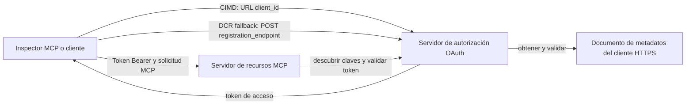

# Ejemplo de Autorización CIMD y DCR

Este ejemplo en TypeScript compara dos formas en que un cliente OAuth puede obtener una identidad
antes de acceder a un servidor MCP protegido:

- **Documentos de Metadatos del ID de Cliente (CIMD)** usan una URL HTTPS estable como
  `client_id`. Este es el mecanismo preferido para clientes y servidores de autorización
  que no tienen una relación previa.
- **Registro Dinámico de Cliente (DCR)** pide al servidor de autorización que genere
  un ID de cliente opaco en tiempo de ejecución. MCP `2026-07-28` mantiene DCR solo para compatibilidad
  con versiones anteriores.

El ejemplo usa el SDK estable MCP TypeScript v2 y el modelo de solicitud MCP `2026-07-28` sin estado.
Funciona con un servidor de autorización externo OAuth 2.1/OpenID
Connect como Auth0. El servidor MCP es un servidor de recursos:
valida tokens de acceso pero no autentica usuarios ni emite
tokens.

## Objetivos de Aprendizaje

Al completar este ejemplo, serás capaz de:

- Explicar por qué CIMD es preferido sobre DCR para nuevos clientes MCP.
- Publicar un documento CIMD válido para un cliente nativo público.
- Configurar un servidor de recursos MCP para descubrimiento OAuth y validación JWT.
- Ejercitar CIMD y DCR con el mismo servidor MCP y servidor de autorización.
- Hacer cumplir un ámbito OAuth dentro de una herramienta MCP.
- Identificar qué responsabilidades corresponden al cliente, servidor de recursos y
  servidor de autorización.

## Arquitectura



El servidor de autorización elige y valida el mecanismo de registro.
El servidor MCP solo ve el reclamo verificado resultante `client_id`. Una URL HTTPS
con un path identifica CIMD. Un ID opaco no es suficiente para probar DCR porque un
cliente pre-registrado también puede usar un ID opaco; el ajuste opcional
`DCR_CLIENT_ID_PREFIX` suministra una pista de demostración específica del proveedor.

## Prioridad de Registro

Los clientes MCP que soporten todos los mecanismos deberían usar este orden:

1. Usar información del cliente pre-registrado cuando ya esté disponible.
2. Usar CIMD cuando el servidor de autorización anuncie
   `client_id_metadata_document_supported: true`.
3. Usar DCR solo como recurso de respaldo cuando el servidor anuncie un
   `registration_endpoint`.
4. Pedir al usuario la información del cliente pre-registrado cuando ninguna de las opciones anteriores esté
   disponible.

## Estructura del Proyecto

```text
src/
  config.ts          Environment validation
  dcr.ts             DCR compatibility request
  mcp.ts             MCP tools and scope checks
  oauth.ts           Authorization metadata and JWT verification
  register-dcr.ts    DCR command-line helper
  registration.ts    CIMD document and mechanism classification
  server.ts          Express, OAuth discovery, and MCP endpoint
test/
  dcr.test.ts
  oauth.test.ts
  registration.test.ts
  server.test.ts
```

## Prerrequisitos

- Node.js 20.6 o superior. Los scripts usan `--env-file` y `--import`.
- Un servidor de autorización OAuth 2.1/OpenID Connect que soporte:
  - Flujo de código de autorización con PKCE S256.
  - Metadatos de recurso protegido OAuth e Indicadores de recursos.
  - Tokens de acceso JWT y un endpoint JWKS.
  - CIMD, además de DCR si quieres comparar la solución heredada.
- Inspector MCP u otro cliente MCP `2026-07-28`.
- Una URL HTTPS pública para el documento CIMD. Un túnel de desarrollo es adecuado
  para el laboratorio; usa un dominio estable en producción.

## Instalar y Probar

```bash
npm install
npm run build
npm test
```

Las doce pruebas usan claves locales y endpoints HTTP simulados. No requieren una
cuenta en el servidor de autorización. Verifican:

- Forma del documento CIMD y restricciones de URL.
- Clasificación honesta de URLs y IDs de cliente opacos.
- Manejo de solicitudes y respuestas DCR.
- Rechazo de endpoints DCR inseguros no loopback.
- Validación de firma JWT, emisor, audiencia, expiración, ID de cliente y ámbito.
- Una llamada MCP `2026-07-28` en proceso a `registration-info`.

## Configurar el Servidor de Autorización

Los nombres exactos de control varían según el proveedor. Configura estas capacidades:

1. Crear una API o servidor de recursos cuyo identificador coincida exactamente con tu MCP
   URL, incluyendo `/mcp`, por ejemplo `http://127.0.0.1:3001/mcp`.
2. Usar tokens de acceso RS256 e incluir un reclamo `client_id` o `azp`.
3. Añadir el permiso o ámbito `tool:greet`.
4. Habilitar el flujo de código de autorización con PKCE S256 para clientes nativos públicos.
5. Habilitar Documentos de Metadatos de ID de Cliente.
6. Solo para la comparación, habilitar Registro Dinámico de Cliente.
7. Asegurar que los metadatos del servidor de autorización anuncien:
   - `issuer`
   - `authorization_endpoint`
   - `token_endpoint`
   - `jwks_uri`
   - `client_id_metadata_document_supported: true`
   - `registration_endpoint` cuando DCR esté habilitado

### Ejemplo Auth0

Para Auth0, habilita el Registro de Documento de Metadatos de ID de Cliente, Registro Dinámico OIDC
de Aplicación, y compatibilidad con Parámetro de Recurso. Crea una API
cuyo identificador sea la URL exacta MCP y añade el permiso `tool:greet`.
Permite que el usuario de prueba y los clientes terceros soliciten ese permiso.

Los paneles de proveedores y la disponibilidad de funciones cambian con el tiempo. Consulta la
documentación del proveedor antes de usar estas configuraciones fuera de este laboratorio.

## Configurar el Ejemplo

Crea `.env` a partir del ejemplo:

```powershell
Copy-Item .env.example .env
```

En shells compatibles con bash:

```bash
cp .env.example .env
```

Configura estos valores:

```dotenv
MCP_SERVER_URL=http://127.0.0.1:3001/mcp
AUTHORIZATION_SERVER_ISSUER=https://your-tenant.example.com/
AUTHORIZATION_SERVER_METADATA_URL=https://your-tenant.example.com/.well-known/openid-configuration
CLIENT_METADATA_URL=https://your-public-host.example.com/client-metadata.json
OAUTH_REDIRECT_URIS=http://127.0.0.1:6274/oauth/callback
DCR_CLIENT_ID_PREFIX=tpc_
```

Detalles importantes:

- `AUTHORIZATION_SERVER_ISSUER` debe coincidir exactamente con el `issuer` en los metadatos
  descubiertos del servidor de autorización, incluyendo cualquier barra final.
- `MCP_SERVER_URL` debe coincidir con la audiencia del token de acceso.
- `CLIENT_METADATA_URL` debe usar HTTPS, contener un path no raíz y ser la
  URL pública que sirva la ruta de metadatos. Las cadenas de consulta y fragmentos son
  rechazados para que la ruta y `client_id` permanezcan idénticos.
- `OAUTH_REDIRECT_URIS` es una lista blanca separada por comas. El valor por defecto es la
  devolución de llamada loopback del Inspector MCP.
- `DCR_CLIENT_ID_PREFIX` es opcional y específico para cada proveedor. Déjalo vacío cuando
  tu proveedor no tenga un prefijo DCR fiable.

## Publicar el Documento CIMD

Inicia un túnel que reenvíe su origen HTTPS público a `127.0.0.1:3001`.
Configura `CLIENT_METADATA_URL` con ese origen más `/client-metadata.json`, luego ejecuta:

```bash
npm run build
npm start
```

Verifica ambos documentos de descubrimiento:

```bash
curl http://127.0.0.1:3001/health
curl http://127.0.0.1:3001/client-metadata.json
curl http://127.0.0.1:3001/.well-known/oauth-protected-resource/mcp
```

El `client_id` retornado por la URL pública HTTPS de metadatos debe ser idéntico byte por byte
a esa URL. El servidor de autorización debe validar el documento y
su URI de redirección antes de emitir un token.

> [!NOTE]
> El ejemplo hospeda el documento cliente y el servidor de recursos MCP en un solo proceso
> para mantener el laboratorio pequeño. En producción, el cliente MCP es dueño y hospeda su CIMD
> documento de forma independiente del servidor de recursos.

## Comparar CIMD y DCR

Inicia MCP Inspector:

```bash
npx @modelcontextprotocol/inspector
```

Usa HTTP Streamable y conéctate a `http://127.0.0.1:3001/mcp`.

### CIMD (Preferido)


1. Ingrese la `CLIENT_METADATA_URL` pública como el ID de cliente OAuth.
2. Solicite `tool:greet` más cualquier ámbito de identidad requerido por su proveedor.
3. Complete el inicio de sesión y el consentimiento.
4. Llame a `registration-info`. Reporta `mechanism: "cimd"`.
5. Llame a `greet` para verificar la aplicación del ámbito.

### DCR (Compatibilidad de Reserva)

1. Borre el estado OAuth guardado del Inspector.
2. Deje vacío el ID de cliente OAuth para que el Inspector pueda usar el
   `registration_endpoint` anunciado.
3. Complete el inicio de sesión y el consentimiento.
4. Llame a `registration-info`.
5. Si `DCR_CLIENT_ID_PREFIX` coincide con los IDs generados por el proveedor, la herramienta
   informa `mechanism: "dcr"`; de lo contrario, informa correctamente
   `opaque-client-id`.

También puede demostrar la solicitud de registro directamente:

```bash
npm run build
npm run register:dcr
```

El asistente imprime el ID de cliente retornado pero nunca imprime un secreto de cliente.
Trate cualquier secreto retornado como sensible y guárdelo en un almacén de secretos adecuado.

## Herramientas

| Herramienta | Ámbito requerido | Propósito |
| --- | --- | --- |
| `registration-info` | Cliente verificado | Reportar el tipo de ID de cliente |
| `greet` | `tool:greet` | Demostrar autorización por herramienta |

## Notas de seguridad

- Validar firmas JWT a través del endpoint JWKS del servidor de autorización.
- Requerir coincidencias exactas de emisor y audiencia.
- Requerir las afirmaciones de expiración e ID de cliente.
- Nunca aceptar un token emitido para un recurso diferente.
- Nunca pasar el token MCP a una API descendente.
- Mantener las credenciales DCR vinculadas al emisor que las creó.
- Validar las URIs de redirección CIMD con coincidencia exacta.
- Aplicar controles SSRF cuando un servidor de autorización consulte URLs CIMD.
- Usar HTTPS para endpoints de autorización y metadatos fuera del desarrollo
  en loopback.
- No inferir DCR a partir de un ID de cliente opaco a menos que el proveedor documente una
  convención de identificador confiable.

## Referencias

- [Especificación de autorización MCP](https://modelcontextprotocol.io/specification/2026-07-28/basic/authorization)
- [Registro de cliente MCP](https://modelcontextprotocol.io/specification/2026-07-28/basic/authorization/client-registration)
- [Mejores prácticas de seguridad MCP](https://modelcontextprotocol.io/specification/2026-07-28/basic/security_best_practices)
- [Guía de autorización del SDK MCP TypeScript v2](https://ts.sdk.modelcontextprotocol.io/v2/serving/authorization)
- [Registro Dinámico de Cliente OAuth (RFC 7591)](https://datatracker.ietf.org/doc/html/rfc7591)
- [Borrador del documento Metadata de ID de Cliente OAuth](https://datatracker.ietf.org/doc/html/draft-ietf-oauth-client-id-metadata-document-00)

## Agradecimientos

El enfoque didáctico lado a lado fue inspirado por
[Sambego/auth0-xmcp-cimd](https://github.com/Sambego/auth0-xmcp-cimd). Este
ejemplo es una implementación original y neutral al proveedor construida con el SDK oficial
MCP TypeScript v2 para este currículo.

---

<!-- CO-OP TRANSLATOR DISCLAIMER START -->
**Descargo de responsabilidad**:
Este documento ha sido traducido utilizando el servicio de traducción automática [Co-op Translator](https://github.com/Azure/co-op-translator). Aunque nos esforzamos por la precisión, tenga en cuenta que las traducciones automatizadas pueden contener errores o inexactitudes. El documento original en su idioma nativo debe considerarse la fuente autorizada. Para información crítica, se recomienda una traducción profesional humana. No somos responsables de cualquier malentendido o interpretación errónea que surja del uso de esta traducción.
<!-- CO-OP TRANSLATOR DISCLAIMER END -->