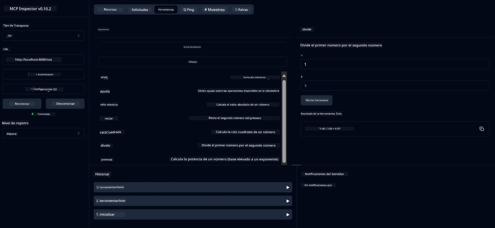

# Servicio MCP de Calculadora Básica

> [!NOTE]
> Esta solución en Java utiliza el transporte heredado HTTP+SSE y está dirigida a un SDK
> compatible con MCP `2025-11-25`. Se mantiene para coincidir con el código del curso;
> los nuevos servidores remotos deberían usar el soporte HTTP Streamable `2026-07-28`.

Este servicio proporciona operaciones básicas de calculadora a través del Protocolo de Contexto de Modelo (MCP) utilizando Spring Boot con transporte WebFlux. Está diseñado como un ejemplo simple para principiantes que aprenden sobre implementaciones MCP.

Para más información, consulte la documentación de referencia [MCP Server Boot Starter](https://docs.spring.io/spring-ai/reference/api/mcp/mcp-server-boot-starter-docs.html).


## Uso del Servicio

El servicio expone los siguientes puntos finales de API a través del protocolo MCP:

- `add(a, b)`: Sumar dos números
- `subtract(a, b)`: Restar el segundo número del primero
- `multiply(a, b)`: Multiplicar dos números
- `divide(a, b)`: Dividir el primer número por el segundo (con verificación de cero)
- `power(base, exponent)`: Calcular la potencia de un número
- `squareRoot(number)`: Calcular la raíz cuadrada (con verificación de número negativo)
- `modulus(a, b)`: Calcular el resto al dividir
- `absolute(number)`: Calcular el valor absoluto

## Dependencias

El proyecto requiere las siguientes dependencias clave:

```xml
<dependency>
    <groupId>org.springframework.ai</groupId>
    <artifactId>spring-ai-starter-mcp-server-webflux</artifactId>
</dependency>
```

## Construcción del Proyecto

Construya el proyecto usando Maven:
```bash
./mvnw clean install -DskipTests
```

## Ejecución del Servidor

### Usando Java

```bash
java -jar target/calculator-server-0.0.1-SNAPSHOT.jar
```

### Usando MCP Inspector

MCP Inspector es una herramienta útil para interactuar con servicios MCP. Para usarlo con este servicio de calculadora:

1. **Instale y ejecute MCP Inspector** en una nueva ventana de terminal:
   ```bash
   npx @modelcontextprotocol/inspector
   ```

2. **Acceda a la interfaz web** haciendo clic en la URL que muestra la aplicación (normalmente http://localhost:6274)

3. **Configure la conexión**:
   - Establezca el tipo de transporte a "SSE"
   - Establezca la URL al endpoint SSE del servidor en ejecución: `http://localhost:8080/sse`
   - Haga clic en "Conectar"

4. **Use las herramientas**:
   - Haga clic en "List Tools" para ver las operaciones de calculadora disponibles
   - Seleccione una herramienta y haga clic en "Run Tool" para ejecutar una operación



---

<!-- CO-OP TRANSLATOR DISCLAIMER START -->
**Descargo de responsabilidad**:
Este documento ha sido traducido utilizando el servicio de traducción automática [Co-op Translator](https://github.com/Azure/co-op-translator). Aunque nos esforzamos por la precisión, tenga en cuenta que las traducciones automatizadas pueden contener errores o inexactitudes. El documento original en su idioma nativo debe considerarse la fuente autorizada. Para información crítica, se recomienda una traducción profesional humana. No somos responsables de cualquier malentendido o interpretación errónea que surja del uso de esta traducción.
<!-- CO-OP TRANSLATOR DISCLAIMER END -->