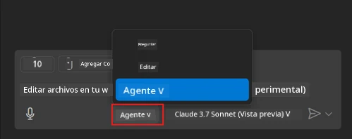
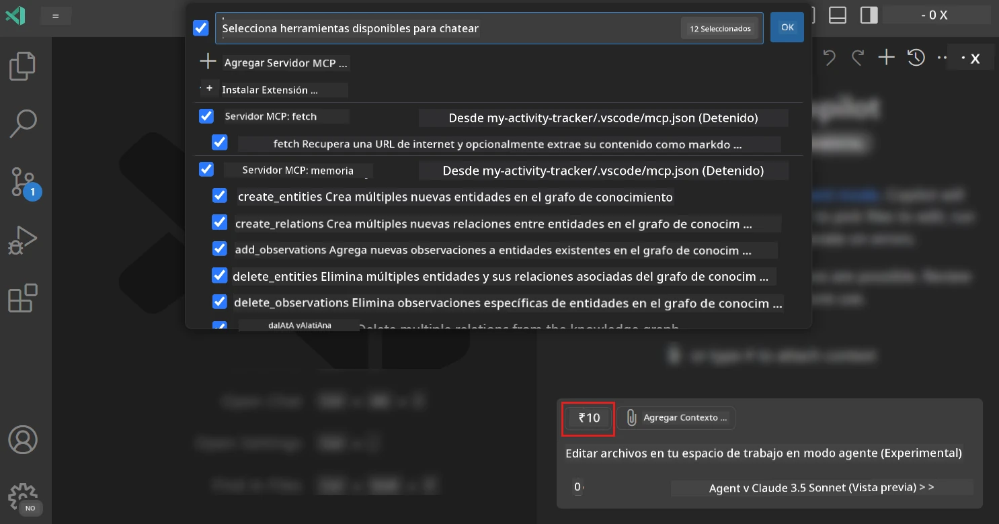
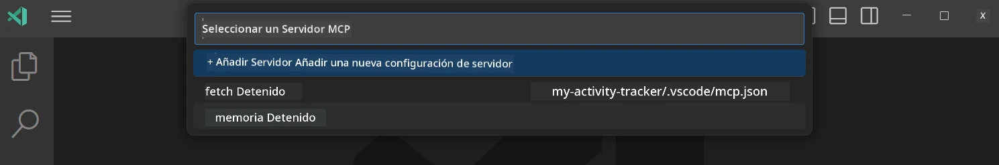
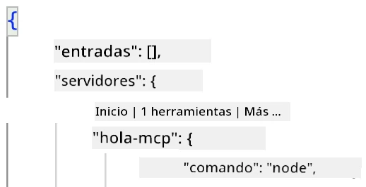
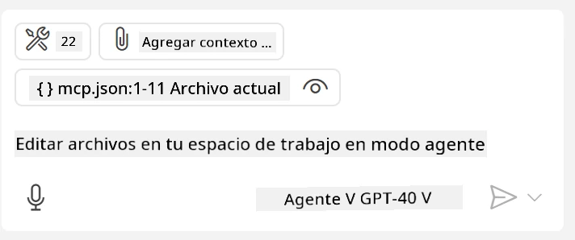
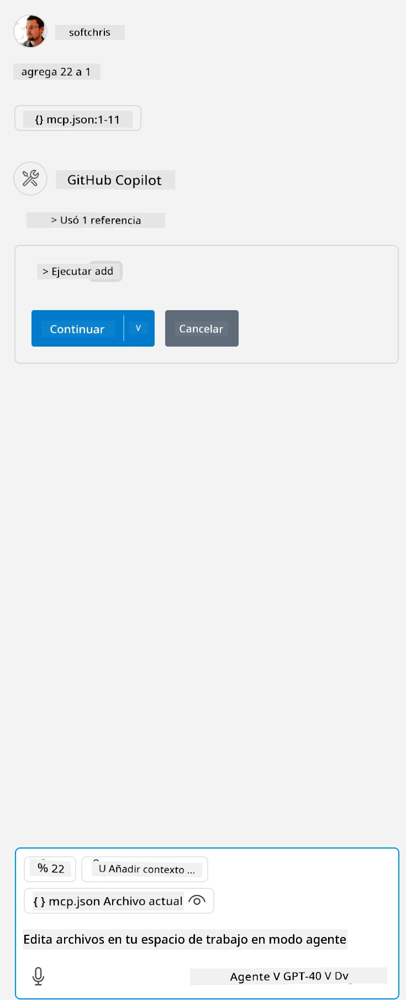

# Consumiendo un servidor desde el modo Agente de GitHub Copilot

Visual Studio Code y GitHub Copilot pueden actuar como clientes y consumir un Servidor MCP. ¿Por qué querríamos hacer eso, te preguntarás? Bueno, eso significa que cualquier función que tenga el Servidor MCP ahora puede usarse desde dentro de tu IDE. Imagina que agregas, por ejemplo, el servidor MCP de GitHub, esto permitiría controlar GitHub mediante indicaciones en lugar de escribir comandos específicos en la terminal. O imagina cualquier cosa en general que pueda mejorar tu experiencia como desarrollador todo controlado por lenguaje natural. Ahora ya empiezas a ver la ventaja, ¿verdad?

## Resumen

Esta lección cubre cómo usar Visual Studio Code y el modo Agente de GitHub Copilot como cliente para tu Servidor MCP.

## Objetivos de Aprendizaje

Al final de esta lección, podrás:

- Consumir un Servidor MCP a través de Visual Studio Code.
- Ejecutar capacidades como herramientas a través de GitHub Copilot.
- Configurar Visual Studio Code para encontrar y administrar tu Servidor MCP.

## Uso

Puedes controlar tu servidor MCP de dos maneras diferentes:

- Interfaz de usuario, verás cómo se hace más adelante en este capítulo.
- Terminal, es posible controlar cosas desde la terminal usando el ejecutable `code`:

  Para agregar un servidor MCP a tu perfil de usuario, usa la opción de línea de comando --add-mcp, y proporciona la configuración del servidor en JSON en la forma {\"name\":\"server-name\",\"command\":...}.

  ```
  code --add-mcp "{\"name\":\"my-server\",\"command\": \"uvx\",\"args\": [\"mcp-server-fetch\"]}"
  ```

### Capturas de pantalla





Hablemos más sobre cómo usamos la interfaz visual en las siguientes secciones.

## Enfoque

Así es como debemos abordar esto a alto nivel:

- Configurar un archivo para encontrar nuestro Servidor MCP.
- Iniciar/Conectarse a dicho servidor para que liste sus capacidades.
- Usar dichas capacidades a través de la interfaz de GitHub Copilot Chat.

Genial, ahora que entendemos el flujo, intentemos usar un Servidor MCP a través de Visual Studio Code mediante un ejercicio.

## Ejercicio: Consumiendo un servidor

En este ejercicio, configuraremos Visual Studio Code para encontrar tu servidor MCP para que pueda usarse desde la interfaz GitHub Copilot Chat.

### -0- Paso previo, habilitar el descubrimiento del Servidor MCP

Es posible que necesites habilitar el descubrimiento de Servidores MCP.

1. Ve a `Archivo -> Preferencias -> Configuración` en Visual Studio Code.

1. Busca "MCP" y habilita `chat.mcp.discovery.enabled` en el archivo settings.json.

### -1- Crear archivo de configuración

Comienza creando un archivo de configuración en la raíz de tu proyecto, necesitarás un archivo llamado MCP.json y colocarlo en una carpeta llamada .vscode. Debería verse así:

```text
.vscode
|-- mcp.json
```

A continuación, veamos cómo podemos agregar una entrada de servidor.

### -2- Configurar un servidor

Añade el siguiente contenido a *mcp.json*:

```json
{
    "inputs": [],
    "servers": {
       "hello-mcp": {
           "command": "node",
           "args": [
               "build/index.js"
           ]
       }
    }
}
```

Aquí hay un ejemplo simple arriba de cómo iniciar un servidor escrito en Node.js, para otros entornos apunta el comando correcto para iniciar el servidor usando `command` y `args`.

### -3- Iniciar el servidor

Ahora que has añadido una entrada, vamos a iniciar el servidor:

1. Localiza tu entrada en *mcp.json* y asegúrate de encontrar el ícono de "play":

    

1. Haz clic en el ícono de "play", deberías ver que el ícono de herramientas en GitHub Copilot Chat aumenta el número de herramientas disponibles. Si haces clic en dicho ícono de herramientas, verás una lista de herramientas registradas. Puedes marcar/desmarcar cada herramienta dependiendo si quieres que GitHub Copilot las use como contexto:

  

1. Para ejecutar una herramienta, escribe una indicación que sepas que coincidirá con la descripción de una de tus herramientas, por ejemplo una indicación como "añadir 22 a 1":

  

  Deberías ver una respuesta diciendo 23.

## Tarea

Intenta añadir una entrada de servidor en tu archivo *mcp.json* y asegúrate de que puedes iniciar/detener el servidor. Asegúrate también de poder comunicarte con las herramientas en tu servidor a través de la interfaz GitHub Copilot Chat.

## Solución

[Solución](./solution/README.md)

## Puntos clave

Los puntos clave de este capítulo son los siguientes:

- Visual Studio Code es un gran cliente que te permite consumir varios Servidores MCP y sus herramientas.
- La interfaz GitHub Copilot Chat es cómo interactúas con los servidores.
- Puedes solicitar al usuario entradas como claves de API que se pueden pasar al Servidor MCP al configurar la entrada del servidor en el archivo *mcp.json*.

## Ejemplos

- [Calculadora Java](../samples/java/calculator/README.md)
- [Calculadora .Net](../../../../03-GettingStarted/samples/csharp)
- [Calculadora JavaScript](../samples/javascript/README.md)
- [Calculadora TypeScript](../samples/typescript/README.md)
- [Calculadora Python](../../../../03-GettingStarted/samples/python)

## Recursos adicionales

- [Documentación de Visual Studio](https://code.visualstudio.com/docs/copilot/chat/mcp-servers)

## Qué sigue

- Siguiente: [Creando un servidor stdio](../05-stdio-server/README.md)

---

<!-- CO-OP TRANSLATOR DISCLAIMER START -->
**Descargo de responsabilidad**:
Este documento ha sido traducido utilizando el servicio de traducción automática [Co-op Translator](https://github.com/Azure/co-op-translator). Aunque nos esforzamos por la precisión, tenga en cuenta que las traducciones automatizadas pueden contener errores o inexactitudes. El documento original en su idioma nativo debe considerarse la fuente autorizada. Para información crítica, se recomienda una traducción profesional humana. No somos responsables de cualquier malentendido o interpretación errónea que surja del uso de esta traducción.
<!-- CO-OP TRANSLATOR DISCLAIMER END -->