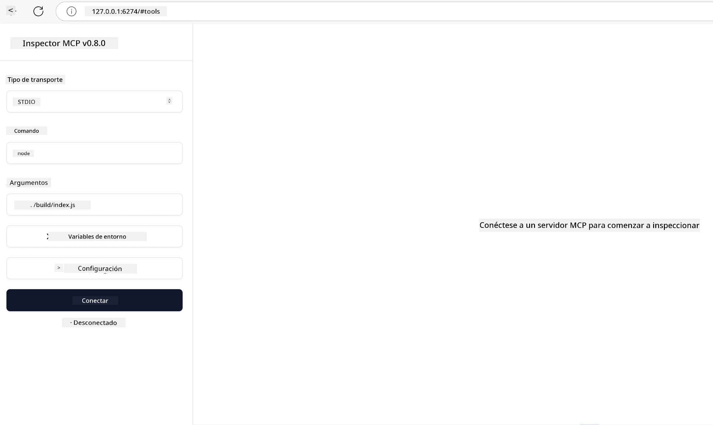

## Pruebas y Depuración

Antes de comenzar a probar tu servidor MCP, es importante entender las herramientas disponibles y las mejores prácticas para la depuración. Las pruebas efectivas aseguran que tu servidor se comporte como se espera y te ayudan a identificar y resolver problemas rápidamente. La siguiente sección describe los enfoques recomendados para validar tu implementación MCP.

## Resumen

Esta lección cubre cómo seleccionar el enfoque de prueba adecuado y la herramienta de prueba más efectiva.

## Objetivos de aprendizaje

Al final de esta lección, podrás:

- Describir varios enfoques para realizar pruebas.
- Usar diferentes herramientas para probar eficazmente tu código.


## Pruebas de servidores MCP

MCP proporciona herramientas para ayudarte a probar y depurar tus servidores:

- **MCP Inspector**: Una herramienta de línea de comandos que se puede ejecutar tanto como herramienta CLI como visual.
- **Pruebas manuales**: Puedes usar una herramienta como curl para realizar solicitudes web, pero cualquier herramienta capaz de ejecutar HTTP funcionará.
- **Pruebas unitarias**: Es posible usar tu framework de pruebas preferido para probar las funciones tanto del servidor como del cliente.

### Uso de MCP Inspector

Hemos descrito el uso de esta herramienta en lecciones previas, pero hablemos un poco a nivel general. Es una herramienta creada en Node.js y puedes usarla llamando al ejecutable `npx` que descargará e instalará temporalmente la herramienta y se limpiará una vez termine de ejecutar tu solicitud.

El [MCP Inspector](https://github.com/modelcontextprotocol/inspector) te ayuda a:

- **Descubrir Capacidades del Servidor**: Detectar automáticamente recursos, herramientas y prompts disponibles
- **Probar la Ejecución de Herramientas**: Probar diferentes parámetros y ver respuestas en tiempo real
- **Ver Metadatos del Servidor**: Examinar información del servidor, esquemas y configuraciones

Una ejecución típica de la herramienta se ve así:

```bash
npx @modelcontextprotocol/inspector node build/index.js
```

El comando anterior inicia un MCP y su interfaz visual y lanza una interfaz web local en tu navegador. Puedes esperar ver un tablero que muestra tus servidores MCP registrados, sus herramientas, recursos y prompts disponibles. La interfaz te permite probar de manera interactiva la ejecución de herramientas, inspeccionar metadatos del servidor y ver respuestas en tiempo real, facilitando la validación y depuración de tus implementaciones de servidor MCP.

Así es como puede verse: 

También puedes ejecutar esta herramienta en modo CLI, para lo cual agregas el atributo `--cli`. Aquí tienes un ejemplo de ejecutar la herramienta en modo "CLI" que lista todas las herramientas en el servidor:

```sh
npx @modelcontextprotocol/inspector --cli node build/index.js --method tools/list
```

### Pruebas Manuales

Aparte de ejecutar la herramienta inspector para probar las capacidades del servidor, otro enfoque similar es usar un cliente capaz de usar HTTP como por ejemplo curl.

Con curl, puedes probar directamente servidores MCP usando solicitudes HTTP:

```bash
# Ejemplo: Metadatos del servidor de prueba
curl http://localhost:3000/v1/metadata

# Ejemplo: Ejecutar una herramienta
curl -X POST http://localhost:3000/v1/tools/execute \
  -H "Content-Type: application/json" \
  -d '{"name": "calculator", "parameters": {"expression": "2+2"}}'
```

Como puedes ver en el uso anterior de curl, usas una solicitud POST para invocar una herramienta usando una carga útil que consiste en el nombre de la herramienta y sus parámetros. Usa el enfoque que mejor se adapte a ti. Las herramientas CLI en general tienden a ser más rápidas de usar y se prestan para ser automatizadas, lo cual puede ser útil en un entorno CI/CD.

### Pruebas Unitarias

Crea pruebas unitarias para tus herramientas y recursos para asegurarte de que funcionan como se espera. Aquí hay un ejemplo de código de prueba.

```python
import pytest

from mcp.server.fastmcp import FastMCP
from mcp.shared.memory import (
    create_connected_server_and_client_session as create_session,
)

# Marcar todo el módulo para pruebas asíncronas
pytestmark = pytest.mark.anyio


async def test_list_tools_cursor_parameter():
    """Test that the cursor parameter is accepted for list_tools.

    Note: FastMCP doesn't currently implement pagination, so this test
    only verifies that the cursor parameter is accepted by the client.
    """

 server = FastMCP("test")

    # Crear un par de herramientas de prueba
    @server.tool(name="test_tool_1")
    async def test_tool_1() -> str:
        """First test tool"""
        return "Result 1"

    @server.tool(name="test_tool_2")
    async def test_tool_2() -> str:
        """Second test tool"""
        return "Result 2"

    async with create_session(server._mcp_server) as client_session:
        # Probar sin el parámetro cursor (omitido)
        result1 = await client_session.list_tools()
        assert len(result1.tools) == 2

        # Probar con cursor=None
        result2 = await client_session.list_tools(cursor=None)
        assert len(result2.tools) == 2

        # Probar con cursor como cadena
        result3 = await client_session.list_tools(cursor="some_cursor_value")
        assert len(result3.tools) == 2

        # Probar con cursor de cadena vacía
        result4 = await client_session.list_tools(cursor="")
        assert len(result4.tools) == 2
    
```

El código anterior hace lo siguiente:

- Aprovecha el framework pytest que te permite crear pruebas como funciones y usar declaraciones assert.
- Crea un servidor MCP con dos herramientas diferentes.
- Usa la declaración `assert` para verificar que se cumplan ciertas condiciones.

Revisa el [archivo completo aquí](https://github.com/modelcontextprotocol/python-sdk/blob/main/tests/client/test_list_methods_cursor.py)

Con el archivo anterior, puedes probar tu propio servidor para asegurarte de que las capacidades se crean como deberían.

Todos los SDK principales tienen secciones de prueba similares para que puedas ajustarlas a tu runtime elegido.

## Ejemplos 

- [Calculadora Java](../samples/java/calculator/README.md)
- [Calculadora .Net](../../../../03-GettingStarted/samples/csharp)
- [Calculadora JavaScript](../samples/javascript/README.md)
- [Calculadora TypeScript](../samples/typescript/README.md)
- [Calculadora Python](../../../../03-GettingStarted/samples/python) 

## Recursos Adicionales

- [SDK de Python](https://github.com/modelcontextprotocol/python-sdk)

## Qué Sigue

- Siguiente: [Despliegue](../09-deployment/README.md)

---

<!-- CO-OP TRANSLATOR DISCLAIMER START -->
**Descargo de responsabilidad**:
Este documento ha sido traducido utilizando el servicio de traducción automática [Co-op Translator](https://github.com/Azure/co-op-translator). Aunque nos esforzamos por la precisión, tenga en cuenta que las traducciones automatizadas pueden contener errores o inexactitudes. El documento original en su idioma nativo debe considerarse la fuente autorizada. Para información crítica, se recomienda una traducción profesional humana. No somos responsables de cualquier malentendido o interpretación errónea que surja del uso de esta traducción.
<!-- CO-OP TRANSLATOR DISCLAIMER END -->