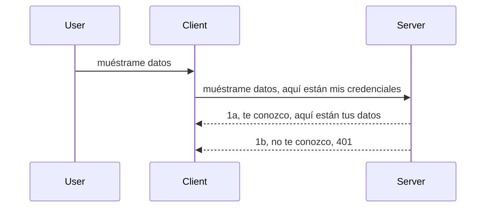

# Autenticación simple

Los SDK de MCP admiten el uso de OAuth 2.1 que, para ser justos, es un proceso bastante complejo que involucra conceptos como servidor de autenticación, servidor de recursos, envío de credenciales, obtención de un código, intercambio del código por un token portador hasta que finalmente puede obtener sus datos de recursos. Si no está acostumbrado a OAuth, que es algo genial para implementar, es buena idea comenzar con un nivel básico de autenticación y avanzar hacia una mejor y mejor seguridad. Por eso existe este capítulo, para llevarlo hacia una autenticación más avanzada.

## Autenticación, ¿a qué nos referimos?

Auth es la abreviatura de autenticación y autorización. La idea es que necesitamos hacer dos cosas:

- **Autenticación**, que es el proceso de determinar si dejamos que una persona entre a nuestra casa, que tiene el derecho de estar "aquí", es decir, tener acceso a nuestro servidor de recursos donde residen las funciones de nuestro servidor MCP.
- **Autorización**, es el proceso de descubrir si un usuario debe tener acceso a estos recursos específicos que está pidiendo, por ejemplo, estos pedidos o estos productos, o si solo se le permite leer el contenido pero no eliminarlo, como otro ejemplo.

## Credenciales: cómo le decimos al sistema quiénes somos

Bueno, la mayoría de los desarrolladores web piensan en términos de proporcionar una credencial al servidor, usualmente un secreto que dice si tienen permitido estar aquí, "Autenticación". Esta credencial usualmente es una versión codificada en base64 de nombre de usuario y contraseña o una clave API que identifica de manera única a un usuario específico.

Esto implica enviarla vía un encabezado llamado "Authorization" así:

```json
{ "Authorization": "secret123" }
```

Esto generalmente se conoce como autenticación básica. Cómo funciona el flujo general es de la siguiente manera:


Ahora que entendemos cómo funciona desde el punto de vista del flujo, ¿cómo lo implementamos? Bueno, la mayoría de los servidores web tienen un concepto llamado middleware, un fragmento de código que se ejecuta como parte de la solicitud y puede verificar las credenciales, y si las credenciales son válidas, puede dejar pasar la solicitud. Si la solicitud no tiene credenciales válidas, se recibe un error de autenticación. Veamos cómo puede implementarse esto:

**Python**

```python
class AuthMiddleware(BaseHTTPMiddleware):
    async def dispatch(self, request, call_next):

        has_header = request.headers.get("Authorization")
        if not has_header:
            print("-> Missing Authorization header!")
            return Response(status_code=401, content="Unauthorized")

        if not valid_token(has_header):
            print("-> Invalid token!")
            return Response(status_code=403, content="Forbidden")

        print("Valid token, proceeding...")
       
        response = await call_next(request)
        # agregue cualquier encabezado personalizado o cambie la respuesta de alguna manera
        return response


starlette_app.add_middleware(CustomHeaderMiddleware)
```

Aquí tenemos:

- Creado un middleware llamado `AuthMiddleware` cuya función `dispatch` es invocada por el servidor web.
- Añadido el middleware al servidor web:

    ```python
    starlette_app.add_middleware(AuthMiddleware)
    ```

- Escrito lógica de validación que verifica si el encabezado Authorization está presente y si el secreto enviado es válido:

    ```python
    has_header = request.headers.get("Authorization")
    if not has_header:
        print("-> Missing Authorization header!")
        return Response(status_code=401, content="Unauthorized")

    if not valid_token(has_header):
        print("-> Invalid token!")
        return Response(status_code=403, content="Forbidden")
    ```

    si el secreto está presente y es válido, entonces dejamos pasar la solicitud llamando a `call_next` y retornamos la respuesta.

    ```python
    response = await call_next(request)
    # agrega cualquier encabezado personalizado o cambia la respuesta de alguna manera
    return response
    ```

Cómo funciona es que si se realiza una solicitud web hacia el servidor, el middleware será invocado y dada su implementación, o dejará pasar la solicitud o terminará devolviendo un error que indica que el cliente no tiene permiso para continuar.

**TypeScript**

Aquí creamos un middleware con el popular framework Express e interceptamos la solicitud antes de que llegue al servidor MCP. Aquí está el código para eso:

```typescript
function isValid(secret) {
    return secret === "secret123";
}

app.use((req, res, next) => {
    // 1. ¿Encabezado de autorización presente?
    if(!req.headers["Authorization"]) {
        res.status(401).send('Unauthorized');
    }
    
    let token = req.headers["Authorization"];

    // 2. Verificar validez.
    if(!isValid(token)) {
        res.status(403).send('Forbidden');
    }

   
    console.log('Middleware executed');
    // 3. Pasa la solicitud al siguiente paso en el flujo de solicitudes.
    next();
});
```

En este código:

1. Comprobamos si el encabezado Authorization está presente; si no, enviamos un error 401.
2. Verificamos que la credencial/token sea válido, si no, enviamos un error 403.
3. Finalmente continúa la solicitud en el pipeline y retorna el recurso solicitado.

## Ejercicio: Implementar autenticación

Tomemos nuestro conocimiento y tratemos de implementarlo. Este es el plan:

Servidor

- Crear un servidor web e instancia MCP.
- Implementar un middleware para el servidor.

Cliente

- Enviar solicitud web con credencial vía encabezado.

### -1- Crear un servidor web e instancia MCP

En nuestro primer paso, necesitamos crear la instancia del servidor web y el servidor MCP.

**Python**

Aquí creamos una instancia del servidor MCP, creamos una aplicación web starlette y la alojamos con uvicorn.

```python
# creando servidor MCP

app = FastMCP(
    name="MCP Resource Server",
    instructions="Resource Server that validates tokens via Authorization Server introspection",
    host=settings["host"],
    port=settings["port"],
    debug=True
)

# creando aplicación web starlette
starlette_app = app.streamable_http_app()

# sirviendo la aplicación vía uvicorn
async def run(starlette_app):
    import uvicorn
    config = uvicorn.Config(
            starlette_app,
            host=app.settings.host,
            port=app.settings.port,
            log_level=app.settings.log_level.lower(),
        )
    server = uvicorn.Server(config)
    await server.serve()

run(starlette_app)
```

En este código:

- Creamos el servidor MCP.
- Construimos la aplicación web starlette desde el servidor MCP, `app.streamable_http_app()`.
- Alojamose y servimos la aplicación web usando uvicorn `server.serve()`.

**TypeScript**

Aquí creamos una instancia del servidor MCP.

```typescript
const server = new McpServer({
      name: "example-server",
      version: "1.0.0"
    });

    // ... configurar recursos del servidor, herramientas y mensajes ...
```

Esta creación del servidor MCP será necesaria dentro de la definición de ruta POST /mcp, así que tomemos el código de arriba y movámoslo así:

```typescript
import express from "express";
import { randomUUID } from "node:crypto";
import { McpServer } from "@modelcontextprotocol/sdk/server/mcp.js";
import { StreamableHTTPServerTransport } from "@modelcontextprotocol/sdk/server/streamableHttp.js";
import { isInitializeRequest } from "@modelcontextprotocol/sdk/types.js"

const app = express();
app.use(express.json());

// Mapa para almacenar transportes por ID de sesión
const transports: { [sessionId: string]: StreamableHTTPServerTransport } = {};

// Manejar solicitudes POST para comunicación cliente-servidor
app.post('/mcp', async (req, res) => {
  // Verificar si existe un ID de sesión
  const sessionId = req.headers['mcp-session-id'] as string | undefined;
  let transport: StreamableHTTPServerTransport;

  if (sessionId && transports[sessionId]) {
    // Reutilizar el transporte existente
    transport = transports[sessionId];
  } else if (!sessionId && isInitializeRequest(req.body)) {
    // Nueva solicitud de inicialización
    transport = new StreamableHTTPServerTransport({
      sessionIdGenerator: () => randomUUID(),
      onsessioninitialized: (sessionId) => {
        // Almacenar el transporte por ID de sesión
        transports[sessionId] = transport;
      },
      // La protección contra rebinding DNS está deshabilitada por defecto para compatibilidad hacia atrás. Si estás ejecutando este servidor
      // localmente, asegúrate de configurar:
      // enableDnsRebindingProtection: true,
      // allowedHosts: ['127.0.0.1'],
    });

    // Limpiar el transporte cuando se cierre
    transport.onclose = () => {
      if (transport.sessionId) {
        delete transports[transport.sessionId];
      }
    };
    const server = new McpServer({
      name: "example-server",
      version: "1.0.0"
    });

    // ... configurar recursos del servidor, herramientas y solicitudes ...

    // Conectar al servidor MCP
    await server.connect(transport);
  } else {
    // Solicitud inválida
    res.status(400).json({
      jsonrpc: '2.0',
      error: {
        code: -32000,
        message: 'Bad Request: No valid session ID provided',
      },
      id: null,
    });
    return;
  }

  // Manejar la solicitud
  await transport.handleRequest(req, res, req.body);
});

// Manejador reutilizable para solicitudes GET y DELETE
const handleSessionRequest = async (req: express.Request, res: express.Response) => {
  const sessionId = req.headers['mcp-session-id'] as string | undefined;
  if (!sessionId || !transports[sessionId]) {
    res.status(400).send('Invalid or missing session ID');
    return;
  }
  
  const transport = transports[sessionId];
  await transport.handleRequest(req, res);
};

// Manejar solicitudes GET para notificaciones de servidor a cliente vía SSE
app.get('/mcp', handleSessionRequest);

// Manejar solicitudes DELETE para terminación de sesión
app.delete('/mcp', handleSessionRequest);

app.listen(3000);
```

Ahora ve cómo la creación del servidor MCP fue movida dentro de `app.post("/mcp")`.

Pasemos al siguiente paso de crear el middleware para poder validar la credencial entrante.

### -2- Implementar un middleware para el servidor

Pasemos a la parte del middleware. Aquí crearemos un middleware que busque una credencial en el encabezado `Authorization` y la valide. Si es aceptable, entonces la solicitud continuará para hacer lo que necesite (por ejemplo, listar herramientas, leer un recurso o cualquier funcionalidad MCP que el cliente solicitó).

**Python**

Para crear el middleware, necesitamos crear una clase que herede de `BaseHTTPMiddleware`. Hay dos partes interesantes:

- La solicitud `request`, de la cual leemos la información del encabezado.
- `call_next` es la función callback que necesitamos invocar si el cliente trae una credencial que aceptamos.

Primero, necesitamos manejar el caso si falta el encabezado `Authorization`:

```python
has_header = request.headers.get("Authorization")

# no hay encabezado presente, falla con 401, de lo contrario continúa.
if not has_header:
    print("-> Missing Authorization header!")
    return Response(status_code=401, content="Unauthorized")
```

Aquí enviamos un mensaje de 401 no autorizado porque el cliente está fallando la autenticación.

A continuación, si se envió una credencial, necesitamos verificar su validez así:

```python
 if not valid_token(has_header):
    print("-> Invalid token!")
    return Response(status_code=403, content="Forbidden")
```

Note cómo enviamos un mensaje 403 prohibido arriba. Veamos el middleware completo que implementa todo lo mencionado:

```python
class AuthMiddleware(BaseHTTPMiddleware):
    async def dispatch(self, request, call_next):

        has_header = request.headers.get("Authorization")
        if not has_header:
            print("-> Missing Authorization header!")
            return Response(status_code=401, content="Unauthorized")

        if not valid_token(has_header):
            print("-> Invalid token!")
            return Response(status_code=403, content="Forbidden")

        print("Valid token, proceeding...")
        print(f"-> Received {request.method} {request.url}")
        response = await call_next(request)
        response.headers['Custom'] = 'Example'
        return response

```

Genial, ¿pero qué hay de la función `valid_token`? Aquí está a continuación:

```python
# NO usar para producción - ¡mejorarlo!
def valid_token(token: str) -> bool:
    # eliminar el prefijo "Bearer "
    if token.startswith("Bearer "):
        token = token[7:]
        return token == "secret-token"
    return False
```

Obviamente esto debería mejorar.

IMPORTANTE: Nunca debería tener secretos así en el código. Idealmente, debería obtener el valor para comparar de una fuente de datos o de un IDP (proveedor de identidad) o mejor aún, deje que el IDP haga la validación.

**TypeScript**

Para implementar esto con Express, necesitamos llamar al método `use` que toma funciones middleware.

Necesitamos:

- Interactuar con la variable request para verificar la credencial pasada en la propiedad `Authorization`.
- Validar la credencial, y si es válida, dejar que la solicitud continúe y que la solicitud MCP del cliente haga lo que deba (por ejemplo, listar herramientas, leer recurso o cualquier cosa relacionada con MCP).

Aquí verificamos si el encabezado `Authorization` está presente y, si no, detenemos la solicitud:

```typescript
if(!req.headers["authorization"]) {
    res.status(401).send('Unauthorized');
    return;
}
```

Si el encabezado no se envía en primer lugar, recibe un 401.

Después, comprobamos si la credencial es válida; si no, nuevamente detenemos la solicitud pero con un mensaje ligeramente diferente:

```typescript
if(!isValid(token)) {
    res.status(403).send('Forbidden');
    return;
} 
```

Note cómo ahora recibe un error 403.

Aquí está el código completo:

```typescript
app.use((req, res, next) => {
    console.log('Request received:', req.method, req.url, req.headers);
    console.log('Headers:', req.headers["authorization"]);
    if(!req.headers["authorization"]) {
        res.status(401).send('Unauthorized');
        return;
    }
    
    let token = req.headers["authorization"];

    if(!isValid(token)) {
        res.status(403).send('Forbidden');
        return;
    }  

    console.log('Middleware executed');
    next();
});
```

Hemos configurado el servidor web para aceptar un middleware para verificar la credencial que el cliente espera enviarnos. ¿Y el cliente mismo?

### -3- Enviar solicitud web con credencial vía encabezado

Necesitamos asegurarnos que el cliente está pasando la credencial a través del encabezado. Como vamos a usar un cliente MCP para ello, necesitamos averiguar cómo se hace esto.

**Python**

Para el cliente, necesitamos pasar un encabezado con nuestra credencial así:

```python
# NO codifiques el valor de forma fija, al menos tenlo en una variable de entorno o un almacenamiento más seguro
token = "secret-token"

async with streamablehttp_client(
        url = f"http://localhost:{port}/mcp",
        headers = {"Authorization": f"Bearer {token}"}
    ) as (
        read_stream,
        write_stream,
        session_callback,
    ):
        async with ClientSession(
            read_stream,
            write_stream
        ) as session:
            await session.initialize()
      
            # TODO, lo que quieres que se haga en el cliente, p.ej. listar herramientas, llamar a herramientas, etc.
```

Note cómo poblamos la propiedad `headers` así: ` headers = {"Authorization": f"Bearer {token}"}`.

**TypeScript**

Podemos resolver esto en dos pasos:

1. Poblamos un objeto de configuración con nuestra credencial.
2. Pasamos ese objeto de configuración al transporte.

```typescript

// NO codifiques el valor directamente como se muestra aquí. Como mínimo, tenlo como una variable de entorno y usa algo como dotenv (en modo desarrollo).
let token = "secret123"

// define un objeto de opciones de transporte para el cliente
let options: StreamableHTTPClientTransportOptions = {
  sessionId: sessionId,
  requestInit: {
    headers: {
      "Authorization": "secret123"
    }
  }
};

// pasa el objeto de opciones al transporte
async function main() {
   const transport = new StreamableHTTPClientTransport(
      new URL(serverUrl),
      options
   );
```

Aquí ve arriba cómo tuvimos que crear un objeto `options` y colocar nuestros encabezados bajo la propiedad `requestInit`.

IMPORTANTE: ¿Cómo mejoramos esto a partir de aquí? Bueno, la implementación actual tiene algunos problemas. Primero, pasar una credencial así es bastante riesgoso a menos que al menos tenga HTTPS. Aun así, la credencial puede ser robada, por lo que necesita un sistema donde pueda revocar fácilmente el token y agregar verificaciones adicionales como desde dónde en el mundo viene, si la solicitud ocurre con demasiada frecuencia (comportamiento tipo bot), en fin, hay muchas preocupaciones.

Debemos decir, sin embargo, que para APIs muy simples donde no desea que cualquiera llame a su API sin autenticarse, lo que tenemos aquí es un buen comienzo.

Dicho esto, intentemos reforzar la seguridad un poco usando un formato estandarizado como JSON Web Token, también conocidos como JWT o tokens "JOT".

## JSON Web Tokens, JWT

Entonces, estamos intentando mejorar la forma de enviar credenciales muy simples. ¿Cuáles son las mejoras inmediatas que obtenemos al adoptar JWT?

- **Mejoras en seguridad**. En la autenticación básica, envía el nombre de usuario y contraseña como un token codificado en base64 (o envía una clave API) una y otra vez, lo que incrementa el riesgo. Con JWT, envía su nombre de usuario y contraseña y recibe un token a cambio que también está limitado en tiempo, es decir, expirará. JWT le permite usar un control de acceso detallado usando roles, ámbitos y permisos.
- **Ausencia de estado y escalabilidad**. Los JWT son autónomos, llevan toda la información del usuario y eliminan la necesidad de almacenar sesiones en el servidor. El token también puede validarse localmente.
- **Interoperabilidad y federación**. Los JWT son el centro de Open ID Connect y se usan con proveedores de identidad conocidos como Entra ID, Google Identity y Auth0. También permiten usar inicio de sesión único y mucho más, haciéndolos de nivel empresarial.
- **Modularidad y flexibilidad**. Los JWT también pueden usarse con gateways API como Azure API Management, NGINX y más. También soportan escenarios de autenticación de usuario y comunicación servidor-a-servicio, incluyendo impersonación y delegación.
- **Rendimiento y caché**. Los JWT pueden ser almacenados en caché luego de decodificarse, lo que reduce la necesidad de analizar. Esto ayuda especialmente en aplicaciones de alto tráfico ya que mejora el rendimiento y reduce la carga en su infraestructura seleccionada.
- **Funciones avanzadas**. También soporta introspección (verificar validez en servidor) y revocación (hacer un token inválido).

Con todos estos beneficios, veamos cómo podemos llevar nuestra implementación al siguiente nivel.

## Convertir autenticación básica en JWT

Entonces, los cambios que necesitamos realizar a alto nivel son:

- **Aprender a construir un token JWT** y dejarlo listo para ser enviado desde cliente al servidor.
- **Validar un token JWT**, y si es válido, dejar que el cliente acceda a nuestros recursos.
- **Almacenamiento seguro del token**. Cómo almacenamos este token.
- **Proteger las rutas**. Necesitamos proteger las rutas, en nuestro caso, proteger rutas y funciones específicas del MCP.
- **Agregar tokens de actualización**. Asegurar que creamos tokens de corta duración pero tokens de actualización de larga duración que pueden usarse para obtener nuevos tokens si expiran. Además garantizar que haya un endpoint de actualización y una estrategia de rotación.

### -1- Construir un token JWT

Primero, un token JWT tiene las siguientes partes:

- **encabezado**, algoritmo utilizado y tipo de token.
- **payload**, claims, como sub (el usuario o entidad que el token representa. En un escenario de autenticación esto normalmente es el id de usuario), exp (cuando expira), role (el rol).
- **firma**, firmada con un secreto o clave privada.

Para esto, necesitaremos construir el encabezado, el payload y el token codificado.

**Python**

```python

import jwt
import jwt
from jwt.exceptions import ExpiredSignatureError, InvalidTokenError
import datetime

# Clave secreta utilizada para firmar el JWT
secret_key = 'your-secret-key'

header = {
    "alg": "HS256",
    "typ": "JWT"
}

# la información del usuario, sus reclamaciones y tiempo de expiración
payload = {
    "sub": "1234567890",               # Sujeto (ID del usuario)
    "name": "User Userson",                # Reclamación personalizada
    "admin": True,                     # Reclamación personalizada
    "iat": datetime.datetime.utcnow(),# Emitido en
    "exp": datetime.datetime.utcnow() + datetime.timedelta(hours=1)  # Expiración
}

# codificarlo
encoded_jwt = jwt.encode(payload, secret_key, algorithm="HS256", headers=header)
```

En el código de arriba hemos:

- Definido un encabezado usando HS256 como algoritmo y tipo JWT.
- Construido un payload que contiene un sujeto o id de usuario, un nombre de usuario, un rol, cuándo fue emitido y cuándo expirará, implementando así el aspecto de limite de tiempo que mencionamos anteriormente.

**TypeScript**

Aquí necesitaremos algunas dependencias que nos ayudarán a construir el token JWT.

Dependencias

```sh

npm install jsonwebtoken
npm install --save-dev @types/jsonwebtoken
```

Ahora que tenemos eso, creemos el encabezado, payload y a través de ello generar el token codificado.

```typescript
import jwt from 'jsonwebtoken';

const secretKey = 'your-secret-key'; // Usar variables de entorno en producción

// Definir la carga útil
const payload = {
  sub: '1234567890',
  name: 'User usersson',
  admin: true,
  iat: Math.floor(Date.now() / 1000), // Emitido en
  exp: Math.floor(Date.now() / 1000) + 60 * 60 // Expira en 1 hora
};

// Definir el encabezado (opcional, jsonwebtoken establece valores predeterminados)
const header = {
  alg: 'HS256',
  typ: 'JWT'
};

// Crear el token
const token = jwt.sign(payload, secretKey, {
  algorithm: 'HS256',
  header: header
});

console.log('JWT:', token);
```

Este token está:

Firmado usando HS256
Válido por 1 hora
Incluye claims como sub, name, admin, iat y exp.

### -2- Validar un token

También necesitaremos validar un token, esto es algo que debemos hacer en el servidor para asegurar que lo que el cliente nos envía es válido. Hay muchas verificaciones que deberíamos hacer aquí, desde validar su estructura hasta su validez. También se recomienda agregar otras verificaciones para ver si el usuario está en su sistema y más.

Para validar un token, necesitamos decodificarlo para poder leerlo y luego comenzar a verificar su validez:

**Python**

```python

# Decodificar y verificar el JWT
try:
    decoded = jwt.decode(token, secret_key, algorithms=["HS256"])
    print("✅ Token is valid.")
    print("Decoded claims:")
    for key, value in decoded.items():
        print(f"  {key}: {value}")
except ExpiredSignatureError:
    print("❌ Token has expired.")
except InvalidTokenError as e:
    print(f"❌ Invalid token: {e}")

```

En este código llamamos a `jwt.decode` usando el token, la clave secreta y el algoritmo elegido como entrada. Fíjese cómo usamos una construcción try-catch ya que una validación fallida genera un error.

**TypeScript**

Aquí necesitamos llamar a `jwt.verify` para obtener una versión decodificada del token que podemos analizar más a fondo. Si esta llamada falla, eso significa que la estructura del token es incorrecta o ya no es válida.

```typescript

try {
  const decoded = jwt.verify(token, secretKey);
  console.log('Decoded Payload:', decoded);
} catch (err) {
  console.error('Token verification failed:', err);
}
```

NOTA: como se mencionó antes, deberíamos realizar verificaciones adicionales para asegurarnos que este token apunta a un usuario en nuestro sistema y que el usuario tenga los derechos que afirma tener.

A continuación, veamos el control de acceso basado en roles, también conocido como RBAC.
## Añadiendo control de acceso basado en roles

La idea es que queremos expresar que diferentes roles tienen permisos distintos. Por ejemplo, asumimos que un administrador puede hacer todo, que un usuario normal puede leer/escribir y que un invitado sólo puede leer. Por lo tanto, aquí hay algunos posibles niveles de permiso:

- Admin.Write  
- User.Read  
- Guest.Read  

Veamos cómo podemos implementar tal control con middleware. Los middlewares pueden añadirse por ruta así como para todas las rutas.

**Python**

```python
from starlette.middleware.base import BaseHTTPMiddleware
from starlette.responses import JSONResponse
import jwt

# NO tengas el secreto en el código, esto es solo para propósitos de demostración. Léealo desde un lugar seguro.
SECRET_KEY = "your-secret-key" # pon esto en una variable de entorno
REQUIRED_PERMISSION = "User.Read"

class JWTPermissionMiddleware(BaseHTTPMiddleware):
    async def dispatch(self, request, call_next):
        auth_header = request.headers.get("Authorization")
        if not auth_header or not auth_header.startswith("Bearer "):
            return JSONResponse({"error": "Missing or invalid Authorization header"}, status_code=401)

        token = auth_header.split(" ")[1]
        try:
            decoded = jwt.decode(token, SECRET_KEY, algorithms=["HS256"])
        except jwt.ExpiredSignatureError:
            return JSONResponse({"error": "Token expired"}, status_code=401)
        except jwt.InvalidTokenError:
            return JSONResponse({"error": "Invalid token"}, status_code=401)

        permissions = decoded.get("permissions", [])
        if REQUIRED_PERMISSION not in permissions:
            return JSONResponse({"error": "Permission denied"}, status_code=403)

        request.state.user = decoded
        return await call_next(request)


```
  
Hay algunas formas diferentes de añadir el middleware como se muestra a continuación:

```python

# Alternativa 1: agregar middleware mientras se construye la aplicación starlette
middleware = [
    Middleware(JWTPermissionMiddleware)
]

app = Starlette(routes=routes, middleware=middleware)

# Alternativa 2: agregar middleware después de que la aplicación starlette ya esté construida
starlette_app.add_middleware(JWTPermissionMiddleware)

# Alternativa 3: agregar middleware por ruta
routes = [
    Route(
        "/mcp",
        endpoint=..., # manejador
        middleware=[Middleware(JWTPermissionMiddleware)]
    )
]
```
  
**TypeScript**

Podemos usar `app.use` y un middleware que se ejecutará para todas las solicitudes.

```typescript
app.use((req, res, next) => {
    console.log('Request received:', req.method, req.url, req.headers);
    console.log('Headers:', req.headers["authorization"]);

    // 1. Verificar si se ha enviado el encabezado de autorización

    if(!req.headers["authorization"]) {
        res.status(401).send('Unauthorized');
        return;
    }
    
    let token = req.headers["authorization"];

    // 2. Verificar si el token es válido
    if(!isValid(token)) {
        res.status(403).send('Forbidden');
        return;
    }  

    // 3. Verificar si el usuario del token existe en nuestro sistema
    if(!isExistingUser(token)) {
        res.status(403).send('Forbidden');
        console.log("User does not exist");
        return;
    }
    console.log("User exists");

    // 4. Verificar que el token tenga los permisos correctos
    if(!hasScopes(token, ["User.Read"])){
        res.status(403).send('Forbidden - insufficient scopes');
    }

    console.log("User has required scopes");

    console.log('Middleware executed');
    next();
});

```
  
Hay bastantes cosas que podemos dejar que nuestro middleware haga y que nuestro middleware DEBE hacer, a saber:

1. Verificar si el encabezado de autorización está presente  
2. Verificar si el token es válido, llamamos a `isValid`, que es un método que escribimos para comprobar la integridad y validez del token JWT.  
3. Verificar que el usuario exista en nuestro sistema, deberíamos comprobar esto.

   ```typescript
    // usuarios en DB
   const users = [
     "user1",
     "User usersson",
   ]

   function isExistingUser(token) {
     let decodedToken = verifyToken(token);

     // TODO, verificar si el usuario existe en DB
     return users.includes(decodedToken?.name || "");
   }
   ```
  
   Arriba, hemos creado una lista muy sencilla de `users`, que obviamente debería estar en una base de datos.  

4. Además, también deberíamos comprobar que el token tiene los permisos correctos.

   ```typescript
   if(!hasScopes(token, ["User.Read"])){
        res.status(403).send('Forbidden - insufficient scopes');
   }
   ```
  
   En este código arriba del middleware, comprobamos que el token contiene el permiso User.Read, si no, enviamos un error 403. A continuación está el método auxiliar `hasScopes`.

   ```typescript
   function hasScopes(scope: string, requiredScopes: string[]) {
     let decodedToken = verifyToken(scope);
    return requiredScopes.every(scope => decodedToken?.scopes.includes(scope));
  }  
   ```

Have a think which additional checks you should be doing, but these are the absolute minimum of checks you should be doing.

Using Express as a web framework is a common choice. There are helpers library when you use JWT so you can write less code.

- `express-jwt`, helper library that provides a middleware that helps decode your token.
- `express-jwt-permissions`, this provides a middleware `guard` that helps check if a certain permission is on the token.

Here's what these libraries can look like when used:

```typescript
const express = require('express');
const jwt = require('express-jwt');
const guard = require('express-jwt-permissions')();

const app = express();
const secretKey = 'your-secret-key'; // put this in env variable

// Decode JWT and attach to req.user
app.use(jwt({ secret: secretKey, algorithms: ['HS256'] }));

// Check for User.Read permission
app.use(guard.check('User.Read'));

// multiple permissions
// app.use(guard.check(['User.Read', 'Admin.Access']));

app.get('/protected', (req, res) => {
  res.json({ message: `Welcome ${req.user.name}` });
});

// Error handler
app.use((err, req, res, next) => {
  if (err.code === 'permission_denied') {
    return res.status(403).send('Forbidden');
  }
  next(err);
});

```
  
Ahora que has visto cómo se puede usar middleware tanto para autenticación como para autorización, ¿qué pasa con MCP?, ¿cambia la forma en que hacemos auth? Descubrámoslo en la siguiente sección.

### -3- Añadir RBAC a MCP

Has visto hasta ahora cómo puedes añadir RBAC mediante middleware; sin embargo, para MCP no hay una forma sencilla de añadir un RBAC por característica de MCP, ¿qué hacemos entonces? Bueno, simplemente tenemos que añadir código como este que verifica en este caso si el cliente tiene los derechos para llamar a una herramienta específica:

Tienes varias formas diferentes de lograr un RBAC por característica, aquí algunas:

- Añadir una verificación para cada herramienta, recurso o prompt donde necesites comprobar el nivel de permiso.

   **python**

   ```python
   @tool()
   def delete_product(id: int):
      try:
          check_permissions(role="Admin.Write", request)
      catch:
        pass # el cliente falló la autorización, provocar error de autorización
   ```
  
   **typescript**

   ```typescript
   server.registerTool(
    "delete-product",
    {
      title: Delete a product",
      description: "Deletes a product",
      inputSchema: { id: z.number() }
    },
    async ({ id }) => {
      
      try {
        checkPermissions("Admin.Write", request);
        // todo, enviar id a productService y entrada remota
      } catch(Exception e) {
        console.log("Authorization error, you're not allowed");  
      }

      return {
        content: [{ type: "text", text: `Deletected product with id ${id}` }]
      };
    }
   );
   ```
  

- Usar un enfoque avanzado de servidor y los manejadores de solicitudes para minimizar los lugares donde debes hacer la verificación.

   **Python**

   ```python
   
   tool_permission = {
      "create_product": ["User.Write", "Admin.Write"],
      "delete_product": ["Admin.Write"]
   }

   def has_permission(user_permissions, required_permissions) -> bool:
      # user_permissions: lista de permisos que tiene el usuario
      # required_permissions: lista de permisos requeridos para la herramienta
      return any(perm in user_permissions for perm in required_permissions)

   @server.call_tool()
   async def handle_call_tool(
     name: str, arguments: dict[str, str] | None
   ) -> list[types.TextContent]:
    # Asumir que request.user.permissions es una lista de permisos para el usuario
     user_permissions = request.user.permissions
     required_permissions = tool_permission.get(name, [])
     if not has_permission(user_permissions, required_permissions):
        # Generar error "No tienes permiso para llamar a la herramienta {name}"
        raise Exception(f"You don't have permission to call tool {name}")
     # continuar y llamar a la herramienta
     # ...
   ```   
    

   **TypeScript**

   ```typescript
   function hasPermission(userPermissions: string[], requiredPermissions: string[]): boolean {
       if (!Array.isArray(userPermissions) || !Array.isArray(requiredPermissions)) return false;
       // Devuelve verdadero si el usuario tiene al menos un permiso requerido
       
       return requiredPermissions.some(perm => userPermissions.includes(perm));
   }
  
   server.setRequestHandler(CallToolRequestSchema, async (request) => {
      const { params: { name } } = request;
  
      let permissions = request.user.permissions;
  
      if (!hasPermission(permissions, toolPermissions[name])) {
         return new Error(`You don't have permission to call ${name}`);
      }
  
      // continúa..
   });
   ```
  
   Nota, deberás asegurarte de que tu middleware asigna un token decodificado a la propiedad user de la solicitud para que el código anterior sea sencillo.

### Resumen

Ahora que hemos discutido cómo añadir soporte para RBAC en general y para MCP en particular, es momento de intentar implementar seguridad por tu cuenta para asegurar que has entendido los conceptos presentados.

## Tarea 1: Construir un servidor MCP y un cliente MCP usando autenticación básica

Aquí tomarás lo que has aprendido en términos de enviar credenciales a través de encabezados.

## Solución 1

[Solución 1](./code/basic/README.md)

## Tarea 2: Mejorar la solución de la Tarea 1 para usar JWT

Toma la primera solución pero esta vez, mejoremos sobre ella.

En lugar de usar Basic Auth, usemos JWT.

## Solución 2

[Solución 2](./solution/jwt-solution/README.md)

## Desafío

Añade RBAC por herramienta como describimos en la sección "Añadir RBAC a MCP".

## Resumen

Esperamos que hayas aprendido mucho en este capítulo, desde no tener seguridad alguna, hasta seguridad básica, pasando por JWT y cómo puede añadirse a MCP.

Hemos construido una base sólida con JWT personalizados, pero a medida que escalamos, nos estamos moviendo hacia un modelo de identidad basado en estándares. Adoptar un IdP como Entra o Keycloak nos permite descargar la emisión, validación y gestión del ciclo de vida de tokens a una plataforma confiable — liberándonos para enfocarnos en la lógica de la aplicación y la experiencia del usuario.

Para eso, tenemos un capítulo más [avanzado sobre Entra](../../05-AdvancedTopics/mcp-security-entra/README.md)

## Qué sigue

- Siguiente: [Configurando Hosts MCP](../12-mcp-hosts/README.md)

---

<!-- CO-OP TRANSLATOR DISCLAIMER START -->
**Aviso Legal**:  
Este documento ha sido traducido utilizando el servicio de traducción automática [Co-op Translator](https://github.com/Azure/co-op-translator). Aunque nos esforzamos por mantener la precisión, tenga en cuenta que las traducciones automáticas pueden contener errores o inexactitudes. El documento original en su idioma nativo debe considerarse la fuente autorizada. Para información crítica, se recomienda una traducción profesional realizada por humanos. No nos hacemos responsables por ningún malentendido o interpretación errónea derivada del uso de esta traducción.
<!-- CO-OP TRANSLATOR DISCLAIMER END -->