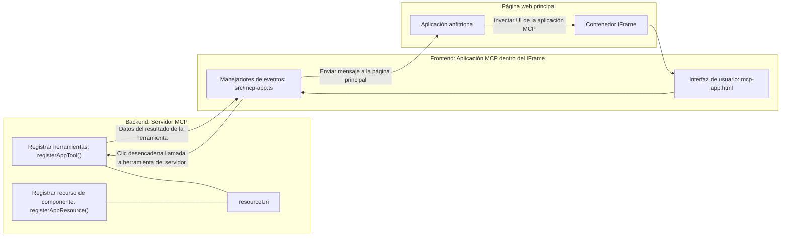
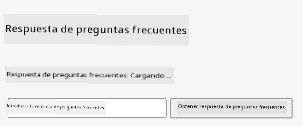
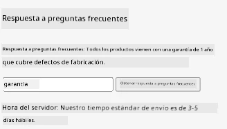
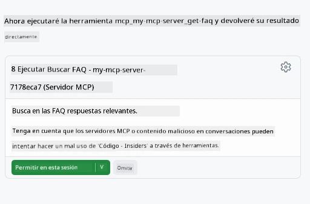

# MCP Apps

MCP Apps es un nuevo paradigma en MCP. La idea es que no solo respondes con datos desde una llamada a una herramienta, sino que también proporcionas información sobre cómo se debe interactuar con esta información. Eso significa que los resultados de las herramientas ahora pueden contener información de UI. ¿Por qué querríamos eso? Bueno, considera cómo haces las cosas hoy. Probablemente estés consumiendo los resultados de un MCP Server colocando algún tipo de frontend delante de él, ese es código que necesitas escribir y mantener. A veces eso es lo que quieres, pero a veces sería genial si pudieras simplemente traer un fragmento de información que sea autónomo y tenga todo, desde los datos hasta la interfaz de usuario.

## Visión General

Esta lección proporciona una guía práctica sobre MCP Apps, cómo comenzar con ellas y cómo integrarlas en tus aplicaciones web existentes. MCP Apps es una incorporación muy nueva al estándar MCP.

## Objetivos de Aprendizaje

Al final de esta lección, serás capaz de:

- Explicar qué son MCP Apps.
- Cuándo usar MCP Apps.
- Construir e integrar tus propias MCP Apps.

## MCP Apps - cómo funciona

La idea con MCP Apps es proporcionar una respuesta que esencialmente es un componente que se renderiza. Dicho componente puede tener tanto elementos visuales como interactividad, por ejemplo clics de botones, entrada de usuario y más. Comencemos con el lado del servidor y nuestro MCP Server. Para crear un componente MCP App necesitas crear una herramienta pero también el recurso de la aplicación. Estas dos partes están conectadas por un resourceUri.

Aquí hay un ejemplo. Tratemos de visualizar qué se involucra y qué parte hace qué:

```text
server.ts -- responsible for registering tools and the component as a UI component
src/
  mcp-app.ts -- wiring up event handlers
mcp-app.html -- the user interface
```

Este visual describe la arquitectura para crear un componente y su lógica.


Intentemos describir las responsabilidades a continuación para backend y frontend respectivamente.

### El backend

Hay dos cosas que necesitamos lograr aquí:

- Registrar las herramientas con las que queremos interactuar.
- Definir el componente.

**Registrar la herramienta**

```typescript
registerAppTool(
    server,
    "get-time",
    {
      title: "Get Time",
      description: "Returns the current server time.",
      inputSchema: {},
      _meta: { ui: { resourceUri } }, // Vincula esta herramienta a su recurso de interfaz de usuario
    },
    async () => {
      const time = new Date().toISOString();
      return { content: [{ type: "text", text: time }] };
    },
  );

```

El código anterior describe el comportamiento, donde expone una herramienta llamada `get-time`. No toma entradas pero termina produciendo la hora actual. Tenemos la capacidad de definir un `inputSchema` para herramientas donde necesitamos poder aceptar entrada del usuario.

**Registrar el componente**

En el mismo archivo, también necesitamos registrar el componente:

```typescript
const resourceUri = "ui://get-time/mcp-app.html";

// Registrar el recurso, que devuelve el HTML/JavaScript empaquetado para la interfaz de usuario.
registerAppResource(
  server,
  resourceUri,
  resourceUri,
  { mimeType: RESOURCE_MIME_TYPE },
  async () => {
    const html = await fs.readFile(path.join(DIST_DIR, "mcp-app.html"), "utf-8");

    return {
    contents: [
        { uri: resourceUri, mimeType: RESOURCE_MIME_TYPE, text: html },
    ],
    };
  },
);
```

Fíjate cómo mencionamos `resourceUri` para conectar el componente con sus herramientas. También es de interés el callback donde cargamos el archivo UI y retornamos el componente.

### El frontend del componente

Al igual que el backend, hay dos piezas aquí:

- Un frontend escrito en puro HTML.
- Código que maneja eventos y qué hacer, por ejemplo llamar herramientas o enviar mensajes a la ventana padre.

**Interfaz de usuario**

Echemos un vistazo a la interfaz de usuario.

```html
<!-- mcp-app.html -->
<!DOCTYPE html>
<html lang="en">
  <head>
    <meta charset="UTF-8" />
    <title>Get Time App</title>
  </head>
  <body>
    <p>
      <strong>Server Time:</strong> <code id="server-time">Loading...</code>
    </p>
    <button id="get-time-btn">Get Server Time</button>
    <script type="module" src="/src/mcp-app.ts"></script>
  </body>
</html>
```

**Conexión de eventos**

La última pieza es la conexión de eventos. Eso significa que identificamos qué parte en nuestra UI necesita controladores de eventos y qué hacer si se disparan eventos:

```typescript
// mcp-app.ts

import { App } from "@modelcontextprotocol/ext-apps";

// Obtener referencias de elementos
const serverTimeEl = document.getElementById("server-time")!;
const getTimeBtn = document.getElementById("get-time-btn")!;

// Crear instancia de la aplicación
const app = new App({ name: "Get Time App", version: "1.0.0" });

// Manejar resultados de herramientas desde el servidor. Configurar antes de `app.connect()` para evitar
// perder el resultado inicial de la herramienta.
app.ontoolresult = (result) => {
  const time = result.content?.find((c) => c.type === "text")?.text;
  serverTimeEl.textContent = time ?? "[ERROR]";
};

// Conectar el clic del botón
getTimeBtn.addEventListener("click", async () => {
  // `app.callServerTool()` permite que la interfaz solicite datos frescos del servidor
  const result = await app.callServerTool({ name: "get-time", arguments: {} });
  const time = result.content?.find((c) => c.type === "text")?.text;
  serverTimeEl.textContent = time ?? "[ERROR]";
});

// Conectar al host
app.connect();
```

Como puedes ver arriba, este es un código normal para conectar elementos DOM a eventos. Vale la pena destacar la llamada a `callServerTool` que termina llamando una herramienta en el backend.

## Manejo de entrada de usuario

Hasta ahora, hemos visto un componente que tiene un botón que al hacer clic llama una herramienta. Veamos si podemos agregar más elementos UI, como un campo de entrada, y ver si podemos enviar argumentos a una herramienta. Implementemos una funcionalidad de FAQ. Así es como debería funcionar:

- Debe haber un botón y un elemento input donde el usuario escriba una palabra clave para buscar, por ejemplo "Shipping". Esto debería llamar una herramienta en el backend que hace una búsqueda en los datos de FAQ.
- Una herramienta que soporte la búsqueda FAQ mencionada.

Primero añadamos el soporte necesario al backend:

```typescript
const faq: { [key: string]: string } = {
    "shipping": "Our standard shipping time is 3-5 business days.",
    "return policy": "You can return any item within 30 days of purchase.",
    "warranty": "All products come with a 1-year warranty covering manufacturing defects.",
  }

registerAppTool(
    server,
    "get-faq",
    {
      title: "Search FAQ",
      description: "Searches the FAQ for relevant answers.",
      inputSchema: zod.object({
        query: zod.string().default("shipping"),
      }),
      _meta: { ui: { resourceUri: faqResourceUri } }, // Vincula esta herramienta a su recurso de interfaz de usuario
    },
    async ({ query }) => {
      const answer: string = faq[query.toLowerCase()] || "Sorry, I don't have an answer for that.";
      return { content: [{ type: "text", text: answer }] };
    },
  );
```

Lo que vemos aquí es cómo poblamos `inputSchema` y le damos un esquema `zod` así:

```typescript
inputSchema: zod.object({
  query: zod.string().default("shipping"),
})
```

En el esquema de arriba declaramos que tenemos un parámetro de entrada llamado `query` y que es opcional con un valor por defecto de "shipping".

Ok, pasemos a *mcp-app.html* para ver qué UI necesitamos crear para esto:

```html
<div class="faq">
    <h1>FAQ response</h1>
    <p>FAQ Response: <code id="faq-response">Loading...</code></p>
    <input type="text" id="faq-query" placeholder="Enter FAQ query" />
    <button id="get-faq-btn">Get FAQ Response</button>
  </div>
```

Genial, ahora tenemos un elemento input y un botón. Pasemos a *mcp-app.ts* a continuación para conectar estos eventos:

```typescript
const getFaqBtn = document.getElementById("get-faq-btn")!;
const faqQueryInput = document.getElementById("faq-query") as HTMLInputElement;

getFaqBtn.addEventListener("click", async () => {
  const query = faqQueryInput.value;
  const result = await app.callServerTool({ name: "get-faq", arguments: { query } });
  const faq = result.content?.find((c) => c.type === "text")?.text;
  faqResponseEl.textContent = faq ?? "[ERROR]";
});
```

En el código anterior:

- Creamos referencias a los elementos UI interesantes.
- Manejamos el clic del botón para obtener el valor del elemento input y también llamamos a `app.callServerTool()` con `name` y `arguments`, donde este último pasa `query` como valor.

Lo que realmente sucede cuando llamas a `callServerTool` es que envía un mensaje a la ventana padre y esa ventana termina llamando al MCP Server.

### Pruébalo

Al probar esto deberíamos ver lo siguiente:



y aquí lo probamos con entrada como "warranty"



Para ejecutar este código, dirígete a la [sección de código](./code/README.md)

## Pruebas en Visual Studio Code

Visual Studio Code tiene un gran soporte para MVP Apps y probablemente sea una de las formas más fáciles de probar tus MCP Apps. Para usar Visual Studio Code, agrega una entrada de servidor a *mcp.json* así:

```json
"my-mcp-server-7178eca7": {
    "url": "http://localhost:3001/mcp",
    "type": "http"
  }
```

Luego inicia el servidor, deberías poder comunicarte con tu MVP App a través de la ventana de Chat siempre que tengas instalado GitHub Copilot.

activándolo mediante un prompt, por ejemplo "#get-faq":



y así como cuando lo ejecutaste en un navegador web, se renderiza de la misma manera así:


## Tarea

Crea un juego de piedra, papel o tijera. Debe consistir en lo siguiente:

UI:

- una lista desplegable con opciones
- un botón para enviar una elección
- una etiqueta mostrando quién eligió qué y quién ganó

Servidor:

- debe tener una herramienta de piedra, papel o tijera que tome "choice" como entrada. También debería renderizar una elección de la computadora y determinar el ganador

## Solución

[Solución](./assignment/README.md)

## Resumen

Aprendimos sobre este nuevo paradigma MCP Apps. Es un nuevo paradigma que permite que los MCP Servers tengan una opinión no solo sobre los datos sino también sobre cómo se deben presentar estos datos.

Además, aprendimos que estas MCP Apps se alojan dentro de un IFrame y para comunicarse con MCP Servers necesitan enviar mensajes a la aplicación web padre. Hay varias bibliotecas disponibles tanto para JavaScript puro como para React y más que hacen esta comunicación más sencilla.

## Puntos Clave

Esto es lo que aprendiste:

- MCP Apps es un nuevo estándar que puede ser útil cuando quieres enviar tanto datos como funciones de UI.
- Este tipo de aplicaciones se ejecutan en un IFrame por razones de seguridad.

## Qué Sigue

- [Capítulo 4](../../04-PracticalImplementation/README.md)

---

<!-- CO-OP TRANSLATOR DISCLAIMER START -->
**Aviso legal**:
Este documento ha sido traducido utilizando el servicio de traducción automática [Co-op Translator](https://github.com/Azure/co-op-translator). Aunque nos esforzamos por la exactitud, tenga en cuenta que las traducciones automáticas pueden contener errores o inexactitudes. El documento original en su idioma nativo debe considerarse la fuente autorizada. Para información crítica, se recomienda una traducción profesional realizada por humanos. No nos hacemos responsables por cualquier malentendido o interpretación errónea que surja del uso de esta traducción.
<!-- CO-OP TRANSLATOR DISCLAIMER END -->