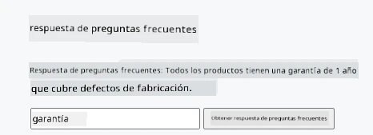
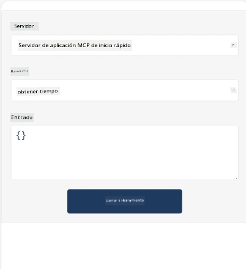
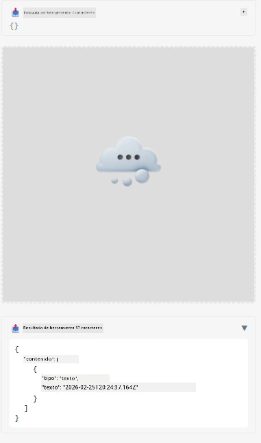

Aquí hay un ejemplo que demuestra la aplicación MCP

## Instalar

1. Navega a la carpeta *mcp-app*
1. Ejecuta `npm install`, esto debería instalar las dependencias del frontend y backend

Verifica que el backend se compile ejecutando:

```sh
npx tsc --noEmit
```

No debería haber salida si todo está bien.

## Ejecutar backend

> Esto requiere un poco de trabajo extra si estás en una máquina Windows, ya que la solución MCP Apps utiliza la biblioteca `concurrently` para ejecutarse y necesitas encontrar un reemplazo para ella. Aquí está la línea problemática en *package.json* de la MCP App:

    ```json
    "start": "concurrently \"cross-env NODE_ENV=development INPUT=mcp-app.html vite build --watch\" \"tsx watch main.ts\""
    ```

Esta aplicación tiene dos partes, una parte backend y una parte host.

Inicia el backend llamando a:

```sh
npm start
```

Esto debería iniciar el backend en `http://localhost:3001/mcp`.

> Nota, si estás en un Codespace, es posible que debas configurar la visibilidad del puerto como pública. Verifica que puedas alcanzar el endpoint en el navegador a través de https://<nombre del Codespace>.app.github.dev/mcp

## Opción -1- Prueba la aplicación en Visual Studio Code

Para probar la solución en Visual Studio Code, haz lo siguiente:

- Agrega una entrada de servidor en `mcp.json` como esta:

    ```json
    {
        "servers": {
            "my-mcp-server-7178eca7": {
                "url": "http://localhost:3001/mcp",
                "type": "http"
            }
        },
        "inputs": []
    }
    ```

1. Haz clic en el botón "start" en *mcp.json*
1. Asegúrate de tener una ventana de chat abierta y escribe `get-faq`, deberías ver un resultado como este:

    

## Opción -2- Prueba la aplicación con un host

El repositorio <https://github.com/modelcontextprotocol/ext-apps> contiene varios hosts diferentes que puedes usar para probar tus aplicaciones MVP.

Aquí te presentamos dos opciones diferentes:

### Máquina local

- Navega a *ext-apps* después de clonar el repositorio.

- Instala las dependencias

   ```sh
   npm install
   ```

- En una ventana de terminal separada, navega a *ext-apps/examples/basic-host*

    > si estás en Codespace, debes navegar a serve.ts y en la línea 27 reemplazar http://localhost:3001/mcp con la URL de tu Codespace para el backend, por ejemplo https://psychic-xylophone-657rpjgvxpc5g64-3001.app.github.dev/mcp

- Ejecuta el host:

    ```sh
    npm start
    ```

    Esto debería conectar el host con el backend y deberías ver la aplicación ejecutándose así:

    

### Codespace

Se requiere un poco de trabajo extra para que un entorno Codespace funcione. Para usar un host a través de Codespace:

- Ve al directorio *ext-apps* y navega a *examples/basic-host*.
- Ejecuta `npm install` para instalar dependencias
- Ejecuta `npm start` para iniciar el host.

## Prueba la aplicación

Prueba la aplicación de la siguiente manera:

- Selecciona el botón "Call Tool" y deberías ver los resultados como este:

    

Genial, todo está funcionando.

---

<!-- CO-OP TRANSLATOR DISCLAIMER START -->
**Descargo de responsabilidad**:
Este documento ha sido traducido utilizando el servicio de traducción automática [Co-op Translator](https://github.com/Azure/co-op-translator). Aunque nos esforzamos por lograr precisión, tenga en cuenta que las traducciones automáticas pueden contener errores o imprecisiones. El documento original en su idioma nativo debe considerarse la fuente autorizada. Para información crítica, se recomienda la traducción profesional realizada por humanos. No nos hacemos responsables por malentendidos o interpretaciones erróneas derivadas del uso de esta traducción.
<!-- CO-OP TRANSLATOR DISCLAIMER END -->