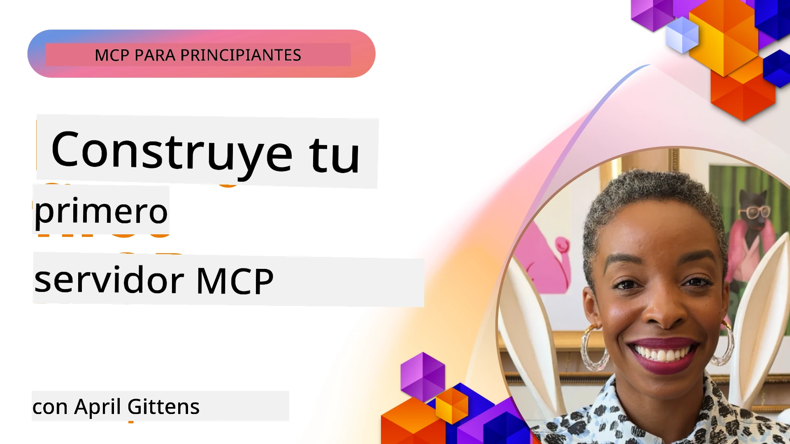

## Comenzando  

_(Haz clic en la imagen de arriba para ver el video de esta lección)_

Esta sección consta de varias lecciones:

- **1 Tu primer servidor**, en esta primera lección, aprenderás a crear tu primer servidor e inspeccionarlo con la herramienta inspector, una forma valiosa de probar y depurar tu servidor, [a la lección](01-first-server/README.md)

- **2 Cliente**, en esta lección, aprenderás a escribir un cliente que pueda conectarse a tu servidor, [a la lección](02-client/README.md)

- **3 Cliente con LLM**, una forma aún mejor de escribir un cliente es agregando un LLM para que pueda "negociar" con tu servidor qué hacer, [a la lección](03-llm-client/README.md)

- **4 Consumiendo un modo Agente GitHub Copilot para servidor en Visual Studio Code**. Aquí, veremos cómo ejecutar nuestro Servidor MCP desde Visual Studio Code, [a la lección](04-vscode/README.md)

- **5 Servidor de transporte stdio** transporte stdio es el estándar recomendado para la comunicación local del servidor MCP al cliente, proporcionando comunicación segura basada en subprocesos con aislamiento de procesos incorporado [a la lección](05-stdio-server/README.md)

- **6 Transmisión HTTP con MCP (HTTP transmisible)**. Aprende sobre el estándar
	transporte remoto en [Especificación MCP 2026-07-28](https://modelcontextprotocol.io/specification/2026-07-28/basic/transports/streamable-http),
	más la implementación heredada basada en sesiones que se conserva en la lección.
	[a la lección](06-http-streaming/README.md)

- **7 Uso del AI Toolkit para VSCode** para consumir y probar tus Clientes y Servidores MCP [a la lección](07-aitk/README.md)

- **8 Pruebas**. Aquí nos enfocaremos especialmente en cómo podemos probar nuestro servidor y cliente de diferentes maneras, [a la lección](08-testing/README.md)

- **9 Despliegue**. Este capítulo analizará diferentes formas de desplegar tus soluciones MCP, [a la lección](09-deployment/README.md)

- **10 Uso avanzado del servidor**. Este capítulo cubre el uso avanzado del servidor, [a la lección](./10-advanced/README.md)

- **11 Autenticación**. Este capítulo cubre cómo agregar autenticación simple, desde Autenticación Básica hasta el uso de JWT y RBAC. Se recomienda empezar aquí y luego ver Temas Avanzados en el Capítulo 5 y realizar un endurecimiento adicional de seguridad mediante las recomendaciones en el Capítulo 2, [a la lección](./11-simple-auth/README.md)

- **12 Hosts MCP**. Configura y usa clientes host populares de MCP incluyendo Claude Desktop, Cursor, Cline, y Windsurf. Aprende tipos de transporte y solución de problemas, [a la lección](./12-mcp-hosts/README.md)

- **13 Inspector MCP**. Depura y prueba interactivamente tus servidores MCP usando la herramienta Inspector MCP. Aprende a solucionar problemas de herramientas, recursos y mensajes del protocolo, [a la lección](./13-mcp-inspector/README.md)

- **14 Muestreo**. Aprende el primitivo heredado de Muestreo para `2025-11-25` y
	cómo migrar nuevos diseños a integración directa de proveedores LLM. Muestreo está
	obsoleto en MCP `2026-07-28`. [a la lección](./14-sampling/README.md)

- **15 Aplicaciones MCP**. Construye Servidores MCP que también respondan con instrucciones de UI, [a la lección](./15-mcp-apps/README.md)

El Protocolo de Contexto de Modelo (MCP) es un protocolo abierto que estandariza cómo las aplicaciones proporcionan contexto a los LLM. Piensa en MCP como un puerto USB-C para aplicaciones de IA: proporciona una forma estandarizada de conectar modelos AI a diferentes fuentes de datos y herramientas.

## Objetivos de aprendizaje

Al final de esta lección, podrás:

- Configurar entornos de desarrollo para MCP en C#, Java, Python, TypeScript y JavaScript
- Construir y desplegar servidores MCP básicos con características personalizadas (recursos, indicaciones y herramientas)
- Crear aplicaciones host que se conecten a servidores MCP
- Probar y depurar implementaciones MCP
- Comprender desafíos comunes de configuración y sus soluciones
- Conectar tus implementaciones MCP a servicios populares de LLM

## Configurando tu entorno MCP

Antes de comenzar a trabajar con MCP, es importante preparar tu entorno de desarrollo y entender el flujo de trabajo básico. Esta sección te guiará a través de los pasos iniciales para asegurar un comienzo fluido con MCP.

### Requisitos previos

Antes de sumergirte en el desarrollo con MCP, asegúrate de tener:

- **Entorno de desarrollo**: Para el lenguaje elegido (C#, Java, Python, TypeScript o JavaScript)
- **IDE/Editor**: Visual Studio, Visual Studio Code, IntelliJ, Eclipse, PyCharm o cualquier editor de código moderno
- **Gestores de paquetes**: NuGet, Maven/Gradle, pip o npm/yarn
- **Claves de API**: Para cualquier servicio de IA que planees usar en tus aplicaciones host

### SDKs oficiales

En los próximos capítulos verás soluciones construidas usando Python, TypeScript,
Java y .NET. Aquí están los SDKs oficiales.

El soporte para MCP `2026-07-28` se implementa independientemente por lenguaje.
Antes de ejecutar un ejemplo, verifica su versión de paquete y las notas de lanzamiento
del SDK para revisiones del protocolo soportadas. Consulta la
[lista oficial de SDK](https://modelcontextprotocol.io/docs/sdk):
- [SDK C#](https://github.com/modelcontextprotocol/csharp-sdk) - Mantenido en colaboración con Microsoft
- [SDK Java](https://github.com/modelcontextprotocol/java-sdk) - Mantenido en colaboración con Spring AI
- [SDK TypeScript](https://github.com/modelcontextprotocol/typescript-sdk) - La implementación oficial de TypeScript
- [SDK Python](https://github.com/modelcontextprotocol/python-sdk) - La implementación oficial de Python (FastMCP)
- [SDK Kotlin](https://github.com/modelcontextprotocol/kotlin-sdk) - La implementación oficial de Kotlin
- [SDK Swift](https://github.com/modelcontextprotocol/swift-sdk) - Mantenido en colaboración con Loopwork AI
- [SDK Rust](https://github.com/modelcontextprotocol/rust-sdk) - La implementación oficial de Rust
- [SDK Go](https://github.com/modelcontextprotocol/go-sdk) - La implementación oficial de Go

## Conclusiones clave

- Configurar un entorno de desarrollo MCP es sencillo con SDKs específicos para cada lenguaje
- Construir servidores MCP implica crear y registrar herramientas con esquemas claros
- Los clientes MCP se conectan a servidores y modelos para aprovechar capacidades extendidas
- Las pruebas y depuraciones son esenciales para implementaciones MCP confiables
- Las opciones de despliegue van desde desarrollo local hasta soluciones en la nube

## Práctica

Tenemos un conjunto de ejemplos que complementan los ejercicios que verás en todos los capítulos de esta sección. Además, cada capítulo también tiene sus propios ejercicios y tareas

- [Calculadora Java](./samples/java/calculator/README.md)
- [Calculadora .NET](../../../03-GettingStarted/samples/csharp)
- [Calculadora JavaScript](./samples/javascript/README.md)
- [Calculadora TypeScript](./samples/typescript/README.md)
- [Calculadora Python](../../../03-GettingStarted/samples/python)

## Recursos adicionales

- [Construye agentes usando el Protocolo de Contexto de Modelo en Azure](https://learn.microsoft.com/azure/developer/ai/intro-agents-mcp)
- [MCP remoto con Azure Container Apps (Node.js/TypeScript/JavaScript)](https://learn.microsoft.com/samples/azure-samples/mcp-container-ts/mcp-container-ts/)
- [Agente MCP OpenAI para .NET](https://learn.microsoft.com/samples/azure-samples/openai-mcp-agent-dotnet/openai-mcp-agent-dotnet/)

## Qué sigue

Comienza con la primera lección: [Creando tu primer Servidor MCP](01-first-server/README.md)

Una vez que hayas completado este módulo, continúa con: [Módulo 4: Implementación práctica](../04-PracticalImplementation/README.md)

---

<!-- CO-OP TRANSLATOR DISCLAIMER START -->
**Descargo de responsabilidad**:
Este documento ha sido traducido utilizando el servicio de traducción automática [Co-op Translator](https://github.com/Azure/co-op-translator). Aunque nos esforzamos por la precisión, tenga en cuenta que las traducciones automatizadas pueden contener errores o inexactitudes. El documento original en su idioma nativo debe considerarse la fuente autorizada. Para información crítica, se recomienda una traducción profesional humana. No somos responsables de cualquier malentendido o interpretación errónea que surja del uso de esta traducción.
<!-- CO-OP TRANSLATOR DISCLAIMER END -->