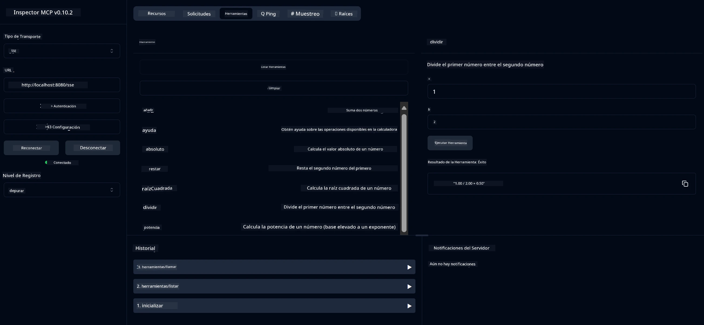

# Servicio MCP de Calculadora Básica

> [!NOTE]
> Este ejemplo utiliza el transporte heredado HTTP+SSE y está dirigido a un SDK compatible
> con MCP `2025-11-25`. Los nuevos servidores remotos deben usar soporte HTTP Streamable
> `2026-07-28`.

Este servicio proporciona operaciones básicas de calculadora a través del Protocolo de Contexto de Modelo (MCP) usando Spring Boot con transporte WebFlux. Está diseñado como un ejemplo simple para principiantes que aprenden sobre implementaciones MCP.

Para más información, consulte la documentación de referencia [MCP Server Boot Starter](https://docs.spring.io/spring-ai/reference/api/mcp/mcp-server-boot-starter-docs.html).

## Descripción General

El servicio muestra:
- Soporte para SSE (Eventos enviados por el servidor)
- Registro automático de herramientas usando la anotación `@Tool` de Spring AI
- Funciones básicas de calculadora:
  - Suma, resta, multiplicación, división
  - Cálculo de potencia y raíz cuadrada
  - Módulo (resto) y valor absoluto
  - Función de ayuda para descripciones de operaciones

## Características

Este servicio de calculadora ofrece las siguientes capacidades:

1. **Operaciones Aritméticas Básicas**:
   - Suma de dos números
   - Resta de un número por otro
   - Multiplicación de dos números
   - División de un número por otro (con comprobación de división por cero)

2. **Operaciones Avanzadas**:
   - Cálculo de potencia (elevar una base a un exponente)
   - Cálculo de raíz cuadrada (con comprobación de número negativo)
   - Cálculo de módulo (resto)
   - Cálculo de valor absoluto

3. **Sistema de Ayuda**:
   - Función integrada de ayuda que explica todas las operaciones disponibles

## Uso del Servicio

El servicio expone los siguientes endpoints API a través del protocolo MCP:

- `add(a, b)`: Sumar dos números
- `subtract(a, b)`: Restar el segundo número del primero
- `multiply(a, b)`: Multiplicar dos números
- `divide(a, b)`: Dividir el primer número por el segundo (con comprobación de cero)
- `power(base, exponent)`: Calcular la potencia de un número
- `squareRoot(number)`: Calcular la raíz cuadrada (con comprobación de número negativo)
- `modulus(a, b)`: Calcular el resto de una división
- `absolute(number)`: Calcular el valor absoluto
- `help()`: Obtener información sobre las operaciones disponibles

## Cliente de Prueba

Un cliente de prueba simple está incluido en el paquete `com.microsoft.mcp.sample.client`. La clase `SampleCalculatorClient` demuestra las operaciones disponibles del servicio de calculadora.

## Uso del Cliente LangChain4j

El proyecto incluye un cliente de ejemplo LangChain4j en `com.microsoft.mcp.sample.client.LangChain4jClient` que demuestra cómo integrar el servicio de calculadora con LangChain4j y los modelos de GitHub:

### Requisitos Previos

1. **Configuración del Token de GitHub**:
   
   Para usar los modelos AI de GitHub (como phi-4), necesitas un token de acceso personal de GitHub:

   a. Ve a la configuración de tu cuenta de GitHub: https://github.com/settings/tokens
   
   b. Haz clic en "Generate new token" → "Generate new token (classic)"
   
   c. Dale un nombre descriptivo a tu token
   
   d. Selecciona los siguientes ámbitos:
      - `repo` (Control total de repositorios privados)
      - `read:org` (Leer membresía de organización y equipos, leer proyectos de organización)
      - `gist` (Crear gists)
      - `user:email` (Acceso a direcciones de correo del usuario (solo lectura))
   
   e. Haz clic en "Generate token" y copia tu nuevo token
   
   f. Fíjalo como variable de entorno:
      
      En Windows:
      ```
      set GITHUB_TOKEN=your-github-token
      ```
      
      En macOS/Linux:
      ```bash
      export GITHUB_TOKEN=your-github-token
      ```

   g. Para configuración persistente, agrégalo a las variables de entorno mediante la configuración del sistema

2. Añade la dependencia GitHub de LangChain4j a tu proyecto (ya incluida en pom.xml):
   ```xml
   <dependency>
       <groupId>dev.langchain4j</groupId>
       <artifactId>langchain4j-github</artifactId>
       <version>${langchain4j.version}</version>
   </dependency>
   ```

3. Asegúrate de que el servidor de la calculadora esté en ejecución en `localhost:8080`

### Ejecución del Cliente LangChain4j

Este ejemplo demuestra:
- Conexión al servidor MCP de calculadora vía transporte SSE
- Uso de LangChain4j para crear un chatbot que aprovecha las operaciones de calculadora
- Integración con modelos AI de GitHub (ahora usando el modelo phi-4)

El cliente envía las siguientes consultas de ejemplo para demostrar funcionalidad:
1. Calcular la suma de dos números
2. Encontrar la raíz cuadrada de un número
3. Obtener información de ayuda sobre las operaciones disponibles de la calculadora

Ejecuta el ejemplo y revisa la salida en consola para ver cómo el modelo AI usa las herramientas de la calculadora para responder a las consultas.

### Configuración del Modelo GitHub

El cliente LangChain4j está configurado para usar el modelo phi-4 de GitHub con las siguientes configuraciones:

```java
ChatLanguageModel model = GitHubChatModel.builder()
    .apiKey(System.getenv("GITHUB_TOKEN"))
    .timeout(Duration.ofSeconds(60))
    .modelName("phi-4")
    .logRequests(true)
    .logResponses(true)
    .build();
```

Para usar otros modelos de GitHub, simplemente cambia el parámetro `modelName` a otro modelo soportado (por ejemplo, "claude-3-haiku-20240307", "llama-3-70b-8192", etc.).

## Dependencias

El proyecto requiere las siguientes dependencias clave:

```xml
<!-- For MCP Server -->
<dependency>
    <groupId>org.springframework.ai</groupId>
    <artifactId>spring-ai-starter-mcp-server-webflux</artifactId>
</dependency>

<!-- For LangChain4j integration -->
<dependency>
    <groupId>dev.langchain4j</groupId>
    <artifactId>langchain4j-mcp</artifactId>
    <version>${langchain4j.version}</version>
</dependency>

<!-- For GitHub models support -->
<dependency>
    <groupId>dev.langchain4j</groupId>
    <artifactId>langchain4j-github</artifactId>
    <version>${langchain4j.version}</version>
</dependency>
```

## Compilación del Proyecto

Compila el proyecto usando Maven:
```bash
./mvnw clean install -DskipTests
```

## Ejecución del Servidor

### Usando Java

```bash
java -jar target/calculator-server-0.0.1-SNAPSHOT.jar
```

### Usando MCP Inspector

MCP Inspector es una herramienta útil para interactuar con servicios MCP. Para usarla con este servicio de calculadora:

1. **Instala y ejecuta MCP Inspector** en una nueva ventana de terminal:
   ```bash
   npx @modelcontextprotocol/inspector
   ```

2. **Accede a la UI web** haciendo clic en la URL mostrada por la aplicación (normalmente http://localhost:6274)

3. **Configura la conexión**:
   - Establece el tipo de transporte a "SSE"
   - Establece la URL al endpoint SSE de tu servidor en ejecución: `http://localhost:8080/sse`
   - Haz clic en "Connect"

4. **Usa las herramientas**:
   - Haz clic en "List Tools" para ver las operaciones de la calculadora disponibles
   - Selecciona una herramienta y haz clic en "Run Tool" para ejecutar una operación



### Usando Docker

El proyecto incluye un Dockerfile para despliegue en contenedor:

1. **Construye la imagen Docker**:
   ```bash
   docker build -t calculator-mcp-service .
   ```

2. **Ejecuta el contenedor Docker**:
   ```bash
   docker run -p 8080:8080 calculator-mcp-service
   ```

Esto hará:
- Construir una imagen Docker de múltiples etapas con Maven 3.9.9 y Eclipse Temurin 24 JDK
- Crear una imagen de contenedor optimizada
- Exponer el servicio en el puerto 8080
- Iniciar el servicio MCP calculadora dentro del contenedor

Podrás acceder al servicio en `http://localhost:8080` una vez que el contenedor esté en ejecución.

## Solución de Problemas

### Problemas Comunes con el Token de GitHub

1. **Problemas de Permisos del Token**: Si recibes un error 403 Forbidden, verifica que tu token tenga los permisos correctos como se indica en los requisitos previos.

2. **Token No Encontrado**: Si recibes un error "No API key found", asegúrate que la variable de entorno GITHUB_TOKEN esté configurada correctamente.

3. **Limitación de Peticiones**: La API de GitHub tiene límites de tasa. Si encuentras un error de límite (código de estado 429), espera unos minutos antes de intentar de nuevo.

4. **Expiración del Token**: Los tokens de GitHub pueden expirar. Si recibes errores de autenticación después de un tiempo, genera un nuevo token y actualiza tu variable de entorno.

Si necesitas más ayuda, consulta la [documentación de LangChain4j](https://github.com/langchain4j/langchain4j) o la [documentación API de GitHub](https://docs.github.com/en/rest).

---

<!-- CO-OP TRANSLATOR DISCLAIMER START -->
**Descargo de responsabilidad**:
Este documento ha sido traducido utilizando el servicio de traducción automática [Co-op Translator](https://github.com/Azure/co-op-translator). Aunque nos esforzamos por la precisión, tenga en cuenta que las traducciones automatizadas pueden contener errores o inexactitudes. El documento original en su idioma nativo debe considerarse la fuente autorizada. Para información crítica, se recomienda una traducción profesional humana. No somos responsables de cualquier malentendido o interpretación errónea que surja del uso de esta traducción.
<!-- CO-OP TRANSLATOR DISCLAIMER END -->