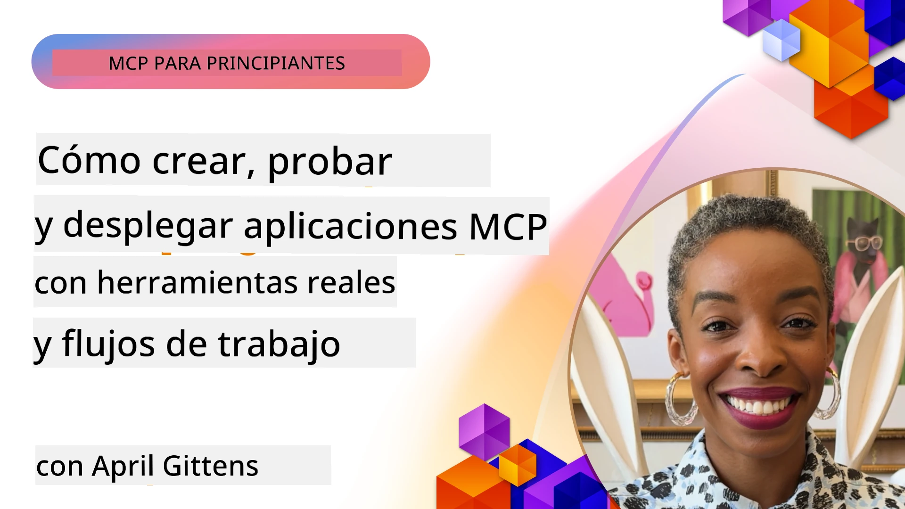
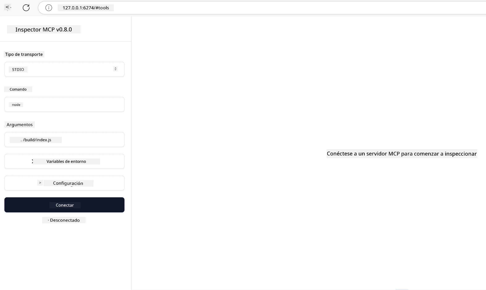

# Implementación Práctica

[](https://youtu.be/vCN9-mKBDfQ)

_(Haz clic en la imagen de arriba para ver el video de esta lección)_

La implementación práctica es donde el poder del Protocolo de Contexto de Modelo (MCP) se vuelve tangible. Aunque entender la teoría y la arquitectura detrás de MCP es importante, el valor real surge cuando aplicas estos conceptos para construir, probar y desplegar soluciones que resuelven problemas del mundo real. Este capítulo cierra la brecha entre el conocimiento conceptual y el desarrollo práctico, guiándote en el proceso de dar vida a aplicaciones basadas en MCP.

Ya sea que estés desarrollando asistentes inteligentes, integrando IA en flujos de trabajo empresariales o construyendo herramientas personalizadas para el procesamiento de datos, MCP ofrece una base flexible. Su diseño independiente del lenguaje y los SDK oficiales para lenguajes de programación populares lo hacen accesible para una amplia gama de desarrolladores. Aprovechando estos SDK, puedes prototipar, iterar y escalar tus soluciones rápidamente en diferentes plataformas y entornos.

En las siguientes secciones encontrarás ejemplos prácticos, código de muestra y estrategias de despliegue que demuestran cómo implementar MCP en C#, Java con Spring, TypeScript, JavaScript y Python. También aprenderás a depurar y probar tus servidores MCP, gestionar APIs y desplegar soluciones en la nube usando Azure. Estos recursos prácticos están diseñados para acelerar tu aprendizaje y ayudarte a construir con confianza aplicaciones MCP robustas y listas para producción.

## Resumen

Esta lección se centra en aspectos prácticos de la implementación de MCP en múltiples lenguajes de programación. Exploraremos cómo usar los SDK de MCP en C#, Java con Spring, TypeScript, JavaScript y Python para construir aplicaciones robustas, depurar y probar servidores MCP, y crear recursos, prompts y herramientas reutilizables.

## Objetivos de Aprendizaje

Al finalizar esta lección, podrás:

- Implementar soluciones MCP usando SDK oficiales en varios lenguajes de programación
- Depurar y probar servidores MCP de manera sistemática
- Crear y usar funciones del servidor (Recursos, Prompts y Herramientas)
- Diseñar flujos de trabajo MCP efectivos para tareas complejas
- Optimizar implementaciones MCP para rendimiento y confiabilidad

## Recursos Oficiales de SDK

El Protocolo de Contexto de Modelo ofrece SDK oficiales para múltiples lenguajes (alineados con la [Especificación MCP 2025-11-25](https://spec.modelcontextprotocol.io/specification/2025-11-25/)):

- [SDK C#](https://github.com/modelcontextprotocol/csharp-sdk)
- [SDK Java con Spring](https://github.com/modelcontextprotocol/java-sdk) **Nota:** requiere dependencia en [Project Reactor](https://projectreactor.io). (Ver [discusión issue 246](https://github.com/orgs/modelcontextprotocol/discussions/246).)
- [SDK TypeScript](https://github.com/modelcontextprotocol/typescript-sdk)
- [SDK Python](https://github.com/modelcontextprotocol/python-sdk)
- [SDK Kotlin](https://github.com/modelcontextprotocol/kotlin-sdk)
- [SDK Go](https://github.com/modelcontextprotocol/go-sdk)

## Trabajando con SDK MCP

Esta sección proporciona ejemplos prácticos de implementación MCP en múltiples lenguajes de programación. Puedes encontrar código de muestra en el directorio `samples` organizado por lenguaje.

### Ejemplos Disponibles

El repositorio incluye [implementaciones de muestra](../../../04-PracticalImplementation/samples) en los siguientes lenguajes:

- [C#](./samples/csharp/README.md)
- [Java con Spring](./samples/java/containerapp/README.md)
- [TypeScript](./samples/typescript/README.md)
- [JavaScript](./samples/javascript/README.md)
- [Python](./samples/python/README.md)

Cada ejemplo demuestra conceptos clave y patrones de implementación MCP para ese lenguaje y ecosistema específico.

### Guías Prácticas

Guías adicionales para implementación práctica de MCP:

- [Paginación y conjuntos de resultados grandes](./pagination/README.md) - Manejar paginación basada en cursor para herramientas, recursos y grandes conjuntos de datos

## Funciones Clave del Servidor

Los servidores MCP pueden implementar cualquier combinación de estas funciones:

### Recursos

Los recursos proporcionan contexto y datos para que el usuario o el modelo de IA los utilice:

- Repositorios de documentos
- Bases de conocimiento
- Fuentes de datos estructurados
- Sistemas de archivos

### Prompts

Los prompts son mensajes y flujos de trabajo plantillados para usuarios:

- Plantillas de conversación predefinidas
- Patrones de interacción guiados
- Estructuras de diálogo especializadas

### Herramientas

Las herramientas son funciones para que el modelo de IA ejecute:

- Utilidades de procesamiento de datos
- Integraciones con APIs externas
- Capacidades de cómputo
- Funcionalidad de búsqueda

## Implementaciones de Ejemplo: Implementación en C#

El repositorio oficial del SDK C# contiene varias implementaciones de ejemplo que demuestran diferentes aspectos de MCP:

- **Cliente MCP Básico**: Ejemplo simple que muestra cómo crear un cliente MCP y llamar a herramientas
- **Servidor MCP Básico**: Implementación mínima de servidor con registro básico de herramientas
- **Servidor MCP Avanzado**: Servidor completo con registro de herramientas, autenticación y manejo de errores
- **Integración ASP.NET**: Ejemplos que demuestran integración con ASP.NET Core
- **Patrones de Implementación de Herramientas**: Varios patrones para implementar herramientas con diferentes niveles de complejidad

El SDK MCP C# está en vista previa y las APIs pueden cambiar. Actualizaremos continuamente este blog a medida que el SDK evolucione.

### Funciones Clave

- [C# MCP Nuget ModelContextProtocol](https://www.nuget.org/packages/ModelContextProtocol)
- Construyendo tu [primer servidor MCP](https://devblogs.microsoft.com/dotnet/build-a-model-context-protocol-mcp-server-in-csharp/).

Para muestras completas de implementación en C#, visita el [repositorio oficial de muestras del SDK C#](https://github.com/modelcontextprotocol/csharp-sdk)

## Implementación de Ejemplo: Implementación en Java con Spring

El SDK de Java con Spring ofrece opciones robustas de implementación MCP con características de nivel empresarial.

### Funciones Clave

- Integración con Spring Framework
- Seguridad fuerte en tipos
- Soporte para programación reactiva
- Manejo integral de errores

Para una muestra completa de implementación en Java con Spring, consulta [muestra Java con Spring](samples/java/containerapp/README.md) en el directorio de muestras.

## Implementación de Ejemplo: Implementación en JavaScript

El SDK JavaScript provee un enfoque ligero y flexible para la implementación MCP.

### Funciones Clave

- Soporte para Node.js y navegador
- API basada en Promesas
- Fácil integración con Express y otros frameworks
- Soporte WebSocket para streaming

Para una muestra completa de implementación en JavaScript, consulta [muestra JavaScript](samples/javascript/README.md) en el directorio de muestras.

## Implementación de Ejemplo: Implementación en Python

El SDK Python ofrece un enfoque pythonico para la implementación MCP con excelentes integraciones de frameworks de ML.

### Funciones Clave

- Soporte async/await con asyncio
- Integración FastAPI
- Registro simple de herramientas
- Integración nativa con librerías populares de ML

Para una muestra completa de implementación en Python, consulta [muestra Python](samples/python/README.md) en el directorio de muestras.

## Gestión de APIs

Azure API Management es una excelente respuesta para cómo podemos asegurar servidores MCP. La idea es poner una instancia de Azure API Management frente a tu servidor MCP y dejar que maneje características que probablemente quieras, como:

- limitación de tasa
- gestión de tokens
- monitoreo
- balanceo de carga
- seguridad

### Ejemplo en Azure

Aquí tienes un ejemplo en Azure haciendo exactamente eso, es decir [creando un servidor MCP y asegurándolo con Azure API Management](https://github.com/Azure-Samples/remote-mcp-apim-functions-python).

Observa cómo ocurre el flujo de autorización en la imagen a continuación:


En la imagen anterior, sucede lo siguiente:

- La autenticación/autorización se realiza usando Microsoft Entra.
- Azure API Management actúa como pasarela y usa políticas para dirigir y gestionar el tráfico.
- Azure Monitor registra todas las solicitudes para análisis posterior.

#### Flujo de autorización

Veamos el flujo de autorización con más detalle:


#### Especificación de autorización MCP

Aprende más sobre la [especificación de Autorización MCP](https://spec.modelcontextprotocol.io/specification/2025-11-25/basic/authorization/)

## Desplegar Servidor MCP Remoto en Azure

Veamos si podemos desplegar el ejemplo que mencionamos antes:

1. Clona el repositorio

    ```bash
    git clone https://github.com/Azure-Samples/remote-mcp-apim-functions-python.git
    cd remote-mcp-apim-functions-python
    ```

1. Registra el proveedor de recursos `Microsoft.App`.

   - Si usas Azure CLI, ejecuta `az provider register --namespace Microsoft.App --wait`.
   - Si usas Azure PowerShell, ejecuta `Register-AzResourceProvider -ProviderNamespace Microsoft.App`. Luego ejecuta `(Get-AzResourceProvider -ProviderNamespace Microsoft.App).RegistrationState` después de un tiempo para verificar si el registro está completo.

1. Ejecuta este comando [azd](https://aka.ms/azd) para aprovisionar el servicio de gestión de API, la aplicación de funciones (con código) y todos los demás recursos de Azure necesarios

    ```shell
    azd up
    ```

    Este comando debería desplegar todos los recursos en la nube en Azure

### Probar tu servidor con MCP Inspector

1. En una **nueva ventana de terminal**, instala y ejecuta MCP Inspector

    ```shell
    npx @modelcontextprotocol/inspector
    ```

    Deberías ver una interfaz similar a:

    

1. CTRL clic para cargar la aplicación web MCP Inspector desde la URL que muestra la app (por ejemplo, [http://127.0.0.1:6274/#resources](http://127.0.0.1:6274/#resources))
1. Establece el tipo de transporte a `SSE`
1. Establece la URL a tu punto final SSE de API Management en ejecución mostrado después de `azd up` y **Conectar**:

    ```shell
    https://<apim-servicename-from-azd-output>.azure-api.net/mcp/sse
    ```

1. **Listar Herramientas**. Haz clic en una herramienta y **Ejecutar Herramienta**.

Si todos los pasos funcionaron, ahora deberías estar conectado al servidor MCP y haber podido llamar a una herramienta.

## Servidores MCP para Azure

[Remote-mcp-functions](https://github.com/Azure-Samples/remote-mcp-functions-dotnet): Este conjunto de repositorios es una plantilla de arranque rápido para construir y desplegar servidores remotos MCP (Protocolo de Contexto de Modelo) personalizados usando Azure Functions con Python, C# .NET o Node/TypeScript.

Las muestras proporcionan una solución completa que permite a los desarrolladores:

- Construir y ejecutar localmente: Desarrollar y depurar un servidor MCP en una máquina local
- Desplegar en Azure: Desplegar fácilmente en la nube con un simple comando azd up
- Conectar desde clientes: Conectarse al servidor MCP desde varios clientes, incluyendo el modo agente Copilot de VS Code y la herramienta MCP Inspector

### Funciones Clave

- Seguridad por diseño: El servidor MCP se asegura mediante claves y HTTPS
- Opciones de autenticación: Soporta OAuth usando autenticación incorporada y/o API Management
- Aislamiento de red: Permite aislamiento de red usando Redes Virtuales de Azure (VNET)
- Arquitectura sin servidor: Aprovecha Azure Functions para ejecución escalable y orientada a eventos
- Desarrollo local: Soporte integral para desarrollo y depuración local
- Despliegue simple: Proceso de despliegue optimizado a Azure

El repositorio incluye todos los archivos de configuración necesarios, código fuente y definiciones de infraestructura para comenzar rápidamente con una implementación MCP lista para producción.

- [Funciones SCP Remotas de Azure Python](https://github.com/Azure-Samples/remote-mcp-functions-python) - Implementación de ejemplo de MCP usando Azure Functions con Python

- [Funciones SCP Remotas de Azure .NET](https://github.com/Azure-Samples/remote-mcp-functions-dotnet) - Implementación de ejemplo de MCP usando Azure Functions con C# .NET

- [Funciones SCP Remotas de Azure Node/Typescript](https://github.com/Azure-Samples/remote-mcp-functions-typescript) - Implementación de ejemplo de MCP usando Azure Functions con Node/TypeScript.

## Puntos Clave

- Los SDK MCP proveen herramientas específicas para lenguajes para implementar soluciones MCP robustas
- El proceso de depuración y prueba es crítico para aplicaciones MCP confiables
- Las plantillas de prompt reutilizables permiten interacciones consistentes con IA
- Los flujos de trabajo bien diseñados pueden orquestar tareas complejas usando múltiples herramientas
- Implementar soluciones MCP requiere considerar seguridad, rendimiento y manejo de errores

## Ejercicio

Diseña un flujo de trabajo MCP práctico que resuelva un problema del mundo real en tu dominio:

1. Identifica 3-4 herramientas que serían útiles para resolver este problema
2. Crea un diagrama de flujo mostrando cómo estas herramientas interactúan
3. Implementa una versión básica de una de las herramientas usando tu lenguaje preferido
4. Crea una plantilla de prompt que ayude al modelo a usar eficazmente tu herramienta

## Recursos Adicionales

---

## Qué Sigue

Siguiente: [Temas Avanzados](../05-AdvancedTopics/README.md)

---

<!-- CO-OP TRANSLATOR DISCLAIMER START -->
**Aviso legal**:
Este documento ha sido traducido utilizando el servicio de traducción automática [Co-op Translator](https://github.com/Azure/co-op-translator). Aunque nos esforzamos por la exactitud, tenga en cuenta que las traducciones automáticas pueden contener errores o inexactitudes. El documento original en su idioma nativo debe considerarse la fuente autorizada. Para información crítica, se recomienda una traducción profesional realizada por humanos. No somos responsables de ningún malentendido o interpretación errónea derivada del uso de esta traducción.
<!-- CO-OP TRANSLATOR DISCLAIMER END -->