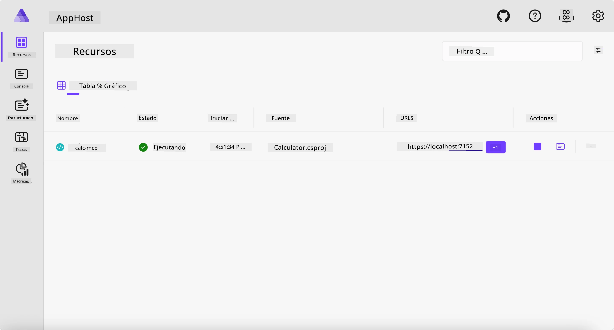
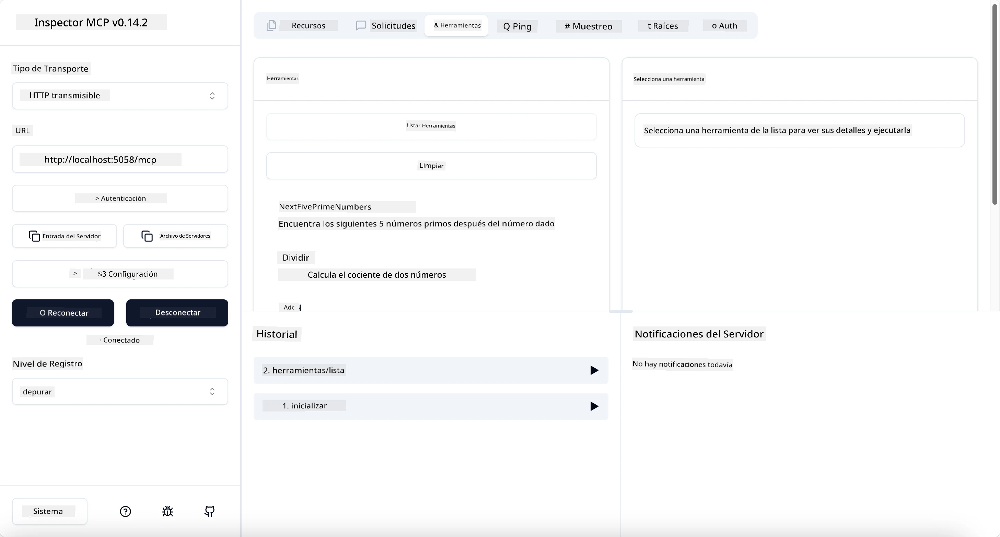
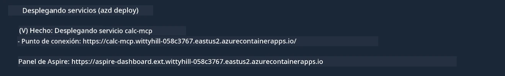

# Ejemplo

El ejemplo anterior muestra cómo usar un proyecto local de .NET con el tipo `stdio`. Y cómo ejecutar el servidor localmente en un contenedor. Esta es una buena solución en muchas situaciones. Sin embargo, puede ser útil tener el servidor ejecutándose de forma remota, como en un entorno en la nube. Aquí es donde entra el tipo `http`.

Al observar la solución en la carpeta `04-PracticalImplementation`, puede parecer mucho más compleja que la anterior. Pero en realidad, no lo es. Si miras de cerca el proyecto `src/Calculator`, verás que es básicamente el mismo código que el ejemplo anterior. La única diferencia es que estamos usando una biblioteca diferente `ModelContextProtocol.AspNetCore` para manejar las solicitudes HTTP. Y cambiamos el método `IsPrime` para hacerlo privado, solo para mostrar que puedes tener métodos privados en tu código. El resto del código es igual que antes.

Los otros proyectos son de [Aspire](https://aspire.dev/get-started/what-is-aspire/). Tener Aspire en la solución mejorará la experiencia del desarrollador durante el desarrollo y las pruebas, y ayudará con la observabilidad. No es necesario para ejecutar el servidor, pero es una buena práctica tenerlo en tu solución.

## Iniciar el servidor localmente

1. Desde VS Code (con la extensión C# DevKit), navega hasta el directorio `04-PracticalImplementation/samples/csharp`.
1. Ejecuta el siguiente comando para iniciar el servidor:

   ```bash
    dotnet watch run --project ./src/AppHost
   ```

1. Cuando un navegador web abra el panel de Aspire, observa la URL `http`. Debería ser algo como `http://localhost:5058/`.

   

## Probar Streamable HTTP con el Inspector MCP

Si tienes Node.js 22.7.5 o superior, puedes usar el Inspector MCP para probar tu servidor.

Inicia el servidor y ejecuta el siguiente comando en una terminal:

```bash
npx @modelcontextprotocol/inspector http://localhost:5058
```



- Selecciona `Streamable HTTP` como el tipo de Transporte.
- En el campo Url, ingresa la URL del servidor anotada anteriormente y añade `/mcp`. Debe ser `http` (no `https`), algo como `http://localhost:5058/mcp`.
- selecciona el botón Conectar.

Algo bueno del Inspector es que proporciona una buena visibilidad sobre lo que está pasando.

- Intenta listar las herramientas disponibles
- Prueba algunas de ellas, deberían funcionar igual que antes.

## Probar MCP Server con GitHub Copilot Chat en VS Code

Para usar el transporte Streamable HTTP con GitHub Copilot Chat, cambia la configuración del servidor `calc-mcp` creado previamente para que quede así:

```jsonc
// .vscode/mcp.json
{
  "servers": {
    "calc-mcp": {
      "type": "http",
      "url": "http://localhost:5058/mcp"
    }
  }
}
```

Haz algunas pruebas:

- Pide "3 números primos después de 6780". Observa cómo Copilot usará las nuevas herramientas `NextFivePrimeNumbers` y solo devuelve los primeros 3 números primos.
- Pide "7 números primos después de 111", para ver qué sucede.
- Pide "John tiene 24 caramelos y quiere repartirlos entre sus 3 hijos. ¿Cuántos caramelos tiene cada hijo?", para ver qué sucede.

## Desplegar el servidor en Azure

Vamos a desplegar el servidor en Azure para que más personas puedan usarlo.

Desde una terminal, navega a la carpeta `04-PracticalImplementation/samples/csharp` y ejecuta el siguiente comando:

```bash
azd up
```

Una vez finalizado el despliegue, deberías ver un mensaje como este:



Toma la URL y úsala en el Inspector MCP y en GitHub Copilot Chat.

```jsonc
// .vscode/mcp.json
{
  "servers": {
    "calc-mcp": {
      "type": "http",
      "url": "https://calc-mcp.gentleriver-3977fbcf.australiaeast.azurecontainerapps.io/mcp"
    }
  }
}
```

## ¿Qué sigue?

Probamos diferentes tipos de transporte y herramientas de prueba. También desplegamos nuestro servidor MCP en Azure. Pero, ¿qué pasa si nuestro servidor necesita acceso a recursos privados? Por ejemplo, una base de datos o una API privada. En el próximo capítulo, veremos cómo podemos mejorar la seguridad de nuestro servidor.

---

<!-- CO-OP TRANSLATOR DISCLAIMER START -->
**Descargo de responsabilidad**:
Este documento ha sido traducido utilizando el servicio de traducción automática [Co-op Translator](https://github.com/Azure/co-op-translator). Aunque nos esforzamos por la precisión, tenga en cuenta que las traducciones automatizadas pueden contener errores o inexactitudes. El documento original en su idioma nativo debe considerarse la fuente autorizada. Para información crítica, se recomienda una traducción profesional humana. No somos responsables de cualquier malentendido o interpretación errónea que surja del uso de esta traducción.
<!-- CO-OP TRANSLATOR DISCLAIMER END -->