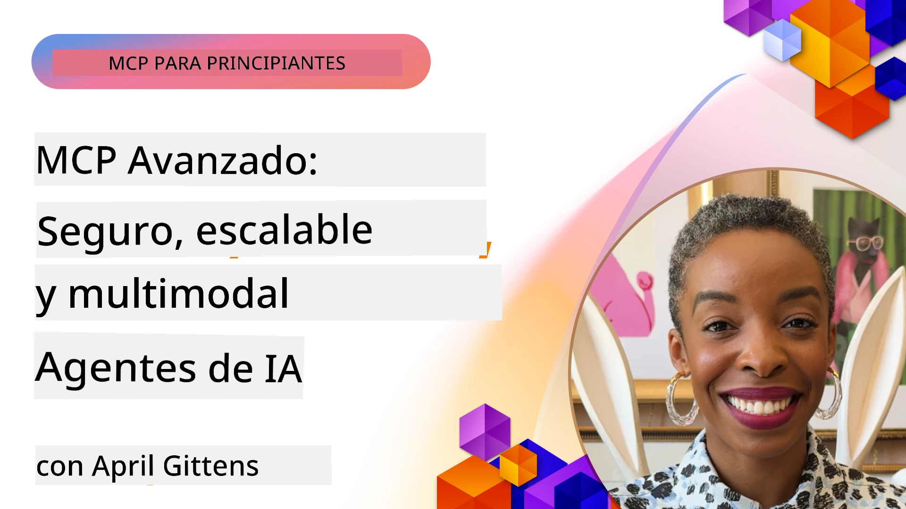

# Temas Avanzados en MCP

_(Haga clic en la imagen anterior para ver el video de esta lección)_

Este capítulo aborda una serie de temas avanzados en la implementación del Protocolo de Contexto de Modelo (MCP), incluyendo integración multimodal, escalabilidad, mejores prácticas de seguridad e integración empresarial. Estos temas son fundamentales para construir aplicaciones MCP robustas y listas para producción que puedan satisfacer las demandas de los sistemas de IA modernos.

## Resumen

Esta lección explora conceptos avanzados en la implementación del Protocolo de Contexto de Modelo, enfocándose en la integración multimodal, escalabilidad, mejores prácticas de seguridad e integración empresarial. Estos temas son esenciales para construir aplicaciones MCP de nivel productivo que puedan manejar requisitos complejos en entornos empresariales.

> **Nota de la especificación actual:** MCP `2026-07-28` desaprueba las primitivas Roots y
> Sampling cubiertas en las lecciones 5.4 y 5.6. También mueve la
> característica experimental de Tareas referenciada en Características del Protocolo (5.16) a una
> extensión dedicada de Tareas. Esas lecciones se conservan para implementaciones heredadas
> `2025-11-25` e incluyen orientaciones para la migración. Ver
> [Cambios en MCP: La Especificación 2026-07-28](../01-CoreConcepts/mcp-2026-07-28.md).

## Objetivos de Aprendizaje

Al finalizar esta lección, podrás:

- Implementar capacidades multimodales dentro de frameworks MCP
- Diseñar arquitecturas MCP escalables para escenarios de alta demanda
- Aplicar mejores prácticas de seguridad alineadas con los principios de seguridad de MCP
- Integrar MCP con sistemas y frameworks empresariales de IA
- Optimizar el rendimiento y la confiabilidad en entornos de producción

## Lecciones y Proyectos de ejemplo

| Enlace | Título | Descripción |
|------|-------|-------------|
| [5.1 Integración con Azure](./mcp-integration/README.md) | Integración con Azure | Aprende cómo integrar tu servidor MCP en Azure |
| [5.2 Ejemplo multimodal](./mcp-multi-modality/README.md) | Ejemplos MCP multimodales | Ejemplos para respuesta de audio, imagen y multimodal |
| [5.3 Ejemplo MCP OAuth2](../../../05-AdvancedTopics/mcp-oauth2-demo) | Demo MCP OAuth2 | Aplicación mínima en Spring Boot que muestra OAuth2 con MCP, como Servidor de Autorización y de Recursos. Demuestra emisión segura de tokens, puntos finales protegidos, despliegue en Azure Container Apps e integración con API Management. |
| [5.4 Contextos Raíz](./mcp-root-contexts/README.md) | Contextos raíz | Aprende la primitiva heredada `2025-11-25` Roots y opciones actuales de migración (obsoleta en `2026-07-28`) |
| [5.5 Enrutamiento](./mcp-routing/README.md) | Enrutamiento | Aprende diferentes tipos de enrutamiento |
| [5.6 Muestreo](./mcp-sampling/README.md) | Muestreo | Aprende la primitiva heredada `2025-11-25` Sampling y opciones actuales de migración (obsoleta en `2026-07-28`) |
| [5.7 Escalado](./mcp-scaling/README.md) | Escalado | Aprende sobre escalado |
| [5.8 Seguridad](./mcp-security/README.md) | Seguridad | Asegura tu servidor MCP |
| [5.9 Ejemplo de Búsqueda Web](./web-search-mcp/README.md) | Búsqueda Web MCP | Servidor y cliente MCP en Python que integran SerpAPI para búsqueda web, noticias, productos y preguntas en tiempo real. Demuestra orquestación con múltiples herramientas, integración con API externas y manejo robusto de errores. |
| [5.10 Streaming en tiempo real](./mcp-realtimestreaming/README.md) | Streaming | El streaming de datos en tiempo real se ha vuelto esencial en el mundo actual impulsado por datos, donde negocios y aplicaciones requieren acceso inmediato a la información para tomar decisiones oportunas. |
| [5.11 Búsqueda Web en tiempo real](./mcp-realtimesearch/README.md) | Búsqueda Web | Cómo MCP transforma la búsqueda web en tiempo real proporcionando un enfoque estandarizado para la gestión de contexto entre modelos de IA, motores de búsqueda y aplicaciones. | 
| [5.12 Autenticación Entra ID para Servidores MCP](./mcp-security-entra/README.md) | Autenticación Entra ID | Microsoft Entra ID proporciona una solución robusta basada en la nube para gestión de identidades y accesos, ayudando a asegurar que solo usuarios y aplicaciones autorizadas puedan interactuar con tu servidor MCP. |
| [5.13 Integración de Agentes Microsoft Foundry](./mcp-foundry-agent-integration/README.md) | Integración Microsoft Foundry | Aprende cómo integrar servidores Protocolo de Contexto de Modelo con agentes Microsoft Foundry, habilitando potente orquestación de herramientas y capacidades de IA empresarial con conexiones estandarizadas a fuentes externas de datos. |
| [5.14 Ingeniería de Contexto](./mcp-contextengineering/README.md) | Ingeniería de Contexto | La oportunidad futura de las técnicas de ingeniería de contexto para servidores MCP, incluyendo optimización de contexto, gestión dinámica de contexto y estrategias para ingeniería efectiva de prompts dentro de frameworks MCP. |
| [5.15 Transporte Personalizado MCP](./mcp-transport/README.md) | Transporte Personalizado | Aprende cómo implementar mecanismos de transporte personalizados para escenarios especializados de comunicación MCP. |
| [5.16 Profundización en Características del Protocolo](./mcp-protocol-features/README.md) | Características del Protocolo | Domina características avanzadas del protocolo incluyendo notificaciones de progreso, cancelación de solicitudes, plantillas de recursos y patrones de manejo de errores. |
| [5.17 Razonamiento Multi-Agente Adversarial](./mcp-adversarial-agents/README.md) | Agentes Adversariales | Usa dos agentes con posiciones opuestas, compartiendo un solo conjunto de herramientas MCP, para detectar alucinaciones, revelar casos límite y producir salidas mejor calibradas mediante debate estructurado. |

> **Nota histórica `2025-11-25`:** esa revisión introdujo Tareas experimentales
> y amplió varias características del protocolo. En `2026-07-28`, Tareas se trasladaron a
> una extensión oficial y Roots se volvió obsoleta. No uses el
> estado de características `2025-11-25` como guía actual; consulta el
> [registro de cambios 2026-07-28](https://modelcontextprotocol.io/specification/2026-07-28/changelog).

## Referencias Adicionales

Para la información más actualizada sobre temas avanzados MCP, consulta:
- [Documentación MCP](https://modelcontextprotocol.io/)
- [Especificación MCP (2026-07-28)](https://modelcontextprotocol.io/specification/2026-07-28/)
- [Repositorio GitHub](https://github.com/modelcontextprotocol)
- [OWASP MCP Top 10](https://microsoft.github.io/mcp-azure-security-guide/mcp/) - Riesgos de seguridad y mitigaciones
- [Taller Cumbre de Seguridad MCP (Sherpa)](https://azure-samples.github.io/sherpa/) - Capacitación práctica en seguridad

## Puntos Clave

- Las implementaciones multimodales MCP extienden capacidades de IA más allá del procesamiento de texto
- La escalabilidad es esencial para despliegues empresariales y puede abordarse mediante escalado horizontal y vertical
- Medidas de seguridad integrales protegen datos y aseguran el control adecuado de acceso
- La integración empresarial con plataformas como Azure OpenAI y Microsoft AI Foundry mejora las capacidades MCP
- Las implementaciones MCP avanzadas se benefician de arquitecturas optimizadas y gestión cuidadosa de recursos

## Ejercicio

Diseña una implementación MCP de nivel empresarial para un caso de uso específico:

1. Identifica los requisitos multimodales para tu caso de uso
2. Esboza los controles de seguridad necesarios para proteger datos sensibles
3. Diseña una arquitectura escalable que pueda manejar cargas variables
4. Planifica puntos de integración con sistemas de IA empresariales
5. Documenta cuellos de botella potenciales de rendimiento y estrategias de mitigación

## Recursos Adicionales

- [Documentación Azure OpenAI](https://learn.microsoft.com/en-us/azure/ai-services/openai/)
- [Documentación Microsoft AI Foundry](https://learn.microsoft.com/en-us/ai-services/)

---

## Qué sigue

Explora las lecciones en este módulo comenzando con: [5.1 Integración MCP](./mcp-integration/README.md)

Una vez completado este módulo, continúa con: [Módulo 6: Contribuciones de la Comunidad](../06-CommunityContributions/README.md)

---

<!-- CO-OP TRANSLATOR DISCLAIMER START -->
**Descargo de responsabilidad**:
Este documento ha sido traducido utilizando el servicio de traducción automática [Co-op Translator](https://github.com/Azure/co-op-translator). Aunque nos esforzamos por la precisión, tenga en cuenta que las traducciones automatizadas pueden contener errores o inexactitudes. El documento original en su idioma nativo debe considerarse la fuente autorizada. Para información crítica, se recomienda una traducción profesional humana. No somos responsables de cualquier malentendido o interpretación errónea que surja del uso de esta traducción.
<!-- CO-OP TRANSLATOR DISCLAIMER END -->