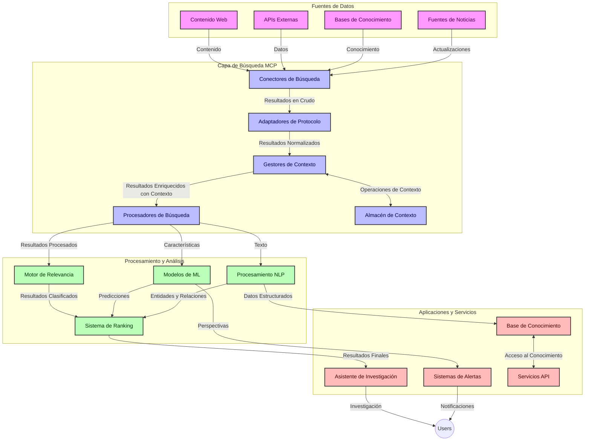
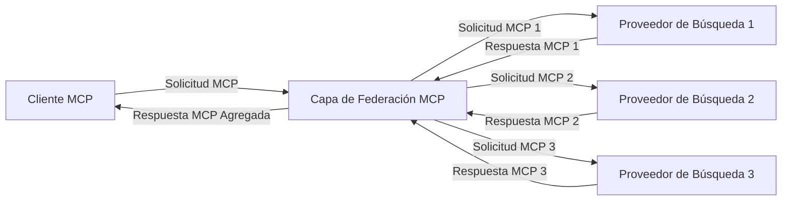
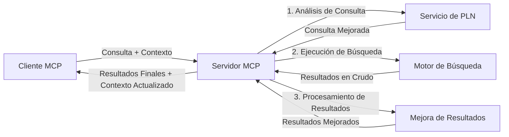

# Protocolo de Contexto de Modelo para Búsqueda Web en Tiempo Real

## Visión General

La búsqueda web en tiempo real se ha vuelto esencial en el entorno actual impulsado por la información, donde las aplicaciones necesitan acceso inmediato a información actualizada en toda la internet para proporcionar respuestas relevantes y oportunas. El Protocolo de Contexto de Modelo (MCP) representa un avance significativo en la optimización de estos procesos de búsqueda en tiempo real, mejorando la eficiencia de la búsqueda, manteniendo la integridad contextual y mejorando el rendimiento general del sistema.

Este módulo explora cómo MCP transforma la búsqueda web en tiempo real proporcionando un enfoque estandarizado para la gestión del contexto entre modelos de IA, motores de búsqueda y aplicaciones.

### Qué aprenderás

En esta guía completa descubrirás:

- Cómo MCP crea un puente fluido entre modelos de IA y capacidades de búsqueda web en tiempo real
- Patrones arquitectónicos para implementar soluciones de búsqueda eficientes y escalables con MCP
- Técnicas para preservar el contexto de búsqueda a través de múltiples consultas e interacciones
- Implementaciones prácticas de código en Python y JavaScript para diversos escenarios de búsqueda
- Métodos para equilibrar relevancia, actualidad y rendimiento en sistemas de búsqueda potenciados por MCP

## Introducción a la búsqueda web en tiempo real

La búsqueda web en tiempo real es un enfoque tecnológico que permite la consulta, procesamiento y análisis continuos de información basada en la web a medida que se publica o actualiza, permitiendo a los sistemas proporcionar información fresca y relevante con una latencia mínima. A diferencia de los sistemas de búsqueda tradicionales que operan sobre datos indexados que pueden tener horas o días de antigüedad, la búsqueda en tiempo real procesa datos en vivo de la web, ofreciendo perspectivas e información que reflejan el estado actual del contenido en línea.

### Conceptos clave de la búsqueda web en tiempo real:

- **Procesamiento de consultas continuo**: Las consultas de búsqueda se procesan contra fuentes de datos que se actualizan constantemente
- **Priorización de actualidad**: Los sistemas están diseñados para priorizar información fresca
- **Equilibrio de relevancia**: Mantener un balance entre relevancia y actualidad
- **Arquitectura escalable**: Los sistemas deben manejar cargas variables de consultas y volúmenes de datos
- **Comprensión contextual**: Mantener el contexto del usuario a lo largo de las iteraciones de búsqueda es crucial para resultados significativos
- **Reformulación dinámica de consultas**: Modificar adaptativamente las consultas según el contexto y resultados previos
- **Integración multisource**: Combinar resultados de múltiples proveedores de búsqueda y fuentes web
- **Comprensión semántica**: Procesar consultas y contenido basándose en el significado en lugar de solo palabras clave
- **Clasificación en tiempo real**: Ajustar continuamente las clasificaciones de resultados a medida que nueva información está disponible

### El Protocolo de Contexto de Modelo y la Búsqueda Web en Tiempo Real

El Protocolo de Contexto de Modelo (MCP) aborda varios desafíos críticos en entornos de búsqueda web en tiempo real:

1. **Preservación del contexto de búsqueda**: MCP estandariza cómo se mantiene el contexto entre componentes distribuidos de búsqueda, asegurando que los modelos de IA y nodos de procesamiento tengan acceso al historial relevante de consultas y preferencias del usuario.

2. **Gestión eficiente de consultas**: Proporcionando mecanismos estructurados para la transmisión del contexto, MCP reduce la sobrecarga de repetir contexto en cada iteración de búsqueda.

3. **Interoperabilidad**: MCP crea un lenguaje común para compartir contexto entre diversas tecnologías de búsqueda y modelos de IA, habilitando arquitecturas más flexibles y extensibles.

4. **Contexto optimizado para búsqueda**: Las implementaciones de MCP pueden priorizar qué elementos del contexto son más relevantes para una búsqueda efectiva, optimizando tanto el rendimiento como la precisión.

5. **Procesamiento adaptativo de búsqueda**: Con una adecuada gestión del contexto a través de MCP, los sistemas de búsqueda pueden ajustarse dinámicamente según las necesidades del usuario y los paisajes informativos cambiantes.

En aplicaciones modernas que van desde la agregación de noticias hasta asistentes de investigación, la integración de MCP con tecnologías de búsqueda web permite una búsqueda más inteligente, consciente del contexto, que puede proporcionar resultados cada vez más precisos conforme continúan las interacciones del usuario.

## Objetivos de aprendizaje

Al finalizar esta lección, podrás:

- Entender los fundamentos de la búsqueda web en tiempo real y sus desafíos en aplicaciones modernas
- Explicar cómo el Protocolo de Contexto de Modelo (MCP) mejora las capacidades de búsqueda web en tiempo real
- Implementar soluciones de búsqueda basadas en MCP usando frameworks y APIs populares
- Diseñar y desplegar arquitecturas de búsqueda escalables y de alto rendimiento con MCP
- Aplicar conceptos de MCP a diversos casos de uso incluyendo búsqueda semántica, asistencia para investigación y navegación aumentada por IA
- Evaluar tendencias emergentes e innovaciones futuras en tecnologías de búsqueda basadas en MCP
- Desarrollar sistemas de búsqueda conscientes del contexto que aprendan de las interacciones del usuario
- Integrar capacidades de búsqueda web en asistentes de IA usando protocolos MCP estandarizados
- Crear pipelines de búsqueda multi-etapa que refinen progresivamente resultados basados en contexto
- Optimizar el rendimiento de búsqueda mientras se mantiene una consciencia amplia del contexto

### Definición y significado

La búsqueda web en tiempo real implica la consulta, recuperación y entrega continua de información basada en la web con una latencia mínima. A diferencia de los motores de búsqueda tradicionales que rastrean y indexan periódicamente la web, la búsqueda en tiempo real busca mostrar información en cuanto está disponible, facilitando acceso inmediato al contenido más actual.

Las características clave de la búsqueda web en tiempo real incluyen:

- **Actualidad**: Priorizar contenido y actualizaciones recientes
- **Procesamiento continuo**: Monitorización constante de nueva información
- **Adaptación de consultas**: Refinamiento de consultas de búsqueda basado en contexto y retroalimentación
- **Entrega inmediata**: Proporcionar resultados de búsqueda con retraso mínimo
- **Retención del contexto**: Basarse en consultas previas para mejorar la relevancia

### Desafíos en la búsqueda web tradicional

Los enfoques tradicionales de búsqueda web enfrentan varias limitaciones cuando se aplican a escenarios en tiempo real:

1. **Fragmentación del contexto**: Dificultad para mantener el contexto de búsqueda a través de múltiples consultas
2. **Actualidad de la información**: Dificultades para acceder y priorizar la información más reciente
3. **Complejidad de integración**: Problemas con la interoperabilidad entre sistemas y aplicaciones de búsqueda
4. **Problemas de latencia**: Equilibrar una búsqueda exhaustiva con los requisitos de tiempo de respuesta
5. **Ajuste de relevancia**: Garantizar precisión y relevancia al priorizar la actualidad

## Comprendiendo el Protocolo de Contexto de Modelo (MCP) para la búsqueda

### ¿Qué es MCP en contextos de búsqueda?

El Protocolo de Contexto de Modelo (MCP) es un protocolo de comunicación estandarizado diseñado para facilitar la interacción eficiente entre modelos de IA y aplicaciones. En el contexto de la búsqueda web en tiempo real, MCP proporciona un marco para:

- Preservar el contexto de búsqueda a lo largo de secuencias de consultas
- Estandarizar los formatos de consulta y resultados de búsqueda
- Optimizar la transmisión de parámetros y resultados de búsqueda
- Mejorar la comunicación entre modelos y motores de búsqueda

### Componentes principales y arquitectura

La arquitectura MCP para búsqueda web en tiempo real consta de varios componentes clave:

1. **Manejadores de contexto de consulta**: Gestionan y mantienen el contexto de búsqueda a través de múltiples consultas
2. **Procesadores de búsqueda**: Procesan solicitudes de búsqueda entrantes usando técnicas conscientes del contexto
3. **Adaptadores de protocolo**: Convierten entre diferentes APIs de búsqueda preservando el contexto
4. **Almacenamiento de contexto**: Almacena y recupera eficientemente el historial de búsqueda y preferencias
5. **Conectores de búsqueda**: Conectan a varios motores de búsqueda y APIs web



### Cómo MCP mejora la búsqueda web en tiempo real

MCP aborda los desafíos tradicionales de la búsqueda web mediante:

- **Continuidad contextual**: Mantener relaciones entre consultas durante toda la sesión de búsqueda
- **Transmisión optimizada**: Reducir redundancias en parámetros de búsqueda mediante gestión inteligente del contexto
- **Interfaces estandarizadas**: Proporcionar APIs consistentes para componentes de búsqueda
- **Reducción de latencia**: Minimizar la sobrecarga de procesamiento mediante manipulación eficiente del contexto
- **Relevancia mejorada**: Mejorar la relevancia de búsqueda preservando la intención del usuario a través de múltiples consultas

## Integración e implementación

Los sistemas de búsqueda web en tiempo real requieren un diseño arquitectónico cuidadoso e implementación para mantener tanto el rendimiento como la integridad contextual. El Protocolo de Contexto de Modelo ofrece un enfoque estandarizado para integrar modelos de IA y tecnologías de búsqueda, permitiendo pipelines de búsqueda más sofisticados y conscientes del contexto.

### Visión general de la integración MCP en arquitecturas de búsqueda

Implementar MCP en entornos de búsqueda web en tiempo real implica varias consideraciones clave:

1. **Serialización del contexto de búsqueda**: MCP proporciona mecanismos eficientes para codificar información contextual dentro de solicitudes de búsqueda, asegurando que el contexto esencial acompañe la consulta a lo largo del pipeline de procesamiento. Esto incluye formatos de serialización estandarizados optimizados para metadatos relacionados con la búsqueda.

2. **Procesamiento de búsqueda con estado**: MCP permite un procesamiento con estado más inteligente mediante el mantenimiento de representaciones contextuales consistentes a través de iteraciones de búsqueda. Esto es particularmente valioso en pipelines de búsqueda multi-etapa donde el refinamiento del contexto mejora los resultados.

3. **Expansión y refinamiento de consultas**: Las implementaciones MCP en sistemas de búsqueda pueden facilitar una expansión y refinamiento sofisticados de consultas basados en el contexto acumulado, permitiendo resultados cada vez más relevantes conforme progresa la sesión de búsqueda.

4. **Caché y priorización de resultados**: Al estandarizar el manejo del contexto, MCP ayuda a gestionar el almacenamiento en caché y la priorización de resultados, permitiendo que los componentes se adapten según el contexto de búsqueda en evolución.

5. **Federación y agregación de búsqueda**: MCP facilita una federación más sofisticada de búsquedas en múltiples backends proporcionando representaciones estructuradas del contexto de búsqueda, habilitando una agregación más significativa de resultados de diversas fuentes.

La implementación de MCP a través de diversas tecnologías de búsqueda crea un enfoque unificado para la gestión del contexto, reduciendo la necesidad de código de integración personalizado mientras mejora la capacidad del sistema para mantener un contexto significativo a medida que evolucionan las consultas de búsqueda.

### MCP en diversas implementaciones de búsqueda web

Estos ejemplos siguen la especificación actual de MCP que se centra en un protocolo basado en JSON-RPC con mecanismos de transporte distintos. El código demuestra cómo puedes implementar integraciones de búsqueda personalizadas manteniendo plena compatibilidad con el protocolo MCP.


<details>
<summary>Implementación en Python con API Genérica de Búsqueda</summary>

```python
import asyncio
import json
import aiohttp
from typing import Dict, Any, Optional, List
from contextlib import asynccontextmanager
from collections.abc import AsyncIterator

# Importar bibliotecas MCP estándar
from mcp.client.session import ClientSession
from mcp.client.streamable_http import streamablehttp_client
from mcp.types import TextContent, CreateMessageRequestParams, CreateMessageResult
from mcp.server.fastmcp import FastMCP

# Crear un servidor FastMCP para búsqueda web
search_server = FastMCP("WebSearch")

# Clase para manejar operaciones de búsqueda web
class WebSearchHandler:
    def __init__(self, api_endpoint: str, api_key: str):
        self.api_endpoint = api_endpoint
        self.api_key = api_key
        self.session = None
        
    async def initialize(self):
        """Initialize the HTTP session"""
        self.session = aiohttp.ClientSession(
            headers={"Authorization": f"Bearer {self.api_key}"}
        )
    
    async def close(self):
        """Close the HTTP session"""
        if self.session:
            await self.session.close()
            
    async def perform_search(self, query: str, max_results: int = 5, 
                           include_domains: List[str] = None, 
                           exclude_domains: List[str] = None,
                           time_period: str = "any") -> Dict[str, Any]:
        """Perform web search using the search API"""
        # Construir parámetros de búsqueda
        search_params = {
            "q": query,
            "limit": max_results,
            "time": time_period
        }
        
        if include_domains:
            search_params["site"] = ",".join(include_domains)
            
        if exclude_domains:
            search_params["exclude_site"] = ",".join(exclude_domains)
        
        # Realizar la solicitud de búsqueda
        try:
            async with self.session.get(
                self.api_endpoint,
                params=search_params
            ) as response:
                if response.status != 200:
                    error_text = await response.text()
                    raise Exception(f"Search API error: {response.status} - {error_text}")
                
                search_data = await response.json()
                
                # Transformar la respuesta específica de la API a un formato estándar
                results = []
                for item in search_data.get("results", []):
                    results.append({
                        "title": item.get("title", ""),
                        "url": item.get("url", ""),
                        "snippet": item.get("snippet", ""),
                        "date": item.get("published_date", ""),
                        "source": item.get("source", "")
                    })
                
                return {
                    "query": query,
                    "totalResults": len(results),
                    "results": results
                }
        except Exception as e:
            print(f"Search API request error: {e}")
            raise

# Inicializar el manejador de búsqueda
search_handler = WebSearchHandler(
    api_endpoint="https://api.search-service.example/search",
    api_key="your-api-key-here"
)

# Configurar el ciclo de vida para manejar el manejador de búsqueda
@asyncio.asynccontextmanager
async def app_lifespan(server: FastMCP):
    """Manage application lifecycle"""
    await search_handler.initialize()
    try:
        yield {"search_handler": search_handler}
    finally:
        await search_handler.close()

# Establecer el ciclo de vida para el servidor
search_server = FastMCP("WebSearch", lifespan=app_lifespan)

# Registrar una herramienta de búsqueda web
@search_server.tool()
async def web_search(query: str, max_results: int = 5, 
                   include_domains: List[str] = None,
                   exclude_domains: List[str] = None,
                   time_period: str = "any") -> Dict[str, Any]:
    """
    Search the web for information
    
    Args:
        query: The search query
        max_results: Maximum number of results to return (default: 5)
        include_domains: List of domains to include in search results
        exclude_domains: List of domains to exclude from search results
        time_period: Time period for results ("day", "week", "month", "any")
        
    Returns:
        Dictionary containing search results
    """
    ctx = search_server.get_context()
    search_handler = ctx.request_context.lifespan_context["search_handler"]
    
    results = await search_handler.perform_search(
        query=query,
        max_results=max_results,
        include_domains=include_domains,
        exclude_domains=exclude_domains,
        time_period=time_period
    )
    
    return results

# Ejemplo de uso del cliente
async def client_example():
    # Conectar al servidor de búsqueda usando transporte HTTP Streamable
    async with streamablehttp_client("http://localhost:8000/mcp") as (read, write, _):
        async with ClientSession(read, write) as session:
            # Inicializar la conexión
            await session.initialize()
            
            # Llamar a la herramienta de búsqueda web
            search_results = await session.call_tool(
                "web_search", 
                {
                    "query": "latest developments in AI and Model Context Protocol",
                    "max_results": 5,
                    "time_period": "day",
                    "include_domains": ["github.com", "microsoft.com"]
                }
            )
            
            print(f"Search results: {search_results}")

# Ejemplo de ejecución del servidor
if __name__ == "__main__":
    # Ejecutar el servidor con transporte HTTP Streamable
    search_server.run(transport="streamable-http")
```
</details> 

<details>
<summary>Implementación en JavaScript con Búsqueda basada en Navegador</summary>


```javascript
// Implementación del servidor MCP para búsqueda web
import { McpServer, ResourceTemplate } from '@modelcontextprotocol/sdk/server/mcp.js';
import { StreamableHTTPServerTransport } from '@modelcontextprotocol/sdk/server/streamableHttp.js';
import { z } from 'zod';

// Crear un servidor MCP para búsqueda web
const searchServer = new McpServer({
    name: "BrowserSearch",
    description: "A server that provides web search capabilities"
});

// Clase de servicio de búsqueda
class SearchService {
    constructor(searchApiUrl, apiKey) {
        this.searchApiUrl = searchApiUrl;
        this.apiKey = apiKey;
    }

    async performSearch(parameters) {
        const {
            query = '',
            maxResults = 5,
            includeDomains = [],
            excludeDomains = [],
            timePeriod = 'any'
        } = parameters;
        
        // Construir URL de búsqueda con parámetros
        const url = new URL(this.searchApiUrl);
        url.searchParams.append('q', query);
        url.searchParams.append('limit', maxResults);
        url.searchParams.append('time', timePeriod);
        
        if (includeDomains.length > 0) {
            url.searchParams.append('site', includeDomains.join(','));
        }
        
        if (excludeDomains.length > 0) {
            url.searchParams.append('exclude_site', excludeDomains.join(','));
        }
        
        try {
            const response = await fetch(url.toString(), {
                method: 'GET',
                headers: {
                    'Authorization': `Bearer ${this.apiKey}`,
                    'Content-Type': 'application/json'
                }
            });
            
            if (!response.ok) {
                const errorText = await response.text();
                throw new Error(`Search API error: ${response.status} - ${errorText}`);
            }
            
            const searchData = await response.json();
            
            // Transformar la respuesta específica de la API a un formato estándar
            const results = searchData.results?.map(item => ({
                title: item.title || '',
                url: item.url || '',
                snippet: item.snippet || '',
                date: item.published_date || '',
                source: item.source || ''
            })) || [];
            
            return {
                query,
                totalResults: results.length,
                results
            };
        } catch (error) {
            console.error('Search API request error:', error);
            throw error;
        }
    }
}

// Inicializar el servicio de búsqueda
const searchService = new SearchService(
    'https://api.search-service.example/search',
    'your-api-key-here'
);

// Configurar el proveedor de contexto para el servidor
searchServer.setContextProvider(() => {
    return {
        searchService
    };
});

// Registrar herramienta de búsqueda web
searchServer.tool({
    name: 'web_search',
    description: 'Search the web for information',
    parameters: {
        type: 'object',
        properties: {
            query: {
                type: 'string',
                description: 'The search query'
            },
            maxResults: {
                type: 'integer',
                description: 'Maximum number of results to return',
                default: 5
            },
            includeDomains: {
                type: 'array',
                items: { type: 'string' },
                description: 'List of domains to include in search results'
            },
            excludeDomains: {
                type: 'array',
                items: { type: 'string' },
                description: 'List of domains to exclude from search results'
            },
            timePeriod: {
                type: 'string',
                description: 'Time period for results',
                enum: ['day', 'week', 'month', 'any'],
                default: 'any'
            }
        },
        required: ['query']
    },
    handler: async (params, context) => {
        const { searchService } = context;
        return await searchService.performSearch(params);
    }
});

// Código de ejemplo del cliente para conectarse al servidor de búsqueda
import { Client } from '@modelcontextprotocol/sdk/client/index.js';
import { StreamableHTTPClientTransport } from '@modelcontextprotocol/sdk/client/streamableHttp.js';

async function connectToSearchServer() {
    // Conectarse al servidor de búsqueda
    const transport = new StreamableHTTPClientTransport(
        new URL('http://localhost:8000/mcp')
    );
    
    const client = new Client({
        name: 'search-client',
        version: '1.0.0'
    });
    
    await client.connect(transport);
    
    // Ejecutar la herramienta de búsqueda
    const searchResults = await client.callTool({
        name: 'web_search',
        arguments: {
            query: 'Model Context Protocol implementation examples',
            maxResults: 10,
            timePeriod: 'week',
            includeDomains: ['github.com', 'docs.microsoft.com']
        }
    });
    
    console.log('Search results:', searchResults);
    
    // Limpieza
    await client.disconnect();
}

// Iniciar el servidor
const transport = new StreamableHTTPServerTransport();
await searchServer.connect(transport);
console.log('Search server running at http://localhost:8000/mcp');

// En un proceso separado o después de que el servidor haya arrancado
// connectToSearchServer().catch(console.error);
```
</details> 


## Descargo de responsabilidad sobre ejemplos de código

> **Nota importante**: Los ejemplos de código a continuación demuestran la integración del Protocolo de Contexto de Modelo (MCP) con la funcionalidad de búsqueda web. Aunque siguen los patrones y estructuras de los SDK oficiales de MCP, han sido simplificados con fines educativos.
> 
> Estos ejemplos muestran:
> 
> 1. **Implementación en Python**: Una implementación del servidor FastMCP que proporciona una herramienta de búsqueda web y se conecta a una API de búsqueda externa. Este ejemplo demuestra una correcta gestión del ciclo de vida, manejo del contexto e implementación de herramientas siguiendo los patrones del [SDK oficial de MCP para Python](https://github.com/modelcontextprotocol/python-sdk). El servidor utiliza el transporte HTTP Streamable recomendado, que ha reemplazado el transporte SSE más antiguo para despliegues en producción.
> 
> 2. **Implementación en JavaScript**: Una implementación en TypeScript/JavaScript utilizando el patrón FastMCP del [SDK oficial de MCP para TypeScript](https://github.com/modelcontextprotocol/typescript-sdk) para crear un servidor de búsqueda con definiciones adecuadas de herramientas y conexiones de clientes. Sigue los patrones recomendados más recientes para gestión de sesiones y preservación del contexto.
> 
> Estos ejemplos requerirían manejo adicional de errores, autenticación y código específico de integración para uso en producción. Los puntos finales de la API de búsqueda mostrados (`https://api.search-service.example/search`) son marcadores de posición y deberían ser reemplazados por endpoints de servicios de búsqueda reales.
> 
> Para detalles completos de implementación y los enfoques más actualizados,
> consulta la [especificación oficial de MCP](https://modelcontextprotocol.io/specification/2026-07-28/)
> y la documentación del SDK.

## Conceptos básicos

### El marco del Protocolo de Contexto de Modelo (MCP)

En su base, el Protocolo de Contexto de Modelo proporciona una forma estandarizada para que modelos de IA, aplicaciones y servicios intercambien contexto. En la búsqueda web en tiempo real, este marco es esencial para crear experiencias coherentes de búsqueda multi-turno. Los componentes clave incluyen:

1. **Arquitectura cliente-servidor**: MCP establece una separación clara entre clientes de búsqueda (solicitantes) y servidores de búsqueda (proveedores), permitiendo modelos de despliegue flexibles.

2. **Comunicación JSON-RPC**: El protocolo usa JSON-RPC para el intercambio de mensajes, haciéndolo compatible con tecnologías web y fácil de implementar en diferentes plataformas.

3. **Gestión de contexto**: MCP define métodos estructurados para mantener, actualizar y aprovechar el contexto de búsqueda a través de múltiples interacciones.

4. **Definiciones de herramientas**: Las capacidades de búsqueda se exponen como herramientas estandarizadas con parámetros y valores de retorno bien definidos.

5. **Soporte para streaming**: El protocolo soporta resultados en streaming, esencial para búsqueda en tiempo real donde los resultados pueden llegar progresivamente.

### Patrones de integración de búsqueda web

Al integrar MCP con la búsqueda web, surgen varios patrones:

#### 1. Integración directa con proveedor de búsqueda


En este patrón, el servidor MCP se conecta directamente con una o más APIs de búsqueda, traduciendo solicitudes MCP en llamadas específicas de API y formateando los resultados como respuestas MCP.

#### 2. Búsqueda federada con preservación del contexto



Este patrón distribuye consultas de búsqueda a través de múltiples proveedores compatibles con MCP, cada uno potencialmente especializado en diferentes tipos de contenido o capacidades de búsqueda, manteniendo un contexto unificado.

#### 3. Cadena de búsqueda mejorada con contexto



En este patrón, el proceso de búsqueda se divide en múltiples etapas, enriqueciéndose el contexto en cada paso, resultando en resultados progresivamente más relevantes.

### Componentes del contexto de búsqueda

En la búsqueda web basada en MCP, el contexto típicamente incluye:

- **Historial de consultas**: Consultas de búsqueda previas en la sesión
- **Preferencias del usuario**: Idioma, región, configuraciones de búsqueda segura
- **Historial de interacción**: Resultados en los que se hizo clic, tiempo dedicado en resultados
- **Parámetros de búsqueda**: Filtros, órdenes de clasificación y otros modificadores de búsqueda
- **Conocimiento del dominio**: Contexto específico del tema relevante para la búsqueda
- **Contexto temporal**: Factores de relevancia basados en tiempo
- **Preferencias de fuente**: Fuentes de información confiables o preferidas

## Casos de uso y aplicaciones

### Investigación y recopilación de información

MCP mejora los flujos de trabajo de investigación mediante:

- Preservar el contexto de investigación a través de sesiones de búsqueda
- Permitir consultas más sofisticadas y contextualmente relevantes
- Soportar federación de búsqueda multisource
- Facilitar la extracción de conocimiento a partir de resultados de búsqueda

### Monitoreo de noticias y tendencias en tiempo real

La búsqueda potenciada por MCP ofrece ventajas para el monitoreo de noticias:

- Descubrimiento casi en tiempo real de historias de noticias emergentes
- Filtrado contextual de información relevante
- Seguimiento de temas y entidades a través de múltiples fuentes
- Alertas personalizadas de noticias basadas en el contexto del usuario

### Navegación e investigación aumentada por IA

MCP crea nuevas posibilidades para la navegación aumentada por IA:

- Sugerencias de búsqueda contextuales basadas en la actividad actual del navegador
- Integración fluida de la búsqueda web con asistentes potenciados por LLM
- Refinamiento de búsqueda multi-turno con contexto mantenido
- Verificación de hechos e información mejorada

## Tendencias e innovaciones futuras

### Evolución de MCP en la búsqueda web

De cara al futuro, anticipamos que MCP evolucionará para abordar:


- **Búsqueda Multimodal**: Integrando la búsqueda de texto, imagen, audio y video con preservación del contexto  
- **Búsqueda Descentralizada**: Soportando ecosistemas de búsqueda distribuidos y federados  
- **Privacidad en la Búsqueda**: Mecanismos de búsqueda que preservan la privacidad conscientes del contexto  
- **Comprensión de Consultas**: Análisis semántico profundo de consultas de búsqueda en lenguaje natural  

### Posibles Avances en la Tecnología  

Tecnologías emergentes que moldearán el futuro de la búsqueda MCP:  

1. **Arquitecturas de Búsqueda Neuronal**: Sistemas de búsqueda basados en embeddings optimizados para MCP  
2. **Contexto Personalizado de Búsqueda**: Aprendizaje de patrones individuales de búsqueda del usuario a través del tiempo  
3. **Integración con Grafos de Conocimiento**: Búsqueda contextual mejorada por grafos de conocimiento específicos del dominio  
4. **Contexto Multimodal Cruzado**: Mantenimiento del contexto a través de distintas modalidades de búsqueda  

## Ejercicios Prácticos  

### Ejercicio 1: Configuración de una Canalización Básica de Búsqueda MCP  

En este ejercicio aprenderás a:  
- Configurar un entorno básico de búsqueda MCP  
- Implementar manejadores de contexto para búsqueda web  
- Probar y validar la preservación de contexto a lo largo de las iteraciones de búsqueda  

### Ejercicio 2: Construyendo un Asistente de Investigación con Búsqueda MCP  

Crea una aplicación completa que:  
- Procese preguntas de investigación en lenguaje natural  
- Realice búsquedas web conscientes del contexto  
- Sintetice información de múltiples fuentes  
- Presente hallazgos de investigación organizados  

### Ejercicio 3: Implementando Federación de Búsqueda Multi-Fuente con MCP  

Ejercicio avanzado que cubre:  
- Envío de consultas consciente del contexto a múltiples motores de búsqueda  
- Clasificación y agregación de resultados  
- Deducción contextual de resultados duplicados  
- Manejo de metadatos específicos de cada fuente  

## Recursos Adicionales  

- [Especificación del Protocolo Model Context](https://modelcontextprotocol.io/specification/2026-07-28/) - Especificación oficial del MCP y documentación detallada del protocolo  
- [Documentación del Protocolo Model Context](https://modelcontextprotocol.io/) - Tutoriales detallados y guías de implementación  
- [SDK de Python para MCP](https://github.com/modelcontextprotocol/python-sdk) - Implementación oficial en Python del protocolo MCP  
- [SDK de TypeScript para MCP](https://github.com/modelcontextprotocol/typescript-sdk) - Implementación oficial en TypeScript del protocolo MCP  
- [Servidores de Referencia MCP](https://github.com/modelcontextprotocol/servers) - Implementaciones de referencia de servidores MCP  
- [Documentación API de Bing Web Search](https://learn.microsoft.com/en-us/bing/search-apis/bing-web-search/overview) - API de búsqueda web de Microsoft  
- [API JSON de Búsqueda Personalizada de Google](https://developers.google.com/custom-search/v1/overview) - Motor de búsqueda programable de Google  
- [Documentación SerpAPI](https://serpapi.com/search-api) - API para páginas de resultados de motores de búsqueda  
- [Documentación Meilisearch](https://www.meilisearch.com/docs) - Motor de búsqueda de código abierto  
- [Documentación Elasticsearch](https://www.elastic.co/guide/index.html) - Motor distribuido de búsqueda y análisis  
- [Documentación LangChain](https://python.langchain.com/docs/get_started/introduction) - Construyendo aplicaciones con LLMs  

## Resultados de Aprendizaje  

Al completar este módulo, podrás:  

- Entender los fundamentos de la búsqueda web en tiempo real y sus desafíos  
- Explicar cómo el Protocolo Model Context (MCP) mejora las capacidades de búsqueda web en tiempo real  
- Implementar soluciones de búsqueda basadas en MCP usando frameworks y APIs populares  
- Diseñar y desplegar arquitecturas de búsqueda escalables y de alto rendimiento con MCP  
- Aplicar los conceptos de MCP a casos de uso variados incluyendo búsqueda semántica, asistencia en investigación y navegación aumentada con IA  
- Evaluar tendencias emergentes e innovaciones futuras en tecnologías de búsqueda basadas en MCP  


### Consideraciones de Confianza y Seguridad  

Al implementar soluciones de búsqueda web basadas en MCP, recuerda estos principios importantes de la especificación MCP:  

1. **Consentimiento y Control del Usuario**: Los usuarios deben consentir explícitamente y entender todo acceso a datos y operaciones. Esto es especialmente importante en implementaciones de búsqueda web que pueden acceder a fuentes de datos externas.  

2. **Privacidad de Datos**: Asegura el manejo adecuado de consultas y resultados de búsqueda, especialmente cuando pueden contener información sensible. Implementa controles de acceso apropiados para proteger los datos del usuario.  

3. **Seguridad de las Herramientas**: Implementa la autorización y validación adecuadas para las herramientas de búsqueda, ya que representan riesgos potenciales de seguridad por la ejecución arbitraria de código. Las descripciones del comportamiento de la herramienta deben considerarse no confiables a menos que provengan de un servidor confiable.  

4. **Documentación Clara**: Proporciona documentación clara sobre las capacidades, limitaciones y consideraciones de seguridad de tu implementación de búsqueda basada en MCP, siguiendo las pautas de implementación de la especificación MCP.  

5. **Flujos de Consentimiento Robustecidos**: Construye flujos robustos de consentimiento y autorización que expliquen claramente qué hace cada herramienta antes de autorizar su uso, especialmente para herramientas que interactúan con recursos web externos.  

Para detalles completos sobre seguridad y consideraciones de confianza en MCP, consulta la  
[documentación oficial](https://modelcontextprotocol.io/specification/2026-07-28/basic/security_best_practices).  

## Qué sigue  

- [5.12 Autenticación Entra ID para Servidores del Protocolo Model Context](../mcp-security-entra/README.md)  

---

<!-- CO-OP TRANSLATOR DISCLAIMER START -->
**Descargo de responsabilidad**:
Este documento ha sido traducido utilizando el servicio de traducción automática [Co-op Translator](https://github.com/Azure/co-op-translator). Aunque nos esforzamos por la precisión, tenga en cuenta que las traducciones automatizadas pueden contener errores o inexactitudes. El documento original en su idioma nativo debe considerarse la fuente autorizada. Para información crítica, se recomienda una traducción profesional humana. No somos responsables de cualquier malentendido o interpretación errónea que surja del uso de esta traducción.
<!-- CO-OP TRANSLATOR DISCLAIMER END -->