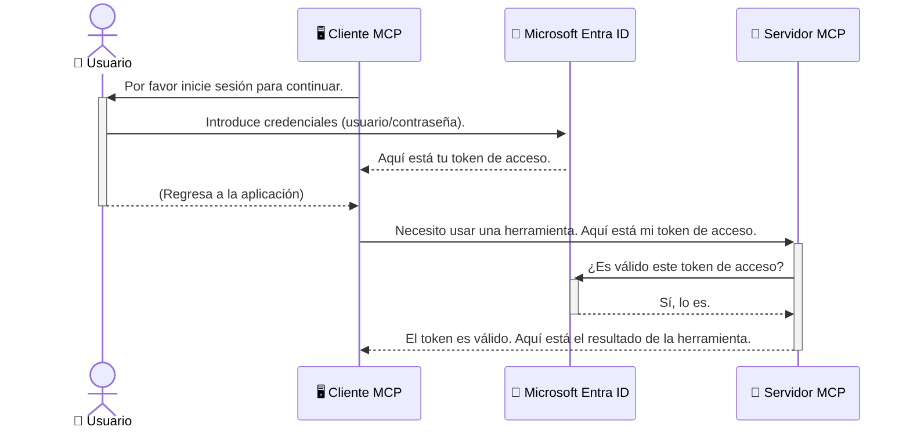

# Asegurando flujos de trabajo de IA: Autenticación Entra ID para servidores del Protocolo de Contexto de Modelo

> [!NOTE]
> El código del servidor remoto en esta lección protege los puntos finales heredados `/sse` y `/message`
> y apunta a MCP `2025-11-25`. Mantenga sus prácticas de validación de identidad y token,
> pero use un transporte HTTP Streamable compatible con `2026-07-28` para nuevas
> implementaciones.

## Introducción
Asegurar su servidor del Protocolo de Contexto de Modelo (MCP) es tan importante como cerrar con llave la puerta principal de su casa. Dejar su servidor MCP abierto expone sus herramientas y datos a accesos no autorizados, lo que puede provocar brechas de seguridad. Microsoft Entra ID ofrece una solución robusta de administración de identidad y acceso basada en la nube, ayudando a garantizar que solo usuarios y aplicaciones autorizados puedan interactuar con su servidor MCP. En esta sección, aprenderá cómo proteger sus flujos de trabajo de IA utilizando la autenticación Entra ID.

## Objetivos de aprendizaje
Al final de esta sección, podrá:

- Comprender la importancia de asegurar los servidores MCP.
- Explicar los fundamentos de Microsoft Entra ID y autenticación OAuth 2.0.
- Reconocer la diferencia entre clientes públicos y confidenciales.
- Implementar la autenticación Entra ID en escenarios de servidor MCP local (cliente público) y remoto (cliente confidencial).
- Aplicar las mejores prácticas de seguridad al desarrollar flujos de trabajo de IA.

## Seguridad y MCP

Así como no dejaría la puerta principal de su casa sin llave, no debería dejar su servidor MCP abierto para que cualquiera acceda. Asegurar sus flujos de trabajo de IA es esencial para construir aplicaciones robustas, confiables y seguras. Este capítulo le introducirá al uso de Microsoft Entra ID para asegurar sus servidores MCP, garantizando que solo usuarios y aplicaciones autorizados puedan interactuar con sus herramientas y datos.

## Por qué la seguridad es importante para los servidores MCP

Imagine que su servidor MCP tiene una herramienta que puede enviar correos electrónicos o acceder a una base de datos de clientes. Un servidor sin asegurar significaría que cualquiera podría usar esa herramienta, lo que llevaría a accesos no autorizados a datos, spam u otras actividades maliciosas.

Al implementar autenticación, asegura que cada solicitud a su servidor sea verificada, confirmando la identidad del usuario o aplicación que hace la solicitud. Este es el primer y más crítico paso para asegurar sus flujos de trabajo de IA.

## Introducción a Microsoft Entra ID

[**Microsoft Entra ID**](https://adoption.microsoft.com/microsoft-security/entra/) es un servicio basado en la nube para la gestión de identidad y acceso. Piénselo como un guardia de seguridad universal para sus aplicaciones. Maneja el proceso complejo de verificar las identidades de los usuarios (autenticación) y determinar qué están autorizados a hacer (autorización).

Al usar Entra ID, puede:

- Permitir un inicio de sesión seguro para los usuarios.
- Proteger APIs y servicios.
- Gestionar políticas de acceso desde una ubicación central.

Para servidores MCP, Entra ID proporciona una solución robusta y ampliamente confiable para gestionar quién puede acceder a las capacidades de su servidor.

---

## Entendiendo la magia: Cómo funciona la autenticación Entra ID

Entra ID usa estándares abiertos como **OAuth 2.0** para manejar la autenticación. Aunque los detalles pueden ser complejos, el concepto principal es simple y puede entenderse con una analogía.

### Una introducción amable a OAuth 2.0: La llave de valet

Piense en OAuth 2.0 como un servicio de valet para su auto. Cuando llega a un restaurante, no le da al valet la llave maestra. En cambio, proporciona una **llave de valet** que tiene permisos limitados: puede arrancar el auto y cerrar las puertas, pero no puede abrir el maletero o la guantera.

En esta analogía:

- **Usted** es el **Usuario**.
- **Su auto** es el **Servidor MCP** con sus valiosas herramientas y datos.
- El **Valet** es **Microsoft Entra ID**.
- El **Encargado del estacionamiento** es el **Cliente MCP** (la aplicación que intenta acceder al servidor).
- La **Llave de valet** es el **Token de acceso**.

El token de acceso es una cadena segura de texto que el cliente MCP recibe de Entra ID después de que usted inicia sesión. El cliente luego presenta este token al servidor MCP con cada solicitud. El servidor puede verificar el token para asegurar que la solicitud es legítima y que el cliente tiene los permisos necesarios, todo sin tener que manejar sus credenciales reales (como su contraseña).

### El flujo de autenticación

Así es como funciona el proceso en la práctica:



### Presentando la Biblioteca de Autenticación de Microsoft (MSAL)

Antes de sumergirnos en el código, es importante presentar un componente clave que verá en los ejemplos: la **Biblioteca de Autenticación de Microsoft (MSAL)**.

MSAL es una biblioteca desarrollada por Microsoft que facilita mucho a los desarrolladores manejar la autenticación. En lugar de que usted tenga que escribir todo el código complejo para manejar tokens de seguridad, gestionar inicios de sesión y refrescar sesiones, MSAL se encarga de las tareas pesadas.

Usar una biblioteca como MSAL es altamente recomendado porque:

- **Es segura:** Implementa protocolos estándar de la industria y mejores prácticas de seguridad, reduciendo el riesgo de vulnerabilidades en su código.
- **Simplifica el desarrollo:** Abstrae la complejidad de los protocolos OAuth 2.0 y OpenID Connect, permitiéndole añadir autenticación robusta a su aplicación con solo unas pocas líneas de código.
- **Está mantenida:** Microsoft mantiene y actualiza activamente MSAL para enfrentar nuevas amenazas de seguridad y cambios de plataforma.

MSAL soporta una amplia variedad de lenguajes y frameworks de aplicación, incluyendo .NET, JavaScript/TypeScript, Python, Java, Go, y plataformas móviles como iOS y Android. Esto significa que puede usar los mismos patrones de autenticación consistentes en toda su pila tecnológica.

Para aprender más sobre MSAL, puede consultar la documentación oficial de [visión general de MSAL](https://learn.microsoft.com/entra/identity-platform/msal-overview).

---

## Asegurando su servidor MCP con Entra ID: Una guía paso a paso

Ahora, veamos cómo asegurar un servidor MCP local (uno que se comunica a través de `stdio`) usando Entra ID. Este ejemplo usa un **cliente público**, adecuado para aplicaciones que se ejecutan en la máquina del usuario, como una aplicación de escritorio o un servidor de desarrollo local.

### Escenario 1: Asegurando un servidor MCP local (con un Cliente Público)

En este escenario, veremos un servidor MCP que se ejecuta localmente, se comunica a través de `stdio` y utiliza Entra ID para autenticar al usuario antes de permitir el acceso a sus herramientas. El servidor tendrá una sola herramienta que obtiene información del perfil del usuario desde la API Microsoft Graph.

#### 1. Configurando la aplicación en Entra ID

Antes de escribir código, debe registrar su aplicación en Microsoft Entra ID. Esto informa a Entra ID sobre su aplicación y le otorga permiso para usar el servicio de autenticación.

1. Navegue al **[portal de Microsoft Entra](https://entra.microsoft.com/)**.
2. Vaya a **Registros de aplicaciones** y haga clic en **Nuevo registro**.
3. Dé un nombre a su aplicación (por ejemplo, "Mi Servidor MCP Local").
4. Para **Tipos de cuenta admitidos**, seleccione **Cuentas en este directorio organizacional solamente**.
5. Puede dejar la **URI de redireccionamiento** en blanco para este ejemplo.
6. Haga clic en **Registrar**.

Una vez registrado, anote el **ID de la aplicación (cliente)** y el **ID del directorio (inquilino)**. Los necesitará en su código.

#### 2. El código: Un desglose

Veamos las partes clave del código que manejan la autenticación. El código completo de este ejemplo está disponible en la carpeta [Entra ID - Local - WAM](https://github.com/Azure-Samples/mcp-auth-servers/tree/main/src/entra-id-local-wam) del [repositorio GitHub mcp-auth-servers](https://github.com/Azure-Samples/mcp-auth-servers).

**`AuthenticationService.cs`**

Esta clase es responsable de manejar la interacción con Entra ID.

- **`CreateAsync`**: Este método inicializa el `PublicClientApplication` de MSAL (Microsoft Authentication Library). Está configurado con el `clientId` y `tenantId` de su aplicación.
- **`WithBroker`**: Esto habilita el uso de un broker (como Windows Web Account Manager), que proporciona una experiencia de inicio de sesión único más segura y fluida.
- **`AcquireTokenAsync`**: Este es el método central. Primero intenta obtener un token en silencio (significando que el usuario no tendrá que iniciar sesión de nuevo si ya tiene una sesión válida). Si no puede obtener un token en silencio, solicitará al usuario iniciar sesión de forma interactiva.

```csharp
// Simplified for clarity
public static async Task<AuthenticationService> CreateAsync(ILogger<AuthenticationService> logger)
{
    var msalClient = PublicClientApplicationBuilder
        .Create(_clientId) // Your Application (client) ID
        .WithAuthority(AadAuthorityAudience.AzureAdMyOrg)
        .WithTenantId(_tenantId) // Your Directory (tenant) ID
        .WithBroker(new BrokerOptions(BrokerOptions.OperatingSystems.Windows))
        .Build();

    // ... cache registration ...

    return new AuthenticationService(logger, msalClient);
}

public async Task<string> AcquireTokenAsync()
{
    try
    {
        // Try silent authentication first
        var accounts = await _msalClient.GetAccountsAsync();
        var account = accounts.FirstOrDefault();

        AuthenticationResult? result = null;

        if (account != null)
        {
            result = await _msalClient.AcquireTokenSilent(_scopes, account).ExecuteAsync();
        }
        else
        {
            // If no account, or silent fails, go interactive
            result = await _msalClient.AcquireTokenInteractive(_scopes).ExecuteAsync();
        }

        return result.AccessToken;
    }
    catch (Exception ex)
    {
        _logger.LogError(ex, "An error occurred while acquiring the token.");
        throw; // Optionally rethrow the exception for higher-level handling
    }
}
```

**`Program.cs`**

Aquí es donde se configura el servidor MCP y se integra el servicio de autenticación.

- **`AddSingleton<AuthenticationService>`**: Esto registra el `AuthenticationService` en el contenedor de inyección de dependencias, para que pueda ser usado por otras partes de la aplicación (como nuestra herramienta).
- **Herramienta `GetUserDetailsFromGraph`**: Esta herramienta requiere una instancia de `AuthenticationService`. Antes de hacer cualquier cosa, llama a `authService.AcquireTokenAsync()` para obtener un token de acceso válido. Si la autenticación es exitosa, usa el token para llamar a la API Microsoft Graph y obtener los detalles del usuario.

```csharp
// Simplified for clarity
[McpServerTool(Name = "GetUserDetailsFromGraph")]
public static async Task<string> GetUserDetailsFromGraph(
    AuthenticationService authService)
{
    try
    {
        // This will trigger the authentication flow
        var accessToken = await authService.AcquireTokenAsync();

        // Use the token to create a GraphServiceClient
        var graphClient = new GraphServiceClient(
            new BaseBearerTokenAuthenticationProvider(new TokenProvider(authService)));

        var user = await graphClient.Me.GetAsync();

        return System.Text.Json.JsonSerializer.Serialize(user);
    }
    catch (Exception ex)
    {
        return $"Error: {ex.Message}";
    }
}
```

#### 3. Cómo funciona todo junto

1. Cuando el cliente MCP intenta usar la herramienta `GetUserDetailsFromGraph`, la herramienta primero llama a `AcquireTokenAsync`.
2. `AcquireTokenAsync` hace que la biblioteca MSAL verifique si hay un token válido.
3. Si no se encuentra un token, MSAL, a través del broker, pedirá al usuario iniciar sesión con su cuenta Entra ID.
4. Una vez que el usuario inicia sesión, Entra ID emite un token de acceso.
5. La herramienta recibe el token y lo usa para hacer una llamada segura a la API Microsoft Graph.
6. Los detalles del usuario se devuelven al cliente MCP.

Este proceso asegura que solo los usuarios autenticados puedan usar la herramienta, asegurando eficazmente su servidor MCP local.

### Escenario 2: Asegurando un servidor MCP remoto (con un Cliente Confidencial)

Cuando su servidor MCP se ejecuta en una máquina remota (como un servidor en la nube) y se comunica a través de un protocolo como HTTP Streaming, los requisitos de seguridad son diferentes. En este caso, debe usar un **cliente confidencial** y el **flujo de código de autorización**. Este es un método más seguro porque los secretos de la aplicación nunca se exponen al navegador.

Este ejemplo usa un servidor MCP basado en TypeScript que usa Express.js para manejar solicitudes HTTP.

#### 1. Configurando la aplicación en Entra ID

La configuración en Entra ID es similar a la del cliente público, pero con una diferencia clave: debe crear un **secreto de cliente**.

1. Navegue al **[portal de Microsoft Entra](https://entra.microsoft.com/)**.
2. En el registro de su aplicación, vaya a la pestaña **Certificados y secretos**.
3. Haga clic en **Nuevo secreto de cliente**, dé una descripción y haga clic en **Agregar**.
4. **Importante:** Copie el valor del secreto inmediatamente. No podrá verlo de nuevo.
5. También debe configurar una **URI de redireccionamiento**. Vaya a la pestaña **Autenticación**, haga clic en **Agregar una plataforma**, seleccione **Web** e ingrese la URI de redireccionamiento para su aplicación (por ejemplo, `http://localhost:3001/auth/callback`).

> **⚠️ Nota importante de seguridad:** Para aplicaciones en producción, Microsoft recomienda encarecidamente usar métodos de autenticación sin secretos como **Identidad administrada** o **Federación de identidad de carga de trabajo** en lugar de secretos de cliente. Los secretos de cliente representan riesgos de seguridad ya que pueden ser expuestos o comprometidos. Las identidades administradas ofrecen un enfoque más seguro al eliminar la necesidad de almacenar credenciales en su código o configuración.
>
> Para más información sobre identidades administradas y cómo implementarlas, consulte la [visión general de identidades administradas para recursos de Azure](https://learn.microsoft.com/entra/identity/managed-identities-azure-resources/overview).

#### 2. El código: Un desglose

Este ejemplo usa un enfoque basado en sesiones. Cuando el usuario se autentica, el servidor almacena el token de acceso y el token de actualización en una sesión y le da al usuario un token de sesión. Este token de sesión luego se usa para solicitudes posteriores. El código completo de este ejemplo está disponible en la carpeta [Entra ID - Cliente confidencial](https://github.com/Azure-Samples/mcp-auth-servers/tree/main/src/entra-id-cca-session) del [repositorio GitHub mcp-auth-servers](https://github.com/Azure-Samples/mcp-auth-servers).

**`Server.ts`**

Este archivo configura el servidor Express y la capa de transporte MCP.

- **`requireBearerAuth`**: Este es un middleware que protege los puntos finales `/sse` y `/message`. Verifica que haya un token válido de portador en el encabezado `Authorization` de la solicitud.
- **`EntraIdServerAuthProvider`**: Esta es una clase personalizada que implementa la interfaz `McpServerAuthorizationProvider`. Es responsable de manejar el flujo OAuth 2.0.
- **`/auth/callback`**: Este punto final maneja la redirección desde Entra ID después de que el usuario se haya autenticado. Intercambia el código de autorización por un token de acceso y un token de actualización.

```typescript
// Simplificado para mayor claridad
const app = express();
const { server } = createServer();
const provider = new EntraIdServerAuthProvider();

// Proteger el endpoint SSE
app.get("/sse", requireBearerAuth({
  provider,
  requiredScopes: ["User.Read"]
}), async (req, res) => {
  // ... conectar al transporte ...
});

// Proteger el endpoint de mensajes
app.post("/message", requireBearerAuth({
  provider,
  requiredScopes: ["User.Read"]
}), async (req, res) => {
  // ... manejar el mensaje ...
});

// Manejar la devolución de llamada OAuth 2.0
app.get("/auth/callback", (req, res) => {
  provider.handleCallback(req.query.code, req.query.state)
    .then(result => {
      // ... manejar éxito o fracaso ...
    });
});
```

**`Tools.ts`**

Este archivo define las herramientas que el servidor MCP proporciona. La herramienta `getUserDetails` es similar a la del ejemplo anterior, pero obtiene el token de acceso de la sesión.

```typescript
// Simplificado para mayor claridad
server.setRequestHandler(CallToolRequestSchema, async (request) => {
  const { name } = request.params;
  const context = request.params?.context as { token?: string } | undefined;
  const sessionToken = context?.token;

  if (name === ToolName.GET_USER_DETAILS) {
    if (!sessionToken) {
      throw new AuthenticationError("Authentication token is missing or invalid. Ensure the token is provided in the request context.");
    }

    // Obtener el token de Entra ID desde el almacén de sesiones
    const tokenData = tokenStore.getToken(sessionToken);
    const entraIdToken = tokenData.accessToken;

    const graphClient = Client.init({
      authProvider: (done) => {
        done(null, entraIdToken);
      }
    });

    const user = await graphClient.api('/me').get();

    // ... devolver detalles del usuario ...
  }
});
```

**`auth/EntraIdServerAuthProvider.ts`**

Esta clase maneja la lógica para:

- Redirigir al usuario a la página de inicio de sesión de Entra ID.
- Intercambiar el código de autorización por un token de acceso.
- Almacenar los tokens en el `tokenStore`.
- Refrescar el token de acceso cuando expire.


#### 3. Cómo funciona todo junto

1. Cuando un usuario intenta conectarse por primera vez al servidor MCP, el middleware `requireBearerAuth` verificará que no tengan una sesión válida y los redirigirá a la página de inicio de sesión de Entra ID.
2. El usuario inicia sesión con su cuenta de Entra ID.
3. Entra ID redirige al usuario de vuelta al endpoint `/auth/callback` con un código de autorización.
4. El servidor intercambia el código por un token de acceso y un token de actualización, los almacena y crea un token de sesión que se envía al cliente.
5. El cliente ahora puede usar este token de sesión en el encabezado `Authorization` para todas las solicitudes futuras al servidor MCP.
6. Cuando se llama a la herramienta `getUserDetails`, esta usa el token de sesión para buscar el token de acceso de Entra ID y luego lo usa para llamar a la API de Microsoft Graph.

Este flujo es más complejo que el flujo de cliente público, pero es necesario para los endpoints accesibles desde internet. Dado que los servidores MCP remotos son accesibles a través de internet pública, necesitan medidas de seguridad más fuertes para protegerse contra accesos no autorizados y posibles ataques.


## Mejores prácticas de seguridad

- **Usa siempre HTTPS**: Encripta la comunicación entre el cliente y el servidor para proteger los tokens de ser interceptados.
- **Implementa Control de Acceso Basado en Roles (RBAC)**: No solo verifiques *si* un usuario está autenticado; verifica *qué* está autorizado a hacer. Puedes definir roles en Entra ID y verificarlos en tu servidor MCP.
- **Monitorea y audita**: Registra todos los eventos de autenticación para detectar y responder a actividades sospechosas.
- **Maneja limitación de tasa y desaceleración**: Microsoft Graph y otras APIs aplican limitación de tasa para prevenir abusos. Implementa reintentos con retroceso exponencial en tu servidor MCP para manejar de forma adecuada las respuestas HTTP 429 (Demasiadas solicitudes). Considera almacenar en caché los datos accedidos frecuentemente para reducir llamadas a la API.
- **Almacenamiento seguro de tokens**: Guarda los tokens de acceso y de actualización de forma segura. Para aplicaciones locales, usa los mecanismos de almacenamiento seguro del sistema. Para aplicaciones en servidor, considera usar almacenamiento encriptado o servicios de gestión de claves seguros como Azure Key Vault.
- **Manejo de expiración de tokens**: Los tokens de acceso tienen una vida útil limitada. Implementa la renovación automática de tokens usando los tokens de actualización para mantener una experiencia fluida sin necesidad de reautenticación.
- **Considera usar Azure API Management**: Aunque implementar seguridad directamente en tu servidor MCP te da control detallado, las puertas de enlace API como Azure API Management pueden manejar muchas de estas preocupaciones de seguridad automáticamente, incluyendo autenticación, autorización, limitación de tasa y monitoreo. Proveen una capa de seguridad centralizada que se sitúa entre tus clientes y tus servidores MCP. Para más detalles sobre el uso de puertas de enlace API con MCP, consulta nuestro [Azure API Management Your Auth Gateway For MCP Servers](https://techcommunity.microsoft.com/blog/integrationsonazureblog/azure-api-management-your-auth-gateway-for-mcp-servers/4402690).


## Conclusiones clave

- Asegurar tu servidor MCP es crucial para proteger tus datos y herramientas.
- Microsoft Entra ID provee una solución robusta y escalable para autenticación y autorización.
- Usa un **cliente público** para aplicaciones locales y un **cliente confidencial** para servidores remotos.
- El **Authorization Code Flow** es la opción más segura para aplicaciones web.


## Ejercicio

1. Piensa en un servidor MCP que puedas construir. ¿Sería un servidor local o remoto?
2. Según tu respuesta, ¿usarías un cliente público o confidencial?
3. ¿Qué permiso solicitaría tu servidor MCP para realizar acciones contra Microsoft Graph?


## Ejercicios prácticos

### Ejercicio 1: Registrar una aplicación en Entra ID
Navega al portal de Microsoft Entra.
Registra una nueva aplicación para tu servidor MCP.
Anota el ID de la aplicación (cliente) y el ID del directorio (tenant).

### Ejercicio 2: Asegurar un servidor MCP local (Cliente público)
- Sigue el ejemplo de código para integrar MSAL (Microsoft Authentication Library) para autenticación de usuarios.
- Prueba el flujo de autenticación llamando a la herramienta MCP que obtiene detalles del usuario desde Microsoft Graph.

### Ejercicio 3: Asegurar un servidor MCP remoto (Cliente confidencial)
- Registra un cliente confidencial en Entra ID y crea un secreto de cliente.
- Configura tu servidor Express.js MCP para usar el Authorization Code Flow.
- Prueba los endpoints protegidos y confirma el acceso basado en tokens.

### Ejercicio 4: Aplicar mejores prácticas de seguridad
- Habilita HTTPS para tu servidor local o remoto.
- Implementa control de acceso basado en roles (RBAC) en la lógica de tu servidor.
- Agrega manejo de expiración de tokens y almacenamiento seguro de tokens.

## Recursos

1. **Documentación general de MSAL**  
   Aprende cómo la Microsoft Authentication Library (MSAL) permite la adquisición segura de tokens en diferentes plataformas:  
   [MSAL Overview on Microsoft Learn](https://learn.microsoft.com/en-gb/entra/msal/overview)

2. **Repositorio GitHub Azure-Samples/mcp-auth-servers**  
   Implementaciones de referencia de servidores MCP que demuestran flujos de autenticación:  
   [Azure-Samples/mcp-auth-servers on GitHub](https://github.com/Azure-Samples/mcp-auth-servers)

3. **Resumen de identidades administradas para recursos de Azure**  
   Entiende cómo eliminar secretos usando identidades administradas asignadas por el sistema o el usuario:  
   [Managed Identities Overview on Microsoft Learn](https://learn.microsoft.com/en-us/entra/identity/managed-identities-azure-resources/)

4. **Azure API Management: Tu puerta de enlace de autenticación para servidores MCP**  
   Un análisis profundo sobre el uso de APIM como una puerta de enlace OAuth2 segura para servidores MCP:  
   [Azure API Management Your Auth Gateway For MCP Servers](https://techcommunity.microsoft.com/blog/integrationsonazureblog/azure-api-management-your-auth-gateway-for-mcp-servers/4402690)

5. **Referencia de permisos de Microsoft Graph**  
   Lista completa de permisos delegados y de aplicación para Microsoft Graph:  
   [Microsoft Graph Permissions Reference](https://learn.microsoft.com/zh-tw/graph/permissions-reference)


## Resultados de aprendizaje
Después de completar esta sección podrás:

- Articular por qué la autenticación es crítica para servidores MCP y flujos de trabajo de IA.
- Configurar y ajustar la autenticación de Entra ID tanto para escenarios de servidores MCP locales como remotos.
- Elegir el tipo de cliente adecuado (público o confidencial) basado en el despliegue de tu servidor.
- Implementar prácticas de codificación seguras, incluyendo almacenamiento de tokens y autorización basada en roles.
- Proteger con confianza tu servidor MCP y sus herramientas frente a accesos no autorizados.

## Qué sigue

- [5.13 Integración del Protocolo de Contexto del Modelo (MCP) con Microsoft Foundry](../mcp-foundry-agent-integration/README.md)

---

<!-- CO-OP TRANSLATOR DISCLAIMER START -->
**Descargo de responsabilidad**:
Este documento ha sido traducido utilizando el servicio de traducción automática [Co-op Translator](https://github.com/Azure/co-op-translator). Aunque nos esforzamos por la precisión, tenga en cuenta que las traducciones automatizadas pueden contener errores o inexactitudes. El documento original en su idioma nativo debe considerarse la fuente autorizada. Para información crítica, se recomienda una traducción profesional humana. No somos responsables de cualquier malentendido o interpretación errónea que surja del uso de esta traducción.
<!-- CO-OP TRANSLATOR DISCLAIMER END -->