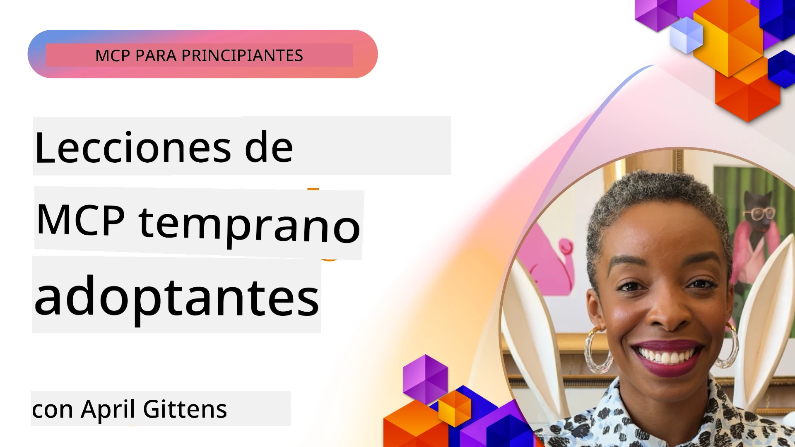

# 🌟 Lecciones de los primeros adoptantes

[](https://youtu.be/jds7dSmNptE)

_Haga clic en la imagen de arriba para ver el video de esta lección_

## 🎯 Qué cubre este módulo

Este módulo explora cómo organizaciones y desarrolladores reales están aprovechando el Protocolo de Contexto de Modelo (MCP) para resolver desafíos reales e impulsar la innovación. A través de estudios de caso detallados, proyectos prácticos y ejemplos concretos, descubrirás cómo MCP permite una integración de IA segura, escalable que conecta modelos de lenguaje, herramientas y datos empresariales.

### 📚 Ver MCP en acción

¿Quieres ver estos principios aplicados a herramientas listas para producción? Consulta nuestros [**10 Servidores Microsoft MCP que están transformando la productividad del desarrollador**](microsoft-mcp-servers.md), que muestra servidores MCP reales de Microsoft que puedes usar hoy.

## Visión general

Esta lección explora cómo los primeros adoptantes han aprovechado el Protocolo de Contexto de Modelo (MCP) para resolver desafíos del mundo real e impulsar la innovación en distintas industrias. A través de estudios de caso detallados y proyectos prácticos, verás cómo MCP habilita una integración estándar, segura y escalable de IA—conectando grandes modelos de lenguaje, herramientas y datos empresariales en un marco unificado. Obtendrás experiencia práctica diseñando y construyendo soluciones basadas en MCP, aprenderás patrones de implementación probados y descubrirás las mejores prácticas para desplegar MCP en entornos de producción. La lección también destaca tendencias emergentes, direcciones futuras y recursos open source para ayudarte a mantenerte a la vanguardia de la tecnología MCP y su ecosistema en evolución.

## Objetivos de aprendizaje

- Analizar implementaciones reales de MCP en distintas industrias
- Diseñar y construir aplicaciones completas basadas en MCP
- Explorar tendencias emergentes y direcciones futuras en tecnología MCP
- Aplicar mejores prácticas en escenarios reales de desarrollo

## Implementaciones reales de MCP

### Estudio de caso 1: Automatización del soporte al cliente en empresas

Una corporación multinacional implementó una solución basada en MCP para estandarizar las interacciones de IA en sus sistemas de soporte al cliente. Esto les permitió:

- Crear una interfaz unificada para múltiples proveedores de modelos de lenguaje
- Mantener una gestión coherente de prompts entre departamentos
- Implementar controles robustos de seguridad y cumplimiento
- Cambiar fácilmente entre diferentes modelos de IA según necesidades específicas

**Implementación técnica:**

```python
# Implementación del servidor MCP de Python para soporte al cliente
import logging
import asyncio
from modelcontextprotocol import create_server, ServerConfig
from modelcontextprotocol.server import MCPServer
from modelcontextprotocol.transports import create_http_transport
from modelcontextprotocol.resources import ResourceDefinition
from modelcontextprotocol.prompts import PromptDefinition
from modelcontextprotocol.tool import ToolDefinition

# Configurar el registro de eventos
logging.basicConfig(level=logging.INFO)

async def main():
    # Crear configuración del servidor
    config = ServerConfig(
        name="Enterprise Customer Support Server",
        version="1.0.0",
        description="MCP server for handling customer support inquiries"
    )
    
    # Inicializar el servidor MCP
    server = create_server(config)
    
    # Registrar recursos de la base de conocimientos
    server.resources.register(
        ResourceDefinition(
            name="customer_kb",
            description="Customer knowledge base documentation"
        ),
        lambda params: get_customer_documentation(params)
    )
    
    # Registrar plantillas de indicaciones
    server.prompts.register(
        PromptDefinition(
            name="support_template",
            description="Templates for customer support responses"
        ),
        lambda params: get_support_templates(params)
    )
    
    # Registrar herramientas de soporte
    server.tools.register(
        ToolDefinition(
            name="ticketing",
            description="Create and update support tickets"
        ),
        handle_ticketing_operations
    )
    
    # Iniciar el servidor con transporte HTTP
    transport = create_http_transport(port=8080)
    await server.run(transport)

if __name__ == "__main__":
    asyncio.run(main())
```

**Resultados:** Reducción del 30% en costos de modelos, mejora del 45% en la consistencia de respuestas y mayor cumplimiento en operaciones globales.

### Estudio de caso 2: Asistente diagnóstico en salud

Un proveedor de salud desarrolló una infraestructura MCP para integrar múltiples modelos médicos especializados de IA asegurando la protección de datos sensibles de pacientes:

- Cambio fluido entre modelos médicos generalistas y especialistas
- Controles estrictos de privacidad y auditorías
- Integración con sistemas existentes de Registros Electrónicos de Salud (EHR)
- Ingeniería de prompts consistente para terminología médica

**Implementación técnica:**

```csharp
// C# MCP host application implementation in healthcare application
using Microsoft.Extensions.DependencyInjection;
using ModelContextProtocol.SDK.Client;
using ModelContextProtocol.SDK.Security;
using ModelContextProtocol.SDK.Resources;

public class DiagnosticAssistant
{
    private readonly MCPHostClient _mcpClient;
    private readonly PatientContext _patientContext;
    
    public DiagnosticAssistant(PatientContext patientContext)
    {
        _patientContext = patientContext;
        
        // Configure MCP client with healthcare-specific settings
        var clientOptions = new ClientOptions
        {
            Name = "Healthcare Diagnostic Assistant",
            Version = "1.0.0",
            Security = new SecurityOptions
            {
                Encryption = EncryptionLevel.Medical,
                AuditEnabled = true
            }
        };
        
        _mcpClient = new MCPHostClientBuilder()
            .WithOptions(clientOptions)
            .WithTransport(new HttpTransport("https://healthcare-mcp.example.org"))
            .WithAuthentication(new HIPAACompliantAuthProvider())
            .Build();
    }
    
    public async Task<DiagnosticSuggestion> GetDiagnosticAssistance(
        string symptoms, string patientHistory)
    {
        // Create request with appropriate resources and tool access
        var resourceRequest = new ResourceRequest
        {
            Name = "patient_records",
            Parameters = new Dictionary<string, object>
            {
                ["patientId"] = _patientContext.PatientId,
                ["requestingProvider"] = _patientContext.ProviderId
            }
        };
        
        // Request diagnostic assistance using appropriate prompt
        var response = await _mcpClient.SendPromptRequestAsync(
            promptName: "diagnostic_assistance",
            parameters: new Dictionary<string, object>
            {
                ["symptoms"] = symptoms,
                patientHistory = patientHistory,
                relevantGuidelines = _patientContext.GetRelevantGuidelines()
            });
            
        return DiagnosticSuggestion.FromMCPResponse(response);
    }
}
```

**Resultados:** Mejoras en sugerencias diagnósticas para médicos manteniendo pleno cumplimiento HIPAA y significativa reducción en el cambio de contexto entre sistemas.

### Estudio de caso 3: Análisis de riesgo en servicios financieros

Una institución financiera implementó MCP para estandarizar sus procesos de análisis de riesgo en distintos departamentos:

- Creó una interfaz unificada para modelos de riesgo de crédito, detección de fraude y riesgo de inversión
- Implementó controles estrictos de acceso y versionado de modelos
- Aseguró la auditabilidad de todas las recomendaciones de IA
- Mantuvo un formato de datos consistente entre sistemas diversos

**Implementación técnica:**

```java
// Servidor MCP Java para evaluación de riesgo financiero
import org.mcp.server.*;
import org.mcp.security.*;

public class FinancialRiskMCPServer {
    public static void main(String[] args) {
        // Crear servidor MCP con funciones de cumplimiento financiero
        MCPServer server = new MCPServerBuilder()
            .withModelProviders(
                new ModelProvider("risk-assessment-primary", new AzureOpenAIProvider()),
                new ModelProvider("risk-assessment-audit", new LocalLlamaProvider())
            )
            .withPromptTemplateDirectory("./compliance/templates")
            .withAccessControls(new SOCCompliantAccessControl())
            .withDataEncryption(EncryptionStandard.FINANCIAL_GRADE)
            .withVersionControl(true)
            .withAuditLogging(new DatabaseAuditLogger())
            .build();
            
        server.addRequestValidator(new FinancialDataValidator());
        server.addResponseFilter(new PII_RedactionFilter());
        
        server.start(9000);
        
        System.out.println("Financial Risk MCP Server running on port 9000");
    }
}
```

**Resultados:** Mejor cumplimiento regulatorio, ciclos de despliegue de modelos un 40% más rápidos y mejor consistencia en la evaluación de riesgos entre departamentos.

### Estudio de caso 4: Servidor MCP Microsoft Playwright para automatización de navegador

Microsoft desarrolló el [servidor MCP Playwright](https://github.com/microsoft/playwright-mcp) para habilitar la automatización segura y estandarizada de navegadores mediante el Protocolo de Contexto de Modelo. Este servidor listo para producción permite que agentes de IA y modelos de lenguaje interactúen con navegadores web de forma controlada, auditada y extensible—permitiendo casos de uso como pruebas web automatizadas, extracción de datos y flujos de trabajo de extremo a extremo.

> **🎯 Herramienta lista para producción**
> 
> Este estudio de caso muestra un servidor MCP real que puedes usar hoy! Aprende más sobre el servidor MCP Playwright y otros 9 servidores MCP de Microsoft listos para producción en nuestra [**Guía de servidores MCP de Microsoft**](microsoft-mcp-servers.md#8--playwright-mcp-server).

**Características clave:**
- Expone capacidades de automatización de navegador (navegación, relleno de formularios, captura de pantallas, etc.) como herramientas MCP
- Implementa controles estrictos de acceso y sandboxing para prevenir acciones no autorizadas
- Proporciona registros detallados de auditoría para todas las interacciones con el navegador
- Soporta integración con Azure OpenAI y otros proveedores de LLM para automatización impulsada por agentes
- Alimenta al agente de codificación de GitHub Copilot con capacidades de navegación web

**Implementación técnica:**

```typescript
// TypeScript: Registro de herramientas de automatización del navegador Playwright en un servidor MCP
import { createServer, ToolDefinition } from 'modelcontextprotocol';
import { launch } from 'playwright';

const server = createServer({
  name: 'Playwright MCP Server',
  version: '1.0.0',
  description: 'MCP server for browser automation using Playwright'
});

// Registrar una herramienta para navegar a una URL y capturar una captura de pantalla
server.tools.register(
  new ToolDefinition({
    name: 'navigate_and_screenshot',
    description: 'Navigate to a URL and capture a screenshot',
    parameters: {
      url: { type: 'string', description: 'The URL to visit' }
    }
  }),
  async ({ url }) => {
    const browser = await launch();
    const page = await browser.newPage();
    await page.goto(url);
    const screenshot = await page.screenshot();
    await browser.close();
    return { screenshot };
  }
);

// Iniciar el servidor MCP
server.listen(8080);
```

**Resultados:**

- Habilitó automatización segura y programática de navegadores para agentes de IA y LLMs
- Redujo el esfuerzo de pruebas manuales y mejoró la cobertura en pruebas de aplicaciones web
- Proporcionó un marco reutilizable y extensible para la integración de herramientas basadas en navegador en entornos empresariales
- Alimenta las capacidades de navegación web de GitHub Copilot

**Referencias:**

- [Repositorio Playwright MCP Server en GitHub](https://github.com/microsoft/playwright-mcp)
- [Soluciones de IA y Automatización de Microsoft](https://azure.microsoft.com/en-us/products/ai-services/)

### Estudio de caso 5: Azure MCP – Protocolo de Contexto de Modelo Empresarial como Servicio

El Servidor Azure MCP ([https://aka.ms/azmcp](https://aka.ms/azmcp)) es la implementación gestionada y empresarial de Microsoft del Protocolo de Contexto de Modelo, diseñado para proporcionar capacidades de servidor MCP escalables, seguras y compatibles como servicio en la nube. Azure MCP permite a las organizaciones desplegar, gestionar e integrar rápidamente servidores MCP con servicios de Azure AI, datos y seguridad, reduciendo la carga operacional y acelerando la adopción de IA.

> **🎯 Herramienta lista para producción**
> 
> Este es un servidor MCP real que puedes usar hoy! Aprende más sobre el Microsoft Foundry MCP Server en nuestra [**Guía de servidores MCP de Microsoft**](microsoft-mcp-servers.md).


- Hospedaje completamente gestionado de servidores MCP con escalabilidad, monitorización y seguridad integradas
- Integración nativa con Azure OpenAI, Azure AI Search y otros servicios de Azure
- Autenticación y autorización empresarial vía Microsoft Entra ID
- Soporte para herramientas personalizadas, plantillas de prompts y conectores de recursos
- Cumplimiento con requisitos de seguridad y regulaciones empresariales

**Implementación técnica:**

```yaml
# Example: Azure MCP server deployment configuration (YAML)
apiVersion: mcp.microsoft.com/v1
kind: McpServer
metadata:
  name: enterprise-mcp-server
spec:
  modelProviders:
    - name: azure-openai
      type: AzureOpenAI
      endpoint: https://<your-openai-resource>.openai.azure.com/
      apiKeySecret: <your-azure-keyvault-secret>
  tools:
    - name: document_search
      type: AzureAISearch
      endpoint: https://<your-search-resource>.search.windows.net/
      apiKeySecret: <your-azure-keyvault-secret>
  authentication:
    type: EntraID
    tenantId: <your-tenant-id>
  monitoring:
    enabled: true
    logAnalyticsWorkspace: <your-log-analytics-id>
```

**Resultados:**  
- Reducción del tiempo para obtener valor en proyectos de IA empresarial al proveer una plataforma MCP lista para usar y compatible
- Integración simplificada de LLMs, herramientas y fuentes de datos empresariales
- Mayor seguridad, observabilidad y eficiencia operativa para cargas MCP
- Mejor calidad de código con las mejores prácticas del SDK de Azure y patrones de autenticación actuales

**Referencias:**  
- [Documentación de Azure MCP](https://aka.ms/azmcp)
- [Repositorio Azure MCP Server en GitHub](https://github.com/Azure/azure-mcp)
- [Servicios de IA de Azure](https://azure.microsoft.com/en-us/products/ai-services/)
- [Centro Microsoft MCP](https://mcp.azure.com)

## Estudio de caso 6: NLWeb 
MCP (Protocolo de Contexto de Modelo) es un protocolo emergente para que chatbots y asistentes de IA interactúen con herramientas. Cada instancia NLWeb es también un servidor MCP, que soporta un método principal, ask, usado para realizar una pregunta a un sitio web en lenguaje natural. La respuesta devuelta aprovecha schema.org, un vocabulario ampliamente usado para describir datos web. En términos simples, MCP es a NLWeb lo que Http es a HTML. NLWeb combina protocolos, formatos de schema.org y código de ejemplo para ayudar a los sitios a crear rápidamente estos endpoints, beneficiando tanto a humanos mediante interfaces conversacionales como a máquinas mediante interacción natural agente a agente.

Hay dos componentes distintos en NLWeb.
- Un protocolo, muy sencillo para empezar, para interactuar con un sitio en lenguaje natural y un formato que usa json y schema.org para la respuesta devuelta. Consulta la documentación sobre la API REST para más detalles.
- Una implementación sencilla de (1) que aprovecha markup existente, para sitios que pueden ser abstraídos como listas de ítems (productos, recetas, atracciones, reseñas, etc.). Junto con un conjunto de widgets de interfaz de usuario, los sitios pueden proporcionar fácilmente interfaces conversacionales para su contenido. Consulta la documentación sobre Life of a chat query para más detalles de cómo funciona.
 
**Referencias:**  
- [Documentación Azure MCP](https://aka.ms/azmcp)
- [NLWeb](https://github.com/microsoft/NlWeb)

### Estudio de caso 7: Servidor MCP Microsoft Foundry – Integración de agentes de IA empresariales

Los servidores Microsoft Foundry MCP demuestran cómo MCP puede usarse para orquestar y gestionar agentes de IA y flujos de trabajo en entornos empresariales. Al integrar MCP con Microsoft Foundry, las organizaciones pueden estandarizar interacciones de agentes, aprovechar la gestión de flujos de trabajo de Foundry y asegurar despliegues seguros y escalables.

> **🎯 Herramienta lista para producción**
> 
> Este es un servidor MCP real que puedes usar hoy! Aprende más sobre el Microsoft Foundry MCP Server en nuestra [**Guía de servidores MCP de Microsoft**](microsoft-mcp-servers.md#9--microsoft-foundry-mcp-server).

**Características clave:**
- Acceso integral al ecosistema de IA de Azure, incluyendo catálogos de modelos y gestión de despliegues
- Indexado de conocimiento con Azure AI Search para aplicaciones RAG
- Herramientas de evaluación para desempeño y aseguramiento de calidad de modelos de IA
- Integración con Microsoft Foundry Catalog y Labs para modelos de investigación de vanguardia
- Capacidades de gestión y evaluación de agentes para escenarios de producción

**Resultados:**
- Prototipado rápido y monitoreo robusto de flujos de trabajo de agentes de IA
- Integración fluida con servicios Azure AI para escenarios avanzados
- Interfaz unificada para construir, desplegar y monitorear pipelines de agentes
- Mejoras en seguridad, cumplimiento y eficiencia operativa para empresas
- Aceleró la adopción de IA manteniendo control sobre procesos complejos impulsados por agentes

**Referencias:**
- [Repositorio Microsoft Foundry MCP Server en GitHub](https://github.com/azure-ai-foundry/mcp-foundry)
- [Integración de agentes Azure AI con MCP (blog Microsoft Foundry)](https://devblogs.microsoft.com/foundry/integrating-azure-ai-agents-mcp/)

### Estudio de caso 8: Foundry MCP Playground – Experimentación y prototipado

Foundry MCP Playground ofrece un entorno listo para usar para experimentar con servidores MCP e integraciones de Microsoft Foundry. Los desarrolladores pueden prototipar rápidamente, probar y evaluar modelos de IA y flujos de agentes usando recursos del catálogo y labs de Microsoft Foundry. El playground simplifica la configuración, proporciona proyectos de ejemplo y soporta desarrollo colaborativo, facilitando explorar mejores prácticas y nuevos escenarios con poca complejidad. Es especialmente útil para equipos que quieren validar ideas, compartir experimentos y acelerar el aprendizaje sin necesidad de infraestructura compleja. Al bajar la barrera de entrada, el playground fomenta la innovación y contribuciones comunitarias en el ecosistema MCP y Microsoft Foundry.

**Referencias:**

- [Repositorio Foundry MCP Playground en GitHub](https://github.com/azure-ai-foundry/foundry-mcp-playground)

### Estudio de caso 9: Servidor MCP Microsoft Learn Docs – Acceso a documentación potenciado por IA

El servidor MCP Microsoft Learn Docs es un servicio alojado en la nube que ofrece a asistentes de IA acceso en tiempo real a documentación oficial de Microsoft a través del Protocolo de Contexto de Modelo. Este servidor listo para producción se conecta al ecosistema completo de Microsoft Learn y habilita búsqueda semántica entre todas las fuentes oficiales de Microsoft.

> **🎯 Herramienta lista para producción**
> 
> Este es un servidor MCP real que puedes usar hoy! Aprende más sobre el servidor MCP Microsoft Learn Docs en nuestra [**Guía de servidores MCP de Microsoft**](microsoft-mcp-servers.md#1--microsoft-learn-docs-mcp-server).

**Características clave:**
- Acceso en tiempo real a documentación oficial de Microsoft, docs de Azure y documentación de Microsoft 365
- Capacidades avanzadas de búsqueda semántica que entienden contexto e intención
- Información siempre actualizada a medida que se publica contenido en Microsoft Learn
- Cobertura completa en Microsoft Learn, documentación Azure y fuentes de Microsoft 365
- Retorna hasta 10 fragmentos de contenido de alta calidad con títulos de artículos y URLs

**Por qué es crítico:**
- Resuelve el problema del "conocimiento de IA desactualizado" para tecnologías Microsoft
- Asegura que asistentes de IA tengan acceso a las últimas características de .NET, C#, Azure y Microsoft 365
- Proporciona información autorizada y de primera mano para generación precisa de código
- Esencial para desarrolladores que trabajan con tecnologías Microsoft en rápida evolución

**Resultados:**
- Mejoró drásticamente la precisión del código generado por IA para tecnologías Microsoft
- Redujo el tiempo empleado en buscar documentación actual y mejores prácticas
- Aumentó la productividad del desarrollador con recuperación de documentación contextual
- Integración fluida con flujos de trabajo de desarrollo sin salir del IDE

**Referencias:**
- [Repositorio MCP Server Microsoft Learn Docs en GitHub](https://github.com/MicrosoftDocs/mcp)
- [Documentación Microsoft Learn](https://learn.microsoft.com/)

## Proyectos prácticos

### Proyecto 1: Construir un servidor MCP multi-proveedor

**Objetivo:** Crear un servidor MCP que pueda enrutar solicitudes a múltiples proveedores de modelos de IA según criterios específicos.

**Requisitos:**

- Soportar al menos tres proveedores de modelos distintos (p. ej., OpenAI, Anthropic, modelos locales)
- Implementar un mecanismo de enrutamiento basado en metadatos de solicitudes
- Crear un sistema de configuración para gestionar credenciales de proveedores
- Añadir caché para optimizar rendimiento y costos
- Construir un panel simple para monitorear el uso

**Pasos de implementación:**

1. Configurar la infraestructura básica del servidor MCP
2. Implementar adaptadores de proveedor para cada servicio de modelo de IA
3. Crear la lógica de enrutamiento basada en atributos de la solicitud
4. Añadir mecanismos de caché para solicitudes frecuentes
5. Desarrollar el panel de monitoreo
6. Probar con diversos patrones de solicitud

**Tecnologías:** Elegir entre Python (.NET/Java/Python según preferencia), Redis para caching y un framework web simple para el panel.

### Proyecto 2: Sistema empresarial de gestión de prompts

**Objetivo:** Desarrollar un sistema basado en MCP para gestionar, versionar y desplegar plantillas de prompts en una organización.

**Requisitos:**


- Crear un repositorio centralizado para plantillas de prompts
- Implementar control de versiones y flujos de aprobación
- Construir capacidades de prueba de plantillas con entradas de ejemplo
- Desarrollar controles de acceso basados en roles
- Crear una API para la recuperación y despliegue de plantillas

**Pasos de Implementación:**

1. Diseñar el esquema de base de datos para el almacenamiento de plantillas
2. Crear la API principal para operaciones CRUD de plantillas
3. Implementar el sistema de control de versiones
4. Construir el flujo de trabajo de aprobación
5. Desarrollar el marco de pruebas
6. Crear una interfaz web sencilla para la gestión
7. Integrar con un servidor MCP

**Tecnologías:** Tu elección de framework backend, base de datos SQL o NoSQL, y un framework frontend para la interfaz de gestión.

### Proyecto 3: Plataforma de Generación de Contenidos Basada en MCP

**Objetivo:** Construir una plataforma de generación de contenido que aproveche MCP para proporcionar resultados consistentes en diferentes tipos de contenido.

**Requisitos:**

- Soporte para múltiples formatos de contenido (publicaciones de blog, redes sociales, copias de marketing)
- Implementar generación basada en plantillas con opciones de personalización
- Crear un sistema de revisión y retroalimentación de contenido
- Rastrear métricas de rendimiento del contenido
- Soportar versionado e iteración de contenido

**Pasos de Implementación:**

1. Configurar la infraestructura cliente MCP
2. Crear plantillas para diferentes tipos de contenido
3. Construir la cadena de generación de contenido
4. Implementar el sistema de revisión
5. Desarrollar el sistema de seguimiento de métricas
6. Crear una interfaz de usuario para la gestión de plantillas y generación de contenido

**Tecnologías:** Tu lenguaje de programación preferido, framework web y sistema de base de datos.

## Direcciones Futuras para la Tecnología MCP

### Tendencias Emergentes

1. **MCP Multimodal**
   - Expansión de MCP para estandarizar interacciones con modelos de imagen, audio y video
   - Desarrollo de capacidades de razonamiento cross-modal
   - Formatos de prompt estandarizados para diferentes modalidades

2. **Infraestructura MCP Federada**
   - Redes MCP distribuidas que pueden compartir recursos entre organizaciones
   - Protocolos estandarizados para compartir modelos de forma segura
   - Técnicas de cómputo que preservan la privacidad

3. **Mercados MCP**
   - Ecosistemas para compartir y monetizar plantillas y complementos MCP
   - Procesos de aseguramiento de calidad y certificación
   - Integración con mercados de modelos

4. **MCP para Edge Computing**
   - Adaptación de estándares MCP para dispositivos edge con recursos limitados
   - Protocolos optimizados para entornos de baja ancho de banda
   - Implementaciones MCP especializadas para ecosistemas IoT

5. **Marcos Regulatorios**
   - Desarrollo de extensiones MCP para cumplimiento regulatorio
   - Registros de auditoría estandarizados e interfaces de explicabilidad
   - Integración con marcos emergentes de gobernanza de IA

### Soluciones MCP de Microsoft

Microsoft y Azure han desarrollado varios repositorios de código abierto para ayudar a los desarrolladores a implementar MCP en varios escenarios:

#### Organización Microsoft

1. [playwright-mcp](https://github.com/microsoft/playwright-mcp) - Un servidor MCP Playwright para automatización y pruebas de navegador
2. [files-mcp-server](https://github.com/microsoft/files-mcp-server) - Implementación de servidor MCP para OneDrive para pruebas locales y contribución comunitaria
3. [NLWeb](https://github.com/microsoft/NlWeb) - NLWeb es una colección de protocolos abiertos y herramientas de código abierto asociadas. Su enfoque principal es establecer una capa fundamental para la web de IA

#### Organización Azure-Samples

1. [mcp](https://github.com/Azure-Samples/mcp) - Enlaces a ejemplos, herramientas y recursos para construir e integrar servidores MCP en Azure usando múltiples lenguajes
2. [mcp-auth-servers](https://github.com/Azure-Samples/mcp-auth-servers) - Servidores MCP de referencia que demuestran autenticación con la especificación actual del Model Context Protocol
3. [remote-mcp-functions](https://github.com/Azure-Samples/remote-mcp-functions) - Página principal para implementaciones de servidores MCP remotos en Azure Functions con enlaces a repositorios específicos por lenguaje
4. [remote-mcp-functions-python](https://github.com/Azure-Samples/remote-mcp-functions-python) - Plantilla de inicio rápido para construir y desplegar servidores MCP remotos personalizados usando Azure Functions con Python
5. [remote-mcp-functions-dotnet](https://github.com/Azure-Samples/remote-mcp-functions-dotnet) - Plantilla de inicio rápido para construir y desplegar servidores MCP remotos personalizados usando Azure Functions con .NET/C#
6. [remote-mcp-functions-typescript](https://github.com/Azure-Samples/remote-mcp-functions-typescript) - Plantilla de inicio rápido para construir y desplegar servidores MCP remotos personalizados usando Azure Functions con TypeScript
7. [remote-mcp-apim-functions-python](https://github.com/Azure-Samples/remote-mcp-apim-functions-python) - Azure API Management como puerta de enlace AI para servidores MCP remotos usando Python
8. [AI-Gateway](https://github.com/Azure-Samples/AI-Gateway) - Experimentos APIM ❤️ AI que incluyen capacidades MCP, integrándose con Azure OpenAI y AI Foundry

Estos repositorios proveen diversas implementaciones, plantillas y recursos para trabajar con el Model Context Protocol a través de distintos lenguajes de programación y servicios de Azure. Cubren una variedad de casos de uso desde implementaciones básicas de servidores hasta autenticación, despliegue en la nube y escenarios de integración empresarial.

#### Directorio de Recursos MCP

El [directorio de Recursos MCP](https://github.com/microsoft/mcp/tree/main/Resources) en el repositorio oficial MCP de Microsoft proporciona una colección seleccionada de recursos de ejemplo, plantillas de prompts y definiciones de herramientas para uso con servidores Model Context Protocol. Este directorio está diseñado para ayudar a los desarrolladores a iniciar rápidamente con MCP ofreciendo bloques reutilizables y ejemplos de mejores prácticas para:

- **Plantillas de Prompt:** Plantillas de prompt listas para usar para tareas y escenarios comunes de IA, que pueden adaptarse para tus propias implementaciones de servidores MCP.
- **Definiciones de Herramientas:** Esquemas de herramientas de ejemplo y metadatos para estandarizar la integración e invocación de herramientas a través de distintos servidores MCP.
- **Recursos de Ejemplo:** Definiciones de recursos de ejemplo para conectar a fuentes de datos, API y servicios externos dentro del marco MCP.
- **Implementaciones de Referencia:** Ejemplos prácticos que demuestran cómo estructurar y organizar recursos, prompts y herramientas en proyectos MCP del mundo real.

Estos recursos aceleran el desarrollo, promueven la estandarización y ayudan a asegurar las mejores prácticas al construir y desplegar soluciones basadas en MCP.

#### Directorio de Recursos MCP

- [Recursos MCP (Prompts de ejemplo, Herramientas y Definiciones de Recursos)](https://github.com/microsoft/mcp/tree/main/Resources)

### Oportunidades de Investigación

- Técnicas eficientes de optimización de prompt dentro de marcos MCP
- Modelos de seguridad para implementaciones MCP multiinquilino
- Evaluación de rendimiento entre diferentes implementaciones MCP
- Métodos de verificación formal para servidores MCP

## Conclusión

El Model Context Protocol (MCP) está moldeando rápidamente el futuro de la integración estándar, segura e interoperable de IA a través de industrias. A través de los estudios de caso y proyectos prácticos en esta lección, has visto cómo adoptantes tempranos—incluyendo Microsoft y Azure—aprovechan MCP para resolver desafíos del mundo real, acelerar la adopción de IA y asegurar cumplimiento, seguridad y escalabilidad. El enfoque modular de MCP permite que las organizaciones conecten grandes modelos de lenguaje, herramientas y datos empresariales en un marco unificado y auditable. A medida que MCP continúa evolucionando, mantenerse comprometido con la comunidad, explorar recursos de código abierto y aplicar mejores prácticas será clave para construir soluciones de IA robustas y preparadas para el futuro.

## Recursos Adicionales

- [Repositorio MCP Foundry en GitHub](https://github.com/azure-ai-foundry/mcp-foundry)
- [Foundry MCP Playground](https://github.com/azure-ai-foundry/foundry-mcp-playground)
- [Integración de Agentes AI de Azure con MCP (Blog Microsoft Foundry)](https://devblogs.microsoft.com/foundry/integrating-azure-ai-agents-mcp/)
- [Repositorio MCP en GitHub (Microsoft)](https://github.com/microsoft/mcp)
- [Directorio de Recursos MCP (Prompts, Herramientas y Definiciones de Recursos)](https://github.com/microsoft/mcp/tree/main/Resources)
- [Comunidad y Documentación MCP](https://modelcontextprotocol.io/introduction)
- [Especificación MCP (2026-07-28)](https://modelcontextprotocol.io/specification/2026-07-28/)
- [Documentación MCP en Azure](https://aka.ms/azmcp)
- [OWASP MCP Top 10](https://microsoft.github.io/mcp-azure-security-guide/mcp/) - Mejores prácticas de seguridad
- [Repositorio Playwright MCP Server en GitHub](https://github.com/microsoft/playwright-mcp)
- [Servidor MCP Files (OneDrive)](https://github.com/microsoft/files-mcp-server)
- [Azure-Samples MCP](https://github.com/Azure-Samples/mcp)
- [Servidores Auth MCP (Azure-Samples)](https://github.com/Azure-Samples/mcp-auth-servers)
- [Funciones MCP Remotas (Azure-Samples)](https://github.com/Azure-Samples/remote-mcp-functions)
- [Funciones MCP Remotas Python (Azure-Samples)](https://github.com/Azure-Samples/remote-mcp-functions-python)
- [Funciones MCP Remotas .NET (Azure-Samples)](https://github.com/Azure-Samples/remote-mcp-functions-dotnet)
- [Funciones MCP Remotas TypeScript (Azure-Samples)](https://github.com/Azure-Samples/remote-mcp-functions-typescript)
- [Funciones MCP APIM Remotas Python (Azure-Samples)](https://github.com/Azure-Samples/remote-mcp-apim-functions-python)
- [AI-Gateway (Azure-Samples)](https://github.com/Azure-Samples/AI-Gateway)
- [Soluciones de IA y Automatización de Microsoft](https://azure.microsoft.com/en-us/products/ai-services/)

## Ejercicios

1. Analiza uno de los estudios de caso y propone un enfoque alternativo de implementación.
2. Elige una de las ideas de proyecto y crea una especificación técnica detallada.
3. Investiga una industria no cubierta en los estudios de caso y esboza cómo MCP podría abordar sus desafíos específicos.
4. Explora una de las direcciones futuras y crea un concepto para una nueva extensión MCP que la soporte.

## ¿Qué sigue?

Explora más: [Servidores MCP de Microsoft](./microsoft-mcp-servers.md)

Continúa a: [Módulo 8: Mejores Prácticas](../08-BestPractices/README.md)

---

<!-- CO-OP TRANSLATOR DISCLAIMER START -->
**Descargo de responsabilidad**:
Este documento ha sido traducido utilizando el servicio de traducción automática [Co-op Translator](https://github.com/Azure/co-op-translator). Aunque nos esforzamos por la precisión, tenga en cuenta que las traducciones automatizadas pueden contener errores o inexactitudes. El documento original en su idioma nativo debe considerarse la fuente autorizada. Para información crítica, se recomienda una traducción profesional humana. No somos responsables de cualquier malentendido o interpretación errónea que surja del uso de esta traducción.
<!-- CO-OP TRANSLATOR DISCLAIMER END -->