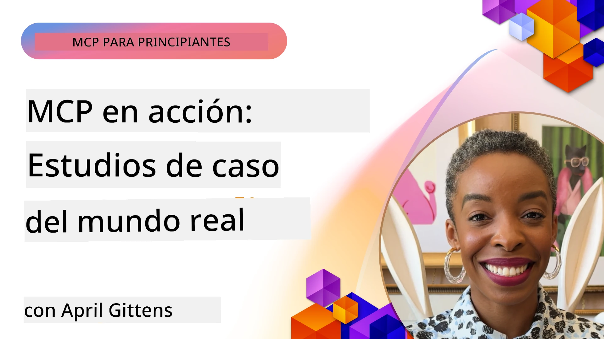

# MCP en Acción: Estudios de Caso del Mundo Real

_(Haz clic en la imagen de arriba para ver el video de esta lección)_

El Protocolo de Contexto de Modelo (MCP) está transformando la forma en que las aplicaciones de IA interactúan con datos, herramientas y servicios. Esta sección presenta estudios de caso del mundo real que demuestran aplicaciones prácticas de MCP en varios escenarios empresariales.

## Resumen

Esta sección muestra ejemplos concretos de implementaciones de MCP, destacando cómo las organizaciones están aprovechando este protocolo para resolver desafíos empresariales complejos. Al examinar estos estudios de caso, obtendrás conocimientos sobre la versatilidad, escalabilidad y beneficios prácticos de MCP en escenarios del mundo real.

## Objetivos Clave de Aprendizaje

Al explorar estos estudios de caso, usted:

- Comprenderá cómo se puede aplicar MCP para resolver problemas específicos de negocios
- Aprenderá sobre diferentes patrones de integración y enfoques arquitectónicos
- Reconocerá las mejores prácticas para implementar MCP en entornos empresariales
- Obtendrá perspectivas sobre los desafíos y soluciones encontrados en implementaciones reales
- Identificará oportunidades para aplicar patrones similares en sus propios proyectos

## Estudios de Caso Destacados

### 1. [Agentes de Viaje de Azure AI – Implementación de Referencia](./travelagentsample.md)

Este estudio de caso examina la solución de referencia completa de Microsoft que demuestra cómo construir una aplicación de planificación de viajes con múltiples agentes impulsados por IA utilizando MCP, Azure OpenAI y Azure AI Search. El proyecto presenta:

- Orquestación multi-agente a través de MCP
- Integración de datos empresariales con Azure AI Search
- Arquitectura segura y escalable usando servicios de Azure
- Herramientas extensibles con componentes MCP reutilizables
- Experiencia conversacional para usuarios impulsada por Azure OpenAI

La arquitectura y los detalles de implementación proporcionan valiosas perspectivas sobre cómo construir sistemas complejos con múltiples agentes usando MCP como la capa de coordinación.

### 2. [Actualización de Elementos de Azure DevOps desde Datos de YouTube](./UpdateADOItemsFromYT.md)

Este estudio de caso demuestra una aplicación práctica de MCP para automatizar procesos de flujo de trabajo. Muestra cómo se pueden usar las herramientas MCP para:

- Extraer datos de plataformas online (YouTube)
- Actualizar elementos de trabajo en sistemas de Azure DevOps
- Crear flujos de automatización repetibles
- Integrar datos entre sistemas dispares

Este ejemplo ilustra cómo incluso implementaciones relativamente simples de MCP pueden proporcionar importantes ganancias de eficiencia al automatizar tareas rutinarias y mejorar la consistencia de datos entre sistemas.

### 3. [Recuperación de Documentación en Tiempo Real con MCP](./docs-mcp/README.md)

Este estudio de caso te guía para conectar un cliente de consola Python a un servidor Model Context Protocol (MCP) para recuperar y registrar documentación de Microsoft contextual en tiempo real. Aprenderás a:

- Conectarte a un servidor MCP usando un cliente Python y el SDK oficial de MCP
- Usar clientes HTTP por streaming para recuperación eficiente y en tiempo real de datos
- Llamar a herramientas de documentación en el servidor y registrar respuestas directamente en la consola
- Integrar la documentación actualizada de Microsoft en tu flujo de trabajo sin salir de la terminal

El capítulo incluye una tarea práctica, un ejemplo mínimo funcional de código y enlaces a recursos adicionales para un aprendizaje más profundo. Consulta el recorrido completo y el código en el capítulo vinculado para comprender cómo MCP puede transformar el acceso a la documentación y la productividad del desarrollador en entornos basados en consola.

### 4. [Generador Interactivo de Planes de Estudio Web con MCP](./docs-mcp/README.md)

Este estudio de caso demuestra cómo construir una aplicación web interactiva usando Chainlit y el Protocolo de Contexto de Modelo (MCP) para generar planes de estudio personalizados sobre cualquier tema. Los usuarios pueden especificar una materia (como "certificación AI-900") y una duración de estudio (por ejemplo, 8 semanas), y la aplicación proporcionará un desglose por semana del contenido recomendado. Chainlit habilita una interfaz conversacional de chat, haciendo la experiencia atractiva y adaptable.

- Aplicación web conversacional impulsada por Chainlit
- Solicitudes impulsadas por el usuario para tema y duración
- Recomendaciones de contenido semana a semana usando MCP
- Respuestas adaptativas en tiempo real en una interfaz de chat

El proyecto ilustra cómo la IA conversacional y MCP pueden combinarse para crear herramientas educativas dinámicas e interactivas en un entorno web moderno.

### 5. [Documentación en el Editor con Servidor MCP en VS Code](./docs-mcp/README.md)

Este estudio de caso demuestra cómo puedes llevar la documentación de Microsoft Learn directamente a tu entorno VS Code usando el servidor MCP—¡sin cambiar pestañas del navegador! Verás cómo:

- Buscar y leer documentos instantáneamente dentro de VS Code usando el panel MCP o la paleta de comandos
- Referenciar documentación e insertar enlaces directamente en tus archivos README o markdown de cursos
- Usar GitHub Copilot y MCP juntos para flujos de trabajo sin interrupciones impulsados por IA para documentación y código
- Validar y mejorar tu documentación con retroalimentación en tiempo real y precisión provista por Microsoft
- Integrar MCP con flujos de trabajo de GitHub para validación continua de documentación

La implementación incluye:

- Configuración de ejemplo `.vscode/mcp.json` para una configuración sencilla
- Recorridos basados en capturas de pantalla de la experiencia en el editor
- Consejos para combinar Copilot y MCP para máxima productividad

Este escenario es ideal para autores de cursos, escritores de documentación y desarrolladores que desean mantenerse concentrados en su editor mientras trabajan con documentación, Copilot y herramientas de validación, todo potenciado por MCP.

### 6. [Creación de Servidor MCP con APIM](./apimsample.md)

Este estudio de caso proporciona una guía paso a paso sobre cómo crear un servidor MCP usando Azure API Management (APIM). Cubre:

- Configurar un servidor MCP en Azure API Management
- Exponer operaciones API como herramientas MCP
- Configurar políticas para limitación de tasa y seguridad
- Probar el servidor MCP usando Visual Studio Code y GitHub Copilot

Este ejemplo ilustra cómo aprovechar las capacidades de Azure para crear un servidor MCP robusto que pueda usarse en diversas aplicaciones, mejorando la integración de sistemas IA con APIs empresariales.

### 7. [Registro MCP de GitHub — Acelerando la Integración Agente](https://github.com/mcp)

Este estudio de caso examina cómo el Registro MCP de GitHub, lanzado en septiembre de 2025, aborda un desafío crítico en el ecosistema de IA: el descubrimiento y despliegue fragmentado de servidores Model Context Protocol (MCP).

#### Resumen
El **Registro MCP** soluciona el problema creciente de servidores MCP dispersos en repositorios y registros, lo que anteriormente hacía que la integración fuera lenta y propensa a errores. Estos servidores permiten a agentes de IA interactuar con sistemas externos como APIs, bases de datos y fuentes de documentación.

#### Declaración del Problema
Los desarrolladores que construyen flujos de trabajo agente enfrentaron varios desafíos:
- **Mala capacidad de descubrimiento** de servidores MCP en diferentes plataformas
- **Preguntas redundantes de configuración** dispersas en foros y documentación
- **Riesgos de seguridad** por fuentes no verificadas y no confiables
- **Falta de estandarización** en calidad y compatibilidad de servidores

#### Arquitectura de la Solución
El Registro MCP de GitHub centraliza servidores MCP confiables con características clave:
- **Instalación con un clic** vía VS Code para configuración simplificada
- **Ordenación señal-sobre-ruido** por estrellas, actividad y validación comunitaria
- **Integración directa** con GitHub Copilot y otras herramientas compatibles MCP
- **Modelo abierto de contribución** que permite aportes tanto de la comunidad como socios empresariales

#### Impacto Empresarial
El registro ha entregado mejoras medibles:
- **Incorporación más rápida** para desarrolladores usando herramientas como el Servidor MCP de Microsoft Learn, que transmite documentación oficial directamente a los agentes
- **Mayor productividad** mediante servidores especializados como `github-mcp-server`, que permite automatización de GitHub en lenguaje natural (creación de PR, reejecución de CI, escaneo de código)
- **Confianza robustecida en el ecosistema** a través de listados curados y estándares de configuración transparentes

#### Valor Estratégico
Para practicantes especializados en gestión del ciclo de vida de agentes y flujos reproducibles, el Registro MCP provee:
- **Despliegue modular de agentes** con componentes estandarizados
- **Pipelines de evaluación respaldados por el Registro** para pruebas y validaciones consistentes
- **Interoperabilidad entre herramientas** permitiendo integración fluida entre diferentes plataformas de IA

Este estudio de caso demuestra que el Registro MCP es más que un directorio—es una plataforma fundamental para la integración escalable de modelos y el despliegue de sistemas agentes en el mundo real.

### 8. [Publicación en Redes Sociales desde un Agente](./publora-social-publishing.md)

Este estudio de caso recorre un **servidor MCP remoto con capacidad de escritura** — uno cuyas herramientas realizan acciones irreversibles en nombre del usuario — usando la publicación en redes sociales como ejemplo trabajado. Un agente redacta una publicación, un humano la aprueba, y el servidor la programa en varias redes.

La parte interesante son las restricciones de diseño que impone la publicación, las cuales aplican a cualquier servidor que escriba en lugar de solo leer:

- **Descubrimiento abierto, ejecución autenticada** — `tools/list` respondido sin credenciales para que registros y clientes puedan introspectar, mientras que cada `tools/call` requiere un token y de no tenerlo devuelve `401` con encabezado `WWW-Authenticate`
- **Registro OAuth sin un paso externo** — registro dinámico de clientes hoy, con Documentos de Metadatos de ID de Cliente como la dirección que señala la especificación `2026-07-28`
- **Anotaciones de herramientas** (`readOnlyHint`, `destructiveHint`, `idempotentHint`) que los clientes usan para decidir qué confirmar — indicaciones en lugar de aplicación estricta, y algo que ahora los directorios de conectores esperan en revisión
- **Identificadores no inventables**, así un valor alucinatorio falla con un error en lugar de actuar sobre uno que parece plausible
- **Claves de idempotencia en las herramientas que crean publicaciones**, para que un reintento del runtime del agente no se convierta en una publicación duplicada
- **Un objetivo no operativo descrito en el esquema de la herramienta** que ejercita toda la ruta de escritura y no publica nada, para revisores y CI

El capítulo concluye con una breve lista de verificación que puedes aplicar a un servidor que estás construyendo.

## Conclusión

Estos ocho estudios de caso completos demuestran la notable versatilidad y aplicaciones prácticas del Protocolo de Contexto de Modelo en diversos escenarios del mundo real. Desde sistemas complejos de planificación de viajes con múltiples agentes y gestión empresarial de APIs hasta flujos de trabajo simplificados de documentación y el revolucionario Registro MCP de GitHub, estos ejemplos muestran cómo MCP proporciona una forma estandarizada y escalable de conectar sistemas de IA con las herramientas, datos y servicios que necesitan para ofrecer un valor excepcional.

Los estudios de caso abarcan múltiples dimensiones de implementación de MCP:
- **Integración Empresarial**: Gestión de API de Azure y automatización de Azure DevOps
- **Orquestación Multi-Agente**: Planificación de viajes con agentes de IA coordinados
- **Productividad del Desarrollador**: Integración en VS Code y acceso a documentación en tiempo real
- **Desarrollo del Ecosistema**: Registro MCP de GitHub como plataforma fundamental
- **Aplicaciones Educativas**: Generadores interactivos de planes de estudio e interfaces conversacionales

Al estudiar estas implementaciones, obtendrás ideas críticas sobre:
- **Patrones arquitectónicos** para diferentes escalas y casos de uso
- **Estrategias de implementación** que equilibran funcionalidad y mantenibilidad
- **Consideraciones de seguridad y escalabilidad** para despliegues en producción
- **Mejores prácticas** para el desarrollo de servidores MCP e integración de clientes
- **Pensamiento ecosistémico** para construir soluciones interconectadas alimentadas por IA

Estos ejemplos demuestran en conjunto que MCP no es solo un marco teórico, sino un protocolo maduro listo para producción que permite soluciones prácticas a desafíos empresariales complejos. Ya sea que estés construyendo herramientas simples de automatización o sistemas sofisticados con múltiples agentes, los patrones y enfoques ilustrados aquí proporcionan una base sólida para tus propios proyectos MCP.

## Recursos Adicionales

- [Repositorio GitHub de Azure AI Travel Agents](https://github.com/Azure-Samples/azure-ai-travel-agents)
- [Herramienta MCP para Azure DevOps](https://github.com/microsoft/azure-devops-mcp)
- [Herramienta MCP Playwright](https://github.com/microsoft/playwright-mcp)
- [Servidor MCP de Microsoft Docs](https://github.com/MicrosoftDocs/mcp)
- [Registro MCP de GitHub — Acelerando la Integración Agente](https://github.com/mcp)
- [Ejemplos de la Comunidad MCP](https://github.com/microsoft/mcp)

## Qué Sigue

- Anterior: [Módulo 8: Mejores Prácticas](../08-BestPractices/README.md)
- Siguiente: [Módulo 10: Optimización de Flujos de Trabajo de IA: Creación de un Servidor MCP con AI Toolkit](../10-StreamliningAIWorkflowsBuildingAnMCPServerWithAIToolkit/README.md)

---

<!-- CO-OP TRANSLATOR DISCLAIMER START -->
**Descargo de responsabilidad**:
Este documento ha sido traducido utilizando el servicio de traducción automática [Co-op Translator](https://github.com/Azure/co-op-translator). Aunque nos esforzamos por la precisión, tenga en cuenta que las traducciones automatizadas pueden contener errores o inexactitudes. El documento original en su idioma nativo debe considerarse la fuente autorizada. Para información crítica, se recomienda una traducción profesional humana. No somos responsables de cualquier malentendido o interpretación errónea que surja del uso de esta traducción.
<!-- CO-OP TRANSLATOR DISCLAIMER END -->