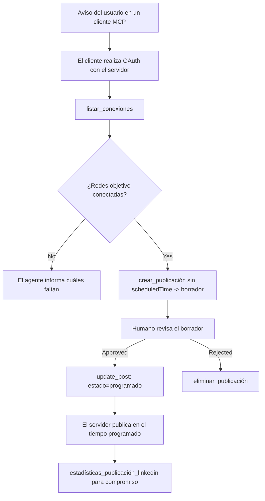

# Estudio de Caso: Publicación en Redes Sociales desde un Agente con un Servidor MCP Remoto

> **Descargo de responsabilidad:** Varios servicios y proyectos de código abierto pueden publicar en redes sociales, y un equipo también podría integrar directamente la API de cada red. El escenario a continuación se proporciona como un ejemplo trabajado de cómo se puede diseñar y consumir un **servidor MCP remoto con capacidad de escritura**. Publora es un servicio comercial con un nivel gratuito; los patrones descritos aquí se aplican a cualquier servidor MCP que realice acciones irreversibles en nombre del usuario.

## Resumen

Los agentes son buenos redactando contenido y malos entregándolo. Un modelo puede escribir un anuncio de lanzamiento en segundos, y luego el trabajo se detiene: publicarlo significa una API por red, una aplicación OAuth por red y un conjunto diferente de reglas de medios para cada una. La mayoría de los equipos resuelve esto copiando el texto manualmente en un navegador.

Este estudio de caso analiza cómo se cierra ese último paso con un solo servidor MCP remoto, y — más útil para cualquiera que esté construyendo uno — las decisiones de diseño que un servidor **con capacidad de escritura** debe acertar. Leer datos es permisivo. Publicar no lo es: una llamada errónea a la herramienta es visible para una audiencia y no puede deshacerse.

## Escenario

Un pequeño equipo de relaciones con desarrolladores redacta publicaciones dentro de un agente (Claude, VS Code, Cursor — el cliente no importa). Quieren que el agente:

- vea qué cuentas sociales tiene el equipo conectadas,
- redacte una publicación y la mantenga como borrador para que un humano la apruebe,
- adjunte una imagen,
- la programe para varias redes en un momento elegido,
- y luego informe cómo funcionó.

Lo crucial es que ellos quieren que el agente *no pueda* publicar accidentalmente mientras aún están experimentando.

## Herramientas Usadas

- [Publora MCP Server](https://github.com/publora/mcp-server) — un servidor MCP remoto (`streamable-http`) que expone herramientas para publicar, programar, medios y análisis de LinkedIn. Registrado en el registro oficial MCP como `com.publora/mcp-server`.

## Flujo de Trabajo Paso a Paso

1. **Conectar el servidor.** Los clientes que usan OAuth completan el flujo de código de autorización con PKCE contra la propia pantalla de consentimiento del servidor; los clientes que no, como los CLI sin cabeza, usan una clave API de Publora en un encabezado. Ambos caminos están soportados, y cuál se usa depende del cliente, no del servidor.
2. **Listar conexiones.** El agente llama a `list_connections` y recibe las cuentas conectadas con sus identificadores.
3. **Redactar.** El agente llama a `create_post` *sin* una hora programada. La publicación se guarda como borrador — no se publica nada.
4. **Adjuntar medios.** Se pasan URLs de imagen públicas en la misma llamada; el servidor las descarga y valida.
5. **Programar.** Tras la aprobación humana, `update_post` establece el estado a programado con una hora ISO 8601.
6. **Medir.** Para LinkedIn, `linkedin_post_stats` devuelve el compromiso una vez que la publicación está activa.

## Ejemplo de Prompt

```text
Which social accounts do I have connected?
Draft a post announcing our new changelog page, attach the screenshot at
https://example.com/changelog.png, and keep it as a draft — do not publish it.
Once I approve, schedule it to LinkedIn and Bluesky for tomorrow at 09:00 UTC.
```

## Diagrama Mermaid



## Implementación Técnica

Las lecciones a continuación son la parte transferible de este estudio de caso.

### Descubrimiento abierto, ejecución autenticada

`tools/list` se sirve sin credenciales; cada `tools/call` requiere un token y de lo contrario devuelve un `401` con un encabezado `WWW-Authenticate` que apunta a los metadatos del recurso protegido. (El servidor también responde a un `initialize` no autenticado, que solo importa para clientes con versiones de protocolo anteriores a `2026-07-28`; esa revisión eliminó completamente el handshake.)

Esta división importa en la práctica. Los registros, catálogos y clientes pueden inspeccionar la superficie de herramientas — nombres, esquemas, anotaciones — sin poseer un secreto, mientras que nada puede *ejecutarse* de forma anónima. Un servidor que exige un token para `initialize` es efectivamente invisible para las herramientas; un servidor que permite `tools/call` anónimo es una responsabilidad.

### Registro: registro dinámico del cliente y qué lo reemplaza

El servidor anuncia `/.well-known/oauth-protected-resource` y `/.well-known/oauth-authorization-server`, y soporta el flujo de código de autorización con PKCE (`S256`), tokens de actualización y **registro dinámico del cliente**.

El registro dinámico elimina el paso manual: sin él cada cliente necesita un `client_id` preemitido, lo que significa una solicitud fuera de banda al proveedor para cada cliente nuevo.

Considere esto como comportamiento de compatibilidad más que como el diseño a copiar. La revisión del 28-07-2026 de la especificación desaprueba el registro dinámico del cliente en favor de Documentos de Metadatos de ID de Cliente, donde el cliente aloja un documento de metadatos en una URL HTTPS estable y esa URL *es* el `client_id`. DCR sigue funcionando por ahora, pero un servidor que se construya hoy debe planear para CIMD y mantener DCR solo para clientes antiguos.

### Las anotaciones de herramientas no son decoración

Cada herramienta lleva un `title` y las pistas aplicables: `readOnlyHint`, `destructiveHint`, `idempotentHint`, `openWorldHint`.

Dos razones para invertir en ellas. Primero, los clientes usan las pistas para decidir qué confirmar con el usuario: un cliente puede ejecutar automáticamente una consulta solo de lectura y detenerse para pedir aprobación antes de borrar. La especificación es explícita en que las anotaciones son pistas no confiables, no un mecanismo de autorización: moldean lo que un cliente ofrece hacer, no detienen nada en el servidor, y un servidor aún debe hacer cumplir sus propias reglas. Segundo, los principales directorios de conectores ahora *las requieren* para revisión; un servidor cuyas herramientas carezcan de títulos y pistas será rechazado sin importar qué tan bien funcione.

### Hacer que los identificadores no se puedan inventar

Los identificadores de plataformas son cadenas opacas devueltas por `list_connections`, y la descripción del esquema dice explícitamente que deben copiarse literalmente y nunca suponerse. El servidor rechaza cualquier otro valor.

Los modelos son buenos para adivinar. Cualquier servidor con capacidad de escritura debe asumir que un identificador eventualmente será inventado y hacer que esa ruta falle de forma ruidosa y temprana, en lugar de actuar sobre un valor plausible.

### Fallar antes de publicar, con un mensaje accionable

Algunas redes rechazan publicaciones solo de texto y requieren una imagen o vídeo. Eso se valida cuando la publicación se programa, y el error nombra la plataforma y el requisito faltante.

Un agente puede recuperarse de "Instagram requiere medios — adjunta una imagen o vídeo" sin otro viaje de ida y vuelta. No puede recuperarse de un `400` genérico.

### Hacer que los reintentos sean seguros

Las dos herramientas que crean contenido, `create_post` y `update_post`, aceptan una clave de idempotencia: reutilizarla con una solicitud idéntica reproduce la respuesta original en lugar de crear una segunda publicación. Los tiempos de ejecución del agente reintentan en caso de timeout; sin idempotencia, una respuesta lenta se convierte en una publicación duplicada. Las otras herramientas de escritura — eliminaciones, pasos de medios, reacciones y comentarios de LinkedIn — no la aceptan, por lo que un reintento allí no es automáticamente seguro. Vale la pena saber cuáles de tus propias mutaciones están protegidas y cuáles no.

### Proporcionar una forma de probar que no publica nada

El servidor acepta un destino reservado, `publora-playground`, que es validado y reconocido como un destino real y luego descartado — nada llega a una cuenta en vivo. Está descrito en el propio esquema de la herramienta, que cualquier cliente puede leer sin credenciales: el campo `platforms` de `create_post` lo documenta como "un destino de prueba de conexión que no requiere conexión real — la publicación es reconocida y descartada, no se publica nada". Se invoca pasándolo como la única entrada: `platforms: ["publora-playground"]`.

Esto resultó ser uno de los detalles más útiles de toda la superficie. Los revisores de directorios de conectores, colaboradores y CI pueden recorrer toda la ruta de escritura de principio a fin sin riesgo para una audiencia real. Cualquier servidor MCP con acciones irreversibles se beneficia de un destino no-op documentado.

## Resultados e Impacto

- El paso de publicación se movió de un navegador a la misma conversación donde se escribe el contenido, y un hábito de borrador primero mantiene un humano en la operación. Sea preciso sobre qué es eso: un borrador es una convención, no un límite. La misma credencial puede programar o publicar, así que cualquiera que necesite una verdadera puerta de aprobación debe hacerla cumplir fuera de la superficie de la herramienta — credenciales separadas o una capa de políticas frente al servidor.
- Las diferencias por red — requisitos de medios, encadenamiento, controles de respuesta — se manejan una vez en el servidor en lugar de en cada agente que habla con él.
- El mismo servidor soporta varios clientes MCP sin trabajo por cliente, porque el descubrimiento es abierto y el registro es dinámico.
- Las restricciones de diseño anteriores fueron moldeadas tanto por las revisiones de directorios de conectores como por los usuarios: anotaciones, OAuth y un objetivo de prueba seguro fueron requeridos por al menos uno de ellos.

## Referencias

- [Publora MCP Server (fuente)](https://github.com/publora/mcp-server)
- [Documentación de Publora API y MCP](https://docs.publora.com)
- [Entrada en el registro MCP: `com.publora/mcp-server`](https://registry.modelcontextprotocol.io/v0/servers?search=com.publora/mcp-server)
- [Especificación MCP — Autorización](https://modelcontextprotocol.io/specification/draft/basic/authorization)
- [Especificación MCP — Anotaciones de herramientas](https://modelcontextprotocol.io/docs/concepts/tools)

## Qué Sigue

- Tome un servidor MCP que esté construyendo y revise las tres mejoras más baratas aquí: anotaciones en cada herramienta, una clave de idempotencia en cada escritura y un destino no-op documentado.
- Pruebe la división de descubrimiento abierto: llame a `tools/list` contra un servidor remoto público sin credenciales, luego llame a una herramienta e inspeccione el reto `401`.
- Considere qué significa "deshacer" para su dominio. La publicación tiene borradores y eliminación; si sus acciones no tienen equivalente, la confirmación pertenece al diseño de la herramienta, no al prompt.

---

<!-- CO-OP TRANSLATOR DISCLAIMER START -->
**Descargo de responsabilidad**:
Este documento ha sido traducido utilizando el servicio de traducción automática [Co-op Translator](https://github.com/Azure/co-op-translator). Aunque nos esforzamos por la precisión, tenga en cuenta que las traducciones automatizadas pueden contener errores o inexactitudes. El documento original en su idioma nativo debe considerarse la fuente autorizada. Para información crítica, se recomienda una traducción profesional humana. No somos responsables de cualquier malentendido o interpretación errónea que surja del uso de esta traducción.
<!-- CO-OP TRANSLATOR DISCLAIMER END -->