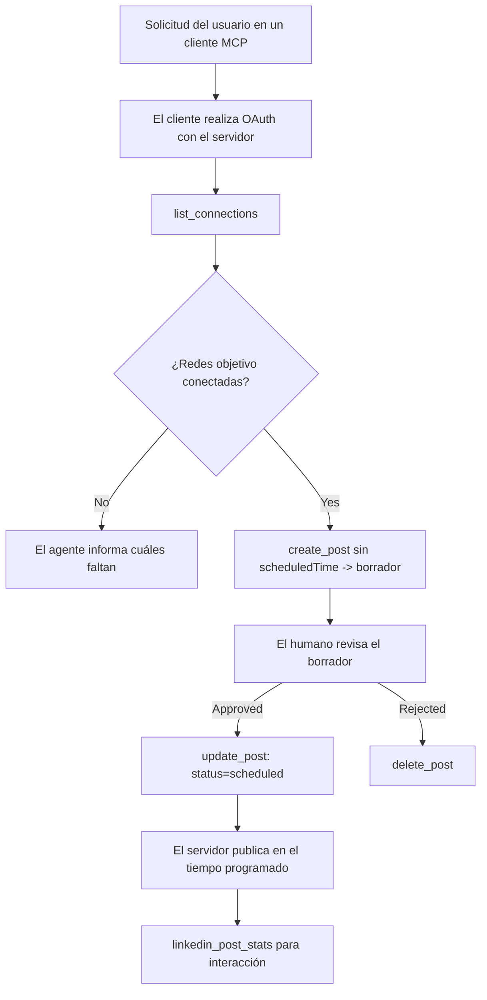

# Estudio de Caso: Publicar en Redes Sociales desde un Agente con un Servidor MCP Remoto

> **Aviso:** Varios servicios y proyectos de código abierto pueden publicar en redes sociales, y un equipo también podría integrar directamente la API de cada red. El escenario a continuación se presenta como un ejemplo trabajado de cómo se puede diseñar y consumir un **servidor MCP remoto con capacidad de escritura**. Publora es un servicio comercial con un nivel gratuito; los patrones descritos aquí se aplican a cualquier servidor MCP que realice acciones irreversibles en nombre de un usuario.

## Visión general

Los agentes son buenos redactando contenido y pobres en entregarlo. Un modelo puede escribir un anuncio de lanzamiento en segundos, y luego el trabajo se detiene: publicarlo significa una API por red, una aplicación OAuth por red, y un conjunto diferente de reglas de medios para cada una. La mayoría de los equipos resuelven esto copiando el texto manualmente en un navegador.

Este estudio de caso analiza cómo se cierra ese último paso con un único servidor MCP remoto y — más útil para cualquiera que construya uno — las decisiones de diseño que un servidor con **capacidad de escritura** debe acertar. Leer datos es indulgente. Publicar no: una llamada incorrecta a la herramienta es visible para la audiencia y no puede deshacerse.

## Escenario

Un pequeño equipo de relaciones con desarrolladores redacta publicaciones dentro de un agente (Claude, VS Code, Cursor — el cliente no importa). Quieren que el agente:

- vea qué cuentas sociales tiene conectadas el equipo,
- redacte una publicación y la mantenga como borrador para que un humano la apruebe,
- adjunte una imagen,
- la programe para varias redes en un momento elegido,
- y luego informe cómo funcionó.

De manera crucial, quieren que el agente *no pueda* publicar accidentalmente mientras aún están experimentando.

## Herramientas Usadas

- [Servidor MCP Publora](https://github.com/publora/mcp-server) — un servidor MCP remoto (`streamable-http`) que expone herramientas de publicación, programación, medios y análisis de LinkedIn. Registrado en el registro oficial de MCP como `com.publora/mcp-server`.

## Flujo de Trabajo Paso a Paso

1. **Conectar el servidor.** Los clientes que usan OAuth completan el flujo de código de autorización con PKCE contra la pantalla de consentimiento del servidor; los clientes que no, como CLI sin cabeza, usan una clave API de Publora en un encabezado. Ambos métodos son soportados, y cuál obtienes depende del cliente, no del servidor.
2. **Listar conexiones.** El agente llama a `list_connections` y recibe las cuentas conectadas con sus identificadores.
3. **Redactar.** El agente llama a `create_post` *sin* una hora programada. La publicación se almacena como borrador — nada se publica.
4. **Adjuntar medios.** Se pasan URLs públicas de imágenes en la misma llamada; el servidor las descarga y valida.
5. **Programar.** Después de que un humano aprueba, `update_post` establece el estado a programado con una hora ISO 8601.
6. **Medir.** Para LinkedIn, `linkedin_post_stats` devuelve el compromiso una vez que la publicación está activa.

## Ejemplo de Prompt

```text
Which social accounts do I have connected?
Draft a post announcing our new changelog page, attach the screenshot at
https://example.com/changelog.png, and keep it as a draft — do not publish it.
Once I approve, schedule it to LinkedIn and Bluesky for tomorrow at 09:00 UTC.
```

## Diagrama de Flujo Mermaid



## Implementación Técnica

Las lecciones a continuación son la parte transferible de este estudio de caso.

### Descubrimiento abierto, ejecución autenticada

`tools/list` se sirve sin credenciales; cada `tools/call` requiere un token
y de otro modo devuelve `401` con un encabezado `WWW-Authenticate` que apunta a los
metadatos del recurso protegido. El endpoint heredado del servidor también responde a un
`initialize` no autenticado para clientes en versiones del protocolo anteriores al
`2026-07-28`; los clientes actuales no usan ese apretón de manos.

Esta división específica del servidor permite que registros, catálogos y clientes inspeccionen nombres,
esquemas y anotaciones de herramientas sin un secreto mientras previene la ejecución anónima.
El descubrimiento abierto es una elección de despliegue, no un requisito MCP; un
despliegue protegido también puede requerir autorización para `tools/list`.

### Registro: registro dinámico del cliente, y qué lo reemplaza

El servidor anuncia `/.well-known/oauth-protected-resource` y `/.well-known/oauth-authorization-server`, y soporta el flujo de código de autorización con PKCE (`S256`), tokens de refresco, y **registro dinámico de clientes**.

El registro dinámico eliminó el paso manual para clientes antiguos: sin él,
cada cliente necesitaba un `client_id` preemitido por el proveedor.

Considera esto como un comportamiento de compatibilidad más que como el diseño a copiar. La revisión de la especificación `2026-07-28` depreca el registro dinámico de clientes en favor de Documentos de Metadatos de ID de Cliente, donde el cliente aloja un documento de metadatos en una URL HTTPS estable y esa URL *es* el `client_id`. DCR sigue funcionando por ahora, pero un servidor que se construya hoy debe planear para CIMD y mantener DCR solo para clientes más antiguos.

### Las anotaciones de herramientas no son decoración

Cada herramienta lleva un `title` y las indicaciones aplicables: `readOnlyHint`, `destructiveHint`, `idempotentHint`, `openWorldHint`.

Dos razones para invertir en ellas. Primero, los clientes usan las indicaciones para decidir qué confirmar con el usuario — un cliente puede ejecutar automáticamente una consulta de solo lectura y detenerse para pedir aprobación antes de un borrado. La especificación es explícita en que las anotaciones son indicaciones no confiables, no un mecanismo de autorización: moldean lo que un cliente ofrece hacer, no detienen nada en el servidor, y un servidor aún debe hacer cumplir sus propias reglas. Segundo, los principales directorios de conectores ahora *las requieren* para la revisión; un servidor cuyas herramientas carecen de títulos e indicaciones será rechazado sin importar cuán bien funcione.

### Hacer que los identificadores no se puedan inventar

Los identificadores de la plataforma son cadenas opacas devueltas por `list_connections`, y la descripción del esquema dice explícitamente que deben copiarse literalmente y nunca adivinarse. El servidor rechaza cualquier otra cosa.

Los modelos son adivinadores fluídos. Cualquier servidor con capacidad de escritura debe asumir que un identificador eventualmente será alucinada y hacer que ese camino falle de manera audible y temprana, en lugar de actuar sobre un valor que parece plausible.

### Fallar antes de publicar, con un mensaje accionable

Algunas redes rechazan publicaciones solo de texto y requieren imagen o video. Eso se valida cuando la publicación es programada, y el error nombra la plataforma y el requisito faltante.

Un agente puede recuperarse de "Instagram requiere medios — adjunta una imagen o video" sin otro viaje de ida y vuelta. No puede recuperarse de un `400` genérico.

### Hacer que los reintentos sean seguros

Las dos herramientas que crean contenido, `create_post` y `update_post`, aceptan una clave de idempotencia: reutilizarla con una solicitud idéntica reproduce la respuesta original en vez de crear una segunda publicación. Los entornos de ejecución del agente reintentan en tiempos de espera; sin idempotencia, una respuesta lenta se convierte en una duplicación de publicación. Las otras herramientas de escritura — eliminaciones, pasos de medios, reacciones y comentarios de LinkedIn — no aceptan una, así que un reintento allí no es automáticamente seguro. Vale la pena saber cuáles de tus propias mutaciones están protegidas y cuáles no.

### Proveer una forma de probar que no publica nada

El servidor acepta un destino reservado, `publora-playground`, que se valida y reconoce como un destino real y luego se descarta — nada llega a una cuenta activa. Se describe en el esquema de la herramienta misma, que cualquier cliente puede leer sin credenciales: el campo `platforms` de `create_post` lo documenta como "un destino de prueba de conexión que no requiere conexión real — la publicación se reconoce y se descarta, no se publica nada". Se invoca pasándolo como la única entrada: `platforms: ["publora-playground"]`.

Esto resultó ser uno de los detalles más útiles de toda la superficie. Los revisores de directorios de conectores, contribuyentes y CI pueden ejercitar la ruta completa de escritura de extremo a extremo sin riesgo para una audiencia real. Cualquier servidor MCP con acciones irreversibles se beneficia de un destino no operativo documentado.

## Resultados e Impacto

- El paso de publicación se trasladó del navegador a la misma conversación donde se escribe el contenido, y un hábito de comenzar por borradores mantiene un humano en el ciclo. Sé preciso en lo que eso es: un borrador es una convención, no un límite. La misma credencial puede programar o publicar, así que cualquiera que necesite una puerta de aprobación real debe hacerla cumplir fuera de la superficie de la herramienta — credenciales separadas, o una capa de política frente al servidor.
- Las diferencias por red — requisitos de medios, subprocesos, controles de respuesta — se manejan una vez en el servidor en lugar de en cada agente que habla con él.
- El mismo servidor respalda varios clientes MCP sin credenciales preemitidas.
    Los clientes actuales pueden usar Documentos de Metadatos de ID de Cliente; DCR sigue siendo una opción
    para clientes antiguos.
- Las restricciones de diseño anteriores fueron moldeadas tanto por revisiones de directorios de conectores como por usuarios: anotaciones, OAuth y un destino seguro de prueba fueron requeridos por al menos uno de ellos.

## Referencias

- [Servidor MCP Publora (fuente)](https://github.com/publora/mcp-server)
- [API y documentación MCP de Publora](https://docs.publora.com)
- [Entrada en el Registro MCP: `com.publora/mcp-server`](https://registry.modelcontextprotocol.io/v0/servers?search=com.publora/mcp-server)
- [Especificación MCP — Autorización](https://modelcontextprotocol.io/specification/2026-07-28/basic/authorization)
- [Especificación MCP — Anotaciones de herramientas](https://modelcontextprotocol.io/docs/concepts/tools)

## Qué Sigue

- Toma un servidor MCP que estés construyendo y revisa las tres victorias más baratas aquí: anotaciones en cada herramienta, una clave de idempotencia en cada escritura, y un destino no operativo documentado.
- Prueba la división de descubrimiento abierto: llama a `tools/list` contra un servidor remoto público sin credenciales, luego llama a una herramienta e inspecciona el reto `401`.
- Considera qué significa "deshacer" para tu dominio. Publicar tiene borradores y eliminaciones; si tus acciones no tienen equivalente, la confirmación pertenece al diseño de la herramienta, no al prompt.

---

<!-- CO-OP TRANSLATOR DISCLAIMER START -->
**Descargo de responsabilidad**:
Este documento ha sido traducido utilizando el servicio de traducción automática [Co-op Translator](https://github.com/Azure/co-op-translator). Aunque nos esforzamos por la precisión, tenga en cuenta que las traducciones automatizadas pueden contener errores o inexactitudes. El documento original en su idioma nativo debe considerarse la fuente autorizada. Para información crítica, se recomienda una traducción profesional humana. No somos responsables de cualquier malentendido o interpretación errónea que surja del uso de esta traducción.
<!-- CO-OP TRANSLATOR DISCLAIMER END -->