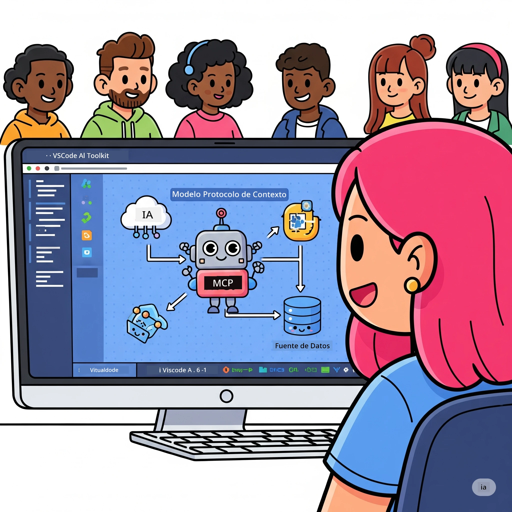
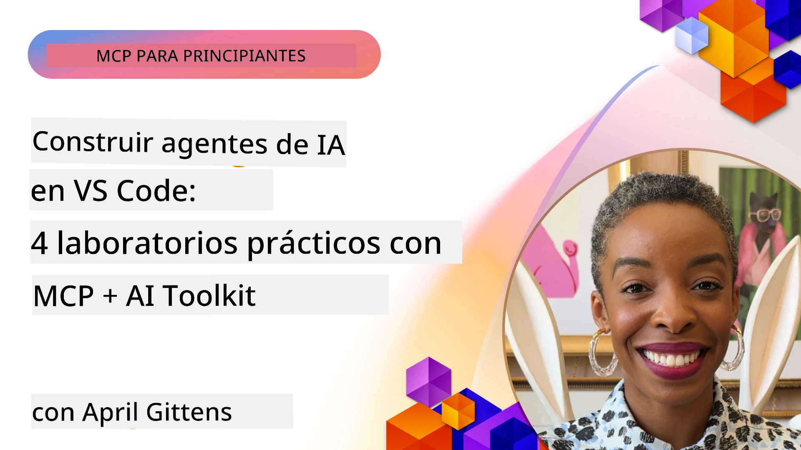

# Simplificando los flujos de trabajo de IA: Construcción de un servidor MCP con Microsoft Foundry Toolkit

## 🎯  Visión general

_(Haz clic en la imagen de arriba para ver el video de esta lección)_

¡Bienvenido al **Taller del Protocolo de Contexto de Modelos (MCP)**! Este completo taller práctico combina dos tecnologías innovadoras para revolucionar el desarrollo de aplicaciones de IA:

> **Nota de compatibilidad:** el código del taller fue construido y probado con MCP
> `2025-11-25`, como se muestra en la insignia arriba. Use la
> [especificación actual `2026-07-28`](https://modelcontextprotocol.io/specification/2026-07-28/)
> para nuevas implementaciones del protocolo y revise las notas de la versión del SDK antes de
> migrar los laboratorios.

- **🔗 Protocolo de Contexto de Modelos (MCP)**: Un estándar abierto para integración fluida de herramientas de IA
- **🛠️ Extensión Microsoft Foundry Toolkit para VS Code**: La poderosa extensión de desarrollo de IA de Microsoft

### 🎓 Lo que aprenderás

Al final de este taller, dominarás el arte de construir aplicaciones inteligentes que conectan modelos de IA con herramientas y servicios del mundo real. Desde pruebas automáticas hasta integraciones personalizadas de API, adquirirás habilidades prácticas para resolver desafíos empresariales complejos.

## 🏗️ Pila tecnológica

### 🔌 Protocolo de Contexto de Modelos (MCP)

MCP es el **"USB-C para IA"**: un estándar universal que conecta modelos de IA con herramientas externas y fuentes de datos.

**✨ Características clave:**

- 🔄 **Integración estandarizada**: Interfaz universal para conexiones de herramientas de IA
- 🏛️ **Arquitectura flexible**: Servidores locales y remotos vía transporte stdio/SSE
- 🧰 **Ecosistema rico**: Herramientas, prompts y recursos en un solo protocolo
- 🔒 **Listo para empresa**: Seguridad y confiabilidad integradas

**🎯 Por qué MCP importa:**
Al igual que USB-C eliminó el caos de cables, MCP elimina la complejidad de las integraciones de IA. Un protocolo, posibilidades infinitas.

### 🤖 Microsoft Foundry Toolkit Extension para VS Code

La extensión principal de desarrollo de IA de Microsoft que transforma VS Code en una potencia de IA.

**🚀 Capacidades principales:**

- 📦 **Catálogo de modelos**: Acceso a modelos de Azure AI, GitHub, Hugging Face, Ollama
- ⚡ **Inferencia local**: Ejecución optimizada ONNX en CPU/GPU/NPU
- 🏗️ **Constructor de agentes**: Desarrollo visual de agentes de IA con integración MCP
- 🎭 **Multimodal**: Soporte para texto, visión y salida estructurada

**💡 Beneficios de desarrollo:**

- Despliegue de modelos sin configuración
- Ingeniería visual de prompts
- Zona de pruebas en tiempo real
- Integración fluida de servidores MCP

## 📚 Trayectoria de aprendizaje

### [🚀 Módulo 1: Fundamentos de Microsoft Foundry Toolkit](./lab1/README.md)

**Duración**: 15 minutos

- 🛠️ Instalar y configurar Microsoft Foundry Toolkit para VS Code
- 🗂️ Explorar el Catálogo de Modelos (más de 100 modelos de GitHub, ONNX, OpenAI, Anthropic, Google)
- 🎮 Dominar el Playground Interactivo para pruebas en tiempo real de modelos
- 🤖 Construir tu primer agente de IA con Agent Builder
- 📊 Evaluar el rendimiento de modelos con métricas integradas (F1, relevancia, similitud, coherencia)
- ⚡ Aprender procesamiento por lotes y capacidades multimodales

**🎯 Resultado de aprendizaje**: Crear un agente de IA funcional con comprensión completa de las capacidades de Microsoft Foundry Toolkit

### [🌐 Módulo 2: MCP con Fundamentos de Microsoft Foundry Toolkit](./lab2/README.md)

**Duración**: 20 minutos

- 🧠 Dominar la arquitectura y conceptos del Protocolo de Contexto de Modelos (MCP)
- 🌐 Explorar el ecosistema de servidores MCP de Microsoft
- 🤖 Construir un agente de automatización de navegador usando el servidor MCP Playwright
- 🔧 Integrar servidores MCP con Microsoft Foundry Toolkit Agent Builder
- 📊 Configurar y probar herramientas MCP dentro de tus agentes
- 🚀 Exportar y desplegar agentes potenciados con MCP para producción

**🎯 Resultado de aprendizaje**: Desplegar un agente de IA supercargado con herramientas externas a través de MCP

### [🔧 Módulo 3: Desarrollo avanzado MCP con Microsoft Foundry Toolkit](./lab3/README.md)

**Duración**: 20 minutos

- 💻 Crear servidores MCP personalizados usando Microsoft Foundry Toolkit
- 🐍 Configurar y usar el SDK Python MCP más reciente (v1.9.3)
- 🔍 Configurar y utilizar MCP Inspector para depuración
- 🛠️ Construir un servidor MCP Clima con flujos de trabajo profesionales de depuración
- 🧪 Depurar servidores MCP en entornos Agent Builder e Inspector

**🎯 Resultado de aprendizaje**: Desarrollar y depurar servidores MCP personalizados con herramientas modernas

### [🐙 Módulo 4: Desarrollo práctico MCP - Servidor personalizado de clonación GitHub](./lab4/README.md)

**Duración**: 30 minutos

- 🏗️ Construir un servidor MCP Clonación GitHub para flujos de trabajo de desarrollo reales
- 🔄 Implementar clonación inteligente de repositorios con validación y manejo de errores
- 📁 Crear gestión inteligente de directorios e integración con VS Code
- 🤖 Usar GitHub Copilot Agent Mode con herramientas MCP personalizadas
- 🛡️ Aplicar confiabilidad lista para producción y compatibilidad multiplataforma

**🎯 Resultado de aprendizaje**: Desplegar un servidor MCP listo para producción que agilice flujos de trabajo reales de desarrollo

## 💡 Aplicaciones e impacto en el mundo real

### 🏢 Casos de uso empresariales

#### 🔄 Automatización DevOps

Transforma tu flujo de trabajo de desarrollo con automatización inteligente:

- **Gestión inteligente de repositorios**: Revisión de código y decisiones de merge impulsadas por IA
- **CI/CD inteligente**: Optimización automática de pipelines basada en cambios de código
- **Triaje de incidencias**: Clasificación automática de bugs y asignación

#### 🧪 Revolución en aseguramiento de calidad

Eleva las pruebas con automatización potenciada por IA:

- **Generación inteligente de pruebas**: Crear suites de prueba completas automáticamente
- **Pruebas de regresión visual**: Detección de cambios UI potenciada por IA
- **Monitoreo de rendimiento**: Identificación y resolución proactiva de problemas

#### 📊 Inteligencia en pipelines de datos

Construye flujos de procesamiento de datos más inteligentes:

- **Procesos ETL adaptativos**: Transformaciones de datos auto-optimizadas
- **Detección de anomalías**: Monitoreo en tiempo real de calidad de datos
- **Ruteo inteligente**: Gestión inteligente del flujo de datos

#### 🎧 Mejora de la experiencia del cliente

Crea interacciones excepcionales con clientes:

- **Soporte con contexto**: Agentes de IA con acceso al historial del cliente
- **Resolución proactiva de problemas**: Servicio predictivo al cliente
- **Integración multicanal**: Experiencia unificada de IA en todas las plataformas

## 🛠️ Prerrequisitos y configuración

### 💻 Requisitos del sistema

| Componente | Requisito | Notas |
|-----------|-------------|-------|
| **Sistema operativo** | Windows 10+, macOS 10.15+, Linux | Cualquier SO moderno |
| **Visual Studio Code** | Última versión estable | Requerido para Microsoft Foundry Toolkit |
| **Node.js** | v18.0+ y npm | Para desarrollo de servidores MCP |
| **Python** | 3.10+ | Opcional para servidores MCP en Python |
| **Memoria** | Mínimo 8GB RAM | Recomendado 16GB para modelos locales |

### 🔧 Entorno de desarrollo

#### Extensiones recomendadas para VS Code

- **Microsoft Foundry Toolkit** (ms-windows-ai-studio.windows-ai-studio)
- **Python** (ms-python.python)
- **Python Debugger** (ms-python.debugpy)
- **GitHub Copilot** (GitHub.copilot) - Opcional pero útil

#### Herramientas opcionales

- **uv**: Gestor moderno de paquetes para Python
- **MCP Inspector**: Herramienta visual de depuración para servidores MCP
- **Playwright**: Para ejemplos de automatización web

## 🎖️ Resultados de aprendizaje y ruta de certificación

### 🏆 Lista de dominio de habilidades

Al completar este taller, lograrás dominio en:

#### 🎯 Competencias núcleo

- [ ] **Dominio del Protocolo MCP**: Profundo entendimiento de arquitectura y patrones de implementación
- [ ] **Competencia en Microsoft Foundry Toolkit**: Uso experto de Microsoft Foundry Toolkit para desarrollo rápido
- [ ] **Desarrollo de servidores personalizados**: Construir, desplegar y mantener servidores MCP en producción
- [ ] **Excelencia en integración de herramientas**: Conectar IA con flujos de trabajo de desarrollo existentes sin problemas
- [ ] **Aplicación en resolución de problemas**: Aplicar habilidades aprendidas a desafíos empresariales reales

#### 🔧 Habilidades técnicas

- [ ] Configurar Microsoft Foundry Toolkit en VS Code
- [ ] Diseñar e implementar servidores MCP personalizados
- [ ] Integrar modelos GitHub con arquitectura MCP
- [ ] Construir flujos de trabajo de pruebas automáticas con Playwright
- [ ] Desplegar agentes de IA para uso en producción
- [ ] Depurar y optimizar rendimiento de servidores MCP

#### 🚀 Capacidades avanzadas

- [ ] Arquitectura de integraciones IA a escala empresarial
- [ ] Implementar las mejores prácticas de seguridad para aplicaciones IA
- [ ] Diseñar arquitecturas escalables para servidores MCP
- [ ] Crear cadenas de herramientas personalizadas para dominios específicos
- [ ] Mentoría en desarrollo nativo IA

## 📖 Recursos adicionales

- [Especificación MCP (2026-07-28)](https://modelcontextprotocol.io/specification/2026-07-28/)
- [Repositorio GitHub Microsoft Foundry Toolkit](https://github.com/microsoft/vscode-ai-toolkit)
- [Colección de servidores MCP de ejemplo](https://github.com/modelcontextprotocol/servers)
- [Guía de mejores prácticas](https://modelcontextprotocol.io/docs/best-practices)
- [OWASP MCP Top 10](https://microsoft.github.io/mcp-azure-security-guide/mcp/) - Mejores prácticas de seguridad

---

**🚀 ¿Listo para revolucionar tu flujo de trabajo de desarrollo en IA?**

¡Construyamos juntos el futuro de las aplicaciones inteligentes con MCP y Microsoft Foundry Toolkit!

## Qué sigue

Continúa a: [Módulo 11: Laboratorios prácticos de servidor MCP](../11-MCPServerHandsOnLabs/README.md)

---

<!-- CO-OP TRANSLATOR DISCLAIMER START -->
**Descargo de responsabilidad**:
Este documento ha sido traducido utilizando el servicio de traducción automática [Co-op Translator](https://github.com/Azure/co-op-translator). Aunque nos esforzamos por la precisión, tenga en cuenta que las traducciones automatizadas pueden contener errores o inexactitudes. El documento original en su idioma nativo debe considerarse la fuente autorizada. Para información crítica, se recomienda una traducción profesional humana. No somos responsables de cualquier malentendido o interpretación errónea que surja del uso de esta traducción.
<!-- CO-OP TRANSLATOR DISCLAIMER END -->